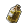
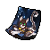

##  臭鼬．沃爾特

|體質|力量|敏捷|智力|
|:--:|:--:|:--:|:--:|
|4|4|5|7|

### 簡介

一只散發著“強烈”味道的臭鼬，入獄之前的職業是一名高中化學教師，但同時也擁有著名牌大學的化學制藥博士學位。你得知他正在用自己的臭液偷偷研發一種新藥，而制藥的目的則是用來還“債”。他邀請你當他的實驗助手，正巧你對這個藥的用途也充滿了好奇…

### 故事

沃爾特從學生時代就對化學充滿了興趣，而他在化學上的天賦也幫他收獲了事業和愛情。安娜是他的實驗室助手，他們在課題的研究中擦出了愛的火花，并很快擁有了家庭。

不過可能是在實驗室里工作的時間太久，安娜患上了肺病。為了妻子的健康，他們舉家搬去了鄉下的小鎮，因為傳說那里的空氣可治療百病。而沃爾特為了能夠照顧妻子，也辭去了城里化學實驗室的高薪工作，改為在小鎮的高中做一名化學老師。

但傳說也只是傳說而已，雖然小鎮的空氣清新無比，但安娜的病情還是日漸加重了。去醫院深度檢查后才發現，這是一種罕見的基因疾病，只能依靠昂貴的藥物來控制病情。安娜勸說沃爾特放棄治療，她不想因為自己把家庭拖垮。但妻子越是善解人意，沃爾特越是難以割舍對她的愛…

錢！現在只要有足夠的錢就能拯救妻子！沃爾特絞盡腦汁最終想到了一個方法，那就是憑借自己的化學知識制造違禁藥品。他從學校偷來了化學藥劑，很快就在車庫里做出了一批“好貨”。隨后他帶著藥品去到黑市兜售，一晚就賺到了妻子一個月的治療費。

但紙是包不住火的，安娜慢慢覺察到了異常，并質問沃爾特家中巨款的由來。沃爾特或許是個化學高手，但在說謊方面卻缺少天賦，沒過多久他就把自己制藥販賣的事情說了出來。安娜是個虔誠的森林教徒，她不愿因為自己一個的生存而傷害到別人。于是她拒絕繼續接受治療，如果沃爾特依然賺的是這種“血錢”。

沃爾特無法改變妻子的想法，但他仍然不愿放棄。“既然安娜不想傷害別人，那我就犧牲自己吧。”沃爾特隨后前往了警察局自首，并且和警方達成了一筆交易：如果他幫助警方端掉整個黑市的藥品販賣網絡，那警方就要幫他支付妻子日后的治療費用。

抓捕行動很成功，藥品黑市一夜之間不復存在。雖然沃爾特依然要為自己制藥販賣的罪行坐牢，但他的心情卻無比輕松。因為安娜告訴自己，她會積極的接受治療，等待團聚的那一天。

### 結識對話

- （一股臭味撲鼻而來）這是…
- **熏到你了嗎…？真是抱歉。**
- {pain1}
- 這究竟是什么味道…
- 糞池…泄漏了嗎？
- **如你所見我是只==臭鼬==，而我剛從腺體里收集了點“精華”。**
- **不過，因為裝瓶時不小心沾了點在周圍的毛上…所以聞起來有些不體面。**
- 裝瓶？你們的==臭液==不是在遇險時當做武器用的嗎？
- **通常來說是這樣，可我收集這些卻另有他用…**
- {question1}
- **自我介紹一下，我叫==沃爾特==，入獄前是一名化學老師。**
- **我最近從自己的臭液萃取物中發現了一種“特殊物質”。**
- **用它來合成新藥，或許能幫我還掉以前欠下的那些“債”。**
- 還債？你說的==新藥==該不會是…
- **別猜了…試驗完成前，我不想透露太多細節。**
- **不過如果你感興趣的話，或許可以做我的助手…**
- **我向你保證，這件工作絕對不會讓你變“臭”。**

### 深入了解對話

- 嗨\~你上次請我做助手的事，我考慮好了。
- **是嗎？那很好，不過我得先提醒你，這活可能有點危險。**
- 什么危險…？
- 我可不是膽小鬼。
- **吶\~你作為實驗助手的主要工作就是“試藥”。**
- {question1}
- **因為新藥里的一些化學反應還不明朗，所以沒準會出現中毒的癥狀…**
- **如果你沒有足夠頑強的==體質==，還是打消這個念頭吧。**

#### 你別小看我的==體質==。

> 藥水惡心的味道讓你頭暈，還好他通過不斷的聊天來幫你保持清醒。

- 再毒的毒藥，都別想輕易要了我的命。
- **既然你這么說，我就放心了。那就讓我們開始吧…**
- *無法想象這是個化學老師的故事…*
- 安娜現在的情況如何？治療還順利嗎？
- **可能是“森林之父”真的給予了庇佑…**
- **她的病情奇跡般的好轉了，我想這就是善良的力量吧。**
- 那你能告訴我，你現在做的新藥究竟是什么嗎？
- 你不會還在偷偷做那些…
- **抱歉，我暫時還不能透露新藥的用途。**
- **不過你放心，我答應過安娜不會再做你以為的那些東西了。**
- **這可是我和她之間的約定…**

#### 取消

- *聽他說的這么可怕，我這單薄的身子骨會不會撐不住？*
- *以防萬一，我還是把體質提升到==8點==再來吧…*
### 初始物品

|物品名稱|物品名稱|物品名稱|物品名稱|物品名稱|
|:--:|:--:|:--:|:--:|:--:|
|  |  |  |  |  |
| 眼鏡 | 護身符 | 蘑菇*2 | 瀉藥*2 | 安眠藥*2 |
|  |  |  |  |  |
| 醫用酒精*2 | 止疼片*2 | 興奮劑*2 | 鎮靜劑*2 |  |
### 送禮

|圖片|物品名稱|好感|回應|
|:--:|--|:--:|--|
||運動鞋|0|謝謝你的禮物，我想我會用到它的。|
||皮鞋|0|謝謝你的禮物，我想我會用到它的。|
||帆布鞋|0|謝謝你的禮物，我想我會用到它的。|
||拖鞋|0|謝謝你的禮物，我想我會用到它的。|
||墨鏡|0|謝謝你的禮物，我想我會用到它的。|
||眼鏡|2|這度數剛好合適，實在是太感謝了。|
||頭帶|-1|這是件好禮物…只是，不太適合我。|
||棒球帽|0|謝謝你的禮物，我想我會用到它的。|
||毛線帽|0|謝謝你的禮物，我想我會用到它的。|
||紅頭巾|-1|這是件好禮物…只是，不太適合我。|
||綠頭巾|-1|這是件好禮物…只是，不太適合我。|
||橡膠手套|1|我正需要用它來混合新的藥劑。|
||黑手|-1|我知道這是干嘛用的，我想我應該用不著它…|
||手表|1|準確的時間能幫我更好的分析實驗數據。|
||護身符|2|愿森林之父能用晨露滌凈我們的罪責。|
||牙齒項鏈|-1|這是件好禮物…只是，不太適合我。|
||《死靈之書》|-1|神秘學…往往都是沒有價值的偽科學。|
||自制口罩|2|你猜我能不能聞到自己的臭味？答案是…會。|
||隨身聽（開機）|0|謝謝你的禮物，我想我會用到它的。|
||隨身聽（關機）|0|謝謝你的禮物，我想我會用到它的。|
||隨身聽（沒電）|0|謝謝你的禮物，我想我會用到它的。|
||酒葫蘆|0|謝謝你的禮物，我想我會用到它的。|
||黑桃A|-1|貪婪是自掘墳墓的鐵鍬…|
||薄荷葉|1|這正是我需要的新鮮草藥…|
||薄荷葉卷|0|謝謝你的禮物，我想我會用到它的。|
||蘑菇|1|這正是我需要的新鮮草藥…|
||蘑菇粉|1|顆粒足夠細膩…這是不錯的材料。|
||瀉藥|0|謝謝你的禮物，我想我會用到它的。|
||紫鳶花|1|這正是我需要的新鮮草藥…|
||花瓣粉|1|顆粒足夠細膩…這是不錯的材料。|
||安眠藥|0|謝謝你的禮物，我想我會用到它的。|
||止疼片|0|謝謝你的禮物，我想我會用到它的。|
||興奮劑|0|謝謝你的禮物，我想我會用到它的。|
||醫用酒精|1|我正需要用它來混合新的藥劑。|
||酒精燈|2|一盞酒精燈…你這可幫了我的大忙了。|
||鎮靜劑|0|謝謝你的禮物，我想我會用到它的。|
||啤酒|0|謝謝你的禮物，我想我會用到它的。|
||蘋果酒|0|謝謝你的禮物，我想我會用到它的。|
||精釀蘋果酒|0|謝謝你的禮物，我想我會用到它的。|
||蘋果|0|謝謝你的禮物，我想我會用到它的。|
||華夫餅|0|謝謝你的禮物，我想我會用到它的。|
||奶油華夫餅|0|謝謝你的禮物，我想我會用到它的。|
||一把咖啡豆|0|謝謝你的禮物，我想我會用到它的。|
||口香糖|1|但愿這能遮住一點臭味…|
||曲奇餅干|0|謝謝你的禮物，我想我會用到它的。|
||焦糖棒|0|謝謝你的禮物，我想我會用到它的。|
||汽水|0|謝謝你的禮物，我想我會用到它的。|
||酸奶|0|謝謝你的禮物，我想我會用到它的。|
||土豆披薩|0|謝謝你的禮物，我想我會用到它的。|
||咖啡粉|0|謝謝你的禮物，我想我會用到它的。|
||茶包|1|我或許可以在新藥里加上一點…茶葉？|
||泡面|0|謝謝你的禮物，我想我會用到它的。|
||蛋白粉|0|謝謝你的禮物，我想我會用到它的。|
||布條|0|謝謝你的禮物，我想我會用到它的。|
||回形針|0|謝謝你的禮物，我想我會用到它的。|
||開鎖器|-1|貪婪是自掘墳墓的鐵鍬…|
||開鎖器(P)|-1|貪婪是自掘墳墓的鐵鍬…|
||肥皂|1|但愿這能遮住一點臭味…|
||香皂|2|不得不說，這的確是我最需要的東西…|
||計算器|0|謝謝你的禮物，我想我會用到它的。|
||《花花世界》（全新）|-1|抱歉，我對這個不太感興趣…|
||《花花世界》（看過）|-1|抱歉，我對這個不太感興趣…|
||《花花世界》（翻爛）|-1|抱歉，我對這個不太感興趣…|
||馬女郎海報|-1|抱歉，我對這個不太感興趣…|
||貓女郎海報|-1|抱歉，我對這個不太感興趣…|
||狐女郎海報|-1|抱歉，我對這個不太感興趣…|
||兔女郎海報|-1|抱歉，我對這個不太感興趣…|
||咖啡磨|1|謝謝，我正需要用它來研磨草藥。|
||掌上游戲機|-1|抱歉，我對這個不太感興趣…|
||掌上游戲機（沒電）|-1|抱歉，我對這個不太感興趣…|
||電池|0|謝謝你的禮物，我想我會用到它的。|
||牙刷|0|謝謝你的禮物，我想我會用到它的。|
||牙膏|0|謝謝你的禮物，我想我會用到它的。|
||空的牙膏管|0|謝謝你的禮物，我想我會用到它的。|
||消毒液|1|但愿這能遮住一點臭味…|
||除銹劑|-1|我想…我可能用不著這個。|
||火柴|0|謝謝你的禮物，我想我會用到它的。|
||膠帶|-1|我想…我可能用不著這個。|
||顏料|0|謝謝你的禮物，我想我會用到它的。|
||釘子|-1|我想…我可能用不著這個。|
||鞋帶|-1|我想…我可能用不著這個。|
||白紙|0|謝謝你的禮物，我想我會用到它的。|
||紙鶴|1|我想它應該能帶來健康。|
||花束|-1|我想你可能弄錯了送花的對象…|
||胡亂的涂鴉|-1|這畫實在是太過抽象了…|
||簡單的漫畫|0|謝謝你的禮物，我想我會用到它的。|
||精美的畫作|1|這真是一幅能夠愉悅心情的畫作。|
||鉛筆|0|謝謝你的禮物，我想我會用到它的。|
||鉛筆|0|謝謝你的禮物，我想我會用到它的。|
||圓珠筆|0|謝謝你的禮物，我想我會用到它的。|
||圓珠筆|0|謝謝你的禮物，我想我會用到它的。|
||硬幣|0|謝謝你的禮物，我想我會用到它的。|
||長螺絲|-1|私藏這種違禁品可不是個好主意。|
||扳手|-1|私藏這種違禁品可不是個好主意。|
||湯匙|0|謝謝你的禮物，我想我會用到它的。|
||湯匙|0|謝謝你的禮物，我想我會用到它的。|
||釘錘|-1|私藏這種違禁品可不是個好主意。|
||剪刀|-1|私藏這種違禁品可不是個好主意。|
||碎玻璃|-1|我想…我可能用不著這個。|
||玻璃匕首|-2|這種危險的東西，我還是找機會丟掉好了。|
||玻璃匕首(+)|-2|這種危險的東西，我還是找機會丟掉好了。|
||牙刷匕首|-2|這種危險的東西，我還是找機會丟掉好了。|
||牙刷匕首(+)|-2|這種危險的東西，我還是找機會丟掉好了。|
||水果刀|-1|私藏這種違禁品可不是個好主意。|
||折斷的木條|-1|我想…我可能用不著這個。|
||雙節棍|-1|私藏這種違禁品可不是個好主意。|
||雙節棍(+)|-1|私藏這種違禁品可不是個好主意。|
||釘棒|-2|這種危險的東西，我還是找機會丟掉好了。|
||釘棒(+)|-2|這種危險的東西，我還是找機會丟掉好了。|
||鐵管|-1|私藏這種違禁品可不是個好主意。|
||皮帶|0|謝謝你的禮物，我想我會用到它的。|
||皮帶|0|謝謝你的禮物，我想我會用到它的。|
||發霉的面包|-2|…這是什么惡作劇嗎？|
||金龜子|2|這金色的小家伙或許能帶來好運。|
||《森之音》|2|愿森林之父能用晨露滌凈我們的罪責。|
||DEMO限定紙鶴|2|那就加上好感度吧…正好我也需要你的幫忙。|

