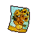
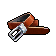

#  蜜獾．麥克斯

|體質|力量|敏捷|智力|幫派|戰鬥等級|勒索難度|持有天賦|取得天賦|
|:--:|:--:|:--:|:--:|:--:|:--:|:--:|:--:|:--:|
|7|6|7|6|黑爪幫幹部|強|難|[鬥士](技能.md#鬥士)、[歹徒](技能.md#歹徒)|[暗器](技能.md#暗器)|

## 故事

一只留著白色平頭的蜜獾，監獄外號“地雷”！擁有和名字一樣的火爆脾氣，稍一對眼便會火冒三丈。非常在意別人對他身高的看法，自詡打起架來絕對不輸大個子。

麥克斯出身於軍人世家，他的祖父、父親、叔叔都是戰場上的英雄。麥克斯從小耳濡目染，立志成為一名在戰場上立下功勛的軍人。在經歷了數年的艱苦訓練後，麥克斯終於如願以償的加入了著名的三腳貓特種部隊，並被派往國外執行軍事行動。

可真實的戰爭卻和麥克斯想象的不同，既沒有英雄式的登場，也沒有酣暢淋漓的戰鬥。有的只剩淪為廢墟的城市，廢墟中哭泣的孩子，還有漫天的沙塵，和不知從哪裡打出的冷槍。死亡的恐懼讓身邊的戰友們漸漸變得麻木、冷酷、殘忍無情。

在一次突擊任務中，麥克斯所在的小隊端掉了一個敵軍據點。在打掃戰場時，麥克斯發現了據點地下隱藏的密室，裡面存放了大量的黃金。

“嘿\~我們該把這筆錢分了，不是嗎？就當我們的精神損失費了。”野牛·尼克笑道。“喂\~別做美夢了，伙計。你沒看到這幾個俘虜嗎？他會把這事抖出去的。”豪豬·史蒂夫提醒他。“或許我們可以和他們做個交易？比如讓他們滾蛋。”麥克斯想了個自以為不錯的點子。“小子，他們會去找記者，曝光我們，而且媒體還會添油加醋。”隊長駝鹿·邁克爾否定了這個提議。“難道說我們就老老實實的把這箱金子上交出去？便宜那群坐辦公室的蠢豬？！”尼克叫罵了起來。“不，要讓他們閉嘴很簡單…因為死掉的動物可不會說話。”沒等眾人反應過來，邁克爾便開槍打爆了一名俘虜的頭…

之後他命令小隊成員每人干掉一個俘虜，這能讓他們互相之間握有把柄，以防今後出現什麼“良心發現”的叛徒。尼克猶豫片刻後照做了，因為他需要一筆錢寄給家裡懷孕的老婆。但麥克斯饑和史蒂夫卻遲遲沒能動手，因為在他們的心裡還有著一絲榮譽可言。

“我退出。我的那份錢你們拿去好了，我來這裡不是做劊子手的。”史蒂夫說完便向門口走去。但一顆子彈卻毫無征兆的打穿了他的後背！利欲熏心的邁克爾此時已陷入了瘋狂。

槍戰在狹小的密室內爆發！麥克斯決定幫助受傷的史蒂夫。他先是在史蒂夫的掩護下擊斃了尼克，隨後和邁克爾展開了肉搏戰。雖然蜜獾的個頭在駝鹿面前就如同一個玩具，但麥克斯依然憑借自己靈活的身手在纏斗中爬上了邁克爾的後背，最終用尖牙咬斷了這個混蛋的脖子！

戰鬥結束了，可憐的史蒂夫因為失血過多而死，而那兩個僥幸生還的戰俘也趁亂逃離了密室。現在整箱黃金都是麥克斯的了，但他卻一點也開心不起來。

麥克斯把黃金在黑市換成了現金，並分成四份，分別寄給了自己、史蒂夫、尼克、還有邁克爾的家人們。幾天之後，調查組找到了麥克斯，就像邁克爾預料的一樣，那兩個逃跑的戰俘把密室內發生的事情告訴了媒體。三腳貓特種部隊的丑聞震驚全國，而麥克斯也因私吞繳獲物資而被軍事法庭判罪。

## 結識對話

- **喂\~！你這家伙剛剛是不是瞅我了？！**
- {question1}
- **你是不是看我個子矮，所以就敢小瞧我？！**
- **{upset1}**
- :point_right:你的個頭的確不算高…
- :point_right:你也有點太自卑了吧？
- **你要是覺得和小個子打架一定能贏，那就大錯特錯了！**
- **知道我`蜜獾·麥克斯`的外號為什麼叫“地雷”嗎？**
- **因為不管多大個子的家伙，只要敢踩在我頭上，我準會叫他粉身碎骨！**
- **{angry1}**
- *他這個爆脾氣，叫“地雷”可真是叫對了…*

## 深入了解對話

- **喂\~怎麼又是你？你就沒點自己的事情可做嗎？**
- 我只是想隨便聊聊，別真像個“地雷”一樣，一碰就炸。
- **怎麼？你在嘲笑我的外號嗎？**
- 其實“地雷”聽上去挺酷的，你該感謝送你外號的家伙…
- **這是特戰隊裡的伙計們給我起的，我們還有叫手雷、重炮、和火箭的…**
- 特戰隊？這麼說來你原來是個大兵？
- **沒錯，我在`三腳貓特種部隊`服役過，參加過幾次國際行動。**
- 我真想采訪一下你，我聽說你們有那種超級運輸機，是嗎？
- **切\~那就是個會飛的鐵罐頭，待在裡面就和`關禁閉`一樣。**

#### 我待過監獄的`禁閉室`。

> 他和你聊起了軍隊裡的日子，還告訴了你自己為什麼會進監獄。

- 那感覺的確糟透了…
- **我告訴你，運輸機只是個開始而已，等到了目的地還有更遭罪的…**
- *他的經歷比我想象中還殘酷…*
- 你為什麼還要把錢寄去隊長家裡，他可是差點要了你的命。
- **你不明白，戰爭會扭曲靈魂，把好人逼瘋。**
- **那家伙也只是個受害者而已…**
- {down1}

#### 取消

- {think1}
- 我暫時還沒待過`禁閉室`…想象不出那是種什麼感覺。
- **呵\~我就知道和你這種菜鳥沒什麼好聊的。**
- *難道…我得`關次禁閉`才能和他有共同話題？*
- {sweat1}

## 特殊對話

### 打招呼（關係極好）

- **你沒別的事可做了嗎？**

### 打招呼（關係好）

- **喂！你是不是又瞅我了？**

### 打招呼（關係一般）

- **喂\~你愁啥？**

### 打招呼（關係差）

- **小心點，別給自己惹麻煩。**

### 打招呼（關係極差）

- **我討厭滿嘴屁話的家伙，你是嗎？**

### 進行毆打

- **想找茬嗎？我看你是活得不耐煩了！**
- **想打贏我，你最好多找點幫手！**
- **等著被“地雷”炸飛吧，混蛋！**

### 回禮

- **還有，你把這東西拿去吧，我暫時用不上。**

### 勒索成功

- **你敢威脅我？很好！非常好！等著，我會讓你知道什麼叫後悔的！**
- **{hate1}**

### 勒索失敗

- **你這白癡，要是再敢在我面前“放屁”的話，我可不會饒了你。**
- **{hate1}**

### 一起吃飯被拒

- **我數1\~2\~3，你最好從我眼前消失，聽到嗎？**
- **{upset1}**

### 分享食物

- **囉囉嗦嗦\~你干脆把整份都給我好了！**

### 加藥被發現

- **混蛋！你的手裡是什麼？！**

### 加藥辯解失敗

- **調料？！最好他媽的是這樣！**

### 索要食物成功

- **哈\~你是不是覺得，我盤子的飯看起來特別香？**

### 索要食物失敗

- **閉嘴吧！趁我還沒發火之前！**

## 聊天

- **你如果想讓我心平氣和的和你聊上兩句，那最好提前給我一根薄荷葉卷。**
- **你知道，這是為什麼嗎？**
- {question1}
- **因為如果你說錯了話，我至少騰不出嘴去咬你的脖子。**
- {sweat1}

## 初始物品

||||||
|:--:|:--:|:--:|:--:|:--:|
||||||
|[運動鞋](14-運動鞋.md)|[牙齒項鏈](30-牙齒項鏈.md)|[折斷的木條](159-折斷的木條.md)|[釘棒](162-釘棒.md)|[釘錘](151-釘錘.md)|
||||||
|[薄荷葉卷](41-薄荷葉卷.md)*2|[啤酒](54-啤酒.md)|[火柴](120-火柴.md)*4|[釘子](123-釘子.md)*3||

## 送禮

|圖片|物品名稱|好感|回應|
|:--:|--|:--:|--|
||[DEMO限定紙鶴](209-DEMO限定紙鶴.md)|50|竟然用這種小手段…你這家伙可…真讓人…喜歡。|
||[牙齒項鏈](30-牙齒項鏈.md)|24|戰勝恐懼的最好方法就是，面對它。|
||[釘錘](151-釘錘.md)|24|我說，你早該把這個拿出來了。|
||[金龜子](202-金龜子.md)|20|哈\~金色傳說！|
||[運動鞋](14-運動鞋.md)|18|呵\~這還有點禮物的樣子。|
||[手錶](27-手錶.md)|18|呵\~這還有點禮物的樣子。|
||[馬女郎海報](105-馬女郎海報.md)|18|呵\~這還有點禮物的樣子。|
||[貓女郎海報](106-貓女郎海報.md)|18|呵\~這還有點禮物的樣子。|
||[狐女郎海報](107-狐女郎海報.md)|18|呵\~這還有點禮物的樣子。|
||[兔女郎海報](108-兔女郎海報.md)|18|呵\~這還有點禮物的樣子。|
||[扳手](142-扳手.md)|18|呵\~這還有點禮物的樣子。|
||[皮鞋](15-皮鞋.md)|15|呵\~這還有點禮物的樣子。|
||[墨鏡](18-墨鏡.md)|15|呵\~這還有點禮物的樣子。|
||[酒葫蘆](37-酒葫蘆.md)|15|呵\~這還有點禮物的樣子。|
||[水果刀](158-水果刀.md)|15|呵\~這還有點禮物的樣子。|
||[雙節棍(+)](161-雙節棍(+).md)|15|呵\~這還有點禮物的樣子。|
||[棒球帽](21-棒球帽.md)|12|喂\~你打算用這個跟我套近乎嗎？|
||[紅頭巾](23-紅頭巾.md)|12|這頭巾讓我想起了一部電影…叫什麼來著？|
||[綠頭巾](24-綠頭巾.md)|12|…這種保護色能讓你在戰場上活命。|
||[隨身聽（開機）](34-隨身聽（開機）.md)|12|喂\~你打算用這個跟我套近乎嗎？|
||[隨身聽（關機）](35-隨身聽（關機）.md)|12|喂\~你打算用這個跟我套近乎嗎？|
||[隨身聽（沒電）](36-隨身聽（沒電）.md)|12|喂\~你打算用這個跟我套近乎嗎？|
||[薄荷葉卷](41-薄荷葉卷.md)|12|在戰場上，這玩意兒就和子彈一樣重要。|
||[精釀蘋果酒](56-精釀蘋果酒.md)|12|呵\~這還有點禮物的樣子。|
||[蛋白粉](79-蛋白粉.md)|12|我說，你早該把這個拿出來了。|
||[《花花世界》（全新）](102-《花花世界》（全新）.md)|12|呵\~這還有點禮物的樣子。|
||[掌上遊戲機](110-掌上遊戲機.md)|12|喂\~你打算用這個跟我套近乎嗎？|
||[掌上遊戲機（沒電）](111-掌上遊戲機（沒電）.md)|12|喂\~你打算用這個跟我套近乎嗎？|
||[雙節棍](160-雙節棍.md)|12|呵\~這還有點禮物的樣子。|
||[頭帶](20-頭帶.md)|10|喂\~你打算用這個跟我套近乎嗎？|
||[啤酒](54-啤酒.md)|9|呵\~這還有點禮物的樣子。|
||[蘋果酒](55-蘋果酒.md)|9|呵\~這還有點禮物的樣子。|
||[帆布鞋](16-帆布鞋.md)|8|喂\~你打算用這個跟我套近乎嗎？|
||[毛線帽](22-毛線帽.md)|8|喂\~你打算用這個跟我套近乎嗎？|
||[黑手](26-黑手.md)|8|喂\~你打算用這個跟我套近乎嗎？|
||[酒精燈](52-酒精燈.md)|8|喂\~你打算用這個跟我套近乎嗎？|
||[奶油華夫餅](68-奶油華夫餅.md)|8|喂\~你打算用這個跟我套近乎嗎？|
||[土豆披薩](75-土豆披薩.md)|8|喂\~你打算用這個跟我套近乎嗎？|
||[咖啡磨](109-咖啡磨.md)|8|喂\~你打算用這個跟我套近乎嗎？|
||[精美的畫作](130-精美的畫作.md)|8|喂\~你打算用這個跟我套近乎嗎？|
||[剪刀](152-剪刀.md)|8|喂\~你打算用這個跟我套近乎嗎？|
||[釘棒(+)](163-釘棒(+).md)|8|喂\~你打算用這個跟我套近乎嗎？|
||[皮帶](166-皮帶.md)|8|喂\~你打算用這個跟我套近乎嗎？|
||[皮帶](167-皮帶.md)|8|喂\~你打算用這個跟我套近乎嗎？|
||[橡膠手套](25-橡膠手套.md)|6|喂\~你打算用這個跟我套近乎嗎？|
||[薄荷葉](40-薄荷葉.md)|6|呼\~不嚼點東西真是渾身難受。|
||[瀉藥](44-瀉藥.md)|6|喂\~你打算用這個跟我套近乎嗎？|
||[興奮劑](50-興奮劑.md)|6|喂\~你打算用這個跟我套近乎嗎？|
||[鎮靜劑](53-鎮靜劑.md)|6|喂\~你打算用這個跟我套近乎嗎？|
||[華夫餅](67-華夫餅.md)|6|喂\~你打算用這個跟我套近乎嗎？|
||[超辣泡麵](78-超辣泡麵.md)|6|喂\~你打算用這個跟我套近乎嗎？|
||[《花花世界》（看過）](103-《花花世界》（看過）.md)|6|喂\~你打算用這個跟我套近乎嗎？|
||[紙鶴](126-紙鶴.md)|6|喂\~你打算用這個跟我套近乎嗎？|
||[長螺絲](136-長螺絲.md)|6|喂\~你打算用這個跟我套近乎嗎？|
||[玻璃匕首(+)](155-玻璃匕首(+).md)|6|喂\~你打算用這個跟我套近乎嗎？|
||[牙刷匕首(+)](157-牙刷匕首(+).md)|6|喂\~你打算用這個跟我套近乎嗎？|
||[釘棒](162-釘棒.md)|6|喂\~你打算用這個跟我套近乎嗎？|
||[鐵管](164-鐵管.md)|6|喂\~你打算用這個跟我套近乎嗎？|
||[黑桃A](39-黑桃A.md)|4|喂\~你打算用這個跟我套近乎嗎？|
||[蘑菇](42-蘑菇.md)|4|喂\~你打算用這個跟我套近乎嗎？|
||[蘑菇粉](43-蘑菇粉.md)|4|喂\~你打算用這個跟我套近乎嗎？|
||[花瓣粉](46-花瓣粉.md)|4|喂\~你打算用這個跟我套近乎嗎？|
||[安眠藥](47-安眠藥.md)|4|喂\~你打算用這個跟我套近乎嗎？|
||[止疼片](49-止疼片.md)|4|喂\~你打算用這個跟我套近乎嗎？|
||[醫用酒精](51-醫用酒精.md)|4|喂\~你打算用這個跟我套近乎嗎？|
||[蘋果](64-蘋果.md)|4|喂\~你打算用這個跟我套近乎嗎？|
||[一把咖啡豆](69-一把咖啡豆.md)|4|喂\~你打算用這個跟我套近乎嗎？|
||[焦糖棒](72-焦糖棒.md)|4|喂\~你打算用這個跟我套近乎嗎？|
||[汽水](73-汽水.md)|4|喂\~你打算用這個跟我套近乎嗎？|
||[酸奶](74-酸奶.md)|4|喂\~你打算用這個跟我套近乎嗎？|
||[咖啡粉](76-咖啡粉.md)|4|喂\~你打算用這個跟我套近乎嗎？|
||[茶包](77-茶包.md)|4|喂\~你打算用這個跟我套近乎嗎？|
||[《花花世界》（翻爛）](104-《花花世界》（翻爛）.md)|4|喂\~你打算用這個跟我套近乎嗎？|
||[玻璃匕首](154-玻璃匕首.md)|4|喂\~你打算用這個跟我套近乎嗎？|
||[牙刷匕首](156-牙刷匕首.md)|4|喂\~你打算用這個跟我套近乎嗎？|
||[口香糖](70-口香糖.md)|3|呼\~不嚼點東西真是渾身難受。|
||[曲奇餅乾](71-曲奇餅乾.md)|2|喂\~你打算用這個跟我套近乎嗎？|
||[火柴](120-火柴.md)|2|喂\~你打算用這個跟我套近乎嗎？|
||[釘子](123-釘子.md)|2|喂\~你打算用這個跟我套近乎嗎？|
||[迴紋針](86-迴紋針.md)|-2|就這…？這也能叫禮物？|
||[電池](114-電池.md)|-2|就這…？這也能叫禮物？|
||[顏料](122-顏料.md)|-2|就這…？這也能叫禮物？|
||[開鎖器](87-開鎖器.md)|-4|就這…？這也能叫禮物？|
||[開鎖器(P)](38-開鎖器(P).md)|-4|就這…？這也能叫禮物？|
||[肥皂](88-肥皂.md)|-4|就這…？這也能叫禮物？|
||[牙刷](115-牙刷.md)|-4|就這…？這也能叫禮物？|
||[牙膏](116-牙膏.md)|-4|就這…？這也能叫禮物？|
||[鉛筆](131-鉛筆.md)|-4|就這…？這也能叫禮物？|
||[鉛筆](132-鉛筆.md)|-4|就這…？這也能叫禮物？|
||[湯匙](143-湯匙.md)|-4|就這…？這也能叫禮物？|
||[湯匙](144-湯匙.md)|-4|就這…？這也能叫禮物？|
||[簡單的漫畫](129-簡單的漫畫.md)|-6|就這…？這也能叫禮物？|
||[拖鞋](17-拖鞋.md)|-8|就這…？這也能叫禮物？|
||[自製口罩](32-自製口罩.md)|-8|就這…？這也能叫禮物？|
||[香皂](89-香皂.md)|-8|就這…？這也能叫禮物？|
||[計算機](101-計算機.md)|-8|喂\~你覺得我會需要這個嗎？|
||[圓珠筆](133-圓珠筆.md)|-8|就這…？這也能叫禮物？|
||[圓珠筆](134-圓珠筆.md)|-8|就這…？這也能叫禮物？|
||[眼鏡](19-眼鏡.md)|-10|喂\~你覺得我會需要這個嗎？|
||[護身符](29-護身符.md)|-10|戰場教會了我一件事，只有自己才能保護自己！|
||[《死靈之書》](31-《死靈之書》.md)|-12|喂\~這是什麼鬼東西？|
||[布條](84-布條.md)|-20|喂\~我警告你，別再給我這些破爛了！|
||[空的牙膏管](117-空的牙膏管.md)|-20|喂\~我警告你，別再給我這些破爛了！|
||[消毒液](118-消毒液.md)|-20|喂\~我警告你，別再給我這些破爛了！|
||[除銹劑](119-除銹劑.md)|-20|喂\~我警告你，別再給我這些破爛了！|
||[膠帶](121-膠帶.md)|-20|喂\~我警告你，別再給我這些破爛了！|
||[鞋帶](124-鞋帶.md)|-20|喂\~我警告你，別再給我這些破爛了！|
||[白紙](125-白紙.md)|-20|喂\~我警告你，別再給我這些破爛了！|
||[碎玻璃](153-碎玻璃.md)|-20|喂\~我警告你，別再給我這些破爛了！|
||[折斷的木條](159-折斷的木條.md)|-20|喂\~我警告你，別再給我這些破爛了！|
||[紫鳶花](45-紫鳶花.md)|-40|你是在挑釁我嗎？混蛋！|
||[胡亂的塗鴉](128-胡亂的塗鴉.md)|-40|喂\~我警告你，別再給我這些破爛了！|
||[硬幣](135-硬幣.md)|-40|喂！我看起來像是乞丐嗎？！|
||[發霉的麵包](200-發霉的麵包.md)|-40|喂\~我警告你，別再給我這些破爛了！|
||[花束](127-花束.md)|-80|你是在挑釁我嗎？混蛋！|
||[《森之音》](203-《森之音》.md)|-80|無聊的長篇大論，我可不會把時間浪費在這上面！|

