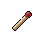

#  袋鼠．喬瑟夫

|體質|力量|敏捷|智力|幫派|戰鬥等級|勒索難度|持有天賦|取得天賦|
|:--:|:--:|:--:|:--:|:--:|:--:|:--:|:--:|:--:|
|8|6|8|5|無幫派|強|中|[鬥士](技能.md#鬥士)|[職業拳擊](技能.md#職業拳擊)|

## 故事

擁有結實體格的袋鼠。剛一見面，就向你講述了一套“唯有拳頭才是真正伙伴”的監獄生存理論。原來，他的目的是為了推銷他的拳擊訓練班。作為前職業拳擊手的他或許擁有一定的實力，但誇張的課程定價讓你不禁懷疑，他能否招的到學生。

“拳臺旋風”喬瑟夫，這個名字現在聽上去或許有些陌生，但放在十年前，這可是拳擊場上的一個神話。曾經以40連勝的傲人戰績斬獲拳王金腰帶，並創造了當時擊倒對手的最大體重差。可是，這一切的傳奇都在第41場比賽時被終結了。他在那場比賽中猶如夢游一般的發揮讓觀眾大跌眼鏡，最終被名不見經傳的二流拳手所輕鬆KO。

離奇的失敗被媒體包裝成了他打假拳的證據，一時間滿城風雨，“拳臺旋風”就此名譽掃地。喬瑟夫告訴你，那場比賽根本就是一場陰謀的陷害，他上臺之後就覺得四肢無力，頭暈目眩。他懷疑有人在他的飲料裡下了藥，可惜卻找不到任何的證據。在被扣上了“假拳”喬瑟夫的帽子之後，他再也無緣頂級的賽事，債務纏身的他只好去參加一些次級拳賽。但在拳王時代揮金如土欠下的大筆貸款，怎能靠這點過家家般的出場費還清呢？在他一籌莫展之際，有人找到了他，那就是地下假拳組織。他們承諾喬瑟夫，只要他參與打假拳的話，每場比賽都能從賭金裡分到一部分，這可比他的出場費要高得多…

“既然外界都覺得我在打假拳，那我就真的打給你們看！”委屈又憤怒的喬瑟夫就這麼答應了假拳組織的邀請。一場、兩場、三場、四場…以他的實力在次級拳賽裡，輸贏全都在他的掌控之間。隨著他參與的比賽增多，漸漸的又引起了主流媒體的關注。於是，通過經紀人的多方交涉，終於為喬瑟夫贏得了重返頂級賽事的機會。而第一場的對手就是他的老冤家，那個靠詭計終結他40連勝的家伙。

得到這個消息之後的喬瑟夫興奮異常，既是為了自己可以重返頂級賽場，也是為了終於有機會一雪前恥，教訓一下那個卑鄙小人。他經過了一個月的高強度訓練，終於讓自己回到了巔峰狀態，他很有信心一回合就把那個混蛋擊倒。但是，正當他滿懷自信之時，黑拳組織的電話響起了。他們希望喬瑟夫可以故意輸掉這場比賽，他們承諾給予他比平時更高的回報。只花了一秒鐘，甚至都不到一秒，喬瑟夫就拒絕了對方的要求。他可以輸掉一百場，甚至一千場比賽，但唯獨這一場他必須堂堂正正的贏下來，因為這是他作為拳擊手最後的尊嚴！

被惹惱的黑拳組織威脅到，如果喬瑟夫肯不聽話的話，就會把他之前打假拳的證據交給警察。究竟是老老實實跪著賺錢，還是滾進監獄吃牢飯，他們相信喬瑟夫會做出“聰明”的選擇。

比賽開始了，對手帶著輕蔑的眼神注視著喬瑟夫，仿佛比賽的結果他早已知曉。“叮叮”第一回合鐘聲敲響！沖刺、閃避、虛晃、重拳！僅僅三秒，喬瑟夫就干凈利落的擊倒了對手，完成了他期盼已久的復仇！

第二天，假拳的證據如約寄到了警察局，喬瑟夫也因此獲刑5年。但他卻說自己毫不後悔：“如果害怕被擊倒而不敢出拳的話，那還算個什麼拳擊手？”他的原話就是這樣。

## 結識對話

- **伙計\~你知道監獄裡最值得信賴的“朋友”是誰嗎？**
- {think1}
- :point_right:是錢嗎？
- :point_right:難道是你？
- :point_right:不會是獄警吧…
- **錯！你唯一的朋友，就是你的拳頭！**
- **記住，弱肉強食是這裡不變的叢林法則。**
- **如果你沒有防身的本領，那就只有被欺負的份！**
- 呃…所以？
- **{smile1}**
- **下面由我隆重介紹，監獄裡的菜鳥救星“喬瑟夫拳擊班”。**
- **由我，前職業拳擊手，被稱為“拳臺旋風”的`喬瑟夫`授課。**
- **只要十個課時，就能讓你在監獄斗毆中立於不敗之地！**
- **現在還有特價活動，一個課時只收500，怎麼樣心動了嗎？**
- :point_right:我可不喜歡暴力。
- :point_right:讓我再考慮考慮… `好感+5`
- **呃…嫌貴的話咱們可以講價，給自己留個變強的機會吧！**

## 深入了解對話

- 嗨\~喬瑟夫，你的訓練班招到學員了沒有？
- **哎\~你這家伙別挖苦我了…**
- 被我猜中了？一個都沒有吧？
- 你的課開價那麼貴，又沒法證明真的有用，誰會來報名？
- **哎…那你說該怎麼辦？**
- {think1}
- 我看，不如你來免費教我…
- 等我學成之後，不就能成你的宣傳招牌了嗎？

#### 我之前參加過`監獄拳賽`。

> 他教了你些基礎的拳擊知識，並舉了當年在拳臺上的故事做例子。

- 也算有點經驗，學起來肯定得心應手。
- 怎麼樣？要不要合作？
- **哎\~看來也只有這個辦法了。**
- **那事不宜遲，就讓我們開始第一課吧…**
- *原來他的拳擊實力都不是吹的…*
- **吶\~我多嘴問一句，你真的這麼缺錢嗎？**
- **沒錯，我辦這個訓練班就是為了賺錢。**
- **因為我的刑期明年就結束了，我計劃出獄後重返拳臺。**
- **所以我需要錢來雇最好的經紀人，找最好的教練。**
- **我年紀大了…打不了幾年了。**
- **這也許是我重整旗鼓的“最後一回合”了。**

#### 取消

- **你…招牌？**
- **你這家伙連`拳擊臺`都沒上過，萬一搞砸了怎麼辦？**
- **我還是想別的法子好了…**

## 特殊對話

### 打招呼（關係極好）

- **怎麼？你想練拳嗎？**

### 打招呼（關係好）

- **學學拳擊吧，技多不壓身。**

### 打招呼（關係一般）

- **嘿\~你好，朋友。**

### 打招呼（關係差）

- **喂\~有話直說吧。**

### 打招呼（關係極差）

- **你想說什麼？我可忙得很。**

### 進行毆打

- **你就等著向我求饒吧！**
- **想贏過我，你可沒多少勝算！**
- **挑釁我？嘗嘗“拳臺旋風”喬瑟夫的厲害吧！**

### 回禮

- **然後\~伙計，這是我的回禮。**

### 勒索成功

- **你這該死的混蛋，你知道這些錢對我來說有多重要嗎？**
- **{hate1}**

### 勒索失敗

- **離我遠點，我今天不想再聽你說任何一句屁話了！**
- **{hate1}**

### 一起吃飯被拒

- **抱歉，這個位置不歡迎你。**

### 分享食物

- **{smile1}**
- **嘿\~我當然不會拒絕你的好意。**

### 加藥被發現

- **你手裡是什麼？鬼鬼祟祟的？**

### 加藥辯解失敗

- **你最好離我的午餐遠一點，聽到沒有？**

## 聊天

- **怎麼樣？考慮清楚了嗎？我的“拳擊班”還在火熱招生中！**
- …咱們能聊點別的嗎？
- **這樣吧…我來和你分享個小故事好了。**
- **去年也有個新來的家伙，個頭和你差不多。**
- **我勸他學點防身術，可那小子就是不肯聽。**
- **結果沒出一周，就被打成了殘廢！一直在醫院躺倒了出獄。**
- **哎…我這可不是危言聳聽，只是不希望你步他的後塵。**
- {sweat1}
- 真是“謝謝”你的提醒了…

## 初始物品

||||||
|:--:|:--:|:--:|:--:|:--:|
||||||
|[帆布鞋](16-帆布鞋.md)|[頭帶](20-頭帶.md)|[薄荷葉卷](41-薄荷葉卷.md)*2|[蘋果](64-蘋果.md)*2|[一把咖啡豆](69-一把咖啡豆.md)*4|
||||||
|[酸奶](74-酸奶.md)*2|[蛋白粉](79-蛋白粉.md)|[消毒液](118-消毒液.md)*4|[火柴](120-火柴.md)*4||

## 送禮

|圖片|物品名稱|好感|回應|
|:--:|--|:--:|--|
||[DEMO限定紙鶴](209-DEMO限定紙鶴.md)|50|雖然你拿出了這個，但是學費還是不能打折…|
||[運動鞋](14-運動鞋.md)|24|哈\~想見識一下我的蝴蝶步嗎？|
||[金龜子](202-金龜子.md)|20|哈\~金色傳說！|
||[馬女郎海報](105-馬女郎海報.md)|18|嘿\~這是我喜歡的類型。|
||[狐女郎海報](107-狐女郎海報.md)|18|嘿\~這是我喜歡的類型。|
||[兔女郎海報](108-兔女郎海報.md)|18|嘿\~這是我喜歡的類型。|
||[頭帶](20-頭帶.md)|15|是時候活動一下筋骨了。|
||[護身符](29-護身符.md)|15|願“森林之父”賜予我勝利。|
||[棒球帽](21-棒球帽.md)|12|你太客氣了伙計\~|
||[紅頭巾](23-紅頭巾.md)|12|是時候活動一下筋骨了。|
||[綠頭巾](24-綠頭巾.md)|12|是時候活動一下筋骨了。|
||[手錶](27-手錶.md)|12|你太客氣了伙計\~|
||[牙齒項鏈](30-牙齒項鏈.md)|12|你太客氣了伙計\~|
||[隨身聽（開機）](34-隨身聽（開機）.md)|12|你太客氣了伙計\~|
||[隨身聽（關機）](35-隨身聽（關機）.md)|12|你太客氣了伙計\~|
||[隨身聽（沒電）](36-隨身聽（沒電）.md)|12|你太客氣了伙計\~|
||[薄荷葉卷](41-薄荷葉卷.md)|12|有了它，今天就是完美的一天。|
||[蛋白粉](79-蛋白粉.md)|12|哈\~看來又得流點汗了！|
||[《花花世界》（全新）](102-《花花世界》（全新）.md)|12|伙計，這正是我需要的。|
||[貓女郎海報](106-貓女郎海報.md)|12|你太客氣了伙計\~|
||[咖啡磨](109-咖啡磨.md)|12|嘿\~這是我喜歡的類型。|
||[掌上遊戲機](110-掌上遊戲機.md)|12|你太客氣了伙計\~|
||[掌上遊戲機（沒電）](111-掌上遊戲機（沒電）.md)|12|你太客氣了伙計\~|
||[《森之音》](203-《森之音》.md)|12|願“森林之父”賜予我勝利。|
||[墨鏡](18-墨鏡.md)|10|你太客氣了伙計\~|
||[眼鏡](19-眼鏡.md)|10|你太客氣了伙計\~|
||[酒葫蘆](37-酒葫蘆.md)|10|你太客氣了伙計\~|
||[《花花世界》（看過）](103-《花花世界》（看過）.md)|9|伙計，這正是我需要的。|
||[帆布鞋](16-帆布鞋.md)|8|你太客氣了伙計\~|
||[毛線帽](22-毛線帽.md)|8|你太客氣了伙計\~|
||[自製口罩](32-自製口罩.md)|8|你太客氣了伙計\~|
||[酒精燈](52-酒精燈.md)|8|你太客氣了伙計\~|
||[精釀蘋果酒](56-精釀蘋果酒.md)|8|你太客氣了伙計\~|
||[奶油華夫餅](68-奶油華夫餅.md)|8|你太客氣了伙計\~|
||[土豆披薩](75-土豆披薩.md)|8|你太客氣了伙計\~|
||[香皂](89-香皂.md)|8|你太客氣了伙計\~|
||[計算機](101-計算機.md)|8|你太客氣了伙計\~|
||[精美的畫作](130-精美的畫作.md)|8|你太客氣了伙計\~|
||[圓珠筆](133-圓珠筆.md)|8|你太客氣了伙計\~|
||[圓珠筆](134-圓珠筆.md)|8|你太客氣了伙計\~|
||[皮帶](166-皮帶.md)|8|你太客氣了伙計\~|
||[皮帶](167-皮帶.md)|8|你太客氣了伙計\~|
||[橡膠手套](25-橡膠手套.md)|6|你太客氣了伙計\~|
||[薄荷葉](40-薄荷葉.md)|6|呼\~我正需要來點這個。|
||[止疼片](49-止疼片.md)|6|呼\~我正需要來點這個。|
||[啤酒](54-啤酒.md)|6|你太客氣了伙計\~|
||[蘋果酒](55-蘋果酒.md)|6|你太客氣了伙計\~|
||[蘋果](64-蘋果.md)|6|伙計，這正是我需要的。|
||[華夫餅](67-華夫餅.md)|6|你太客氣了伙計\~|
||[一把咖啡豆](69-一把咖啡豆.md)|6|伙計，這正是我需要的。|
||[酸奶](74-酸奶.md)|6|伙計，這正是我需要的。|
||[咖啡粉](76-咖啡粉.md)|6|伙計，這正是我需要的。|
||[超辣泡麵](78-超辣泡麵.md)|6|你太客氣了伙計\~|
||[簡單的漫畫](129-簡單的漫畫.md)|6|你太客氣了伙計\~|
||[硬幣](135-硬幣.md)|6|\~再少的錢\~也是錢。|
||[黑桃A](39-黑桃A.md)|4|你太客氣了伙計\~|
||[安眠藥](47-安眠藥.md)|4|你太客氣了伙計\~|
||[醫用酒精](51-醫用酒精.md)|4|你太客氣了伙計\~|
||[焦糖棒](72-焦糖棒.md)|4|你太客氣了伙計\~|
||[汽水](73-汽水.md)|4|你太客氣了伙計\~|
||[茶包](77-茶包.md)|4|你太客氣了伙計\~|
||[肥皂](88-肥皂.md)|4|你太客氣了伙計\~|
||[《花花世界》（翻爛）](104-《花花世界》（翻爛）.md)|4|你太客氣了伙計\~|
||[牙刷](115-牙刷.md)|4|你太客氣了伙計\~|
||[牙膏](116-牙膏.md)|4|你太客氣了伙計\~|
||[胡亂的塗鴉](128-胡亂的塗鴉.md)|4|你太客氣了伙計\~|
||[鉛筆](131-鉛筆.md)|4|你太客氣了伙計\~|
||[鉛筆](132-鉛筆.md)|4|你太客氣了伙計\~|
||[湯匙](143-湯匙.md)|4|你太客氣了伙計\~|
||[湯匙](144-湯匙.md)|4|你太客氣了伙計\~|
||[口香糖](70-口香糖.md)|2|你太客氣了伙計\~|
||[曲奇餅乾](71-曲奇餅乾.md)|2|你太客氣了伙計\~|
||[布條](84-布條.md)|2|你太客氣了伙計\~|
||[電池](114-電池.md)|2|你太客氣了伙計\~|
||[火柴](120-火柴.md)|2|你太客氣了伙計\~|
||[迴紋針](86-迴紋針.md)|-2|呵\~奇怪的禮物…|
||[消毒液](118-消毒液.md)|-2|呵\~奇怪的禮物…|
||[除銹劑](119-除銹劑.md)|-2|呵\~奇怪的禮物…|
||[膠帶](121-膠帶.md)|-2|呵\~奇怪的禮物…|
||[顏料](122-顏料.md)|-2|呵\~奇怪的禮物…|
||[釘子](123-釘子.md)|-2|呵\~奇怪的禮物…|
||[鞋帶](124-鞋帶.md)|-2|呵\~奇怪的禮物…|
||[白紙](125-白紙.md)|-2|呵\~奇怪的禮物…|
||[折斷的木條](159-折斷的木條.md)|-2|\~我有拳頭就足夠了。|
||[蘑菇](42-蘑菇.md)|-4|這玩意兒對我的身體可沒好處…|
||[蘑菇粉](43-蘑菇粉.md)|-4|這玩意兒對我的身體可沒好處…|
||[紫鳶花](45-紫鳶花.md)|-4|呵\~奇怪的禮物…|
||[花瓣粉](46-花瓣粉.md)|-4|這玩意兒對我的身體可沒好處…|
||[開鎖器](87-開鎖器.md)|-4|呵\~奇怪的禮物…|
||[開鎖器(P)](38-開鎖器(P).md)|-4|呵\~奇怪的禮物…|
||[鎮靜劑](53-鎮靜劑.md)|-6|這玩意兒對我的身體可沒好處…|
||[紙鶴](126-紙鶴.md)|-6|呵\~奇怪的禮物…|
||[長螺絲](136-長螺絲.md)|-6|\~我有拳頭就足夠了。|
||[鐵管](164-鐵管.md)|-6|\~我有拳頭就足夠了。|
||[花束](127-花束.md)|-8|呵\~奇怪的禮物…|
||[剪刀](152-剪刀.md)|-8|\~我有拳頭就足夠了。|
||[雙節棍](160-雙節棍.md)|-8|\~我有拳頭就足夠了。|
||[皮鞋](15-皮鞋.md)|-10|穿著這個可上不了拳臺…|
||[水果刀](158-水果刀.md)|-10|\~我有拳頭就足夠了。|
||[雙節棍(+)](161-雙節棍(+).md)|-10|\~我有拳頭就足夠了。|
||[《死靈之書》](31-《死靈之書》.md)|-12|呃\~我對這個可沒什麼興趣。|
||[扳手](142-扳手.md)|-12|\~我有拳頭就足夠了。|
||[釘錘](151-釘錘.md)|-12|\~我有拳頭就足夠了。|
||[空的牙膏管](117-空的牙膏管.md)|-20|你覺得我會喜歡這件…垃圾嗎？|
||[碎玻璃](153-碎玻璃.md)|-20|你覺得我會喜歡這件…垃圾嗎？|
||[玻璃匕首](154-玻璃匕首.md)|-40|喂\~靠這種東西可成不了強者。|
||[牙刷匕首](156-牙刷匕首.md)|-40|喂\~靠這種東西可成不了強者。|
||[發霉的麵包](200-發霉的麵包.md)|-40|你覺得我會喜歡這件…垃圾嗎？|
||[瀉藥](44-瀉藥.md)|-60|你知道嗎？這玩意兒會勾起我不好的回憶…|
||[興奮劑](50-興奮劑.md)|-60|興奮劑…？你想毀了我的拳擊生涯嗎？！|
||[玻璃匕首(+)](155-玻璃匕首(+).md)|-60|喂\~靠這種東西可成不了強者。|
||[牙刷匕首(+)](157-牙刷匕首(+).md)|-60|喂\~靠這種東西可成不了強者。|
||[釘棒](162-釘棒.md)|-60|喂\~靠這種東西可成不了強者。|
||[拖鞋](17-拖鞋.md)|-80|我說\~你想害我崴到腳嗎？！|
||[黑手](26-黑手.md)|-80|你覺得我得靠這個才能贏嗎？！|
||[釘棒(+)](163-釘棒(+).md)|-80|喂\~靠這種東西可成不了強者。|

