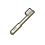
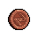

##  袋鼠．喬瑟夫

|體質|力量|敏捷|智力|幫派|
|:--:|:--:|:--:|:--:|:--:|
|8|6|8|5|無幫派|

### 故事

擁有結實體格的袋鼠。剛一見面，就向你講述了一套“唯有拳頭才是真正伙伴”的監獄生存理論。原來，他的目的是為了推銷他的拳擊訓練班。作為前職業拳擊手的他或許擁有一定的實力，但夸張的課程定價讓你不禁懷疑，他能否招的到學生。

“拳臺旋風”喬瑟夫，這個名字現在聽上去或許有些陌生，但放在十年前，這可是拳擊場上的一個神話。曾經以40連勝的傲人戰績斬獲拳王金腰帶，并創造了當時擊倒對手的最大體重差。可是，這一切的傳奇都在第41場比賽時被終結了。他在那場比賽中猶如夢游一般的發揮讓觀眾大跌眼鏡，最終被名不見經傳的二流拳手所輕松KO。

離奇的失敗被媒體包裝成了他打假拳的證據，一時間滿城風雨，“拳臺旋風”就此名譽掃地。喬瑟夫告訴你，那場比賽根本就是一場陰謀的陷害，他上臺之後就覺得四肢無力，頭暈目眩。他懷疑有人在他的飲料里下了藥，可惜卻找不到任何的證據。在被扣上了“假拳”喬瑟夫的帽子之後，他再也無緣頂級的賽事，債務纏身的他只好去參加一些次級拳賽。但在拳王時代揮金如土欠下的大筆貸款，怎能靠這點過家家般的出場費還清呢？在他一籌莫展之際，有人找到了他，那就是地下假拳組織。他們承諾喬瑟夫，只要他參與打假拳的話，每場比賽都能從賭金里分到一部分，這可比他的出場費要高得多…

“既然外界都覺得我在打假拳，那我就真的打給你們看！”委屈又憤怒的喬瑟夫就這麼答應了假拳組織的邀請。一場、兩場、三場、四場…以他的實力在次級拳賽里，輸贏全都在他的掌控之間。隨著他參與的比賽增多，漸漸的又引起了主流媒體的關注。於是，通過經紀人的多方交涉，終於為喬瑟夫贏得了重返頂級賽事的機會。而第一場的對手就是他的老冤家，那個靠詭計終結他40連勝的家伙。

得到這個消息之後的喬瑟夫興奮異常，既是為了自己可以重返頂級賽場，也是為了終於有機會一雪前恥，教訓一下那個卑鄙小人。他經過了一個月的高強度訓練，終於讓自己回到了巔峰狀態，他很有信心一回合就把那個混蛋擊倒。但是，正當他滿懷自信之時，黑拳組織的電話響起了。他們希望喬瑟夫可以故意輸掉這場比賽，他們承諾給予他比平時更高的回報。只花了一秒鐘，甚至都不到一秒，喬瑟夫就拒絕了對方的要求。他可以輸掉一百場，甚至一千場比賽，但唯獨這一場他必須堂堂正正的贏下來，因為這是他作為拳擊手最後的尊嚴！

被惹惱的黑拳組織威脅到，如果喬瑟夫肯不聽話的話，就會把他之前打假拳的證據交給警察。究竟是老老實實跪著賺錢，還是滾進監獄吃牢飯，他們相信喬瑟夫會做出“聰明”的選擇。

比賽開始了，對手帶著輕蔑的眼神注視著喬瑟夫，仿佛比賽的結果他早已知曉。“叮叮”第一回合鐘聲敲響！沖刺、閃避、虛晃、重拳！僅僅三秒，喬瑟夫就干凈利落的擊倒了對手，完成了他期盼已久的復仇！

第二天，假拳的證據如約寄到了警察局，喬瑟夫也因此獲刑5年。但他卻說自己毫不後悔：“如果害怕被擊倒而不敢出拳的話，那還算個什麼拳擊手？”他的原話就是這樣。

### 結識對話

- **伙計\~你知道監獄里最值得信賴的“朋友”是誰嗎？**
- {think1}
- :point_right:是錢嗎？
- :point_right:難道是你？
- :point_right:不會是獄警吧…
- **錯！你唯一的朋友，就是你的拳頭！**
- **記住，弱肉強食是這里不變的叢林法則。**
- **如果你沒有防身的本領，那就只有被欺負的份！**
- 呃…所以？
- **{smile1}**
- **下面由我隆重介紹，監獄里的菜鳥救星“喬瑟夫拳擊班”。**
- **由我，前職業拳擊手，被稱為“拳臺旋風”的`喬瑟夫`授課。**
- **只要十個課時，就能讓你在監獄斗毆中立於不敗之地！**
- **現在還有特價活動，一個課時只收500，怎麼樣心動了嗎？**
- :point_right:我可不喜歡暴力。
- :point_right:讓我再考慮考慮… `好感+5`
- **呃…嫌貴的話咱們可以講價，給自己留個變強的機會吧！**

### 深入了解對話

- 嗨\~喬瑟夫，你的訓練班招到學員了沒有？
- **哎\~你這家伙別挖苦我了…**
- 被我猜中了？一個都沒有吧？
- 你的課開價那麼貴，又沒法證明真的有用，誰會來報名？
- **哎…那你說該怎麼辦？**
- {think1}
- 我看，不如你來免費教我…
- 等我學成之後，不就能成你的宣傳招牌了嗎？

#### 我之前參加過`監獄拳賽`。

> 他教了你些基礎的拳擊知識，并舉了當年在拳臺上的故事做例子。

- 也算有點經驗，學起來肯定得心應手。
- 怎麼樣？要不要合作？
- **哎\~看來也只有這個辦法了。**
- **那事不宜遲，就讓我們開始第一課吧…**
- *原來他的拳擊實力都不是吹的…*
- **吶\~我多嘴問一句，你真的這麼缺錢嗎？**
- **沒錯，我辦這個訓練班就是為了賺錢。**
- **因為我的刑期明年就結束了，我計劃出獄後重返拳臺。**
- **所以我需要錢來雇最好的經紀人，找最好的教練。**
- **我年紀大了…打不了幾年了。**
- **這也許是我重整旗鼓的“最後一回合”了。**

#### 取消

- **你…招牌？**
- **你這家伙連`拳擊臺`都沒上過，萬一搞砸了怎麼辦？**
- **我還是想別的法子好了…**

### 打招呼

#### 關係極好

- **怎麼？你想練拳嗎？**

#### 關係好

- **學學拳擊吧，技多不壓身。**

#### 關係一般

- **嘿\~你好，朋友。**

#### 關係不好

- **喂\~有話直說吧。**

#### 關係極差

- **你想說什麼？我可忙得很。**

## 聊天

- **怎麼樣？考慮清楚了嗎？我的“拳擊班”還在火熱招生中！**
- …咱們能聊點別的嗎？
- **這樣吧…我來和你分享個小故事好了。**
- **去年也有個新來的家伙，個頭和你差不多。**
- **我勸他學點防身術，可那小子就是不肯聽。**
- **結果沒出一周，就被打成了殘廢！一直在醫院躺倒了出獄。**
- **哎…我這可不是危言聳聽，只是不希望你步他的後塵。**
- {sweat1}
- 真是“謝謝”你的提醒了…

### 初始物品

||||||
|:--:|:--:|:--:|:--:|:--:|
|  |  |  |  |  |
| [帆布鞋](道具.md#帆布鞋) | [頭帶](道具.md#頭帶) | [薄荷葉卷](道具.md#薄荷葉卷)*2 | [蘋果](道具.md#蘋果)*2 | [一把咖啡豆](道具.md#一把咖啡豆)*4 |
|  |  |  |  |  |
| [酸奶](道具.md#酸奶)*2 | [蛋白粉](道具.md#蛋白粉) | [消毒液](道具.md#消毒液)*4 | [火柴](道具.md#火柴)*4 |  |

### 送禮

|圖片|物品名稱|好感|回應|
|:--:|--|:--:|--|
||[運動鞋](道具.md#運動鞋)|24|哈\~想見識一下我的蝴蝶步嗎？|
||[皮鞋](道具.md#皮鞋)|-10|穿著這個可上不了拳臺…|
||[帆布鞋](道具.md#帆布鞋)|0|你太客氣了伙計\~|
||[拖鞋](道具.md#拖鞋)|-16|我說\~你想害我崴到腳嗎？！|
||[墨鏡](道具.md#墨鏡)|0|你太客氣了伙計\~|
||[眼鏡](道具.md#眼鏡)|0|你太客氣了伙計\~|
||[頭帶](道具.md#頭帶)|10|是時候活動一下筋骨了。|
||[棒球帽](道具.md#棒球帽)|0|你太客氣了伙計\~|
||[毛線帽](道具.md#毛線帽)|0|你太客氣了伙計\~|
||[紅頭巾](道具.md#紅頭巾)|8|是時候活動一下筋骨了。|
||[綠頭巾](道具.md#綠頭巾)|8|是時候活動一下筋骨了。|
||[橡膠手套](道具.md#橡膠手套)|0|你太客氣了伙計\~|
||[黑手](道具.md#黑手)|-16|你覺得我得靠這個才能贏嗎？！|
||[手錶](道具.md#手錶)|0|你太客氣了伙計\~|
||[護身符](道具.md#護身符)|10|愿“森林之父”賜予我勝利。|
||[牙齒項鏈](道具.md#牙齒項鏈)|0|你太客氣了伙計\~|
||[《死靈之書》](道具.md#《死靈之書》)|-12|呃\~我對這個可沒什麼興趣。|
||[自制口罩](道具.md#自制口罩)|0|你太客氣了伙計\~|
||[隨身聽（開機）](道具.md#隨身聽（開機）)|0|你太客氣了伙計\~|
||[隨身聽（關機）](道具.md#隨身聽（關機）)|0|你太客氣了伙計\~|
||[隨身聽（沒電）](道具.md#隨身聽（沒電）)|0|你太客氣了伙計\~|
||[酒葫蘆](道具.md#酒葫蘆)|0|你太客氣了伙計\~|
||[黑桃A](道具.md#黑桃A)|0|你太客氣了伙計\~|
||[薄荷葉](道具.md#薄荷葉)|4|呼\~我正需要來點這個。|
||[薄荷葉卷](道具.md#薄荷葉卷)|12|有了它，今天就是完美的一天。|
||[蘑菇](道具.md#蘑菇)|-4|這玩意兒對我的身體可沒好處…|
||[蘑菇粉](道具.md#蘑菇粉)|-4|這玩意兒對我的身體可沒好處…|
||[瀉藥](道具.md#瀉藥)|-12|你知道嗎？這玩意兒會勾起我不好的回憶…|
||[紫鳶花](道具.md#紫鳶花)|-4|呵\~奇怪的禮物…|
||[花瓣粉](道具.md#花瓣粉)|-4|這玩意兒對我的身體可沒好處…|
||[安眠藥](道具.md#安眠藥)|0|你太客氣了伙計\~|
||[止疼片](道具.md#止疼片)|4|呼\~我正需要來點這個。|
||[興奮劑](道具.md#興奮劑)|-12|興奮劑…？你想毀了我的拳擊生涯嗎？！|
||[醫用酒精](道具.md#醫用酒精)|0|你太客氣了伙計\~|
||[酒精燈](道具.md#酒精燈)|0|你太客氣了伙計\~|
||[鎮靜劑](道具.md#鎮靜劑)|-6|這玩意兒對我的身體可沒好處…|
||[啤酒](道具.md#啤酒)|0|你太客氣了伙計\~|
||[蘋果酒](道具.md#蘋果酒)|0|你太客氣了伙計\~|
||[精釀蘋果酒](道具.md#精釀蘋果酒)|0|你太客氣了伙計\~|
||[蘋果](道具.md#蘋果)|4|伙計，這正是我需要的。|
||[華夫餅](道具.md#華夫餅)|0|你太客氣了伙計\~|
||[奶油華夫餅](道具.md#奶油華夫餅)|0|你太客氣了伙計\~|
||[一把咖啡豆](道具.md#一把咖啡豆)|4|伙計，這正是我需要的。|
||[口香糖](道具.md#口香糖)|0|你太客氣了伙計\~|
||[曲奇餅乾](道具.md#曲奇餅乾)|0|你太客氣了伙計\~|
||[焦糖棒](道具.md#焦糖棒)|0|你太客氣了伙計\~|
||[汽水](道具.md#汽水)|0|你太客氣了伙計\~|
||[酸奶](道具.md#酸奶)|4|伙計，這正是我需要的。|
||[土豆披薩](道具.md#土豆披薩)|0|你太客氣了伙計\~|
||[咖啡粉](道具.md#咖啡粉)|4|伙計，這正是我需要的。|
||[茶包](道具.md#茶包)|0|你太客氣了伙計\~|
||[超辣泡麵](道具.md#超辣泡麵)|0|你太客氣了伙計\~|
||[蛋白粉](道具.md#蛋白粉)|12|哈\~看來又得流點汗了！|
||[布條](道具.md#布條)|0|你太客氣了伙計\~|
||[迴紋針](道具.md#迴紋針)|-2|呵\~奇怪的禮物…|
||[開鎖器](道具.md#開鎖器)|-4|呵\~奇怪的禮物…|
||[開鎖器(P)](道具.md#開鎖器(P))|-4|呵\~奇怪的禮物…|
||[肥皂](道具.md#肥皂)|0|你太客氣了伙計\~|
||[香皂](道具.md#香皂)|0|你太客氣了伙計\~|
||[計算機](道具.md#計算機)|0|你太客氣了伙計\~|
||[《花花世界》（全新）](道具.md#《花花世界》（全新）)|8|伙計，這正是我需要的。|
||[《花花世界》（看過）](道具.md#《花花世界》（看過）)|6|伙計，這正是我需要的。|
||[《花花世界》（翻爛）](道具.md#《花花世界》（翻爛）)|0|你太客氣了伙計\~|
||[馬女郎海報](道具.md#馬女郎海報)|12|嘿\~這是我喜歡的類型。|
||[貓女郎海報](道具.md#貓女郎海報)|0|你太客氣了伙計\~|
||[狐女郎海報](道具.md#狐女郎海報)|12|嘿\~這是我喜歡的類型。|
||[兔女郎海報](道具.md#兔女郎海報)|12|嘿\~這是我喜歡的類型。|
||[咖啡磨](道具.md#咖啡磨)|8|嘿\~這是我喜歡的類型。|
||[掌上遊戲機](道具.md#掌上遊戲機)|0|你太客氣了伙計\~|
||[掌上遊戲機（沒電）](道具.md#掌上遊戲機（沒電）)|0|你太客氣了伙計\~|
||[電池](道具.md#電池)|0|你太客氣了伙計\~|
||[牙刷](道具.md#牙刷)|0|你太客氣了伙計\~|
||[牙膏](道具.md#牙膏)|0|你太客氣了伙計\~|
||[空的牙膏管](道具.md#空的牙膏管)|-4|你覺得我會喜歡這件…垃圾嗎？|
||[消毒液](道具.md#消毒液)|-2|呵\~奇怪的禮物…|
||[除銹劑](道具.md#除銹劑)|-2|呵\~奇怪的禮物…|
||[火柴](道具.md#火柴)|0|你太客氣了伙計\~|
||[膠帶](道具.md#膠帶)|-2|呵\~奇怪的禮物…|
||[顏料](道具.md#顏料)|-2|呵\~奇怪的禮物…|
||[釘子](道具.md#釘子)|-2|呵\~奇怪的禮物…|
||[鞋帶](道具.md#鞋帶)|-2|呵\~奇怪的禮物…|
||[白紙](道具.md#白紙)|-2|呵\~奇怪的禮物…|
||[紙鶴](道具.md#紙鶴)|-6|呵\~奇怪的禮物…|
||[花束](道具.md#花束)|-8|呵\~奇怪的禮物…|
||[胡亂的涂鴉](道具.md#胡亂的涂鴉)|0|你太客氣了伙計\~|
||[簡單的漫畫](道具.md#簡單的漫畫)|0|你太客氣了伙計\~|
||[精美的畫作](道具.md#精美的畫作)|0|你太客氣了伙計\~|
||[鉛筆](道具.md#鉛筆)|0|你太客氣了伙計\~|
||[鉛筆](道具.md#鉛筆)|0|你太客氣了伙計\~|
||[圓珠筆](道具.md#圓珠筆)|0|你太客氣了伙計\~|
||[圓珠筆](道具.md#圓珠筆)|0|你太客氣了伙計\~|
||[硬幣](道具.md#硬幣)|4|\~再少的錢\~也是錢。|
||[長螺絲](道具.md#長螺絲)|-6|\~我有拳頭就足夠了。|
||[扳手](道具.md#扳手)|-12|\~我有拳頭就足夠了。|
||[湯匙](道具.md#湯匙)|0|你太客氣了伙計\~|
||[湯匙](道具.md#湯匙)|0|你太客氣了伙計\~|
||[釘錘](道具.md#釘錘)|-12|\~我有拳頭就足夠了。|
||[剪刀](道具.md#剪刀)|-8|\~我有拳頭就足夠了。|
||[碎玻璃](道具.md#碎玻璃)|-4|你覺得我會喜歡這件…垃圾嗎？|
||[玻璃匕首](道具.md#玻璃匕首)|-8|喂\~靠這種東西可成不了強者。|
||[玻璃匕首(+)](道具.md#玻璃匕首(+))|-12|喂\~靠這種東西可成不了強者。|
||[牙刷匕首](道具.md#牙刷匕首)|-8|喂\~靠這種東西可成不了強者。|
||[牙刷匕首(+)](道具.md#牙刷匕首(+))|-12|喂\~靠這種東西可成不了強者。|
||[水果刀](道具.md#水果刀)|-10|\~我有拳頭就足夠了。|
||[折斷的木條](道具.md#折斷的木條)|-2|\~我有拳頭就足夠了。|
||[雙節棍](道具.md#雙節棍)|-8|\~我有拳頭就足夠了。|
||[雙節棍(+)](道具.md#雙節棍(+))|-10|\~我有拳頭就足夠了。|
||[釘棒](道具.md#釘棒)|-12|喂\~靠這種東西可成不了強者。|
||[釘棒(+)](道具.md#釘棒(+))|-16|喂\~靠這種東西可成不了強者。|
||[鐵管](道具.md#鐵管)|-6|\~我有拳頭就足夠了。|
||[皮帶](道具.md#皮帶)|0|你太客氣了伙計\~|
||[皮帶](道具.md#皮帶)|0|你太客氣了伙計\~|
||[發霉的麵包](道具.md#發霉的麵包)|-8|你覺得我會喜歡這件…垃圾嗎？|
||[金龜子](道具.md#金龜子)|20|哈\~金色傳說！|
||[《森之音》](道具.md#《森之音》)|8|愿“森林之父”賜予我勝利。|
||[DEMO限定紙鶴](道具.md#DEMO限定紙鶴)|50|雖然你拿出了這個，但是學費還是不能打折…|

