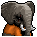
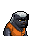

# 動物迷城角色一覽

## 囚犯

|圖片|姓名|幫派|體質|力量|敏捷|智力|戰鬥等級|勒索難度|持有天賦|取得天賦|
|:--:|--|:--:|:--:|:--:|:--:|:--:|:--:|:--:|--|--|
||[狐貍．托馬斯](狐貍．托馬斯.md)|無幫派|4|3|5|5|弱|中|||
||[長頸鹿．吉米](長頸鹿．吉米.md)|無幫派|10|10|8|8|強|難|[理財](技能.md#理財)、[黑客](技能.md#黑客)|[源代碼](技能.md#源代碼)|
||[驢子．山姆](驢子．山姆.md)|無幫派|8|6|7|4|中|中|[工人](技能.md#工人)、[製作能手](技能.md#製作能手)|[苦力](技能.md#苦力)|
||[馴鹿．魯道夫](馴鹿．魯道夫.md)|無幫派|9|7|10|6|強|難|[鬥士](技能.md#鬥士)、[感知](技能.md#感知)|[彗星客](技能.md#彗星客)|
||[袋鼠．喬瑟夫](袋鼠．喬瑟夫.md)|無幫派|8|6|8|5|強|中|[鬥士](技能.md#鬥士)|[職業拳擊](技能.md#職業拳擊)|
||[高地牛．摩根](高地牛．摩根.md)|無幫派|10|8|6|7|中|難|[交涉](技能.md#交涉)、[製作能手](技能.md#製作能手)||
||[老虎．約翰](老虎．約翰.md)|無幫派|10|10|10|8|強|難|[鬥士](技能.md#鬥士)、[歹徒](技能.md#歹徒)、[製作能手](技能.md#製作能手)|[獨行俠](技能.md#獨行俠)|
||[熊貓．老李](熊貓．老李.md)|無幫派|10|9|4|8|中|難|[機智](技能.md#機智)、[交涉](技能.md#交涉)、[醫學](技能.md#醫學)|[不倒翁](技能.md#不倒翁)|
||[賽馬．雷伊](賽馬．雷伊.md)|無幫派|8|6|11|8|中|中|[交涉](技能.md#交涉)、[製作能手](技能.md#製作能手)|[魅惑](技能.md#魅惑)|
||[山羊．威爾伯](山羊．威爾伯.md)|無幫派|6|4|7|9|強|中|[機智](技能.md#機智)、[醫學](技能.md#醫學)、[建築師](技能.md#建築師)|[啟示之夢](技能.md#啟示之夢)|
||[貘．米格爾](貘．米格爾.md)|無幫派|8|6|5|7|中|中|[醫學](技能.md#醫學)|[心理作用](技能.md#心理作用)|
||[猞猁．克里斯](猞猁．克里斯.md)|無幫派|8|6|9|7|中|中|[機智](技能.md#機智)、[扒手](技能.md#扒手)|[調情](技能.md#調情)|
||[鬣蜥．皮克曼](鬣蜥．皮克曼.md)|無幫派|7|8|4|6|中|中|[歹徒](技能.md#歹徒)、[理財](技能.md#理財)|[畫家](技能.md#畫家)|
||[水豚．伯納德](水豚．伯納德.md)|無幫派|6|6|4|6|弱|易|[交涉](技能.md#交涉)|[退役警探](技能.md#退役警探)|
||[象龜．威廉姆](象龜．威廉姆.md)|無幫派|10|8|2|6|中|中|[工人](技能.md#工人)|[勤雜工](技能.md#勤雜工)|
||[樹懶．蒂姆](樹懶．蒂姆.md)|無幫派|7|6|2|7|弱|易|[理財](技能.md#理財)|[投資](技能.md#投資)|
||[考拉．凱文](考拉．凱文.md)|無幫派|4|4|4|5|弱|易|[扒手](技能.md#扒手)|[贓物袋](技能.md#贓物袋)|
||[穿山甲．林](穿山甲．林.md)|無幫派|6|5|6|4|中|易|[工人](技能.md#工人)、[建築師](技能.md#建築師)|[安全施工](技能.md#安全施工)|
||[臭鼬．沃爾特](臭鼬．沃爾特.md)|無幫派|4|4|5|7|中|易|[製作能手](技能.md#製作能手)、[醫學](技能.md#醫學)|[化學教授](技能.md#化學教授)|
||[灰貓．班姆](灰貓．班姆.md)|無幫派|3|4|7|7|弱|易|[扒手](技能.md#扒手)、[感知](技能.md#感知)|[超能力](技能.md#超能力)|
||[狐獴．泰迪](狐獴．泰迪.md)|無幫派|3|3|7|6|弱|易|[建築師](技能.md#建築師)|[工程師](技能.md#工程師)|
||[環尾狐猴．羅伯特](環尾狐猴．羅伯特.md)|無幫派|4|4|8|9|弱|易|[黑客](技能.md#黑客)|[頭號玩家](技能.md#頭號玩家)|
||[負鼠．埃迪](負鼠．埃迪.md)|無幫派|3|4|5|4|弱|易|[鎖匠](技能.md#鎖匠)|[全搬走！](技能.md#全搬走！)|
||[鴨嘴獸．泰瑞](鴨嘴獸．泰瑞.md)|無幫派|3|4|4|7|弱|易|[黑客](技能.md#黑客)|[人工智能](技能.md#人工智能)|
||[樹蛙．格雷](樹蛙．格雷.md)|無幫派|2|2|6|7|弱|易|[醫學](技能.md#醫學)|[毒性體質](技能.md#毒性體質)|
||[恐龍．雷克斯](恐龍．雷克斯.md)|無幫派|18|16|9|4|強|難|[鬥士](技能.md#鬥士)、[歹徒](技能.md#歹徒)、[強健](技能.md#強健)||
||[未完成．角色](未完成．角色.md)|無幫派|0|0|0|0|||||
||[大象．金波](大象．金波.md)|大腳幫老大|12|12|4|8|強|難|[鬥士](技能.md#鬥士)、[強健](技能.md#強健)、[交涉](技能.md#交涉)|[巨無霸](技能.md#巨無霸)|
||[河馬．弗蘭克](河馬．弗蘭克.md)|大腳幫幹部|12|11|4|6|強|難|[歹徒](技能.md#歹徒)、[工人](技能.md#工人)|[監工](技能.md#監工)|
||[犀牛．伊萬](犀牛．伊萬.md)|大腳幫幹部|12|10|6|4|強|難|[鬥士](技能.md#鬥士)、[強健](技能.md#強健)|[防御架勢](技能.md#防御架勢)|
||[水牛．比爾](水牛．比爾.md)|大腳幫成員|11|9|8|6|強|難|[強健](技能.md#強健)、[建築師](技能.md#建築師)|[反芻](技能.md#反芻)|
||[駱駝．托尼](駱駝．托尼.md)|大腳幫成員|10|8|6|8|中|難|[交涉](技能.md#交涉)|[熟客](技能.md#熟客)|
||[海象．溫斯頓](海象．溫斯頓.md)|大腳幫成員|9|8|3|8|中|難|[強健](技能.md#強健)、[工人](技能.md#工人)|[來自海洋](技能.md#來自海洋)|
||[羊駝．迪亞哥](羊駝．迪亞哥.md)|大腳幫成員|7|6|8|4|中|中|[扒手](技能.md#扒手)|[順手牽羊](技能.md#順手牽羊)|
||[斑馬．富蘭克林](斑馬．富蘭克林.md)|大腳幫成員|8|7|10|7|中|中|[製作能手](技能.md#製作能手)|[技術宅](技能.md#技術宅)|
||[雄獅．阿歷克斯](雄獅．阿歷克斯.md)|尖牙幫老大|9|8|10|9|強|難|[歹徒](技能.md#歹徒)、[感知](技能.md#感知)、[鎖匠](技能.md#鎖匠)|[剃刀](技能.md#剃刀)|
||[北極熊．弗拉基米爾](北極熊．弗拉基米爾.md)|尖牙幫幹部|11|11|6|8|強|難|[鬥士](技能.md#鬥士)、[強健](技能.md#強健)|[摔跤手](技能.md#摔跤手)|
||[鱷魚．克蘭奇](鱷魚．克蘭奇.md)|尖牙幫幹部|10|9|6|6|強|難|[歹徒](技能.md#歹徒)、[強健](技能.md#強健)|[煞星](技能.md#煞星)|
||[黑熊．亨利](黑熊．亨利.md)|尖牙幫成員|10|9|6|6|強|難|[強健](技能.md#強健)|[冬眠](技能.md#冬眠)|
||[黑豹．鮑勃](黑豹．鮑勃.md)|尖牙幫成員|8|7|12|6|強|中|[感知](技能.md#感知)、[鎖匠](技能.md#鎖匠)|[夜行](技能.md#夜行)|
||[灰狼．芬里爾](灰狼．芬里爾.md)|尖牙幫成員|7|6|8|8|強|中|[感知](技能.md#感知)|[獵手](技能.md#獵手)|
||[斑鬣狗．文森特](斑鬣狗．文森特.md)|尖牙幫成員|8|7|8|6|強|中|[歹徒](技能.md#歹徒)、[扒手](技能.md#扒手)|[圍攻](技能.md#圍攻)|
||[疣豬．哈庫拉](疣豬．哈庫拉.md)|尖牙幫成員|7|7|7|4|中|中|[建築師](技能.md#建築師)|[拆遷隊](技能.md#拆遷隊)|
||[猩猩．凱撒](猩猩．凱撒.md)|黑爪幫老大|8|7|8|12|強|難|[機智](技能.md#機智)、[製作能手](技能.md#製作能手)、[理財](技能.md#理財)|[真聰明！](技能.md#真聰明！)|
||[山魈．拉斐爾](山魈．拉斐爾.md)|黑爪幫幹部|8|6|6|10|中|難|[機智](技能.md#機智)、[理財](技能.md#理財)|[假帳](技能.md#假帳)|
||[蜜獾．麥克斯](蜜獾．麥克斯.md)|黑爪幫幹部|7|6|7|6|強|難|[鬥士](技能.md#鬥士)、[歹徒](技能.md#歹徒)|[暗器](技能.md#暗器)|
||[鹿豚．理查德](鹿豚．理查德.md)|黑爪幫成員|8|6|6|6|中|中|[製作能手](技能.md#製作能手)|[武器改裝](技能.md#武器改裝)|
||[食蟻獸．費爾南多](食蟻獸．費爾南多.md)|黑爪幫成員|5|4|4|6|弱|易|[醫學](技能.md#醫學)|[外科醫生](技能.md#外科醫生)|
||[海獺．菲爾](海獺．菲爾.md)|黑爪幫成員|5|5|5|6|弱|易|[鎖匠](技能.md#鎖匠)|[巧手](技能.md#巧手)|
||[浣熊．面條](浣熊．面條.md)|黑爪幫成員|5|5|7|7|弱|中|[扒手](技能.md#扒手)、[鎖匠](技能.md#鎖匠)|[隱秘專家](技能.md#隱秘專家)|
||[兔子．懷特](兔子．懷特.md)|黑爪幫成員|3|3|6|6|弱|易|[鎖匠](技能.md#鎖匠)、[感知](技能.md#感知)|[靈巧](技能.md#靈巧)|

## 其他

|圖片|姓名|職業|工作地點|體質|力量|敏捷|智力|戰鬥等級|持有天賦|
|:--:|--|--|--|:--:|:--:|:--:|:--:|:--:|--|
||貴賓犬．貝絲|醫生|監獄醫院|2|2|5|8|弱|[醫學](技能.md#醫學)、[機智](技能.md#機智)|
||雪貂．瑪姬|平面設計師|廣告公司|2|1|6|6|弱|[理財](技能.md#理財)|
||小熊貓．雷德|律師|律師事務所|4|3|3|6|中|[機智](技能.md#機智)、[理財](技能.md#理財)|
||牧羊犬．安德森|神父|監獄教堂|3|3|2|8|弱|[機智](技能.md#機智)、[交涉](技能.md#交涉)|
||獒犬．布魯|獄警隊長|監獄|8|8|6|6|強|[獄警](技能.md#獄警)、[強健](技能.md#強健)、[鬥士](技能.md#鬥士)|
||梗犬．比利|獄警副隊長|監獄|6|6|8|7|強|[獄警](技能.md#獄警)、[感知](技能.md#感知)、[交涉](技能.md#交涉)|
||山犬．克拉克|典獄長|監獄|5|4|2|10|弱|[理財](技能.md#理財)、[機智](技能.md#機智)|
||奶牛．蘇珊|護士|監獄醫院|7|7|2|6|中|[醫學](技能.md#醫學)、[製作能手](技能.md#製作能手)|
||柴犬．井野|餐廳警衛|監獄|8|6|7|6|強|[獄警](技能.md#獄警)、[強健](技能.md#強健)|
||獵犬．布蘭|醫院警衛|監獄|6|7|8|6|強|[獄警](技能.md#獄警)、[感知](技能.md#感知)|
||柴犬．羅伯|教堂警衛|監獄|7|6|6|8|強|[獄警](技能.md#獄警)、[機智](技能.md#機智)|
||公豬．廚師“稻草”|廚師|監獄餐廳|8|6|2|4|強|[強健](技能.md#強健)、[交涉](技能.md#交涉)|
||公豬．廚師“木頭”|廚師|監獄餐廳|8|6|2|4|強|[強健](技能.md#強健)、[工人](技能.md#工人)|
||公豬．廚師“石頭”|廚師|監獄餐廳|8|6|2|4|強|[強健](技能.md#強健)、[建築師](技能.md#建築師)|
||狼．安吉洛|助選主任|助選辦公室|7|6|7|8|弱|[歹徒](技能.md#歹徒)、[交涉](技能.md#交涉)|
||獵犬．諾曼|警察隊長|區警察局|7|6|6|8|強|[鬥士](技能.md#鬥士)、[鎖匠](技能.md#鎖匠)|
||斗牛犬．埃里克|警員|區警察局|8|8|6|4|強|[鬥士](技能.md#鬥士)、[強健](技能.md#強健)|
||比格犬．凱爾|警員|區警察局|8|8|6|4|強|[鬥士](技能.md#鬥士)、[強健](技能.md#強健)|
||銀背猩猩．阿剛|保鏢|保全公司|8|8|6|6|強|[強健](技能.md#強健)、[鬥士](技能.md#鬥士)|
|||酒保|橡皮酒吧|8|8|6|4|中|[交涉](技能.md#交涉)、[醫學](技能.md#醫學)|

