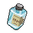

##  象龜．威廉姆

|體質|力量|敏捷|智力|
|:--:|:--:|:--:|:--:|
|10|8|2|6|

### 簡介

背有巨大龜殼的象龜。年紀目測頗為年長，但龜類的壽命最好還是不要用常識來判斷。雖然性格頗為親切，但極其緩慢的語速加上奇怪的斷句位置，卻讓和他的交流成為了一種可怕的精神折磨。如果沒有巖石般耐心的話還是不要隨便搭話的好…

### 故事

老威廉姆干了一輩子的貨車司機。他在“很老”的時候，在一次送貨的途中認識了漂亮的加油站女工琳達，她龜殼上的性感紋路，讓威廉姆神魂顛倒。很快他們就墜入了愛河，并生下了女兒喬安娜。

不過由于工作的原因，常年在路上奔波的威廉姆總是與家人聚少離多。當他終于決定退休的時候，喬安娜已經長成了一個少女。深深的代溝與薄弱的感情，帶給威廉姆的并不是退休后的天倫之樂，而是各種因瑣事引發的爭吵。終于在一天，當威廉姆嚴厲的禁止女兒穿著“漏殼裝”前去參加校園舞會后，喬安娜摔門而出…

威廉姆原本覺得女兒只是因為賭氣而離家，但在一夜過后，他還是打給了喬安娜的幾個好友，但她們都說昨晚沒有收留喬安娜…女兒的失蹤讓威廉姆慌了神，他去鎮上報了警，并讓司機同行們在各處搜尋喬安娜的行蹤。

一周過去了，焦急的琳達終日以淚洗面，而威廉姆也因自己當時的過分嚴厲而倍感自責。正當他們漸漸失去希望的時候，一名司機傳來了關鍵消息。他打聽到，某個街頭流浪漢看見一個穿著“漏殼裝”的烏龜女孩在公園小道上了一輛轎車。

得到消息的威廉姆馬上聯系了警察，沒用久警方便根據描述鎖定了擄走喬安娜的疑犯目標，剛因瀆職被開除的學校保安沃爾夫岡。警方隨即展開行動，在沃爾夫岡家中將其抓獲，并從漆黑的地窖中救出了喬安娜。

地獄般的一周摧毀了喬安娜的精神，她變得自閉，整日蜷縮在自己的殼中。女兒的遭遇讓威廉姆傷心欲絕，他憎恨沃爾夫岡的惡魔行徑，也憎恨自己沒有盡到一個父親的職責。

不久之后，案件開庭了。因為證據確鑿，沃爾夫岡被判處了長時間的監禁。但那個混蛋居然在法庭上拒絕道歉，并且大放厥詞，不斷的侮辱喬安娜，以及嘲諷威廉姆的無能…

日頭高照，單獨押送沃爾夫岡的囚車行駛在開往監獄的路上。突然，一輛重型卡車從路邊沖出，將囚車撞翻！劫囚者從暈倒的警衛身上搜出了鑰匙，將沃爾夫岡從囚車中拖了出來。當沃爾夫岡從震蕩中清醒過來后，一個巨大的龜殼映入眼簾。“監獄……不是你該去的地方……混蛋，地獄……才是！”

引擎發動\~喇叭轟鳴\~！卡車的車輪裹挾著一名父親的憤怒，從沃爾夫岡充滿恐懼的臉上碾過…

### 結識對話

- **年輕人……**
- **你……**
- 我？我怎么了？
- **你好……**
- {sweat1}
- *他的語速也==太慢了==吧\~*
- **很高興……**
- **認識……你。**
- {down1}
- *我感覺我的生命正在無情的流逝…*
- **我在這里……**
- **待了……很多年……**
- **所以……**
- {hate1}
- *救命，誰來救救我，我的耐心快要消耗光了。*
- **你要是……**
- **有什么……**
- **需要……了解的……**
- {pain1}
- *天哪\~快結束這一切吧\~我感覺掉入黑洞了。*
- **隨時……**
- **可以……來問我……**
- **別客氣……**
- 謝謝\~！你的好意我心領了！很高興和你聊天！再見！

### 深入了解對話

- **年輕人……**
- **你又來……找我……聊天了？**
- **你的……耐心令我……欽佩。**
- 這能幫我消磨時間。
- 其實，習慣就好了。
- **那……你想……聊些什么？**
- 比如說說你的故事？你看上去并不壞，為什么會進監獄？
- **那是個……很長……很長……很長……的故事。**
- **我沒……信心……能一口氣，把它……說完。**

#### 我有==2根[薄荷葉卷]==。

> 他開始了漫長的講述，但你用強大的耐心挺了過來。

- 這能幫你提神醒腦，也能讓你的語速更快一些。
- **哦……謝謝你。**
- **好久……沒人……送我這個老家伙……禮物了。**
- **那就聽我……慢慢嘮叨吧……**
- *永遠不要低估一個父親的憤怒…*
- 喬安娜，她現在怎么樣了？好些了嗎？
- **時間……治愈了……傷口。**
- **她已經……學會了……迎接新的生活。**
- 我替你感到高興\~威廉姆。
- 你也學著原諒自己吧…

#### 取消

- *他說的沒錯，以他的語速，說完整個故事怕是要到明天…*
- *或許來==2根[薄荷葉卷]==，能讓他的嘴皮子更敏捷一些。*
### 初始物品

|物品名稱|物品名稱|物品名稱|物品名稱|物品名稱|
|:--:|:--:|:--:|:--:|:--:|
|  |  |  |  |  |
| 拖鞋 | 護身符 | 薄荷葉*3 | 華夫餅*2 | 曲奇餅干*4 |
|  |  |  |  |  |
| 咖啡粉*3 | 茶包*3 | 火柴*3 | 硬幣 |  |
### 送禮

|圖片|物品名稱|好感|回應|
|:--:|--|:--:|--|
||運動鞋|-1|咳咳\~我這副老骨頭…可不適合…這個…|
||皮鞋|1|我的孩子…你可真客氣…|
||帆布鞋|0|謝謝你…年輕人…|
||拖鞋|1|我的孩子…你可真客氣…|
||墨鏡|0|謝謝你…年輕人…|
||眼鏡|2|謝謝你…好孩子…我正需要這個。|
||頭帶|-1|咳咳\~我這副老骨頭…可不適合…這個…|
||棒球帽|0|謝謝你…年輕人…|
||毛線帽|1|我的孩子…你可真客氣…|
||紅頭巾|-1|咳咳\~我這副老骨頭…可不適合…這個…|
||綠頭巾|-1|咳咳\~我這副老骨頭…可不適合…這個…|
||橡膠手套|0|謝謝你…年輕人…|
||黑手|-2|年輕人…惡人…會有惡報的…|
||手表|2|我總會…錯過時間，有了它…就不用擔心了。|
||護身符|2|孩子…森林之父…會指引我們的。|
||牙齒項鏈|-2|年輕人…暴力…終將招致惡果…|
||《死靈之書》|-2|老人家的預感…這東西…散發著不祥的氣息。|
||自制口罩|0|謝謝你…年輕人…|
||隨身聽（開機）|0|謝謝你…年輕人…|
||隨身聽（關機）|0|謝謝你…年輕人…|
||隨身聽（沒電）|0|謝謝你…年輕人…|
||酒葫蘆|1|我的孩子…你可真客氣…|
||黑桃A|-1|哎\~沒人想和我玩牌…因為…我太慢了…|
||薄荷葉|1|我的孩子…你可真客氣…|
||薄荷葉卷|1|我的孩子…你可真客氣…|
||蘑菇|0|謝謝你…年輕人…|
||蘑菇粉|-1|年輕人…你該離這些東西…遠點…|
||瀉藥|-1|年輕人…你該離這些東西…遠點…|
||紫鳶花|0|謝謝你…年輕人…|
||花瓣粉|-1|年輕人…你該離這些東西…遠點…|
||安眠藥|1|謝謝…我的失眠…總算有救了…|
||止疼片|1|謝謝…我的背痛…總算有救了…|
||興奮劑|-1|年輕人…你該離這些東西…遠點…|
||醫用酒精|0|謝謝你…年輕人…|
||酒精燈|0|謝謝你…年輕人…|
||鎮靜劑|0|謝謝你…年輕人…|
||啤酒|1|我的孩子…你可真客氣…|
||蘋果酒|1|我的孩子…你可真客氣…|
||精釀蘋果酒|2|（嗅\~嗅）這聞起來…可是好酒…|
||蘋果|1|我的孩子…你可真客氣…|
||華夫餅|0|謝謝你…年輕人…|
||奶油華夫餅|0|謝謝你…年輕人…|
||一把咖啡豆|1|我的孩子…你可真客氣…|
||口香糖|0|謝謝你…年輕人…|
||曲奇餅干|0|謝謝你…年輕人…|
||焦糖棒|0|謝謝你…年輕人…|
||汽水|0|謝謝你…年輕人…|
||酸奶|0|謝謝你…年輕人…|
||土豆披薩|0|謝謝你…年輕人…|
||咖啡粉|2|這咖啡粉…磨得可真細…應該能泡出一杯不錯的咖啡。|
||茶包|1|我的孩子…你可真客氣…|
||泡面|0|謝謝你…年輕人…|
||蛋白粉|0|謝謝你…年輕人…|
||布條|-1|嗯…？你這是…什么意思？|
||回形針|0|謝謝你…年輕人…|
||開鎖器|-1|嗯…？你這是…什么意思？|
||開鎖器(P)|-1|嗯…？你這是…什么意思？|
||肥皂|1|我正需要用它…洗掉殼子上的…苔蘚。|
||香皂|1|我正需要用它…洗掉殼子上的…苔蘚。|
||計算器|0|謝謝你…年輕人…|
||《花花世界》（全新）|-2|色欲…！是萬惡之源…！|
||《花花世界》（看過）|-2|色欲…！是萬惡之源…！|
||《花花世界》（翻爛）|-2|色欲…！是萬惡之源…！|
||馬女郎海報|-2|色欲…！是萬惡之源…！|
||貓女郎海報|-2|色欲…！是萬惡之源…！|
||狐女郎海報|-2|色欲…！是萬惡之源…！|
||兔女郎海報|-2|色欲…！是萬惡之源…！|
||咖啡磨|1|我的孩子…你可真客氣…|
||掌上游戲機|-1|哎\~我可玩不來這種…年輕人的玩具…|
||掌上游戲機（沒電）|-1|哎\~我可玩不來這種…年輕人的玩具…|
||電池|0|謝謝你…年輕人…|
||牙刷|0|謝謝你…年輕人…|
||牙膏|0|謝謝你…年輕人…|
||空的牙膏管|-1|嗯…？你這是…什么意思？|
||消毒液|-1|嗯…？你這是…什么意思？|
||除銹劑|-1|嗯…？你這是…什么意思？|
||火柴|0|謝謝你…年輕人…|
||膠帶|-1|嗯…？你這是…什么意思？|
||顏料|0|謝謝你…年輕人…|
||釘子|-1|嗯…？你這是…什么意思？|
||鞋帶|-1|嗯…？你這是…什么意思？|
||白紙|0|謝謝你…年輕人…|
||紙鶴|0|謝謝你…年輕人…|
||花束|-1|嗯…？你這是…什么意思？|
||胡亂的涂鴉|-1|呃\~我好像沒看懂…這畫的含義…|
||簡單的漫畫|0|謝謝你…年輕人…|
||精美的畫作|1|謝謝…我會把它放在囚室…最顯眼的地方。|
||鉛筆|0|謝謝你…年輕人…|
||鉛筆|0|謝謝你…年輕人…|
||圓珠筆|0|謝謝你…年輕人…|
||圓珠筆|0|謝謝你…年輕人…|
||硬幣|0|謝謝你…年輕人…|
||長螺絲|-2|年輕人…暴力…終將招致惡果…|
||扳手|-2|年輕人…暴力…終將招致惡果…|
||湯匙|0|謝謝你…年輕人…|
||湯匙|0|謝謝你…年輕人…|
||釘錘|-2|年輕人…暴力…終將招致惡果…|
||剪刀|-2|年輕人…暴力…終將招致惡果…|
||碎玻璃|-2|年輕人…暴力…終將招致惡果…|
||玻璃匕首|-2|年輕人…暴力…終將招致惡果…|
||玻璃匕首(+)|-2|年輕人…暴力…終將招致惡果…|
||牙刷匕首|-2|年輕人…暴力…終將招致惡果…|
||牙刷匕首(+)|-2|年輕人…暴力…終將招致惡果…|
||水果刀|-2|年輕人…暴力…終將招致惡果…|
||折斷的木條|-2|年輕人…暴力…終將招致惡果…|
||雙節棍|-1|咳咳\~我這副老身板…可不適合…這個…|
||雙節棍(+)|-1|咳咳\~我這副老身板…可不適合…這個…|
||釘棒|-2|年輕人…暴力…終將招致惡果…|
||釘棒(+)|-2|年輕人…暴力…終將招致惡果…|
||鐵管|-2|年輕人…暴力…終將招致惡果…|
||皮帶|0|謝謝你…年輕人…|
||皮帶|0|謝謝你…年輕人…|
||發霉的面包|-2|我老了…腸胃可消化不了這個…|
||金龜子|2|呵呵\~你要把這…金色的小家伙…給我嗎？|
||《森之音》|2|孩子…森林之父…會指引我們的。|
||DEMO限定紙鶴|2|孩子…我沒想到…居然能收到這個…|

