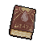

#  貘．米格爾

|體質|力量|敏捷|智力|幫派|戰鬥等級|勒索難度|持有天賦|取得天賦|
|:--:|:--:|:--:|:--:|:--:|:--:|:--:|:--:|:--:|
|8|6|5|7|無幫派|中|中|[醫學](技能.md#醫學)|[心理作用](技能.md#心理作用)|

## 故事

長著奇怪鼻子的貘，是個招呼不打就隨意對別人進行催眠的家伙。但是他的催眠突襲卻對你無效，不知道是他本領不行，還是你擁有著特殊的“超夢體質”。但不管原因為何，你都決定離這家伙遠點了…

米格爾原本是一名知名的心理醫生，主攻的領域正是犯罪心理學。他經常受邀為擁有心理健康問題的罪犯進行治療，而他最擅長的手段就是催眠。經過他催眠的犯人大多都能恢復正常，即使無法治愈也能暫時緩解症狀。

可是就在米格爾認為自己的醫學理論已經無懈可擊的情況下，一個奇怪的病人卻出現了。這個病人錯亂而癲狂的精神狀態讓米格爾一籌莫展，並且各種催眠方法也都對其無效。在查閱資料後米格爾得出結論，這個病人一定是擁有極為罕見的“超夢體質”，擁有該體質的患者易將夢境與現實混淆，並且絕無被催眠的可能。

這個結論如同將米格爾的催眠療法判了“死刑”，學術對手們也借此機會對他展開了冷嘲熱諷。不甘就此失去學術權威地位的米格爾最終選擇了一項危險的嘗試，那就是改進被稱為心理學墳墓的“共感療法”。

“共感療法”指的是醫生通過模仿病人的言行，由內而外的感知病人的精神世界，最終發現病因並進行治療的方法。只不過，米格爾在此基礎上更加深入了一步，他為了證明自己的催眠療法可以戰勝所謂的“超夢體質”，在治療過程中插入了一個環節，那就是在學習模仿病人的心理狀態後，對著鏡子催眠自己。“在表意識休眠狀態下，潛意識將能不受阻礙的模擬病人的精神世界。”這是米格爾提出的理論。他將該方法命名為“逆向催眠法”。

為了展示自己對新療法的自信，米格爾邀請了眾多學術專家們一同見證了他的診療過程。模仿、催眠、感受，米格爾通過“逆向催眠法”順利進入了病人的精神世界…

“那是一個有序的混亂空間，破壞欲望的初衷是為了將一切恢復本源，我感受到了某種熱切的平靜。”當米格爾醒來之後，激動的將自己的體驗告訴了臺下的觀眾們，但卻從他們的臉上讀出了驚訝與恐懼…回過神來的米格爾發現自己用於記錄病情的鋼筆被牢牢的攥在手裡，而筆尖的另一端卻深深的插入了病人的眼窩中！很顯然這次的精神模擬是成功的，只是有些“過於”的成功了。

因蓄意殺害病人，米格爾被送入了這座監獄。在服刑過程中他結識了山羊·威爾伯，威爾伯的神秘理論給了米格爾諸多啟示。他漸漸開始明白那個“混亂空間”究竟是什麼？以及那個病人在死亡時，為何臉上會掛著一種勝利者般的笑容…

## 結識對話

- 你的鼻子看上去…有點奇怪。
- **注意我鼻子的擺動…放鬆\~**
- {question1}
- **3·2·1…睡吧\~**
- ……
- **……**
- ……
- 你究竟…在幹嘛？
- **{question1}**
- **你怎麼…沒睡？難道說剛才的`催眠`沒起效？**
- **{think1}**
- **（小聲）是哪一步出錯了呢？是鼻子的擺動太慢了嗎？**
- 催眠？你剛剛是在…催眠我？
- **（小聲）難道他是`超夢體質`？那可真是找到好素材了…**
- **{smile1}**
- **嗯\~請你平躺在這裡，我想用“逆向催眠法”再試一次\~**
- {sweat1}
- *這家伙肯定不正常…我最好離他遠一點。*

## 深入了解對話

- **素材002號，你終於答應配合我的“逆向催眠法”了嗎？**
- {hate1}
- 我有名字！而且我說過，不會答應你的變態要求。
- **既然這樣，那你對我來說還有別的價值嗎？**
- **{think1}**
- **如果是“超夢體質”的話，或許會有特殊的`夢魘殘留`。**
- **那應該也是不錯的研究材料…**

#### 我的確正被`夢魘纏身`。

> 他如願獲得了你關於夢魘的記憶，而你也借此得知了他的過去。

- 如果你想研究的話，那就拿什麼來交換吧。
- **交換嗎…？那就用我的故事來換如何？**
- *醫生反而被“感染”成了病人…*
- **那個偉大的“混亂空間”才是一切的真理。**
- **蘇醒既是沉睡…**
- **沉睡才是蘇醒。**
- **素材002號，終有一天你將理解我說的話…**
- {sweat1}

#### 取消

- `夢魘`？不好意思，我最近做過的夢全都忘光了。
- 你的變態癖好還是找別的家伙來滿足吧…

## 特殊對話

### 打招呼（關係極好）

- **你好，素材002號…**

### 打招呼（關係好）

- **放鬆…有話慢慢說。**

### 打招呼（關係一般）

- **放鬆…有話慢慢說。**

### 打招呼（關係差）

- **噓…安靜一點。**

### 打招呼（關係極差）

- **黑暗即將來臨…**

### 進行毆打

- **準備長眠吧…**
- **噓…你會見識到什麼才是真正的恐懼。**
- **讓我來為你植入最深的痛苦吧…**

### 回禮

- **然後…收下這個吧，我想觀察你的反應。**

### 勒索成功

- **這些錢你可以拿走，但你做好付出代價的準備了嗎？**

### 勒索失敗

- **你無法贏過我…因為我曾品嘗過你想象之外的恐懼。**

### 一起吃飯被拒

- **噓\~相信我，你並不想坐在這裡…不想。**

### 分享食物

- **當然…不過我期待著你和我分享“更多”…**

### 加藥被發現

- **你的手裡…好像握著什麼？**

### 加藥辯解失敗

- **你的謊言甚至連自己都無法欺騙。**

### 索要食物成功

- **如此請求，我定當滿足…**

### 索要食物失敗

- **噓…安靜…安靜一點…**

## 聊天

- **你答應做我的實驗素材了嗎？**
- 怎麼可能？誰知道你會對我做什麼奇怪的事情！
- **那麼…你回來找我做什麼？**
- *呃…對啊…？我回來找他做什麼？*
- **你是不是忘記了？這麼看來…之前的催眠在潛意識裡還是留下了種子。**
- 潛意識？你的意思是…我的腦子被你操控了？！
- **我說別緊張，這事你過一會也會忘記的，這就像個循環…**
- 循環…？你究竟在說什麼？
- **我說別緊張，這事你過一會也會忘記的，這就像個循環…**
- 循環…？你究竟在說什麼？
- **我說別緊張，這事你過一會也會忘記的，這就像個循環…**
- *停！我剛剛是怎麼了？*
- **{smile1}**

## 初始物品

||||||
|:--:|:--:|:--:|:--:|:--:|
||||||
|[黑手](26-黑手.md)|[牙刷匕首](156-牙刷匕首.md)|[玻璃匕首](154-玻璃匕首.md)|[瀉藥](44-瀉藥.md)*3|[紫鳶花](45-紫鳶花.md)*4|
||||||
|[安眠藥](47-安眠藥.md)*4|[鎮靜劑](53-鎮靜劑.md)*3|[布條](84-布條.md)*3|[硬幣](135-硬幣.md)||

## 送禮

|圖片|物品名稱|好感|回應|
|:--:|--|:--:|--|
||[DEMO限定紙鶴](209-DEMO限定紙鶴.md)|50|我對你好感度正在急劇變化…這是反催眠嗎？|
||[手錶](27-手錶.md)|24|它能喚醒被催眠的患者，但這實在太過殘忍了…|
||[《死靈之書》](31-《死靈之書》.md)|24|Yacaqu! Shub'th!|
||[金龜子](202-金龜子.md)|20|金色傳說…|
||[隨身聽（開機）](34-隨身聽（開機）.md)|18|你知道我需要什麼？看來你對心理學也有所研究…素材002號。|
||[隨身聽（關機）](35-隨身聽（關機）.md)|18|你知道我需要什麼？看來你對心理學也有所研究…素材002號。|
||[隨身聽（沒電）](36-隨身聽（沒電）.md)|18|你知道我需要什麼？看來你對心理學也有所研究…素材002號。|
||[黑手](26-黑手.md)|16|物理催眠也未嘗不是一種好方法。|
||[皮鞋](15-皮鞋.md)|15|你知道我需要什麼？看來你對心理學也有所研究…素材002號。|
||[墨鏡](18-墨鏡.md)|15|你知道我需要什麼？看來你對心理學也有所研究…素材002號。|
||[拖鞋](17-拖鞋.md)|12|你知道我需要什麼？看來你對心理學也有所研究…素材002號。|
||[棒球帽](21-棒球帽.md)|12|（小聲）來自素材的禮物，有研究的價值…|
||[牙齒項鏈](30-牙齒項鏈.md)|12|（小聲）來自素材的禮物，有研究的價值…|
||[酒精燈](52-酒精燈.md)|12|你知道我需要什麼？看來你對心理學也有所研究…素材002號。|
||[鎮靜劑](53-鎮靜劑.md)|12|萬象皆藏幻夢中，至高之主\~會為你揭示…|
||[香皂](89-香皂.md)|12|你知道我需要什麼？看來你對心理學也有所研究…素材002號。|
||[精美的畫作](130-精美的畫作.md)|12|這是你殘存夢境的印象嗎？看來值得研究…|
||[圓珠筆](133-圓珠筆.md)|12|你知道我需要什麼？看來你對心理學也有所研究…素材002號。|
||[圓珠筆](134-圓珠筆.md)|12|你知道我需要什麼？看來你對心理學也有所研究…素材002號。|
||[扳手](142-扳手.md)|12|（小聲）來自素材的禮物，有研究的價值…|
||[釘錘](151-釘錘.md)|12|（小聲）來自素材的禮物，有研究的價值…|
||[眼鏡](19-眼鏡.md)|10|（小聲）來自素材的禮物，有研究的價值…|
||[酒葫蘆](37-酒葫蘆.md)|10|（小聲）來自素材的禮物，有研究的價值…|
||[水果刀](158-水果刀.md)|10|（小聲）來自素材的禮物，有研究的價值…|
||[雙節棍(+)](161-雙節棍(+).md)|10|（小聲）來自素材的禮物，有研究的價值…|
||[橡膠手套](25-橡膠手套.md)|9|你知道我需要什麼？看來你對心理學也有所研究…素材002號。|
||[瀉藥](44-瀉藥.md)|9|你知道我需要什麼？看來你對心理學也有所研究…素材002號。|
||[帆布鞋](16-帆布鞋.md)|8|（小聲）來自素材的禮物，有研究的價值…|
||[毛線帽](22-毛線帽.md)|8|（小聲）來自素材的禮物，有研究的價值…|
||[自製口罩](32-自製口罩.md)|8|（小聲）來自素材的禮物，有研究的價值…|
||[安眠藥](47-安眠藥.md)|8|萬象皆藏幻夢中，至高之主\~會為你揭示…|
||[精釀蘋果酒](56-精釀蘋果酒.md)|8|（小聲）來自素材的禮物，有研究的價值…|
||[奶油華夫餅](68-奶油華夫餅.md)|8|（小聲）來自素材的禮物，有研究的價值…|
||[土豆披薩](75-土豆披薩.md)|8|（小聲）來自素材的禮物，有研究的價值…|
||[計算機](101-計算機.md)|8|（小聲）來自素材的禮物，有研究的價值…|
||[咖啡磨](109-咖啡磨.md)|8|（小聲）來自素材的禮物，有研究的價值…|
||[花束](127-花束.md)|8|（小聲）來自素材的禮物，有研究的價值…|
||[剪刀](152-剪刀.md)|8|（小聲）來自素材的禮物，有研究的價值…|
||[雙節棍](160-雙節棍.md)|8|（小聲）來自素材的禮物，有研究的價值…|
||[釘棒(+)](163-釘棒(+).md)|8|（小聲）來自素材的禮物，有研究的價值…|
||[皮帶](166-皮帶.md)|8|（小聲）來自素材的禮物，有研究的價值…|
||[皮帶](167-皮帶.md)|8|（小聲）來自素材的禮物，有研究的價值…|
||[薄荷葉卷](41-薄荷葉卷.md)|6|（小聲）來自素材的禮物，有研究的價值…|
||[紫鳶花](45-紫鳶花.md)|6|你知道我需要什麼？看來你對心理學也有所研究…素材002號。|
||[花瓣粉](46-花瓣粉.md)|6|你知道我需要什麼？看來你對心理學也有所研究…素材002號。|
||[啤酒](54-啤酒.md)|6|（小聲）來自素材的禮物，有研究的價值…|
||[蘋果酒](55-蘋果酒.md)|6|（小聲）來自素材的禮物，有研究的價值…|
||[蘋果](64-蘋果.md)|6|你知道我需要什麼？看來你對心理學也有所研究…素材002號。|
||[華夫餅](67-華夫餅.md)|6|（小聲）來自素材的禮物，有研究的價值…|
||[超辣泡麵](78-超辣泡麵.md)|6|（小聲）來自素材的禮物，有研究的價值…|
||[蛋白粉](79-蛋白粉.md)|6|（小聲）來自素材的禮物，有研究的價值…|
||[肥皂](88-肥皂.md)|6|你知道我需要什麼？看來你對心理學也有所研究…素材002號。|
||[紙鶴](126-紙鶴.md)|6|（小聲）來自素材的禮物，有研究的價值…|
||[簡單的漫畫](129-簡單的漫畫.md)|6|（小聲）來自素材的禮物，有研究的價值…|
||[硬幣](135-硬幣.md)|6|你知道我需要什麼？看來你對心理學也有所研究…素材002號。|
||[長螺絲](136-長螺絲.md)|6|（小聲）來自素材的禮物，有研究的價值…|
||[玻璃匕首(+)](155-玻璃匕首(+).md)|6|（小聲）來自素材的禮物，有研究的價值…|
||[牙刷匕首(+)](157-牙刷匕首(+).md)|6|（小聲）來自素材的禮物，有研究的價值…|
||[釘棒](162-釘棒.md)|6|（小聲）來自素材的禮物，有研究的價值…|
||[鐵管](164-鐵管.md)|6|（小聲）來自素材的禮物，有研究的價值…|
||[黑桃A](39-黑桃A.md)|4|（小聲）來自素材的禮物，有研究的價值…|
||[薄荷葉](40-薄荷葉.md)|4|（小聲）來自素材的禮物，有研究的價值…|
||[止疼片](49-止疼片.md)|4|（小聲）來自素材的禮物，有研究的價值…|
||[醫用酒精](51-醫用酒精.md)|4|（小聲）來自素材的禮物，有研究的價值…|
||[焦糖棒](72-焦糖棒.md)|4|（小聲）來自素材的禮物，有研究的價值…|
||[汽水](73-汽水.md)|4|（小聲）來自素材的禮物，有研究的價值…|
||[酸奶](74-酸奶.md)|4|（小聲）來自素材的禮物，有研究的價值…|
||[茶包](77-茶包.md)|4|（小聲）來自素材的禮物，有研究的價值…|
||[開鎖器](87-開鎖器.md)|4|（小聲）來自素材的禮物，有研究的價值…|
||[開鎖器(P)](38-開鎖器(P).md)|4|（小聲）來自素材的禮物，有研究的價值…|
||[牙刷](115-牙刷.md)|4|（小聲）來自素材的禮物，有研究的價值…|
||[牙膏](116-牙膏.md)|4|（小聲）來自素材的禮物，有研究的價值…|
||[鉛筆](131-鉛筆.md)|4|（小聲）來自素材的禮物，有研究的價值…|
||[鉛筆](132-鉛筆.md)|4|（小聲）來自素材的禮物，有研究的價值…|
||[湯匙](143-湯匙.md)|4|（小聲）來自素材的禮物，有研究的價值…|
||[湯匙](144-湯匙.md)|4|（小聲）來自素材的禮物，有研究的價值…|
||[玻璃匕首](154-玻璃匕首.md)|4|（小聲）來自素材的禮物，有研究的價值…|
||[牙刷匕首](156-牙刷匕首.md)|4|（小聲）來自素材的禮物，有研究的價值…|
||[口香糖](70-口香糖.md)|2|（小聲）來自素材的禮物，有研究的價值…|
||[曲奇餅乾](71-曲奇餅乾.md)|2|（小聲）來自素材的禮物，有研究的價值…|
||[布條](84-布條.md)|2|（小聲）來自素材的禮物，有研究的價值…|
||[迴紋針](86-迴紋針.md)|2|（小聲）來自素材的禮物，有研究的價值…|
||[電池](114-電池.md)|2|（小聲）來自素材的禮物，有研究的價值…|
||[火柴](120-火柴.md)|2|（小聲）來自素材的禮物，有研究的價值…|
||[白紙](125-白紙.md)|2|（小聲）來自素材的禮物，有研究的價值…|
||[碎玻璃](153-碎玻璃.md)|2|（小聲）來自素材的禮物，有研究的價值…|
||[折斷的木條](159-折斷的木條.md)|2|（小聲）來自素材的禮物，有研究的價值…|
||[消毒液](118-消毒液.md)|-2|（小聲）毫無價值的研究材料…來自素材002號。|
||[除銹劑](119-除銹劑.md)|-2|（小聲）毫無價值的研究材料…來自素材002號。|
||[膠帶](121-膠帶.md)|-2|（小聲）毫無價值的研究材料…來自素材002號。|
||[顏料](122-顏料.md)|-2|（小聲）毫無價值的研究材料…來自素材002號。|
||[釘子](123-釘子.md)|-2|（小聲）毫無價值的研究材料…來自素材002號。|
||[鞋帶](124-鞋帶.md)|-2|（小聲）毫無價值的研究材料…來自素材002號。|
||[蘑菇](42-蘑菇.md)|-4|吵鬧的現實…粉飾的假象。|
||[蘑菇粉](43-蘑菇粉.md)|-4|吵鬧的現實…粉飾的假象。|
||[《花花世界》（翻爛）](104-《花花世界》（翻爛）.md)|-4|低級的欲望…真理的絆腳石。|
||[胡亂的塗鴉](128-胡亂的塗鴉.md)|-4|（小聲）毫無價值的研究材料…來自素材002號。|
||[興奮劑](50-興奮劑.md)|-6|吵鬧的現實…粉飾的假象。|
||[《花花世界》（看過）](103-《花花世界》（看過）.md)|-6|低級的欲望…真理的絆腳石。|
||[紅頭巾](23-紅頭巾.md)|-8|偽造的軀體…靈魂的枷鎖。|
||[綠頭巾](24-綠頭巾.md)|-8|偽造的軀體…靈魂的枷鎖。|
||[《花花世界》（全新）](102-《花花世界》（全新）.md)|-8|低級的欲望…真理的絆腳石。|
||[頭帶](20-頭帶.md)|-10|偽造的軀體…靈魂的枷鎖。|
||[運動鞋](14-運動鞋.md)|-12|偽造的軀體…靈魂的枷鎖。|
||[馬女郎海報](105-馬女郎海報.md)|-12|低級的欲望…真理的絆腳石。|
||[貓女郎海報](106-貓女郎海報.md)|-12|低級的欲望…真理的絆腳石。|
||[狐女郎海報](107-狐女郎海報.md)|-12|低級的欲望…真理的絆腳石。|
||[兔女郎海報](108-兔女郎海報.md)|-12|低級的欲望…真理的絆腳石。|
||[掌上遊戲機](110-掌上遊戲機.md)|-12|低級的欲望…真理的絆腳石。|
||[掌上遊戲機（沒電）](111-掌上遊戲機（沒電）.md)|-12|低級的欲望…真理的絆腳石。|
||[空的牙膏管](117-空的牙膏管.md)|-20|（小聲）垃圾…來自素材002號。|
||[一把咖啡豆](69-一把咖啡豆.md)|-40|拒絕睡眠？多麼愚蠢的行為…|
||[咖啡粉](76-咖啡粉.md)|-40|拒絕睡眠？多麼愚蠢的行為…|
||[發霉的麵包](200-發霉的麵包.md)|-40|（小聲）垃圾…來自素材002號。|
||[《森之音》](203-《森之音》.md)|-80|混淆真理的虛假偶像…毀滅的鐘聲近了。|
||[護身符](29-護身符.md)|-100|混淆真理的虛假偶像…毀滅的鐘聲近了。|

