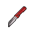
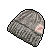

#  負鼠．埃迪

|體質|力量|敏捷|智力|幫派|戰鬥等級|勒索難度|持有天賦|取得天賦|
|:--:|:--:|:--:|:--:|:--:|:--:|:--:|:--:|:--:|
|3|4|5|4|無幫派|弱|易|[鎖匠](技能.md#鎖匠)|[全搬走！](技能.md#全搬走！)|

## 故事

一只倒霉的負鼠，因為一次失敗的入室盜竊而惹禍上身。一場連坐牢都無法逃避的“美妙愛情”正如噩夢般糾纏著他。如果他不老老實實的和那位“姑娘”結婚的話，或許就無法保住自己年輕的命根子了。現在，距離出獄已不到一百天，他究竟能否化解這場危機呢？

“嘿\~你說像我這樣的霉運，會不會是身上跟了什麼臟東西…？”埃迪打趣的說道。

如果評選誰是監獄前五倒霉蛋的話，負鼠·埃迪一定會榜上有名。據他所說，從小到大他的霉運就一直沒有間斷。在他五歲那年，家裡的房子被閃電擊中，大火燒毀了所有家當。十歲那年，開出租的父親因為疲勞駕駛把車開進了路溝裡，不但自己丟了性命，家裡還攤上了賠償重傷乘客的巨額債務。十六歲那年，他就讀的學校發生了槍擊事件，埃迪的屁股上狠狠挨了一槍…

成績糟糕的埃迪沒能念完中學，為了不給母親和妹妹“添麻煩”，於是主動搬出了家裡。他起初在汽車餐廳打零工，但因為和刻薄的主管有矛盾，於是一氣之下偷了收銀機裡的錢。進了看守所之後，埃迪在裡面認識了一些“前輩”，他從他們那兒學了不少的手上功夫，出來之後便開始了自己的盜賊生活。

不過即使做了賊，埃迪的霉運依然伴隨左右。幾年時間裡，他成功得手的次數屈指可數。通常不是在踩點的時候遇到警察盤問，就是活干到一半撞見主人回家，總之說出來都是辛酸淚。而這次更是天降橫禍，誰能想到偷東西會偷出個“未婚妻”來，而且還是甩都甩不掉的那種…

事到如今，埃迪決定和命運做最後的抗爭。而他想到的辦法居然是——越獄！

你理解他現在焦躁的心情，但他的計劃簡直就是在自尋死路（如果那也能稱為計劃的話）。你勸說他不要犯傻，並答應幫他想想辦法。但是你心裡清楚，像他那樣的霉運，即使再精密的計劃或許都會出現意外…

## 結識對話

- **（自言自語）哎\~又是一天，刑期只剩不到一百天了…**
- 嗨…出獄不是好事嗎？你怎麼唉聲嘆氣的。
- **呵呵\~你不明白，出獄對我來說簡直就是災難…**
- **{down1}**
- **你知道我為什麼會進來嗎？**
- {question1}
- **那是去年的一個晚上…我本想隨便找一家偷點零花錢。**
- **我順著排水管爬到二樓浴室，結果那家的女主人正在洗澡。**
- :point_right:那你豈不是看了個精光？
- :point_right:你可真是艷福不淺…
- **倒霉的就是這個！那是個老姑娘，又老又丑，還有口臭\~**
- **…她非說我玷污了她的貞潔，逼著我娶她！**
- **我嚇得當時就報警自首了…**
- 呃\~這可真是個曲折的故事。
- **你以為事情就這麼結束了…？不，並沒有\~**
- **她的哥哥是個黑道頭子，他威脅我如果不娶她妹妹…**
- **就找手下把我閹了…真該死！我還這麼年輕\~**
- **{weep1}**
- 好吧\~我現在能理解，你為什麼不想出獄了…

## 深入了解對話

- 埃迪\~看你愁眉苦臉的，還在煩心“未婚妻”的事情嗎？
- **其實…我已經想到解決的辦法了…**
  - 什麼辦法…？
  - 我有種不好的預感。
- **實話告訴你吧，我決定`越獄`！**
- {exclamation1}
- **只要我消失了，她就再也沒法纏著我了！**
- 喂喂\~你知道越獄有多危險嗎？！說不定你會把命丟了…

#### `說服`他放棄越獄。

> 在你的勸說下他終於打消了越獄的念頭，並和你聊起了以前的事。

- 你先告訴我，你的越獄計劃是什麼？
- **計劃…憑我的腦子可想不出什麼好計劃…**
- **我準備等囚車送新犯人來的時候，溜到車底藏起來，然後…**
- 你這簡直就是在送死！哨塔上的警衛會把你`當靶子打的`！
- **{weep1}**
- **那我該怎麼辦？剩下的日子越來越少了…**
- 你先冷靜點，別再想越獄的事了，我來幫你想想其他辦法…
- *這家伙可真夠倒霉的…*
- **你有想到什麼其他主意嗎…？**
- {think1}
- 我想…既然你的“未婚妻”只是著急嫁出去的話…
- 那你不如找個比你優秀的家伙介紹給她。
- 說不定…她看了之後就會把你“甩了”？
- **這聽上去是個不錯的點子，但有誰會願意接手這門“親事”呢？**
- **{think1}**
- **哈！我想到了！我最近交了個新朋友，即聰明又帥氣，而且還很好心腸。**
- 你說的這個朋友…是誰？
- **嘿嘿\~他遠在天邊近在眼前！**
- {sweat1}

#### 取消

- **我既不想丟了命根子，也不想“開坦克”！所以再危險我也得試試。**
- **你別勸我了，我去意已決！**
- {down1}

## 特殊對話

### 打招呼（關係極好）

- **咱們應該互相幫助。**

### 打招呼（關係好）

- **哎\~有事嗎，伙計？**

### 打招呼（關係一般）

- **（自言自語）時間不多了…**

### 打招呼（關係差）

- **閒聊的話，我可沒心情…**

### 打招呼（關係極差）

- **拜托，能別來煩我嗎？**

### 進行毆打

- **想打架嗎？我正好也想發泄一下！**
- **來吧！動手吧！我會讓你後悔的！**
- **接招吧，你別想從我身上占到便宜！**

### 回禮

- **還有…這個就當做回禮好了。**

### 勒索成功

- **可惡！你這個沒人性的混蛋，不就是錢嗎？給你就是！**
- **{upset1}**

### 勒索失敗

- **別在纏著我了！你這個討人厭的家伙。**
- **{upset1}**

### 一起吃飯被拒

- **喂\~別來湊著我，你這煩人鬼。**
- **{upset1}**

### 分享食物

- **好吧，在這兒吃不飽肚子，可什麼都干不了。**

### 加藥被發現

- **喂！你的手裡有東西！我看見了！**

### 加藥辯解失敗

- **調料？你當我是傻瓜嗎？**

## 聊天

- **哎…我的命怎麼就這麼苦呢？**
- **真希望一覺醒來，這操蛋的生活只是一場夢而已。**
- :point_right:勸他去找神父。
  - 我想你該去找神父聊聊，或許他能幫你開導。
  - **呵呵\~他只會勸我往他的募捐箱裡扔錢…**
- :point_right:勸他喝上一杯。 `好感+5`
  - **或許你說的沒錯…**
  - **那句話怎麼說來著？今朝有酒\~今朝醉。**

## 初始物品

||||||
|:--:|:--:|:--:|:--:|:--:|
||||||
|[綠頭巾](24-綠頭巾.md)|[黑手](26-黑手.md)|[牙刷匕首](156-牙刷匕首.md)|[蘋果](64-蘋果.md)*2|[酸奶](74-酸奶.md)|
||||||
|[開鎖器](87-開鎖器.md)*2|[迴紋針](86-迴紋針.md)*3|[消毒液](118-消毒液.md)*4|[硬幣](135-硬幣.md)||

## 送禮

|圖片|物品名稱|好感|回應|
|:--:|--|:--:|--|
||[DEMO限定紙鶴](209-DEMO限定紙鶴.md)|50|你突然讓我覺得…很親切。|
||[隨身聽（開機）](34-隨身聽（開機）.md)|24|好吧\~也許聽聽音樂能緩解我的焦慮…|
||[隨身聽（關機）](35-隨身聽（關機）.md)|24|好吧\~也許聽聽音樂能緩解我的焦慮…|
||[隨身聽（沒電）](36-隨身聽（沒電）.md)|24|好吧\~也許聽聽音樂能緩解我的焦慮…|
||[掌上遊戲機](110-掌上遊戲機.md)|24|好吧\~也許打打遊戲能緩解我的焦慮…|
||[掌上遊戲機（沒電）](111-掌上遊戲機（沒電）.md)|24|好吧\~也許打打遊戲能緩解我的焦慮…|
||[金龜子](202-金龜子.md)|20|聽說它能帶來好運，希望傳說是真的吧…|
||[運動鞋](14-運動鞋.md)|18|哎\~這能讓我在關鍵的時候跑快點嗎？|
||[棒球帽](21-棒球帽.md)|18|你說如果我把臉都遮住，會不會就沒人認的出了？|
||[手錶](27-手錶.md)|18|現在的確是分秒必爭的時候了。|
||[狐女郎海報](107-狐女郎海報.md)|18|要是看上我的姑娘有海報上的十分之一漂亮，就好了…|
||[兔女郎海報](108-兔女郎海報.md)|18|要是看上我的姑娘有海報上的十分之一漂亮，就好了…|
||[墨鏡](18-墨鏡.md)|15|你說如果我把臉都遮住，會不會就沒人認的出了？|
||[護身符](29-護身符.md)|15|你說我都這麼虔誠了，森林之父它不會見死不救吧？！|
||[橡膠手套](25-橡膠手套.md)|12|如果我要執行B計劃的話…這東西可是必需品。|
||[黑手](26-黑手.md)|12|這或許能作為我的秘密武器…|
||[牙齒項鏈](30-牙齒項鏈.md)|12|謝了，伙計…|
||[自製口罩](32-自製口罩.md)|12|你說如果我把臉都遮住，會不會就沒人認的出了？|
||[奶油華夫餅](68-奶油華夫餅.md)|12|希望吃東西能讓我的心情好起來。|
||[土豆披薩](75-土豆披薩.md)|12|希望吃東西能讓我的心情好起來。|
||[《花花世界》（全新）](102-《花花世界》（全新）.md)|12|哎\~為什麼看上我的不是這書裡的姑娘呢？|
||[馬女郎海報](105-馬女郎海報.md)|12|謝了，伙計…|
||[扳手](142-扳手.md)|12|謝了，伙計…|
||[釘錘](151-釘錘.md)|12|謝了，伙計…|
||[皮鞋](15-皮鞋.md)|10|謝了，伙計…|
||[眼鏡](19-眼鏡.md)|10|謝了，伙計…|
||[頭帶](20-頭帶.md)|10|謝了，伙計…|
||[酒葫蘆](37-酒葫蘆.md)|10|謝了，伙計…|
||[水果刀](158-水果刀.md)|10|謝了，伙計…|
||[雙節棍(+)](161-雙節棍(+).md)|10|謝了，伙計…|
||[華夫餅](67-華夫餅.md)|9|希望吃東西能讓我的心情好起來。|
||[超辣泡麵](78-超辣泡麵.md)|9|希望吃東西能讓我的心情好起來。|
||[帆布鞋](16-帆布鞋.md)|8|謝了，伙計…|
||[拖鞋](17-拖鞋.md)|8|謝了，伙計…|
||[毛線帽](22-毛線帽.md)|8|謝了，伙計…|
||[紅頭巾](23-紅頭巾.md)|8|謝了，伙計…|
||[綠頭巾](24-綠頭巾.md)|8|謝了，伙計…|
||[酒精燈](52-酒精燈.md)|8|謝了，伙計…|
||[精釀蘋果酒](56-精釀蘋果酒.md)|8|謝了，伙計…|
||[計算機](101-計算機.md)|8|謝了，伙計…|
||[咖啡磨](109-咖啡磨.md)|8|謝了，伙計…|
||[精美的畫作](130-精美的畫作.md)|8|謝了，伙計…|
||[圓珠筆](133-圓珠筆.md)|8|謝了，伙計…|
||[圓珠筆](134-圓珠筆.md)|8|謝了，伙計…|
||[剪刀](152-剪刀.md)|8|謝了，伙計…|
||[雙節棍](160-雙節棍.md)|8|謝了，伙計…|
||[釘棒(+)](163-釘棒(+).md)|8|謝了，伙計…|
||[皮帶](166-皮帶.md)|8|謝了，伙計…|
||[皮帶](167-皮帶.md)|8|謝了，伙計…|
||[《森之音》](203-《森之音》.md)|8|謝了，伙計…|
||[黑桃A](39-黑桃A.md)|6|或許我能用這個賺上一筆…然後花錢贖身。|
||[薄荷葉卷](41-薄荷葉卷.md)|6|謝了，伙計…|
||[瀉藥](44-瀉藥.md)|6|謝了，伙計…|
||[安眠藥](47-安眠藥.md)|6|哦\~我太需要這個幫我擺脫失眠了。|
||[興奮劑](50-興奮劑.md)|6|謝了，伙計…|
||[鎮靜劑](53-鎮靜劑.md)|6|謝了，伙計…|
||[啤酒](54-啤酒.md)|6|謝了，伙計…|
||[蘋果酒](55-蘋果酒.md)|6|謝了，伙計…|
||[蘋果](64-蘋果.md)|6|希望吃東西能讓我的心情好起來。|
||[焦糖棒](72-焦糖棒.md)|6|希望吃東西能讓我的心情好起來。|
||[酸奶](74-酸奶.md)|6|希望吃東西能讓我的心情好起來。|
||[蛋白粉](79-蛋白粉.md)|6|謝了，伙計…|
||[開鎖器](87-開鎖器.md)|6|老式開鎖器？我想我或許會用得上這個。|
||[開鎖器(P)](38-開鎖器(P).md)|6|老式開鎖器？我想我或許會用得上這個。|
||[《花花世界》（看過）](103-《花花世界》（看過）.md)|6|謝了，伙計…|
||[長螺絲](136-長螺絲.md)|6|謝了，伙計…|
||[玻璃匕首(+)](155-玻璃匕首(+).md)|6|謝了，伙計…|
||[牙刷匕首(+)](157-牙刷匕首(+).md)|6|謝了，伙計…|
||[釘棒](162-釘棒.md)|6|謝了，伙計…|
||[鐵管](164-鐵管.md)|6|謝了，伙計…|
||[薄荷葉](40-薄荷葉.md)|4|謝了，伙計…|
||[蘑菇](42-蘑菇.md)|4|謝了，伙計…|
||[蘑菇粉](43-蘑菇粉.md)|4|謝了，伙計…|
||[花瓣粉](46-花瓣粉.md)|4|謝了，伙計…|
||[止疼片](49-止疼片.md)|4|謝了，伙計…|
||[醫用酒精](51-醫用酒精.md)|4|謝了，伙計…|
||[汽水](73-汽水.md)|4|謝了，伙計…|
||[《花花世界》（翻爛）](104-《花花世界》（翻爛）.md)|4|謝了，伙計…|
||[牙刷](115-牙刷.md)|4|謝了，伙計…|
||[牙膏](116-牙膏.md)|4|謝了，伙計…|
||[鉛筆](131-鉛筆.md)|4|謝了，伙計…|
||[鉛筆](132-鉛筆.md)|4|謝了，伙計…|
||[硬幣](135-硬幣.md)|4|謝了，伙計…|
||[湯匙](143-湯匙.md)|4|謝了，伙計…|
||[湯匙](144-湯匙.md)|4|謝了，伙計…|
||[玻璃匕首](154-玻璃匕首.md)|4|謝了，伙計…|
||[牙刷匕首](156-牙刷匕首.md)|4|謝了，伙計…|
||[曲奇餅乾](71-曲奇餅乾.md)|3|希望吃東西能讓我的心情好起來。|
||[口香糖](70-口香糖.md)|2|謝了，伙計…|
||[迴紋針](86-迴紋針.md)|2|謝了，伙計…|
||[電池](114-電池.md)|2|謝了，伙計…|
||[消毒液](118-消毒液.md)|2|謝了，伙計…|
||[顏料](122-顏料.md)|2|謝了，伙計…|
||[布條](84-布條.md)|-2|哎\~這東西可幫不上我的忙。|
||[除銹劑](119-除銹劑.md)|-2|哎\~這東西可幫不上我的忙。|
||[火柴](120-火柴.md)|-2|哎\~這東西可幫不上我的忙。|
||[膠帶](121-膠帶.md)|-2|哎\~這東西可幫不上我的忙。|
||[釘子](123-釘子.md)|-2|哎\~這東西可幫不上我的忙。|
||[鞋帶](124-鞋帶.md)|-2|哎\~這東西可幫不上我的忙。|
||[白紙](125-白紙.md)|-2|哎\~這東西可幫不上我的忙。|
||[碎玻璃](153-碎玻璃.md)|-2|你知道我遇到了多大的麻煩嗎？你覺得靠這個破爛能解決嗎？|
||[折斷的木條](159-折斷的木條.md)|-2|你知道我遇到了多大的麻煩嗎？你覺得靠這個破爛能解決嗎？|
||[紫鳶花](45-紫鳶花.md)|-4|…我現在沒心情和你開玩笑。|
||[一把咖啡豆](69-一把咖啡豆.md)|-4|哎\~我的生活已經夠苦的了…|
||[咖啡粉](76-咖啡粉.md)|-4|哎\~我的生活已經夠苦的了…|
||[茶包](77-茶包.md)|-4|哎\~我的生活已經夠苦的了…|
||[肥皂](88-肥皂.md)|-4|把自己洗的這麼干凈有什麼用？還怕那家伙看不上我嗎？！|
||[紙鶴](126-紙鶴.md)|-6|哎\~這東西可幫不上我的忙。|
||[簡單的漫畫](129-簡單的漫畫.md)|-6|哎\~這東西可幫不上我的忙。|
||[香皂](89-香皂.md)|-8|把自己洗的這麼干凈有什麼用？還怕那家伙看不上我嗎？！|
||[花束](127-花束.md)|-8|…我現在沒心情和你開玩笑。|
||[《死靈之書》](31-《死靈之書》.md)|-12|哦！這書裡的插圖看了真反胃。|
||[貓女郎海報](106-貓女郎海報.md)|-12|我討厭貓…雖然我只是長得像老鼠而已。|
||[空的牙膏管](117-空的牙膏管.md)|-20|別把你的垃圾塞給我，我已經夠煩的了。|
||[胡亂的塗鴉](128-胡亂的塗鴉.md)|-40|別把你的垃圾塞給我，我已經夠煩的了。|
||[發霉的麵包](200-發霉的麵包.md)|-40|別把你的垃圾塞給我，我已經夠煩的了。|

