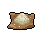
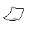
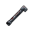

##  負鼠．埃迪

|體質|力量|敏捷|智力|幫派|
|:--:|:--:|:--:|:--:|:--:|
|3|4|5|4|無幫派|

### 故事

一只倒霉的負鼠，因為一次失敗的入室盜竊而惹禍上身。一場連坐牢都無法逃避的“美妙愛情”正如噩夢般糾纏著他。如果他不老老實實的和那位“姑娘”結婚的話，或許就無法保住自己年輕的命根子了。現在，距離出獄已不到一百天，他究竟能否化解這場危機呢？

“嘿\~你說像我這樣的霉運，會不會是身上跟了什麼臟東西…？”埃迪打趣的說道。

如果評選誰是監獄前五倒霉蛋的話，負鼠·埃迪一定會榜上有名。據他所說，從小到大他的霉運就一直沒有間斷。在他五歲那年，家里的房子被閃電擊中，大火燒毀了所有家當。十歲那年，開出租的父親因為疲勞駕駛把車開進了路溝里，不但自己丟了性命，家里還攤上了賠償重傷乘客的巨額債務。十六歲那年，他就讀的學校發生了槍擊事件，埃迪的屁股上狠狠挨了一槍…

成績糟糕的埃迪沒能念完中學，為了不給母親和妹妹“添麻煩”，於是主動搬出了家里。他起初在汽車餐廳打零工，但因為和刻薄的主管有矛盾，於是一氣之下偷了收銀機里的錢。進了看守所之後，埃迪在里面認識了一些“前輩”，他從他們那兒學了不少的手上功夫，出來之後便開始了自己的盜賊生活。

不過即使做了賊，埃迪的霉運依然伴隨左右。幾年時間里，他成功得手的次數屈指可數。通常不是在踩點的時候遇到警察盤問，就是活干到一半撞見主人回家，總之說出來都是辛酸淚。而這次更是天降橫禍，誰能想到偷東西會偷出個“未婚妻”來，而且還是甩都甩不掉的那種…

事到如今，埃迪決定和命運做最後的抗爭。而他想到的辦法居然是——越獄！

你理解他現在焦躁的心情，但他的計劃簡直就是在自尋死路（如果那也能稱為計劃的話）。你勸說他不要犯傻，并答應幫他想想辦法。但是你心里清楚，像他那樣的霉運，即使再精密的計劃或許都會出現意外…

### 結識對話

- **（自言自語）哎\~又是一天，刑期只剩不到一百天了…**
- 嗨…出獄不是好事嗎？你怎麼唉聲嘆氣的。
- **呵呵\~你不明白，出獄對我來說簡直就是災難…**
- **{down1}**
- **你知道我為什麼會進來嗎？**
- {question1}
- **那是去年的一個晚上…我本想隨便找一家偷點零花錢。**
- **我順著排水管爬到二樓浴室，結果那家的女主人正在洗澡。**
  - 那你豈不是看了個精光？
  - 你可真是艷福不淺…
- **倒霉的就是這個！那是個老姑娘，又老又丑，還有口臭\~**
- **…她非說我玷污了她的貞潔，逼著我娶她！**
- **我嚇得當時就報警自首了…**
- 呃\~這可真是個曲折的故事。
- **你以為事情就這麼結束了…？不，并沒有\~**
- **她的哥哥是個黑道頭子，他威脅我如果不娶她妹妹…**
- **就找手下把我閹了…真該死！我還這麼年輕\~**
- **{weep1}**
- 好吧\~我現在能理解，你為什麼不想出獄了…

### 深入了解對話

- 埃迪\~看你愁眉苦臉的，還在煩心“未婚妻”的事情嗎？
- **其實…我已經想到解決的辦法了…**
  - 什麼辦法…？
  - 我有種不好的預感。
- **實話告訴你吧，我決定`越獄`！**
- {exclamation1}
- **只要我消失了，她就再也沒法纏著我了！**
- 喂喂\~你知道越獄有多危險嗎？！說不定你會把命丟了…

#### `說服`他放棄越獄。

> 在你的勸說下他終於打消了越獄的念頭，并和你聊起了以前的事。

- 你先告訴我，你的越獄計劃是什麼？
- **計劃…憑我的腦子可想不出什麼好計劃…**
- **我準備等囚車送新犯人來的時候，溜到車底藏起來，然後…**
- 你這簡直就是在送死！哨塔上的警衛會把你`當靶子打的`！
- **{weep1}**
- **那我該怎麼辦？剩下的日子越來越少了…**
- 你先冷靜點，別再想越獄的事了，我來幫你想想其他辦法…
- *這家伙可真夠倒霉的…*
- **你有想到什麼其他主意嗎…？**
- {think1}
- 我想…既然你的“未婚妻”只是著急嫁出去的話…
- 那你不如找個比你優秀的家伙介紹給她。
- 說不定…她看了之後就會把你“甩了”？
- **這聽上去是個不錯的點子，但有誰會愿意接手這門“親事”呢？**
- **{think1}**
- **哈！我想到了！我最近交了個新朋友，即聰明又帥氣，而且還很好心腸。**
- 你說的這個朋友…是誰？
- **嘿嘿\~他遠在天邊近在眼前！**
- {sweat1}

#### 取消

- **我既不想丟了命根子，也不想“開坦克”！所以再危險我也得試試。**
- **你別勸我了，我去意已決！**
- {down1}
### 初始物品

|物品名稱|物品名稱|物品名稱|物品名稱|物品名稱|
|:--:|:--:|:--:|:--:|:--:|
|  |  |  |  |  |
| [綠頭巾](道具.md#綠頭巾) | [黑手](道具.md#黑手) | [牙刷匕首](道具.md#牙刷匕首) | [蘋果](道具.md#蘋果)*2 | [酸奶](道具.md#酸奶) |
|  |  |  |  |  |
| [開鎖器](道具.md#開鎖器)*2 | [迴紋針](道具.md#迴紋針)*3 | [消毒液](道具.md#消毒液)*4 | [硬幣](道具.md#硬幣) |  |
### 送禮

|圖片|物品名稱|好感|回應|
|:--:|--|:--:|--|
||[運動鞋](道具.md#運動鞋)|12|哎\~這能讓我在關鍵的時候跑快點嗎？|
||[皮鞋](道具.md#皮鞋)|0|謝了，伙計…|
||[帆布鞋](道具.md#帆布鞋)|0|謝了，伙計…|
||[拖鞋](道具.md#拖鞋)|0|謝了，伙計…|
||[墨鏡](道具.md#墨鏡)|10|你說如果我把臉都遮住，會不會就沒人認的出了？|
||[眼鏡](道具.md#眼鏡)|0|謝了，伙計…|
||[頭帶](道具.md#頭帶)|0|謝了，伙計…|
||[棒球帽](道具.md#棒球帽)|12|你說如果我把臉都遮住，會不會就沒人認的出了？|
||[毛線帽](道具.md#毛線帽)|0|謝了，伙計…|
||[紅頭巾](道具.md#紅頭巾)|0|謝了，伙計…|
||[綠頭巾](道具.md#綠頭巾)|0|謝了，伙計…|
||[橡膠手套](道具.md#橡膠手套)|12|如果我要執行B計劃的話…這東西可是必需品。|
||[黑手](道具.md#黑手)|8|這或許能作為我的秘密武器…|
||[手錶](道具.md#手錶)|12|現在的確是分秒必爭的時候了。|
||[護身符](道具.md#護身符)|10|你說我都這麼虔誠了，森林之父它不會見死不救吧？！|
||[牙齒項鏈](道具.md#牙齒項鏈)|0|謝了，伙計…|
||[《死靈之書》](道具.md#《死靈之書》)|-12|哦！這書里的插圖看了真反胃。|
||[自制口罩](道具.md#自制口罩)|8|你說如果我把臉都遮住，會不會就沒人認的出了？|
||[隨身聽（開機）](道具.md#隨身聽（開機）)|24|好吧\~也許聽聽音樂能緩解我的焦慮…|
||[隨身聽（關機）](道具.md#隨身聽（關機）)|24|好吧\~也許聽聽音樂能緩解我的焦慮…|
||[隨身聽（沒電）](道具.md#隨身聽（沒電）)|24|好吧\~也許聽聽音樂能緩解我的焦慮…|
||[酒葫蘆](道具.md#酒葫蘆)|0|謝了，伙計…|
||[黑桃A](道具.md#黑桃A)|4|或許我能用這個賺上一筆…然後花錢贖身。|
||[薄荷葉](道具.md#薄荷葉)|0|謝了，伙計…|
||[薄荷葉卷](道具.md#薄荷葉卷)|0|謝了，伙計…|
||[蘑菇](道具.md#蘑菇)|0|謝了，伙計…|
||[蘑菇粉](道具.md#蘑菇粉)|0|謝了，伙計…|
||[瀉藥](道具.md#瀉藥)|0|謝了，伙計…|
||[紫鳶花](道具.md#紫鳶花)|-4|…我現在沒心情和你開玩笑。|
||[花瓣粉](道具.md#花瓣粉)|0|謝了，伙計…|
||[安眠藥](道具.md#安眠藥)|4|哦\~我太需要這個幫我擺脫失眠了。|
||[止疼片](道具.md#止疼片)|0|謝了，伙計…|
||[興奮劑](道具.md#興奮劑)|0|謝了，伙計…|
||[醫用酒精](道具.md#醫用酒精)|0|謝了，伙計…|
||[酒精燈](道具.md#酒精燈)|0|謝了，伙計…|
||[鎮靜劑](道具.md#鎮靜劑)|0|謝了，伙計…|
||[啤酒](道具.md#啤酒)|0|謝了，伙計…|
||[蘋果酒](道具.md#蘋果酒)|0|謝了，伙計…|
||[精釀蘋果酒](道具.md#精釀蘋果酒)|0|謝了，伙計…|
||[蘋果](道具.md#蘋果)|4|希望吃東西能讓我的心情好起來。|
||[華夫餅](道具.md#華夫餅)|6|希望吃東西能讓我的心情好起來。|
||[奶油華夫餅](道具.md#奶油華夫餅)|8|希望吃東西能讓我的心情好起來。|
||[一把咖啡豆](道具.md#一把咖啡豆)|-4|哎\~我的生活已經夠苦的了…|
||[口香糖](道具.md#口香糖)|0|謝了，伙計…|
||[曲奇餅乾](道具.md#曲奇餅乾)|2|希望吃東西能讓我的心情好起來。|
||[焦糖棒](道具.md#焦糖棒)|4|希望吃東西能讓我的心情好起來。|
||[汽水](道具.md#汽水)|0|謝了，伙計…|
||[酸奶](道具.md#酸奶)|4|希望吃東西能讓我的心情好起來。|
||[土豆披薩](道具.md#土豆披薩)|8|希望吃東西能讓我的心情好起來。|
||[咖啡粉](道具.md#咖啡粉)|-4|哎\~我的生活已經夠苦的了…|
||[茶包](道具.md#茶包)|-4|哎\~我的生活已經夠苦的了…|
||[超辣泡麵](道具.md#超辣泡麵)|6|希望吃東西能讓我的心情好起來。|
||[蛋白粉](道具.md#蛋白粉)|0|謝了，伙計…|
||[布條](道具.md#布條)|-2|哎\~這東西可幫不上我的忙。|
||[迴紋針](道具.md#迴紋針)|0|謝了，伙計…|
||[開鎖器](道具.md#開鎖器)|4|老式開鎖器？我想我或許會用得上這個。|
||[開鎖器(P)](道具.md#開鎖器(P))|4|老式開鎖器？我想我或許會用得上這個。|
||[肥皂](道具.md#肥皂)|-4|把自己洗的這麼干凈有什麼用？還怕那家伙看不上我嗎？！|
||[香皂](道具.md#香皂)|-8|把自己洗的這麼干凈有什麼用？還怕那家伙看不上我嗎？！|
||[計算機](道具.md#計算機)|0|謝了，伙計…|
||[《花花世界》（全新）](道具.md#《花花世界》（全新）)|8|哎\~為什麼看上我的不是這書里的姑娘呢？|
||[《花花世界》（看過）](道具.md#《花花世界》（看過）)|0|謝了，伙計…|
||[《花花世界》（翻爛）](道具.md#《花花世界》（翻爛）)|0|謝了，伙計…|
||[馬女郎海報](道具.md#馬女郎海報)|0|謝了，伙計…|
||[貓女郎海報](道具.md#貓女郎海報)|-12|我討厭貓…雖然我只是長得像老鼠而已。|
||[狐女郎海報](道具.md#狐女郎海報)|12|要是看上我的姑娘有海報上的十分之一漂亮，就好了…|
||[兔女郎海報](道具.md#兔女郎海報)|12|要是看上我的姑娘有海報上的十分之一漂亮，就好了…|
||[咖啡磨](道具.md#咖啡磨)|0|謝了，伙計…|
||[掌上遊戲機](道具.md#掌上遊戲機)|24|好吧\~也許打打遊戲能緩解我的焦慮…|
||[掌上遊戲機（沒電）](道具.md#掌上遊戲機（沒電）)|24|好吧\~也許打打遊戲能緩解我的焦慮…|
||[電池](道具.md#電池)|0|謝了，伙計…|
||[牙刷](道具.md#牙刷)|0|謝了，伙計…|
||[牙膏](道具.md#牙膏)|0|謝了，伙計…|
||[空的牙膏管](道具.md#空的牙膏管)|-4|別把你的垃圾塞給我，我已經夠煩的了。|
||[消毒液](道具.md#消毒液)|0|謝了，伙計…|
||[除銹劑](道具.md#除銹劑)|-2|哎\~這東西可幫不上我的忙。|
||[火柴](道具.md#火柴)|-2|哎\~這東西可幫不上我的忙。|
||[膠帶](道具.md#膠帶)|-2|哎\~這東西可幫不上我的忙。|
||[顏料](道具.md#顏料)|0|謝了，伙計…|
||[釘子](道具.md#釘子)|-2|哎\~這東西可幫不上我的忙。|
||[鞋帶](道具.md#鞋帶)|-2|哎\~這東西可幫不上我的忙。|
||[白紙](道具.md#白紙)|-2|哎\~這東西可幫不上我的忙。|
||[紙鶴](道具.md#紙鶴)|-6|哎\~這東西可幫不上我的忙。|
||[花束](道具.md#花束)|-8|…我現在沒心情和你開玩笑。|
||[胡亂的涂鴉](道具.md#胡亂的涂鴉)|-8|別把你的垃圾塞給我，我已經夠煩的了。|
||[簡單的漫畫](道具.md#簡單的漫畫)|-6|哎\~這東西可幫不上我的忙。|
||[精美的畫作](道具.md#精美的畫作)|0|謝了，伙計…|
||[鉛筆](道具.md#鉛筆)|0|謝了，伙計…|
||[鉛筆](道具.md#鉛筆)|0|謝了，伙計…|
||[圓珠筆](道具.md#圓珠筆)|0|謝了，伙計…|
||[圓珠筆](道具.md#圓珠筆)|0|謝了，伙計…|
||[硬幣](道具.md#硬幣)|0|謝了，伙計…|
||[長螺絲](道具.md#長螺絲)|0|謝了，伙計…|
||[扳手](道具.md#扳手)|0|謝了，伙計…|
||[湯匙](道具.md#湯匙)|0|謝了，伙計…|
||[湯匙](道具.md#湯匙)|0|謝了，伙計…|
||[釘錘](道具.md#釘錘)|0|謝了，伙計…|
||[剪刀](道具.md#剪刀)|0|謝了，伙計…|
||[碎玻璃](道具.md#碎玻璃)|-2|你知道我遇到了多大的麻煩嗎？你覺得靠這個破爛能解決嗎？|
||[玻璃匕首](道具.md#玻璃匕首)|0|謝了，伙計…|
||[玻璃匕首(+)](道具.md#玻璃匕首(+))|0|謝了，伙計…|
||[牙刷匕首](道具.md#牙刷匕首)|0|謝了，伙計…|
||[牙刷匕首(+)](道具.md#牙刷匕首(+))|0|謝了，伙計…|
||[水果刀](道具.md#水果刀)|0|謝了，伙計…|
||[折斷的木條](道具.md#折斷的木條)|-2|你知道我遇到了多大的麻煩嗎？你覺得靠這個破爛能解決嗎？|
||[雙節棍](道具.md#雙節棍)|0|謝了，伙計…|
||[雙節棍(+)](道具.md#雙節棍(+))|0|謝了，伙計…|
||[釘棒](道具.md#釘棒)|0|謝了，伙計…|
||[釘棒(+)](道具.md#釘棒(+))|0|謝了，伙計…|
||[鐵管](道具.md#鐵管)|0|謝了，伙計…|
||[皮帶](道具.md#皮帶)|0|謝了，伙計…|
||[皮帶](道具.md#皮帶)|0|謝了，伙計…|
||[發霉的麵包](道具.md#發霉的麵包)|-8|別把你的垃圾塞給我，我已經夠煩的了。|
||[金龜子](道具.md#金龜子)|20|聽說它能帶來好運，希望傳說是真的吧…|
||[《森之音》](道具.md#《森之音》)|0|謝了，伙計…|
||[DEMO限定紙鶴](道具.md#DEMO限定紙鶴)|50|你突然讓我覺得…很親切。|

