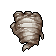

##  賽馬．雷伊

|體質|力量|敏捷|智力|幫派|
|:--:|:--:|:--:|:--:|:--:|
|8|6|11|8|無幫派|

### 故事

自稱是獨角獸的棕色馬，雖然造型略顯古怪，但卻散發出一種現代藝術的獨特氣質。拒絕被稱為“先生”，對性別和自我之間的關系有著獨到的見解，并且毫不掩飾的表達出對“帥哥”的喜愛。

雷伊出生在一個富裕的賽馬家庭，父母都是體育圈中的社會名流。雷伊作為家中的獨子從小便備受父母的期待，可對於雷伊自己來說，舞蹈和繪畫要遠比枯燥的賽跑有趣的多。因為叛逆的性格，以及日趨明顯的獨特交友取向，雷伊和父母間的矛盾逐漸激化。最終在成年的那一天，他選擇離開家鄉，逃往一個陌生的城市。

他在孤獨的城市中漂泊了多年，期間做過繪畫模特、龍套演員、甚至還迫於生計而拍過幾部**影。但他從未想過認錯回家，因為相比生活的艱苦，換來的自由才是他更加珍視的。

“紅路燈”一個隱藏在偏僻巷口的小酒吧，雷伊的公寓就在酒吧樓上。為了墊付那份不算太高的房租，他接受了夜間看店的兼職工作。每當夜幕低垂，酒吧里的“交友”服務就會準時開始。一些漂亮的年輕女孩（有時也沒那麼漂亮）會在吧臺點上一杯摻水的廉價烈酒，等待吧臺的電話響起。而雷伊的工作就是轉述電話里的要求，并為愿意去“交友”的女孩們叫上一輛車。

“蔻蔻怎麼又沒來？”“哈哈\~那個婊子可能工傷了吧。”“話說卡洛琳也一周沒出現了，她們都傍上大款了嗎？”吧臺前女孩們七嘴八舌的聊天，引起了雷伊的注意。雖然她們的工作可能不算體面，但他知道這些姑娘也都和他一樣是為生活所迫。特別是她們嘴里的那個蔻蔻，那是個被前男友騙走了全部家當的單身媽媽，家里嗷嗷待哺的小奶牛讓她只得來到“紅路燈”賺取生計。

女孩們的不辭而別讓雷伊內心不安，他翻找了最近攬客的電話記錄，驚人的發現失蹤的女孩們都被叫去了同一個地方，難道說…“叮鈴鈴\~！”吧臺的電話再次響起，沙啞嗓音又一次說出了那個地址。或許是雷伊作為一匹賽馬，天生就對危險有著感知力，他這次并沒有把“交友”的需求告訴女孩們，而是自己換上了裙裝，代替她們前去赴約。

等在地址附近的是一只戴著鴨舌帽的袋獾，借著夜色的掩護他并沒有識破雷伊的裝扮，確切的說他甚至對雷伊的美貌垂涎欲滴。袋獾將雷伊帶回了破舊的房子，在談好價錢後對方提議先喝上一杯助興。早有預防的雷伊自然猜到了那個混蛋的打算，於是他趁其不注意將酒杯進行了調換。一杯迷魂酒下肚，袋獾自食惡果的癱倒在了地上。

雷伊在屋內進行了一番搜索，終於在密室中找到了遍體鱗傷的蔻蔻，以及卡洛琳和某個陌生女孩的尸體。憤怒、自責、憐惜的情感如同萬馬奔騰一般的在雷伊腦中炸裂，他無法原諒那個惡魔，也無法原諒將女孩們送到惡魔手中的自己。伴隨著一聲馬蹄踏碎頭骨的聲音，袋獾罪惡的生命就此終結。而事件的“幫兇”雷伊，也在次日向警方自首。

### 結識對話

- **嘿\~你從剛才就一直盯著我，是不是有所圖謀呀\~？**
- 哦\~不不！你誤會了`馬先生`，我只是…有點斜視。
- **喂喂\~你瞧瞧，短短一句話，你就犯了兩個大錯誤。**
- **再這麼不小心的話，我可是會給你“懲罰”的喲\~**
- …兩個錯誤？
- **第一，看見我的“角”了嗎？很顯然我是一只獨角獸。**
- *獨角…獸？*
- **第二，別叫我什麼“先生”，這個稱呼會局限住我\~**
- **作為一只獨角獸，我應該是更加自由，更加沒有邊界的。**
- 難道該叫你“自由獨角獸”？
- **嘿\~你還是叫我的名字`雷伊`吧\~這能顯得更親密些呢\~**
- {sweat1}

### 深入了解對話

- **嘿\~親愛的，你看我的新頭飾怎麼樣？**
  - 這…和以前有不同嗎？
  - 我早就想吐槽這個了…
- **哦\~你再自信看看，我可是融入了最新的`時尚元素`…**

#### 要論`時尚`，我可是專家。

> 你好不容易拒絕了他的“熱情”，隨後你們保持距離的聊了一會。

- 仔細一看，這個頭飾還真有點“後現代解構主義”的思潮。
- **啊哈！不愧是我看中的男孩！**
- **作為答對的獎勵，我一定要給你一個`熱吻`才行…**
- *看來是不是“男子漢”可不能只看外表…*
- **那件事之後蔻蔻怎麼樣了？**
- **她現在已經不在“紅路燈”干活了…**
- **她和以前的姑娘們合伙開了家美容院，正規的那種喲\~**
- **她還說，讓我出獄後一定要去她店里做個大全套呢\~**
- 哈哈\~你已經夠“美”的了，不是嗎？
- **{happy1}**

#### 取消

- 我可不明白你說的“時尚”…
- 在我看來，這東西除了滑稽…就是滑稽。
- **哦\~我開始後悔和你這種土包子談論`時尚`了…**
- *真是我的時尚品位不足嗎？*
- *也許該看點`相關的書`來惡補一下了…*
### 初始物品

|物品名稱|物品名稱|物品名稱|物品名稱|物品名稱|
|:--:|:--:|:--:|:--:|:--:|
|  |  |  |  |  |
| [墨鏡](道具.md#墨鏡) | [拖鞋](道具.md#拖鞋) | [蘑菇](道具.md#蘑菇)*3 | [紫鳶花](道具.md#紫鳶花)*3 | [精釀蘋果酒](道具.md#精釀蘋果酒)*2 |
|  |  |  |  |  |
| [蘋果](道具.md#蘋果)*2 | [肥皂](道具.md#肥皂) | [顏料](道具.md#顏料)*3 | [胡亂的涂鴉](道具.md#胡亂的涂鴉) |  |
### 送禮

|圖片|物品名稱|好感|回應|
|:--:|--|:--:|--|
||[運動鞋](道具.md#運動鞋)|0|嘿\~我就知道你對我有意思\~|
||[皮鞋](道具.md#皮鞋)|1|嘿\~你怎麼知道我的\~尺碼\~|
||[帆布鞋](道具.md#帆布鞋)|0|嘿\~我就知道你對我有意思\~|
||[拖鞋](道具.md#拖鞋)|0|嘿\~我就知道你對我有意思\~|
||[墨鏡](道具.md#墨鏡)|2|呀\~無事獻殷勤\~怕是對我有所圖謀吶\~|
||[眼鏡](道具.md#眼鏡)|0|嘿\~我就知道你對我有意思\~|
||[頭帶](道具.md#頭帶)|0|嘿\~我就知道你對我有意思\~|
||[棒球帽](道具.md#棒球帽)|1|嘿\~你覺得我戴著好看嗎？|
||[毛線帽](道具.md#毛線帽)|0|嘿\~我就知道你對我有意思\~|
||[紅頭巾](道具.md#紅頭巾)|0|嘿\~我就知道你對我有意思\~|
||[綠頭巾](道具.md#綠頭巾)|0|嘿\~我就知道你對我有意思\~|
||[橡膠手套](道具.md#橡膠手套)|0|嘿\~我就知道你對我有意思\~|
||[黑手](道具.md#黑手)|-2|哦\~我討厭這種臟兮兮的東西\~|
||[手錶](道具.md#手錶)|1|哦\~你是想和我分秒不離嗎？|
||[護身符](道具.md#護身符)|-2|我討厭宗教，還有那些老掉牙的道理\~|
||[牙齒項鏈](道具.md#牙齒項鏈)|-2|哦\~不！這東西太丑了…|
||[《死靈之書》](道具.md#《死靈之書》)|0|嘿\~我就知道你對我有意思\~|
||[自制口罩](道具.md#自制口罩)|-1|帥哥\~可不是隨便什麼都能戳中我心的\~|
||[隨身聽（開機）](道具.md#隨身聽（開機）)|2|說實話\~你抓住我的心了\~|
||[隨身聽（關機）](道具.md#隨身聽（關機）)|2|說實話\~你抓住我的心了\~|
||[隨身聽（沒電）](道具.md#隨身聽（沒電）)|2|說實話\~你抓住我的心了\~|
||[酒葫蘆](道具.md#酒葫蘆)|1|嘿\~你就像我肚子里的小蟲蟲一樣\~了解我\~|
||[黑桃A](道具.md#黑桃A)|1|嘿\~我喜歡這個\~因為是你送的\~|
||[薄荷葉](道具.md#薄荷葉)|1|嘿\~我喜歡這個\~因為是你送的\~|
||[薄荷葉卷](道具.md#薄荷葉卷)|-1|我不喜歡煙味…|
||[蘑菇](道具.md#蘑菇)|1|嘿\~我喜歡這個\~因為是你送的\~|
||[蘑菇粉](道具.md#蘑菇粉)|0|嘿\~我就知道你對我有意思\~|
||[瀉藥](道具.md#瀉藥)|-1|這是什麼？我對這種奇怪的東西可沒什麼興趣呢\~|
||[紫鳶花](道具.md#紫鳶花)|2|嘿\~你這是要和我表白嗎？帥哥\~|
||[花瓣粉](道具.md#花瓣粉)|0|嘿\~我就知道你對我有意思\~|
||[安眠藥](道具.md#安眠藥)|0|嘿\~我就知道你對我有意思\~|
||[止疼片](道具.md#止疼片)|0|嘿\~我就知道你對我有意思\~|
||[興奮劑](道具.md#興奮劑)|0|嘿\~我就知道你對我有意思\~|
||[醫用酒精](道具.md#醫用酒精)|0|嘿\~我就知道你對我有意思\~|
||[酒精燈](道具.md#酒精燈)|-1|帥哥\~可不是隨便什麼都能戳中我心的\~|
||[鎮靜劑](道具.md#鎮靜劑)|0|嘿\~我就知道你對我有意思\~|
||[啤酒](道具.md#啤酒)|1|嘿\~你是想玩酒後吐真言的遊戲嗎\~|
||[蘋果酒](道具.md#蘋果酒)|1|嘿\~你是想玩酒後吐真言的遊戲嗎\~|
||[精釀蘋果酒](道具.md#精釀蘋果酒)|2|嘿\~你是想把我灌醉嗎？|
||[蘋果](道具.md#蘋果)|1|你知道嗎？多吃蘋果可以美容\~|
||[華夫餅](道具.md#華夫餅)|0|嘿\~我就知道你對我有意思\~|
||[奶油華夫餅](道具.md#奶油華夫餅)|0|嘿\~我就知道你對我有意思\~|
||[一把咖啡豆](道具.md#一把咖啡豆)|0|嘿\~我就知道你對我有意思\~|
||[口香糖](道具.md#口香糖)|1|嘿\~我喜歡這個\~因為是你送的\~|
||[曲奇餅乾](道具.md#曲奇餅乾)|0|嘿\~我就知道你對我有意思\~|
||[焦糖棒](道具.md#焦糖棒)|0|嘿\~我就知道你對我有意思\~|
||[汽水](道具.md#汽水)|0|嘿\~我就知道你對我有意思\~|
||[酸奶](道具.md#酸奶)|0|嘿\~我就知道你對我有意思\~|
||[土豆披薩](道具.md#土豆披薩)|0|嘿\~我就知道你對我有意思\~|
||[咖啡粉](道具.md#咖啡粉)|0|嘿\~我就知道你對我有意思\~|
||[茶包](道具.md#茶包)|0|嘿\~我就知道你對我有意思\~|
||[超辣泡麵](道具.md#超辣泡麵)|0|嘿\~我就知道你對我有意思\~|
||[蛋白粉](道具.md#蛋白粉)|-1|你的馬屁拍在馬腿了上了\~我可不需要這個呢\~|
||[布條](道具.md#布條)|-1|帥哥\~可不是隨便什麼都能戳中我心的\~|
||[迴紋針](道具.md#迴紋針)|-1|帥哥\~可不是隨便什麼都能戳中我心的\~|
||[開鎖器](道具.md#開鎖器)|-1|這是什麼？我對這種奇怪的東西可沒什麼興趣呢\~|
||[開鎖器(P)](道具.md#開鎖器(P))|-1|這是什麼？我對這種奇怪的東西可沒什麼興趣呢\~|
||[肥皂](道具.md#肥皂)|1|嘿\~你這也太直接了\~|
||[香皂](道具.md#香皂)|2|（嗅\~嗅）這味道\~真好聞\~|
||[計算機](道具.md#計算機)|0|嘿\~我就知道你對我有意思\~|
||[《花花世界》（全新）](道具.md#《花花世界》（全新）)|-2|哦！庸俗\~我對這個可沒興趣。|
||[《花花世界》（看過）](道具.md#《花花世界》（看過）)|-2|哦！庸俗\~我對這個可沒興趣。|
||[《花花世界》（翻爛）](道具.md#《花花世界》（翻爛）)|-2|哦！庸俗\~我對這個可沒興趣。|
||[馬女郎海報](道具.md#馬女郎海報)|-2|審美僵化\~我難道不比她更美嗎？|
||[貓女郎海報](道具.md#貓女郎海報)|-2|審美僵化\~我難道不比她更美嗎？|
||[狐女郎海報](道具.md#狐女郎海報)|-2|審美僵化\~我難道不比她更美嗎？|
||[兔女郎海報](道具.md#兔女郎海報)|-2|審美僵化\~我難道不比她更美嗎？|
||[咖啡磨](道具.md#咖啡磨)|0|嘿\~我就知道你對我有意思\~|
||[掌上遊戲機](道具.md#掌上遊戲機)|0|嘿\~我就知道你對我有意思\~|
||[掌上遊戲機（沒電）](道具.md#掌上遊戲機（沒電）)|0|嘿\~我就知道你對我有意思\~|
||[電池](道具.md#電池)|0|嘿\~我就知道你對我有意思\~|
||[牙刷](道具.md#牙刷)|0|嘿\~我就知道你對我有意思\~|
||[牙膏](道具.md#牙膏)|0|嘿\~我就知道你對我有意思\~|
||[空的牙膏管](道具.md#空的牙膏管)|-2|哦\~我討厭這種臟兮兮的東西\~|
||[消毒液](道具.md#消毒液)|-1|帥哥\~可不是隨便什麼都能戳中我心的\~|
||[除銹劑](道具.md#除銹劑)|-1|帥哥\~可不是隨便什麼都能戳中我心的\~|
||[火柴](道具.md#火柴)|-1|帥哥\~可不是隨便什麼都能戳中我心的\~|
||[膠帶](道具.md#膠帶)|-1|帥哥\~可不是隨便什麼都能戳中我心的\~|
||[顏料](道具.md#顏料)|1|嘿\~你就像我肚子里的小蟲蟲一樣\~了解我\~|
||[釘子](道具.md#釘子)|-1|帥哥\~可不是隨便什麼都能戳中我心的\~|
||[鞋帶](道具.md#鞋帶)|-1|帥哥\~可不是隨便什麼都能戳中我心的\~|
||[白紙](道具.md#白紙)|-1|帥哥\~可不是隨便什麼都能戳中我心的\~|
||[紙鶴](道具.md#紙鶴)|1|哦\~可愛的小玩具，就和你一樣\~|
||[花束](道具.md#花束)|2|嘿\~你這是要和我表白嗎？帥哥\~|
||[胡亂的涂鴉](道具.md#胡亂的涂鴉)|0|嘿\~我就知道你對我有意思\~|
||[簡單的漫畫](道具.md#簡單的漫畫)|1|嘿\~你就像我肚子里的小蟲蟲一樣\~了解我\~|
||[精美的畫作](道具.md#精美的畫作)|2|你說是這畫美\~還是我美呀？|
||[鉛筆](道具.md#鉛筆)|0|嘿\~我就知道你對我有意思\~|
||[鉛筆](道具.md#鉛筆)|0|嘿\~我就知道你對我有意思\~|
||[圓珠筆](道具.md#圓珠筆)|0|嘿\~我就知道你對我有意思\~|
||[圓珠筆](道具.md#圓珠筆)|0|嘿\~我就知道你對我有意思\~|
||[硬幣](道具.md#硬幣)|-2|喂\~你這是在侮辱你自己…！|
||[長螺絲](道具.md#長螺絲)|-2|哦\~該死的暴力\~它只會帶來災難\~|
||[扳手](道具.md#扳手)|-2|哦\~該死的暴力\~它只會帶來災難\~|
||[湯匙](道具.md#湯匙)|0|嘿\~我就知道你對我有意思\~|
||[湯匙](道具.md#湯匙)|0|嘿\~我就知道你對我有意思\~|
||[釘錘](道具.md#釘錘)|-2|哦\~該死的暴力\~它只會帶來災難\~|
||[剪刀](道具.md#剪刀)|-2|哦\~該死的暴力\~它只會帶來災難\~|
||[碎玻璃](道具.md#碎玻璃)|-2|哦\~該死的暴力\~它只會帶來災難\~|
||[玻璃匕首](道具.md#玻璃匕首)|-2|哦\~該死的暴力\~它只會帶來災難\~|
||[玻璃匕首(+)](道具.md#玻璃匕首(+))|-2|哦\~該死的暴力\~它只會帶來災難\~|
||[牙刷匕首](道具.md#牙刷匕首)|-2|哦\~該死的暴力\~它只會帶來災難\~|
||[牙刷匕首(+)](道具.md#牙刷匕首(+))|-2|哦\~該死的暴力\~它只會帶來災難\~|
||[水果刀](道具.md#水果刀)|-2|哦\~該死的暴力\~它只會帶來災難\~|
||[折斷的木條](道具.md#折斷的木條)|-2|哦\~該死的暴力\~它只會帶來災難\~|
||[雙節棍](道具.md#雙節棍)|-2|哦\~該死的暴力\~它只會帶來災難\~|
||[雙節棍(+)](道具.md#雙節棍(+))|-2|哦\~該死的暴力\~它只會帶來災難\~|
||[釘棒](道具.md#釘棒)|-2|哦\~該死的暴力\~它只會帶來災難\~|
||[釘棒(+)](道具.md#釘棒(+))|-2|哦\~該死的暴力\~它只會帶來災難\~|
||[鐵管](道具.md#鐵管)|-2|哦\~該死的暴力\~它只會帶來災難\~|
||[皮帶](道具.md#皮帶)|0|嘿\~我就知道你對我有意思\~|
||[皮帶](道具.md#皮帶)|0|嘿\~我就知道你對我有意思\~|
||[發霉的麵包](道具.md#發霉的麵包)|-2|哦\~我討厭這種臟兮兮的東西\~|
||[金龜子](道具.md#金龜子)|2|哈\~金色傳說！|
||[《森之音》](道具.md#《森之音》)|-2|我討厭宗教，還有那些老掉牙的道理\~|
||[DEMO限定紙鶴](道具.md#DEMO限定紙鶴)|2|哦\~你可真是多一天都等不了呢\~|

