# 動物迷城全道具資料

## 運動鞋

|品級|分類|體積|價值|違禁值|
|--|--|--|--|--|
|高級|服飾、鞋|一格|200|0|

裝備后：敏捷+2。

> 球場上有句俗話：穿的越貴，跳的越高！

## 皮鞋

|品級|分類|體積|價值|違禁值|
|--|--|--|--|--|
|高級|服飾、鞋|一格|150|0|

裝備后：聲望+15。

> 典獄長同款，派頭十足。

## 帆布鞋

|品級|分類|體積|價值|違禁值|
|--|--|--|--|--|
|中級|服飾、鞋|一格|80|0|

裝備后：敏捷+1。

> 如同只穿了鞋墊一般，傳說發力得當的話，可以施展二段跳…？

## 拖鞋

|品級|分類|體積|價值|違禁值|
|--|--|--|--|--|
|中級|服飾、鞋|一格|50|0|

裝備后：在浴室不會滑到。

> 感受疾風從指間流過，雖然是腳趾…也可能是蹄子。

## 墨鏡

|品級|分類|體積|價值|違禁值|
|--|--|--|--|--|
|高級|服飾、眼鏡|一格|150|0|

裝備后：魅力+2。

> 戴上這個真的能看得見路嗎？管它呢…帥才是最重要的，讓我們搖滾起來吧！

## 眼鏡

|品級|分類|體積|價值|違禁值|
|--|--|--|--|--|
|高級|服飾、眼鏡|一格|150|0|

裝備后：讀書時，點數+4。

> “眼離書本一尺，胸離書桌一拳”——出自《靈長動物用眼指南》

## 頭帶

|品級|分類|體積|價值|違禁值|
|--|--|--|--|--|
|高級|服飾、帽子|一格|150|0|

裝備后：體質+1。

> 控制籃板球就能控制整個世界！

## 棒球帽

|品級|分類|體積|價值|違禁值|
|--|--|--|--|--|
|高級|服飾、帽子|一格|200|0|

裝備后：魅力+2。

> 烈火隊以兇狠的打法稱霸球場，也是涉及最多暴力事件的球隊。

## 毛線帽

|品級|分類|體積|價值|違禁值|
|--|--|--|--|--|
|中級|服飾、帽子|一格|80|0|

裝備后：體質+2。

> 沒什么寒冷是戴一層毛線帽抵御不了的，如果有，那就再戴一層！

## 紅頭巾

|品級|分類|體積|價值|違禁值|
|--|--|--|--|--|
|中級|服飾、帽子|一格|80|0|

|製作材料|製作時間|花費精力|
|--|--|--|
|布條\*1 / 顏料\*4|40|10|

裝備后：力量+1。

> 咳咳~撲面而來的哲學氣息…

## 綠頭巾

|品級|分類|體積|價值|違禁值|
|--|--|--|--|--|
|中級|服飾、帽子|一格|80|0|

|製作材料|製作時間|花費精力|
|--|--|--|
|布條\*1 / 顏料\*4|40|10|

裝備后：敏捷+1。

> 無論撞見什么場景都不要逃避，微笑著原諒她！

## 橡膠手套

|品級|分類|體積|價值|違禁值|
|--|--|--|--|--|
|中級|服飾、手套|一格|60|0|

裝備后：進行“抓握類”行動時，點數+2。

> 戴上之前請先修剪指甲。

## 黑手

|品級|分類|體積|價值|違禁值|
|--|--|--|--|--|
|中級|服飾、手套|一格|100|0|

|製作材料|製作時間|花費精力|
|--|--|--|
|鎮靜劑\*1 / 安眠藥\*1 / 布條\*1|40|10|

裝備后：智力+1。

> 想挖鼻孔的話，最好先忍著點…

## 手表

|品級|分類|體積|價值|違禁值|
|--|--|--|--|--|
|高級|服飾、手表|一格|200|0|

裝備后：智力+2。

> 可以調節36種不同的鈴聲，據說有位先鋒音樂家利用108塊手表演出過一整場交響樂。

## 護身符

|品級|分類|體積|價值|違禁值|
|--|--|--|--|--|
|高級|服飾、項鏈|一格|150|0|

裝備后：禱告、懺悔時，點數+4。

> “他在光里，他在風中，他融入細雨，而又潛入夢鄉。”——出自《慈愛無處不在》

## 牙齒項鏈

|品級|分類|體積|價值|違禁值|
|--|--|--|--|--|
|高級|服飾、項鏈|一格|200|0|

裝備后：力量+2。

> 鋒利牙齒的根部沾有血漬，或許只是拔牙時留下的而已…

## 《死靈之書》

|品級|分類|體積|價值|違禁值|
|--|--|--|--|--|
|高級|武器、書籍|一格|400|0|

裝備后：智力+2。

> 威爾伯家秘傳的“古山羊語”版《死靈之書》。但如此貴重的寶物，居然沒有包書皮？

## 自制口罩

|品級|分類|體積|價值|違禁值|
|--|--|--|--|--|
|中級|服飾、口罩|一格|80|0|

|製作材料|製作時間|花費精力|
|--|--|--|
|消毒液\*2 / 布條\*1 / 鞋帶\*2|60|15|

裝備后：稍微降低有害氣體對健康的損傷。

> 病從口入，禍從口出…

## 警用防毒面具

|品級|分類|體積|價值|違禁值|
|--|--|--|--|--|
|高級|服飾、口罩|一格|200|15|

裝備后：大幅降低有害氣體對健康的損傷。

> 獄警裝備庫里存放的防毒面具，標簽甚至都還沒拆…

## 隨身聽（開機）

|品級|分類|體積|價值|違禁值|
|--|--|--|--|--|
|高級|道具|一格|300|0|

帶在身上就能產生效果：開機狀態每小時自動恢復1\~2點心態。

> 高音甜、中音準、低音沉，總之一句話，就是通透。

## 隨身聽（關機）

|品級|分類|體積|價值|違禁值|
|--|--|--|--|--|
|高級|道具|一格|300|0|

帶在身上就能產生效果：開機狀態每小時自動恢復1\~2點心態。

> 高音甜、中音準、低音沉，總之一句話，就是通透。

## 隨身聽（沒電）

|品級|分類|體積|價值|違禁值|
|--|--|--|--|--|
|高級|道具|一格|300|0|

帶在身上就能產生效果：開機狀態每小時自動恢復1\~2點心態。

> 高音甜、中音準、低音沉，總之一句話，就是通透。

## 酒葫蘆

|品級|分類|體積|價值|違禁值|
|--|--|--|--|--|
|高級|道具|一格|150|0|

帶在身上就能產生效果：魅力+1。

> 據說老李家中還有六個一模一樣的葫蘆…

## 開鎖器(P)

|品級|分類|體積|價值|違禁值|
|--|--|--|--|--|
|中級|開鎖工具|半格|40|2|

|製作材料|製作時間|花費精力|
|--|--|--|
|回形針\*2 / 釘子\*2|30|5|

可用來開鎖，使用后折斷（無法修理）。

> 專家手中的“萬能鑰匙”。

## 黑桃A

|品級|分類|體積|價值|違禁值|
|--|--|--|--|--|
|初級|道具|半格|20|0|

可以在出老千時使用，點數+4。

> “這里有張A，只要我輕輕的一搓…就立刻變成一張皺了的A。”

## 薄荷葉

|品級|分類|體積|價值|違禁值|
|--|--|--|--|--|
|初級|藥品、材料|半格|20|0|

精力+5，心態+2。

> 提神！醒腦！國字臉！

## 薄荷葉卷

|品級|分類|體積|價值|違禁值|
|--|--|--|--|--|
|中級|藥品|半格|40|1|

|製作材料|製作時間|花費精力|
|--|--|--|
|薄荷葉\*3 / 白紙\*1|20|5|

精力+10，心態+2。

> “抽一根！短一秒！”——出自《動物聯邦生育委員會》

## 蘑菇

|品級|分類|體積|價值|違禁值|
|--|--|--|--|--|
|初級|食物、藥品、材料|半格|20|0|

飽腹+1。

> 據說吃了這種蘑菇身體就會變大…

## 蘑菇粉

|品級|分類|體積|價值|違禁值|
|--|--|--|--|--|
|初級|材料|半格|20|0|

|製作材料|製作時間|花費精力|
|--|--|--|
|蘑菇\*2|20|5|

> 蘑菇磨成的粉末，散發出刺鼻的氣味~阿嚏~！

## 瀉藥

|品級|分類|體積|價值|違禁值|
|--|--|--|--|--|
|中級|藥品|半格|50|2|

|製作材料|製作時間|花費精力|
|--|--|--|
|蘑菇粉\*1 / 消毒液\*1 / 發霉的面包\*2|40|10|

用途1：在午餐時向其他囚犯的飯里下藥。

> 等著大眼瞪小眼吧…

## 紫鳶花

|品級|分類|體積|價值|違禁值|
|--|--|--|--|--|
|初級|藥品、材料|半格|15|0|

專注+1。

> 警告！花粉過敏者請勿食用。

## 花瓣粉

|品級|分類|體積|價值|違禁值|
|--|--|--|--|--|
|初級|材料|半格|20|0|

|製作材料|製作時間|花費精力|
|--|--|--|
|紫鳶花\*2|20|5|

> 據說涂抹在腳后跟上，能除去襪子里的騷臭…

## 安眠藥

|品級|分類|體積|價值|違禁值|
|--|--|--|--|--|
|初級|藥品、材料|半格|25|1|

|製作材料|製作時間|花費精力|
|--|--|--|
|花瓣粉\*1 / 火柴\*3|40|10|

服用后：每小時睡眠恢復的精力提升0.2。

> 一片安眠，兩片入夢，三片升天…

## 安眠曲奇

|品級|分類|體積|價值|違禁值|
|--|--|--|--|--|
|初級|道具|半格|30|0|

|製作材料|製作時間|花費精力|
|--|--|--|
|安眠藥\*1 / 曲奇餅干\*3|20|5|

在晚上請你的室友吃，讓他立刻睡著。

> “好東西”就得和朋友分享！

## 止疼片

|品級|分類|體積|價值|違禁值|
|--|--|--|--|--|
|初級|藥品、材料|半格|30|1|

健康+20。

> 小心，別被它慣壞了…

## 興奮劑

|品級|分類|體積|價值|違禁值|
|--|--|--|--|--|
|中級|藥品|半格|50|2|

|製作材料|製作時間|花費精力|
|--|--|--|
|蘑菇粉\*1 / 止疼片\*1|40|10|

力量+2，持續2小時。

> 監獄土特產，傳說它還有個別名，叫做“打十個”。

## 醫用酒精

|品級|分類|體積|價值|違禁值|
|--|--|--|--|--|
|初級|藥品、酒精、材料|一格|30|2|

心態+10。

> 酒精的作用是消毒…不是麻醉。

## 酒精燈

|品級|分類|體積|價值|違禁值|
|--|--|--|--|--|
|中級|道具|一格|80|5|

|製作材料|製作時間|花費精力|
|--|--|--|
|醫用酒精\*1 / 布條\*1 / 火柴\*3|60|15|

可用來照亮前方的黑暗。

> 傳說每個酒精燈里都住著一個燈神，但沒人知道召喚它的方法。

## 鎮靜劑

|品級|分類|體積|價值|違禁值|
|--|--|--|--|--|
|中級|藥品、酒精、材料|半格|40|1|

|製作材料|製作時間|花費精力|
|--|--|--|
|花瓣粉\*1 / 醫用酒精\*1|40|10|

立即恢復4點專注值。

> 放空自我，排除雜念，進入“賢者時間”。

## 啤酒

|品級|分類|體積|價值|違禁值|
|--|--|--|--|--|
|中級|食物、酒精|一格|50|1|

心態+10。

> 生活是苦澀，希望是泡沫…

## 蘋果酒

|品級|分類|體積|價值|違禁值|
|--|--|--|--|--|
|中級|食物、酒精|一格|60|2|

|製作材料|製作時間|花費精力|
|--|--|--|
|蘋果\*3|2880|0|

心態+15。

> “幼年動物禁止飲酒。”——出自《幼年動物保護條例》

## 精釀蘋果酒

|品級|分類|體積|價值|違禁值|
|--|--|--|--|--|
|中級|食物、酒精|一格|80|2|

|製作材料|製作時間|花費精力|
|--|--|--|
|蘋果\*3|2880|0|

心態+20。

> “幼年動物禁止飲酒，再好的也不行！”——出自《幼年動物保護條例（修訂版）》

## 蘋果

|品級|分類|體積|價值|違禁值|
|--|--|--|--|--|
|初級|食物、材料|一格|30|0|

飽腹+1，健康+5。

> 一日一蘋果，醫生遠離我。

## 華夫餅

|品級|分類|體積|價值|違禁值|
|--|--|--|--|--|
|中級|食物|一格|40|0|

飽腹+2。

> 監獄的官方晚餐，雖然外表看起來毫無區別，但每塊都有著自己“獨特”的味道。

## 奶油華夫餅

|品級|分類|體積|價值|違禁值|
|--|--|--|--|--|
|中級|食物|一格|80|0|

飽腹+2，精力+20。

> 更多脂肪，更加美味。

## 一把咖啡豆

|品級|分類|體積|價值|違禁值|
|--|--|--|--|--|
|初級|食物|半格|20|0|

精力+10。

> “貓屎咖啡”在這里可沒那么受歡迎…

## 口香糖

|品級|分類|體積|價值|違禁值|
|--|--|--|--|--|
|初級|食物|半格|10|0|

魅力+1，持續2小時。

> 隨機的味道，隨機的快樂。

## 曲奇餅干

|品級|分類|體積|價值|違禁值|
|--|--|--|--|--|
|初級|食物|半格|10|0|

飽腹+1。

> 散裝餅干，上面點綴著酸甜的葡萄干…起碼看起來像是葡萄干。

## 焦糖棒

|品級|分類|體積|價值|違禁值|
|--|--|--|--|--|
|中級|食物|半格|30|0|

飽腹+1，心態+5。

> 焦糖、杏仁、花生碎。

## 汽水

|品級|分類|體積|價值|違禁值|
|--|--|--|--|--|
|中級|食物|一格|30|0|

精力+20。

> 喝前搖一搖…

## 酸奶

|品級|分類|體積|價值|違禁值|
|--|--|--|--|--|
|中級|食物|一格|50|0|

酒精-10。

> 喝完的酸奶瓶底可以用來占卜運勢。

## 土豆披薩

|品級|分類|體積|價值|違禁值|
|--|--|--|--|--|
|高級|食物|一格|100|0|

飽腹+6

> 大爆炸披薩外賣熱線：5-2-5-1-7。

## 咖啡粉

|品級|分類|體積|價值|違禁值|
|--|--|--|--|--|
|初級|道具、食物|半格|20|0|

|製作材料|製作時間|花費精力|
|--|--|--|
|一把咖啡豆\*1|20|5|

精力+30。

> 在監獄里“手沖”是囚犯們唯一的選擇。

## 茶包

|品級|分類|體積|價值|違禁值|
|--|--|--|--|--|
|中級|道具、食物|半格|30|0|

智力+1，持續2小時。

> 在這里，多數的茶包都是用襪子做的…

## 超辣泡面

|品級|分類|體積|價值|違禁值|
|--|--|--|--|--|
|中級|道具、食物|一格|50|0|

飽腹+4。

> 牢里真正的“硬”通貨。

## 蛋白粉

|品級|分類|體積|價值|違禁值|
|--|--|--|--|--|
|中級|道具、食物|半格|50|0|

體質+2，持續2小時。

> 在健身房練死勁，不好用。喝點這個，好用。

## 枕頭

|品級|分類|體積|價值|違禁值|
|--|--|--|--|--|
|中級|道具、材料|一格|60|0|

放在床上后：睡覺時有幾率做個美夢。

> 你能聞到它上一任主人，上上任主人，以及上上上任主人遺留的味道…

## 毯子

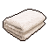

|品級|分類|體積|價值|違禁值|
|--|--|--|--|--|
|中級|道具、材料|一格|80|0|

放在床上后：抵御寒冷，帶來溫暖。

> 重的如同鬼壓床…

## 假人

|品級|分類|體積|價值|違禁值|
|--|--|--|--|--|
|高級|道具|一格|200|10|

|製作材料|製作時間|花費精力|
|--|--|--|
|枕頭\*1 / 毯子\*1 / 布條\*2|20|5|

放在床上后：讓夜間巡邏的獄警以為你正在乖乖睡覺。

> 卷起攤子，扎上鞋帶，最后再添上億點細節…就大功告成了！

## 床單

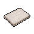

|品級|分類|體積|價值|違禁值|
|--|--|--|--|--|
|中級|道具、材料|一格|40|0|

放在床上后：每小時睡眠恢復精力增加1\~3點。

> “床單越臟，睡得越香。”——監獄俗語

## 布條

|品級|分類|體積|價值|違禁值|
|--|--|--|--|--|
|初級|材料|半格|15|0|

|製作材料|製作時間|花費精力|
|--|--|--|
|床單\*1|40|10|

> 失去一塊床單，獲得無限可能。

## 繩索

|品級|分類|體積|價值|違禁值|
|--|--|--|--|--|
|高級|道具|一格|100|10|

|製作材料|製作時間|花費精力|
|--|--|--|
|布條\*8|20|5|

可用來綁在高處當做攀爬繩。

> 打繩結可是一門藝術…不能太緊，也不能太松。

## 回形針

|品級|分類|體積|價值|違禁值|
|--|--|--|--|--|
|初級|材料|半格|10|0|

可用來開鎖，使用后折斷（無法修理）。

> 這可比發卡好用多了。

## 開鎖器

|品級|分類|體積|價值|違禁值|
|--|--|--|--|--|
|中級|開鎖工具|半格|40|2|

|製作材料|製作時間|花費精力|
|--|--|--|
|回形針\*2 / 釘子\*2|30|5|

可用來開鎖，使用后折斷（無法修理）。

> 專家手中的“萬能鑰匙”。

## 肥皂

|品級|分類|體積|價值|違禁值|
|--|--|--|--|--|
|初級|道具、材料|半格|30|0|

洗澡時使用：健康+5。

> 這可得小心拿好，掉在地上就糟了…

## 香皂

|品級|分類|體積|價值|違禁值|
|--|--|--|--|--|
|中級|道具|半格|60|0|

|製作材料|製作時間|花費精力|
|--|--|--|
|肥皂\*1 / 薄荷葉\*1|40|10|

洗澡時使用：健康+5。

> 在牢里把自己弄得太香，未必是件好事。

## 鑰匙模具（洗衣房）

|品級|分類|體積|價值|違禁值|
|--|--|--|--|--|
|中級|材料|半格|50|5|

> 一把鑰匙，一塊肥皂，然后用力一握。

## 塑料鑰匙（洗衣房）

|品級|分類|體積|價值|違禁值|
|--|--|--|--|--|
|高級|道具、鑰匙|半格|100|0|

|製作材料|製作時間|花費精力|
|--|--|--|
|牙刷\*1 / 火柴\*1 / 鑰匙模具（洗衣房）\*1|60|15|

可用來打開洗衣房的門。

## 鑰匙模具（裝備庫）

|品級|分類|體積|價值|違禁值|
|--|--|--|--|--|
|中級|材料|半格|50|5|

> 一把鑰匙，一塊肥皂，然后用力一握。

## 塑料鑰匙（裝備庫）

|品級|分類|體積|價值|違禁值|
|--|--|--|--|--|
|高級|道具、鑰匙|半格|100|0|

|製作材料|製作時間|花費精力|
|--|--|--|
|牙刷\*1 / 火柴\*1 / 鑰匙模具（裝備庫）\*1|60|15|

可用來打開警衛室的裝備庫。

## 鑰匙模具（藥房）

|品級|分類|體積|價值|違禁值|
|--|--|--|--|--|
|中級|材料|半格|50|5|

> 一把鑰匙，一塊肥皂，然后用力一握。

## 塑料鑰匙（藥房）

|品級|分類|體積|價值|違禁值|
|--|--|--|--|--|
|高級|道具、鑰匙|半格|100|0|

|製作材料|製作時間|花費精力|
|--|--|--|
|牙刷\*1 / 火柴\*1 / 鑰匙模具（藥房）\*1|60|15|

可用來打開藥房的門。

## 腐蝕溶液

|品級|分類|體積|價值|違禁值|
|--|--|--|--|--|
|高級|道具|一格|150|0|

|製作材料|製作時間|花費精力|
|--|--|--|
|空的牙膏管\*2 / 消毒液\*4 / 除銹劑\*4|20|5|

可用來腐蝕生銹的金屬。

> 使用時只需將兩種液體混合，這就是科學的力量！

## 滑翔服左翼

|品級|分類|體積|價值|違禁值|
|--|--|--|--|--|
|高級|道具|一格|120|10|

|製作材料|製作時間|花費精力|
|--|--|--|
|折斷的木條\*2 / 床單\*1 / 鞋帶\*2|60|15|

滑翔服的第一部分。

> 完整的滑翔服擁有：左翼,右翼,尾翼。

## 滑翔服右翼

|品級|分類|體積|價值|違禁值|
|--|--|--|--|--|
|高級|道具|一格|120|10|

|製作材料|製作時間|花費精力|
|--|--|--|
|折斷的木條\*2 / 床單\*1 / 鞋帶\*2|60|15|

滑翔服的第二部分。

> 完整的滑翔服擁有：左翼,右翼,尾翼。

## 滑翔服尾翼

|品級|分類|體積|價值|違禁值|
|--|--|--|--|--|
|高級|道具|一格|120|10|

|製作材料|製作時間|花費精力|
|--|--|--|
|折斷的木條\*2 / 床單\*1 / 鞋帶\*2|60|15|

滑翔服的第三部分。

> 完整的滑翔服擁有：左翼,右翼,尾翼。

## 肥皂槍

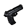

|品級|分類|體積|價值|違禁值|
|--|--|--|--|--|
|高級|道具|一格|150|20|

|製作材料|製作時間|花費精力|
|--|--|--|
|肥皂\*3 / 釘子\*4 / 顏料\*2|60|15|

> 一把足以亂真的手槍！而且散發著淡淡的香味…

## 計算器

|品級|分類|體積|價值|違禁值|
|--|--|--|--|--|
|中級|道具|一格|80|0|

帶在身上就能產生效果：砍價時，點數+4。

> 歸零！歸零！歸零！

## 《花花世界》（全新）

|品級|分類|體積|價值|違禁值|
|--|--|--|--|--|
|中級|道具、雜志|一格|80|0|

心態+10。

> 成年動物才能看的雜志，雖然在錄像帶的沖擊下，銷量逐年下滑，但在監獄里，它仍是最搶手的“精神食糧”。

## 《花花世界》（看過）

|品級|分類|體積|價值|違禁值|
|--|--|--|--|--|
|中級|道具、雜志|一格|60|0|

心態+5。

> 成年動物才能看的雜志，雖然在錄像帶的沖擊下，銷量逐年下滑，但在監獄里，它仍是最搶手的“精神食糧”。

## 《花花世界》（翻爛）

|品級|分類|體積|價值|違禁值|
|--|--|--|--|--|
|中級|道具、雜志|一格|40|0|

心態+2。

> 成年動物才能看的雜志，雖然在錄像帶的沖擊下，銷量逐年下滑，但在監獄里，它仍是最搶手的“精神食糧”。

## 馬女郎海報

|品級|分類|體積|價值|違禁值|
|--|--|--|--|--|
|高級|道具|一格|200|0|

貼在墻上后：睡覺每小時獲得10點勇猛經驗。

> 海報模特——馬·科琳，在著名午夜檔節目《比你大》中擔任常駐卡司，被譽為性感肌肉炸彈。

## 貓女郎海報

|品級|分類|體積|價值|違禁值|
|--|--|--|--|--|
|高級|道具|一格|200|0|

貼在墻上后：睡覺每小時獲得10點靈巧經驗。

> 海報模特——貓·安娜，演員兼歌手，成名前的經歷是個謎，而這也是她魅力的來源。

## 狐女郎海報

|品級|分類|體積|價值|違禁值|
|--|--|--|--|--|
|高級|道具|一格|200|0|

貼在墻上后：睡覺每小時獲得10點智謀經驗。

> 海報模特——狐貍·南希，曾在電影《眾神名單》中飾演九面皇后一角，而大受歡迎。

## 兔女郎海報

|品級|分類|體積|價值|違禁值|
|--|--|--|--|--|
|高級|道具|一格|200|0|

貼在墻上后：睡覺每小時獲得10點學識經驗。

> 海報模特——兔子·彭尼，擁有兩個經濟學博士學位，拍攝寫真只是單純的業余愛好。

## 咖啡磨

|品級|分類|體積|價值|違禁值|
|--|--|--|--|--|
|中級|道具|一格|80|0|

放在桌上后：可用來研磨物品。

> “左手握緊，右手旋轉。”——出自《正經咖啡指南》

## 掌上游戲機

|品級|分類|體積|價值|違禁值|
|--|--|--|--|--|
|高級|道具|一格|200|0|

每次游玩：心態+5。

> 加入了背光功能的掌上游戲機，即使躲在被窩里也能玩。

## 掌上游戲機（沒電）

|品級|分類|體積|價值|違禁值|
|--|--|--|--|--|
|高級|道具|一格|200|0|

每次游玩：心態+5。

> 加入了背光功能的掌上游戲機，即使躲在被窩里也能玩。

## 手電筒

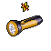

|品級|分類|體積|價值|違禁值|
|--|--|--|--|--|
|高級|道具|一格|100|5|

可用來照亮前方的黑暗。

> 就像陽光，穿過黑夜…

## 手電筒（沒電）

|品級|分類|體積|價值|違禁值|
|--|--|--|--|--|
|高級|道具|一格|100|5|

可用來照亮前方的黑暗。

> 就像陽光，穿過黑夜…

## 電池

|品級|分類|體積|價值|違禁值|
|--|--|--|--|--|
|初級|道具|半格|15|0|

為電子設備提供30點電量。

> 搓一搓，咬一咬，立刻煥發第二春。——出自《生活大百科》

## 牙刷

|品級|分類|體積|價值|違禁值|
|--|--|--|--|--|
|初級|道具|一格|20|0|

可以用它在洗漱池刷牙。

> 愛惜你的牙齒吧！趁它們沒被打掉之前。

## 牙膏

|品級|分類|體積|價值|違禁值|
|--|--|--|--|--|
|中級|道具|半格|60|0|

每次刷牙：健康+5。

> 監獄會低價從酒店收購沒用完的日用品，所以這里的牙膏都是“旅行裝”。

## 空的牙膏管

|品級|分類|體積|價值|違禁值|
|--|--|--|--|--|
|初級|材料|半格|10|0|

> 用完的牙膏管，或許能用來裝點別的…

## 消毒液

|品級|分類|體積|價值|違禁值|
|--|--|--|--|--|
|初級|材料|半格|10|1|

> 如果你是食腐動物，那你可能用不著它。

## 除銹劑

|品級|分類|體積|價值|違禁值|
|--|--|--|--|--|
|初級|材料|半格|10|1|

> 超強清潔力，洗洗更健康。

## 火柴

|品級|分類|體積|價值|違禁值|
|--|--|--|--|--|
|初級|材料|半格|5|1|

> 在監獄里想借個火可沒那么容易…

## 膠帶

|品級|分類|體積|價值|違禁值|
|--|--|--|--|--|
|初級|材料|半格|5|0|

> 堅固耐用，價廉物美。

## 顏料

|品級|分類|體積|價值|違禁值|
|--|--|--|--|--|
|初級|材料|半格|10|0|

> 所有顏料混合起來會變成彩虹嗎？不，你只會得到一坨黑色…

## 釘子

|品級|分類|體積|價值|違禁值|
|--|--|--|--|--|
|初級|材料|半格|5|1|

> 除了放在你仇人的凳子上之外，釘子還有別的用處嗎？

## 鞋帶

|品級|分類|體積|價值|違禁值|
|--|--|--|--|--|
|初級|材料|半格|10|0|

> 監獄實用偷襲術第一招：“嘿，你的鞋帶散了”。

## 白紙

|品級|分類|體積|價值|違禁值|
|--|--|--|--|--|
|初級|材料|半格|5|0|

> 友情提醒：別用它來擦屁股…

## 紙鶴

|品級|分類|體積|價值|違禁值|
|--|--|--|--|--|
|初級|工藝品|半格|20|0|

|製作材料|製作時間|花費精力|
|--|--|--|
|白紙\*1|20|5|

> 有了這只，現在還差九百九十九只！

## 花束

|品級|分類|體積|價值|違禁值|
|--|--|--|--|--|
|中級|工藝品|一格|80|0|

|製作材料|製作時間|花費精力|
|--|--|--|
|紫鳶花\*3 / 鞋帶\*1|20|5|

> 插花是一門耗時的藝術，幸好這里最不缺的就是時間。

## 胡亂的涂鴉

|品級|分類|體積|價值|違禁值|
|--|--|--|--|--|
|初級|工藝品|一格|20|0|

> 喜歡這幅畫的家伙，不是瘋子就是天才。

## 簡單的漫畫

|品級|分類|體積|價值|違禁值|
|--|--|--|--|--|
|中級|工藝品|一格|60|0|

> 平庸到了極致或許也是一種特色…

## 精美的畫作

|品級|分類|體積|價值|違禁值|
|--|--|--|--|--|
|高級|工藝品|一格|100|0|

> 這才是真正的藝術！

## 鉛筆

|品級|分類|體積|價值|違禁值|
|--|--|--|--|--|
|中級|寫作工具|一格|40|0|

可以用它進行寫作。寫作時，點數+2。

> 當然，它還可以用來表演魔術…噠！噠！

## 鉛筆

|品級|分類|體積|價值|違禁值|
|--|--|--|--|--|
|中級|寫作工具、武器|一格|40|0|

可以用它進行寫作。寫作時，點數+2。

> 當然，它還可以用來表演魔術…噠！噠！

## 圓珠筆

|品級|分類|體積|價值|違禁值|
|--|--|--|--|--|
|高級|寫作工具|一格|100|0|

可以用它進行寫作。寫作時，點數+4。

> 轉筆才是它的主要用途，寫字只是附贈功能罷了。

## 圓珠筆

|品級|分類|體積|價值|違禁值|
|--|--|--|--|--|
|高級|寫作工具、武器|一格|100|0|

可以用它進行寫作。寫作時，點數+4。

> 轉筆才是它的主要用途，寫字只是附贈功能罷了。

## 硬幣

|品級|分類|體積|價值|違禁值|
|--|--|--|--|--|
|初級|拆卸工具|半格|20|0|

可以用它進行拆卸。拆卸時，點數+2。

> 動物聯邦通用貨幣，因為是金屬質地，所以在監獄里，它的價格遠超面值。

## 長螺絲

|品級|分類|體積|價值|違禁值|
|--|--|--|--|--|
|中級|武器、材料|一格|40|2|

裝備后：戰斗時，點數+1。

> 一根“扎心老鐵”。

## 簡易螺絲刀

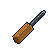

|品級|分類|體積|價值|違禁值|
|--|--|--|--|--|
|中級|拆卸工具、武器、材料|一格|100|10|

|製作材料|製作時間|花費精力|
|--|--|--|
|長螺絲\*1 / 折斷的木條\*1 / 口香糖\*2|40|10|

可以用它進行拆卸。拆卸時，點數+4。

> 先把螺絲在地上磨平，隨后裝上木質把手，至于口香糖？只是制作的時候用來打發無聊而已…

## 簡易螺絲刀(P)

|品級|分類|體積|價值|違禁值|
|--|--|--|--|--|
|中級|拆卸工具、武器、材料|一格|100|10|

|製作材料|製作時間|花費精力|
|--|--|--|
|長螺絲\*1 / 折斷的木條\*1 / 口香糖\*2|40|10|

可以用它進行拆卸。拆卸時，點數+6。

> 先把螺絲在地上磨平，隨后裝上木質把手，至于口香糖？只是制作的時候用來打發無聊而已…

## 簡易螺絲刀(P+)

|品級|分類|體積|價值|違禁值|
|--|--|--|--|--|
|中級|拆卸工具、武器、材料|一格|100|10|

|製作材料|製作時間|花費精力|
|--|--|--|
|長螺絲\*1 / 折斷的木條\*1 / 口香糖\*2|40|10|

可以用它進行拆卸。拆卸時，點數+6。

> 先把螺絲在地上磨平，隨后裝上木質把手，至于口香糖？只是制作的時候用來打發無聊而已…

## 高效螺絲鉆

|品級|分類|體積|價值|違禁值|
|--|--|--|--|--|
|高級|拆卸工具|一格|150|10|

|製作材料|製作時間|花費精力|
|--|--|--|
|長螺絲\*1 / 咖啡磨\*1 / 膠帶\*4|60|15|

可以用它進行拆卸。拆卸時，點數+8。

> 學好數理化，進了監獄也不怕。

## 高效螺絲鉆(P)

|品級|分類|體積|價值|違禁值|
|--|--|--|--|--|
|高級|拆卸工具|一格|150|10|

|製作材料|製作時間|花費精力|
|--|--|--|
|長螺絲\*1 / 咖啡磨\*1 / 膠帶\*4|60|15|

可以用它進行拆卸。拆卸時，點數+12。

> 學好數理化，進了監獄也不怕。

## 扳手

|品級|分類|體積|價值|違禁值|
|--|--|--|--|--|
|高級|拆卸工具、武器|一格|200|15|

可以用它進行拆卸。拆卸時，點數+10。

> “俗話說的好：掰彎容易，掰直難 。”——出自《改造大全》

## 湯匙

|品級|分類|體積|價值|違禁值|
|--|--|--|--|--|
|初級|挖掘工具|一格|30|0|

可以用它進行挖掘。挖掘時，點數+2。

> 阿布拉，卡達布拉，阿拉卡贊！

## 湯匙

|品級|分類|體積|價值|違禁值|
|--|--|--|--|--|
|初級|挖掘工具、武器|一格|30|0|

可以用它進行挖掘。挖掘時，點數+2。

> 阿布拉，卡達布拉，阿拉卡贊！

## 簡易鶴嘴鋤

|品級|分類|體積|價值|違禁值|
|--|--|--|--|--|
|中級|挖掘工具、武器、材料|一格|100|15|

|製作材料|製作時間|花費精力|
|--|--|--|
|折斷的木條\*1 / 剪刀\*1 / 鞋帶\*2|40|10|

可以用它進行挖掘。挖掘時，點數+4。

> 看看它的造型！真可惜這里沒有變異者，或是喪尸。

## 簡易鶴嘴鋤(P)

|品級|分類|體積|價值|違禁值|
|--|--|--|--|--|
|中級|挖掘工具、武器、材料|一格|100|15|

|製作材料|製作時間|花費精力|
|--|--|--|
|折斷的木條\*1 / 剪刀\*1 / 鞋帶\*2|40|10|

可以用它進行挖掘。挖掘時，點數+6。

> 看看它的造型！真可惜這里沒有變異者，或是喪尸。

## 簡易鶴嘴鋤(P+)

|品級|分類|體積|價值|違禁值|
|--|--|--|--|--|
|中級|挖掘工具、武器、材料|一格|100|15|

|製作材料|製作時間|花費精力|
|--|--|--|
|折斷的木條\*1 / 剪刀\*1 / 鞋帶\*2|40|10|

可以用它進行挖掘。挖掘時，點數+6。

> 看看它的造型！真可惜這里沒有變異者，或是喪尸。

## 加固鶴嘴鋤

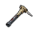

|品級|分類|體積|價值|違禁值|
|--|--|--|--|--|
|高級|挖掘工具、武器|一格|150|15|

|製作材料|製作時間|花費精力|
|--|--|--|
|鐵管\*1 / 剪刀\*1 / 膠帶\*4|60|15|

可以用它進行挖掘。挖掘時，點數+8。

> 更硬、更強、更致命！

## 加固鶴嘴鋤(P)

|品級|分類|體積|價值|違禁值|
|--|--|--|--|--|
|高級|挖掘工具、武器|一格|150|15|

|製作材料|製作時間|花費精力|
|--|--|--|
|鐵管\*1 / 剪刀\*1 / 膠帶\*4|60|15|

可以用它進行挖掘。挖掘時，點數+12。

> 更硬、更強、更致命！

## 加固鶴嘴鋤(P+)

|品級|分類|體積|價值|違禁值|
|--|--|--|--|--|
|高級|挖掘工具、武器|一格|150|15|

|製作材料|製作時間|花費精力|
|--|--|--|
|鐵管\*1 / 剪刀\*1 / 膠帶\*4|60|15|

可以用它進行挖掘。挖掘時，點數+12。

> 更硬、更強、更致命！

## 釘錘

|品級|分類|體積|價值|違禁值|
|--|--|--|--|--|
|高級|挖掘工具、武器|一格|200|20|

可以用它進行挖掘。挖掘時，點數+10。

> 先是小錘摳縫，然后大錘搞定！

## 剪刀

|品級|分類|體積|價值|違禁值|
|--|--|--|--|--|
|中級|武器、材料、利刃|一格|60|10|

裝備后：戰斗時，點數+3。

> 來騙！來偷襲！

## 碎玻璃

|品級|分類|體積|價值|違禁值|
|--|--|--|--|--|
|初級|武器、材料、利刃|一格|10|2|

裝備后：戰斗時，點數+{p2}。

> 完整的窗戶都是相同的，碎裂的玻璃各有各的缺口。

## 玻璃匕首

|品級|分類|體積|價值|違禁值|
|--|--|--|--|--|
|中級|武器、利刃|一格|40|5|

|製作材料|製作時間|花費精力|
|--|--|--|
|碎玻璃\*1 / 布條\*1|20|5|

裝備后：戰斗時，點數+{p2}。

> 這下總算能分清正反了…

## 玻璃匕首(+)

|品級|分類|體積|價值|違禁值|
|--|--|--|--|--|
|中級|武器、利刃|一格|40|5|

|製作材料|製作時間|花費精力|
|--|--|--|
|碎玻璃\*1 / 布條\*1|20|5|

裝備后：戰斗時，點數+{p2}。

> 這下總算能分清正反了…

## 牙刷匕首

|品級|分類|體積|價值|違禁值|
|--|--|--|--|--|
|中級|武器、利刃|一格|40|5|

|製作材料|製作時間|花費精力|
|--|--|--|
|牙刷\*1 / 釘子\*1 / 膠帶\*1|40|10|

裝備后：戰斗時，點數+{p2}。

> 只要功夫深，牙刷磨成針…

## 牙刷匕首(+)

|品級|分類|體積|價值|違禁值|
|--|--|--|--|--|
|中級|武器、利刃|一格|40|5|

|製作材料|製作時間|花費精力|
|--|--|--|
|牙刷\*1 / 釘子\*1 / 膠帶\*1|40|10|

裝備后：戰斗時，點數+{p2}。

> 只要功夫深，牙刷磨成針…

## 水果刀

|品級|分類|體積|價值|違禁值|
|--|--|--|--|--|
|高級|武器、利刃|一格|100|15|

裝備后：戰斗時，點數+4。

> 傳說午夜十分，對著鏡子削蘋果，果皮不斷就會看見…

## 折斷的木條

|品級|分類|體積|價值|違禁值|
|--|--|--|--|--|
|初級|武器、材料、棍棒|一格|20|2|

裝備后：戰斗時，點數+1。

> 監獄里最不缺的就是棍子了。

## 雙節棍

|品級|分類|體積|價值|違禁值|
|--|--|--|--|--|
|高級|道具、武器、棍棒|一格|100|5|

|製作材料|製作時間|花費精力|
|--|--|--|
|折斷的木條\*2 / 鞋帶\*1 / 釘子\*2|60|15|

可用來當做滑索的掛鉤。

> 呼吸吐納心自在，氣沉丹田手心開。

## 雙節棍(+)

|品級|分類|體積|價值|違禁值|
|--|--|--|--|--|
|高級|武器、棍棒|一格|100|5|

|製作材料|製作時間|花費精力|
|--|--|--|
|折斷的木條\*2 / 鞋帶\*1 / 釘子\*2|60|15|

可用來當做滑索的掛鉤。

> 呼吸吐納心自在，氣沉丹田手心開。

## 釘棒

|品級|分類|體積|價值|違禁值|
|--|--|--|--|--|
|中級|武器、棍棒|一格|60|10|

|製作材料|製作時間|花費精力|
|--|--|--|
|折斷的木條\*1 / 釘子\*4|40|10|

裝備后：戰斗時，點數+3。

> 就差一個全壘打了！

## 釘棒(+)

|品級|分類|體積|價值|違禁值|
|--|--|--|--|--|
|中級|武器、棍棒|一格|60|10|

|製作材料|製作時間|花費精力|
|--|--|--|
|折斷的木條\*1 / 釘子\*4|40|10|

裝備后：戰斗時，點數+4。

> 就差一個全壘打了！

## 鐵管

|品級|分類|體積|價值|違禁值|
|--|--|--|--|--|
|中級|武器、材料、棍棒|一格|60|5|

裝備后：戰斗時，點數+2。

> 監獄里的“和平制造者”。

## 警棍

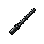

|品級|分類|體積|價值|違禁值|
|--|--|--|--|--|
|高級|武器、棍棒|一格|200|20|

裝備后：戰斗時，點數+5。

> 獄警統一配備的多功能警棍。

## 皮帶

|品級|分類|體積|價值|違禁值|
|--|--|--|--|--|
|中級|道具|一格|50|0|

可用來當做滑索的掛鉤。

> 別害怕，這只是一根革制品而已…

## 皮帶

|品級|分類|體積|價值|違禁值|
|--|--|--|--|--|
|中級|道具、武器|一格|50|0|

可用來當做滑索的掛鉤。

> 別害怕，這只是一根革制品而已…

## 烤面包

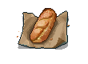

|品級|分類|體積|價值|違禁值|
|--|--|--|--|--|
|初級|午餐|半格|0|0|

飽腹+4，精力+40。

## 南瓜粥

|品級|分類|體積|價值|違禁值|
|--|--|--|--|--|
|初級|午餐|半格|0|0|

飽腹+2，精力+20，健康+10。

## 蘋果派

|品級|分類|體積|價值|違禁值|
|--|--|--|--|--|
|初級|午餐|半格|20|0|

飽腹+4，精力+40，心態+10。

## 煎蛋卷

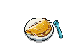

|品級|分類|體積|價值|違禁值|
|--|--|--|--|--|
|中級|午餐|半格|40|0|

飽腹+4，精力+40。

## 手握飯團

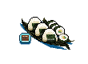

|品級|分類|體積|價值|違禁值|
|--|--|--|--|--|
|初級|午餐|半格|30|0|

飽腹+6，精力+60。

## 炸薯條

|品級|分類|體積|價值|違禁值|
|--|--|--|--|--|
|初級|午餐|半格|30|0|

飽腹+4，精力+40。

## 蘑菇意面

|品級|分類|體積|價值|違禁值|
|--|--|--|--|--|
|中級|午餐|半格|60|0|

飽腹+6，精力+30。

## 傳統蒸餃

|品級|分類|體積|價值|違禁值|
|--|--|--|--|--|
|中級|午餐|半格|50|0|

飽腹+4，精力+40，健康+10。

## 烤面包

|品級|分類|體積|價值|違禁值|
|--|--|--|--|--|
|初級|午餐|半格|0|0|

飽腹+2，精力+20。

## 南瓜粥

|品級|分類|體積|價值|違禁值|
|--|--|--|--|--|
|初級|午餐|半格|0|0|

飽腹+1，精力+10，健康+5。

## 蘋果派

|品級|分類|體積|價值|違禁值|
|--|--|--|--|--|
|初級|午餐|半格|10|0|

飽腹+2，精力+20，心態+5。

## 煎蛋卷

|品級|分類|體積|價值|違禁值|
|--|--|--|--|--|
|中級|午餐|半格|20|0|

飽腹+2，精力+20。

## 手握飯團

|品級|分類|體積|價值|違禁值|
|--|--|--|--|--|
|初級|午餐|半格|15|0|

飽腹+4，精力+20。

## 炸薯條

|品級|分類|體積|價值|違禁值|
|--|--|--|--|--|
|初級|午餐|半格|15|0|

飽腹+2，精力+20。

## 蘑菇意面

|品級|分類|體積|價值|違禁值|
|--|--|--|--|--|
|中級|午餐|半格|30|0|

飽腹+3，精力+15。

## 傳統蒸餃

|品級|分類|體積|價值|違禁值|
|--|--|--|--|--|
|中級|午餐|半格|25|0|

飽腹+2，精力+20，健康+5。

## 獄警制服

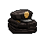

|品級|分類|體積|價值|違禁值|
|--|--|--|--|--|
|高級|服飾|一格|200|20|

裝備后：戰斗時，點數+2。

> 獄警統一配備的制服，更厚的料子，以及更大的肚子…

## 警哨

|品級|分類|體積|價值|違禁值|
|--|--|--|--|--|
|高級|道具|一格|200|10|

帶在身上就能產生效果：戰斗時，點數+1。

> 用哨子吹出“不許動，舉起手來”是每個獄警的必修課。

## 洗衣房鑰匙

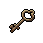

|品級|分類|體積|價值|違禁值|
|--|--|--|--|--|
|高級|道具、鑰匙|半格|100|0|

可用來打開洗衣房的門。

## 裝備庫鑰匙

|品級|分類|體積|價值|違禁值|
|--|--|--|--|--|
|高級|道具、鑰匙|半格|100|0|

可用來打開警衛室的裝備庫。

## 藥房鑰匙

|品級|分類|體積|價值|違禁值|
|--|--|--|--|--|
|高級|道具、鑰匙|半格|100|0|

可用來打開藥房的門。

## 給貝絲的情書

|品級|分類|體積|價值|違禁值|
|--|--|--|--|--|
|中級|信件|一格|80|0|

寫給女醫生的情書，需要在[醫院]當面交給她，可以提升她對你的好感。

## 給瑪姬的情書

|品級|分類|體積|價值|違禁值|
|--|--|--|--|--|
|中級|信件|一格|80|0|

寫給瑪姬的情書，需要從監獄的[信箱]寄出，可以提升她對你的好感。

## 給妻子的情書

|品級|分類|體積|價值|違禁值|
|--|--|--|--|--|
|中級|信件|一格|80|0|

寫給妻子的情書，需要從監獄的[信箱]寄出，可以提升她對你的好感。

## 小說手稿

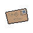

|品級|分類|體積|價值|違禁值|
|--|--|--|--|--|
|中級|信件|一格|80|0|

寫給出版社的小說手稿，需要從監獄的[信箱]寄出，可以賺取一些稿費。

## 發霉的面包

|品級|分類|體積|價值|違禁值|
|--|--|--|--|--|
|初級|食物|一格|10|0|

飽腹+1，精力+5。

> “不干不凈，吃了沒病。”——監獄俗語

## 金龜子

|品級|分類|體積|價值|違禁值|
|--|--|--|--|--|
|高級|食物|半格|150|0|

飽腹+1，精力+10，心態+5。

> 十分稀有的金色甲蟲，漂亮的顏色讓它成了監獄里的流行寵物。不過如果你餓極了的話也可以吃了它，據說味道還不錯…

## 《森之音》

|品級|分類|體積|價值|違禁值|
|--|--|--|--|--|
|中級|書籍、材料|一格|80|0|

裝備后：智力+1。

> 一本印刷質量很糟糕的大部頭詩集。說是用來理解禱告語，但里面卻充滿了生僻詞，翻看之后更加困惑了…

## 《森之音》（改造）

|品級|分類|體積|價值|違禁值|
|--|--|--|--|--|
|高級|道具|一格|100|0|

|製作材料|製作時間|花費精力|
|--|--|--|
|《森之音》\*1|60|15|

放在柜子上后：增加1個隱藏儲物格。

> 被掏空了內部的大部頭詩集。因為書名看著太催眠，所以根本不會有人想去翻它…

## 神秘紙袋

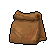

|品級|分類|體積|價值|違禁值|
|--|--|--|--|--|
|高級|任務物品|一格|100|10|

> 尖牙幫栽贓“水牛·比爾”的紙袋，不過記住“好奇可是會害死貓的”。雖然你并不是貓，甚至連貓科動物都不算…

## 簡易螺絲刀(+)

|品級|分類|體積|價值|違禁值|
|--|--|--|--|--|
|中級|拆卸工具、武器、材料|一格|100|10|

|製作材料|製作時間|花費精力|
|--|--|--|
|《森之音》\*1 /  / 鉛筆\*2|40|10|

可以用它進行拆卸。拆卸時，點數+4。

> 先把螺絲在地上磨平，隨后裝上木質把手，至于口香糖？只是制作的時候用來打發無聊而已…

## 簡易鶴嘴鋤(+)

|品級|分類|體積|價值|違禁值|
|--|--|--|--|--|
|中級|挖掘工具、武器、材料|一格|100|15|

|製作材料|製作時間|花費精力|
|--|--|--|
|水果刀\*1 / 釘錘\*1 / 釘子\*2|40|10|

可以用它進行挖掘。挖掘時，點數+4。

> 看看它的造型！真可惜這里沒有變異者，或是喪尸。

## 加固鶴嘴鋤(+)

|品級|分類|體積|價值|違禁值|
|--|--|--|--|--|
|高級|挖掘工具、武器|一格|150|15|

|製作材料|製作時間|花費精力|
|--|--|--|
|釘棒(+)\*1 / 釘錘\*1 / 火柴\*4|60|15|

可以用它進行挖掘。挖掘時，點數+8。

> 更硬、更強、更致命！

## DEMO限定紙鶴

|品級|分類|體積|價值|違禁值|
|--|--|--|--|--|
|高級|工藝品|半格|100|0|

> 你不知道它為什么會出現在你的口袋里，但你隱約感到這將是一件“驚人的禮物”！

## 備用賬簿

|品級|分類|體積|價值|違禁值|
|--|--|--|--|--|
|高級|任務物品|一格|400|0|

> 藏在凱撒囚室里的秘密賬簿…但對你來說，這卻是打開探視間大門的鑰匙。

