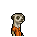
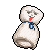
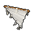
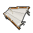

# 動物迷城全道具資料

## 布條

|品級|分類|體積|最大堆疊|價值|違禁值|
|:--:|:--:|:--:|:--:|:--:|:--:|
|初級|材料|半格|9|15|0|

|製作材料|製作時間|花費精力|
|:--:|:--:|:--:|
|[床單](道具.md#床單)\*1|40|10|

> 失去一塊床單，獲得無限可能。

### 送禮

|圖片|姓名|好感|回應|
|:--:|--|:--:|--|
||[狐貍．托馬斯](狐貍．托馬斯.md)|2|這是給我的嗎？…謝了。|
||[河馬．弗蘭克](河馬．弗蘭克.md)|2|呵呵呵\~這個還算不錯\~|
||[驢子．山姆](驢子．山姆.md)|2|這是禮物嗎？…那就謝了\~伙計。|
||[袋鼠．喬瑟夫](袋鼠．喬瑟夫.md)|2|你太客氣了伙計\~|
||[鱷魚．克蘭奇](鱷魚．克蘭奇.md)|2|你想用這個來討好我嗎？|
||[斑馬．富蘭克林](斑馬．富蘭克林.md)|2|這或許有用\~呃\~也可能沒用…|
||[貘．米格爾](貘．米格爾.md)|2|（小聲）來自素材的禮物，有研究的價值…|
||[黑豹．鮑勃](黑豹．鮑勃.md)|2|給我禮物嗎？…好吧。|
||[鹿豚．理查德](鹿豚．理查德.md)|2|這是給我的嗎，小子？|
||[食蟻獸．費爾南多](食蟻獸．費爾南多.md)|2|咱們囚犯之間就該互相幫助\~不是嗎？|
||[臭鼬．沃爾特](臭鼬．沃爾特.md)|2|謝謝你的禮物，我想我會用到它的。|
||[兔子．懷特](兔子．懷特.md)|2|嗯…我的魔術機關沒準用得上它。|
||[長頸鹿．吉米](長頸鹿．吉米.md)|-2|別這樣\~會讓別人誤會的…|
||[犀牛．伊萬](犀牛．伊萬.md)|-2|喂…你給我這東西幹嘛？|
||[水牛．比爾](水牛．比爾.md)|-2|喂！我要這鬼東西幹嘛？|
||[駱駝．托尼](駱駝．托尼.md)|-2|呃\~這東西可不值錢…|
||[北極熊．弗拉基米爾](北極熊．弗拉基米爾.md)|-2|我想我不需要這個…|
||[黑熊．亨利](黑熊．亨利.md)|-2|給我這個幹嘛？這又不能吃。|
||[海象．溫斯頓](海象．溫斯頓.md)|-2|哎……沒東西送就別送\~|
||[馴鹿．魯道夫](馴鹿．魯道夫.md)|-2|呃\~我要這個幹嘛？|
||[羊駝．迪亞哥](羊駝．迪亞哥.md)|-2|喂\~你就不能給我點有用的東西嗎？|
||[老虎．約翰](老虎．約翰.md)|-2|我不需要這個，別來煩我了。|
||[熊貓．老李](熊貓．老李.md)|-2|也罷，也罷……|
||[賽馬．雷伊](賽馬．雷伊.md)|-2|帥哥\~可不是隨便什麼都能戳中我心的\~|
||[猩猩．凱撒](猩猩．凱撒.md)|-2|你又在浪費我的時間了。|
||[山羊．威爾伯](山羊．威爾伯.md)|-2|噓……|
||[斑鬣狗．文森特](斑鬣狗．文森特.md)|-2|嘖\~我要這破爛干什麼？！|
||[疣豬．哈庫拉](疣豬．哈庫拉.md)|-2|（打哈欠）無聊的東西…|
||[山魈．拉斐爾](山魈．拉斐爾.md)|-2|這東西對我來說\~價值約等於零。|
||[猞猁．克里斯](猞猁．克里斯.md)|-2|你覺得我會喜歡這個嗎…？|
||[鬣蜥．皮克曼](鬣蜥．皮克曼.md)|-2|嘶\~我對這個不感興趣。|
||[水豚．伯納德](水豚．伯納德.md)|-2|別塞給我這些奇怪的東西。|
||[象龜．威廉姆](象龜．威廉姆.md)|-2|嗯…？你這是…什麼意思？|
||[樹懶．蒂姆](樹懶．蒂姆.md)|-2|…我想我用不著這個。|
||[考拉．凱文](考拉．凱文.md)|-2|這東西即沒屁用，也不值錢…|
||[穿山甲．林](穿山甲．林.md)|-2|喂\~你能告訴我，我要它有什麼用嗎？|
||[海獺．菲爾](海獺．菲爾.md)|-2|呃…我沒明白你的意思。|
||[灰貓．班姆](灰貓．班姆.md)|-2|我們正在面臨危機！拜托\~拿點有用的東西來吧。|
||[狐獴．泰迪](狐獴．泰迪.md)|-2|雖然我不該挑剔你的禮物…但是為了咱們友誼的質量，我還是想說上幾句。|
||[浣熊．面條](浣熊．面條.md)|-2|如果這就是你的底牌的話，那可太糟糕了…|
||[環尾狐猴．羅伯特](環尾狐猴．羅伯特.md)|-2|呃…這是你們家鄉的某種習俗嗎？|
||[負鼠．埃迪](負鼠．埃迪.md)|-2|哎\~這東西可幫不上我的忙。|
||[鴨嘴獸．泰瑞](鴨嘴獸．泰瑞.md)|-2|實話實說…這個實在缺乏流通價值。|
||[樹蛙．格雷](樹蛙．格雷.md)|-2|我或許會需要這個…但不是現在。|
||[大象．金波](大象．金波.md)|-20|小子\~你以後最好想清楚再給我東西\~我不喜歡垃圾！|
||[雄獅．阿歷克斯](雄獅．阿歷克斯.md)|-20|喂！你腦子裡到底在想什麼？|
||[蜜獾．麥克斯](蜜獾．麥克斯.md)|-20|喂\~我警告你，別再給我這些破爛了！|

## 運動鞋

|品級|分類|體積|最大堆疊|價值|違禁值|
|:--:|:--:|:--:|:--:|:--:|:--:|
|高級|服飾、鞋|一格|1|200|0|

裝備後：敏捷+2。

> 球場上有句俗話：穿的越貴，跳的越高！

### 送禮

|圖片|姓名|好感|回應|
|:--:|--|:--:|--|
||[北極熊．弗拉基米爾](北極熊．弗拉基米爾.md)|24|唔\~有了這個，我的“冰山一腳”將更加致命！|
||[馴鹿．魯道夫](馴鹿．魯道夫.md)|24|嘿\~想見識一下“彗星客”的最高時速嗎？|
||[袋鼠．喬瑟夫](袋鼠．喬瑟夫.md)|24|哈\~想見識一下我的蝴蝶步嗎？|
||[雄獅．阿歷克斯](雄獅．阿歷克斯.md)|24|呵\~這件禮物還像點樣子。|
||[大象．金波](大象．金波.md)|18|小子\~你的禮物還算上道。|
||[犀牛．伊萬](犀牛．伊萬.md)|18|嗯\~這東西或許能幫助我鍛煉。|
||[黑熊．亨利](黑熊．亨利.md)|18|你的鞋多大，我的腳就多大。|
||[黑豹．鮑勃](黑豹．鮑勃.md)|18|嗯…這對我或許有些用處。|
||[斑鬣狗．文森特](斑鬣狗．文森特.md)|18|喲喲\~伙計，我喜歡這個！|
||[猞猁．克里斯](猞猁．克里斯.md)|18|這是我想要的，咱倆果然\~合得來。|
||[考拉．凱文](考拉．凱文.md)|18|嘿\~伙計，你可太夠意思了！|
||[穿山甲．林](穿山甲．林.md)|18|但願這鞋能讓我跑快點吧…|
||[蜜獾．麥克斯](蜜獾．麥克斯.md)|18|呵\~這還有點禮物的樣子。|
||[環尾狐猴．羅伯特](環尾狐猴．羅伯特.md)|18|哈！一件新裝備！|
||[負鼠．埃迪](負鼠．埃迪.md)|18|哎\~這能讓我在關鍵的時候跑快點嗎？|
||[狐貍．托馬斯](狐貍．托馬斯.md)|12|這是給我的嗎？…謝了。|
||[河馬．弗蘭克](河馬．弗蘭克.md)|12|呵呵呵\~這個還算不錯\~|
||[水牛．比爾](水牛．比爾.md)|12|喂\~我可沒有回禮給你。|
||[駱駝．托尼](駱駝．托尼.md)|12|謝謝你的禮物，我的朋友\~|
||[驢子．山姆](驢子．山姆.md)|12|這是禮物嗎？…那就謝了\~伙計。|
||[羊駝．迪亞哥](羊駝．迪亞哥.md)|12|嘿嘿\~又有好東西了…|
||[鱷魚．克蘭奇](鱷魚．克蘭奇.md)|12|你想用這個來討好我嗎？|
||[老虎．約翰](老虎．約翰.md)|12|多此一舉……|
||[斑馬．富蘭克林](斑馬．富蘭克林.md)|12|這或許有用\~呃\~也可能沒用…|
||[賽馬．雷伊](賽馬．雷伊.md)|12|嘿\~我就知道你對我有意思\~|
||[猩猩．凱撒](猩猩．凱撒.md)|12|嗯\~一件禮物嗎？|
||[鹿豚．理查德](鹿豚．理查德.md)|12|這是給我的嗎，小子？|
||[疣豬．哈庫拉](疣豬．哈庫拉.md)|12|嘿\~嘿\~這是給我的嗎？|
||[山魈．拉斐爾](山魈．拉斐爾.md)|12|禮物嗎？換成錢的話，價格應該是…（小聲嘀咕）|
||[鬣蜥．皮克曼](鬣蜥．皮克曼.md)|12|嘶\~有趣的禮物\~|
||[水豚．伯納德](水豚．伯納德.md)|12|這只是件單純的禮物嗎？|
||[食蟻獸．費爾南多](食蟻獸．費爾南多.md)|12|咱們囚犯之間就該互相幫助\~不是嗎？|
||[海獺．菲爾](海獺．菲爾.md)|12|禮物\~我就知道今天會有好事。|
||[臭鼬．沃爾特](臭鼬．沃爾特.md)|12|謝謝你的禮物，我想我會用到它的。|
||[灰貓．班姆](灰貓．班姆.md)|12|物品上也會殘留稀薄的靈力。|
||[狐獴．泰迪](狐獴．泰迪.md)|12|嘿！禮物\~這是一件禮物！哦\~我想它就是咱們友誼的象徵對嗎？|
||[浣熊．面條](浣熊．面條.md)|12|這件禮物就是今天的“賭注”嗎？|
||[鴨嘴獸．泰瑞](鴨嘴獸．泰瑞.md)|12|這筆投資包你穩賺不賠。|
||[兔子．懷特](兔子．懷特.md)|12|這真是個不大不小的驚喜。|
||[樹蛙．格雷](樹蛙．格雷.md)|12|謝謝你的禮物，伙計…|
||[長頸鹿．吉米](長頸鹿．吉米.md)|-12|我說了\~我不喜歡運動…|
||[海象．溫斯頓](海象．溫斯頓.md)|-12|我可不想穿這個…它會把我的鰭腳磨破的。|
||[熊貓．老李](熊貓．老李.md)|-12|也罷，也罷……|
||[山羊．威爾伯](山羊．威爾伯.md)|-12|噓……|
||[貘．米格爾](貘．米格爾.md)|-12|偽造的軀體…靈魂的枷鎖。|
||[象龜．威廉姆](象龜．威廉姆.md)|-12|咳咳\~我這副老骨頭…可不適合…這個…|
||[樹懶．蒂姆](樹懶．蒂姆.md)|-12|呃\~我可沒什麼運動細胞…|

## 皮鞋

|品級|分類|體積|最大堆疊|價值|違禁值|
|:--:|:--:|:--:|:--:|:--:|:--:|
|高級|服飾、鞋|一格|1|150|0|

裝備後：聲望+15。

> 典獄長同款，派頭十足。

### 送禮

|圖片|姓名|好感|回應|
|:--:|--|:--:|--|
||[雄獅．阿歷克斯](雄獅．阿歷克斯.md)|20|呵\~這件禮物還像點樣子。|
||[猩猩．凱撒](猩猩．凱撒.md)|20|哦\~一個聰明的選擇。|
||[山魈．拉斐爾](山魈．拉斐爾.md)|20|如此貴重的禮物…看來你是有求於我了？|
||[樹懶．蒂姆](樹懶．蒂姆.md)|20|如果穿上這個…我應該會看起來多幾分精神。|
||[食蟻獸．費爾南多](食蟻獸．費爾南多.md)|20|做手術的時候…腳下不穩，手就會抖。|
||[鴨嘴獸．泰瑞](鴨嘴獸．泰瑞.md)|20|咱們搞金融的就該穿的像模像樣，主要是為了讓客戶安心。|
||[駱駝．托尼](駱駝．托尼.md)|15|嘿\~這看上去應該能賣個好價錢。|
||[驢子．山姆](驢子．山姆.md)|15|嘿\~我猜妮可會喜歡我穿這個的樣子。|
||[熊貓．老李](熊貓．老李.md)|15|哈\~好禮相送，汝欲以“禮”服人否？|
||[賽馬．雷伊](賽馬．雷伊.md)|15|嘿\~你怎麼知道我的\~尺碼\~|
||[貘．米格爾](貘．米格爾.md)|15|你知道我需要什麼？看來你對心理學也有所研究…素材002號。|
||[鹿豚．理查德](鹿豚．理查德.md)|15|呵\~皮鞋嗎？你還真挺大方的。|
||[猞猁．克里斯](猞猁．克里斯.md)|15|這是我想要的，咱倆果然\~合得來。|
||[水豚．伯納德](水豚．伯納德.md)|15|這看起來沒什麼威脅…謝了。|
||[象龜．威廉姆](象龜．威廉姆.md)|15|我的孩子…你可真客氣…|
||[考拉．凱文](考拉．凱文.md)|15|嘿\~伙計，你可太夠意思了！|
||[海獺．菲爾](海獺．菲爾.md)|15|嘿\~這鞋看上去不錯。|
||[蜜獾．麥克斯](蜜獾．麥克斯.md)|15|呵\~這還有點禮物的樣子。|
||[兔子．懷特](兔子．懷特.md)|15|兔子總是會從皮鞋裡出來，這是個不成文的規定。|
||[狐貍．托馬斯](狐貍．托馬斯.md)|10|這是給我的嗎？…謝了。|
||[大象．金波](大象．金波.md)|10|算你識相，小子。|
||[長頸鹿．吉米](長頸鹿．吉米.md)|10|哦\~謝謝你的禮物。|
||[河馬．弗蘭克](河馬．弗蘭克.md)|10|呵呵呵\~這個還算不錯\~|
||[馴鹿．魯道夫](馴鹿．魯道夫.md)|10|謝謝你的禮物\~|
||[羊駝．迪亞哥](羊駝．迪亞哥.md)|10|嘿嘿\~又有好東西了…|
||[鱷魚．克蘭奇](鱷魚．克蘭奇.md)|10|你想用這個來討好我嗎？|
||[老虎．約翰](老虎．約翰.md)|10|多此一舉……|
||[斑馬．富蘭克林](斑馬．富蘭克林.md)|10|這或許有用\~呃\~也可能沒用…|
||[黑豹．鮑勃](黑豹．鮑勃.md)|10|給我禮物嗎？…好吧。|
||[斑鬣狗．文森特](斑鬣狗．文森特.md)|10|嘿\~我剛才就預感會有好事發生！|
||[疣豬．哈庫拉](疣豬．哈庫拉.md)|10|嘿\~嘿\~這是給我的嗎？|
||[鬣蜥．皮克曼](鬣蜥．皮克曼.md)|10|嘶\~有趣的禮物\~|
||[穿山甲．林](穿山甲．林.md)|10|但願你送我禮物不是另有所圖。|
||[臭鼬．沃爾特](臭鼬．沃爾特.md)|10|謝謝你的禮物，我想我會用到它的。|
||[灰貓．班姆](灰貓．班姆.md)|10|物品上也會殘留稀薄的靈力。|
||[狐獴．泰迪](狐獴．泰迪.md)|10|嘿！禮物\~這是一件禮物！哦\~我想它就是咱們友誼的象徵對嗎？|
||[浣熊．面條](浣熊．面條.md)|10|這件禮物就是今天的“賭注”嗎？|
||[環尾狐猴．羅伯特](環尾狐猴．羅伯特.md)|10|嘿\~謝謝你禮物。|
||[負鼠．埃迪](負鼠．埃迪.md)|10|謝了，伙計…|
||[樹蛙．格雷](樹蛙．格雷.md)|10|謝謝你的禮物，伙計…|
||[犀牛．伊萬](犀牛．伊萬.md)|-10|穿著這東西可不好鍛煉…|
||[水牛．比爾](水牛．比爾.md)|-10|這玩意兒穿著可真不舒服。|
||[北極熊．弗拉基米爾](北極熊．弗拉基米爾.md)|-10|穿著這個可上不了擂臺…|
||[黑熊．亨利](黑熊．亨利.md)|-10|哦\~這可不是我的風格。|
||[海象．溫斯頓](海象．溫斯頓.md)|-10|我可不想穿這個…它會把我的鰭腳磨破的。|
||[袋鼠．喬瑟夫](袋鼠．喬瑟夫.md)|-10|穿著這個可上不了拳臺…|
||[山羊．威爾伯](山羊．威爾伯.md)|-10|噓……|

## 帆布鞋

|品級|分類|體積|最大堆疊|價值|違禁值|
|:--:|:--:|:--:|:--:|:--:|:--:|
|中級|服飾、鞋|一格|1|80|0|

裝備後：敏捷+1。

> 如同只穿了鞋墊一般，傳說發力得當的話，可以施展二段跳…？

### 送禮

|圖片|姓名|好感|回應|
|:--:|--|:--:|--|
||[馴鹿．魯道夫](馴鹿．魯道夫.md)|12|嘿\~這件禮物足以換走我一張簽名照。|
||[狐貍．托馬斯](狐貍．托馬斯.md)|8|這是給我的嗎？…謝了。|
||[大象．金波](大象．金波.md)|8|算你識相，小子。|
||[長頸鹿．吉米](長頸鹿．吉米.md)|8|哦\~謝謝你的禮物。|
||[河馬．弗蘭克](河馬．弗蘭克.md)|8|呵呵呵\~這個還算不錯\~|
||[犀牛．伊萬](犀牛．伊萬.md)|8|禮物嗎？\~那伊萬就不客氣了。|
||[水牛．比爾](水牛．比爾.md)|8|喂\~我可沒有回禮給你。|
||[駱駝．托尼](駱駝．托尼.md)|8|謝謝你的禮物，我的朋友\~|
||[北極熊．弗拉基米爾](北極熊．弗拉基米爾.md)|8|巨魔“冰山”不會拒絕貢品\~|
||[黑熊．亨利](黑熊．亨利.md)|8|給我的嗎？這要是吃的就好了…|
||[驢子．山姆](驢子．山姆.md)|8|這是禮物嗎？…那就謝了\~伙計。|
||[袋鼠．喬瑟夫](袋鼠．喬瑟夫.md)|8|你太客氣了伙計\~|
||[羊駝．迪亞哥](羊駝．迪亞哥.md)|8|嘿嘿\~又有好東西了…|
||[鱷魚．克蘭奇](鱷魚．克蘭奇.md)|8|你想用這個來討好我嗎？|
||[雄獅．阿歷克斯](雄獅．阿歷克斯.md)|8|哼\~這就是你的禮物嗎\~菜鳥？|
||[老虎．約翰](老虎．約翰.md)|8|多此一舉……|
||[熊貓．老李](熊貓．老李.md)|8|嚯嚯\~禮輕情意重\~|
||[斑馬．富蘭克林](斑馬．富蘭克林.md)|8|這或許有用\~呃\~也可能沒用…|
||[賽馬．雷伊](賽馬．雷伊.md)|8|嘿\~我就知道你對我有意思\~|
||[貘．米格爾](貘．米格爾.md)|8|（小聲）來自素材的禮物，有研究的價值…|
||[黑豹．鮑勃](黑豹．鮑勃.md)|8|給我禮物嗎？…好吧。|
||[斑鬣狗．文森特](斑鬣狗．文森特.md)|8|嘿\~我剛才就預感會有好事發生！|
||[鹿豚．理查德](鹿豚．理查德.md)|8|這是給我的嗎，小子？|
||[疣豬．哈庫拉](疣豬．哈庫拉.md)|8|嘿\~嘿\~這是給我的嗎？|
||[山魈．拉斐爾](山魈．拉斐爾.md)|8|禮物嗎？換成錢的話，價格應該是…（小聲嘀咕）|
||[猞猁．克里斯](猞猁．克里斯.md)|8|很高興你能送我禮物\~|
||[鬣蜥．皮克曼](鬣蜥．皮克曼.md)|8|嘶\~有趣的禮物\~|
||[水豚．伯納德](水豚．伯納德.md)|8|這只是件單純的禮物嗎？|
||[象龜．威廉姆](象龜．威廉姆.md)|8|謝謝你…年輕人…|
||[樹懶．蒂姆](樹懶．蒂姆.md)|8|（打哈欠）…謝謝你的禮物\~|
||[考拉．凱文](考拉．凱文.md)|8|謝了\~這應該能值點錢…|
||[食蟻獸．費爾南多](食蟻獸．費爾南多.md)|8|咱們囚犯之間就該互相幫助\~不是嗎？|
||[穿山甲．林](穿山甲．林.md)|8|但願你送我禮物不是另有所圖。|
||[海獺．菲爾](海獺．菲爾.md)|8|禮物\~我就知道今天會有好事。|
||[蜜獾．麥克斯](蜜獾．麥克斯.md)|8|喂\~你打算用這個跟我套近乎嗎？|
||[臭鼬．沃爾特](臭鼬．沃爾特.md)|8|謝謝你的禮物，我想我會用到它的。|
||[灰貓．班姆](灰貓．班姆.md)|8|物品上也會殘留稀薄的靈力。|
||[狐獴．泰迪](狐獴．泰迪.md)|8|嘿！禮物\~這是一件禮物！哦\~我想它就是咱們友誼的象徵對嗎？|
||[浣熊．面條](浣熊．面條.md)|8|這件禮物就是今天的“賭注”嗎？|
||[環尾狐猴．羅伯特](環尾狐猴．羅伯特.md)|8|嘿\~謝謝你禮物。|
||[負鼠．埃迪](負鼠．埃迪.md)|8|謝了，伙計…|
||[鴨嘴獸．泰瑞](鴨嘴獸．泰瑞.md)|8|這筆投資包你穩賺不賠。|
||[兔子．懷特](兔子．懷特.md)|8|這真是個不大不小的驚喜。|
||[樹蛙．格雷](樹蛙．格雷.md)|8|謝謝你的禮物，伙計…|
||[海象．溫斯頓](海象．溫斯頓.md)|-8|我可不想穿這個…它會把我的鰭腳磨破的。|
||[猩猩．凱撒](猩猩．凱撒.md)|-8|你浪費了一件物品，而我損失了寶貴的時間。|
||[山羊．威爾伯](山羊．威爾伯.md)|-8|噓……|

## 拖鞋

|品級|分類|體積|最大堆疊|價值|違禁值|
|:--:|:--:|:--:|:--:|:--:|:--:|
|中級|服飾、鞋|一格|1|50|0|

裝備後：在浴室不會滑到。

> 感受疾風從指間流過，雖然是腳趾…也可能是蹄子。

### 送禮

|圖片|姓名|好感|回應|
|:--:|--|:--:|--|
||[河馬．弗蘭克](河馬．弗蘭克.md)|16|哈\~小子\~你還算有點眼力。|
||[水豚．伯納德](水豚．伯納德.md)|16|這能防止在浴室裡發生“意外”…|
||[海獺．菲爾](海獺．菲爾.md)|16|沒有一雙好的拖鞋，洗澡的時候可放不開手腳。|
||[樹蛙．格雷](樹蛙．格雷.md)|16|雖然大了一號，但還是很感謝你的好意。|
||[水牛．比爾](水牛．比爾.md)|12|這東西還像是個正經禮物，我收下了！|
||[鱷魚．克蘭奇](鱷魚．克蘭奇.md)|12|夸獎你一下\~這東西還算不錯。|
||[貘．米格爾](貘．米格爾.md)|12|你知道我需要什麼？看來你對心理學也有所研究…素材002號。|
||[象龜．威廉姆](象龜．威廉姆.md)|12|我的孩子…你可真客氣…|
||[鴨嘴獸．泰瑞](鴨嘴獸．泰瑞.md)|12|拖鞋可是浴室裡的“正裝”。|
||[狐貍．托馬斯](狐貍．托馬斯.md)|8|這是給我的嗎？…謝了。|
||[大象．金波](大象．金波.md)|8|算你識相，小子。|
||[駱駝．托尼](駱駝．托尼.md)|8|謝謝你的禮物，我的朋友\~|
||[北極熊．弗拉基米爾](北極熊．弗拉基米爾.md)|8|巨魔“冰山”不會拒絕貢品\~|
||[海象．溫斯頓](海象．溫斯頓.md)|8|既然你拿出來了，那我就收下好了…|
||[羊駝．迪亞哥](羊駝．迪亞哥.md)|8|嘿嘿\~又有好東西了…|
||[老虎．約翰](老虎．約翰.md)|8|多此一舉……|
||[熊貓．老李](熊貓．老李.md)|8|嚯嚯\~禮輕情意重\~|
||[賽馬．雷伊](賽馬．雷伊.md)|8|嘿\~我就知道你對我有意思\~|
||[斑鬣狗．文森特](斑鬣狗．文森特.md)|8|嘿\~我剛才就預感會有好事發生！|
||[鹿豚．理查德](鹿豚．理查德.md)|8|這是給我的嗎，小子？|
||[疣豬．哈庫拉](疣豬．哈庫拉.md)|8|嘿\~嘿\~這是給我的嗎？|
||[鬣蜥．皮克曼](鬣蜥．皮克曼.md)|8|嘶\~有趣的禮物\~|
||[考拉．凱文](考拉．凱文.md)|8|謝了\~這應該能值點錢…|
||[食蟻獸．費爾南多](食蟻獸．費爾南多.md)|8|咱們囚犯之間就該互相幫助\~不是嗎？|
||[穿山甲．林](穿山甲．林.md)|8|但願你送我禮物不是另有所圖。|
||[臭鼬．沃爾特](臭鼬．沃爾特.md)|8|謝謝你的禮物，我想我會用到它的。|
||[狐獴．泰迪](狐獴．泰迪.md)|8|嘿！禮物\~這是一件禮物！哦\~我想它就是咱們友誼的象徵對嗎？|
||[環尾狐猴．羅伯特](環尾狐猴．羅伯特.md)|8|嘿\~謝謝你禮物。|
||[負鼠．埃迪](負鼠．埃迪.md)|8|謝了，伙計…|
||[兔子．懷特](兔子．懷特.md)|8|這真是個不大不小的驚喜。|
||[長頸鹿．吉米](長頸鹿．吉米.md)|-8|哦\~謝謝你的禮物。|
||[犀牛．伊萬](犀牛．伊萬.md)|-8|穿著這東西可不好鍛煉…|
||[黑熊．亨利](黑熊．亨利.md)|-8|哦\~這可不是我的風格。|
||[驢子．山姆](驢子．山姆.md)|-8|我可不需要這個…|
||[馴鹿．魯道夫](馴鹿．魯道夫.md)|-8|這可不符合我的氣質…|
||[雄獅．阿歷克斯](雄獅．阿歷克斯.md)|-8|喂\~這種破爛以後別再拿來了！|
||[斑馬．富蘭克林](斑馬．富蘭克林.md)|-8|拜托\~你打斷我的思路\~就為了這個？|
||[山羊．威爾伯](山羊．威爾伯.md)|-8|噓……|
||[黑豹．鮑勃](黑豹．鮑勃.md)|-8|這東西對我來說可沒用。|
||[樹懶．蒂姆](樹懶．蒂姆.md)|-8|這可不是我穿搭的風格…|
||[蜜獾．麥克斯](蜜獾．麥克斯.md)|-8|就這…？這也能叫禮物？|
||[灰貓．班姆](灰貓．班姆.md)|-8|拖鞋會讓我想到洗澡…說實話，我不愛洗澡。|
||[浣熊．面條](浣熊．面條.md)|-8|哦\~很遺憾，我想這次你下錯了籌碼。|
||[袋鼠．喬瑟夫](袋鼠．喬瑟夫.md)|-80|我說\~你想害我崴到腳嗎？！|
||[猩猩．凱撒](猩猩．凱撒.md)|-80|錯誤的選擇…大錯特錯。|
||[山魈．拉斐爾](山魈．拉斐爾.md)|-80|你挑禮物的眼光簡直就是災難…|
||[猞猁．克里斯](猞猁．克里斯.md)|-80|如此敷衍我…可是要扣分的。|

## 墨鏡

|品級|分類|體積|最大堆疊|價值|違禁值|
|:--:|:--:|:--:|:--:|:--:|:--:|
|高級|服飾、眼鏡|一格|1|150|0|

裝備後：魅力+2。

> 戴上這個真的能看得見路嗎？管它呢…帥才是最重要的，讓我們搖滾起來吧！

### 送禮

|圖片|姓名|好感|回應|
|:--:|--|:--:|--|
||[長頸鹿．吉米](長頸鹿．吉米.md)|20|哦\~謝謝你的禮物。|
||[北極熊．弗拉基米爾](北極熊．弗拉基米爾.md)|20|哈！這能幫我抵擋太陽的灼熱光線\~|
||[馴鹿．魯道夫](馴鹿．魯道夫.md)|20|嘿\~作為明星哪能缺少一副墨鏡呢？|
||[賽馬．雷伊](賽馬．雷伊.md)|20|呀\~無事獻殷勤\~怕是對我有所圖謀吶\~|
||[黑豹．鮑勃](黑豹．鮑勃.md)|20|謝了，這正是我需要的。|
||[猞猁．克里斯](猞猁．克里斯.md)|20|哦\~謝謝你的禮物\~我的好搭檔\~|
||[水豚．伯納德](水豚．伯納德.md)|20|在這裡目光對視總會招惹些麻煩…|
||[浣熊．面條](浣熊．面條.md)|20|嘿\~玩牌的時候怎能缺少一副唬人的墨鏡呢？|
||[河馬．弗蘭克](河馬．弗蘭克.md)|15|這讓我想起曾經的“工作服”。|
||[駱駝．托尼](駱駝．托尼.md)|15|嘿\~這看上去應該能賣個好價錢。|
||[驢子．山姆](驢子．山姆.md)|15|嘿\~我猜妮可會喜歡我戴這個的樣子。|
||[熊貓．老李](熊貓．老李.md)|15|哈\~好禮相送，汝欲以“禮”服人否？|
||[斑馬．富蘭克林](斑馬．富蘭克林.md)|15|經過計算…我想我會用上它的。|
||[猩猩．凱撒](猩猩．凱撒.md)|15|很好，我看到了你的尊重。|
||[貘．米格爾](貘．米格爾.md)|15|你知道我需要什麼？看來你對心理學也有所研究…素材002號。|
||[斑鬣狗．文森特](斑鬣狗．文森特.md)|15|嘿\~我戴上這個一定會酷炸天！|
||[考拉．凱文](考拉．凱文.md)|15|嘿\~伙計，你可太夠意思了！|
||[蜜獾．麥克斯](蜜獾．麥克斯.md)|15|呵\~這還有點禮物的樣子。|
||[狐獴．泰迪](狐獴．泰迪.md)|15|唔！我戴上這個帥不帥？姑娘們看了一定會愛上我的，你說是嗎？|
||[環尾狐猴．羅伯特](環尾狐猴．羅伯特.md)|15|哈！一件新裝備！|
||[負鼠．埃迪](負鼠．埃迪.md)|15|你說如果我把臉都遮住，會不會就沒人認的出了？|
||[狐貍．托馬斯](狐貍．托馬斯.md)|10|這是給我的嗎？…謝了。|
||[大象．金波](大象．金波.md)|10|算你識相，小子。|
||[犀牛．伊萬](犀牛．伊萬.md)|10|嗯\~這東西或許能幫助我鍛煉。|
||[水牛．比爾](水牛．比爾.md)|10|喂\~我可沒有回禮給你。|
||[海象．溫斯頓](海象．溫斯頓.md)|10|既然你拿出來了，那我就收下好了…|
||[袋鼠．喬瑟夫](袋鼠．喬瑟夫.md)|10|你太客氣了伙計\~|
||[羊駝．迪亞哥](羊駝．迪亞哥.md)|10|嘿嘿\~又有好東西了…|
||[鱷魚．克蘭奇](鱷魚．克蘭奇.md)|10|你想用這個來討好我嗎？|
||[雄獅．阿歷克斯](雄獅．阿歷克斯.md)|10|哼\~這就是你的禮物嗎\~菜鳥？|
||[老虎．約翰](老虎．約翰.md)|10|多此一舉……|
||[鹿豚．理查德](鹿豚．理查德.md)|10|這是給我的嗎，小子？|
||[疣豬．哈庫拉](疣豬．哈庫拉.md)|10|嘿\~嘿\~這是給我的嗎？|
||[山魈．拉斐爾](山魈．拉斐爾.md)|10|禮物嗎？換成錢的話，價格應該是…（小聲嘀咕）|
||[鬣蜥．皮克曼](鬣蜥．皮克曼.md)|10|嘶\~有趣的禮物\~|
||[象龜．威廉姆](象龜．威廉姆.md)|10|謝謝你…年輕人…|
||[樹懶．蒂姆](樹懶．蒂姆.md)|10|（打哈欠）…謝謝你的禮物\~|
||[食蟻獸．費爾南多](食蟻獸．費爾南多.md)|10|咱們囚犯之間就該互相幫助\~不是嗎？|
||[穿山甲．林](穿山甲．林.md)|10|但願你送我禮物不是另有所圖。|
||[海獺．菲爾](海獺．菲爾.md)|10|禮物\~我就知道今天會有好事。|
||[臭鼬．沃爾特](臭鼬．沃爾特.md)|10|謝謝你的禮物，我想我會用到它的。|
||[灰貓．班姆](灰貓．班姆.md)|10|物品上也會殘留稀薄的靈力。|
||[鴨嘴獸．泰瑞](鴨嘴獸．泰瑞.md)|10|這筆投資包你穩賺不賠。|
||[兔子．懷特](兔子．懷特.md)|10|這真是個不大不小的驚喜。|
||[樹蛙．格雷](樹蛙．格雷.md)|10|謝謝你的禮物，伙計…|
||[黑熊．亨利](黑熊．亨利.md)|-10|哦\~這可不是我的風格。|
||[山羊．威爾伯](山羊．威爾伯.md)|-10|噓……|

## 眼鏡

|品級|分類|體積|最大堆疊|價值|違禁值|
|:--:|:--:|:--:|:--:|:--:|:--:|
|高級|服飾、眼鏡|一格|1|150|0|

裝備後：讀書時，點數+4。

> “眼離書本一尺，胸離書桌一拳”——出自《靈長動物用眼指南》

### 送禮

|圖片|姓名|好感|回應|
|:--:|--|:--:|--|
||[山魈．拉斐爾](山魈．拉斐爾.md)|20|如此貴重的禮物…看來你是有求於我了？|
||[象龜．威廉姆](象龜．威廉姆.md)|20|謝謝你…好孩子…我正需要這個。|
||[樹懶．蒂姆](樹懶．蒂姆.md)|20|如果戴上這個…我應該會看起來多幾分精神。|
||[食蟻獸．費爾南多](食蟻獸．費爾南多.md)|20|謝謝，朋友\~這副眼鏡的度數剛好合適。|
||[臭鼬．沃爾特](臭鼬．沃爾特.md)|20|這度數剛好合適，實在是太感謝了。|
||[狐獴．泰迪](狐獴．泰迪.md)|20|哈！一副新眼鏡！有什麼能比一副度數不多也不少的眼鏡更好的禮物呢？答案是，沒有！|
||[鴨嘴獸．泰瑞](鴨嘴獸．泰瑞.md)|20|咱們搞金融的就該穿的像模像樣，主要是為了讓客戶安心。|
||[狐貍．托馬斯](狐貍．托馬斯.md)|15|嘿\~這度數剛好合適。|
||[長頸鹿．吉米](長頸鹿．吉米.md)|15|哦\~謝謝你的禮物。|
||[熊貓．老李](熊貓．老李.md)|15|哈\~好禮相送，汝欲以“禮”服人否？|
||[斑馬．富蘭克林](斑馬．富蘭克林.md)|15|經過計算…我想我會用上它的。|
||[猩猩．凱撒](猩猩．凱撒.md)|15|很好，我看到了你的尊重。|
||[水豚．伯納德](水豚．伯納德.md)|15|這看起來沒什麼威脅…謝了。|
||[考拉．凱文](考拉．凱文.md)|15|嘿\~伙計，你可太夠意思了！|
||[海獺．菲爾](海獺．菲爾.md)|15|你說我總中不了獎，是不是和我的視力有關…|
||[浣熊．面條](浣熊．面條.md)|15|這是件不錯的禮物，你的觀察力還不賴。|
||[環尾狐猴．羅伯特](環尾狐猴．羅伯特.md)|15|哈！一件新裝備！|
||[大象．金波](大象．金波.md)|10|算你識相，小子。|
||[河馬．弗蘭克](河馬．弗蘭克.md)|10|呵呵呵\~這個還算不錯\~|
||[駱駝．托尼](駱駝．托尼.md)|10|謝謝你的禮物，我的朋友\~|
||[北極熊．弗拉基米爾](北極熊．弗拉基米爾.md)|10|巨魔“冰山”不會拒絕貢品\~|
||[海象．溫斯頓](海象．溫斯頓.md)|10|既然你拿出來了，那我就收下好了…|
||[驢子．山姆](驢子．山姆.md)|10|這是禮物嗎？…那就謝了\~伙計。|
||[馴鹿．魯道夫](馴鹿．魯道夫.md)|10|謝謝你的禮物\~|
||[袋鼠．喬瑟夫](袋鼠．喬瑟夫.md)|10|你太客氣了伙計\~|
||[鱷魚．克蘭奇](鱷魚．克蘭奇.md)|10|你想用這個來討好我嗎？|
||[雄獅．阿歷克斯](雄獅．阿歷克斯.md)|10|哼\~這就是你的禮物嗎\~菜鳥？|
||[老虎．約翰](老虎．約翰.md)|10|多此一舉……|
||[賽馬．雷伊](賽馬．雷伊.md)|10|嘿\~我就知道你對我有意思\~|
||[山羊．威爾伯](山羊．威爾伯.md)|10|你將聽見“它”的謝意…|
||[貘．米格爾](貘．米格爾.md)|10|（小聲）來自素材的禮物，有研究的價值…|
||[黑豹．鮑勃](黑豹．鮑勃.md)|10|給我禮物嗎？…好吧。|
||[鹿豚．理查德](鹿豚．理查德.md)|10|這是給我的嗎，小子？|
||[疣豬．哈庫拉](疣豬．哈庫拉.md)|10|嘿\~嘿\~這是給我的嗎？|
||[猞猁．克里斯](猞猁．克里斯.md)|10|很高興你能送我禮物\~|
||[鬣蜥．皮克曼](鬣蜥．皮克曼.md)|10|嘶\~有趣的禮物\~|
||[穿山甲．林](穿山甲．林.md)|10|但願你送我禮物不是另有所圖。|
||[灰貓．班姆](灰貓．班姆.md)|10|物品上也會殘留稀薄的靈力。|
||[負鼠．埃迪](負鼠．埃迪.md)|10|謝了，伙計…|
||[兔子．懷特](兔子．懷特.md)|10|這真是個不大不小的驚喜。|
||[樹蛙．格雷](樹蛙．格雷.md)|10|謝謝你的禮物，伙計…|
||[犀牛．伊萬](犀牛．伊萬.md)|-10|戴上這東西可不好鍛煉…|
||[水牛．比爾](水牛．比爾.md)|-10|戴上這個玻璃片子還怎麼打架？！|
||[黑熊．亨利](黑熊．亨利.md)|-10|哦\~這可不是我的風格。|
||[蜜獾．麥克斯](蜜獾．麥克斯.md)|-10|喂\~你覺得我會需要這個嗎？|
||[羊駝．迪亞哥](羊駝．迪亞哥.md)|-100|書呆子才會用這個，我可不是呆子\~！|
||[斑鬣狗．文森特](斑鬣狗．文森特.md)|-100|喂\~這是什麼鬼東西？我他媽才不想要！|

## 頭帶

|品級|分類|體積|最大堆疊|價值|違禁值|
|:--:|:--:|:--:|:--:|:--:|:--:|
|高級|服飾、帽子|一格|1|150|0|

裝備後：體質+1。

> 控制籃板球就能控制整個世界！

### 送禮

|圖片|姓名|好感|回應|
|:--:|--|:--:|--|
||[穿山甲．林](穿山甲．林.md)|20|待在這種鬼地方，時刻都得全副武裝。|
||[大象．金波](大象．金波.md)|15|小子\~你的禮物還算上道。|
||[犀牛．伊萬](犀牛．伊萬.md)|15|嗯\~這東西或許能幫助我鍛煉。|
||[北極熊．弗拉基米爾](北極熊．弗拉基米爾.md)|15|唔\~戴上這個沒準能多挨上兩拳。|
||[黑熊．亨利](黑熊．亨利.md)|15|嘿\~我喜歡這種街頭風格。|
||[袋鼠．喬瑟夫](袋鼠．喬瑟夫.md)|15|是時候活動一下筋骨了。|
||[雄獅．阿歷克斯](雄獅．阿歷克斯.md)|15|菜鳥\~以後給我東西，至少得是這種級別。|
||[斑鬣狗．文森特](斑鬣狗．文森特.md)|15|喲喲\~伙計，我喜歡這個！|
||[狐貍．托馬斯](狐貍．托馬斯.md)|10|這是給我的嗎？…謝了。|
||[河馬．弗蘭克](河馬．弗蘭克.md)|10|呵呵呵\~這個還算不錯\~|
||[水牛．比爾](水牛．比爾.md)|10|喂\~我可沒有回禮給你。|
||[駱駝．托尼](駱駝．托尼.md)|10|謝謝你的禮物，我的朋友\~|
||[海象．溫斯頓](海象．溫斯頓.md)|10|既然你拿出來了，那我就收下好了…|
||[驢子．山姆](驢子．山姆.md)|10|這是禮物嗎？…那就謝了\~伙計。|
||[馴鹿．魯道夫](馴鹿．魯道夫.md)|10|謝謝你的禮物\~|
||[羊駝．迪亞哥](羊駝．迪亞哥.md)|10|嘿嘿\~又有好東西了…|
||[鱷魚．克蘭奇](鱷魚．克蘭奇.md)|10|你想用這個來討好我嗎？|
||[老虎．約翰](老虎．約翰.md)|10|多此一舉……|
||[賽馬．雷伊](賽馬．雷伊.md)|10|嘿\~我就知道你對我有意思\~|
||[黑豹．鮑勃](黑豹．鮑勃.md)|10|給我禮物嗎？…好吧。|
||[鹿豚．理查德](鹿豚．理查德.md)|10|這是給我的嗎，小子？|
||[疣豬．哈庫拉](疣豬．哈庫拉.md)|10|嘿\~嘿\~這是給我的嗎？|
||[猞猁．克里斯](猞猁．克里斯.md)|10|很高興你能送我禮物\~|
||[鬣蜥．皮克曼](鬣蜥．皮克曼.md)|10|嘶\~有趣的禮物\~|
||[考拉．凱文](考拉．凱文.md)|10|謝了\~這應該能值點錢…|
||[食蟻獸．費爾南多](食蟻獸．費爾南多.md)|10|咱們囚犯之間就該互相幫助\~不是嗎？|
||[海獺．菲爾](海獺．菲爾.md)|10|禮物\~我就知道今天會有好事。|
||[蜜獾．麥克斯](蜜獾．麥克斯.md)|10|喂\~你打算用這個跟我套近乎嗎？|
||[狐獴．泰迪](狐獴．泰迪.md)|10|嘿！禮物\~這是一件禮物！哦\~我想它就是咱們友誼的象徵對嗎？|
||[環尾狐猴．羅伯特](環尾狐猴．羅伯特.md)|10|嘿\~謝謝你禮物。|
||[負鼠．埃迪](負鼠．埃迪.md)|10|謝了，伙計…|
||[長頸鹿．吉米](長頸鹿．吉米.md)|-10|我說了\~我不喜歡運動…|
||[熊貓．老李](熊貓．老李.md)|-10|也罷，也罷……|
||[斑馬．富蘭克林](斑馬．富蘭克林.md)|-10|拜托\~你打斷我的思路\~就為了這個？|
||[猩猩．凱撒](猩猩．凱撒.md)|-10|你浪費了一件物品，而我損失了寶貴的時間。|
||[山羊．威爾伯](山羊．威爾伯.md)|-10|噓……|
||[貘．米格爾](貘．米格爾.md)|-10|偽造的軀體…靈魂的枷鎖。|
||[山魈．拉斐爾](山魈．拉斐爾.md)|-10|我只能告訴你，這是一筆失敗的投資。|
||[水豚．伯納德](水豚．伯納德.md)|-10|我可不想看起來像個“愣頭青”。|
||[象龜．威廉姆](象龜．威廉姆.md)|-10|咳咳\~我這副老骨頭…可不適合…這個…|
||[樹懶．蒂姆](樹懶．蒂姆.md)|-10|呃\~我可沒什麼運動細胞…|
||[臭鼬．沃爾特](臭鼬．沃爾特.md)|-10|這是件好禮物…只是，不太適合我。|
||[灰貓．班姆](灰貓．班姆.md)|-10|呃\~我想它跳出了我的審美風格…|
||[浣熊．面條](浣熊．面條.md)|-10|哦\~很遺憾，我想這次你下錯了籌碼。|
||[鴨嘴獸．泰瑞](鴨嘴獸．泰瑞.md)|-10|伙計…你會願意把錢交給一個這樣打扮的家伙嗎？|
||[兔子．懷特](兔子．懷特.md)|-10|嘖嘖嘖\~沒有魔術師會打扮成這樣。|
||[樹蛙．格雷](樹蛙．格雷.md)|-10|這頭帶太顯眼了…我可不想這麼高調。|

## 棒球帽

|品級|分類|體積|最大堆疊|價值|違禁值|
|:--:|:--:|:--:|:--:|:--:|:--:|
|高級|服飾、帽子|一格|1|200|0|

裝備後：魅力+2。

> 烈火隊以兇狠的打法稱霸球場，也是涉及最多暴力事件的球隊。

### 送禮

|圖片|姓名|好感|回應|
|:--:|--|:--:|--|
||[駱駝．托尼](駱駝．托尼.md)|24|哦！你真是太大方了\~我的朋友！|
||[浣熊．面條](浣熊．面條.md)|24|嘿\~你知道嗎？牌局的勝率是和牌手帽檐的高度成反比的。|
||[大象．金波](大象．金波.md)|18|小子\~你的禮物還算上道。|
||[長頸鹿．吉米](長頸鹿．吉米.md)|18|我說了\~我不喜歡運動…|
||[犀牛．伊萬](犀牛．伊萬.md)|18|嘿\~你是這支隊伍的粉絲嗎…？|
||[黑熊．亨利](黑熊．亨利.md)|18|嘿\~我喜歡這種街頭風格。|
||[賽馬．雷伊](賽馬．雷伊.md)|18|嘿\~你覺得我戴著好看嗎？|
||[猞猁．克里斯](猞猁．克里斯.md)|18|這是我想要的，咱倆果然\~合得來。|
||[水豚．伯納德](水豚．伯納德.md)|18|這看起來沒什麼威脅…謝了。|
||[考拉．凱文](考拉．凱文.md)|18|嘿\~伙計，你可太夠意思了！|
||[海獺．菲爾](海獺．菲爾.md)|18|嘿\~我喜歡帽子…這是件好禮物。|
||[狐獴．泰迪](狐獴．泰迪.md)|18|唔！我戴上這個帥不帥？姑娘們看了一定會愛上我的，你說是嗎？|
||[負鼠．埃迪](負鼠．埃迪.md)|18|你說如果我把臉都遮住，會不會就沒人認的出了？|
||[狐貍．托馬斯](狐貍．托馬斯.md)|12|這是給我的嗎？…謝了。|
||[河馬．弗蘭克](河馬．弗蘭克.md)|12|呵呵呵\~這個還算不錯\~|
||[水牛．比爾](水牛．比爾.md)|12|喂\~我可沒有回禮給你。|
||[北極熊．弗拉基米爾](北極熊．弗拉基米爾.md)|12|巨魔“冰山”不會拒絕貢品\~|
||[海象．溫斯頓](海象．溫斯頓.md)|12|既然你拿出來了，那我就收下好了…|
||[驢子．山姆](驢子．山姆.md)|12|這是禮物嗎？…那就謝了\~伙計。|
||[袋鼠．喬瑟夫](袋鼠．喬瑟夫.md)|12|你太客氣了伙計\~|
||[羊駝．迪亞哥](羊駝．迪亞哥.md)|12|嘿嘿\~又有好東西了…|
||[鱷魚．克蘭奇](鱷魚．克蘭奇.md)|12|你想用這個來討好我嗎？|
||[雄獅．阿歷克斯](雄獅．阿歷克斯.md)|12|哼\~這就是你的禮物嗎\~菜鳥？|
||[老虎．約翰](老虎．約翰.md)|12|多此一舉……|
||[熊貓．老李](熊貓．老李.md)|12|嚯嚯\~禮輕情意重\~|
||[斑馬．富蘭克林](斑馬．富蘭克林.md)|12|這或許有用\~呃\~也可能沒用…|
||[猩猩．凱撒](猩猩．凱撒.md)|12|嗯\~一件禮物嗎？|
||[貘．米格爾](貘．米格爾.md)|12|（小聲）來自素材的禮物，有研究的價值…|
||[黑豹．鮑勃](黑豹．鮑勃.md)|12|給我禮物嗎？…好吧。|
||[斑鬣狗．文森特](斑鬣狗．文森特.md)|12|嘿\~我剛才就預感會有好事發生！|
||[鹿豚．理查德](鹿豚．理查德.md)|12|這是給我的嗎，小子？|
||[疣豬．哈庫拉](疣豬．哈庫拉.md)|12|嘿\~嘿\~這是給我的嗎？|
||[山魈．拉斐爾](山魈．拉斐爾.md)|12|禮物嗎？換成錢的話，價格應該是…（小聲嘀咕）|
||[鬣蜥．皮克曼](鬣蜥．皮克曼.md)|12|嘶\~有趣的禮物\~|
||[象龜．威廉姆](象龜．威廉姆.md)|12|謝謝你…年輕人…|
||[樹懶．蒂姆](樹懶．蒂姆.md)|12|（打哈欠）…謝謝你的禮物\~|
||[食蟻獸．費爾南多](食蟻獸．費爾南多.md)|12|咱們囚犯之間就該互相幫助\~不是嗎？|
||[穿山甲．林](穿山甲．林.md)|12|但願你送我禮物不是另有所圖。|
||[蜜獾．麥克斯](蜜獾．麥克斯.md)|12|喂\~你打算用這個跟我套近乎嗎？|
||[臭鼬．沃爾特](臭鼬．沃爾特.md)|12|謝謝你的禮物，我想我會用到它的。|
||[灰貓．班姆](灰貓．班姆.md)|12|物品上也會殘留稀薄的靈力。|
||[環尾狐猴．羅伯特](環尾狐猴．羅伯特.md)|12|嘿\~謝謝你禮物。|
||[鴨嘴獸．泰瑞](鴨嘴獸．泰瑞.md)|12|這筆投資包你穩賺不賠。|
||[兔子．懷特](兔子．懷特.md)|12|這真是個不大不小的驚喜。|
||[樹蛙．格雷](樹蛙．格雷.md)|12|謝謝你的禮物，伙計…|
||[馴鹿．魯道夫](馴鹿．魯道夫.md)|-12|我可不想把我帥氣的鹿角遮住\~|
||[山羊．威爾伯](山羊．威爾伯.md)|-12|噓……|

## 毛線帽

|品級|分類|體積|最大堆疊|價值|違禁值|
|:--:|:--:|:--:|:--:|:--:|:--:|
|中級|服飾、帽子|一格|1|80|0|

裝備後：體質+2。

> 沒什麼寒冷是戴一層毛線帽抵御不了的，如果有，那就再戴一層！

### 送禮

|圖片|姓名|好感|回應|
|:--:|--|:--:|--|
||[河馬．弗蘭克](河馬．弗蘭克.md)|12|這讓我想起曾經的“工作服”。|
||[象龜．威廉姆](象龜．威廉姆.md)|12|我的孩子…你可真客氣…|
||[穿山甲．林](穿山甲．林.md)|12|謝了…這裡的冷風總是吹得我頭疼。|
||[海獺．菲爾](海獺．菲爾.md)|12|嘿\~我喜歡帽子…這是件好禮物。|
||[狐貍．托馬斯](狐貍．托馬斯.md)|8|這是給我的嗎？…謝了。|
||[大象．金波](大象．金波.md)|8|算你識相，小子。|
||[長頸鹿．吉米](長頸鹿．吉米.md)|8|哦\~謝謝你的禮物。|
||[犀牛．伊萬](犀牛．伊萬.md)|8|嗯\~這東西或許能幫助我鍛煉。|
||[水牛．比爾](水牛．比爾.md)|8|喂\~我可沒有回禮給你。|
||[駱駝．托尼](駱駝．托尼.md)|8|謝謝你的禮物，我的朋友\~|
||[北極熊．弗拉基米爾](北極熊．弗拉基米爾.md)|8|巨魔“冰山”不會拒絕貢品\~|
||[黑熊．亨利](黑熊．亨利.md)|8|給我的嗎？這要是吃的就好了…|
||[海象．溫斯頓](海象．溫斯頓.md)|8|既然你拿出來了，那我就收下好了…|
||[驢子．山姆](驢子．山姆.md)|8|這是禮物嗎？…那就謝了\~伙計。|
||[袋鼠．喬瑟夫](袋鼠．喬瑟夫.md)|8|你太客氣了伙計\~|
||[羊駝．迪亞哥](羊駝．迪亞哥.md)|8|嘿嘿\~又有好東西了…|
||[鱷魚．克蘭奇](鱷魚．克蘭奇.md)|8|你想用這個來討好我嗎？|
||[老虎．約翰](老虎．約翰.md)|8|多此一舉……|
||[熊貓．老李](熊貓．老李.md)|8|嚯嚯\~禮輕情意重\~|
||[斑馬．富蘭克林](斑馬．富蘭克林.md)|8|這或許有用\~呃\~也可能沒用…|
||[賽馬．雷伊](賽馬．雷伊.md)|8|嘿\~我就知道你對我有意思\~|
||[貘．米格爾](貘．米格爾.md)|8|（小聲）來自素材的禮物，有研究的價值…|
||[黑豹．鮑勃](黑豹．鮑勃.md)|8|給我禮物嗎？…好吧。|
||[斑鬣狗．文森特](斑鬣狗．文森特.md)|8|嘿\~我剛才就預感會有好事發生！|
||[鹿豚．理查德](鹿豚．理查德.md)|8|這是給我的嗎，小子？|
||[疣豬．哈庫拉](疣豬．哈庫拉.md)|8|嘿\~嘿\~這是給我的嗎？|
||[山魈．拉斐爾](山魈．拉斐爾.md)|8|禮物嗎？換成錢的話，價格應該是…（小聲嘀咕）|
||[猞猁．克里斯](猞猁．克里斯.md)|8|很高興你能送我禮物\~|
||[鬣蜥．皮克曼](鬣蜥．皮克曼.md)|8|嘶\~有趣的禮物\~|
||[水豚．伯納德](水豚．伯納德.md)|8|這只是件單純的禮物嗎？|
||[樹懶．蒂姆](樹懶．蒂姆.md)|8|（打哈欠）…謝謝你的禮物\~|
||[考拉．凱文](考拉．凱文.md)|8|謝了\~這應該能值點錢…|
||[食蟻獸．費爾南多](食蟻獸．費爾南多.md)|8|咱們囚犯之間就該互相幫助\~不是嗎？|
||[蜜獾．麥克斯](蜜獾．麥克斯.md)|8|喂\~你打算用這個跟我套近乎嗎？|
||[臭鼬．沃爾特](臭鼬．沃爾特.md)|8|謝謝你的禮物，我想我會用到它的。|
||[灰貓．班姆](灰貓．班姆.md)|8|物品上也會殘留稀薄的靈力。|
||[狐獴．泰迪](狐獴．泰迪.md)|8|嘿！禮物\~這是一件禮物！哦\~我想它就是咱們友誼的象徵對嗎？|
||[浣熊．面條](浣熊．面條.md)|8|這件禮物就是今天的“賭注”嗎？|
||[環尾狐猴．羅伯特](環尾狐猴．羅伯特.md)|8|嘿\~謝謝你禮物。|
||[負鼠．埃迪](負鼠．埃迪.md)|8|謝了，伙計…|
||[鴨嘴獸．泰瑞](鴨嘴獸．泰瑞.md)|8|這筆投資包你穩賺不賠。|
||[兔子．懷特](兔子．懷特.md)|8|這真是個不大不小的驚喜。|
||[樹蛙．格雷](樹蛙．格雷.md)|8|謝謝你的禮物，伙計…|
||[馴鹿．魯道夫](馴鹿．魯道夫.md)|-8|我可不想把我帥氣的鹿角遮住\~|
||[雄獅．阿歷克斯](雄獅．阿歷克斯.md)|-8|喂\~這種破爛以後別再拿來了！|
||[猩猩．凱撒](猩猩．凱撒.md)|-8|你浪費了一件物品，而我損失了寶貴的時間。|
||[山羊．威爾伯](山羊．威爾伯.md)|-8|噓……|

## 橡膠手套

|品級|分類|體積|最大堆疊|價值|違禁值|
|:--:|:--:|:--:|:--:|:--:|:--:|
|中級|服飾、手套|一格|1|60|0|

裝備後：進行“抓握類”行動時，點數+2。

> 戴上之前請先修剪指甲。

### 送禮

|圖片|姓名|好感|回應|
|:--:|--|:--:|--|
||[食蟻獸．費爾南多](食蟻獸．費爾南多.md)|12|防滑\~防水…這正是我需要的東西。|
||[負鼠．埃迪](負鼠．埃迪.md)|12|如果我要執行B計劃的話…這東西可是必需品。|
||[河馬．弗蘭克](河馬．弗蘭克.md)|9|這讓我想起曾經的“工作服”。|
||[北極熊．弗拉基米爾](北極熊．弗拉基米爾.md)|9|嗯\~這勉強能當做“摔跤手套”來用…|
||[羊駝．迪亞哥](羊駝．迪亞哥.md)|9|嘟嘟嘟\~我會用得著這個的\~|
||[斑馬．富蘭克林](斑馬．富蘭克林.md)|9|經過計算…我想我會用上它的。|
||[貘．米格爾](貘．米格爾.md)|9|你知道我需要什麼？看來你對心理學也有所研究…素材002號。|
||[鹿豚．理查德](鹿豚．理查德.md)|9|這東西沒準有點用，我收下了。|
||[猞猁．克里斯](猞猁．克里斯.md)|9|這是我想要的，咱倆果然\~合得來。|
||[鬣蜥．皮克曼](鬣蜥．皮克曼.md)|9|嘶\~畫家需要愛惜自己的雙手\~或是雙爪。|
||[考拉．凱文](考拉．凱文.md)|9|來的正好\~我正需要這玩意兒呢\~|
||[臭鼬．沃爾特](臭鼬．沃爾特.md)|9|我正需要用它來混合新的藥劑。|
||[浣熊．面條](浣熊．面條.md)|9|這是件不錯的禮物，你的觀察力還不賴。|
||[兔子．懷特](兔子．懷特.md)|9|這或許能用來作我的魔術道具。|
||[狐貍．托馬斯](狐貍．托馬斯.md)|6|這是給我的嗎？…謝了。|
||[犀牛．伊萬](犀牛．伊萬.md)|6|嗯\~這東西或許能幫助我鍛煉。|
||[駱駝．托尼](駱駝．托尼.md)|6|謝謝你的禮物，我的朋友\~|
||[海象．溫斯頓](海象．溫斯頓.md)|6|既然你拿出來了，那我就收下好了…|
||[袋鼠．喬瑟夫](袋鼠．喬瑟夫.md)|6|你太客氣了伙計\~|
||[鱷魚．克蘭奇](鱷魚．克蘭奇.md)|6|你想用這個來討好我嗎？|
||[雄獅．阿歷克斯](雄獅．阿歷克斯.md)|6|哼\~這就是你的禮物嗎\~菜鳥？|
||[熊貓．老李](熊貓．老李.md)|6|嚯嚯\~禮輕情意重\~|
||[賽馬．雷伊](賽馬．雷伊.md)|6|嘿\~我就知道你對我有意思\~|
||[猩猩．凱撒](猩猩．凱撒.md)|6|嗯\~一件禮物嗎？|
||[黑豹．鮑勃](黑豹．鮑勃.md)|6|給我禮物嗎？…好吧。|
||[斑鬣狗．文森特](斑鬣狗．文森特.md)|6|嘿\~我剛才就預感會有好事發生！|
||[疣豬．哈庫拉](疣豬．哈庫拉.md)|6|嘿\~嘿\~這是給我的嗎？|
||[山魈．拉斐爾](山魈．拉斐爾.md)|6|禮物嗎？換成錢的話，價格應該是…（小聲嘀咕）|
||[水豚．伯納德](水豚．伯納德.md)|6|這只是件單純的禮物嗎？|
||[象龜．威廉姆](象龜．威廉姆.md)|6|謝謝你…年輕人…|
||[樹懶．蒂姆](樹懶．蒂姆.md)|6|（打哈欠）…謝謝你的禮物\~|
||[穿山甲．林](穿山甲．林.md)|6|但願你送我禮物不是另有所圖。|
||[海獺．菲爾](海獺．菲爾.md)|6|禮物\~我就知道今天會有好事。|
||[蜜獾．麥克斯](蜜獾．麥克斯.md)|6|喂\~你打算用這個跟我套近乎嗎？|
||[灰貓．班姆](灰貓．班姆.md)|6|物品上也會殘留稀薄的靈力。|
||[狐獴．泰迪](狐獴．泰迪.md)|6|嘿！禮物\~這是一件禮物！哦\~我想它就是咱們友誼的象徵對嗎？|
||[樹蛙．格雷](樹蛙．格雷.md)|6|謝謝你的禮物，伙計…|
||[大象．金波](大象．金波.md)|-6|我可用不著這東西，以後拿點有用的過來。|
||[長頸鹿．吉米](長頸鹿．吉米.md)|-6|這和我的氣質完全不符…|
||[水牛．比爾](水牛．比爾.md)|-6|哼\~我可用不著這破玩意兒。|
||[黑熊．亨利](黑熊．亨利.md)|-6|給我這個幹嘛？這又不能吃。|
||[驢子．山姆](驢子．山姆.md)|-6|我可不需要這個…|
||[馴鹿．魯道夫](馴鹿．魯道夫.md)|-6|呃\~我要這個幹嘛？|
||[老虎．約翰](老虎．約翰.md)|-6|我不需要這個，別來煩我了。|
||[山羊．威爾伯](山羊．威爾伯.md)|-6|噓……|
||[環尾狐猴．羅伯特](環尾狐猴．羅伯特.md)|-6|我想這件裝備應該更適合…盜賊。|
||[鴨嘴獸．泰瑞](鴨嘴獸．泰瑞.md)|-6|伙計…你會願意把錢交給一個這樣打扮的家伙嗎？|

## 黑手

|品級|分類|體積|最大堆疊|價值|違禁值|
|:--:|:--:|:--:|:--:|:--:|:--:|
|中級|服飾、手套|一格|1|100|0|

|製作材料|製作時間|花費精力|
|:--:|:--:|:--:|
|[鎮靜劑](道具.md#鎮靜劑)\*1 / [安眠藥](道具.md#安眠藥)\*1 / [布條](道具.md#布條)\*1|40|10|

裝備後：智力+1。

> 想挖鼻孔的話，最好先忍著點…

### 送禮

|圖片|姓名|好感|回應|
|:--:|--|:--:|--|
||[貘．米格爾](貘．米格爾.md)|16|物理催眠也未嘗不是一種好方法。|
||[猞猁．克里斯](猞猁．克里斯.md)|16|看來你也明白，在這裡為達目的就得不擇手段…|
||[鱷魚．克蘭奇](鱷魚．克蘭奇.md)|12|夸獎你一下\~這東西還算不錯。|
||[鬣蜥．皮克曼](鬣蜥．皮克曼.md)|12|嘶\~畫家需要愛惜自己的雙手\~或是雙爪。|
||[考拉．凱文](考拉．凱文.md)|12|來的正好\~我正需要這玩意兒呢\~|
||[負鼠．埃迪](負鼠．埃迪.md)|12|這或許能作為我的秘密武器…|
||[兔子．懷特](兔子．懷特.md)|12|嘻嘻\~能瞬間讓人暈倒…這也是一種魔術。|
||[河馬．弗蘭克](河馬．弗蘭克.md)|8|呵呵呵\~這個還算不錯\~|
||[駱駝．托尼](駱駝．托尼.md)|8|謝謝你的禮物，我的朋友\~|
||[黑熊．亨利](黑熊．亨利.md)|8|給我的嗎？這要是吃的就好了…|
||[羊駝．迪亞哥](羊駝．迪亞哥.md)|8|嘿嘿\~又有好東西了…|
||[雄獅．阿歷克斯](雄獅．阿歷克斯.md)|8|哼\~這就是你的禮物嗎\~菜鳥？|
||[熊貓．老李](熊貓．老李.md)|8|嚯嚯\~禮輕情意重\~|
||[猩猩．凱撒](猩猩．凱撒.md)|8|嗯\~一件禮物嗎？|
||[黑豹．鮑勃](黑豹．鮑勃.md)|8|給我禮物嗎？…好吧。|
||[斑鬣狗．文森特](斑鬣狗．文森特.md)|8|嘿\~我剛才就預感會有好事發生！|
||[鹿豚．理查德](鹿豚．理查德.md)|8|這是給我的嗎，小子？|
||[疣豬．哈庫拉](疣豬．哈庫拉.md)|8|嘿\~嘿\~這是給我的嗎？|
||[山魈．拉斐爾](山魈．拉斐爾.md)|8|禮物嗎？換成錢的話，價格應該是…（小聲嘀咕）|
||[食蟻獸．費爾南多](食蟻獸．費爾南多.md)|8|咱們囚犯之間就該互相幫助\~不是嗎？|
||[穿山甲．林](穿山甲．林.md)|8|但願你送我禮物不是另有所圖。|
||[海獺．菲爾](海獺．菲爾.md)|8|禮物\~我就知道今天會有好事。|
||[蜜獾．麥克斯](蜜獾．麥克斯.md)|8|喂\~你打算用這個跟我套近乎嗎？|
||[灰貓．班姆](灰貓．班姆.md)|8|物品上也會殘留稀薄的靈力。|
||[浣熊．面條](浣熊．面條.md)|8|這件禮物就是今天的“賭注”嗎？|
||[鴨嘴獸．泰瑞](鴨嘴獸．泰瑞.md)|8|這筆投資包你穩賺不賠。|
||[狐貍．托馬斯](狐貍．托馬斯.md)|-8|你是讓我幫你丟掉它嗎？|
||[大象．金波](大象．金波.md)|-8|喂\~你覺得以我的實力，會需要這個嗎？|
||[長頸鹿．吉米](長頸鹿．吉米.md)|-8|哈\~這下總算有點黑客的樣子了。|
||[斑馬．富蘭克林](斑馬．富蘭克林.md)|-8|拜托\~你打斷我的思路\~就為了這個？|
||[山羊．威爾伯](山羊．威爾伯.md)|-8|噓……|
||[樹懶．蒂姆](樹懶．蒂姆.md)|-8|用這個解決麻煩，只能帶來更多麻煩。|
||[臭鼬．沃爾特](臭鼬．沃爾特.md)|-8|我知道這是幹嘛用的，我想我應該用不著它…|
||[狐獴．泰迪](狐獴．泰迪.md)|-8|（嗅\~嗅）哦\~這是什麼？不管它是什麼，都實在是太\~太\~太…臭了！|
||[樹蛙．格雷](樹蛙．格雷.md)|-8|呃…它和我的皮膚比起來簡直就是人畜無害。|
||[犀牛．伊萬](犀牛．伊萬.md)|-80|記住！我討厭這種卑鄙的手段！|
||[水牛．比爾](水牛．比爾.md)|-80|喂！你是在看不起我嗎？只有黑爪幫的那幫垃圾才會需要這個！|
||[北極熊．弗拉基米爾](北極熊．弗拉基米爾.md)|-80|喂！摔跤手可不會用這種陰招！|
||[海象．溫斯頓](海象．溫斯頓.md)|-80|我討厭卑鄙的伎倆！|
||[驢子．山姆](驢子．山姆.md)|-80|喂！你想害我關禁閉嗎？|
||[馴鹿．魯道夫](馴鹿．魯道夫.md)|-80|超級英雄可不會用這種卑鄙的手段。|
||[袋鼠．喬瑟夫](袋鼠．喬瑟夫.md)|-80|你覺得我得靠這個才能贏嗎？！|
||[老虎．約翰](老虎．約翰.md)|-80|……走開。|
||[賽馬．雷伊](賽馬．雷伊.md)|-80|哦\~我討厭這種臟兮兮的東西\~|
||[水豚．伯納德](水豚．伯納德.md)|-80|給我這個干什麼？想讓我倒霉嗎？！|
||[象龜．威廉姆](象龜．威廉姆.md)|-80|年輕人…惡人…會有惡報的…|
||[環尾狐猴．羅伯特](環尾狐猴．羅伯特.md)|-80|我可不喜歡在暗地裡搞偷襲，這太卑鄙了。|

## 手錶

|品級|分類|體積|最大堆疊|價值|違禁值|
|:--:|:--:|:--:|:--:|:--:|:--:|
|高級|服飾、手錶|一格|1|200|0|

裝備後：智力+2。

> 可以調節36種不同的鈴聲，據說有位先鋒音樂家利用108塊手錶演出過一整場交響樂。

### 送禮

|圖片|姓名|好感|回應|
|:--:|--|:--:|--|
||[狐貍．托馬斯](狐貍．托馬斯.md)|24|嘿\~這真是個驚喜！|
||[長頸鹿．吉米](長頸鹿．吉米.md)|24|我說了\~我不喜歡運動…|
||[駱駝．托尼](駱駝．托尼.md)|24|哦！你真是太大方了\~我的朋友！|
||[雄獅．阿歷克斯](雄獅．阿歷克斯.md)|24|呵\~這件禮物還像點樣子。|
||[斑馬．富蘭克林](斑馬．富蘭克林.md)|24|嘿\~我的新發明正需要這些元件！|
||[猩猩．凱撒](猩猩．凱撒.md)|24|哦\~一個聰明的選擇。|
||[貘．米格爾](貘．米格爾.md)|24|它能喚醒被催眠的患者，但這實在太過殘忍了…|
||[黑豹．鮑勃](黑豹．鮑勃.md)|24|謝了，這正是我需要的。|
||[山魈．拉斐爾](山魈．拉斐爾.md)|24|如此貴重的禮物…看來你是有求於我了？|
||[水豚．伯納德](水豚．伯納德.md)|24|在這裡想要安穩度日，準時比什麼都重要。|
||[象龜．威廉姆](象龜．威廉姆.md)|24|我總會…錯過時間，有了它…就不用擔心了。|
||[樹懶．蒂姆](樹懶．蒂姆.md)|24|如果戴上這個…我應該會看起來多幾分精神。|
||[考拉．凱文](考拉．凱文.md)|24|哈！伙計\~這看起來可不便宜。|
||[食蟻獸．費爾南多](食蟻獸．費爾南多.md)|24|實話實說，這可是個意想不到的驚喜…謝了。|
||[鴨嘴獸．泰瑞](鴨嘴獸．泰瑞.md)|24|咱們搞金融的就該穿的像模像樣，主要是為了讓客戶安心。|
||[兔子．懷特](兔子．懷特.md)|24|嘿！咔噠咔噠\~我想到了逃脫魔術的新點子！|
||[樹蛙．格雷](樹蛙．格雷.md)|24|居然送我這麼貴重的禮物，你實在是太客氣了…|
||[大象．金波](大象．金波.md)|18|小子\~你的禮物還算上道。|
||[河馬．弗蘭克](河馬．弗蘭克.md)|18|這讓我想起曾經的“工作服”。|
||[犀牛．伊萬](犀牛．伊萬.md)|18|嗯\~這東西或許能幫助我鍛煉。|
||[驢子．山姆](驢子．山姆.md)|18|哈\~這下我再也不會搞錯探視的時間了。|
||[馴鹿．魯道夫](馴鹿．魯道夫.md)|18|嘿\~這件禮物足以換走我一張簽名照。|
||[賽馬．雷伊](賽馬．雷伊.md)|18|哦\~你是想和我分秒不離嗎？|
||[鹿豚．理查德](鹿豚．理查德.md)|18|呵\~手錶嗎？你還真挺大方的。|
||[猞猁．克里斯](猞猁．克里斯.md)|18|這是我想要的，咱倆果然\~合得來。|
||[海獺．菲爾](海獺．菲爾.md)|18|嘿\~這下我就不會錯過開獎時間了。|
||[蜜獾．麥克斯](蜜獾．麥克斯.md)|18|呵\~這還有點禮物的樣子。|
||[臭鼬．沃爾特](臭鼬．沃爾特.md)|18|準確的時間能幫我更好的分析實驗數據。|
||[灰貓．班姆](灰貓．班姆.md)|18|魔法與機械並不沖突。|
||[狐獴．泰迪](狐獴．泰迪.md)|18|唔！我戴上這個帥不帥？姑娘們看了一定會愛上我的，你說是嗎？|
||[浣熊．面條](浣熊．面條.md)|18|這是件不錯的禮物，你的觀察力還不賴。|
||[環尾狐猴．羅伯特](環尾狐猴．羅伯特.md)|18|哈！一件新裝備！|
||[負鼠．埃迪](負鼠．埃迪.md)|18|現在的確是分秒必爭的時候了。|
||[水牛．比爾](水牛．比爾.md)|12|喂\~我可沒有回禮給你。|
||[北極熊．弗拉基米爾](北極熊．弗拉基米爾.md)|12|巨魔“冰山”不會拒絕貢品\~|
||[黑熊．亨利](黑熊．亨利.md)|12|給我的嗎？這要是吃的就好了…|
||[海象．溫斯頓](海象．溫斯頓.md)|12|既然你拿出來了，那我就收下好了…|
||[袋鼠．喬瑟夫](袋鼠．喬瑟夫.md)|12|你太客氣了伙計\~|
||[鱷魚．克蘭奇](鱷魚．克蘭奇.md)|12|你想用這個來討好我嗎？|
||[老虎．約翰](老虎．約翰.md)|12|多此一舉……|
||[熊貓．老李](熊貓．老李.md)|12|嚯嚯\~禮輕情意重\~|
||[斑鬣狗．文森特](斑鬣狗．文森特.md)|12|嘿\~我剛才就預感會有好事發生！|
||[疣豬．哈庫拉](疣豬．哈庫拉.md)|12|嘿\~嘿\~這是給我的嗎？|
||[鬣蜥．皮克曼](鬣蜥．皮克曼.md)|12|嘶\~有趣的禮物\~|
||[穿山甲．林](穿山甲．林.md)|12|但願你送我禮物不是另有所圖。|
||[羊駝．迪亞哥](羊駝．迪亞哥.md)|-12|這東西太現實了\~我討厭現實\~|
||[山羊．威爾伯](山羊．威爾伯.md)|-12|噓……|

## 護身符

|品級|分類|體積|最大堆疊|價值|違禁值|
|:--:|:--:|:--:|:--:|:--:|:--:|
|高級|服飾、項鏈|一格|1|150|0|

裝備後：禱告、懺悔時，點數+4。

> “他在光裡，他在風中，他融入細雨，而又潛入夢鄉。”——出自《慈愛無處不在》

### 送禮

|圖片|姓名|好感|回應|
|:--:|--|:--:|--|
||[驢子．山姆](驢子．山姆.md)|20|希望它能保佑我和妮可的婚禮順利進行…|
||[象龜．威廉姆](象龜．威廉姆.md)|20|孩子…森林之父…會指引我們的。|
||[穿山甲．林](穿山甲．林.md)|20|希望各路神仙都能保我渡劫吧…|
||[海獺．菲爾](海獺．菲爾.md)|20|你說像我這麼虔誠的信徒，森林之父會忍心不讓我交好運嗎？|
||[臭鼬．沃爾特](臭鼬．沃爾特.md)|20|願森林之父能用晨露滌凈我們的罪責。|
||[海象．溫斯頓](海象．溫斯頓.md)|15|希望這東西能讓祈禱更靈驗…|
||[袋鼠．喬瑟夫](袋鼠．喬瑟夫.md)|15|願“森林之父”賜予我勝利。|
||[老虎．約翰](老虎．約翰.md)|15|…有些罪是洗不掉的。|
||[水豚．伯納德](水豚．伯納德.md)|15|希望森林之父能庇佑我們吧。|
||[狐獴．泰迪](狐獴．泰迪.md)|15|你說森林之父能聽見我們的祈禱嗎？我覺得一定能！還記得我小時候有一次摔了跤…|
||[負鼠．埃迪](負鼠．埃迪.md)|15|你說我都這麼虔誠了，森林之父它不會見死不救吧？！|
||[樹蛙．格雷](樹蛙．格雷.md)|15|（兩棲語）呱……呱\~呱。|
||[狐貍．托馬斯](狐貍．托馬斯.md)|10|這是給我的嗎？…謝了。|
||[大象．金波](大象．金波.md)|10|算你識相，小子。|
||[長頸鹿．吉米](長頸鹿．吉米.md)|10|哦\~謝謝你的禮物。|
||[河馬．弗蘭克](河馬．弗蘭克.md)|10|呵呵呵\~這個還算不錯\~|
||[犀牛．伊萬](犀牛．伊萬.md)|10|嗯\~這東西或許能幫助我鍛煉。|
||[水牛．比爾](水牛．比爾.md)|10|喂\~我可沒有回禮給你。|
||[駱駝．托尼](駱駝．托尼.md)|10|謝謝你的禮物，我的朋友\~|
||[北極熊．弗拉基米爾](北極熊．弗拉基米爾.md)|10|巨魔“冰山”不會拒絕貢品\~|
||[馴鹿．魯道夫](馴鹿．魯道夫.md)|10|謝謝你的禮物\~|
||[雄獅．阿歷克斯](雄獅．阿歷克斯.md)|10|哼\~這就是你的禮物嗎\~菜鳥？|
||[黑豹．鮑勃](黑豹．鮑勃.md)|10|給我禮物嗎？…好吧。|
||[疣豬．哈庫拉](疣豬．哈庫拉.md)|10|嘿\~嘿\~這是給我的嗎？|
||[山魈．拉斐爾](山魈．拉斐爾.md)|10|禮物嗎？換成錢的話，價格應該是…（小聲嘀咕）|
||[樹懶．蒂姆](樹懶．蒂姆.md)|10|（打哈欠）…謝謝你的禮物\~|
||[考拉．凱文](考拉．凱文.md)|10|謝了\~這應該能值點錢…|
||[食蟻獸．費爾南多](食蟻獸．費爾南多.md)|10|咱們囚犯之間就該互相幫助\~不是嗎？|
||[灰貓．班姆](灰貓．班姆.md)|10|靠傳統宗教可戰勝不了“那種東西”。|
||[浣熊．面條](浣熊．面條.md)|10|這件禮物就是今天的“賭注”嗎？|
||[環尾狐猴．羅伯特](環尾狐猴．羅伯特.md)|10|嘿\~謝謝你禮物。|
||[鴨嘴獸．泰瑞](鴨嘴獸．泰瑞.md)|10|這筆投資包你穩賺不賠。|
||[兔子．懷特](兔子．懷特.md)|10|這真是個不大不小的驚喜。|
||[黑熊．亨利](黑熊．亨利.md)|-10|給我這個幹嘛？這又不能吃。|
||[熊貓．老李](熊貓．老李.md)|-10|也罷，也罷……|
||[斑馬．富蘭克林](斑馬．富蘭克林.md)|-10|呵呵\~你能靠祈禱來發電嗎？|
||[猩猩．凱撒](猩猩．凱撒.md)|-10|“森林之父”只會教你服從，自欺欺人罷了…|
||[斑鬣狗．文森特](斑鬣狗．文森特.md)|-10|嘖\~別給我這麼無趣的東西好嗎？|
||[鹿豚．理查德](鹿豚．理查德.md)|-10|我們鹿豚有自己的信仰，什麼森林之父我沒興趣。|
||[蜜獾．麥克斯](蜜獾．麥克斯.md)|-10|戰場教會了我一件事，只有自己才能保護自己！|
||[羊駝．迪亞哥](羊駝．迪亞哥.md)|-100|噓\~！你有沒有聽見放屁的聲音\~哈？|
||[鱷魚．克蘭奇](鱷魚．克蘭奇.md)|-100|怎麼？你想讓我信什麼“狗屁之父”嗎？|
||[賽馬．雷伊](賽馬．雷伊.md)|-100|我討厭宗教，還有那些老掉牙的道理\~|
||[山羊．威爾伯](山羊．威爾伯.md)|-100|弱小的舊神，卑微的螻蟻。|
||[貘．米格爾](貘．米格爾.md)|-100|混淆真理的虛假偶像…毀滅的鐘聲近了。|
||[猞猁．克里斯](猞猁．克里斯.md)|-100|嘖嘖\~想要在這兒過上好日子靠它可不行\~|
||[鬣蜥．皮克曼](鬣蜥．皮克曼.md)|-100|嘶\~監獄只能囚禁我的身體，而它卻會鎖住我的靈魂！|

## 牙齒項鏈

|品級|分類|體積|最大堆疊|價值|違禁值|
|:--:|:--:|:--:|:--:|:--:|:--:|
|高級|服飾、項鏈|一格|1|200|0|

裝備後：力量+2。

> 鋒利牙齒的根部沾有血漬，或許只是拔牙時留下的而已…

### 送禮

|圖片|姓名|好感|回應|
|:--:|--|:--:|--|
||[水牛．比爾](水牛．比爾.md)|24|哈\~我會讓這上面的“收藏”增加的！|
||[鱷魚．克蘭奇](鱷魚．克蘭奇.md)|24|哈\~我喜歡這玩意兒的樣子，就像我一樣！|
||[雄獅．阿歷克斯](雄獅．阿歷克斯.md)|24|呵\~這件禮物還像點樣子。|
||[斑鬣狗．文森特](斑鬣狗．文森特.md)|24|嘿\~我戴上這個一定會酷炸天！|
||[鹿豚．理查德](鹿豚．理查德.md)|24|這很像我們鹿豚的傳統首飾，長輩把掉落的牙齒傳給後代…|
||[疣豬．哈庫拉](疣豬．哈庫拉.md)|24|哈\~這玩意兒看起來和我的帥臉很配！|
||[鬣蜥．皮克曼](鬣蜥．皮克曼.md)|24|嘶\~破碎與殘暴之美…|
||[蜜獾．麥克斯](蜜獾．麥克斯.md)|24|戰勝恐懼的最好方法就是，面對它。|
||[大象．金波](大象．金波.md)|18|上面的小牙齒就和玩具一樣，不過還算有趣。|
||[犀牛．伊萬](犀牛．伊萬.md)|18|嗯哼\~一件有趣的小玩具。|
||[北極熊．弗拉基米爾](北極熊．弗拉基米爾.md)|18|尖牙利齒？嗯…很適合“冰山”的角色。|
||[黑熊．亨利](黑熊．亨利.md)|18|有的家伙叫我狗熊，那是因為我看起來夠兇。|
||[山羊．威爾伯](山羊．威爾伯.md)|18|殺戮之欲，渴血之源…|
||[穿山甲．林](穿山甲．林.md)|18|這玩意兒看起來還挺唬人的…|
||[河馬．弗蘭克](河馬．弗蘭克.md)|12|呵呵呵\~這個還算不錯\~|
||[駱駝．托尼](駱駝．托尼.md)|12|謝謝你的禮物，我的朋友\~|
||[海象．溫斯頓](海象．溫斯頓.md)|12|既然你拿出來了，那我就收下好了…|
||[袋鼠．喬瑟夫](袋鼠．喬瑟夫.md)|12|你太客氣了伙計\~|
||[羊駝．迪亞哥](羊駝．迪亞哥.md)|12|嘿嘿\~又有好東西了…|
||[貘．米格爾](貘．米格爾.md)|12|（小聲）來自素材的禮物，有研究的價值…|
||[黑豹．鮑勃](黑豹．鮑勃.md)|12|給我禮物嗎？…好吧。|
||[猞猁．克里斯](猞猁．克里斯.md)|12|很高興你能送我禮物\~|
||[考拉．凱文](考拉．凱文.md)|12|謝了\~這應該能值點錢…|
||[食蟻獸．費爾南多](食蟻獸．費爾南多.md)|12|咱們囚犯之間就該互相幫助\~不是嗎？|
||[海獺．菲爾](海獺．菲爾.md)|12|禮物\~我就知道今天會有好事。|
||[浣熊．面條](浣熊．面條.md)|12|這件禮物就是今天的“賭注”嗎？|
||[負鼠．埃迪](負鼠．埃迪.md)|12|謝了，伙計…|
||[兔子．懷特](兔子．懷特.md)|12|這真是個不大不小的驚喜。|
||[狐貍．托馬斯](狐貍．托馬斯.md)|-12|呃\~這上面都是誰的牙呢？|
||[馴鹿．魯道夫](馴鹿．魯道夫.md)|-12|這可不符合我的氣質…|
||[老虎．約翰](老虎．約翰.md)|-12|我不需要這個，別來煩我了。|
||[熊貓．老李](熊貓．老李.md)|-12|也罷，也罷……|
||[斑馬．富蘭克林](斑馬．富蘭克林.md)|-12|拜托\~你打斷我的思路\~就為了這個？|
||[猩猩．凱撒](猩猩．凱撒.md)|-12|高風險，低效率，這就是暴力愚蠢之處。|
||[山魈．拉斐爾](山魈．拉斐爾.md)|-12|我只能告訴你，這是一筆失敗的投資。|
||[樹懶．蒂姆](樹懶．蒂姆.md)|-12|戴著這個…我想我會做噩夢的…|
||[臭鼬．沃爾特](臭鼬．沃爾特.md)|-12|這是件好禮物…只是，不太適合我。|
||[灰貓．班姆](灰貓．班姆.md)|-12|混沌的能量容易附著在這種奇怪的圖騰上。|
||[狐獴．泰迪](狐獴．泰迪.md)|-12|這東西看來挺嚇人的。你知道嗎？要是帶著嚇人的東西，霉運就會纏上你…|
||[鴨嘴獸．泰瑞](鴨嘴獸．泰瑞.md)|-12|伙計…你會願意把錢交給一個這樣打扮的家伙嗎？|
||[長頸鹿．吉米](長頸鹿．吉米.md)|-120|嘿\~一副新眼鏡，真不賴。|
||[驢子．山姆](驢子．山姆.md)|-120|這東西會給我招來麻煩的！|
||[賽馬．雷伊](賽馬．雷伊.md)|-120|哦\~不！這東西太丑了…|
||[水豚．伯納德](水豚．伯納德.md)|-120|給我這個干什麼？想讓我倒霉嗎？！|
||[象龜．威廉姆](象龜．威廉姆.md)|-120|年輕人…暴力…終將招致惡果…|
||[環尾狐猴．羅伯特](環尾狐猴．羅伯特.md)|-120|戴著這個仿佛就像24小時持續開著嘲諷技能…我可不想找麻煩。|
||[樹蛙．格雷](樹蛙．格雷.md)|-120|這個項鏈簡直就是麻煩的吸鐵石…|

## 《死靈之書》

|品級|分類|體積|最大堆疊|價值|違禁值|
|:--:|:--:|:--:|:--:|:--:|:--:|
|高級|武器、書籍|一格|1|400|0|

裝備後：智力+2。

> 威爾伯家秘傳的“古山羊語”版《死靈之書》。但如此貴重的寶物，居然沒有包書皮？

### 送禮

|圖片|姓名|好感|回應|
|:--:|--|:--:|--|
||[山羊．威爾伯](山羊．威爾伯.md)|24|Yacaqu! Shub'th!|
||[貘．米格爾](貘．米格爾.md)|24|Yacaqu! Shub'th!|
||[鬣蜥．皮克曼](鬣蜥．皮克曼.md)|24|Yacaqu! Shub'th!|
||[猩猩．凱撒](猩猩．凱撒.md)|18|有趣的知識，混亂中隱藏著秩序。|
||[山魈．拉斐爾](山魈．拉斐爾.md)|18|知識就是金錢，即使這種知識很奇怪。|
||[環尾狐猴．羅伯特](環尾狐猴．羅伯特.md)|18|有趣的書…我或許能從中得到一些的靈感。|
||[狐貍．托馬斯](狐貍．托馬斯.md)|12|這是給我的嗎？…謝了。|
||[長頸鹿．吉米](長頸鹿．吉米.md)|12|我說了\~我不喜歡運動…|
||[駱駝．托尼](駱駝．托尼.md)|12|謝謝你的禮物，我的朋友\~|
||[海象．溫斯頓](海象．溫斯頓.md)|12|既然你拿出來了，那我就收下好了…|
||[馴鹿．魯道夫](馴鹿．魯道夫.md)|12|謝謝你的禮物\~|
||[鱷魚．克蘭奇](鱷魚．克蘭奇.md)|12|你想用這個來討好我嗎？|
||[雄獅．阿歷克斯](雄獅．阿歷克斯.md)|12|哼\~這就是你的禮物嗎\~菜鳥？|
||[賽馬．雷伊](賽馬．雷伊.md)|12|嘿\~我就知道你對我有意思\~|
||[黑豹．鮑勃](黑豹．鮑勃.md)|12|給我禮物嗎？…好吧。|
||[猞猁．克里斯](猞猁．克里斯.md)|12|很高興你能送我禮物\~|
||[水豚．伯納德](水豚．伯納德.md)|12|這只是件單純的禮物嗎？|
||[樹懶．蒂姆](樹懶．蒂姆.md)|12|（打哈欠）…謝謝你的禮物\~|
||[考拉．凱文](考拉．凱文.md)|12|謝了\~這應該能值點錢…|
||[食蟻獸．費爾南多](食蟻獸．費爾南多.md)|12|咱們囚犯之間就該互相幫助\~不是嗎？|
||[浣熊．面條](浣熊．面條.md)|12|這件禮物就是今天的“賭注”嗎？|
||[鴨嘴獸．泰瑞](鴨嘴獸．泰瑞.md)|12|這筆投資包你穩賺不賠。|
||[兔子．懷特](兔子．懷特.md)|12|這真是個不大不小的驚喜。|
||[大象．金波](大象．金波.md)|-12|你想讓我用它墊桌腳嗎？|
||[河馬．弗蘭克](河馬．弗蘭克.md)|-12|無聊的東西，看這種地攤文學簡直浪費時間。|
||[犀牛．伊萬](犀牛．伊萬.md)|-12|喂\~你覺得我能讀得懂這東西嗎？|
||[水牛．比爾](水牛．比爾.md)|-12|喂\~我不喜歡書，看書會讓我頭疼！|
||[北極熊．弗拉基米爾](北極熊．弗拉基米爾.md)|-12|你送錯對象了，我對這個沒興趣…|
||[黑熊．亨利](黑熊．亨利.md)|-12|給我這個幹嘛？這又不能吃。|
||[袋鼠．喬瑟夫](袋鼠．喬瑟夫.md)|-12|呃\~我對這個可沒什麼興趣。|
||[老虎．約翰](老虎．約翰.md)|-12|我不需要這個，別來煩我了。|
||[熊貓．老李](熊貓．老李.md)|-12|也罷，也罷……|
||[斑馬．富蘭克林](斑馬．富蘭克林.md)|-12|這是什麼？魔法？哦\~拜托，我只相信科學。|
||[鹿豚．理查德](鹿豚．理查德.md)|-12|…這是什麼海島鳥語嗎？嘖\~我可不認得這些鬼畫符。|
||[蜜獾．麥克斯](蜜獾．麥克斯.md)|-12|喂\~這是什麼鬼東西？|
||[臭鼬．沃爾特](臭鼬．沃爾特.md)|-12|神秘學…往往都是沒有價值的偽科學。|
||[狐獴．泰迪](狐獴．泰迪.md)|-12|這書上都寫了些什麼？我從沒看過這種文字，說實話我長這麼大還沒出過國。我最遠也就去過一次西海岸…|
||[負鼠．埃迪](負鼠．埃迪.md)|-12|哦！這書裡的插圖看了真反胃。|
||[樹蛙．格雷](樹蛙．格雷.md)|-12|這書上的語言和我家鄉的兩棲語有些類似…不過呢\~內容著實有些恐怖。|
||[驢子．山姆](驢子．山姆.md)|-120|這書上的插圖可真夠噁心的…|
||[羊駝．迪亞哥](羊駝．迪亞哥.md)|-120|我討厭書，書的臭味讓我無法呼吸！|
||[斑鬣狗．文森特](斑鬣狗．文森特.md)|-120|別他媽勸我看書，我來這兒又不是上學的！|
||[疣豬．哈庫拉](疣豬．哈庫拉.md)|-120|這是什麼鬼東西？上面的句子我一個字都看不懂！|
||[象龜．威廉姆](象龜．威廉姆.md)|-120|老人家的預感…這東西…散發著不祥的氣息。|
||[穿山甲．林](穿山甲．林.md)|-120|哦！這是什麼鬼東西…！我晚上肯定得做噩夢了！|
||[海獺．菲爾](海獺．菲爾.md)|-120|呃…這本書看上去就有種不祥之兆。|
||[灰貓．班姆](灰貓．班姆.md)|-120|該死的！這是《死靈之書》！看來危機已經近在咫尺了！|

## 開鎖器

|品級|分類|體積|最大堆疊|價值|違禁值|
|:--:|:--:|:--:|:--:|:--:|:--:|
|中級|開鎖工具|半格|9|40|2|

|製作材料|製作時間|花費精力|
|:--:|:--:|:--:|
|[迴紋針](道具.md#迴紋針)\*2 / [釘子](道具.md#釘子)\*2|30|5|

可用來開鎖，使用後折斷（無法修理）。

> 專家手中的“萬能鑰匙”。

### 送禮

|圖片|姓名|好感|回應|
|:--:|--|:--:|--|
||[羊駝．迪亞哥](羊駝．迪亞哥.md)|6|嘟嘟嘟\~我會用得著這個的\~|
||[黑豹．鮑勃](黑豹．鮑勃.md)|6|自製開鎖器？這看上去應該比迴紋針好用。|
||[斑鬣狗．文森特](斑鬣狗．文森特.md)|6|喲喲\~這小玩意兒好像有點意思。|
||[猞猁．克里斯](猞猁．克里斯.md)|6|哦\~可愛的小東西…|
||[考拉．凱文](考拉．凱文.md)|6|來的正好\~我正需要這玩意兒呢\~|
||[海獺．菲爾](海獺．菲爾.md)|6|嘿\~我要這個只是為了…不時之需而已。|
||[灰貓．班姆](灰貓．班姆.md)|6|雖然我能用靈力開鎖，但用這個更省力…|
||[浣熊．面條](浣熊．面條.md)|6|開鎖的原理就和玩牌一樣，手法…再加運氣。|
||[負鼠．埃迪](負鼠．埃迪.md)|6|老式開鎖器？我想我或許會用得上這個。|
||[兔子．懷特](兔子．懷特.md)|6|這或許能用來作我的魔術道具。|
||[長頸鹿．吉米](長頸鹿．吉米.md)|4|嘿\~這剛好能緩解我的頸椎病。|
||[河馬．弗蘭克](河馬．弗蘭克.md)|4|呵呵呵\~這個還算不錯\~|
||[馴鹿．魯道夫](馴鹿．魯道夫.md)|4|謝謝你的禮物\~|
||[鱷魚．克蘭奇](鱷魚．克蘭奇.md)|4|你想用這個來討好我嗎？|
||[雄獅．阿歷克斯](雄獅．阿歷克斯.md)|4|哼\~這就是你的禮物嗎\~菜鳥？|
||[熊貓．老李](熊貓．老李.md)|4|嚯嚯\~禮輕情意重\~|
||[斑馬．富蘭克林](斑馬．富蘭克林.md)|4|這或許有用\~呃\~也可能沒用…|
||[貘．米格爾](貘．米格爾.md)|4|（小聲）來自素材的禮物，有研究的價值…|
||[鹿豚．理查德](鹿豚．理查德.md)|4|這是給我的嗎，小子？|
||[食蟻獸．費爾南多](食蟻獸．費爾南多.md)|4|咱們囚犯之間就該互相幫助\~不是嗎？|
||[穿山甲．林](穿山甲．林.md)|4|但願你送我禮物不是另有所圖。|
||[鴨嘴獸．泰瑞](鴨嘴獸．泰瑞.md)|4|這筆投資包你穩賺不賠。|
||[樹蛙．格雷](樹蛙．格雷.md)|4|謝謝你的禮物，伙計…|
||[狐貍．托馬斯](狐貍．托馬斯.md)|-4|呃\~這東西…該怎麼用？|
||[大象．金波](大象．金波.md)|-4|喂\~你覺得我會需要這個嗎？|
||[犀牛．伊萬](犀牛．伊萬.md)|-4|哼\~這東西對我來說簡直多此一舉。|
||[駱駝．托尼](駱駝．托尼.md)|-4|呃\~這東西可不值錢…|
||[黑熊．亨利](黑熊．亨利.md)|-4|給我這個幹嘛？這又不能吃。|
||[海象．溫斯頓](海象．溫斯頓.md)|-4|哎……沒東西送就別送\~|
||[驢子．山姆](驢子．山姆.md)|-4|喂\~這玩意兒看起來可不像什麼“好東西”。|
||[袋鼠．喬瑟夫](袋鼠．喬瑟夫.md)|-4|呵\~奇怪的禮物…|
||[老虎．約翰](老虎．約翰.md)|-4|我不需要這個，別來煩我了。|
||[賽馬．雷伊](賽馬．雷伊.md)|-4|這是什麼？我對這種奇怪的東西可沒什麼興趣呢\~|
||[猩猩．凱撒](猩猩．凱撒.md)|-4|你浪費了一件物品，而我損失了寶貴的時間。|
||[山羊．威爾伯](山羊．威爾伯.md)|-4|噓……|
||[疣豬．哈庫拉](疣豬．哈庫拉.md)|-4|喂\~我可用不來這玩意兒。|
||[山魈．拉斐爾](山魈．拉斐爾.md)|-4|這東西對我來說\~價值約等於零。|
||[鬣蜥．皮克曼](鬣蜥．皮克曼.md)|-4|嘶\~我對這個不感興趣。|
||[水豚．伯納德](水豚．伯納德.md)|-4|這玩意兒會給我招來麻煩的…|
||[象龜．威廉姆](象龜．威廉姆.md)|-4|嗯…？你這是…什麼意思？|
||[樹懶．蒂姆](樹懶．蒂姆.md)|-4|…我想我用不著這個。|
||[蜜獾．麥克斯](蜜獾．麥克斯.md)|-4|就這…？這也能叫禮物？|
||[臭鼬．沃爾特](臭鼬．沃爾特.md)|-4|貪婪是自掘墳墓的鐵鍬…|
||[狐獴．泰迪](狐獴．泰迪.md)|-4|哦\~這東西會給我帶來麻煩的！我得少惹事情，不然他們會把我送回病區囚室的。你也不想失去我這個朋友，對吧？|
||[環尾狐猴．羅伯特](環尾狐猴．羅伯特.md)|-4|我想我是沒機會用它的…|
||[水牛．比爾](水牛．比爾.md)|-40|偷東西？娘娘腔才會偷東西！|
||[北極熊．弗拉基米爾](北極熊．弗拉基米爾.md)|-40|摔跤手可不會做這種偷雞摸狗的事情！|

## 開鎖器(P)

|品級|分類|體積|最大堆疊|價值|違禁值|
|:--:|:--:|:--:|:--:|:--:|:--:|
|中級|開鎖工具|半格|9|40|2|

|製作材料|製作時間|花費精力|
|:--:|:--:|:--:|
|[迴紋針](道具.md#迴紋針)\*2 / [釘子](道具.md#釘子)\*2|30|5|

可用來開鎖，使用後折斷（無法修理）。

> 專家手中的“萬能鑰匙”。

### 送禮

|圖片|姓名|好感|回應|
|:--:|--|:--:|--|
||[羊駝．迪亞哥](羊駝．迪亞哥.md)|6|嘟嘟嘟\~我會用得著這個的\~|
||[黑豹．鮑勃](黑豹．鮑勃.md)|6|自製開鎖器？這看上去應該比迴紋針好用。|
||[斑鬣狗．文森特](斑鬣狗．文森特.md)|6|喲喲\~這小玩意兒好像有點意思。|
||[猞猁．克里斯](猞猁．克里斯.md)|6|哦\~可愛的小東西…|
||[考拉．凱文](考拉．凱文.md)|6|來的正好\~我正需要這玩意兒呢\~|
||[海獺．菲爾](海獺．菲爾.md)|6|嘿\~我要這個只是為了…不時之需而已。|
||[灰貓．班姆](灰貓．班姆.md)|6|雖然我能用靈力開鎖，但用這個更省力…|
||[浣熊．面條](浣熊．面條.md)|6|開鎖的原理就和玩牌一樣，手法…再加運氣。|
||[負鼠．埃迪](負鼠．埃迪.md)|6|老式開鎖器？我想我或許會用得上這個。|
||[兔子．懷特](兔子．懷特.md)|6|這或許能用來作我的魔術道具。|
||[長頸鹿．吉米](長頸鹿．吉米.md)|4|嘿\~這剛好能緩解我的頸椎病。|
||[河馬．弗蘭克](河馬．弗蘭克.md)|4|呵呵呵\~這個還算不錯\~|
||[馴鹿．魯道夫](馴鹿．魯道夫.md)|4|謝謝你的禮物\~|
||[鱷魚．克蘭奇](鱷魚．克蘭奇.md)|4|你想用這個來討好我嗎？|
||[雄獅．阿歷克斯](雄獅．阿歷克斯.md)|4|哼\~這就是你的禮物嗎\~菜鳥？|
||[熊貓．老李](熊貓．老李.md)|4|嚯嚯\~禮輕情意重\~|
||[斑馬．富蘭克林](斑馬．富蘭克林.md)|4|這或許有用\~呃\~也可能沒用…|
||[貘．米格爾](貘．米格爾.md)|4|（小聲）來自素材的禮物，有研究的價值…|
||[鹿豚．理查德](鹿豚．理查德.md)|4|這是給我的嗎，小子？|
||[食蟻獸．費爾南多](食蟻獸．費爾南多.md)|4|咱們囚犯之間就該互相幫助\~不是嗎？|
||[穿山甲．林](穿山甲．林.md)|4|但願你送我禮物不是另有所圖。|
||[鴨嘴獸．泰瑞](鴨嘴獸．泰瑞.md)|4|這筆投資包你穩賺不賠。|
||[樹蛙．格雷](樹蛙．格雷.md)|4|謝謝你的禮物，伙計…|
||[狐貍．托馬斯](狐貍．托馬斯.md)|-4|呃\~這東西…該怎麼用？|
||[大象．金波](大象．金波.md)|-4|喂\~你覺得我會需要這個嗎？|
||[犀牛．伊萬](犀牛．伊萬.md)|-4|哼\~這東西對我來說簡直多此一舉。|
||[駱駝．托尼](駱駝．托尼.md)|-4|呃\~這東西可不值錢…|
||[黑熊．亨利](黑熊．亨利.md)|-4|給我這個幹嘛？這又不能吃。|
||[海象．溫斯頓](海象．溫斯頓.md)|-4|哎……沒東西送就別送\~|
||[驢子．山姆](驢子．山姆.md)|-4|喂\~這玩意兒看起來可不像什麼“好東西”。|
||[袋鼠．喬瑟夫](袋鼠．喬瑟夫.md)|-4|呵\~奇怪的禮物…|
||[老虎．約翰](老虎．約翰.md)|-4|我不需要這個，別來煩我了。|
||[賽馬．雷伊](賽馬．雷伊.md)|-4|這是什麼？我對這種奇怪的東西可沒什麼興趣呢\~|
||[猩猩．凱撒](猩猩．凱撒.md)|-4|你浪費了一件物品，而我損失了寶貴的時間。|
||[山羊．威爾伯](山羊．威爾伯.md)|-4|噓……|
||[疣豬．哈庫拉](疣豬．哈庫拉.md)|-4|喂\~我可用不來這玩意兒。|
||[山魈．拉斐爾](山魈．拉斐爾.md)|-4|這東西對我來說\~價值約等於零。|
||[鬣蜥．皮克曼](鬣蜥．皮克曼.md)|-4|嘶\~我對這個不感興趣。|
||[水豚．伯納德](水豚．伯納德.md)|-4|這玩意兒會給我招來麻煩的…|
||[象龜．威廉姆](象龜．威廉姆.md)|-4|嗯…？你這是…什麼意思？|
||[樹懶．蒂姆](樹懶．蒂姆.md)|-4|…我想我用不著這個。|
||[蜜獾．麥克斯](蜜獾．麥克斯.md)|-4|就這…？這也能叫禮物？|
||[臭鼬．沃爾特](臭鼬．沃爾特.md)|-4|貪婪是自掘墳墓的鐵鍬…|
||[狐獴．泰迪](狐獴．泰迪.md)|-4|哦\~這東西會給我帶來麻煩的！我得少惹事情，不然他們會把我送回病區囚室的。你也不想失去我這個朋友，對吧？|
||[環尾狐猴．羅伯特](環尾狐猴．羅伯特.md)|-4|我想我是沒機會用它的…|
||[水牛．比爾](水牛．比爾.md)|-40|偷東西？娘娘腔才會偷東西！|
||[北極熊．弗拉基米爾](北極熊．弗拉基米爾.md)|-40|摔跤手可不會做這種偷雞摸狗的事情！|

## 自製口罩

|品級|分類|體積|最大堆疊|價值|違禁值|
|:--:|:--:|:--:|:--:|:--:|:--:|
|中級|服飾、口罩|一格|1|80|0|

|製作材料|製作時間|花費精力|
|:--:|:--:|:--:|
|[消毒液](道具.md#消毒液)\*2 / [布條](道具.md#布條)\*1 / [鞋帶](道具.md#鞋帶)\*2|60|15|

裝備後：稍微降低有害氣體對健康的損傷。

> 病從口入，禍從口出…

### 送禮

|圖片|姓名|好感|回應|
|:--:|--|:--:|--|
||[臭鼬．沃爾特](臭鼬．沃爾特.md)|16|你猜我能不能聞到自己的臭味？答案是…會。|
||[河馬．弗蘭克](河馬．弗蘭克.md)|12|這讓我想起曾經的“工作服”。|
||[斑馬．富蘭克林](斑馬．富蘭克林.md)|12|經過計算…我想我會用上它的。|
||[食蟻獸．費爾南多](食蟻獸．費爾南多.md)|12|雖然有些簡陋，但是足夠有用。|
||[負鼠．埃迪](負鼠．埃迪.md)|12|你說如果我把臉都遮住，會不會就沒人認的出了？|
||[狐貍．托馬斯](狐貍．托馬斯.md)|8|這是給我的嗎？…謝了。|
||[長頸鹿．吉米](長頸鹿．吉米.md)|8|這和我的氣質完全不符…|
||[駱駝．托尼](駱駝．托尼.md)|8|謝謝你的禮物，我的朋友\~|
||[北極熊．弗拉基米爾](北極熊．弗拉基米爾.md)|8|巨魔“冰山”不會拒絕貢品\~|
||[海象．溫斯頓](海象．溫斯頓.md)|8|既然你拿出來了，那我就收下好了…|
||[驢子．山姆](驢子．山姆.md)|8|這是禮物嗎？…那就謝了\~伙計。|
||[馴鹿．魯道夫](馴鹿．魯道夫.md)|8|謝謝你的禮物\~|
||[袋鼠．喬瑟夫](袋鼠．喬瑟夫.md)|8|你太客氣了伙計\~|
||[羊駝．迪亞哥](羊駝．迪亞哥.md)|8|嘿嘿\~又有好東西了…|
||[鱷魚．克蘭奇](鱷魚．克蘭奇.md)|8|你想用這個來討好我嗎？|
||[老虎．約翰](老虎．約翰.md)|8|多此一舉……|
||[熊貓．老李](熊貓．老李.md)|8|嚯嚯\~禮輕情意重\~|
||[猩猩．凱撒](猩猩．凱撒.md)|8|嗯\~一件禮物嗎？|
||[貘．米格爾](貘．米格爾.md)|8|（小聲）來自素材的禮物，有研究的價值…|
||[黑豹．鮑勃](黑豹．鮑勃.md)|8|給我禮物嗎？…好吧。|
||[鹿豚．理查德](鹿豚．理查德.md)|8|這是給我的嗎，小子？|
||[疣豬．哈庫拉](疣豬．哈庫拉.md)|8|嘿\~嘿\~這是給我的嗎？|
||[山魈．拉斐爾](山魈．拉斐爾.md)|8|禮物嗎？換成錢的話，價格應該是…（小聲嘀咕）|
||[鬣蜥．皮克曼](鬣蜥．皮克曼.md)|8|嘶\~有趣的禮物\~|
||[水豚．伯納德](水豚．伯納德.md)|8|這只是件單純的禮物嗎？|
||[象龜．威廉姆](象龜．威廉姆.md)|8|謝謝你…年輕人…|
||[樹懶．蒂姆](樹懶．蒂姆.md)|8|（打哈欠）…謝謝你的禮物\~|
||[考拉．凱文](考拉．凱文.md)|8|謝了\~這應該能值點錢…|
||[穿山甲．林](穿山甲．林.md)|8|但願你送我禮物不是另有所圖。|
||[海獺．菲爾](海獺．菲爾.md)|8|禮物\~我就知道今天會有好事。|
||[灰貓．班姆](灰貓．班姆.md)|8|物品上也會殘留稀薄的靈力。|
||[狐獴．泰迪](狐獴．泰迪.md)|8|嘿！禮物\~這是一件禮物！哦\~我想它就是咱們友誼的象徵對嗎？|
||[浣熊．面條](浣熊．面條.md)|8|這件禮物就是今天的“賭注”嗎？|
||[環尾狐猴．羅伯特](環尾狐猴．羅伯特.md)|8|嘿\~謝謝你禮物。|
||[鴨嘴獸．泰瑞](鴨嘴獸．泰瑞.md)|8|這筆投資包你穩賺不賠。|
||[兔子．懷特](兔子．懷特.md)|8|這真是個不大不小的驚喜。|
||[樹蛙．格雷](樹蛙．格雷.md)|8|謝謝你的禮物，伙計…|
||[大象．金波](大象．金波.md)|-8|我可用不著這東西，以後拿點有用的過來。|
||[犀牛．伊萬](犀牛．伊萬.md)|-8|戴上這東西可不好鍛煉…|
||[水牛．比爾](水牛．比爾.md)|-8|喂\~這東西會遮住我性感的鼻孔\~|
||[黑熊．亨利](黑熊．亨利.md)|-8|哦，不\~這可不是我的風格。|
||[雄獅．阿歷克斯](雄獅．阿歷克斯.md)|-8|喂\~這種破爛以後別再拿來了！|
||[賽馬．雷伊](賽馬．雷伊.md)|-8|帥哥\~可不是隨便什麼都能戳中我心的\~|
||[山羊．威爾伯](山羊．威爾伯.md)|-8|噓……|
||[斑鬣狗．文森特](斑鬣狗．文森特.md)|-8|嘖\~別給我這麼無趣的東西好嗎？|
||[猞猁．克里斯](猞猁．克里斯.md)|-8|遮住我這張帥氣的臉？不\~不\~|
||[蜜獾．麥克斯](蜜獾．麥克斯.md)|-8|就這…？這也能叫禮物？|

## 警用防毒面具

|品級|分類|體積|最大堆疊|價值|違禁值|
|:--:|:--:|:--:|:--:|:--:|:--:|
|高級|服飾、口罩|一格|1|200|15|

裝備後：大幅降低有害氣體對健康的損傷。

> 獄警裝備庫裡存放的防毒面具，標簽甚至都還沒拆…
## 隨身聽（開機）

|品級|分類|體積|最大堆疊|價值|違禁值|
|:--:|:--:|:--:|:--:|:--:|:--:|
|高級|道具|一格|1|300|0|

帶在身上就能產生效果：開機狀態每小時自動恢復1\~2點心態。

> 高音甜、中音準、低音沉，總之一句話，就是通透。

### 送禮

|圖片|姓名|好感|回應|
|:--:|--|:--:|--|
||[狐貍．托馬斯](狐貍．托馬斯.md)|24|相信我，沒誰比我更需要這個了！|
||[犀牛．伊萬](犀牛．伊萬.md)|24|你知道舉鐵時該聽什麼音樂嗎？自然該是\~重！金！屬！|
||[駱駝．托尼](駱駝．托尼.md)|24|哦！你真是太大方了\~我的朋友！|
||[驢子．山姆](驢子．山姆.md)|24|哈\~你真要把它送我嗎？…不開玩笑？|
||[斑馬．富蘭克林](斑馬．富蘭克林.md)|24|嘿\~我的新發明正需要這些元件！|
||[賽馬．雷伊](賽馬．雷伊.md)|24|說實話\~你抓住我的心了\~|
||[黑豹．鮑勃](黑豹．鮑勃.md)|24|謝了，這正是我需要的。|
||[斑鬣狗．文森特](斑鬣狗．文森特.md)|24|喲喲喲\~！伙計你可真夠哥們！|
||[考拉．凱文](考拉．凱文.md)|24|哈！伙計\~這看起來可不便宜。|
||[環尾狐猴．羅伯特](環尾狐猴．羅伯特.md)|24|嘿嘿嘿！看看你帶來了什麼！這簡直就是失落宇宙中的寶藏立方。|
||[負鼠．埃迪](負鼠．埃迪.md)|24|好吧\~也許聽聽音樂能緩解我的焦慮…|
||[長頸鹿．吉米](長頸鹿．吉米.md)|18|哦\~謝謝你的禮物。|
||[黑熊．亨利](黑熊．亨利.md)|18|有時候後來點音樂也不錯。|
||[馴鹿．魯道夫](馴鹿．魯道夫.md)|18|嘿\~這件禮物足以換走我一張簽名照。|
||[雄獅．阿歷克斯](雄獅．阿歷克斯.md)|18|隨身聽嗎？這還有點意思，我收下了。|
||[猩猩．凱撒](猩猩．凱撒.md)|18|很好，我看到了你的尊重。|
||[貘．米格爾](貘．米格爾.md)|18|你知道我需要什麼？看來你對心理學也有所研究…素材002號。|
||[猞猁．克里斯](猞猁．克里斯.md)|18|這是我想要的，咱倆果然\~合得來。|
||[樹懶．蒂姆](樹懶．蒂姆.md)|18|如果把音量調到最大…我應該就不會原地睡著了。|
||[海獺．菲爾](海獺．菲爾.md)|18|音樂能給我靈感，我能從中聽出…幸運的數字。|
||[狐獴．泰迪](狐獴．泰迪.md)|18|我喜歡音樂，聽音樂能讓我安靜下來。不過得是那種舒緩的音樂，千萬不能是搖滾…說唱也不行。|
||[浣熊．面條](浣熊．面條.md)|18|我喜歡在玩牌時聽點音樂，這能幫我屏蔽對手們的廢話。|
||[鴨嘴獸．泰瑞](鴨嘴獸．泰瑞.md)|18|物以稀為貴，在監獄裡這個道理還得加上個平方。|
||[大象．金波](大象．金波.md)|12|算你識相，小子。|
||[水牛．比爾](水牛．比爾.md)|12|喂\~我可沒有回禮給你。|
||[北極熊．弗拉基米爾](北極熊．弗拉基米爾.md)|12|巨魔“冰山”不會拒絕貢品\~|
||[袋鼠．喬瑟夫](袋鼠．喬瑟夫.md)|12|你太客氣了伙計\~|
||[羊駝．迪亞哥](羊駝．迪亞哥.md)|12|嘿嘿\~又有好東西了…|
||[鱷魚．克蘭奇](鱷魚．克蘭奇.md)|12|你想用這個來討好我嗎？|
||[老虎．約翰](老虎．約翰.md)|12|多此一舉……|
||[鹿豚．理查德](鹿豚．理查德.md)|12|這是給我的嗎，小子？|
||[疣豬．哈庫拉](疣豬．哈庫拉.md)|12|嘿\~嘿\~這是給我的嗎？|
||[山魈．拉斐爾](山魈．拉斐爾.md)|12|禮物嗎？換成錢的話，價格應該是…（小聲嘀咕）|
||[鬣蜥．皮克曼](鬣蜥．皮克曼.md)|12|嘶\~有趣的禮物\~|
||[水豚．伯納德](水豚．伯納德.md)|12|這只是件單純的禮物嗎？|
||[象龜．威廉姆](象龜．威廉姆.md)|12|謝謝你…年輕人…|
||[食蟻獸．費爾南多](食蟻獸．費爾南多.md)|12|咱們囚犯之間就該互相幫助\~不是嗎？|
||[穿山甲．林](穿山甲．林.md)|12|但願你送我禮物不是另有所圖。|
||[蜜獾．麥克斯](蜜獾．麥克斯.md)|12|喂\~你打算用這個跟我套近乎嗎？|
||[臭鼬．沃爾特](臭鼬．沃爾特.md)|12|謝謝你的禮物，我想我會用到它的。|
||[灰貓．班姆](灰貓．班姆.md)|12|物品上也會殘留稀薄的靈力。|
||[兔子．懷特](兔子．懷特.md)|12|這真是個不大不小的驚喜。|
||[樹蛙．格雷](樹蛙．格雷.md)|12|謝謝你的禮物，伙計…|
||[河馬．弗蘭克](河馬．弗蘭克.md)|-12|這玩意兒太吵了…|
||[熊貓．老李](熊貓．老李.md)|-12|也罷，也罷……|
||[山羊．威爾伯](山羊．威爾伯.md)|-12|噓……|
||[海象．溫斯頓](海象．溫斯頓.md)|-120|這玩意兒太吵了，我已經夠煩的了…！|

## 隨身聽（關機）

|品級|分類|體積|最大堆疊|價值|違禁值|
|:--:|:--:|:--:|:--:|:--:|:--:|
|高級|道具|一格|1|300|0|

帶在身上就能產生效果：開機狀態每小時自動恢復1\~2點心態。

> 高音甜、中音準、低音沉，總之一句話，就是通透。

### 送禮

|圖片|姓名|好感|回應|
|:--:|--|:--:|--|
||[狐貍．托馬斯](狐貍．托馬斯.md)|24|相信我，沒誰比我更需要這個了！|
||[犀牛．伊萬](犀牛．伊萬.md)|24|你知道舉鐵時該聽什麼音樂嗎？自然該是\~重！金！屬！|
||[駱駝．托尼](駱駝．托尼.md)|24|哦！你真是太大方了\~我的朋友！|
||[驢子．山姆](驢子．山姆.md)|24|哈\~你真要把它送我嗎？…不開玩笑？|
||[斑馬．富蘭克林](斑馬．富蘭克林.md)|24|嘿\~我的新發明正需要這些元件！|
||[賽馬．雷伊](賽馬．雷伊.md)|24|說實話\~你抓住我的心了\~|
||[黑豹．鮑勃](黑豹．鮑勃.md)|24|謝了，這正是我需要的。|
||[斑鬣狗．文森特](斑鬣狗．文森特.md)|24|喲喲喲\~！伙計你可真夠哥們！|
||[考拉．凱文](考拉．凱文.md)|24|哈！伙計\~這看起來可不便宜。|
||[環尾狐猴．羅伯特](環尾狐猴．羅伯特.md)|24|嘿嘿嘿！看看你帶來了什麼！這簡直就是失落宇宙中的寶藏立方。|
||[負鼠．埃迪](負鼠．埃迪.md)|24|好吧\~也許聽聽音樂能緩解我的焦慮…|
||[長頸鹿．吉米](長頸鹿．吉米.md)|18|哦\~謝謝你的禮物。|
||[黑熊．亨利](黑熊．亨利.md)|18|有時候後來點音樂也不錯。|
||[馴鹿．魯道夫](馴鹿．魯道夫.md)|18|嘿\~這件禮物足以換走我一張簽名照。|
||[雄獅．阿歷克斯](雄獅．阿歷克斯.md)|18|隨身聽嗎？這還有點意思，我收下了。|
||[猩猩．凱撒](猩猩．凱撒.md)|18|很好，我看到了你的尊重。|
||[貘．米格爾](貘．米格爾.md)|18|你知道我需要什麼？看來你對心理學也有所研究…素材002號。|
||[猞猁．克里斯](猞猁．克里斯.md)|18|這是我想要的，咱倆果然\~合得來。|
||[樹懶．蒂姆](樹懶．蒂姆.md)|18|如果把音量調到最大…我應該就不會原地睡著了。|
||[海獺．菲爾](海獺．菲爾.md)|18|音樂能給我靈感，我能從中聽出…幸運的數字。|
||[狐獴．泰迪](狐獴．泰迪.md)|18|我喜歡音樂，聽音樂能讓我安靜下來。不過得是那種舒緩的音樂，千萬不能是搖滾…說唱也不行。|
||[浣熊．面條](浣熊．面條.md)|18|我喜歡在玩牌時聽點音樂，這能幫我屏蔽對手們的廢話。|
||[鴨嘴獸．泰瑞](鴨嘴獸．泰瑞.md)|18|物以稀為貴，在監獄裡這個道理還得加上個平方。|
||[大象．金波](大象．金波.md)|12|算你識相，小子。|
||[水牛．比爾](水牛．比爾.md)|12|喂\~我可沒有回禮給你。|
||[北極熊．弗拉基米爾](北極熊．弗拉基米爾.md)|12|巨魔“冰山”不會拒絕貢品\~|
||[袋鼠．喬瑟夫](袋鼠．喬瑟夫.md)|12|你太客氣了伙計\~|
||[羊駝．迪亞哥](羊駝．迪亞哥.md)|12|嘿嘿\~又有好東西了…|
||[鱷魚．克蘭奇](鱷魚．克蘭奇.md)|12|你想用這個來討好我嗎？|
||[老虎．約翰](老虎．約翰.md)|12|多此一舉……|
||[鹿豚．理查德](鹿豚．理查德.md)|12|這是給我的嗎，小子？|
||[疣豬．哈庫拉](疣豬．哈庫拉.md)|12|嘿\~嘿\~這是給我的嗎？|
||[山魈．拉斐爾](山魈．拉斐爾.md)|12|禮物嗎？換成錢的話，價格應該是…（小聲嘀咕）|
||[鬣蜥．皮克曼](鬣蜥．皮克曼.md)|12|嘶\~有趣的禮物\~|
||[水豚．伯納德](水豚．伯納德.md)|12|這只是件單純的禮物嗎？|
||[象龜．威廉姆](象龜．威廉姆.md)|12|謝謝你…年輕人…|
||[食蟻獸．費爾南多](食蟻獸．費爾南多.md)|12|咱們囚犯之間就該互相幫助\~不是嗎？|
||[穿山甲．林](穿山甲．林.md)|12|但願你送我禮物不是另有所圖。|
||[蜜獾．麥克斯](蜜獾．麥克斯.md)|12|喂\~你打算用這個跟我套近乎嗎？|
||[臭鼬．沃爾特](臭鼬．沃爾特.md)|12|謝謝你的禮物，我想我會用到它的。|
||[灰貓．班姆](灰貓．班姆.md)|12|物品上也會殘留稀薄的靈力。|
||[兔子．懷特](兔子．懷特.md)|12|這真是個不大不小的驚喜。|
||[樹蛙．格雷](樹蛙．格雷.md)|12|謝謝你的禮物，伙計…|
||[河馬．弗蘭克](河馬．弗蘭克.md)|-12|這玩意兒太吵了…|
||[熊貓．老李](熊貓．老李.md)|-12|也罷，也罷……|
||[山羊．威爾伯](山羊．威爾伯.md)|-12|噓……|
||[海象．溫斯頓](海象．溫斯頓.md)|-120|這玩意兒太吵了，我已經夠煩的了…！|

## 隨身聽（沒電）

|品級|分類|體積|最大堆疊|價值|違禁值|
|:--:|:--:|:--:|:--:|:--:|:--:|
|高級|道具|一格|1|300|0|

帶在身上就能產生效果：開機狀態每小時自動恢復1\~2點心態。

> 高音甜、中音準、低音沉，總之一句話，就是通透。

### 送禮

|圖片|姓名|好感|回應|
|:--:|--|:--:|--|
||[狐貍．托馬斯](狐貍．托馬斯.md)|24|相信我，沒誰比我更需要這個了！|
||[犀牛．伊萬](犀牛．伊萬.md)|24|你知道舉鐵時該聽什麼音樂嗎？自然該是\~重！金！屬！|
||[駱駝．托尼](駱駝．托尼.md)|24|哦！你真是太大方了\~我的朋友！|
||[驢子．山姆](驢子．山姆.md)|24|哈\~你真要把它送我嗎？…不開玩笑？|
||[斑馬．富蘭克林](斑馬．富蘭克林.md)|24|嘿\~我的新發明正需要這些元件！|
||[賽馬．雷伊](賽馬．雷伊.md)|24|說實話\~你抓住我的心了\~|
||[黑豹．鮑勃](黑豹．鮑勃.md)|24|謝了，這正是我需要的。|
||[斑鬣狗．文森特](斑鬣狗．文森特.md)|24|喲喲喲\~！伙計你可真夠哥們！|
||[考拉．凱文](考拉．凱文.md)|24|哈！伙計\~這看起來可不便宜。|
||[環尾狐猴．羅伯特](環尾狐猴．羅伯特.md)|24|嘿嘿嘿！看看你帶來了什麼！這簡直就是失落宇宙中的寶藏立方。|
||[負鼠．埃迪](負鼠．埃迪.md)|24|好吧\~也許聽聽音樂能緩解我的焦慮…|
||[長頸鹿．吉米](長頸鹿．吉米.md)|18|哦\~謝謝你的禮物。|
||[黑熊．亨利](黑熊．亨利.md)|18|有時候後來點音樂也不錯。|
||[馴鹿．魯道夫](馴鹿．魯道夫.md)|18|嘿\~這件禮物足以換走我一張簽名照。|
||[雄獅．阿歷克斯](雄獅．阿歷克斯.md)|18|隨身聽嗎？這還有點意思，我收下了。|
||[猩猩．凱撒](猩猩．凱撒.md)|18|很好，我看到了你的尊重。|
||[貘．米格爾](貘．米格爾.md)|18|你知道我需要什麼？看來你對心理學也有所研究…素材002號。|
||[猞猁．克里斯](猞猁．克里斯.md)|18|這是我想要的，咱倆果然\~合得來。|
||[樹懶．蒂姆](樹懶．蒂姆.md)|18|如果把音量調到最大…我應該就不會原地睡著了。|
||[海獺．菲爾](海獺．菲爾.md)|18|音樂能給我靈感，我能從中聽出…幸運的數字。|
||[狐獴．泰迪](狐獴．泰迪.md)|18|我喜歡音樂，聽音樂能讓我安靜下來。不過得是那種舒緩的音樂，千萬不能是搖滾…說唱也不行。|
||[浣熊．面條](浣熊．面條.md)|18|我喜歡在玩牌時聽點音樂，這能幫我屏蔽對手們的廢話。|
||[鴨嘴獸．泰瑞](鴨嘴獸．泰瑞.md)|18|物以稀為貴，在監獄裡這個道理還得加上個平方。|
||[大象．金波](大象．金波.md)|12|算你識相，小子。|
||[水牛．比爾](水牛．比爾.md)|12|喂\~我可沒有回禮給你。|
||[北極熊．弗拉基米爾](北極熊．弗拉基米爾.md)|12|巨魔“冰山”不會拒絕貢品\~|
||[袋鼠．喬瑟夫](袋鼠．喬瑟夫.md)|12|你太客氣了伙計\~|
||[羊駝．迪亞哥](羊駝．迪亞哥.md)|12|嘿嘿\~又有好東西了…|
||[鱷魚．克蘭奇](鱷魚．克蘭奇.md)|12|你想用這個來討好我嗎？|
||[老虎．約翰](老虎．約翰.md)|12|多此一舉……|
||[鹿豚．理查德](鹿豚．理查德.md)|12|這是給我的嗎，小子？|
||[疣豬．哈庫拉](疣豬．哈庫拉.md)|12|嘿\~嘿\~這是給我的嗎？|
||[山魈．拉斐爾](山魈．拉斐爾.md)|12|禮物嗎？換成錢的話，價格應該是…（小聲嘀咕）|
||[鬣蜥．皮克曼](鬣蜥．皮克曼.md)|12|嘶\~有趣的禮物\~|
||[水豚．伯納德](水豚．伯納德.md)|12|這只是件單純的禮物嗎？|
||[象龜．威廉姆](象龜．威廉姆.md)|12|謝謝你…年輕人…|
||[食蟻獸．費爾南多](食蟻獸．費爾南多.md)|12|咱們囚犯之間就該互相幫助\~不是嗎？|
||[穿山甲．林](穿山甲．林.md)|12|但願你送我禮物不是另有所圖。|
||[蜜獾．麥克斯](蜜獾．麥克斯.md)|12|喂\~你打算用這個跟我套近乎嗎？|
||[臭鼬．沃爾特](臭鼬．沃爾特.md)|12|謝謝你的禮物，我想我會用到它的。|
||[灰貓．班姆](灰貓．班姆.md)|12|物品上也會殘留稀薄的靈力。|
||[兔子．懷特](兔子．懷特.md)|12|這真是個不大不小的驚喜。|
||[樹蛙．格雷](樹蛙．格雷.md)|12|謝謝你的禮物，伙計…|
||[河馬．弗蘭克](河馬．弗蘭克.md)|-12|這玩意兒太吵了…|
||[熊貓．老李](熊貓．老李.md)|-12|也罷，也罷……|
||[山羊．威爾伯](山羊．威爾伯.md)|-12|噓……|
||[海象．溫斯頓](海象．溫斯頓.md)|-120|這玩意兒太吵了，我已經夠煩的了…！|

## 酒葫蘆

|品級|分類|體積|最大堆疊|價值|違禁值|
|:--:|:--:|:--:|:--:|:--:|:--:|
|高級|道具|一格|1|150|0|

帶在身上就能產生效果：魅力+1。

> 據說老李家中還有六個一模一樣的葫蘆…

### 送禮

|圖片|姓名|好感|回應|
|:--:|--|:--:|--|
||[水牛．比爾](水牛．比爾.md)|20|哈哈\~你怎麼知道我早就想要這個了？！|
||[北極熊．弗拉基米爾](北極熊．弗拉基米爾.md)|20|（嗅\~嗅）哈\~裡面還殘留著酒香。|
||[海象．溫斯頓](海象．溫斯頓.md)|20|或許借酒消愁會是個不錯的選擇。|
||[大象．金波](大象．金波.md)|15|小子\~你的禮物還算上道。|
||[駱駝．托尼](駱駝．托尼.md)|15|嘿\~這看上去應該能賣個好價錢。|
||[羊駝．迪亞哥](羊駝．迪亞哥.md)|15|嘿\~我有了一個新尿壺！|
||[雄獅．阿歷克斯](雄獅．阿歷克斯.md)|15|菜鳥\~以後給我東西，至少得是這種級別。|
||[老虎．約翰](老虎．約翰.md)|15|提醒你一句，從我這兒可得不到什麼好處…|
||[賽馬．雷伊](賽馬．雷伊.md)|15|嘿\~你就像我肚子裡的小蟲蟲一樣\~了解我\~|
||[斑鬣狗．文森特](斑鬣狗．文森特.md)|15|喲喲\~伙計，我喜歡這個！|
||[鹿豚．理查德](鹿豚．理查德.md)|15|這東西沒準有點用，我收下了。|
||[疣豬．哈庫拉](疣豬．哈庫拉.md)|15|嘿\~不知道用這個喝啤酒是什麼味道\~|
||[象龜．威廉姆](象龜．威廉姆.md)|15|我的孩子…你可真客氣…|
||[考拉．凱文](考拉．凱文.md)|15|嘿\~伙計，你可太夠意思了！|
||[食蟻獸．費爾南多](食蟻獸．費爾南多.md)|15|（嗅\~嗅）酒味裡好像還混雜了些…草藥的味道。|
||[蜜獾．麥克斯](蜜獾．麥克斯.md)|15|呵\~這還有點禮物的樣子。|
||[灰貓．班姆](灰貓．班姆.md)|15|酒精能讓我對靈力的感知更加敏銳…|
||[狐獴．泰迪](狐獴．泰迪.md)|15|（嗅\~嗅）這葫蘆裡有股酒氣，剛剛我還以為這是個尿壺呢？所以聞之前我還做了不少的心理建設…|
||[兔子．懷特](兔子．懷特.md)|15|我習慣在表演之前喝上一杯，再跳上一支踢踏舞。|
||[長頸鹿．吉米](長頸鹿．吉米.md)|10|我說了\~我不喜歡運動…|
||[河馬．弗蘭克](河馬．弗蘭克.md)|10|呵呵呵\~這個還算不錯\~|
||[犀牛．伊萬](犀牛．伊萬.md)|10|嗯\~這東西或許能幫助我鍛煉。|
||[黑熊．亨利](黑熊．亨利.md)|10|給我的嗎？…那我就不客氣了。|
||[驢子．山姆](驢子．山姆.md)|10|這是禮物嗎？…那就謝了\~伙計。|
||[袋鼠．喬瑟夫](袋鼠．喬瑟夫.md)|10|你太客氣了伙計\~|
||[鱷魚．克蘭奇](鱷魚．克蘭奇.md)|10|你想用這個來討好我嗎？|
||[貘．米格爾](貘．米格爾.md)|10|（小聲）來自素材的禮物，有研究的價值…|
||[山魈．拉斐爾](山魈．拉斐爾.md)|10|禮物嗎？換成錢的話，價格應該是…（小聲嘀咕）|
||[猞猁．克里斯](猞猁．克里斯.md)|10|很高興你能送我禮物\~|
||[鬣蜥．皮克曼](鬣蜥．皮克曼.md)|10|嘶\~有趣的禮物\~|
||[水豚．伯納德](水豚．伯納德.md)|10|這只是件單純的禮物嗎？|
||[樹懶．蒂姆](樹懶．蒂姆.md)|10|（打哈欠）…謝謝你的禮物\~|
||[穿山甲．林](穿山甲．林.md)|10|但願你送我禮物不是另有所圖。|
||[臭鼬．沃爾特](臭鼬．沃爾特.md)|10|謝謝你的禮物，我想我會用到它的。|
||[浣熊．面條](浣熊．面條.md)|10|這件禮物就是今天的“賭注”嗎？|
||[負鼠．埃迪](負鼠．埃迪.md)|10|謝了，伙計…|
||[鴨嘴獸．泰瑞](鴨嘴獸．泰瑞.md)|10|這筆投資包你穩賺不賠。|
||[樹蛙．格雷](樹蛙．格雷.md)|10|謝謝你的禮物，伙計…|
||[狐貍．托馬斯](狐貍．托馬斯.md)|-10|（嗅\~嗅）這葫蘆除了酒之外，還裝過什麼別的嗎？|
||[斑馬．富蘭克林](斑馬．富蘭克林.md)|-10|我需要保持清醒，非常清醒。|
||[猩猩．凱撒](猩猩．凱撒.md)|-10|你浪費了一件物品，而我損失了寶貴的時間。|
||[山羊．威爾伯](山羊．威爾伯.md)|-10|噓……|
||[黑豹．鮑勃](黑豹．鮑勃.md)|-10|這東西對我來說可沒用。|
||[環尾狐猴．羅伯特](環尾狐猴．羅伯特.md)|-10|呃…抱歉，我對酒精實在缺乏好感。|
||[馴鹿．魯道夫](馴鹿．魯道夫.md)|-100|我已經戒酒了…|
||[熊貓．老李](熊貓．老李.md)|-100|喂！此乃吾之物，本應物歸原主！|
||[海獺．菲爾](海獺．菲爾.md)|-100|我討厭酒精…我會在這兒都是它害的。|

## 黑桃A

|品級|分類|體積|最大堆疊|價值|違禁值|
|:--:|:--:|:--:|:--:|:--:|:--:|
|初級|道具|半格|9|20|0|

可以在出老千時使用，點數+4。

> “這裡有張A，只要我輕輕的一搓…就立刻變成一張皺了的A。”

### 送禮

|圖片|姓名|好感|回應|
|:--:|--|:--:|--|
||[熊貓．老李](熊貓．老李.md)|8|得之我幸，失之我命…此物卻可篡天改命\~|
||[考拉．凱文](考拉．凱文.md)|8|嘿\~有了這個，又能大賺一筆了！|
||[灰貓．班姆](灰貓．班姆.md)|8|如果靈力充足的情況下，我可以把它變成任何一張牌。|
||[浣熊．面條](浣熊．面條.md)|8|如果不被發現就不算作弊，不是嗎？|
||[兔子．懷特](兔子．懷特.md)|8|關於撲克的魔術我會72種，每一種都像魔法一般神奇。|
||[賽馬．雷伊](賽馬．雷伊.md)|6|嘿\~我喜歡這個\~因為是你送的\~|
||[猩猩．凱撒](猩猩．凱撒.md)|6|命運會背叛你，而智慧則不會。|
||[山魈．拉斐爾](山魈．拉斐爾.md)|6|哦\~一種高效的賺錢手段，我還算喜歡。|
||[海獺．菲爾](海獺．菲爾.md)|6|我想我終於能抓住“好運”了。|
||[負鼠．埃迪](負鼠．埃迪.md)|6|或許我能用這個賺上一筆…然後花錢贖身。|
||[鴨嘴獸．泰瑞](鴨嘴獸．泰瑞.md)|6|同樣一張牌，有時最小，有時又最大…重要的是放對位置。|
||[樹蛙．格雷](樹蛙．格雷.md)|6|我的職業經歷告訴我，好運總是眷顧有準備的人。|
||[河馬．弗蘭克](河馬．弗蘭克.md)|4|呵呵呵\~這個還算不錯\~|
||[駱駝．托尼](駱駝．托尼.md)|4|謝謝你的禮物，我的朋友\~|
||[北極熊．弗拉基米爾](北極熊．弗拉基米爾.md)|4|巨魔“冰山”不會拒絕貢品\~|
||[馴鹿．魯道夫](馴鹿．魯道夫.md)|4|謝謝你的禮物\~|
||[袋鼠．喬瑟夫](袋鼠．喬瑟夫.md)|4|你太客氣了伙計\~|
||[羊駝．迪亞哥](羊駝．迪亞哥.md)|4|嘿嘿\~又有好東西了…|
||[鱷魚．克蘭奇](鱷魚．克蘭奇.md)|4|你想用這個來討好我嗎？|
||[斑馬．富蘭克林](斑馬．富蘭克林.md)|4|這或許有用\~呃\~也可能沒用…|
||[貘．米格爾](貘．米格爾.md)|4|（小聲）來自素材的禮物，有研究的價值…|
||[黑豹．鮑勃](黑豹．鮑勃.md)|4|給我禮物嗎？…好吧。|
||[斑鬣狗．文森特](斑鬣狗．文森特.md)|4|嘿\~我剛才就預感會有好事發生！|
||[鹿豚．理查德](鹿豚．理查德.md)|4|這是給我的嗎，小子？|
||[猞猁．克里斯](猞猁．克里斯.md)|4|很高興你能送我禮物\~|
||[鬣蜥．皮克曼](鬣蜥．皮克曼.md)|4|嘶\~有趣的禮物\~|
||[樹懶．蒂姆](樹懶．蒂姆.md)|4|（打哈欠）…謝謝你的禮物\~|
||[食蟻獸．費爾南多](食蟻獸．費爾南多.md)|4|咱們囚犯之間就該互相幫助\~不是嗎？|
||[穿山甲．林](穿山甲．林.md)|4|但願你送我禮物不是另有所圖。|
||[蜜獾．麥克斯](蜜獾．麥克斯.md)|4|喂\~你打算用這個跟我套近乎嗎？|
||[狐獴．泰迪](狐獴．泰迪.md)|4|嘿！禮物\~這是一件禮物！哦\~我想它就是咱們友誼的象徵對嗎？|
||[狐貍．托馬斯](狐貍．托馬斯.md)|-4|呃\~這東西…該怎麼用？|
||[大象．金波](大象．金波.md)|-4|可笑的把戲！就和你一樣可笑！|
||[犀牛．伊萬](犀牛．伊萬.md)|-4|喂…你給我這東西幹嘛？|
||[水牛．比爾](水牛．比爾.md)|-4|哼\~我可用不著這破玩意兒。|
||[驢子．山姆](驢子．山姆.md)|-4|呵\~我要是會用這個，還用每天早上那麼拼命干活嗎？|
||[雄獅．阿歷克斯](雄獅．阿歷克斯.md)|-4|聽好了，我可不需要這種東西。|
||[老虎．約翰](老虎．約翰.md)|-4|我不需要這個，別來煩我了。|
||[山羊．威爾伯](山羊．威爾伯.md)|-4|噓……|
||[疣豬．哈庫拉](疣豬．哈庫拉.md)|-4|喂\~我可用不來這玩意兒。|
||[水豚．伯納德](水豚．伯納德.md)|-4|我可不想為了一點錢把老命給搭上…|
||[象龜．威廉姆](象龜．威廉姆.md)|-4|哎\~沒人想和我玩牌…因為…我太慢了…|
||[臭鼬．沃爾特](臭鼬．沃爾特.md)|-4|貪婪是自掘墳墓的鐵鍬…|
||[環尾狐猴．羅伯特](環尾狐猴．羅伯特.md)|-4|我想我是沒機會用它的…|
||[長頸鹿．吉米](長頸鹿．吉米.md)|-40|呃\~你懂的，程序員都容易…禿頂。|
||[黑熊．亨利](黑熊．亨利.md)|-40|我討厭卡片，這會讓我想起不好的回憶…|
||[海象．溫斯頓](海象．溫斯頓.md)|-40|我討厭卑鄙的伎倆！|

## 薄荷葉

|品級|分類|體積|最大堆疊|價值|違禁值|
|:--:|:--:|:--:|:--:|:--:|:--:|
|初級|藥品、材料|半格|9|20|0|

精力+5，心態+2。

> 提神！醒腦！國字臉！

### 送禮

|圖片|姓名|好感|回應|
|:--:|--|:--:|--|
||[駱駝．托尼](駱駝．托尼.md)|8|謝了朋友\~這下托尼商店又有新貨了！|
||[灰貓．班姆](灰貓．班姆.md)|8|嚼這個能加速我的靈力恢復…雖然我也不明白這是為什麼。|
||[河馬．弗蘭克](河馬．弗蘭克.md)|6|聽說嚼這個會變國字臉？那都是胡扯。|
||[馴鹿．魯道夫](馴鹿．魯道夫.md)|6|據說嚼這個能練出性感的下巴…|
||[袋鼠．喬瑟夫](袋鼠．喬瑟夫.md)|6|呼\~我正需要來點這個。|
||[羊駝．迪亞哥](羊駝．迪亞哥.md)|6|我只是一只愛吃草的羊駝而已…哈！|
||[熊貓．老李](熊貓．老李.md)|6|哈\~好禮相送，汝欲以“禮”服人否？|
||[賽馬．雷伊](賽馬．雷伊.md)|6|嘿\~我喜歡這個\~因為是你送的\~|
||[鹿豚．理查德](鹿豚．理查德.md)|6|嗯\~這沒準能用來治療我的頭疼。|
||[疣豬．哈庫拉](疣豬．哈庫拉.md)|6|嘿\~我正需要這個來打發無聊呢。|
||[象龜．威廉姆](象龜．威廉姆.md)|6|我的孩子…你可真客氣…|
||[樹懶．蒂姆](樹懶．蒂姆.md)|6|謝謝\~我的確需要提提神了…|
||[考拉．凱文](考拉．凱文.md)|6|雖然比不上桉樹葉，但味道也算湊合了\~|
||[蜜獾．麥克斯](蜜獾．麥克斯.md)|6|呼\~不嚼點東西真是渾身難受。|
||[臭鼬．沃爾特](臭鼬．沃爾特.md)|6|這正是我需要的新鮮草藥…|
||[大象．金波](大象．金波.md)|4|算你識相，小子。|
||[長頸鹿．吉米](長頸鹿．吉米.md)|4|哦\~謝謝你的禮物。|
||[水牛．比爾](水牛．比爾.md)|4|喂\~我可沒有回禮給你。|
||[北極熊．弗拉基米爾](北極熊．弗拉基米爾.md)|4|巨魔“冰山”不會拒絕貢品\~|
||[海象．溫斯頓](海象．溫斯頓.md)|4|既然你拿出來了，那我就收下好了…|
||[驢子．山姆](驢子．山姆.md)|4|這是禮物嗎？…那就謝了\~伙計。|
||[鱷魚．克蘭奇](鱷魚．克蘭奇.md)|4|你想用這個來討好我嗎？|
||[雄獅．阿歷克斯](雄獅．阿歷克斯.md)|4|哼\~這就是你的禮物嗎\~菜鳥？|
||[老虎．約翰](老虎．約翰.md)|4|多此一舉……|
||[斑馬．富蘭克林](斑馬．富蘭克林.md)|4|這或許有用\~呃\~也可能沒用…|
||[山羊．威爾伯](山羊．威爾伯.md)|4|你將聽見“它”的謝意…|
||[貘．米格爾](貘．米格爾.md)|4|（小聲）來自素材的禮物，有研究的價值…|
||[黑豹．鮑勃](黑豹．鮑勃.md)|4|給我禮物嗎？…好吧。|
||[斑鬣狗．文森特](斑鬣狗．文森特.md)|4|嘿\~我剛才就預感會有好事發生！|
||[山魈．拉斐爾](山魈．拉斐爾.md)|4|禮物嗎？換成錢的話，價格應該是…（小聲嘀咕）|
||[猞猁．克里斯](猞猁．克里斯.md)|4|很高興你能送我禮物\~|
||[鬣蜥．皮克曼](鬣蜥．皮克曼.md)|4|嘶\~有趣的禮物\~|
||[水豚．伯納德](水豚．伯納德.md)|4|這只是件單純的禮物嗎？|
||[海獺．菲爾](海獺．菲爾.md)|4|禮物\~我就知道今天會有好事。|
||[浣熊．面條](浣熊．面條.md)|4|這件禮物就是今天的“賭注”嗎？|
||[環尾狐猴．羅伯特](環尾狐猴．羅伯特.md)|4|嘿\~謝謝你禮物。|
||[負鼠．埃迪](負鼠．埃迪.md)|4|謝了，伙計…|
||[鴨嘴獸．泰瑞](鴨嘴獸．泰瑞.md)|4|這筆投資包你穩賺不賠。|
||[兔子．懷特](兔子．懷特.md)|4|這真是個不大不小的驚喜。|
||[樹蛙．格雷](樹蛙．格雷.md)|4|謝謝你的禮物，伙計…|
||[狐貍．托馬斯](狐貍．托馬斯.md)|-4|…這可不是什麼好東西。|
||[犀牛．伊萬](犀牛．伊萬.md)|-4|這東西對我的肌肉可沒好處。|
||[黑熊．亨利](黑熊．亨利.md)|-4|我可不能拿這個當飯吃…|
||[猩猩．凱撒](猩猩．凱撒.md)|-4|你浪費了一件物品，而我損失了寶貴的時間。|
||[食蟻獸．費爾南多](食蟻獸．費爾南多.md)|-4|你看不出來嗎？我的嘴巴可沒法吃這個。|
||[穿山甲．林](穿山甲．林.md)|-4|你知道嗎？有一味藥就是拿這個和我的鱗片燉湯喝，真他媽可笑！|
||[狐獴．泰迪](狐獴．泰迪.md)|-4|我想我暫時不需要提神了，你覺得呢？說實話我很懷念打呵欠的感覺…|

## 薄荷葉卷

|品級|分類|體積|最大堆疊|價值|違禁值|
|:--:|:--:|:--:|:--:|:--:|:--:|
|中級|藥品|半格|9|40|1|

|製作材料|製作時間|花費精力|
|:--:|:--:|:--:|
|[薄荷葉](道具.md#薄荷葉)\*3 / [白紙](道具.md#白紙)\*1|20|5|

精力+10，心態+2。

> “抽一根！短一秒！”——出自《動物聯邦生育委員會》

### 送禮

|圖片|姓名|好感|回應|
|:--:|--|:--:|--|
||[河馬．弗蘭克](河馬．弗蘭克.md)|12|呼\~我正需要這個呢！謝了\~小子。|
||[袋鼠．喬瑟夫](袋鼠．喬瑟夫.md)|12|有了它，今天就是完美的一天。|
||[老虎．約翰](老虎．約翰.md)|12|喂\~謝了。|
||[鹿豚．理查德](鹿豚．理查德.md)|12|來的正好，我剛好想來上一根。|
||[蜜獾．麥克斯](蜜獾．麥克斯.md)|12|在戰場上，這玩意兒就和子彈一樣重要。|
||[駱駝．托尼](駱駝．托尼.md)|9|嘿\~這可是緊俏商品\~|
||[海象．溫斯頓](海象．溫斯頓.md)|9|呼\~我的確需要來上一根…|
||[羊駝．迪亞哥](羊駝．迪亞哥.md)|9|我只是一只愛吃草的羊駝而已…哈！|
||[鱷魚．克蘭奇](鱷魚．克蘭奇.md)|9|夸獎你一下\~這東西還算不錯。|
||[雄獅．阿歷克斯](雄獅．阿歷克斯.md)|9|菜鳥\~以後給我東西，至少得是這種級別。|
||[熊貓．老李](熊貓．老李.md)|9|哈\~好禮相送，汝欲以“禮”服人否？|
||[黑豹．鮑勃](黑豹．鮑勃.md)|9|嗯…這對我或許有些用處。|
||[斑鬣狗．文森特](斑鬣狗．文森特.md)|9|喲喲\~伙計，我喜歡這個！|
||[疣豬．哈庫拉](疣豬．哈庫拉.md)|9|嘿\~我正需要這個來打發無聊呢。|
||[山魈．拉斐爾](山魈．拉斐爾.md)|9|（嗅\~嗅）說實話，我有點懷念雪茄的味道了\~|
||[水豚．伯納德](水豚．伯納德.md)|9|呼\~只有它能讓我放鬆下來了…|
||[象龜．威廉姆](象龜．威廉姆.md)|9|我的孩子…你可真客氣…|
||[大象．金波](大象．金波.md)|6|算你識相，小子。|
||[長頸鹿．吉米](長頸鹿．吉米.md)|6|哦\~謝謝你的禮物。|
||[水牛．比爾](水牛．比爾.md)|6|喂\~我可沒有回禮給你。|
||[北極熊．弗拉基米爾](北極熊．弗拉基米爾.md)|6|巨魔“冰山”不會拒絕貢品\~|
||[驢子．山姆](驢子．山姆.md)|6|這是禮物嗎？…那就謝了\~伙計。|
||[馴鹿．魯道夫](馴鹿．魯道夫.md)|6|謝謝你的禮物\~|
||[斑馬．富蘭克林](斑馬．富蘭克林.md)|6|這或許有用\~呃\~也可能沒用…|
||[貘．米格爾](貘．米格爾.md)|6|（小聲）來自素材的禮物，有研究的價值…|
||[鬣蜥．皮克曼](鬣蜥．皮克曼.md)|6|嘶\~有趣的禮物\~|
||[樹懶．蒂姆](樹懶．蒂姆.md)|6|（打哈欠）…謝謝你的禮物\~|
||[考拉．凱文](考拉．凱文.md)|6|謝了\~這應該能值點錢…|
||[食蟻獸．費爾南多](食蟻獸．費爾南多.md)|6|咱們囚犯之間就該互相幫助\~不是嗎？|
||[穿山甲．林](穿山甲．林.md)|6|但願你送我禮物不是另有所圖。|
||[海獺．菲爾](海獺．菲爾.md)|6|禮物\~我就知道今天會有好事。|
||[臭鼬．沃爾特](臭鼬．沃爾特.md)|6|謝謝你的禮物，我想我會用到它的。|
||[灰貓．班姆](灰貓．班姆.md)|6|物品上也會殘留稀薄的靈力。|
||[浣熊．面條](浣熊．面條.md)|6|這件禮物就是今天的“賭注”嗎？|
||[負鼠．埃迪](負鼠．埃迪.md)|6|謝了，伙計…|
||[鴨嘴獸．泰瑞](鴨嘴獸．泰瑞.md)|6|這筆投資包你穩賺不賠。|
||[兔子．懷特](兔子．懷特.md)|6|這真是個不大不小的驚喜。|
||[樹蛙．格雷](樹蛙．格雷.md)|6|謝謝你的禮物，伙計…|
||[狐貍．托馬斯](狐貍．托馬斯.md)|-6|…這可不是什麼好東西。|
||[犀牛．伊萬](犀牛．伊萬.md)|-6|這東西對我的肌肉可沒好處。|
||[黑熊．亨利](黑熊．亨利.md)|-6|我可不能拿這個當飯吃…|
||[賽馬．雷伊](賽馬．雷伊.md)|-6|我不喜歡煙味…|
||[猩猩．凱撒](猩猩．凱撒.md)|-6|你浪費了一件物品，而我損失了寶貴的時間。|
||[山羊．威爾伯](山羊．威爾伯.md)|-6|噓……|
||[猞猁．克里斯](猞猁．克里斯.md)|-6|哦\~我可不想把臉上的毛毛熏黑…|
||[狐獴．泰迪](狐獴．泰迪.md)|-6|我想我暫時不需要提神了，你覺得呢？說實話我很懷念打呵欠的感覺…|
||[環尾狐猴．羅伯特](環尾狐猴．羅伯特.md)|-6|這東西對健康不好，你最好也少碰它。|

## 蘑菇

|品級|分類|體積|最大堆疊|價值|違禁值|
|:--:|:--:|:--:|:--:|:--:|:--:|
|初級|食物、藥品、材料|半格|9|20|0|

飽腹+1。

> 據說吃了這種蘑菇身體就會變大…

### 送禮

|圖片|姓名|好感|回應|
|:--:|--|:--:|--|
||[羊駝．迪亞哥](羊駝．迪亞哥.md)|8|嘿嘿\~我的“朋友們”又在叫要我了…|
||[斑鬣狗．文森特](斑鬣狗．文森特.md)|8|嘿喂呴\~采蘑菇的小鬣狗\~|
||[鬣蜥．皮克曼](鬣蜥．皮克曼.md)|8|嘶\~這能給我帶來無窮的靈感\~|
||[北極熊．弗拉基米爾](北極熊．弗拉基米爾.md)|6|（嗅\~嗅）我聞到了力量的味道。|
||[黑熊．亨利](黑熊．亨利.md)|6|我喜歡這種蘑菇，味道還不錯\~|
||[驢子．山姆](驢子．山姆.md)|6|聽有些家伙說，這玩意兒有重振雄風的效果…也不知道是真是假？|
||[鱷魚．克蘭奇](鱷魚．克蘭奇.md)|6|夸獎你一下\~這東西還算不錯。|
||[賽馬．雷伊](賽馬．雷伊.md)|6|嘿\~我喜歡這個\~因為是你送的\~|
||[鹿豚．理查德](鹿豚．理查德.md)|6|嗯\~這沒準能用來治療我的頭疼。|
||[疣豬．哈庫拉](疣豬．哈庫拉.md)|6|嘿\~我正需要這個來打發無聊呢。|
||[樹懶．蒂姆](樹懶．蒂姆.md)|6|謝謝\~我的確需要提提神了…|
||[臭鼬．沃爾特](臭鼬．沃爾特.md)|6|這正是我需要的新鮮草藥…|
||[大象．金波](大象．金波.md)|4|算你識相，小子。|
||[長頸鹿．吉米](長頸鹿．吉米.md)|4|哦\~謝謝你的禮物。|
||[河馬．弗蘭克](河馬．弗蘭克.md)|4|呵呵呵\~這個還算不錯\~|
||[水牛．比爾](水牛．比爾.md)|4|喂\~我可沒有回禮給你。|
||[駱駝．托尼](駱駝．托尼.md)|4|謝謝你的禮物，我的朋友\~|
||[馴鹿．魯道夫](馴鹿．魯道夫.md)|4|謝謝你的禮物\~|
||[熊貓．老李](熊貓．老李.md)|4|嚯嚯\~禮輕情意重\~|
||[斑馬．富蘭克林](斑馬．富蘭克林.md)|4|這或許有用\~呃\~也可能沒用…|
||[山羊．威爾伯](山羊．威爾伯.md)|4|你將聽見“它”的謝意…|
||[山魈．拉斐爾](山魈．拉斐爾.md)|4|禮物嗎？換成錢的話，價格應該是…（小聲嘀咕）|
||[猞猁．克里斯](猞猁．克里斯.md)|4|很高興你能送我禮物\~|
||[象龜．威廉姆](象龜．威廉姆.md)|4|謝謝你…年輕人…|
||[考拉．凱文](考拉．凱文.md)|4|謝了\~這應該能值點錢…|
||[海獺．菲爾](海獺．菲爾.md)|4|禮物\~我就知道今天會有好事。|
||[蜜獾．麥克斯](蜜獾．麥克斯.md)|4|喂\~你打算用這個跟我套近乎嗎？|
||[灰貓．班姆](灰貓．班姆.md)|4|物品上也會殘留稀薄的靈力。|
||[環尾狐猴．羅伯特](環尾狐猴．羅伯特.md)|4|嘿\~謝謝你禮物。|
||[負鼠．埃迪](負鼠．埃迪.md)|4|謝了，伙計…|
||[鴨嘴獸．泰瑞](鴨嘴獸．泰瑞.md)|4|這筆投資包你穩賺不賠。|
||[兔子．懷特](兔子．懷特.md)|4|這真是個不大不小的驚喜。|
||[樹蛙．格雷](樹蛙．格雷.md)|4|謝謝你的禮物，伙計…|
||[狐貍．托馬斯](狐貍．托馬斯.md)|-4|…這可不是什麼好東西。|
||[海象．溫斯頓](海象．溫斯頓.md)|-4|（嗅\~嗅）難聞的土腥味…|
||[袋鼠．喬瑟夫](袋鼠．喬瑟夫.md)|-4|這玩意兒對我的身體可沒好處…|
||[雄獅．阿歷克斯](雄獅．阿歷克斯.md)|-4|聽好了，我可不需要這種東西。|
||[老虎．約翰](老虎．約翰.md)|-4|我不需要這個，別來煩我了。|
||[猩猩．凱撒](猩猩．凱撒.md)|-4|你浪費了一件物品，而我損失了寶貴的時間。|
||[貘．米格爾](貘．米格爾.md)|-4|吵鬧的現實…粉飾的假象。|
||[水豚．伯納德](水豚．伯納德.md)|-4|這玩意兒會給我招來麻煩的…|
||[食蟻獸．費爾南多](食蟻獸．費爾南多.md)|-4|你看不出來嗎？我的嘴巴可沒法吃這個。|
||[穿山甲．林](穿山甲．林.md)|-4|你知道嗎？有一味藥就是拿這個和我的鱗片燉湯喝，真他媽可笑！|
||[浣熊．面條](浣熊．面條.md)|-4|牌手最需要的就是冷靜…上頭的代價可是很大的。|
||[犀牛．伊萬](犀牛．伊萬.md)|-40|該死的！我可不需要這種東西！從來就不需要！|
||[黑豹．鮑勃](黑豹．鮑勃.md)|-40|時間緊迫，我得時刻保持清醒。|
||[狐獴．泰迪](狐獴．泰迪.md)|-40|這東西會讓我比現在更興奮…呼\~我上次只舔了一下，然後三天都沒合過眼\~天哪！|

## 蘑菇粉

|品級|分類|體積|最大堆疊|價值|違禁值|
|:--:|:--:|:--:|:--:|:--:|:--:|
|初級|材料|半格|9|20|0|

|製作材料|製作時間|花費精力|
|:--:|:--:|:--:|
|[蘑菇](道具.md#蘑菇)\*2|20|5|

> 蘑菇磨成的粉末，散發出刺鼻的氣味~阿嚏~！

### 送禮

|圖片|姓名|好感|回應|
|:--:|--|:--:|--|
||[北極熊．弗拉基米爾](北極熊．弗拉基米爾.md)|6|（嗅\~嗅）我聞到了力量的味道。|
||[羊駝．迪亞哥](羊駝．迪亞哥.md)|6|噓噓噓\~！可別讓別的家伙看見了。|
||[斑鬣狗．文森特](斑鬣狗．文森特.md)|6|喲喲\~伙計，我喜歡這個！|
||[鬣蜥．皮克曼](鬣蜥．皮克曼.md)|6|嘶\~這東西是我需要的。|
||[臭鼬．沃爾特](臭鼬．沃爾特.md)|6|顆粒足夠細膩…這是不錯的材料。|
||[大象．金波](大象．金波.md)|4|算你識相，小子。|
||[長頸鹿．吉米](長頸鹿．吉米.md)|4|哦\~謝謝你的禮物。|
||[河馬．弗蘭克](河馬．弗蘭克.md)|4|呵呵呵\~這個還算不錯\~|
||[水牛．比爾](水牛．比爾.md)|4|喂\~我可沒有回禮給你。|
||[駱駝．托尼](駱駝．托尼.md)|4|謝謝你的禮物，我的朋友\~|
||[鱷魚．克蘭奇](鱷魚．克蘭奇.md)|4|你想用這個來討好我嗎？|
||[熊貓．老李](熊貓．老李.md)|4|嚯嚯\~禮輕情意重\~|
||[斑馬．富蘭克林](斑馬．富蘭克林.md)|4|這或許有用\~呃\~也可能沒用…|
||[賽馬．雷伊](賽馬．雷伊.md)|4|嘿\~我就知道你對我有意思\~|
||[山羊．威爾伯](山羊．威爾伯.md)|4|你將聽見“它”的謝意…|
||[鹿豚．理查德](鹿豚．理查德.md)|4|這是給我的嗎，小子？|
||[疣豬．哈庫拉](疣豬．哈庫拉.md)|4|嘿\~嘿\~這是給我的嗎？|
||[山魈．拉斐爾](山魈．拉斐爾.md)|4|禮物嗎？換成錢的話，價格應該是…（小聲嘀咕）|
||[猞猁．克里斯](猞猁．克里斯.md)|4|很高興你能送我禮物\~|
||[樹懶．蒂姆](樹懶．蒂姆.md)|4|（打哈欠）…謝謝你的禮物\~|
||[考拉．凱文](考拉．凱文.md)|4|謝了\~這應該能值點錢…|
||[食蟻獸．費爾南多](食蟻獸．費爾南多.md)|4|咱們囚犯之間就該互相幫助\~不是嗎？|
||[穿山甲．林](穿山甲．林.md)|4|但願你送我禮物不是另有所圖。|
||[海獺．菲爾](海獺．菲爾.md)|4|禮物\~我就知道今天會有好事。|
||[蜜獾．麥克斯](蜜獾．麥克斯.md)|4|喂\~你打算用這個跟我套近乎嗎？|
||[灰貓．班姆](灰貓．班姆.md)|4|物品上也會殘留稀薄的靈力。|
||[負鼠．埃迪](負鼠．埃迪.md)|4|謝了，伙計…|
||[鴨嘴獸．泰瑞](鴨嘴獸．泰瑞.md)|4|這筆投資包你穩賺不賠。|
||[兔子．懷特](兔子．懷特.md)|4|這真是個不大不小的驚喜。|
||[樹蛙．格雷](樹蛙．格雷.md)|4|謝謝你的禮物，伙計…|
||[黑熊．亨利](黑熊．亨利.md)|-4|我可不能拿這個當飯吃…|
||[海象．溫斯頓](海象．溫斯頓.md)|-4|哼\~我對這玩意兒可沒興趣。|
||[驢子．山姆](驢子．山姆.md)|-4|呃\~這是什麼…？|
||[馴鹿．魯道夫](馴鹿．魯道夫.md)|-4|抱歉\~我可不需要這個…|
||[袋鼠．喬瑟夫](袋鼠．喬瑟夫.md)|-4|這玩意兒對我的身體可沒好處…|
||[雄獅．阿歷克斯](雄獅．阿歷克斯.md)|-4|聽好了，我可不需要這種東西。|
||[老虎．約翰](老虎．約翰.md)|-4|我不需要這個，別來煩我了。|
||[猩猩．凱撒](猩猩．凱撒.md)|-4|你浪費了一件物品，而我損失了寶貴的時間。|
||[貘．米格爾](貘．米格爾.md)|-4|吵鬧的現實…粉飾的假象。|
||[水豚．伯納德](水豚．伯納德.md)|-4|這玩意兒會給我招來麻煩的…|
||[象龜．威廉姆](象龜．威廉姆.md)|-4|年輕人…你該離這些東西…遠點…|
||[浣熊．面條](浣熊．面條.md)|-4|牌手最需要的就是冷靜…上頭的代價可是很大的。|
||[環尾狐猴．羅伯特](環尾狐猴．羅伯特.md)|-4|呃…我對藥物方面一竅不通。|
||[狐貍．托馬斯](狐貍．托馬斯.md)|-40|這些破東西已經害得我夠慘了！我會幫你丟掉的！|
||[犀牛．伊萬](犀牛．伊萬.md)|-40|該死的！我可不需要這種東西！從來就不需要！|
||[黑豹．鮑勃](黑豹．鮑勃.md)|-40|時間緊迫，我得時刻保持清醒。|
||[狐獴．泰迪](狐獴．泰迪.md)|-40|這東西會讓我比現在更興奮…呼\~我上次只舔了一下，然後三天都沒合過眼\~天哪！|

## 瀉藥

|品級|分類|體積|最大堆疊|價值|違禁值|
|:--:|:--:|:--:|:--:|:--:|:--:|
|中級|藥品|半格|9|50|2|

|製作材料|製作時間|花費精力|
|:--:|:--:|:--:|
|[蘑菇粉](道具.md#蘑菇粉)\*1 / [消毒液](道具.md#消毒液)\*1 / [發霉的麵包](道具.md#發霉的麵包)\*2|40|10|

用途1：在午餐時向其他囚犯的飯裡下藥。

> 等著大眼瞪小眼吧…

### 送禮

|圖片|姓名|好感|回應|
|:--:|--|:--:|--|
||[猞猁．克里斯](猞猁．克里斯.md)|12|看來你也明白，在這裡為達目的就得不擇手段…|
||[貘．米格爾](貘．米格爾.md)|9|你知道我需要什麼？看來你對心理學也有所研究…素材002號。|
||[鬣蜥．皮克曼](鬣蜥．皮克曼.md)|9|嘶\~這東西是我需要的。|
||[考拉．凱文](考拉．凱文.md)|9|來的正好\~我正需要這玩意兒呢\~|
||[河馬．弗蘭克](河馬．弗蘭克.md)|6|呵呵呵\~這個還算不錯\~|
||[水牛．比爾](水牛．比爾.md)|6|喂\~我可沒有回禮給你。|
||[駱駝．托尼](駱駝．托尼.md)|6|謝謝你的禮物，我的朋友\~|
||[羊駝．迪亞哥](羊駝．迪亞哥.md)|6|嘿嘿\~又有好東西了…|
||[鱷魚．克蘭奇](鱷魚．克蘭奇.md)|6|你想用這個來討好我嗎？|
||[黑豹．鮑勃](黑豹．鮑勃.md)|6|給我禮物嗎？…好吧。|
||[斑鬣狗．文森特](斑鬣狗．文森特.md)|6|嘿\~我剛才就預感會有好事發生！|
||[山魈．拉斐爾](山魈．拉斐爾.md)|6|禮物嗎？換成錢的話，價格應該是…（小聲嘀咕）|
||[食蟻獸．費爾南多](食蟻獸．費爾南多.md)|6|咱們囚犯之間就該互相幫助\~不是嗎？|
||[穿山甲．林](穿山甲．林.md)|6|但願你送我禮物不是另有所圖。|
||[蜜獾．麥克斯](蜜獾．麥克斯.md)|6|喂\~你打算用這個跟我套近乎嗎？|
||[臭鼬．沃爾特](臭鼬．沃爾特.md)|6|謝謝你的禮物，我想我會用到它的。|
||[灰貓．班姆](灰貓．班姆.md)|6|物品上也會殘留稀薄的靈力。|
||[浣熊．面條](浣熊．面條.md)|6|這件禮物就是今天的“賭注”嗎？|
||[負鼠．埃迪](負鼠．埃迪.md)|6|謝了，伙計…|
||[鴨嘴獸．泰瑞](鴨嘴獸．泰瑞.md)|6|這筆投資包你穩賺不賠。|
||[兔子．懷特](兔子．懷特.md)|6|這真是個不大不小的驚喜。|
||[樹蛙．格雷](樹蛙．格雷.md)|6|謝謝你的禮物，伙計…|
||[狐貍．托馬斯](狐貍．托馬斯.md)|-6|我想我可用不著它…|
||[大象．金波](大象．金波.md)|-6|小子！你覺得我看上去像是會便秘嗎？|
||[長頸鹿．吉米](長頸鹿．吉米.md)|-6|我想我應該用不著這個。|
||[犀牛．伊萬](犀牛．伊萬.md)|-6|喂…你給我這東西幹嘛？|
||[海象．溫斯頓](海象．溫斯頓.md)|-6|哼\~我對這玩意兒可沒興趣。|
||[驢子．山姆](驢子．山姆.md)|-6|上次有倒霉蛋把這個當成止疼片吃了，拉了整整一個星期！|
||[雄獅．阿歷克斯](雄獅．阿歷克斯.md)|-6|喂\~這種破爛以後別再拿來了！|
||[熊貓．老李](熊貓．老李.md)|-6|也罷，也罷……|
||[賽馬．雷伊](賽馬．雷伊.md)|-6|這是什麼？我對這種奇怪的東西可沒什麼興趣呢\~|
||[山羊．威爾伯](山羊．威爾伯.md)|-6|噓……|
||[鹿豚．理查德](鹿豚．理查德.md)|-6|給我這鬼東西幹嘛？想耍滑頭嗎？|
||[疣豬．哈庫拉](疣豬．哈庫拉.md)|-6|這是什麼鬼東西？是吃的嗎…聞著可真噁心！|
||[象龜．威廉姆](象龜．威廉姆.md)|-6|年輕人…你該離這些東西…遠點…|
||[樹懶．蒂姆](樹懶．蒂姆.md)|-6|我雖然行動很慢…但是並不便秘。|
||[海獺．菲爾](海獺．菲爾.md)|-6|你便秘嗎…？反正我沒有。|
||[狐獴．泰迪](狐獴．泰迪.md)|-6|謝謝你的好意，可是我可不能吃這個，作為一只狐獴我的消化系統已經足夠發達了。|
||[北極熊．弗拉基米爾](北極熊．弗拉基米爾.md)|-60|喂！摔跤手可不會用這種陰招！|
||[黑熊．亨利](黑熊．亨利.md)|-60|喂\~我這輩子都用不著這玩意兒！|
||[馴鹿．魯道夫](馴鹿．魯道夫.md)|-60|超級英雄可不會用這種卑鄙的手段。|
||[袋鼠．喬瑟夫](袋鼠．喬瑟夫.md)|-60|你知道嗎？這玩意兒會勾起我不好的回憶…|
||[老虎．約翰](老虎．約翰.md)|-60|……走開。|
||[斑馬．富蘭克林](斑馬．富蘭克林.md)|-60|為什麼給我這個？你的腦袋短路了嗎？！|
||[猩猩．凱撒](猩猩．凱撒.md)|-60|錯誤的選擇…大錯特錯。|
||[水豚．伯納德](水豚．伯納德.md)|-60|給我這個干什麼？想讓我倒霉嗎？！|
||[環尾狐猴．羅伯特](環尾狐猴．羅伯特.md)|-60|這東西總會讓我聯想到一些陰謀詭計…|

## 紫鳶花

|品級|分類|體積|最大堆疊|價值|違禁值|
|:--:|:--:|:--:|:--:|:--:|:--:|
|初級|藥品、材料|半格|9|15|0|

專注+1。

> 警告！花粉過敏者請勿食用。

### 送禮

|圖片|姓名|好感|回應|
|:--:|--|:--:|--|
||[賽馬．雷伊](賽馬．雷伊.md)|8|嘿\~你這是要和我表白嗎？帥哥\~|
||[驢子．山姆](驢子．山姆.md)|6|喂\~這花可真香，我可以夾在給妮可的信裡…|
||[貘．米格爾](貘．米格爾.md)|6|你知道我需要什麼？看來你對心理學也有所研究…素材002號。|
||[猞猁．克里斯](猞猁．克里斯.md)|6|多美的花呀\~就和你我一樣。|
||[臭鼬．沃爾特](臭鼬．沃爾特.md)|6|這正是我需要的新鮮草藥…|
||[狐獴．泰迪](狐獴．泰迪.md)|6|嘿\~這個花的香氣能讓我平靜下來…|
||[狐貍．托馬斯](狐貍．托馬斯.md)|4|這是給我的嗎？…謝了。|
||[駱駝．托尼](駱駝．托尼.md)|4|謝謝你的禮物，我的朋友\~|
||[馴鹿．魯道夫](馴鹿．魯道夫.md)|4|謝謝你的禮物\~|
||[羊駝．迪亞哥](羊駝．迪亞哥.md)|4|嘿嘿\~又有好東西了…|
||[熊貓．老李](熊貓．老李.md)|4|嚯嚯\~禮輕情意重\~|
||[斑馬．富蘭克林](斑馬．富蘭克林.md)|4|這或許有用\~呃\~也可能沒用…|
||[山羊．威爾伯](山羊．威爾伯.md)|4|你將聽見“它”的謝意…|
||[黑豹．鮑勃](黑豹．鮑勃.md)|4|給我禮物嗎？…好吧。|
||[象龜．威廉姆](象龜．威廉姆.md)|4|謝謝你…年輕人…|
||[樹懶．蒂姆](樹懶．蒂姆.md)|4|（打哈欠）…謝謝你的禮物\~|
||[考拉．凱文](考拉．凱文.md)|4|謝了\~這應該能值點錢…|
||[海獺．菲爾](海獺．菲爾.md)|4|禮物\~我就知道今天會有好事。|
||[灰貓．班姆](灰貓．班姆.md)|4|物品上也會殘留稀薄的靈力。|
||[浣熊．面條](浣熊．面條.md)|4|這件禮物就是今天的“賭注”嗎？|
||[環尾狐猴．羅伯特](環尾狐猴．羅伯特.md)|4|嘿\~謝謝你禮物。|
||[鴨嘴獸．泰瑞](鴨嘴獸．泰瑞.md)|4|這筆投資包你穩賺不賠。|
||[兔子．懷特](兔子．懷特.md)|4|這真是個不大不小的驚喜。|
||[樹蛙．格雷](樹蛙．格雷.md)|4|謝謝你的禮物，伙計…|
||[長頸鹿．吉米](長頸鹿．吉米.md)|-4|你東西上面有股怪味…|
||[北極熊．弗拉基米爾](北極熊．弗拉基米爾.md)|-4|“冰山”不喜歡花，我也不喜歡…|
||[黑熊．亨利](黑熊．亨利.md)|-4|……你在想什麼？|
||[海象．溫斯頓](海象．溫斯頓.md)|-4|我對花可沒興趣\~上面全是泥巴的臭味。|
||[袋鼠．喬瑟夫](袋鼠．喬瑟夫.md)|-4|呵\~奇怪的禮物…|
||[老虎．約翰](老虎．約翰.md)|-4|我不需要這個，別來煩我了。|
||[猩猩．凱撒](猩猩．凱撒.md)|-4|無論你想表達什麼，都不是明智的選擇。|
||[斑鬣狗．文森特](斑鬣狗．文森特.md)|-4|嘖\~別給我這麼無趣的東西好嗎？|
||[鹿豚．理查德](鹿豚．理查德.md)|-4|你知道給一頭鹿豚送花代表什麼嗎？呵\~我想你不知道。|
||[山魈．拉斐爾](山魈．拉斐爾.md)|-4|給你個忠告：有時胡亂送禮，可是會適得其反的。|
||[鬣蜥．皮克曼](鬣蜥．皮克曼.md)|-4|嘶\~花？多麼庸俗又無趣的主題。|
||[水豚．伯納德](水豚．伯納德.md)|-4|你知道讓別的家伙看見會傳什麼閒話嗎？|
||[食蟻獸．費爾南多](食蟻獸．費爾南多.md)|-4|花…？我想你選錯了送禮的對象。|
||[穿山甲．林](穿山甲．林.md)|-4|喂！在這裡只有軟蛋才會喜歡花！|
||[負鼠．埃迪](負鼠．埃迪.md)|-4|…我現在沒心情和你開玩笑。|
||[大象．金波](大象．金波.md)|-40|花…？你想我在手下面前丟臉嗎？！|
||[河馬．弗蘭克](河馬．弗蘭克.md)|-40|喂\~！你在想什麼？我對你可沒興趣！|
||[犀牛．伊萬](犀牛．伊萬.md)|-40|喂！你覺得我會是喜歡這個的“娘娘腔”嗎？|
||[水牛．比爾](水牛．比爾.md)|-40|花…？你是在挑釁我嗎？！|
||[鱷魚．克蘭奇](鱷魚．克蘭奇.md)|-40|你是在挑釁我嗎？！|
||[雄獅．阿歷克斯](雄獅．阿歷克斯.md)|-40|喂！你腦子裡到底在想什麼？|
||[疣豬．哈庫拉](疣豬．哈庫拉.md)|-40|啊\~啊嚏！真該死\~我對花\~花粉過敏\~！|
||[蜜獾．麥克斯](蜜獾．麥克斯.md)|-40|你是在挑釁我嗎？混蛋！|

## 花瓣粉

|品級|分類|體積|最大堆疊|價值|違禁值|
|:--:|:--:|:--:|:--:|:--:|:--:|
|初級|材料|半格|9|20|0|

|製作材料|製作時間|花費精力|
|:--:|:--:|:--:|
|[紫鳶花](道具.md#紫鳶花)\*2|20|5|

> 據說塗抹在腳後跟上，能除去襪子裡的騷臭…

### 送禮

|圖片|姓名|好感|回應|
|:--:|--|:--:|--|
||[貘．米格爾](貘．米格爾.md)|6|你知道我需要什麼？看來你對心理學也有所研究…素材002號。|
||[臭鼬．沃爾特](臭鼬．沃爾特.md)|6|顆粒足夠細膩…這是不錯的材料。|
||[狐獴．泰迪](狐獴．泰迪.md)|6|嘿\~這個花的香氣能讓我平靜下來…|
||[大象．金波](大象．金波.md)|4|算你識相，小子。|
||[長頸鹿．吉米](長頸鹿．吉米.md)|4|哦\~謝謝你的禮物。|
||[河馬．弗蘭克](河馬．弗蘭克.md)|4|呵呵呵\~這個還算不錯\~|
||[水牛．比爾](水牛．比爾.md)|4|喂\~我可沒有回禮給你。|
||[駱駝．托尼](駱駝．托尼.md)|4|謝謝你的禮物，我的朋友\~|
||[羊駝．迪亞哥](羊駝．迪亞哥.md)|4|嘿嘿\~又有好東西了…|
||[熊貓．老李](熊貓．老李.md)|4|嚯嚯\~禮輕情意重\~|
||[斑馬．富蘭克林](斑馬．富蘭克林.md)|4|這或許有用\~呃\~也可能沒用…|
||[賽馬．雷伊](賽馬．雷伊.md)|4|嘿\~我就知道你對我有意思\~|
||[山羊．威爾伯](山羊．威爾伯.md)|4|你將聽見“它”的謝意…|
||[黑豹．鮑勃](黑豹．鮑勃.md)|4|給我禮物嗎？…好吧。|
||[鹿豚．理查德](鹿豚．理查德.md)|4|這是給我的嗎，小子？|
||[山魈．拉斐爾](山魈．拉斐爾.md)|4|禮物嗎？換成錢的話，價格應該是…（小聲嘀咕）|
||[猞猁．克里斯](猞猁．克里斯.md)|4|很高興你能送我禮物\~|
||[樹懶．蒂姆](樹懶．蒂姆.md)|4|（打哈欠）…謝謝你的禮物\~|
||[考拉．凱文](考拉．凱文.md)|4|謝了\~這應該能值點錢…|
||[食蟻獸．費爾南多](食蟻獸．費爾南多.md)|4|咱們囚犯之間就該互相幫助\~不是嗎？|
||[穿山甲．林](穿山甲．林.md)|4|但願你送我禮物不是另有所圖。|
||[海獺．菲爾](海獺．菲爾.md)|4|禮物\~我就知道今天會有好事。|
||[蜜獾．麥克斯](蜜獾．麥克斯.md)|4|喂\~你打算用這個跟我套近乎嗎？|
||[灰貓．班姆](灰貓．班姆.md)|4|物品上也會殘留稀薄的靈力。|
||[浣熊．面條](浣熊．面條.md)|4|這件禮物就是今天的“賭注”嗎？|
||[負鼠．埃迪](負鼠．埃迪.md)|4|謝了，伙計…|
||[鴨嘴獸．泰瑞](鴨嘴獸．泰瑞.md)|4|這筆投資包你穩賺不賠。|
||[兔子．懷特](兔子．懷特.md)|4|這真是個不大不小的驚喜。|
||[樹蛙．格雷](樹蛙．格雷.md)|4|謝謝你的禮物，伙計…|
||[北極熊．弗拉基米爾](北極熊．弗拉基米爾.md)|-4|（嗅\~嗅）這會讓我失去力量…|
||[黑熊．亨利](黑熊．亨利.md)|-4|我可不能拿這個當飯吃…|
||[海象．溫斯頓](海象．溫斯頓.md)|-4|哼\~我對這個可沒興趣。|
||[驢子．山姆](驢子．山姆.md)|-4|呃\~這是什麼…？|
||[馴鹿．魯道夫](馴鹿．魯道夫.md)|-4|抱歉\~我可不需要這個…|
||[袋鼠．喬瑟夫](袋鼠．喬瑟夫.md)|-4|這玩意兒對我的身體可沒好處…|
||[鱷魚．克蘭奇](鱷魚．克蘭奇.md)|-4|喂\~誰說我需要冷靜了？！|
||[雄獅．阿歷克斯](雄獅．阿歷克斯.md)|-4|聽好了，我可不需要這種東西。|
||[老虎．約翰](老虎．約翰.md)|-4|我不需要這個，別來煩我了。|
||[猩猩．凱撒](猩猩．凱撒.md)|-4|你浪費了一件物品，而我損失了寶貴的時間。|
||[斑鬣狗．文森特](斑鬣狗．文森特.md)|-4|嘖\~別給我這麼無趣的東西好嗎？|
||[鬣蜥．皮克曼](鬣蜥．皮克曼.md)|-4|嘶\~我對這個不感興趣。|
||[水豚．伯納德](水豚．伯納德.md)|-4|這玩意兒會給我招來麻煩的…|
||[象龜．威廉姆](象龜．威廉姆.md)|-4|年輕人…你該離這些東西…遠點…|
||[環尾狐猴．羅伯特](環尾狐猴．羅伯特.md)|-4|呃…我對藥物方面一竅不通。|
||[狐貍．托馬斯](狐貍．托馬斯.md)|-40|這些破東西已經害得我夠慘了！我會幫你丟掉的！|
||[犀牛．伊萬](犀牛．伊萬.md)|-40|喂！這玩意兒會讓我的肌肉萎縮！|
||[疣豬．哈庫拉](疣豬．哈庫拉.md)|-40|啊\~啊嚏！真該死\~我對花\~花粉過敏\~！|

## 安眠藥

|品級|分類|體積|最大堆疊|價值|違禁值|
|:--:|:--:|:--:|:--:|:--:|:--:|
|初級|藥品、材料|半格|9|25|1|

|製作材料|製作時間|花費精力|
|:--:|:--:|:--:|
|[花瓣粉](道具.md#花瓣粉)\*1 / [火柴](道具.md#火柴)\*3|40|10|

服用後：每小時睡眠恢復的精力提升0.2。

> 一片安眠，兩片入夢，三片升天…

### 送禮

|圖片|姓名|好感|回應|
|:--:|--|:--:|--|
||[貘．米格爾](貘．米格爾.md)|8|萬象皆藏幻夢中，至高之主\~會為你揭示…|
||[狐獴．泰迪](狐獴．泰迪.md)|8|哈！你怎麼知道我要這個！我們之間的友誼果然不是假的…哦\~這太讓我感動了！|
||[黑熊．亨利](黑熊．亨利.md)|6|我正需要這個\~我可不想在該冬眠的時候失眠…|
||[斑馬．富蘭克林](斑馬．富蘭克林.md)|6|睡眠\~是對我天賦的一種浪費\~|
||[山羊．威爾伯](山羊．威爾伯.md)|6|虛無之夢，輪回之環…|
||[象龜．威廉姆](象龜．威廉姆.md)|6|謝謝…我的失眠…總算有救了…|
||[負鼠．埃迪](負鼠．埃迪.md)|6|哦\~我太需要這個幫我擺脫失眠了。|
||[鴨嘴獸．泰瑞](鴨嘴獸．泰瑞.md)|6|睡覺也要追求效率，使單位時間利益最大化。|
||[狐貍．托馬斯](狐貍．托馬斯.md)|4|這是給我的嗎？…謝了。|
||[大象．金波](大象．金波.md)|4|算你識相，小子。|
||[長頸鹿．吉米](長頸鹿．吉米.md)|4|哦\~謝謝你的禮物。|
||[河馬．弗蘭克](河馬．弗蘭克.md)|4|呵呵呵\~這個還算不錯\~|
||[駱駝．托尼](駱駝．托尼.md)|4|謝謝你的禮物，我的朋友\~|
||[北極熊．弗拉基米爾](北極熊．弗拉基米爾.md)|4|巨魔“冰山”不會拒絕貢品\~|
||[海象．溫斯頓](海象．溫斯頓.md)|4|既然你拿出來了，那我就收下好了…|
||[馴鹿．魯道夫](馴鹿．魯道夫.md)|4|謝謝你的禮物\~|
||[袋鼠．喬瑟夫](袋鼠．喬瑟夫.md)|4|你太客氣了伙計\~|
||[羊駝．迪亞哥](羊駝．迪亞哥.md)|4|嘿嘿\~又有好東西了…|
||[熊貓．老李](熊貓．老李.md)|4|嚯嚯\~禮輕情意重\~|
||[賽馬．雷伊](賽馬．雷伊.md)|4|嘿\~我就知道你對我有意思\~|
||[猩猩．凱撒](猩猩．凱撒.md)|4|嗯\~一件禮物嗎？|
||[黑豹．鮑勃](黑豹．鮑勃.md)|4|給我禮物嗎？…好吧。|
||[鹿豚．理查德](鹿豚．理查德.md)|4|這是給我的嗎，小子？|
||[疣豬．哈庫拉](疣豬．哈庫拉.md)|4|嘿\~嘿\~這是給我的嗎？|
||[山魈．拉斐爾](山魈．拉斐爾.md)|4|禮物嗎？換成錢的話，價格應該是…（小聲嘀咕）|
||[猞猁．克里斯](猞猁．克里斯.md)|4|很高興你能送我禮物\~|
||[鬣蜥．皮克曼](鬣蜥．皮克曼.md)|4|嘶\~有趣的禮物\~|
||[水豚．伯納德](水豚．伯納德.md)|4|這只是件單純的禮物嗎？|
||[樹懶．蒂姆](樹懶．蒂姆.md)|4|（打哈欠）…謝謝你的禮物\~|
||[考拉．凱文](考拉．凱文.md)|4|謝了\~這應該能值點錢…|
||[食蟻獸．費爾南多](食蟻獸．費爾南多.md)|4|咱們囚犯之間就該互相幫助\~不是嗎？|
||[穿山甲．林](穿山甲．林.md)|4|但願你送我禮物不是另有所圖。|
||[海獺．菲爾](海獺．菲爾.md)|4|禮物\~我就知道今天會有好事。|
||[蜜獾．麥克斯](蜜獾．麥克斯.md)|4|喂\~你打算用這個跟我套近乎嗎？|
||[臭鼬．沃爾特](臭鼬．沃爾特.md)|4|謝謝你的禮物，我想我會用到它的。|
||[灰貓．班姆](灰貓．班姆.md)|4|物品上也會殘留稀薄的靈力。|
||[浣熊．面條](浣熊．面條.md)|4|這件禮物就是今天的“賭注”嗎？|
||[環尾狐猴．羅伯特](環尾狐猴．羅伯特.md)|4|嘿\~謝謝你禮物。|
||[兔子．懷特](兔子．懷特.md)|4|這真是個不大不小的驚喜。|
||[樹蛙．格雷](樹蛙．格雷.md)|4|謝謝你的禮物，伙計…|
||[犀牛．伊萬](犀牛．伊萬.md)|-4|這東西對我的肌肉可沒好處。|
||[水牛．比爾](水牛．比爾.md)|-4|哼\~我可用不著這破玩意兒。|
||[驢子．山姆](驢子．山姆.md)|-4|我可不需要這個…|
||[鱷魚．克蘭奇](鱷魚．克蘭奇.md)|-4|喂\~誰說我需要冷靜了？！|
||[雄獅．阿歷克斯](雄獅．阿歷克斯.md)|-4|聽好了，我可不需要這種東西。|
||[老虎．約翰](老虎．約翰.md)|-4|我不需要這個，別來煩我了。|
||[斑鬣狗．文森特](斑鬣狗．文森特.md)|-4|嘖\~別給我這麼無趣的東西好嗎？|

## 安眠曲奇

|品級|分類|體積|最大堆疊|價值|違禁值|
|:--:|:--:|:--:|:--:|:--:|:--:|
|初級|道具|半格|9|30|0|

|製作材料|製作時間|花費精力|
|:--:|:--:|:--:|
|[安眠藥](道具.md#安眠藥)\*1 / [曲奇餅乾](道具.md#曲奇餅乾)\*3|20|5|

在晚上請你的室友吃，讓他立刻睡著。

> “好東西”就得和朋友分享！
## 止疼片

|品級|分類|體積|最大堆疊|價值|違禁值|
|:--:|:--:|:--:|:--:|:--:|:--:|
|初級|藥品、材料|半格|9|30|1|

健康+20。

> 小心，別被它慣壞了…

### 送禮

|圖片|姓名|好感|回應|
|:--:|--|:--:|--|
||[羊駝．迪亞哥](羊駝．迪亞哥.md)|8|嘿嘿\~我的“朋友們”又在叫要我了…|
||[長頸鹿．吉米](長頸鹿．吉米.md)|6|哦\~謝謝你的禮物。|
||[袋鼠．喬瑟夫](袋鼠．喬瑟夫.md)|6|呼\~我正需要來點這個。|
||[黑豹．鮑勃](黑豹．鮑勃.md)|6|嗯…這對我或許有些用處。|
||[象龜．威廉姆](象龜．威廉姆.md)|6|謝謝…我的背痛…總算有救了…|
||[大象．金波](大象．金波.md)|4|算你識相，小子。|
||[河馬．弗蘭克](河馬．弗蘭克.md)|4|呵呵呵\~這個還算不錯\~|
||[犀牛．伊萬](犀牛．伊萬.md)|4|嗯\~這東西或許能幫助我鍛煉。|
||[水牛．比爾](水牛．比爾.md)|4|喂\~我可沒有回禮給你。|
||[駱駝．托尼](駱駝．托尼.md)|4|謝謝你的禮物，我的朋友\~|
||[北極熊．弗拉基米爾](北極熊．弗拉基米爾.md)|4|巨魔“冰山”不會拒絕貢品\~|
||[海象．溫斯頓](海象．溫斯頓.md)|4|既然你拿出來了，那我就收下好了…|
||[驢子．山姆](驢子．山姆.md)|4|這是禮物嗎？…那就謝了\~伙計。|
||[馴鹿．魯道夫](馴鹿．魯道夫.md)|4|謝謝你的禮物\~|
||[鱷魚．克蘭奇](鱷魚．克蘭奇.md)|4|你想用這個來討好我嗎？|
||[熊貓．老李](熊貓．老李.md)|4|嚯嚯\~禮輕情意重\~|
||[斑馬．富蘭克林](斑馬．富蘭克林.md)|4|這或許有用\~呃\~也可能沒用…|
||[賽馬．雷伊](賽馬．雷伊.md)|4|嘿\~我就知道你對我有意思\~|
||[山羊．威爾伯](山羊．威爾伯.md)|4|你將聽見“它”的謝意…|
||[貘．米格爾](貘．米格爾.md)|4|（小聲）來自素材的禮物，有研究的價值…|
||[斑鬣狗．文森特](斑鬣狗．文森特.md)|4|嘿\~我剛才就預感會有好事發生！|
||[鹿豚．理查德](鹿豚．理查德.md)|4|這是給我的嗎，小子？|
||[疣豬．哈庫拉](疣豬．哈庫拉.md)|4|嘿\~嘿\~這是給我的嗎？|
||[山魈．拉斐爾](山魈．拉斐爾.md)|4|禮物嗎？換成錢的話，價格應該是…（小聲嘀咕）|
||[猞猁．克里斯](猞猁．克里斯.md)|4|很高興你能送我禮物\~|
||[水豚．伯納德](水豚．伯納德.md)|4|這只是件單純的禮物嗎？|
||[樹懶．蒂姆](樹懶．蒂姆.md)|4|（打哈欠）…謝謝你的禮物\~|
||[考拉．凱文](考拉．凱文.md)|4|謝了\~這應該能值點錢…|
||[食蟻獸．費爾南多](食蟻獸．費爾南多.md)|4|咱們囚犯之間就該互相幫助\~不是嗎？|
||[穿山甲．林](穿山甲．林.md)|4|但願你送我禮物不是另有所圖。|
||[海獺．菲爾](海獺．菲爾.md)|4|禮物\~我就知道今天會有好事。|
||[蜜獾．麥克斯](蜜獾．麥克斯.md)|4|喂\~你打算用這個跟我套近乎嗎？|
||[臭鼬．沃爾特](臭鼬．沃爾特.md)|4|謝謝你的禮物，我想我會用到它的。|
||[灰貓．班姆](灰貓．班姆.md)|4|物品上也會殘留稀薄的靈力。|
||[狐獴．泰迪](狐獴．泰迪.md)|4|嘿！禮物\~這是一件禮物！哦\~我想它就是咱們友誼的象徵對嗎？|
||[浣熊．面條](浣熊．面條.md)|4|這件禮物就是今天的“賭注”嗎？|
||[環尾狐猴．羅伯特](環尾狐猴．羅伯特.md)|4|嘿\~謝謝你禮物。|
||[負鼠．埃迪](負鼠．埃迪.md)|4|謝了，伙計…|
||[鴨嘴獸．泰瑞](鴨嘴獸．泰瑞.md)|4|這筆投資包你穩賺不賠。|
||[兔子．懷特](兔子．懷特.md)|4|這真是個不大不小的驚喜。|
||[樹蛙．格雷](樹蛙．格雷.md)|4|謝謝你的禮物，伙計…|
||[狐貍．托馬斯](狐貍．托馬斯.md)|-4|我想我可用不著它…|
||[黑熊．亨利](黑熊．亨利.md)|-4|我可不能拿這個當飯吃…|
||[雄獅．阿歷克斯](雄獅．阿歷克斯.md)|-4|聽好了，我可不需要這種東西。|
||[老虎．約翰](老虎．約翰.md)|-4|我不需要這個，別來煩我了。|
||[猩猩．凱撒](猩猩．凱撒.md)|-4|你浪費了一件物品，而我損失了寶貴的時間。|
||[鬣蜥．皮克曼](鬣蜥．皮克曼.md)|-4|嘶\~痛苦可是天賜的禮物，我可不想失去它。|

## 興奮劑

|品級|分類|體積|最大堆疊|價值|違禁值|
|:--:|:--:|:--:|:--:|:--:|:--:|
|中級|藥品|半格|9|50|2|

|製作材料|製作時間|花費精力|
|:--:|:--:|:--:|
|[蘑菇粉](道具.md#蘑菇粉)\*1 / [止疼片](道具.md#止疼片)\*1|40|10|

力量+2，持續2小時。

> 監獄土特產，傳說它還有個別名，叫做“打十個”。

### 送禮

|圖片|姓名|好感|回應|
|:--:|--|:--:|--|
||[羊駝．迪亞哥](羊駝．迪亞哥.md)|12|嘿嘿\~我的“朋友們”又在叫要我了…|
||[鱷魚．克蘭奇](鱷魚．克蘭奇.md)|12|沒錯！我們得想法兒找點樂子！|
||[斑鬣狗．文森特](斑鬣狗．文森特.md)|12|為無聊的監獄生活加點佐料吧！|
||[疣豬．哈庫拉](疣豬．哈庫拉.md)|12|嘿\~伙計\~這可是好東西！|
||[鬣蜥．皮克曼](鬣蜥．皮克曼.md)|12|嘶\~這能給我帶來無窮的靈感\~|
||[水牛．比爾](水牛．比爾.md)|9|這東西還像是個正經禮物，我收下了！|
||[駱駝．托尼](駱駝．托尼.md)|9|嘿\~這可是緊俏商品\~|
||[北極熊．弗拉基米爾](北極熊．弗拉基米爾.md)|9|（嗅\~嗅）我聞到了力量的味道。|
||[樹懶．蒂姆](樹懶．蒂姆.md)|9|謝謝\~我的確需要提提神了…|
||[大象．金波](大象．金波.md)|6|算你識相，小子。|
||[長頸鹿．吉米](長頸鹿．吉米.md)|6|哦\~謝謝你的禮物。|
||[河馬．弗蘭克](河馬．弗蘭克.md)|6|呵呵呵\~這個還算不錯\~|
||[驢子．山姆](驢子．山姆.md)|6|這是禮物嗎？…那就謝了\~伙計。|
||[雄獅．阿歷克斯](雄獅．阿歷克斯.md)|6|哼\~這就是你的禮物嗎\~菜鳥？|
||[熊貓．老李](熊貓．老李.md)|6|嚯嚯\~禮輕情意重\~|
||[斑馬．富蘭克林](斑馬．富蘭克林.md)|6|這或許有用\~呃\~也可能沒用…|
||[賽馬．雷伊](賽馬．雷伊.md)|6|嘿\~我就知道你對我有意思\~|
||[山羊．威爾伯](山羊．威爾伯.md)|6|你將聽見“它”的謝意…|
||[鹿豚．理查德](鹿豚．理查德.md)|6|這是給我的嗎，小子？|
||[山魈．拉斐爾](山魈．拉斐爾.md)|6|禮物嗎？換成錢的話，價格應該是…（小聲嘀咕）|
||[猞猁．克里斯](猞猁．克里斯.md)|6|很高興你能送我禮物\~|
||[考拉．凱文](考拉．凱文.md)|6|謝了\~這應該能值點錢…|
||[食蟻獸．費爾南多](食蟻獸．費爾南多.md)|6|咱們囚犯之間就該互相幫助\~不是嗎？|
||[穿山甲．林](穿山甲．林.md)|6|但願你送我禮物不是另有所圖。|
||[海獺．菲爾](海獺．菲爾.md)|6|禮物\~我就知道今天會有好事。|
||[蜜獾．麥克斯](蜜獾．麥克斯.md)|6|喂\~你打算用這個跟我套近乎嗎？|
||[臭鼬．沃爾特](臭鼬．沃爾特.md)|6|謝謝你的禮物，我想我會用到它的。|
||[灰貓．班姆](灰貓．班姆.md)|6|物品上也會殘留稀薄的靈力。|
||[負鼠．埃迪](負鼠．埃迪.md)|6|謝了，伙計…|
||[鴨嘴獸．泰瑞](鴨嘴獸．泰瑞.md)|6|這筆投資包你穩賺不賠。|
||[兔子．懷特](兔子．懷特.md)|6|這真是個不大不小的驚喜。|
||[樹蛙．格雷](樹蛙．格雷.md)|6|謝謝你的禮物，伙計…|
||[黑熊．亨利](黑熊．亨利.md)|-6|我可不能拿這個當飯吃…|
||[海象．溫斯頓](海象．溫斯頓.md)|-6|哼\~我對這玩意兒可沒興趣。|
||[馴鹿．魯道夫](馴鹿．魯道夫.md)|-6|抱歉\~我可不需要這個…|
||[老虎．約翰](老虎．約翰.md)|-6|我不需要這個，別來煩我了。|
||[猩猩．凱撒](猩猩．凱撒.md)|-6|你浪費了一件物品，而我損失了寶貴的時間。|
||[貘．米格爾](貘．米格爾.md)|-6|吵鬧的現實…粉飾的假象。|
||[水豚．伯納德](水豚．伯納德.md)|-6|這玩意兒會給我招來麻煩的…|
||[象龜．威廉姆](象龜．威廉姆.md)|-6|年輕人…你該離這些東西…遠點…|
||[浣熊．面條](浣熊．面條.md)|-6|牌手最需要的就是冷靜…上頭的代價可是很大的。|
||[環尾狐猴．羅伯特](環尾狐猴．羅伯特.md)|-6|這東西對健康不好，你最好也少碰它。|
||[狐貍．托馬斯](狐貍．托馬斯.md)|-60|這些破東西已經害得我夠慘了！我會幫你丟掉的！|
||[犀牛．伊萬](犀牛．伊萬.md)|-60|該死的！我可不需要這種東西！從來就不需要！|
||[袋鼠．喬瑟夫](袋鼠．喬瑟夫.md)|-60|興奮劑…？你想毀了我的拳擊生涯嗎？！|
||[黑豹．鮑勃](黑豹．鮑勃.md)|-60|時間緊迫，我得時刻保持清醒。|
||[狐獴．泰迪](狐獴．泰迪.md)|-60|這東西會讓我比現在更興奮…呼\~我上次只舔了一下，然後三天都沒合過眼\~天哪！|

## 醫用酒精

|品級|分類|體積|最大堆疊|價值|違禁值|
|:--:|:--:|:--:|:--:|:--:|:--:|
|初級|藥品、酒精、材料|一格|3|30|2|

心態+10。

> 酒精的作用是消毒…不是麻醉。

### 送禮

|圖片|姓名|好感|回應|
|:--:|--|:--:|--|
||[北極熊．弗拉基米爾](北極熊．弗拉基米爾.md)|6|作為摔跤手，我會需要它的。|
||[羊駝．迪亞哥](羊駝．迪亞哥.md)|6|嘟嘟嘟\~我會用得著這個的\~|
||[斑馬．富蘭克林](斑馬．富蘭克林.md)|6|經過計算…我想我會用上它的。|
||[疣豬．哈庫拉](疣豬．哈庫拉.md)|6|你知道嗎？這玩意兒其實味道還不錯\~|
||[鬣蜥．皮克曼](鬣蜥．皮克曼.md)|6|嘶\~這東西是我需要的。|
||[臭鼬．沃爾特](臭鼬．沃爾特.md)|6|我正需要用它來混合新的藥劑。|
||[狐貍．托馬斯](狐貍．托馬斯.md)|4|這是給我的嗎？…謝了。|
||[大象．金波](大象．金波.md)|4|算你識相，小子。|
||[長頸鹿．吉米](長頸鹿．吉米.md)|4|哦\~謝謝你的禮物。|
||[河馬．弗蘭克](河馬．弗蘭克.md)|4|呵呵呵\~這個還算不錯\~|
||[犀牛．伊萬](犀牛．伊萬.md)|4|嗯\~這東西或許能幫助我鍛煉。|
||[水牛．比爾](水牛．比爾.md)|4|喂\~我可沒有回禮給你。|
||[駱駝．托尼](駱駝．托尼.md)|4|謝謝你的禮物，我的朋友\~|
||[海象．溫斯頓](海象．溫斯頓.md)|4|既然你拿出來了，那我就收下好了…|
||[驢子．山姆](驢子．山姆.md)|4|這是禮物嗎？…那就謝了\~伙計。|
||[袋鼠．喬瑟夫](袋鼠．喬瑟夫.md)|4|你太客氣了伙計\~|
||[鱷魚．克蘭奇](鱷魚．克蘭奇.md)|4|你想用這個來討好我嗎？|
||[賽馬．雷伊](賽馬．雷伊.md)|4|嘿\~我就知道你對我有意思\~|
||[貘．米格爾](貘．米格爾.md)|4|（小聲）來自素材的禮物，有研究的價值…|
||[黑豹．鮑勃](黑豹．鮑勃.md)|4|給我禮物嗎？…好吧。|
||[斑鬣狗．文森特](斑鬣狗．文森特.md)|4|嘿\~我剛才就預感會有好事發生！|
||[鹿豚．理查德](鹿豚．理查德.md)|4|這是給我的嗎，小子？|
||[山魈．拉斐爾](山魈．拉斐爾.md)|4|禮物嗎？換成錢的話，價格應該是…（小聲嘀咕）|
||[猞猁．克里斯](猞猁．克里斯.md)|4|很高興你能送我禮物\~|
||[象龜．威廉姆](象龜．威廉姆.md)|4|謝謝你…年輕人…|
||[樹懶．蒂姆](樹懶．蒂姆.md)|4|（打哈欠）…謝謝你的禮物\~|
||[考拉．凱文](考拉．凱文.md)|4|謝了\~這應該能值點錢…|
||[食蟻獸．費爾南多](食蟻獸．費爾南多.md)|4|咱們囚犯之間就該互相幫助\~不是嗎？|
||[穿山甲．林](穿山甲．林.md)|4|但願你送我禮物不是另有所圖。|
||[蜜獾．麥克斯](蜜獾．麥克斯.md)|4|喂\~你打算用這個跟我套近乎嗎？|
||[灰貓．班姆](灰貓．班姆.md)|4|物品上也會殘留稀薄的靈力。|
||[狐獴．泰迪](狐獴．泰迪.md)|4|嘿！禮物\~這是一件禮物！哦\~我想它就是咱們友誼的象徵對嗎？|
||[浣熊．面條](浣熊．面條.md)|4|這件禮物就是今天的“賭注”嗎？|
||[環尾狐猴．羅伯特](環尾狐猴．羅伯特.md)|4|嘿\~謝謝你禮物。|
||[負鼠．埃迪](負鼠．埃迪.md)|4|謝了，伙計…|
||[鴨嘴獸．泰瑞](鴨嘴獸．泰瑞.md)|4|這筆投資包你穩賺不賠。|
||[兔子．懷特](兔子．懷特.md)|4|這真是個不大不小的驚喜。|
||[樹蛙．格雷](樹蛙．格雷.md)|4|謝謝你的禮物，伙計…|
||[黑熊．亨利](黑熊．亨利.md)|-4|我以前喝過這個…真是糟糕的回憶。|
||[雄獅．阿歷克斯](雄獅．阿歷克斯.md)|-4|聽好了，我可不需要這種東西。|
||[老虎．約翰](老虎．約翰.md)|-4|我不需要這個，別來煩我了。|
||[熊貓．老李](熊貓．老李.md)|-4|也罷，也罷……|
||[猩猩．凱撒](猩猩．凱撒.md)|-4|你浪費了一件物品，而我損失了寶貴的時間。|
||[山羊．威爾伯](山羊．威爾伯.md)|-4|噓……|
||[水豚．伯納德](水豚．伯納德.md)|-4|這玩意兒會給我招來麻煩的…|
||[海獺．菲爾](海獺．菲爾.md)|-4|這味道讓我頭疼…|
||[馴鹿．魯道夫](馴鹿．魯道夫.md)|-40|抱歉\~我討厭所有含酒精的東西…|

## 鎮靜劑

|品級|分類|體積|最大堆疊|價值|違禁值|
|:--:|:--:|:--:|:--:|:--:|:--:|
|中級|藥品、酒精、材料|半格|9|40|1|

|製作材料|製作時間|花費精力|
|:--:|:--:|:--:|
|[花瓣粉](道具.md#花瓣粉)\*1 / [醫用酒精](道具.md#醫用酒精)\*1|40|10|

立即恢復4點專注值。

> 放空自我，排除雜念，進入“賢者時間”。

### 送禮

|圖片|姓名|好感|回應|
|:--:|--|:--:|--|
||[貘．米格爾](貘．米格爾.md)|12|萬象皆藏幻夢中，至高之主\~會為你揭示…|
||[狐獴．泰迪](狐獴．泰迪.md)|12|哈！你怎麼知道我要這個！我們之間的友誼果然不是假的…哦\~這太讓我感動了！|
||[駱駝．托尼](駱駝．托尼.md)|9|嘿\~這可是緊俏商品\~|
||[山羊．威爾伯](山羊．威爾伯.md)|9|虛無之夢，輪回之環…|
||[黑豹．鮑勃](黑豹．鮑勃.md)|9|嗯…這對我或許有些用處。|
||[大象．金波](大象．金波.md)|6|算你識相，小子。|
||[長頸鹿．吉米](長頸鹿．吉米.md)|6|哦\~謝謝你的禮物。|
||[河馬．弗蘭克](河馬．弗蘭克.md)|6|呵呵呵\~這個還算不錯\~|
||[海象．溫斯頓](海象．溫斯頓.md)|6|既然你拿出來了，那我就收下好了…|
||[羊駝．迪亞哥](羊駝．迪亞哥.md)|6|嘿嘿\~又有好東西了…|
||[雄獅．阿歷克斯](雄獅．阿歷克斯.md)|6|哼\~這就是你的禮物嗎\~菜鳥？|
||[熊貓．老李](熊貓．老李.md)|6|嚯嚯\~禮輕情意重\~|
||[斑馬．富蘭克林](斑馬．富蘭克林.md)|6|這或許有用\~呃\~也可能沒用…|
||[賽馬．雷伊](賽馬．雷伊.md)|6|嘿\~我就知道你對我有意思\~|
||[鹿豚．理查德](鹿豚．理查德.md)|6|這是給我的嗎，小子？|
||[疣豬．哈庫拉](疣豬．哈庫拉.md)|6|嘿\~嘿\~這是給我的嗎？|
||[山魈．拉斐爾](山魈．拉斐爾.md)|6|禮物嗎？換成錢的話，價格應該是…（小聲嘀咕）|
||[猞猁．克里斯](猞猁．克里斯.md)|6|很高興你能送我禮物\~|
||[象龜．威廉姆](象龜．威廉姆.md)|6|謝謝你…年輕人…|
||[樹懶．蒂姆](樹懶．蒂姆.md)|6|（打哈欠）…謝謝你的禮物\~|
||[考拉．凱文](考拉．凱文.md)|6|謝了\~這應該能值點錢…|
||[食蟻獸．費爾南多](食蟻獸．費爾南多.md)|6|咱們囚犯之間就該互相幫助\~不是嗎？|
||[穿山甲．林](穿山甲．林.md)|6|但願你送我禮物不是另有所圖。|
||[蜜獾．麥克斯](蜜獾．麥克斯.md)|6|喂\~你打算用這個跟我套近乎嗎？|
||[臭鼬．沃爾特](臭鼬．沃爾特.md)|6|謝謝你的禮物，我想我會用到它的。|
||[灰貓．班姆](灰貓．班姆.md)|6|物品上也會殘留稀薄的靈力。|
||[浣熊．面條](浣熊．面條.md)|6|這件禮物就是今天的“賭注”嗎？|
||[負鼠．埃迪](負鼠．埃迪.md)|6|謝了，伙計…|
||[鴨嘴獸．泰瑞](鴨嘴獸．泰瑞.md)|6|這筆投資包你穩賺不賠。|
||[兔子．懷特](兔子．懷特.md)|6|這真是個不大不小的驚喜。|
||[樹蛙．格雷](樹蛙．格雷.md)|6|謝謝你的禮物，伙計…|
||[水牛．比爾](水牛．比爾.md)|-6|哼\~我可用不著這破玩意兒。|
||[北極熊．弗拉基米爾](北極熊．弗拉基米爾.md)|-6|（嗅\~嗅）這會讓我失去力量…|
||[黑熊．亨利](黑熊．亨利.md)|-6|我可不能拿這個當飯吃…|
||[驢子．山姆](驢子．山姆.md)|-6|我可不需要這個…|
||[馴鹿．魯道夫](馴鹿．魯道夫.md)|-6|抱歉\~我可不需要這個…|
||[袋鼠．喬瑟夫](袋鼠．喬瑟夫.md)|-6|這玩意兒對我的身體可沒好處…|
||[鱷魚．克蘭奇](鱷魚．克蘭奇.md)|-6|喂\~誰說我需要冷靜了？！|
||[老虎．約翰](老虎．約翰.md)|-6|我不需要這個，別來煩我了。|
||[猩猩．凱撒](猩猩．凱撒.md)|-6|你浪費了一件物品，而我損失了寶貴的時間。|
||[鬣蜥．皮克曼](鬣蜥．皮克曼.md)|-6|嘶\~它會扼殺掉我美妙的\~靈感。|
||[水豚．伯納德](水豚．伯納德.md)|-6|這玩意兒會給我招來麻煩的…|
||[海獺．菲爾](海獺．菲爾.md)|-6|這味道讓我頭疼…|
||[環尾狐猴．羅伯特](環尾狐猴．羅伯特.md)|-6|呃…我對藥物方面一竅不通。|
||[狐貍．托馬斯](狐貍．托馬斯.md)|-60|我想我可用不著它…|
||[犀牛．伊萬](犀牛．伊萬.md)|-60|喂！這玩意兒會讓我的肌肉萎縮！|
||[斑鬣狗．文森特](斑鬣狗．文森特.md)|-60|等等\~鎮靜？！我他媽最不需要的就是鎮靜！|

## 啤酒

|品級|分類|體積|最大堆疊|價值|違禁值|
|:--:|:--:|:--:|:--:|:--:|:--:|
|中級|食物、酒精|一格|3|50|1|

心態+10。

> 生活是苦澀，希望是泡沫…

### 送禮

|圖片|姓名|好感|回應|
|:--:|--|:--:|--|
||[大象．金波](大象．金波.md)|12|哈\~你小子這回算是挑對禮物了！|
||[水牛．比爾](水牛．比爾.md)|12|哈\~有了這個\~今晚又能睡個好覺了！|
||[疣豬．哈庫拉](疣豬．哈庫拉.md)|12|啤酒這玩意兒\~喝再多都不覺得夠啊！|
||[考拉．凱文](考拉．凱文.md)|12|哈！我正需要這個來忘記煩心事呢。|
||[長頸鹿．吉米](長頸鹿．吉米.md)|9|嘿\~你的禮物就像指針一般精確。|
||[駱駝．托尼](駱駝．托尼.md)|9|嘿\~這可是緊俏商品\~|
||[北極熊．弗拉基米爾](北極熊．弗拉基米爾.md)|9|雖然度數不夠，但至少味道還不錯\~|
||[海象．溫斯頓](海象．溫斯頓.md)|9|這可不夠給勁，就當解渴好了…|
||[驢子．山姆](驢子．山姆.md)|9|嘿\~真希望每天都能收到這種禮物。|
||[羊駝．迪亞哥](羊駝．迪亞哥.md)|9|嘿\~看來我得準備點下酒菜了。|
||[鱷魚．克蘭奇](鱷魚．克蘭奇.md)|9|夸獎你一下\~這東西還算不錯。|
||[雄獅．阿歷克斯](雄獅．阿歷克斯.md)|9|菜鳥\~以後給我東西，至少得是這種級別。|
||[老虎．約翰](老虎．約翰.md)|9|提醒你一句，從我這兒可得不到什麼好處…|
||[熊貓．老李](熊貓．老李.md)|9|哈\~好禮相送，汝欲以“禮”服人否？|
||[賽馬．雷伊](賽馬．雷伊.md)|9|嘿\~你是想玩酒後吐真言的遊戲嗎\~|
||[斑鬣狗．文森特](斑鬣狗．文森特.md)|9|喲喲\~伙計，我喜歡這個！|
||[鹿豚．理查德](鹿豚．理查德.md)|9|嗯\~這沒準能用來治療我的頭疼。|
||[水豚．伯納德](水豚．伯納德.md)|9|一罐啤酒\~或許能讓我忘掉一些煩惱\~|
||[象龜．威廉姆](象龜．威廉姆.md)|9|我的孩子…你可真客氣…|
||[食蟻獸．費爾南多](食蟻獸．費爾南多.md)|9|傷口無論在身上還是心裡…都能用酒精來消毒。|
||[蜜獾．麥克斯](蜜獾．麥克斯.md)|9|呵\~這還有點禮物的樣子。|
||[灰貓．班姆](灰貓．班姆.md)|9|酒精能讓我對靈力的感知更加敏銳…|
||[狐獴．泰迪](狐獴．泰迪.md)|9|我曾經試過將自己灌醉來使自己安靜下來，但糟糕的是…我的酒量居然出奇的好！|
||[兔子．懷特](兔子．懷特.md)|9|我習慣在表演之前喝上一杯，再跳上一支踢踏舞。|
||[河馬．弗蘭克](河馬．弗蘭克.md)|6|呵呵呵\~這個還算不錯\~|
||[犀牛．伊萬](犀牛．伊萬.md)|6|嗯\~這東西或許能幫助我鍛煉。|
||[黑熊．亨利](黑熊．亨利.md)|6|這能讓我的心情好起來…|
||[袋鼠．喬瑟夫](袋鼠．喬瑟夫.md)|6|你太客氣了伙計\~|
||[貘．米格爾](貘．米格爾.md)|6|（小聲）來自素材的禮物，有研究的價值…|
||[山魈．拉斐爾](山魈．拉斐爾.md)|6|禮物嗎？換成錢的話，價格應該是…（小聲嘀咕）|
||[猞猁．克里斯](猞猁．克里斯.md)|6|很高興你能送我禮物\~|
||[鬣蜥．皮克曼](鬣蜥．皮克曼.md)|6|嘶\~有趣的禮物\~|
||[樹懶．蒂姆](樹懶．蒂姆.md)|6|（打哈欠）…謝謝你的禮物\~|
||[穿山甲．林](穿山甲．林.md)|6|但願你送我禮物不是另有所圖。|
||[臭鼬．沃爾特](臭鼬．沃爾特.md)|6|謝謝你的禮物，我想我會用到它的。|
||[浣熊．面條](浣熊．面條.md)|6|這件禮物就是今天的“賭注”嗎？|
||[負鼠．埃迪](負鼠．埃迪.md)|6|謝了，伙計…|
||[鴨嘴獸．泰瑞](鴨嘴獸．泰瑞.md)|6|這筆投資包你穩賺不賠。|
||[樹蛙．格雷](樹蛙．格雷.md)|6|謝謝你的禮物，伙計…|
||[狐貍．托馬斯](狐貍．托馬斯.md)|-6|酒喝多了，容易誤事…|
||[斑馬．富蘭克林](斑馬．富蘭克林.md)|-6|我需要保持清醒，非常清醒。|
||[猩猩．凱撒](猩猩．凱撒.md)|-6|你浪費了一件物品，而我損失了寶貴的時間。|
||[山羊．威爾伯](山羊．威爾伯.md)|-6|噓……|
||[黑豹．鮑勃](黑豹．鮑勃.md)|-6|我對喝酒沒什麼興趣。|
||[環尾狐猴．羅伯特](環尾狐猴．羅伯特.md)|-6|呃…抱歉，我對酒精實在缺乏好感。|
||[馴鹿．魯道夫](馴鹿．魯道夫.md)|-60|我已經戒酒了…|
||[海獺．菲爾](海獺．菲爾.md)|-60|我討厭酒精…我會在這兒都是它害的。|

## 蘋果酒

|品級|分類|體積|最大堆疊|價值|違禁值|
|:--:|:--:|:--:|:--:|:--:|:--:|
|中級|食物、酒精|一格|3|60|2|

|製作材料|製作時間|花費精力|
|:--:|:--:|:--:|
|[蘋果](道具.md#蘋果)\*3|2880|0|

心態+15。

> “幼年動物禁止飲酒。”——出自《幼年動物保護條例》

### 送禮

|圖片|姓名|好感|回應|
|:--:|--|:--:|--|
||[水牛．比爾](水牛．比爾.md)|12|哈\~有了這個\~今晚又能睡個好覺了！|
||[北極熊．弗拉基米爾](北極熊．弗拉基米爾.md)|12|烈酒\~！真是一件驚喜的禮物！|
||[海象．溫斯頓](海象．溫斯頓.md)|12|或許借酒消愁會是個不錯的選擇。|
||[熊貓．老李](熊貓．老李.md)|12|哦哈哈\~酒逢知己千杯少\~|
||[大象．金波](大象．金波.md)|9|以後多拿點這個過來，聽到沒有，小子？|
||[駱駝．托尼](駱駝．托尼.md)|9|嘿\~這可是緊俏商品\~|
||[羊駝．迪亞哥](羊駝．迪亞哥.md)|9|嘿\~看來我得準備點下酒菜了。|
||[雄獅．阿歷克斯](雄獅．阿歷克斯.md)|9|菜鳥\~以後給我東西，至少得是這種級別。|
||[老虎．約翰](老虎．約翰.md)|9|提醒你一句，從我這兒可得不到什麼好處…|
||[賽馬．雷伊](賽馬．雷伊.md)|9|嘿\~你是想玩酒後吐真言的遊戲嗎\~|
||[斑鬣狗．文森特](斑鬣狗．文森特.md)|9|喲喲\~伙計，我喜歡這個！|
||[鹿豚．理查德](鹿豚．理查德.md)|9|嗯\~這沒準能用來治療我的頭疼。|
||[疣豬．哈庫拉](疣豬．哈庫拉.md)|9|嘿\~雖然味道比不上啤酒，但是起碼後勁夠足！|
||[象龜．威廉姆](象龜．威廉姆.md)|9|我的孩子…你可真客氣…|
||[考拉．凱文](考拉．凱文.md)|9|烈酒容易上頭，我得慢慢喝…|
||[食蟻獸．費爾南多](食蟻獸．費爾南多.md)|9|傷口無論在身上還是心裡…都能用酒精來消毒。|
||[蜜獾．麥克斯](蜜獾．麥克斯.md)|9|呵\~這還有點禮物的樣子。|
||[灰貓．班姆](灰貓．班姆.md)|9|酒精能讓我對靈力的感知更加敏銳…|
||[狐獴．泰迪](狐獴．泰迪.md)|9|我曾經試過將自己灌醉來使自己安靜下來，但糟糕的是…我的酒量居然出奇的好！|
||[兔子．懷特](兔子．懷特.md)|9|我習慣在表演之前喝上一杯，再跳上一支踢踏舞。|
||[長頸鹿．吉米](長頸鹿．吉米.md)|6|我討厭原始，也討厭野蠻。|
||[河馬．弗蘭克](河馬．弗蘭克.md)|6|呵呵呵\~這個還算不錯\~|
||[犀牛．伊萬](犀牛．伊萬.md)|6|嗯\~這東西或許能幫助我鍛煉。|
||[黑熊．亨利](黑熊．亨利.md)|6|這能讓我的心情好起來…|
||[驢子．山姆](驢子．山姆.md)|6|這是禮物嗎？…那就謝了\~伙計。|
||[袋鼠．喬瑟夫](袋鼠．喬瑟夫.md)|6|你太客氣了伙計\~|
||[鱷魚．克蘭奇](鱷魚．克蘭奇.md)|6|你想用這個來討好我嗎？|
||[貘．米格爾](貘．米格爾.md)|6|（小聲）來自素材的禮物，有研究的價值…|
||[山魈．拉斐爾](山魈．拉斐爾.md)|6|禮物嗎？換成錢的話，價格應該是…（小聲嘀咕）|
||[猞猁．克里斯](猞猁．克里斯.md)|6|很高興你能送我禮物\~|
||[鬣蜥．皮克曼](鬣蜥．皮克曼.md)|6|嘶\~有趣的禮物\~|
||[水豚．伯納德](水豚．伯納德.md)|6|這只是件單純的禮物嗎？|
||[樹懶．蒂姆](樹懶．蒂姆.md)|6|（打哈欠）…謝謝你的禮物\~|
||[穿山甲．林](穿山甲．林.md)|6|但願你送我禮物不是另有所圖。|
||[臭鼬．沃爾特](臭鼬．沃爾特.md)|6|謝謝你的禮物，我想我會用到它的。|
||[浣熊．面條](浣熊．面條.md)|6|這件禮物就是今天的“賭注”嗎？|
||[負鼠．埃迪](負鼠．埃迪.md)|6|謝了，伙計…|
||[鴨嘴獸．泰瑞](鴨嘴獸．泰瑞.md)|6|這筆投資包你穩賺不賠。|
||[樹蛙．格雷](樹蛙．格雷.md)|6|謝謝你的禮物，伙計…|
||[狐貍．托馬斯](狐貍．托馬斯.md)|-6|酒喝多了，容易誤事…|
||[斑馬．富蘭克林](斑馬．富蘭克林.md)|-6|我需要保持清醒，非常清醒。|
||[猩猩．凱撒](猩猩．凱撒.md)|-6|你浪費了一件物品，而我損失了寶貴的時間。|
||[山羊．威爾伯](山羊．威爾伯.md)|-6|噓……|
||[環尾狐猴．羅伯特](環尾狐猴．羅伯特.md)|-6|呃…抱歉，我對酒精實在缺乏好感。|
||[馴鹿．魯道夫](馴鹿．魯道夫.md)|-60|我已經戒酒了…|
||[黑豹．鮑勃](黑豹．鮑勃.md)|-60|時間緊迫，我得時刻保持清醒。|
||[海獺．菲爾](海獺．菲爾.md)|-60|我討厭酒精…我會在這兒都是它害的。|

## 精釀蘋果酒

|品級|分類|體積|最大堆疊|價值|違禁值|
|:--:|:--:|:--:|:--:|:--:|:--:|
|中級|食物、酒精|一格|3|80|2|

|製作材料|製作時間|花費精力|
|:--:|:--:|:--:|
|[蘋果](道具.md#蘋果)\*3|2880|0|

心態+20。

> “幼年動物禁止飲酒，再好的也不行！”——出自《幼年動物保護條例（修訂版）》

### 送禮

|圖片|姓名|好感|回應|
|:--:|--|:--:|--|
||[水牛．比爾](水牛．比爾.md)|16|哈\~有了這個\~今晚又能睡個好覺了！|
||[北極熊．弗拉基米爾](北極熊．弗拉基米爾.md)|16|烈酒\~！真是一件驚喜的禮物！|
||[海象．溫斯頓](海象．溫斯頓.md)|16|或許借酒消愁會是個不錯的選擇。|
||[雄獅．阿歷克斯](雄獅．阿歷克斯.md)|16|呵\~這件禮物還像點樣子。|
||[熊貓．老李](熊貓．老李.md)|16|哦哈哈\~酒逢知己千杯少\~|
||[賽馬．雷伊](賽馬．雷伊.md)|16|嘿\~你是想把我灌醉嗎？|
||[鹿豚．理查德](鹿豚．理查德.md)|16|（嗅\~嗅）聞起來味道還不錯，謝了\~小子。|
||[象龜．威廉姆](象龜．威廉姆.md)|16|（嗅\~嗅）這聞起來…可是好酒…|
||[灰貓．班姆](灰貓．班姆.md)|16|（嗅\~嗅）這酒的味道可真夠烈的…|
||[大象．金波](大象．金波.md)|12|以後多拿點這個過來，聽到沒有，小子？|
||[駱駝．托尼](駱駝．托尼.md)|12|嘿\~這可是緊俏商品\~|
||[羊駝．迪亞哥](羊駝．迪亞哥.md)|12|嘿\~看來我得準備點下酒菜了。|
||[老虎．約翰](老虎．約翰.md)|12|提醒你一句，從我這兒可得不到什麼好處…|
||[斑鬣狗．文森特](斑鬣狗．文森特.md)|12|喲喲\~伙計，我喜歡這個！|
||[疣豬．哈庫拉](疣豬．哈庫拉.md)|12|嘿\~雖然味道比不上啤酒，但是起碼後勁夠足！|
||[山魈．拉斐爾](山魈．拉斐爾.md)|12|（嗅\~嗅）雖然味道一般，但勉強還能值點錢。|
||[考拉．凱文](考拉．凱文.md)|12|烈酒容易上頭，我得慢慢喝…|
||[食蟻獸．費爾南多](食蟻獸．費爾南多.md)|12|傷口無論在身上還是心裡…都能用酒精來消毒。|
||[蜜獾．麥克斯](蜜獾．麥克斯.md)|12|呵\~這還有點禮物的樣子。|
||[狐獴．泰迪](狐獴．泰迪.md)|12|我曾經試過將自己灌醉來使自己安靜下來，但糟糕的是…我的酒量居然出奇的好！|
||[兔子．懷特](兔子．懷特.md)|12|我習慣在表演之前喝上一杯，再跳上一支踢踏舞。|
||[長頸鹿．吉米](長頸鹿．吉米.md)|8|我討厭原始，也討厭野蠻。|
||[河馬．弗蘭克](河馬．弗蘭克.md)|8|呵呵呵\~這個還算不錯\~|
||[犀牛．伊萬](犀牛．伊萬.md)|8|嗯\~這東西或許能幫助我鍛煉。|
||[黑熊．亨利](黑熊．亨利.md)|8|這能讓我的心情好起來…|
||[驢子．山姆](驢子．山姆.md)|8|這是禮物嗎？…那就謝了\~伙計。|
||[袋鼠．喬瑟夫](袋鼠．喬瑟夫.md)|8|你太客氣了伙計\~|
||[鱷魚．克蘭奇](鱷魚．克蘭奇.md)|8|你想用這個來討好我嗎？|
||[猩猩．凱撒](猩猩．凱撒.md)|8|嗯\~一件禮物嗎？|
||[貘．米格爾](貘．米格爾.md)|8|（小聲）來自素材的禮物，有研究的價值…|
||[猞猁．克里斯](猞猁．克里斯.md)|8|很高興你能送我禮物\~|
||[鬣蜥．皮克曼](鬣蜥．皮克曼.md)|8|嘶\~有趣的禮物\~|
||[水豚．伯納德](水豚．伯納德.md)|8|這只是件單純的禮物嗎？|
||[樹懶．蒂姆](樹懶．蒂姆.md)|8|（打哈欠）…謝謝你的禮物\~|
||[穿山甲．林](穿山甲．林.md)|8|但願你送我禮物不是另有所圖。|
||[臭鼬．沃爾特](臭鼬．沃爾特.md)|8|謝謝你的禮物，我想我會用到它的。|
||[浣熊．面條](浣熊．面條.md)|8|這件禮物就是今天的“賭注”嗎？|
||[負鼠．埃迪](負鼠．埃迪.md)|8|謝了，伙計…|
||[鴨嘴獸．泰瑞](鴨嘴獸．泰瑞.md)|8|這筆投資包你穩賺不賠。|
||[樹蛙．格雷](樹蛙．格雷.md)|8|謝謝你的禮物，伙計…|
||[狐貍．托馬斯](狐貍．托馬斯.md)|-8|酒喝多了，容易誤事…|
||[斑馬．富蘭克林](斑馬．富蘭克林.md)|-8|我需要保持清醒，非常清醒。|
||[山羊．威爾伯](山羊．威爾伯.md)|-8|噓……|
||[環尾狐猴．羅伯特](環尾狐猴．羅伯特.md)|-8|呃…抱歉，我對酒精實在缺乏好感。|
||[馴鹿．魯道夫](馴鹿．魯道夫.md)|-80|我已經戒酒了…|
||[黑豹．鮑勃](黑豹．鮑勃.md)|-80|時間緊迫，我得時刻保持清醒。|
||[海獺．菲爾](海獺．菲爾.md)|-80|我討厭酒精…我會在這兒都是它害的。|

## 蘋果

|品級|分類|體積|最大堆疊|價值|違禁值|
|:--:|:--:|:--:|:--:|:--:|:--:|
|初級|食物、材料|一格|3|30|0|

飽腹+1，健康+5。

> 一日一蘋果，醫生遠離我。

### 送禮

|圖片|姓名|好感|回應|
|:--:|--|:--:|--|
||[犀牛．伊萬](犀牛．伊萬.md)|8|哈\~高纖維，低熱量，零脂肪！|
||[斑馬．富蘭克林](斑馬．富蘭克林.md)|8|這些維生素能讓我的大腦更活躍！|
||[大象．金波](大象．金波.md)|6|以後多拿點這個過來，聽到沒有，小子？|
||[長頸鹿．吉米](長頸鹿．吉米.md)|6|我討厭原始，也討厭野蠻。|
||[河馬．弗蘭克](河馬．弗蘭克.md)|6|像我這種體型，總得多吃點。|
||[水牛．比爾](水牛．比爾.md)|6|不吃飽肚子，哪來的力氣干架！你說是嗎？|
||[駱駝．托尼](駱駝．托尼.md)|6|我會自己吃了它，避免通貨膨脹！|
||[黑熊．亨利](黑熊．亨利.md)|6|嘿\~我替我的肚子謝謝你！|
||[驢子．山姆](驢子．山姆.md)|6|嘿\~真希望你每天都能送我這個。|
||[馴鹿．魯道夫](馴鹿．魯道夫.md)|6|健康、美味、抗衰老\~你自己也該吃一個。|
||[袋鼠．喬瑟夫](袋鼠．喬瑟夫.md)|6|伙計，這正是我需要的。|
||[賽馬．雷伊](賽馬．雷伊.md)|6|你知道嗎？多吃蘋果可以美容\~|
||[猩猩．凱撒](猩猩．凱撒.md)|6|你知道我要什麼，這很值得夸獎。|
||[貘．米格爾](貘．米格爾.md)|6|你知道我需要什麼？看來你對心理學也有所研究…素材002號。|
||[鹿豚．理查德](鹿豚．理查德.md)|6|蘋果？謝了\~小子，我會吃它的。|
||[疣豬．哈庫拉](疣豬．哈庫拉.md)|6|沒什麼能比填飽肚子更讓我開心了\~|
||[水豚．伯納德](水豚．伯納德.md)|6|這看起來味道應該不錯\~|
||[象龜．威廉姆](象龜．威廉姆.md)|6|我的孩子…你可真客氣…|
||[環尾狐猴．羅伯特](環尾狐猴．羅伯特.md)|6|嘿\~你來的太巧了，我正想吃這個呢。|
||[負鼠．埃迪](負鼠．埃迪.md)|6|希望吃東西能讓我的心情好起來。|
||[狐貍．托馬斯](狐貍．托馬斯.md)|4|這是給我的嗎？…謝了。|
||[北極熊．弗拉基米爾](北極熊．弗拉基米爾.md)|4|巨魔“冰山”不會拒絕貢品\~|
||[海象．溫斯頓](海象．溫斯頓.md)|4|既然你拿出來了，那我就收下好了…|
||[羊駝．迪亞哥](羊駝．迪亞哥.md)|4|嘿嘿\~又有好東西了…|
||[熊貓．老李](熊貓．老李.md)|4|嚯嚯\~禮輕情意重\~|
||[山魈．拉斐爾](山魈．拉斐爾.md)|4|禮物嗎？換成錢的話，價格應該是…（小聲嘀咕）|
||[樹懶．蒂姆](樹懶．蒂姆.md)|4|（打哈欠）…謝謝你的禮物\~|
||[考拉．凱文](考拉．凱文.md)|4|謝了\~這應該能值點錢…|
||[海獺．菲爾](海獺．菲爾.md)|4|禮物\~我就知道今天會有好事。|
||[蜜獾．麥克斯](蜜獾．麥克斯.md)|4|喂\~你打算用這個跟我套近乎嗎？|
||[臭鼬．沃爾特](臭鼬．沃爾特.md)|4|謝謝你的禮物，我想我會用到它的。|
||[灰貓．班姆](灰貓．班姆.md)|4|物品上也會殘留稀薄的靈力。|
||[狐獴．泰迪](狐獴．泰迪.md)|4|嘿！禮物\~這是一件禮物！哦\~我想它就是咱們友誼的象徵對嗎？|
||[浣熊．面條](浣熊．面條.md)|4|這件禮物就是今天的“賭注”嗎？|
||[兔子．懷特](兔子．懷特.md)|4|這真是個不大不小的驚喜。|
||[樹蛙．格雷](樹蛙．格雷.md)|4|謝謝你的禮物，伙計…|
||[鱷魚．克蘭奇](鱷魚．克蘭奇.md)|-4|你覺得我會喜歡這個嗎？…答案是\~不！|
||[雄獅．阿歷克斯](雄獅．阿歷克斯.md)|-4|你覺得會有喜歡吃蘋果的獅子嗎？！|
||[老虎．約翰](老虎．約翰.md)|-4|我不需要這個，別來煩我了。|
||[山羊．威爾伯](山羊．威爾伯.md)|-4|噓……|
||[黑豹．鮑勃](黑豹．鮑勃.md)|-4|我是一只豹子，你應該看得出來。|
||[斑鬣狗．文森特](斑鬣狗．文森特.md)|-4|嘔\~我可不想吃這種東西\~|
||[猞猁．克里斯](猞猁．克里斯.md)|-4|總是吃這個我會營養不良的…|
||[鬣蜥．皮克曼](鬣蜥．皮克曼.md)|-4|嘶\~如果這是一顆爛蘋果就好了\~|
||[食蟻獸．費爾南多](食蟻獸．費爾南多.md)|-4|你看不出來嗎？我的嘴巴可沒法吃這個。|
||[穿山甲．林](穿山甲．林.md)|-4|你覺得我的嘴能吃的了這個嗎？！|
||[鴨嘴獸．泰瑞](鴨嘴獸．泰瑞.md)|-4|蘋果對我來說實在是一道“硬菜”。|

## 華夫餅

|品級|分類|體積|最大堆疊|價值|違禁值|
|:--:|:--:|:--:|:--:|:--:|:--:|
|中級|食物|一格|3|40|0|

飽腹+2。

> 監獄的官方晚餐，雖然外表看起來毫無區別，但每塊都有著自己“獨特”的味道。

### 送禮

|圖片|姓名|好感|回應|
|:--:|--|:--:|--|
||[黑熊．亨利](黑熊．亨利.md)|12|嘿\~伙計，以後能多送我點這個嗎？|
||[水牛．比爾](水牛．比爾.md)|9|不吃飽肚子，哪來的力氣干架！你說是嗎？|
||[北極熊．弗拉基米爾](北極熊．弗拉基米爾.md)|9|摔跤手需要維持體重…這些食物正是我需要的。|
||[驢子．山姆](驢子．山姆.md)|9|嘿\~真希望你每天都能送我這個。|
||[海獺．菲爾](海獺．菲爾.md)|9|嘿\~你來的正好，我剛巧肚子餓了。|
||[負鼠．埃迪](負鼠．埃迪.md)|9|希望吃東西能讓我的心情好起來。|
||[狐貍．托馬斯](狐貍．托馬斯.md)|6|這是給我的嗎？…謝了。|
||[大象．金波](大象．金波.md)|6|算你識相，小子。|
||[長頸鹿．吉米](長頸鹿．吉米.md)|6|哦\~謝謝你的禮物。|
||[河馬．弗蘭克](河馬．弗蘭克.md)|6|呵呵呵\~這個還算不錯\~|
||[犀牛．伊萬](犀牛．伊萬.md)|6|嗯\~這東西或許能幫助我鍛煉。|
||[駱駝．托尼](駱駝．托尼.md)|6|謝謝你的禮物，我的朋友\~|
||[海象．溫斯頓](海象．溫斯頓.md)|6|既然你拿出來了，那我就收下好了…|
||[馴鹿．魯道夫](馴鹿．魯道夫.md)|6|謝謝你的禮物\~|
||[袋鼠．喬瑟夫](袋鼠．喬瑟夫.md)|6|你太客氣了伙計\~|
||[羊駝．迪亞哥](羊駝．迪亞哥.md)|6|嘿嘿\~又有好東西了…|
||[鱷魚．克蘭奇](鱷魚．克蘭奇.md)|6|你想用這個來討好我嗎？|
||[雄獅．阿歷克斯](雄獅．阿歷克斯.md)|6|哼\~這就是你的禮物嗎\~菜鳥？|
||[老虎．約翰](老虎．約翰.md)|6|多此一舉……|
||[熊貓．老李](熊貓．老李.md)|6|嚯嚯\~禮輕情意重\~|
||[斑馬．富蘭克林](斑馬．富蘭克林.md)|6|這或許有用\~呃\~也可能沒用…|
||[賽馬．雷伊](賽馬．雷伊.md)|6|嘿\~我就知道你對我有意思\~|
||[猩猩．凱撒](猩猩．凱撒.md)|6|嗯\~一件禮物嗎？|
||[貘．米格爾](貘．米格爾.md)|6|（小聲）來自素材的禮物，有研究的價值…|
||[黑豹．鮑勃](黑豹．鮑勃.md)|6|給我禮物嗎？…好吧。|
||[鹿豚．理查德](鹿豚．理查德.md)|6|這是給我的嗎，小子？|
||[疣豬．哈庫拉](疣豬．哈庫拉.md)|6|嘿\~嘿\~這是給我的嗎？|
||[山魈．拉斐爾](山魈．拉斐爾.md)|6|禮物嗎？換成錢的話，價格應該是…（小聲嘀咕）|
||[猞猁．克里斯](猞猁．克里斯.md)|6|很高興你能送我禮物\~|
||[水豚．伯納德](水豚．伯納德.md)|6|這只是件單純的禮物嗎？|
||[象龜．威廉姆](象龜．威廉姆.md)|6|謝謝你…年輕人…|
||[樹懶．蒂姆](樹懶．蒂姆.md)|6|（打哈欠）…謝謝你的禮物\~|
||[考拉．凱文](考拉．凱文.md)|6|謝了\~這應該能值點錢…|
||[蜜獾．麥克斯](蜜獾．麥克斯.md)|6|喂\~你打算用這個跟我套近乎嗎？|
||[臭鼬．沃爾特](臭鼬．沃爾特.md)|6|謝謝你的禮物，我想我會用到它的。|
||[灰貓．班姆](灰貓．班姆.md)|6|物品上也會殘留稀薄的靈力。|
||[狐獴．泰迪](狐獴．泰迪.md)|6|嘿！禮物\~這是一件禮物！哦\~我想它就是咱們友誼的象徵對嗎？|
||[浣熊．面條](浣熊．面條.md)|6|這件禮物就是今天的“賭注”嗎？|
||[環尾狐猴．羅伯特](環尾狐猴．羅伯特.md)|6|嘿\~謝謝你禮物。|
||[鴨嘴獸．泰瑞](鴨嘴獸．泰瑞.md)|6|這筆投資包你穩賺不賠。|
||[兔子．懷特](兔子．懷特.md)|6|這真是個不大不小的驚喜。|
||[樹蛙．格雷](樹蛙．格雷.md)|6|謝謝你的禮物，伙計…|
||[山羊．威爾伯](山羊．威爾伯.md)|-6|噓……|
||[斑鬣狗．文森特](斑鬣狗．文森特.md)|-6|嘔\~我可不想吃這種東西\~|
||[鬣蜥．皮克曼](鬣蜥．皮克曼.md)|-6|嘶\~新鮮的食物可不合我的胃口。|
||[食蟻獸．費爾南多](食蟻獸．費爾南多.md)|-6|你看不出來嗎？我的嘴巴可沒法吃這個。|
||[穿山甲．林](穿山甲．林.md)|-6|你覺得我的嘴能吃的了這個嗎？！|

## 奶油華夫餅

|品級|分類|體積|最大堆疊|價值|違禁值|
|:--:|:--:|:--:|:--:|:--:|:--:|
|中級|食物|一格|3|80|0|

飽腹+2，精力+20。

> 更多脂肪，更加美味。

### 送禮

|圖片|姓名|好感|回應|
|:--:|--|:--:|--|
||[黑熊．亨利](黑熊．亨利.md)|16|嘿\~伙計，以後能多送我點這個嗎？|
||[疣豬．哈庫拉](疣豬．哈庫拉.md)|16|喲！美味佳肴！謝啦\~伙計\~|
||[大象．金波](大象．金波.md)|12|甜食？我喜歡甜食！|
||[河馬．弗蘭克](河馬．弗蘭克.md)|12|像我這種體型，總得多吃點。|
||[水牛．比爾](水牛．比爾.md)|12|不吃飽肚子，哪來的力氣干架！你說是嗎？|
||[駱駝．托尼](駱駝．托尼.md)|12|我會自己吃了它，避免通貨膨脹！|
||[北極熊．弗拉基米爾](北極熊．弗拉基米爾.md)|12|摔跤手需要維持體重…這些食物正是我需要的。|
||[驢子．山姆](驢子．山姆.md)|12|嘿\~真希望你每天都能送我這個。|
||[熊貓．老李](熊貓．老李.md)|12|哈\~好禮相送，汝欲以“禮”服人否？|
||[水豚．伯納德](水豚．伯納德.md)|12|這看起來味道應該不錯\~|
||[海獺．菲爾](海獺．菲爾.md)|12|嘿\~你來的正好，我剛巧肚子餓了。|
||[負鼠．埃迪](負鼠．埃迪.md)|12|希望吃東西能讓我的心情好起來。|
||[狐貍．托馬斯](狐貍．托馬斯.md)|8|這是給我的嗎？…謝了。|
||[長頸鹿．吉米](長頸鹿．吉米.md)|8|哈\~還好這耳機的線夠長…|
||[海象．溫斯頓](海象．溫斯頓.md)|8|既然你拿出來了，那我就收下好了…|
||[馴鹿．魯道夫](馴鹿．魯道夫.md)|8|謝謝你的禮物\~|
||[袋鼠．喬瑟夫](袋鼠．喬瑟夫.md)|8|你太客氣了伙計\~|
||[羊駝．迪亞哥](羊駝．迪亞哥.md)|8|嘿嘿\~又有好東西了…|
||[鱷魚．克蘭奇](鱷魚．克蘭奇.md)|8|你想用這個來討好我嗎？|
||[雄獅．阿歷克斯](雄獅．阿歷克斯.md)|8|哼\~這就是你的禮物嗎\~菜鳥？|
||[老虎．約翰](老虎．約翰.md)|8|多此一舉……|
||[斑馬．富蘭克林](斑馬．富蘭克林.md)|8|這或許有用\~呃\~也可能沒用…|
||[賽馬．雷伊](賽馬．雷伊.md)|8|嘿\~我就知道你對我有意思\~|
||[猩猩．凱撒](猩猩．凱撒.md)|8|嗯\~一件禮物嗎？|
||[貘．米格爾](貘．米格爾.md)|8|（小聲）來自素材的禮物，有研究的價值…|
||[黑豹．鮑勃](黑豹．鮑勃.md)|8|給我禮物嗎？…好吧。|
||[鹿豚．理查德](鹿豚．理查德.md)|8|這是給我的嗎，小子？|
||[山魈．拉斐爾](山魈．拉斐爾.md)|8|禮物嗎？換成錢的話，價格應該是…（小聲嘀咕）|
||[猞猁．克里斯](猞猁．克里斯.md)|8|很高興你能送我禮物\~|
||[象龜．威廉姆](象龜．威廉姆.md)|8|謝謝你…年輕人…|
||[樹懶．蒂姆](樹懶．蒂姆.md)|8|（打哈欠）…謝謝你的禮物\~|
||[考拉．凱文](考拉．凱文.md)|8|謝了\~這應該能值點錢…|
||[蜜獾．麥克斯](蜜獾．麥克斯.md)|8|喂\~你打算用這個跟我套近乎嗎？|
||[臭鼬．沃爾特](臭鼬．沃爾特.md)|8|謝謝你的禮物，我想我會用到它的。|
||[灰貓．班姆](灰貓．班姆.md)|8|物品上也會殘留稀薄的靈力。|
||[狐獴．泰迪](狐獴．泰迪.md)|8|嘿！禮物\~這是一件禮物！哦\~我想它就是咱們友誼的象徵對嗎？|
||[浣熊．面條](浣熊．面條.md)|8|這件禮物就是今天的“賭注”嗎？|
||[環尾狐猴．羅伯特](環尾狐猴．羅伯特.md)|8|嘿\~謝謝你禮物。|
||[鴨嘴獸．泰瑞](鴨嘴獸．泰瑞.md)|8|這筆投資包你穩賺不賠。|
||[兔子．懷特](兔子．懷特.md)|8|這真是個不大不小的驚喜。|
||[樹蛙．格雷](樹蛙．格雷.md)|8|謝謝你的禮物，伙計…|
||[犀牛．伊萬](犀牛．伊萬.md)|-8|太多糖分！太多脂肪！|
||[山羊．威爾伯](山羊．威爾伯.md)|-8|噓……|
||[斑鬣狗．文森特](斑鬣狗．文森特.md)|-8|嘔\~我可不想吃這種東西\~|
||[鬣蜥．皮克曼](鬣蜥．皮克曼.md)|-8|嘶\~新鮮的食物可不合我的胃口。|
||[食蟻獸．費爾南多](食蟻獸．費爾南多.md)|-8|你看不出來嗎？我的嘴巴可沒法吃這個。|
||[穿山甲．林](穿山甲．林.md)|-8|你覺得我的嘴能吃的了這個嗎？！|

## 一把咖啡豆

|品級|分類|體積|最大堆疊|價值|違禁值|
|:--:|:--:|:--:|:--:|:--:|:--:|
|初級|食物|半格|9|20|0|

精力+10。

> “貓屎咖啡”在這裡可沒那麼受歡迎…

### 送禮

|圖片|姓名|好感|回應|
|:--:|--|:--:|--|
||[環尾狐猴．羅伯特](環尾狐猴．羅伯特.md)|8|哦！我簡直無法想象沒有咖啡陪伴的日子。|
||[狐貍．托馬斯](狐貍．托馬斯.md)|6|嘿\~我想我正需要這個。|
||[大象．金波](大象．金波.md)|6|以後多拿點這個過來，聽到沒有，小子？|
||[長頸鹿．吉米](長頸鹿．吉米.md)|6|我討厭原始，也討厭野蠻。|
||[袋鼠．喬瑟夫](袋鼠．喬瑟夫.md)|6|伙計，這正是我需要的。|
||[斑馬．富蘭克林](斑馬．富蘭克林.md)|6|睡眠\~是對我天賦的一種浪費\~|
||[猩猩．凱撒](猩猩．凱撒.md)|6|你知道我要什麼，這很值得夸獎。|
||[黑豹．鮑勃](黑豹．鮑勃.md)|6|嗯…這對我或許有些用處。|
||[山魈．拉斐爾](山魈．拉斐爾.md)|6|不錯的禮物，這是我要的。|
||[水豚．伯納德](水豚．伯納德.md)|6|這看起來味道應該不錯\~|
||[象龜．威廉姆](象龜．威廉姆.md)|6|我的孩子…你可真客氣…|
||[樹懶．蒂姆](樹懶．蒂姆.md)|6|謝謝\~我的確需要提提神了…|
||[灰貓．班姆](灰貓．班姆.md)|6|據說我吃過的咖啡豆會變得很值錢…|
||[河馬．弗蘭克](河馬．弗蘭克.md)|4|呵呵呵\~這個還算不錯\~|
||[犀牛．伊萬](犀牛．伊萬.md)|4|嗯\~這東西或許能幫助我鍛煉。|
||[水牛．比爾](水牛．比爾.md)|4|喂\~我可沒有回禮給你。|
||[駱駝．托尼](駱駝．托尼.md)|4|謝謝你的禮物，我的朋友\~|
||[北極熊．弗拉基米爾](北極熊．弗拉基米爾.md)|4|巨魔“冰山”不會拒絕貢品\~|
||[黑熊．亨利](黑熊．亨利.md)|4|給我的嗎？…那我就不客氣了。|
||[驢子．山姆](驢子．山姆.md)|4|這是禮物嗎？…那就謝了\~伙計。|
||[馴鹿．魯道夫](馴鹿．魯道夫.md)|4|謝謝你的禮物\~|
||[鱷魚．克蘭奇](鱷魚．克蘭奇.md)|4|你想用這個來討好我嗎？|
||[雄獅．阿歷克斯](雄獅．阿歷克斯.md)|4|哼\~這就是你的禮物嗎\~菜鳥？|
||[老虎．約翰](老虎．約翰.md)|4|多此一舉……|
||[賽馬．雷伊](賽馬．雷伊.md)|4|嘿\~我就知道你對我有意思\~|
||[斑鬣狗．文森特](斑鬣狗．文森特.md)|4|嘿\~我剛才就預感會有好事發生！|
||[鹿豚．理查德](鹿豚．理查德.md)|4|這是給我的嗎，小子？|
||[疣豬．哈庫拉](疣豬．哈庫拉.md)|4|嘿\~嘿\~這是給我的嗎？|
||[猞猁．克里斯](猞猁．克里斯.md)|4|很高興你能送我禮物\~|
||[鬣蜥．皮克曼](鬣蜥．皮克曼.md)|4|嘶\~有趣的禮物\~|
||[考拉．凱文](考拉．凱文.md)|4|謝了\~這應該能值點錢…|
||[海獺．菲爾](海獺．菲爾.md)|4|禮物\~我就知道今天會有好事。|
||[蜜獾．麥克斯](蜜獾．麥克斯.md)|4|喂\~你打算用這個跟我套近乎嗎？|
||[臭鼬．沃爾特](臭鼬．沃爾特.md)|4|謝謝你的禮物，我想我會用到它的。|
||[浣熊．面條](浣熊．面條.md)|4|這件禮物就是今天的“賭注”嗎？|
||[鴨嘴獸．泰瑞](鴨嘴獸．泰瑞.md)|4|這筆投資包你穩賺不賠。|
||[兔子．懷特](兔子．懷特.md)|4|這真是個不大不小的驚喜。|
||[樹蛙．格雷](樹蛙．格雷.md)|4|謝謝你的禮物，伙計…|
||[海象．溫斯頓](海象．溫斯頓.md)|-4|我可不想太精神，失眠會要了我的命\~|
||[羊駝．迪亞哥](羊駝．迪亞哥.md)|-4|我可不想24小時都瞪大眼\~|
||[山羊．威爾伯](山羊．威爾伯.md)|-4|噓……|
||[食蟻獸．費爾南多](食蟻獸．費爾南多.md)|-4|你看不出來嗎？我的嘴巴可沒法吃這個。|
||[穿山甲．林](穿山甲．林.md)|-4|你覺得我的嘴能吃的了這個嗎？！|
||[負鼠．埃迪](負鼠．埃迪.md)|-4|哎\~我的生活已經夠苦的了…|
||[熊貓．老李](熊貓．老李.md)|-40|…此物苦澀，其味遠不及茶香。|
||[貘．米格爾](貘．米格爾.md)|-40|拒絕睡眠？多麼愚蠢的行為…|
||[狐獴．泰迪](狐獴．泰迪.md)|-40|這東西會讓我比現在更興奮…呼\~我上次只舔了一下，然後三天都沒合過眼\~天哪！|

## 口香糖

|品級|分類|體積|最大堆疊|價值|違禁值|
|:--:|:--:|:--:|:--:|:--:|:--:|
|初級|食物|半格|9|10|0|

魅力+1，持續2小時。

> 隨機的味道，隨機的快樂。

### 送禮

|圖片|姓名|好感|回應|
|:--:|--|:--:|--|
||[馴鹿．魯道夫](馴鹿．魯道夫.md)|4|嘿\~要我教你保持魅力笑容的訣竅嗎？|
||[狐貍．托馬斯](狐貍．托馬斯.md)|3|嘿\~我想我正需要這個。|
||[犀牛．伊萬](犀牛．伊萬.md)|3|嗯\~這能幫我練出健美的面部肌肉。|
||[駱駝．托尼](駱駝．托尼.md)|3|我會自己吃了它，避免通貨膨脹！|
||[驢子．山姆](驢子．山姆.md)|3|妮可總抱怨我口臭，希望這個能幫上忙。|
||[鱷魚．克蘭奇](鱷魚．克蘭奇.md)|3|夸獎你一下\~這東西還算不錯。|
||[賽馬．雷伊](賽馬．雷伊.md)|3|嘿\~我喜歡這個\~因為是你送的\~|
||[黑豹．鮑勃](黑豹．鮑勃.md)|3|嗯…這對我或許有些用處。|
||[斑鬣狗．文森特](斑鬣狗．文森特.md)|3|喲喲\~伙計，我喜歡這個！|
||[猞猁．克里斯](猞猁．克里斯.md)|3|這是我想要的，咱倆果然\~合得來。|
||[蜜獾．麥克斯](蜜獾．麥克斯.md)|3|呼\~不嚼點東西真是渾身難受。|
||[臭鼬．沃爾特](臭鼬．沃爾特.md)|3|但願這能遮住一點臭味…|
||[環尾狐猴．羅伯特](環尾狐猴．羅伯特.md)|3|嘿\~你來的太巧了，我正想吃這個呢。|
||[大象．金波](大象．金波.md)|2|算你識相，小子。|
||[長頸鹿．吉米](長頸鹿．吉米.md)|2|哦\~謝謝你的禮物。|
||[河馬．弗蘭克](河馬．弗蘭克.md)|2|呵呵呵\~這個還算不錯\~|
||[水牛．比爾](水牛．比爾.md)|2|喂\~我可沒有回禮給你。|
||[北極熊．弗拉基米爾](北極熊．弗拉基米爾.md)|2|巨魔“冰山”不會拒絕貢品\~|
||[黑熊．亨利](黑熊．亨利.md)|2|給我的嗎？…那我就不客氣了。|
||[海象．溫斯頓](海象．溫斯頓.md)|2|既然你拿出來了，那我就收下好了…|
||[袋鼠．喬瑟夫](袋鼠．喬瑟夫.md)|2|你太客氣了伙計\~|
||[羊駝．迪亞哥](羊駝．迪亞哥.md)|2|嘿嘿\~又有好東西了…|
||[雄獅．阿歷克斯](雄獅．阿歷克斯.md)|2|哼\~這就是你的禮物嗎\~菜鳥？|
||[老虎．約翰](老虎．約翰.md)|2|多此一舉……|
||[熊貓．老李](熊貓．老李.md)|2|嚯嚯\~禮輕情意重\~|
||[斑馬．富蘭克林](斑馬．富蘭克林.md)|2|這或許有用\~呃\~也可能沒用…|
||[猩猩．凱撒](猩猩．凱撒.md)|2|嗯\~一件禮物嗎？|
||[貘．米格爾](貘．米格爾.md)|2|（小聲）來自素材的禮物，有研究的價值…|
||[鹿豚．理查德](鹿豚．理查德.md)|2|這是給我的嗎，小子？|
||[疣豬．哈庫拉](疣豬．哈庫拉.md)|2|嘿\~嘿\~這是給我的嗎？|
||[山魈．拉斐爾](山魈．拉斐爾.md)|2|禮物嗎？換成錢的話，價格應該是…（小聲嘀咕）|
||[水豚．伯納德](水豚．伯納德.md)|2|這只是件單純的禮物嗎？|
||[象龜．威廉姆](象龜．威廉姆.md)|2|謝謝你…年輕人…|
||[樹懶．蒂姆](樹懶．蒂姆.md)|2|（打哈欠）…謝謝你的禮物\~|
||[考拉．凱文](考拉．凱文.md)|2|謝了\~這應該能值點錢…|
||[海獺．菲爾](海獺．菲爾.md)|2|禮物\~我就知道今天會有好事。|
||[灰貓．班姆](灰貓．班姆.md)|2|物品上也會殘留稀薄的靈力。|
||[狐獴．泰迪](狐獴．泰迪.md)|2|嘿！禮物\~這是一件禮物！哦\~我想它就是咱們友誼的象徵對嗎？|
||[浣熊．面條](浣熊．面條.md)|2|這件禮物就是今天的“賭注”嗎？|
||[負鼠．埃迪](負鼠．埃迪.md)|2|謝了，伙計…|
||[鴨嘴獸．泰瑞](鴨嘴獸．泰瑞.md)|2|這筆投資包你穩賺不賠。|
||[兔子．懷特](兔子．懷特.md)|2|這真是個不大不小的驚喜。|
||[樹蛙．格雷](樹蛙．格雷.md)|2|謝謝你的禮物，伙計…|
||[山羊．威爾伯](山羊．威爾伯.md)|-2|噓……|
||[食蟻獸．費爾南多](食蟻獸．費爾南多.md)|-2|你看不出來嗎？我的嘴巴可沒法吃這個。|
||[穿山甲．林](穿山甲．林.md)|-2|你覺得我的嘴能吃的了這個嗎？！|
||[鬣蜥．皮克曼](鬣蜥．皮克曼.md)|-20|嘶\~嘴裡的細菌可是我的珍寶，這東西會毀了它們。|

## 曲奇餅乾

|品級|分類|體積|最大堆疊|價值|違禁值|
|:--:|:--:|:--:|:--:|:--:|:--:|
|初級|食物|半格|9|10|0|

飽腹+1。

> 散裝餅乾，上面點綴著酸甜的葡萄干…起碼看起來像是葡萄干。

### 送禮

|圖片|姓名|好感|回應|
|:--:|--|:--:|--|
||[海獺．菲爾](海獺．菲爾.md)|4|哈\~這餅乾的味道讓我想起了我的奶奶…|
||[河馬．弗蘭克](河馬．弗蘭克.md)|3|像我這種體型，總得多吃點。|
||[黑熊．亨利](黑熊．亨利.md)|3|嘿\~我替我的肚子謝謝你！|
||[馴鹿．魯道夫](馴鹿．魯道夫.md)|3|說實話，這餅乾的味道還算不錯…|
||[疣豬．哈庫拉](疣豬．哈庫拉.md)|3|沒什麼能比填飽肚子更讓我開心了\~|
||[狐獴．泰迪](狐獴．泰迪.md)|3|真正的友誼就是哪怕你只有一塊餅乾都會掰開和朋友分享。而我就是那個朋友，對嗎？|
||[浣熊．面條](浣熊．面條.md)|3|我喜歡這味道，哪只浣熊能抵擋餅乾的誘惑呢？|
||[負鼠．埃迪](負鼠．埃迪.md)|3|希望吃東西能讓我的心情好起來。|
||[狐貍．托馬斯](狐貍．托馬斯.md)|2|這是給我的嗎？…謝了。|
||[大象．金波](大象．金波.md)|2|算你識相，小子。|
||[長頸鹿．吉米](長頸鹿．吉米.md)|2|哦\~謝謝你的禮物。|
||[犀牛．伊萬](犀牛．伊萬.md)|2|嗯\~這東西或許能幫助我鍛煉。|
||[水牛．比爾](水牛．比爾.md)|2|喂\~我可沒有回禮給你。|
||[駱駝．托尼](駱駝．托尼.md)|2|謝謝你的禮物，我的朋友\~|
||[北極熊．弗拉基米爾](北極熊．弗拉基米爾.md)|2|巨魔“冰山”不會拒絕貢品\~|
||[海象．溫斯頓](海象．溫斯頓.md)|2|既然你拿出來了，那我就收下好了…|
||[驢子．山姆](驢子．山姆.md)|2|這是禮物嗎？…那就謝了\~伙計。|
||[袋鼠．喬瑟夫](袋鼠．喬瑟夫.md)|2|你太客氣了伙計\~|
||[羊駝．迪亞哥](羊駝．迪亞哥.md)|2|嘿嘿\~又有好東西了…|
||[鱷魚．克蘭奇](鱷魚．克蘭奇.md)|2|你想用這個來討好我嗎？|
||[雄獅．阿歷克斯](雄獅．阿歷克斯.md)|2|哼\~這就是你的禮物嗎\~菜鳥？|
||[老虎．約翰](老虎．約翰.md)|2|多此一舉……|
||[熊貓．老李](熊貓．老李.md)|2|嚯嚯\~禮輕情意重\~|
||[斑馬．富蘭克林](斑馬．富蘭克林.md)|2|這或許有用\~呃\~也可能沒用…|
||[賽馬．雷伊](賽馬．雷伊.md)|2|嘿\~我就知道你對我有意思\~|
||[猩猩．凱撒](猩猩．凱撒.md)|2|嗯\~一件禮物嗎？|
||[貘．米格爾](貘．米格爾.md)|2|（小聲）來自素材的禮物，有研究的價值…|
||[黑豹．鮑勃](黑豹．鮑勃.md)|2|給我禮物嗎？…好吧。|
||[鹿豚．理查德](鹿豚．理查德.md)|2|這是給我的嗎，小子？|
||[山魈．拉斐爾](山魈．拉斐爾.md)|2|禮物嗎？換成錢的話，價格應該是…（小聲嘀咕）|
||[猞猁．克里斯](猞猁．克里斯.md)|2|很高興你能送我禮物\~|
||[水豚．伯納德](水豚．伯納德.md)|2|這只是件單純的禮物嗎？|
||[象龜．威廉姆](象龜．威廉姆.md)|2|謝謝你…年輕人…|
||[樹懶．蒂姆](樹懶．蒂姆.md)|2|（打哈欠）…謝謝你的禮物\~|
||[考拉．凱文](考拉．凱文.md)|2|謝了\~這應該能值點錢…|
||[蜜獾．麥克斯](蜜獾．麥克斯.md)|2|喂\~你打算用這個跟我套近乎嗎？|
||[臭鼬．沃爾特](臭鼬．沃爾特.md)|2|謝謝你的禮物，我想我會用到它的。|
||[灰貓．班姆](灰貓．班姆.md)|2|物品上也會殘留稀薄的靈力。|
||[環尾狐猴．羅伯特](環尾狐猴．羅伯特.md)|2|嘿\~謝謝你禮物。|
||[鴨嘴獸．泰瑞](鴨嘴獸．泰瑞.md)|2|這筆投資包你穩賺不賠。|
||[兔子．懷特](兔子．懷特.md)|2|這真是個不大不小的驚喜。|
||[樹蛙．格雷](樹蛙．格雷.md)|2|謝謝你的禮物，伙計…|
||[山羊．威爾伯](山羊．威爾伯.md)|-2|噓……|
||[斑鬣狗．文森特](斑鬣狗．文森特.md)|-2|嘔\~我可不想吃這種東西\~|
||[鬣蜥．皮克曼](鬣蜥．皮克曼.md)|-2|嘶\~新鮮的食物可不合我的胃口。|
||[食蟻獸．費爾南多](食蟻獸．費爾南多.md)|-2|你看不出來嗎？我的嘴巴可沒法吃這個。|
||[穿山甲．林](穿山甲．林.md)|-2|你覺得我的嘴能吃的了這個嗎？！|

## 焦糖棒

|品級|分類|體積|最大堆疊|價值|違禁值|
|:--:|:--:|:--:|:--:|:--:|:--:|
|中級|食物|半格|9|30|0|

飽腹+1，心態+5。

> 焦糖、杏仁、花生碎。

### 送禮

|圖片|姓名|好感|回應|
|:--:|--|:--:|--|
||[長頸鹿．吉米](長頸鹿．吉米.md)|8|哈\~還好這耳機的線夠長…|
||[黑熊．亨利](黑熊．亨利.md)|8|嘿\~伙計，以後能多送我點這個嗎？|
||[浣熊．面條](浣熊．面條.md)|8|雖然比不上巧克力，在牌桌上吃這個應該也挺唬人的。|
||[大象．金波](大象．金波.md)|6|甜食？我喜歡甜食！|
||[水牛．比爾](水牛．比爾.md)|6|不吃飽肚子，哪來的力氣干架！你說是嗎？|
||[駱駝．托尼](駱駝．托尼.md)|6|我會自己吃了它，避免通貨膨脹！|
||[鱷魚．克蘭奇](鱷魚．克蘭奇.md)|6|夸獎你一下\~這東西還算不錯。|
||[斑馬．富蘭克林](斑馬．富蘭克林.md)|6|我的腦細胞需要更多的糖分。|
||[猩猩．凱撒](猩猩．凱撒.md)|6|你知道我要什麼，這很值得夸獎。|
||[斑鬣狗．文森特](斑鬣狗．文森特.md)|6|喲喲\~伙計，我喜歡這個！|
||[疣豬．哈庫拉](疣豬．哈庫拉.md)|6|沒什麼能比填飽肚子更讓我開心了\~|
||[水豚．伯納德](水豚．伯納德.md)|6|這看起來味道應該不錯\~|
||[樹懶．蒂姆](樹懶．蒂姆.md)|6|謝謝\~我的確需要提提神了…|
||[環尾狐猴．羅伯特](環尾狐猴．羅伯特.md)|6|嘿\~你來的太巧了，我正想吃這個呢。|
||[負鼠．埃迪](負鼠．埃迪.md)|6|希望吃東西能讓我的心情好起來。|
||[狐貍．托馬斯](狐貍．托馬斯.md)|4|這是給我的嗎？…謝了。|
||[河馬．弗蘭克](河馬．弗蘭克.md)|4|呵呵呵\~這個還算不錯\~|
||[北極熊．弗拉基米爾](北極熊．弗拉基米爾.md)|4|巨魔“冰山”不會拒絕貢品\~|
||[海象．溫斯頓](海象．溫斯頓.md)|4|既然你拿出來了，那我就收下好了…|
||[驢子．山姆](驢子．山姆.md)|4|這是禮物嗎？…那就謝了\~伙計。|
||[馴鹿．魯道夫](馴鹿．魯道夫.md)|4|謝謝你的禮物\~|
||[袋鼠．喬瑟夫](袋鼠．喬瑟夫.md)|4|你太客氣了伙計\~|
||[羊駝．迪亞哥](羊駝．迪亞哥.md)|4|嘿嘿\~又有好東西了…|
||[雄獅．阿歷克斯](雄獅．阿歷克斯.md)|4|哼\~這就是你的禮物嗎\~菜鳥？|
||[老虎．約翰](老虎．約翰.md)|4|多此一舉……|
||[熊貓．老李](熊貓．老李.md)|4|嚯嚯\~禮輕情意重\~|
||[賽馬．雷伊](賽馬．雷伊.md)|4|嘿\~我就知道你對我有意思\~|
||[貘．米格爾](貘．米格爾.md)|4|（小聲）來自素材的禮物，有研究的價值…|
||[黑豹．鮑勃](黑豹．鮑勃.md)|4|給我禮物嗎？…好吧。|
||[鹿豚．理查德](鹿豚．理查德.md)|4|這是給我的嗎，小子？|
||[山魈．拉斐爾](山魈．拉斐爾.md)|4|禮物嗎？換成錢的話，價格應該是…（小聲嘀咕）|
||[猞猁．克里斯](猞猁．克里斯.md)|4|很高興你能送我禮物\~|
||[鬣蜥．皮克曼](鬣蜥．皮克曼.md)|4|嘶\~有趣的禮物\~|
||[象龜．威廉姆](象龜．威廉姆.md)|4|謝謝你…年輕人…|
||[考拉．凱文](考拉．凱文.md)|4|謝了\~這應該能值點錢…|
||[海獺．菲爾](海獺．菲爾.md)|4|禮物\~我就知道今天會有好事。|
||[蜜獾．麥克斯](蜜獾．麥克斯.md)|4|喂\~你打算用這個跟我套近乎嗎？|
||[臭鼬．沃爾特](臭鼬．沃爾特.md)|4|謝謝你的禮物，我想我會用到它的。|
||[灰貓．班姆](灰貓．班姆.md)|4|物品上也會殘留稀薄的靈力。|
||[鴨嘴獸．泰瑞](鴨嘴獸．泰瑞.md)|4|這筆投資包你穩賺不賠。|
||[兔子．懷特](兔子．懷特.md)|4|這真是個不大不小的驚喜。|
||[樹蛙．格雷](樹蛙．格雷.md)|4|謝謝你的禮物，伙計…|
||[犀牛．伊萬](犀牛．伊萬.md)|-4|太多糖分！太多脂肪！|
||[山羊．威爾伯](山羊．威爾伯.md)|-4|噓……|
||[食蟻獸．費爾南多](食蟻獸．費爾南多.md)|-4|你看不出來嗎？我的嘴巴可沒法吃這個。|
||[穿山甲．林](穿山甲．林.md)|-4|你覺得我的嘴能吃的了這個嗎？！|
||[狐獴．泰迪](狐獴．泰迪.md)|-4|焦糖會讓我的大腦持續興奮…我會停不下來的自言自語\~天哪！|

## 汽水

|品級|分類|體積|最大堆疊|價值|違禁值|
|:--:|:--:|:--:|:--:|:--:|:--:|
|中級|食物|一格|3|30|0|

精力+20。

> 喝前搖一搖…

### 送禮

|圖片|姓名|好感|回應|
|:--:|--|:--:|--|
||[犀牛．伊萬](犀牛．伊萬.md)|8|哈\~沒什麼能比深蹲之後來瓶這個更爽的了！|
||[水牛．比爾](水牛．比爾.md)|8|哈！你知道我有個外號叫“汽水殺手”嗎？|
||[大象．金波](大象．金波.md)|6|以後多拿點這個過來，聽到沒有，小子？|
||[長頸鹿．吉米](長頸鹿．吉米.md)|6|我討厭原始，也討厭野蠻。|
||[駱駝．托尼](駱駝．托尼.md)|6|我會自己吃了它，避免通貨膨脹！|
||[黑熊．亨利](黑熊．亨利.md)|6|嘿\~我替我的肚子謝謝你！|
||[驢子．山姆](驢子．山姆.md)|6|嘿\~真希望你每天都能送我這個。|
||[鱷魚．克蘭奇](鱷魚．克蘭奇.md)|6|夸獎你一下\~這東西還算不錯。|
||[黑豹．鮑勃](黑豹．鮑勃.md)|6|嗯…這對我或許有些用處。|
||[斑鬣狗．文森特](斑鬣狗．文森特.md)|6|喲喲\~伙計，我喜歡這個！|
||[疣豬．哈庫拉](疣豬．哈庫拉.md)|6|嘿\~這瓶看起來氣還挺足的\~|
||[樹懶．蒂姆](樹懶．蒂姆.md)|6|謝謝\~我的確需要提提神了…|
||[食蟻獸．費爾南多](食蟻獸．費爾南多.md)|6|碳酸會損傷牙齒…不過還好我沒有牙齒。|
||[穿山甲．林](穿山甲．林.md)|6|它就像我一樣…憋了一肚子氣。|
||[環尾狐猴．羅伯特](環尾狐猴．羅伯特.md)|6|哈\~如果有個遊戲裡的魔王是碳酸飲料的話，那我一定沒法戰勝它！|
||[狐貍．托馬斯](狐貍．托馬斯.md)|4|這是給我的嗎？…謝了。|
||[河馬．弗蘭克](河馬．弗蘭克.md)|4|呵呵呵\~這個還算不錯\~|
||[北極熊．弗拉基米爾](北極熊．弗拉基米爾.md)|4|巨魔“冰山”不會拒絕貢品\~|
||[海象．溫斯頓](海象．溫斯頓.md)|4|既然你拿出來了，那我就收下好了…|
||[馴鹿．魯道夫](馴鹿．魯道夫.md)|4|謝謝你的禮物\~|
||[袋鼠．喬瑟夫](袋鼠．喬瑟夫.md)|4|你太客氣了伙計\~|
||[羊駝．迪亞哥](羊駝．迪亞哥.md)|4|嘿嘿\~又有好東西了…|
||[雄獅．阿歷克斯](雄獅．阿歷克斯.md)|4|哼\~這就是你的禮物嗎\~菜鳥？|
||[老虎．約翰](老虎．約翰.md)|4|多此一舉……|
||[熊貓．老李](熊貓．老李.md)|4|嚯嚯\~禮輕情意重\~|
||[斑馬．富蘭克林](斑馬．富蘭克林.md)|4|這或許有用\~呃\~也可能沒用…|
||[賽馬．雷伊](賽馬．雷伊.md)|4|嘿\~我就知道你對我有意思\~|
||[猩猩．凱撒](猩猩．凱撒.md)|4|嗯\~一件禮物嗎？|
||[貘．米格爾](貘．米格爾.md)|4|（小聲）來自素材的禮物，有研究的價值…|
||[鹿豚．理查德](鹿豚．理查德.md)|4|這是給我的嗎，小子？|
||[山魈．拉斐爾](山魈．拉斐爾.md)|4|禮物嗎？換成錢的話，價格應該是…（小聲嘀咕）|
||[猞猁．克里斯](猞猁．克里斯.md)|4|很高興你能送我禮物\~|
||[鬣蜥．皮克曼](鬣蜥．皮克曼.md)|4|嘶\~有趣的禮物\~|
||[水豚．伯納德](水豚．伯納德.md)|4|這只是件單純的禮物嗎？|
||[象龜．威廉姆](象龜．威廉姆.md)|4|謝謝你…年輕人…|
||[考拉．凱文](考拉．凱文.md)|4|謝了\~這應該能值點錢…|
||[海獺．菲爾](海獺．菲爾.md)|4|禮物\~我就知道今天會有好事。|
||[蜜獾．麥克斯](蜜獾．麥克斯.md)|4|喂\~你打算用這個跟我套近乎嗎？|
||[臭鼬．沃爾特](臭鼬．沃爾特.md)|4|謝謝你的禮物，我想我會用到它的。|
||[灰貓．班姆](灰貓．班姆.md)|4|物品上也會殘留稀薄的靈力。|
||[浣熊．面條](浣熊．面條.md)|4|這件禮物就是今天的“賭注”嗎？|
||[負鼠．埃迪](負鼠．埃迪.md)|4|謝了，伙計…|
||[鴨嘴獸．泰瑞](鴨嘴獸．泰瑞.md)|4|這筆投資包你穩賺不賠。|
||[兔子．懷特](兔子．懷特.md)|4|這真是個不大不小的驚喜。|
||[樹蛙．格雷](樹蛙．格雷.md)|4|謝謝你的禮物，伙計…|
||[山羊．威爾伯](山羊．威爾伯.md)|-4|噓……|
||[狐獴．泰迪](狐獴．泰迪.md)|-4|碳酸會讓我的身體持續興奮…直到我脫離暈倒之前，我都不會覺得一絲的疲憊。|

## 酸奶

|品級|分類|體積|最大堆疊|價值|違禁值|
|:--:|:--:|:--:|:--:|:--:|:--:|
|中級|食物|一格|3|50|0|

酒精-10。

> 喝完的酸奶瓶底可以用來占卜運勢。

### 送禮

|圖片|姓名|好感|回應|
|:--:|--|:--:|--|
||[馴鹿．魯道夫](馴鹿．魯道夫.md)|8|自從戒酒之後，我就愛上了酸奶的味道\~你也該試試。|
||[食蟻獸．費爾南多](食蟻獸．費爾南多.md)|8|這裡的食物太糟了…還好它能幫助我消化。|
||[海獺．菲爾](海獺．菲爾.md)|8|嘿\~我的朋友，真希望你每天都能來。|
||[鴨嘴獸．泰瑞](鴨嘴獸．泰瑞.md)|8|謝謝\~伙計，我正需要這個來幫助消化呢。|
||[犀牛．伊萬](犀牛．伊萬.md)|6|充足的鈣質\~我的犀角正需要這個！|
||[駱駝．托尼](駱駝．托尼.md)|6|我會自己吃了它，避免通貨膨脹！|
||[黑熊．亨利](黑熊．亨利.md)|6|嘿\~我替我的肚子謝謝你！|
||[袋鼠．喬瑟夫](袋鼠．喬瑟夫.md)|6|伙計，這正是我需要的。|
||[斑鬣狗．文森特](斑鬣狗．文森特.md)|6|喲喲\~伙計，我喜歡這個！|
||[猞猁．克里斯](猞猁．克里斯.md)|6|這是我想要的，咱倆果然\~合得來。|
||[鬣蜥．皮克曼](鬣蜥．皮克曼.md)|6|嘶\~我聞到了可口的酸味…|
||[穿山甲．林](穿山甲．林.md)|6|謝了…這應該味道不錯。|
||[灰貓．班姆](灰貓．班姆.md)|6|將酸奶倒進銀盤裡就能進行占卜了…不過這裡好像沒法弄到銀盤。|
||[環尾狐猴．羅伯特](環尾狐猴．羅伯特.md)|6|嘿\~你來的太巧了，我正想吃這個呢。|
||[負鼠．埃迪](負鼠．埃迪.md)|6|希望吃東西能讓我的心情好起來。|
||[兔子．懷特](兔子．懷特.md)|6|哪只兔子能拒絕酸奶的美味呢？|
||[狐貍．托馬斯](狐貍．托馬斯.md)|4|這是給我的嗎？…謝了。|
||[大象．金波](大象．金波.md)|4|算你識相，小子。|
||[長頸鹿．吉米](長頸鹿．吉米.md)|4|哦\~謝謝你的禮物。|
||[河馬．弗蘭克](河馬．弗蘭克.md)|4|呵呵呵\~這個還算不錯\~|
||[水牛．比爾](水牛．比爾.md)|4|喂\~我可沒有回禮給你。|
||[北極熊．弗拉基米爾](北極熊．弗拉基米爾.md)|4|巨魔“冰山”不會拒絕貢品\~|
||[海象．溫斯頓](海象．溫斯頓.md)|4|既然你拿出來了，那我就收下好了…|
||[驢子．山姆](驢子．山姆.md)|4|這是禮物嗎？…那就謝了\~伙計。|
||[羊駝．迪亞哥](羊駝．迪亞哥.md)|4|嘿嘿\~又有好東西了…|
||[雄獅．阿歷克斯](雄獅．阿歷克斯.md)|4|哼\~這就是你的禮物嗎\~菜鳥？|
||[老虎．約翰](老虎．約翰.md)|4|多此一舉……|
||[斑馬．富蘭克林](斑馬．富蘭克林.md)|4|這或許有用\~呃\~也可能沒用…|
||[賽馬．雷伊](賽馬．雷伊.md)|4|嘿\~我就知道你對我有意思\~|
||[猩猩．凱撒](猩猩．凱撒.md)|4|嗯\~一件禮物嗎？|
||[貘．米格爾](貘．米格爾.md)|4|（小聲）來自素材的禮物，有研究的價值…|
||[黑豹．鮑勃](黑豹．鮑勃.md)|4|給我禮物嗎？…好吧。|
||[鹿豚．理查德](鹿豚．理查德.md)|4|這是給我的嗎，小子？|
||[疣豬．哈庫拉](疣豬．哈庫拉.md)|4|嘿\~嘿\~這是給我的嗎？|
||[山魈．拉斐爾](山魈．拉斐爾.md)|4|禮物嗎？換成錢的話，價格應該是…（小聲嘀咕）|
||[水豚．伯納德](水豚．伯納德.md)|4|這只是件單純的禮物嗎？|
||[象龜．威廉姆](象龜．威廉姆.md)|4|謝謝你…年輕人…|
||[樹懶．蒂姆](樹懶．蒂姆.md)|4|（打哈欠）…謝謝你的禮物\~|
||[考拉．凱文](考拉．凱文.md)|4|謝了\~這應該能值點錢…|
||[蜜獾．麥克斯](蜜獾．麥克斯.md)|4|喂\~你打算用這個跟我套近乎嗎？|
||[臭鼬．沃爾特](臭鼬．沃爾特.md)|4|謝謝你的禮物，我想我會用到它的。|
||[狐獴．泰迪](狐獴．泰迪.md)|4|嘿！禮物\~這是一件禮物！哦\~我想它就是咱們友誼的象徵對嗎？|
||[浣熊．面條](浣熊．面條.md)|4|這件禮物就是今天的“賭注”嗎？|
||[樹蛙．格雷](樹蛙．格雷.md)|4|謝謝你的禮物，伙計…|
||[鱷魚．克蘭奇](鱷魚．克蘭奇.md)|-4|呸\~我不喜歡這東西的味道。|
||[熊貓．老李](熊貓．老李.md)|-4|也罷，也罷……|
||[山羊．威爾伯](山羊．威爾伯.md)|-4|噓……|

## 土豆披薩

|品級|分類|體積|最大堆疊|價值|違禁值|
|:--:|:--:|:--:|:--:|:--:|:--:|
|高級|食物|一格|3|100|0|

飽腹+6

> 大爆炸披薩外賣熱線：5-2-5-1-7。

### 送禮

|圖片|姓名|好感|回應|
|:--:|--|:--:|--|
||[大象．金波](大象．金波.md)|16|哈\~你小子這回算是挑對禮物了！|
||[水牛．比爾](水牛．比爾.md)|16|哈哈\~這下又能飽餐一頓了！|
||[黑熊．亨利](黑熊．亨利.md)|16|嘿\~伙計，以後能多送我點這個嗎？|
||[疣豬．哈庫拉](疣豬．哈庫拉.md)|16|喲！美味佳肴！謝啦\~伙計\~|
||[河馬．弗蘭克](河馬．弗蘭克.md)|12|像我這種體型，總得多吃點。|
||[駱駝．托尼](駱駝．托尼.md)|12|我會自己吃了它，避免通貨膨脹！|
||[北極熊．弗拉基米爾](北極熊．弗拉基米爾.md)|12|摔跤手需要維持體重…這些食物正是我需要的。|
||[驢子．山姆](驢子．山姆.md)|12|嘿\~真希望你每天都能送我這個。|
||[熊貓．老李](熊貓．老李.md)|12|哈\~好禮相送，汝欲以“禮”服人否？|
||[水豚．伯納德](水豚．伯納德.md)|12|這看起來味道應該不錯\~|
||[海獺．菲爾](海獺．菲爾.md)|12|嘿\~你來的正好，我剛巧肚子餓了。|
||[負鼠．埃迪](負鼠．埃迪.md)|12|希望吃東西能讓我的心情好起來。|
||[狐貍．托馬斯](狐貍．托馬斯.md)|8|這是給我的嗎？…謝了。|
||[長頸鹿．吉米](長頸鹿．吉米.md)|8|嘿\~你的禮物就像指針一般精確。|
||[海象．溫斯頓](海象．溫斯頓.md)|8|既然你拿出來了，那我就收下好了…|
||[馴鹿．魯道夫](馴鹿．魯道夫.md)|8|謝謝你的禮物\~|
||[袋鼠．喬瑟夫](袋鼠．喬瑟夫.md)|8|你太客氣了伙計\~|
||[羊駝．迪亞哥](羊駝．迪亞哥.md)|8|嘿嘿\~又有好東西了…|
||[鱷魚．克蘭奇](鱷魚．克蘭奇.md)|8|你想用這個來討好我嗎？|
||[雄獅．阿歷克斯](雄獅．阿歷克斯.md)|8|哼\~這就是你的禮物嗎\~菜鳥？|
||[老虎．約翰](老虎．約翰.md)|8|多此一舉……|
||[斑馬．富蘭克林](斑馬．富蘭克林.md)|8|這或許有用\~呃\~也可能沒用…|
||[賽馬．雷伊](賽馬．雷伊.md)|8|嘿\~我就知道你對我有意思\~|
||[猩猩．凱撒](猩猩．凱撒.md)|8|嗯\~一件禮物嗎？|
||[貘．米格爾](貘．米格爾.md)|8|（小聲）來自素材的禮物，有研究的價值…|
||[黑豹．鮑勃](黑豹．鮑勃.md)|8|給我禮物嗎？…好吧。|
||[鹿豚．理查德](鹿豚．理查德.md)|8|這是給我的嗎，小子？|
||[山魈．拉斐爾](山魈．拉斐爾.md)|8|禮物嗎？換成錢的話，價格應該是…（小聲嘀咕）|
||[猞猁．克里斯](猞猁．克里斯.md)|8|很高興你能送我禮物\~|
||[象龜．威廉姆](象龜．威廉姆.md)|8|謝謝你…年輕人…|
||[樹懶．蒂姆](樹懶．蒂姆.md)|8|（打哈欠）…謝謝你的禮物\~|
||[考拉．凱文](考拉．凱文.md)|8|謝了\~這應該能值點錢…|
||[蜜獾．麥克斯](蜜獾．麥克斯.md)|8|喂\~你打算用這個跟我套近乎嗎？|
||[臭鼬．沃爾特](臭鼬．沃爾特.md)|8|謝謝你的禮物，我想我會用到它的。|
||[灰貓．班姆](灰貓．班姆.md)|8|物品上也會殘留稀薄的靈力。|
||[狐獴．泰迪](狐獴．泰迪.md)|8|嘿！禮物\~這是一件禮物！哦\~我想它就是咱們友誼的象徵對嗎？|
||[浣熊．面條](浣熊．面條.md)|8|這件禮物就是今天的“賭注”嗎？|
||[環尾狐猴．羅伯特](環尾狐猴．羅伯特.md)|8|嘿\~謝謝你禮物。|
||[鴨嘴獸．泰瑞](鴨嘴獸．泰瑞.md)|8|這筆投資包你穩賺不賠。|
||[兔子．懷特](兔子．懷特.md)|8|這真是個不大不小的驚喜。|
||[樹蛙．格雷](樹蛙．格雷.md)|8|謝謝你的禮物，伙計…|
||[犀牛．伊萬](犀牛．伊萬.md)|-8|太多糖分！太多脂肪！|
||[山羊．威爾伯](山羊．威爾伯.md)|-8|噓……|
||[斑鬣狗．文森特](斑鬣狗．文森特.md)|-8|嘔\~我可不想吃這種東西\~|
||[鬣蜥．皮克曼](鬣蜥．皮克曼.md)|-8|嘶\~新鮮的食物可不合我的胃口。|
||[食蟻獸．費爾南多](食蟻獸．費爾南多.md)|-8|你看不出來嗎？我的嘴巴可沒法吃這個。|
||[穿山甲．林](穿山甲．林.md)|-8|你覺得我的嘴能吃的了這個嗎？！|

## 咖啡粉

|品級|分類|體積|最大堆疊|價值|違禁值|
|:--:|:--:|:--:|:--:|:--:|:--:|
|初級|道具、食物|半格|9|20|0|

|製作材料|製作時間|花費精力|
|:--:|:--:|:--:|
|[一把咖啡豆](道具.md#一把咖啡豆)\*1|20|5|

精力+30。

> 在監獄裡“手沖”是囚犯們唯一的選擇。

### 送禮

|圖片|姓名|好感|回應|
|:--:|--|:--:|--|
||[猩猩．凱撒](猩猩．凱撒.md)|8|哦\~一個聰明的選擇。|
||[水豚．伯納德](水豚．伯納德.md)|8|這讓我回想起當警察的日子了…|
||[象龜．威廉姆](象龜．威廉姆.md)|8|這咖啡粉…磨得可真細…應該能泡出一杯不錯的咖啡。|
||[環尾狐猴．羅伯特](環尾狐猴．羅伯特.md)|8|哦！我簡直無法想象沒有咖啡陪伴的日子。|
||[狐貍．托馬斯](狐貍．托馬斯.md)|6|嘿\~我想我正需要這個。|
||[大象．金波](大象．金波.md)|6|以後多拿點這個過來，聽到沒有，小子？|
||[長頸鹿．吉米](長頸鹿．吉米.md)|6|我討厭原始，也討厭野蠻。|
||[袋鼠．喬瑟夫](袋鼠．喬瑟夫.md)|6|伙計，這正是我需要的。|
||[斑馬．富蘭克林](斑馬．富蘭克林.md)|6|睡眠\~是對我天賦的一種浪費\~|
||[黑豹．鮑勃](黑豹．鮑勃.md)|6|嗯…這對我或許有些用處。|
||[山魈．拉斐爾](山魈．拉斐爾.md)|6|不錯的禮物，這是我要的。|
||[樹懶．蒂姆](樹懶．蒂姆.md)|6|謝謝\~我的確需要提提神了…|
||[食蟻獸．費爾南多](食蟻獸．費爾南多.md)|6|嗯\~我的確需要提提神了。|
||[穿山甲．林](穿山甲．林.md)|6|是得打起精神來了…畢竟危險無處不在。|
||[灰貓．班姆](灰貓．班姆.md)|6|危機臨近…我得打起精神來。|
||[河馬．弗蘭克](河馬．弗蘭克.md)|4|呵呵呵\~這個還算不錯\~|
||[犀牛．伊萬](犀牛．伊萬.md)|4|嗯\~這東西或許能幫助我鍛煉。|
||[水牛．比爾](水牛．比爾.md)|4|喂\~我可沒有回禮給你。|
||[駱駝．托尼](駱駝．托尼.md)|4|謝謝你的禮物，我的朋友\~|
||[北極熊．弗拉基米爾](北極熊．弗拉基米爾.md)|4|巨魔“冰山”不會拒絕貢品\~|
||[黑熊．亨利](黑熊．亨利.md)|4|給我的嗎？…那我就不客氣了。|
||[驢子．山姆](驢子．山姆.md)|4|這是禮物嗎？…那就謝了\~伙計。|
||[馴鹿．魯道夫](馴鹿．魯道夫.md)|4|謝謝你的禮物\~|
||[鱷魚．克蘭奇](鱷魚．克蘭奇.md)|4|你想用這個來討好我嗎？|
||[雄獅．阿歷克斯](雄獅．阿歷克斯.md)|4|哼\~這就是你的禮物嗎\~菜鳥？|
||[老虎．約翰](老虎．約翰.md)|4|多此一舉……|
||[賽馬．雷伊](賽馬．雷伊.md)|4|嘿\~我就知道你對我有意思\~|
||[斑鬣狗．文森特](斑鬣狗．文森特.md)|4|嘿\~我剛才就預感會有好事發生！|
||[鹿豚．理查德](鹿豚．理查德.md)|4|這是給我的嗎，小子？|
||[疣豬．哈庫拉](疣豬．哈庫拉.md)|4|嘿\~嘿\~這是給我的嗎？|
||[猞猁．克里斯](猞猁．克里斯.md)|4|很高興你能送我禮物\~|
||[鬣蜥．皮克曼](鬣蜥．皮克曼.md)|4|嘶\~有趣的禮物\~|
||[考拉．凱文](考拉．凱文.md)|4|謝了\~這應該能值點錢…|
||[海獺．菲爾](海獺．菲爾.md)|4|禮物\~我就知道今天會有好事。|
||[蜜獾．麥克斯](蜜獾．麥克斯.md)|4|喂\~你打算用這個跟我套近乎嗎？|
||[臭鼬．沃爾特](臭鼬．沃爾特.md)|4|謝謝你的禮物，我想我會用到它的。|
||[浣熊．面條](浣熊．面條.md)|4|這件禮物就是今天的“賭注”嗎？|
||[鴨嘴獸．泰瑞](鴨嘴獸．泰瑞.md)|4|這筆投資包你穩賺不賠。|
||[兔子．懷特](兔子．懷特.md)|4|這真是個不大不小的驚喜。|
||[樹蛙．格雷](樹蛙．格雷.md)|4|謝謝你的禮物，伙計…|
||[海象．溫斯頓](海象．溫斯頓.md)|-4|我可不想太精神，失眠會要了我的命\~|
||[羊駝．迪亞哥](羊駝．迪亞哥.md)|-4|我可不想24小時都瞪大眼\~|
||[山羊．威爾伯](山羊．威爾伯.md)|-4|噓……|
||[負鼠．埃迪](負鼠．埃迪.md)|-4|哎\~我的生活已經夠苦的了…|
||[熊貓．老李](熊貓．老李.md)|-40|…此物苦澀，其味遠不及茶香。|
||[貘．米格爾](貘．米格爾.md)|-40|拒絕睡眠？多麼愚蠢的行為…|
||[狐獴．泰迪](狐獴．泰迪.md)|-40|這東西會讓我比現在更興奮…呼\~我上次只舔了一下，然後三天都沒合過眼\~天哪！|

## 茶包

|品級|分類|體積|最大堆疊|價值|違禁值|
|:--:|:--:|:--:|:--:|:--:|:--:|
|中級|道具、食物|半格|9|30|0|

智力+1，持續2小時。

> 在這裡，多數的茶包都是用襪子做的…

### 送禮

|圖片|姓名|好感|回應|
|:--:|--|:--:|--|
||[海象．溫斯頓](海象．溫斯頓.md)|8|我的確需要平靜下來…|
||[熊貓．老李](熊貓．老李.md)|8|身陷囹圄，心如閒云\~|
||[山魈．拉斐爾](山魈．拉斐爾.md)|8|恭喜你選對了禮物，沒眼光的家伙可掙不到錢。|
||[樹懶．蒂姆](樹懶．蒂姆.md)|8|（打哈欠）對我來說這比咖啡…還要提神。|
||[穿山甲．林](穿山甲．林.md)|8|茶葉的味道總能讓我放鬆下來…|
||[狐貍．托馬斯](狐貍．托馬斯.md)|6|嘿\~我想我正需要這個。|
||[斑馬．富蘭克林](斑馬．富蘭克林.md)|6|睡眠\~是對我天賦的一種浪費\~|
||[猩猩．凱撒](猩猩．凱撒.md)|6|你知道我要什麼，這很值得夸獎。|
||[猞猁．克里斯](猞猁．克里斯.md)|6|這是我想要的，咱倆果然\~合得來。|
||[象龜．威廉姆](象龜．威廉姆.md)|6|我的孩子…你可真客氣…|
||[食蟻獸．費爾南多](食蟻獸．費爾南多.md)|6|嗯\~我的確需要提提神了。|
||[臭鼬．沃爾特](臭鼬．沃爾特.md)|6|我或許可以在新藥裡加上一點…茶葉？|
||[鴨嘴獸．泰瑞](鴨嘴獸．泰瑞.md)|6|沒什麼能比一杯茶更能讓我心情放鬆了。|
||[樹蛙．格雷](樹蛙．格雷.md)|6|（兩棲語）呱……呱\~呱。|
||[長頸鹿．吉米](長頸鹿．吉米.md)|4|出老千的家伙都該下九層地獄！|
||[河馬．弗蘭克](河馬．弗蘭克.md)|4|呵呵呵\~這個還算不錯\~|
||[犀牛．伊萬](犀牛．伊萬.md)|4|嗯\~這東西或許能幫助我鍛煉。|
||[駱駝．托尼](駱駝．托尼.md)|4|謝謝你的禮物，我的朋友\~|
||[北極熊．弗拉基米爾](北極熊．弗拉基米爾.md)|4|巨魔“冰山”不會拒絕貢品\~|
||[黑熊．亨利](黑熊．亨利.md)|4|給我的嗎？…那我就不客氣了。|
||[驢子．山姆](驢子．山姆.md)|4|這是禮物嗎？…那就謝了\~伙計。|
||[馴鹿．魯道夫](馴鹿．魯道夫.md)|4|謝謝你的禮物\~|
||[袋鼠．喬瑟夫](袋鼠．喬瑟夫.md)|4|你太客氣了伙計\~|
||[雄獅．阿歷克斯](雄獅．阿歷克斯.md)|4|哼\~這就是你的禮物嗎\~菜鳥？|
||[老虎．約翰](老虎．約翰.md)|4|多此一舉……|
||[賽馬．雷伊](賽馬．雷伊.md)|4|嘿\~我就知道你對我有意思\~|
||[貘．米格爾](貘．米格爾.md)|4|（小聲）來自素材的禮物，有研究的價值…|
||[黑豹．鮑勃](黑豹．鮑勃.md)|4|給我禮物嗎？…好吧。|
||[鹿豚．理查德](鹿豚．理查德.md)|4|這是給我的嗎，小子？|
||[鬣蜥．皮克曼](鬣蜥．皮克曼.md)|4|嘶\~有趣的禮物\~|
||[水豚．伯納德](水豚．伯納德.md)|4|這只是件單純的禮物嗎？|
||[考拉．凱文](考拉．凱文.md)|4|謝了\~這應該能值點錢…|
||[海獺．菲爾](海獺．菲爾.md)|4|禮物\~我就知道今天會有好事。|
||[蜜獾．麥克斯](蜜獾．麥克斯.md)|4|喂\~你打算用這個跟我套近乎嗎？|
||[灰貓．班姆](灰貓．班姆.md)|4|物品上也會殘留稀薄的靈力。|
||[浣熊．面條](浣熊．面條.md)|4|這件禮物就是今天的“賭注”嗎？|
||[環尾狐猴．羅伯特](環尾狐猴．羅伯特.md)|4|嘿\~謝謝你禮物。|
||[兔子．懷特](兔子．懷特.md)|4|這真是個不大不小的驚喜。|
||[大象．金波](大象．金波.md)|-4|我不喜歡苦的東西，我已經吃了夠多苦了，你明白嗎？|
||[水牛．比爾](水牛．比爾.md)|-4|喂\~真的有家伙會喜歡這玩意兒的味道嗎？|
||[鱷魚．克蘭奇](鱷魚．克蘭奇.md)|-4|呸\~我不喜歡這東西的味道。|
||[山羊．威爾伯](山羊．威爾伯.md)|-4|噓……|
||[疣豬．哈庫拉](疣豬．哈庫拉.md)|-4|唉\~這日子已經夠沒滋味了…你還要我喝這個？|
||[狐獴．泰迪](狐獴．泰迪.md)|-4|我想我暫時不需要提神了，你覺得呢？說實話我很懷念打呵欠的感覺…|
||[負鼠．埃迪](負鼠．埃迪.md)|-4|哎\~我的生活已經夠苦的了…|
||[羊駝．迪亞哥](羊駝．迪亞哥.md)|-40|嘔\~我討厭茶葉的味道…|
||[斑鬣狗．文森特](斑鬣狗．文森特.md)|-40|喂\~我看著像一邊喝茶一邊看書的呆子嗎？！|

## 超辣泡麵

|品級|分類|體積|最大堆疊|價值|違禁值|
|:--:|:--:|:--:|:--:|:--:|:--:|
|中級|道具、食物|一格|3|50|0|

飽腹+4。

> 牢裡真正的“硬”通貨。

### 送禮

|圖片|姓名|好感|回應|
|:--:|--|:--:|--|
||[大象．金波](大象．金波.md)|12|哈\~你小子這回算是挑對禮物了！|
||[黑熊．亨利](黑熊．亨利.md)|12|嘿\~伙計，以後能多送我點這個嗎？|
||[疣豬．哈庫拉](疣豬．哈庫拉.md)|12|喲！美味佳肴！謝啦\~伙計\~|
||[食蟻獸．費爾南多](食蟻獸．費爾南多.md)|12|你送禮的眼光就像手術刀般精準！|
||[穿山甲．林](穿山甲．林.md)|12|呼\~這下可算能飽餐一頓了。|
||[浣熊．面條](浣熊．面條.md)|12|我小從就喜歡吃泡麵，不過當時泡麵裡可是會送玩具的。|
||[河馬．弗蘭克](河馬．弗蘭克.md)|9|像我這種體型，總得多吃點。|
||[水牛．比爾](水牛．比爾.md)|9|不吃飽肚子，哪來的力氣干架！你說是嗎？|
||[駱駝．托尼](駱駝．托尼.md)|9|我會自己吃了它，避免通貨膨脹！|
||[北極熊．弗拉基米爾](北極熊．弗拉基米爾.md)|9|摔跤手需要維持體重…這些食物正是我需要的。|
||[驢子．山姆](驢子．山姆.md)|9|嘿\~真希望你每天都能送我這個。|
||[熊貓．老李](熊貓．老李.md)|9|哈\~好禮相送，汝欲以“禮”服人否？|
||[負鼠．埃迪](負鼠．埃迪.md)|9|希望吃東西能讓我的心情好起來。|
||[狐貍．托馬斯](狐貍．托馬斯.md)|6|這是給我的嗎？…謝了。|
||[長頸鹿．吉米](長頸鹿．吉米.md)|6|嘿\~你的禮物就像指針一般精確。|
||[犀牛．伊萬](犀牛．伊萬.md)|6|嗯\~這東西或許能幫助我鍛煉。|
||[海象．溫斯頓](海象．溫斯頓.md)|6|既然你拿出來了，那我就收下好了…|
||[馴鹿．魯道夫](馴鹿．魯道夫.md)|6|謝謝你的禮物\~|
||[袋鼠．喬瑟夫](袋鼠．喬瑟夫.md)|6|你太客氣了伙計\~|
||[羊駝．迪亞哥](羊駝．迪亞哥.md)|6|嘿嘿\~又有好東西了…|
||[鱷魚．克蘭奇](鱷魚．克蘭奇.md)|6|你想用這個來討好我嗎？|
||[雄獅．阿歷克斯](雄獅．阿歷克斯.md)|6|哼\~這就是你的禮物嗎\~菜鳥？|
||[老虎．約翰](老虎．約翰.md)|6|多此一舉……|
||[斑馬．富蘭克林](斑馬．富蘭克林.md)|6|這或許有用\~呃\~也可能沒用…|
||[賽馬．雷伊](賽馬．雷伊.md)|6|嘿\~我就知道你對我有意思\~|
||[猩猩．凱撒](猩猩．凱撒.md)|6|嗯\~一件禮物嗎？|
||[貘．米格爾](貘．米格爾.md)|6|（小聲）來自素材的禮物，有研究的價值…|
||[黑豹．鮑勃](黑豹．鮑勃.md)|6|給我禮物嗎？…好吧。|
||[鹿豚．理查德](鹿豚．理查德.md)|6|這是給我的嗎，小子？|
||[山魈．拉斐爾](山魈．拉斐爾.md)|6|禮物嗎？換成錢的話，價格應該是…（小聲嘀咕）|
||[猞猁．克里斯](猞猁．克里斯.md)|6|很高興你能送我禮物\~|
||[水豚．伯納德](水豚．伯納德.md)|6|這只是件單純的禮物嗎？|
||[象龜．威廉姆](象龜．威廉姆.md)|6|謝謝你…年輕人…|
||[樹懶．蒂姆](樹懶．蒂姆.md)|6|（打哈欠）…謝謝你的禮物\~|
||[考拉．凱文](考拉．凱文.md)|6|謝了\~這應該能值點錢…|
||[海獺．菲爾](海獺．菲爾.md)|6|禮物\~我就知道今天會有好事。|
||[蜜獾．麥克斯](蜜獾．麥克斯.md)|6|喂\~你打算用這個跟我套近乎嗎？|
||[臭鼬．沃爾特](臭鼬．沃爾特.md)|6|謝謝你的禮物，我想我會用到它的。|
||[灰貓．班姆](灰貓．班姆.md)|6|物品上也會殘留稀薄的靈力。|
||[狐獴．泰迪](狐獴．泰迪.md)|6|嘿！禮物\~這是一件禮物！哦\~我想它就是咱們友誼的象徵對嗎？|
||[環尾狐猴．羅伯特](環尾狐猴．羅伯特.md)|6|嘿\~謝謝你禮物。|
||[鴨嘴獸．泰瑞](鴨嘴獸．泰瑞.md)|6|這筆投資包你穩賺不賠。|
||[兔子．懷特](兔子．懷特.md)|6|這真是個不大不小的驚喜。|
||[樹蛙．格雷](樹蛙．格雷.md)|6|謝謝你的禮物，伙計…|
||[山羊．威爾伯](山羊．威爾伯.md)|-6|噓……|
||[斑鬣狗．文森特](斑鬣狗．文森特.md)|-6|嘔\~我可不想吃這種東西\~|
||[鬣蜥．皮克曼](鬣蜥．皮克曼.md)|-6|嘶\~新鮮的食物可不合我的胃口。|

## 蛋白粉

|品級|分類|體積|最大堆疊|價值|違禁值|
|:--:|:--:|:--:|:--:|:--:|:--:|
|中級|道具、食物|半格|9|50|0|

體質+2，持續2小時。

> 在健身房練死勁，不好用。喝點這個，好用。

### 送禮

|圖片|姓名|好感|回應|
|:--:|--|:--:|--|
||[犀牛．伊萬](犀牛．伊萬.md)|12|哈\~我的肌肉已經興奮起來了！|
||[北極熊．弗拉基米爾](北極熊．弗拉基米爾.md)|12|你聽見了嗎？我的肌肉正在呼喚它！|
||[袋鼠．喬瑟夫](袋鼠．喬瑟夫.md)|12|哈\~看來又得流點汗了！|
||[蜜獾．麥克斯](蜜獾．麥克斯.md)|12|我說，你早該把這個拿出來了。|
||[大象．金波](大象．金波.md)|9|以後多拿點這個過來，聽到沒有，小子？|
||[水牛．比爾](水牛．比爾.md)|9|這東西還像是個正經禮物，我收下了！|
||[馴鹿．魯道夫](馴鹿．魯道夫.md)|9|嘿\~這件禮物足以換走我一張簽名照。|
||[食蟻獸．費爾南多](食蟻獸．費爾南多.md)|9|在監獄裡保持營養需要均衡可不容易。|
||[穿山甲．林](穿山甲．林.md)|9|我現在開始練肌肉是不是有點太遲了…|
||[狐貍．托馬斯](狐貍．托馬斯.md)|6|這是給我的嗎？…謝了。|
||[河馬．弗蘭克](河馬．弗蘭克.md)|6|呵呵呵\~這個還算不錯\~|
||[駱駝．托尼](駱駝．托尼.md)|6|謝謝你的禮物，我的朋友\~|
||[黑熊．亨利](黑熊．亨利.md)|6|給我的嗎？…那我就不客氣了。|
||[海象．溫斯頓](海象．溫斯頓.md)|6|既然你拿出來了，那我就收下好了…|
||[驢子．山姆](驢子．山姆.md)|6|這是禮物嗎？…那就謝了\~伙計。|
||[羊駝．迪亞哥](羊駝．迪亞哥.md)|6|嘿嘿\~又有好東西了…|
||[鱷魚．克蘭奇](鱷魚．克蘭奇.md)|6|你想用這個來討好我嗎？|
||[雄獅．阿歷克斯](雄獅．阿歷克斯.md)|6|哼\~這就是你的禮物嗎\~菜鳥？|
||[老虎．約翰](老虎．約翰.md)|6|多此一舉……|
||[熊貓．老李](熊貓．老李.md)|6|嚯嚯\~禮輕情意重\~|
||[斑馬．富蘭克林](斑馬．富蘭克林.md)|6|這或許有用\~呃\~也可能沒用…|
||[猩猩．凱撒](猩猩．凱撒.md)|6|嗯\~一件禮物嗎？|
||[貘．米格爾](貘．米格爾.md)|6|（小聲）來自素材的禮物，有研究的價值…|
||[黑豹．鮑勃](黑豹．鮑勃.md)|6|給我禮物嗎？…好吧。|
||[斑鬣狗．文森特](斑鬣狗．文森特.md)|6|嘿\~我剛才就預感會有好事發生！|
||[鹿豚．理查德](鹿豚．理查德.md)|6|這是給我的嗎，小子？|
||[疣豬．哈庫拉](疣豬．哈庫拉.md)|6|嘿\~嘿\~這是給我的嗎？|
||[山魈．拉斐爾](山魈．拉斐爾.md)|6|禮物嗎？換成錢的話，價格應該是…（小聲嘀咕）|
||[鬣蜥．皮克曼](鬣蜥．皮克曼.md)|6|嘶\~有趣的禮物\~|
||[水豚．伯納德](水豚．伯納德.md)|6|這只是件單純的禮物嗎？|
||[象龜．威廉姆](象龜．威廉姆.md)|6|謝謝你…年輕人…|
||[樹懶．蒂姆](樹懶．蒂姆.md)|6|（打哈欠）…謝謝你的禮物\~|
||[考拉．凱文](考拉．凱文.md)|6|謝了\~這應該能值點錢…|
||[海獺．菲爾](海獺．菲爾.md)|6|禮物\~我就知道今天會有好事。|
||[臭鼬．沃爾特](臭鼬．沃爾特.md)|6|謝謝你的禮物，我想我會用到它的。|
||[灰貓．班姆](灰貓．班姆.md)|6|物品上也會殘留稀薄的靈力。|
||[狐獴．泰迪](狐獴．泰迪.md)|6|嘿！禮物\~這是一件禮物！哦\~我想它就是咱們友誼的象徵對嗎？|
||[浣熊．面條](浣熊．面條.md)|6|這件禮物就是今天的“賭注”嗎？|
||[環尾狐猴．羅伯特](環尾狐猴．羅伯特.md)|6|嘿\~謝謝你禮物。|
||[負鼠．埃迪](負鼠．埃迪.md)|6|謝了，伙計…|
||[鴨嘴獸．泰瑞](鴨嘴獸．泰瑞.md)|6|這筆投資包你穩賺不賠。|
||[兔子．懷特](兔子．懷特.md)|6|這真是個不大不小的驚喜。|
||[樹蛙．格雷](樹蛙．格雷.md)|6|謝謝你的禮物，伙計…|
||[賽馬．雷伊](賽馬．雷伊.md)|-6|你的馬屁拍在馬腿了上了\~我可不需要這個呢\~|
||[山羊．威爾伯](山羊．威爾伯.md)|-6|噓……|
||[猞猁．克里斯](猞猁．克里斯.md)|-6|哦\~肌肉這種東西…可不是越多越好的。|
||[長頸鹿．吉米](長頸鹿．吉米.md)|-60|我討厭原始，也討厭野蠻。|

## 紙鶴

|品級|分類|體積|最大堆疊|價值|違禁值|
|:--:|:--:|:--:|:--:|:--:|:--:|
|初級|工藝品|半格|9|20|0|

|製作材料|製作時間|花費精力|
|:--:|:--:|:--:|
|[白紙](道具.md#白紙)\*1|20|5|

> 有了這只，現在還差九百九十九只！

### 送禮

|圖片|姓名|好感|回應|
|:--:|--|:--:|--|
||[猞猁．克里斯](猞猁．克里斯.md)|12|哦\~謝謝你的禮物\~我的好搭檔\~|
||[狐貍．托馬斯](狐貍．托馬斯.md)|9|我疊這個可是我的拿手好戲\~|
||[賽馬．雷伊](賽馬．雷伊.md)|9|哦\~可愛的小玩具，就和你一樣\~|
||[食蟻獸．費爾南多](食蟻獸．費爾南多.md)|9|還算精巧的手工…我的孩子或許會喜歡。|
||[臭鼬．沃爾特](臭鼬．沃爾特.md)|9|我想它應該能帶來健康。|
||[狐獴．泰迪](狐獴．泰迪.md)|9|嘿\~這看起來還挺有趣的！這是一只…鴨子！我說的對嗎？！|
||[浣熊．面條](浣熊．面條.md)|9|嘿\~這是你折的嗎？看來你有練賭術的天賦吶。|
||[環尾狐猴．羅伯特](環尾狐猴．羅伯特.md)|9|這個折紙讓我想起了一款小時候玩的遊戲…|
||[鴨嘴獸．泰瑞](鴨嘴獸．泰瑞.md)|9|有趣的小玩具，沒準能帶來好運。|
||[兔子．懷特](兔子．懷特.md)|9|嘿\~在我看來，折紙也算一種魔術。|
||[樹蛙．格雷](樹蛙．格雷.md)|9|有趣的手工，讓我想起了小時候折的紙青蛙…|
||[長頸鹿．吉米](長頸鹿．吉米.md)|6|嘿\~我的確需要補充維生素了。|
||[駱駝．托尼](駱駝．托尼.md)|6|謝謝你的禮物，我的朋友\~|
||[驢子．山姆](驢子．山姆.md)|6|這是禮物嗎？…那就謝了\~伙計。|
||[馴鹿．魯道夫](馴鹿．魯道夫.md)|6|謝謝你的禮物\~|
||[羊駝．迪亞哥](羊駝．迪亞哥.md)|6|嘿嘿\~又有好東西了…|
||[雄獅．阿歷克斯](雄獅．阿歷克斯.md)|6|哼\~這就是你的禮物嗎\~菜鳥？|
||[熊貓．老李](熊貓．老李.md)|6|嚯嚯\~禮輕情意重\~|
||[斑馬．富蘭克林](斑馬．富蘭克林.md)|6|這或許有用\~呃\~也可能沒用…|
||[猩猩．凱撒](猩猩．凱撒.md)|6|嗯\~一件禮物嗎？|
||[貘．米格爾](貘．米格爾.md)|6|（小聲）來自素材的禮物，有研究的價值…|
||[山魈．拉斐爾](山魈．拉斐爾.md)|6|禮物嗎？換成錢的話，價格應該是…（小聲嘀咕）|
||[鬣蜥．皮克曼](鬣蜥．皮克曼.md)|6|嘶\~有趣的禮物\~|
||[水豚．伯納德](水豚．伯納德.md)|6|這只是件單純的禮物嗎？|
||[象龜．威廉姆](象龜．威廉姆.md)|6|謝謝你…年輕人…|
||[樹懶．蒂姆](樹懶．蒂姆.md)|6|（打哈欠）…謝謝你的禮物\~|
||[海獺．菲爾](海獺．菲爾.md)|6|禮物\~我就知道今天會有好事。|
||[蜜獾．麥克斯](蜜獾．麥克斯.md)|6|喂\~你打算用這個跟我套近乎嗎？|
||[灰貓．班姆](灰貓．班姆.md)|6|物品上也會殘留稀薄的靈力。|
||[北極熊．弗拉基米爾](北極熊．弗拉基米爾.md)|-6|你送錯對象了，我對這個沒興趣…|
||[黑熊．亨利](黑熊．亨利.md)|-6|給我這個幹嘛？這又不能吃。|
||[袋鼠．喬瑟夫](袋鼠．喬瑟夫.md)|-6|呵\~奇怪的禮物…|
||[老虎．約翰](老虎．約翰.md)|-6|我不需要這個，別來煩我了。|
||[山羊．威爾伯](山羊．威爾伯.md)|-6|噓……|
||[黑豹．鮑勃](黑豹．鮑勃.md)|-6|這東西對我來說可沒用。|
||[鹿豚．理查德](鹿豚．理查德.md)|-6|你專程跑來就為給我…這個？|
||[疣豬．哈庫拉](疣豬．哈庫拉.md)|-6|（打哈欠）無聊的東西…|
||[考拉．凱文](考拉．凱文.md)|-6|這東西即沒屁用，也不值錢…|
||[穿山甲．林](穿山甲．林.md)|-6|我可沒心情擺弄這些小玩具。|
||[負鼠．埃迪](負鼠．埃迪.md)|-6|哎\~這東西可幫不上我的忙。|
||[大象．金波](大象．金波.md)|-60|這是什麼…？你在耍我嗎？|
||[河馬．弗蘭克](河馬．弗蘭克.md)|-60|你想用這蠢東西逗我嗎？|
||[犀牛．伊萬](犀牛．伊萬.md)|-60|喂！你覺得我會是喜歡這個的“娘娘腔”嗎？|
||[水牛．比爾](水牛．比爾.md)|-60|別給我這些垃圾！你是想惹毛我嗎？！|
||[海象．溫斯頓](海象．溫斯頓.md)|-60|我可沒心情陪你玩疊紙遊戲…|
||[鱷魚．克蘭奇](鱷魚．克蘭奇.md)|-60|給我這個幹嘛？你是在耍我嗎？！|
||[斑鬣狗．文森特](斑鬣狗．文森特.md)|-60|喂\~這是什麼鬼東西？我他媽才不想要！|

## 枕頭

|品級|分類|體積|最大堆疊|價值|違禁值|
|:--:|:--:|:--:|:--:|:--:|:--:|
|中級|道具、材料|一格|1|60|0|

放在床上後：睡覺時有幾率做個美夢。

> 你能聞到它上一任主人，上上任主人，以及上上上任主人遺留的味道…
## 毯子

|品級|分類|體積|最大堆疊|價值|違禁值|
|:--:|:--:|:--:|:--:|:--:|:--:|
|中級|道具、材料|一格|1|80|0|

放在床上後：抵御寒冷，帶來溫暖。

> 重的如同鬼壓床…
## 假人

|品級|分類|體積|最大堆疊|價值|違禁值|
|:--:|:--:|:--:|:--:|:--:|:--:|
|高級|道具|一格|1|200|10|

|製作材料|製作時間|花費精力|
|:--:|:--:|:--:|
|[枕頭](道具.md#枕頭)\*1 / [毯子](道具.md#毯子)\*1 / [布條](道具.md#布條)\*2|20|5|

放在床上後：讓夜間巡邏的獄警以為你正在乖乖睡覺。

> 卷起攤子，扎上鞋帶，最後再添上億點細節…就大功告成了！
## 床單

|品級|分類|體積|最大堆疊|價值|違禁值|
|:--:|:--:|:--:|:--:|:--:|:--:|
|中級|道具、材料|一格|1|40|0|

放在床上後：每小時睡眠恢復精力增加1\~3點。

> “床單越臟，睡得越香。”——監獄俗語
## 繩索

|品級|分類|體積|最大堆疊|價值|違禁值|
|:--:|:--:|:--:|:--:|:--:|:--:|
|高級|道具|一格|1|100|10|

|製作材料|製作時間|花費精力|
|:--:|:--:|:--:|
|[布條](道具.md#布條)\*8|20|5|

可用來綁在高處當做攀爬繩。

> 打繩結可是一門藝術…不能太緊，也不能太松。
## 迴紋針

|品級|分類|體積|最大堆疊|價值|違禁值|
|:--:|:--:|:--:|:--:|:--:|:--:|
|初級|材料|半格|9|10|0|

可用來開鎖，使用後折斷（無法修理）。

> 這可比發卡好用多了。

### 送禮

|圖片|姓名|好感|回應|
|:--:|--|:--:|--|
||[狐貍．托馬斯](狐貍．托馬斯.md)|2|這是給我的嗎？…謝了。|
||[長頸鹿．吉米](長頸鹿．吉米.md)|2|這和我的氣質完全不符…|
||[河馬．弗蘭克](河馬．弗蘭克.md)|2|呵呵呵\~這個還算不錯\~|
||[驢子．山姆](驢子．山姆.md)|2|這是禮物嗎？…那就謝了\~伙計。|
||[馴鹿．魯道夫](馴鹿．魯道夫.md)|2|謝謝你的禮物\~|
||[羊駝．迪亞哥](羊駝．迪亞哥.md)|2|嘿嘿\~又有好東西了…|
||[熊貓．老李](熊貓．老李.md)|2|嚯嚯\~禮輕情意重\~|
||[斑馬．富蘭克林](斑馬．富蘭克林.md)|2|這或許有用\~呃\~也可能沒用…|
||[貘．米格爾](貘．米格爾.md)|2|（小聲）來自素材的禮物，有研究的價值…|
||[黑豹．鮑勃](黑豹．鮑勃.md)|2|給我禮物嗎？…好吧。|
||[斑鬣狗．文森特](斑鬣狗．文森特.md)|2|嘿\~我剛才就預感會有好事發生！|
||[猞猁．克里斯](猞猁．克里斯.md)|2|很高興你能送我禮物\~|
||[水豚．伯納德](水豚．伯納德.md)|2|這只是件單純的禮物嗎？|
||[象龜．威廉姆](象龜．威廉姆.md)|2|謝謝你…年輕人…|
||[樹懶．蒂姆](樹懶．蒂姆.md)|2|（打哈欠）…謝謝你的禮物\~|
||[考拉．凱文](考拉．凱文.md)|2|謝了\~這應該能值點錢…|
||[食蟻獸．費爾南多](食蟻獸．費爾南多.md)|2|咱們囚犯之間就該互相幫助\~不是嗎？|
||[穿山甲．林](穿山甲．林.md)|2|但願你送我禮物不是另有所圖。|
||[海獺．菲爾](海獺．菲爾.md)|2|禮物\~我就知道今天會有好事。|
||[臭鼬．沃爾特](臭鼬．沃爾特.md)|2|謝謝你的禮物，我想我會用到它的。|
||[灰貓．班姆](灰貓．班姆.md)|2|物品上也會殘留稀薄的靈力。|
||[狐獴．泰迪](狐獴．泰迪.md)|2|嘿！禮物\~這是一件禮物！哦\~我想它就是咱們友誼的象徵對嗎？|
||[浣熊．面條](浣熊．面條.md)|2|這件禮物就是今天的“賭注”嗎？|
||[環尾狐猴．羅伯特](環尾狐猴．羅伯特.md)|2|嘿\~謝謝你禮物。|
||[負鼠．埃迪](負鼠．埃迪.md)|2|謝了，伙計…|
||[鴨嘴獸．泰瑞](鴨嘴獸．泰瑞.md)|2|這筆投資包你穩賺不賠。|
||[兔子．懷特](兔子．懷特.md)|2|這真是個不大不小的驚喜。|
||[樹蛙．格雷](樹蛙．格雷.md)|2|謝謝你的禮物，伙計…|
||[大象．金波](大象．金波.md)|-2|我可用不著這東西，以後拿點有用的過來。|
||[犀牛．伊萬](犀牛．伊萬.md)|-2|喂…你給我這東西幹嘛？|
||[水牛．比爾](水牛．比爾.md)|-2|喂！我要這鬼東西幹嘛？|
||[駱駝．托尼](駱駝．托尼.md)|-2|呃\~這東西可不值錢…|
||[北極熊．弗拉基米爾](北極熊．弗拉基米爾.md)|-2|我想我不需要這個…|
||[黑熊．亨利](黑熊．亨利.md)|-2|給我這個幹嘛？這又不能吃。|
||[海象．溫斯頓](海象．溫斯頓.md)|-2|哎……沒東西送就別送\~|
||[袋鼠．喬瑟夫](袋鼠．喬瑟夫.md)|-2|呵\~奇怪的禮物…|
||[雄獅．阿歷克斯](雄獅．阿歷克斯.md)|-2|喂\~這種破爛以後別再拿來了！|
||[老虎．約翰](老虎．約翰.md)|-2|我不需要這個，別來煩我了。|
||[賽馬．雷伊](賽馬．雷伊.md)|-2|帥哥\~可不是隨便什麼都能戳中我心的\~|
||[猩猩．凱撒](猩猩．凱撒.md)|-2|你又在浪費我的時間了。|
||[山羊．威爾伯](山羊．威爾伯.md)|-2|噓……|
||[鹿豚．理查德](鹿豚．理查德.md)|-2|你專程跑來就為給我…這個？|
||[疣豬．哈庫拉](疣豬．哈庫拉.md)|-2|（打哈欠）無聊的東西…|
||[山魈．拉斐爾](山魈．拉斐爾.md)|-2|這東西對我來說\~價值約等於零。|
||[鬣蜥．皮克曼](鬣蜥．皮克曼.md)|-2|嘶\~我對這個不感興趣。|
||[蜜獾．麥克斯](蜜獾．麥克斯.md)|-2|就這…？這也能叫禮物？|
||[鱷魚．克蘭奇](鱷魚．克蘭奇.md)|-20|給我這個幹嘛？你是在耍我嗎？！|

## 酒精燈

|品級|分類|體積|最大堆疊|價值|違禁值|
|:--:|:--:|:--:|:--:|:--:|:--:|
|中級|道具|一格|1|80|5|

|製作材料|製作時間|花費精力|
|:--:|:--:|:--:|
|[醫用酒精](道具.md#醫用酒精)\*1 / [布條](道具.md#布條)\*1 / [火柴](道具.md#火柴)\*3|60|15|

可用來照亮前方的黑暗。

> 傳說每個酒精燈裡都住著一個燈神，但沒人知道召喚它的方法。

### 送禮

|圖片|姓名|好感|回應|
|:--:|--|:--:|--|
||[斑馬．富蘭克林](斑馬．富蘭克林.md)|16|嚯\~監獄裡的普羅米修斯\~|
||[臭鼬．沃爾特](臭鼬．沃爾特.md)|16|一盞酒精燈…你這可幫了我的大忙了。|
||[羊駝．迪亞哥](羊駝．迪亞哥.md)|12|嘟嘟嘟\~我會用得著這個的\~|
||[鱷魚．克蘭奇](鱷魚．克蘭奇.md)|12|嘿\~我等不及要把它點著了！|
||[貘．米格爾](貘．米格爾.md)|12|你知道我需要什麼？看來你對心理學也有所研究…素材002號。|
||[鹿豚．理查德](鹿豚．理查德.md)|12|這東西沒準有點用，我收下了。|
||[鬣蜥．皮克曼](鬣蜥．皮克曼.md)|12|嘶\~這東西是我需要的。|
||[狐貍．托馬斯](狐貍．托馬斯.md)|8|這是給我的嗎？…謝了。|
||[大象．金波](大象．金波.md)|8|算你識相，小子。|
||[長頸鹿．吉米](長頸鹿．吉米.md)|8|哦\~謝謝你的禮物。|
||[河馬．弗蘭克](河馬．弗蘭克.md)|8|呵呵呵\~這個還算不錯\~|
||[犀牛．伊萬](犀牛．伊萬.md)|8|嗯\~這東西或許能幫助我鍛煉。|
||[水牛．比爾](水牛．比爾.md)|8|喂\~我可沒有回禮給你。|
||[北極熊．弗拉基米爾](北極熊．弗拉基米爾.md)|8|巨魔“冰山”不會拒絕貢品\~|
||[海象．溫斯頓](海象．溫斯頓.md)|8|既然你拿出來了，那我就收下好了…|
||[袋鼠．喬瑟夫](袋鼠．喬瑟夫.md)|8|你太客氣了伙計\~|
||[雄獅．阿歷克斯](雄獅．阿歷克斯.md)|8|哼\~這就是你的禮物嗎\~菜鳥？|
||[猩猩．凱撒](猩猩．凱撒.md)|8|嗯\~一件禮物嗎？|
||[山羊．威爾伯](山羊．威爾伯.md)|8|你將聽見“它”的謝意…|
||[黑豹．鮑勃](黑豹．鮑勃.md)|8|給我禮物嗎？…好吧。|
||[斑鬣狗．文森特](斑鬣狗．文森特.md)|8|嘿\~我剛才就預感會有好事發生！|
||[疣豬．哈庫拉](疣豬．哈庫拉.md)|8|嘿\~嘿\~這是給我的嗎？|
||[山魈．拉斐爾](山魈．拉斐爾.md)|8|禮物嗎？換成錢的話，價格應該是…（小聲嘀咕）|
||[猞猁．克里斯](猞猁．克里斯.md)|8|很高興你能送我禮物\~|
||[象龜．威廉姆](象龜．威廉姆.md)|8|謝謝你…年輕人…|
||[樹懶．蒂姆](樹懶．蒂姆.md)|8|（打哈欠）…謝謝你的禮物\~|
||[考拉．凱文](考拉．凱文.md)|8|謝了\~這應該能值點錢…|
||[食蟻獸．費爾南多](食蟻獸．費爾南多.md)|8|咱們囚犯之間就該互相幫助\~不是嗎？|
||[穿山甲．林](穿山甲．林.md)|8|但願你送我禮物不是另有所圖。|
||[蜜獾．麥克斯](蜜獾．麥克斯.md)|8|喂\~你打算用這個跟我套近乎嗎？|
||[灰貓．班姆](灰貓．班姆.md)|8|物品上也會殘留稀薄的靈力。|
||[狐獴．泰迪](狐獴．泰迪.md)|8|嘿！禮物\~這是一件禮物！哦\~我想它就是咱們友誼的象徵對嗎？|
||[浣熊．面條](浣熊．面條.md)|8|這件禮物就是今天的“賭注”嗎？|
||[環尾狐猴．羅伯特](環尾狐猴．羅伯特.md)|8|嘿\~謝謝你禮物。|
||[負鼠．埃迪](負鼠．埃迪.md)|8|謝了，伙計…|
||[鴨嘴獸．泰瑞](鴨嘴獸．泰瑞.md)|8|這筆投資包你穩賺不賠。|
||[兔子．懷特](兔子．懷特.md)|8|這真是個不大不小的驚喜。|
||[樹蛙．格雷](樹蛙．格雷.md)|8|謝謝你的禮物，伙計…|
||[駱駝．托尼](駱駝．托尼.md)|-8|呃\~我想我應該用不著它…|
||[黑熊．亨利](黑熊．亨利.md)|-8|給我這個幹嘛？這又不能吃。|
||[驢子．山姆](驢子．山姆.md)|-8|喂\~這玩意兒看起來可不像什麼“好東西”。|
||[老虎．約翰](老虎．約翰.md)|-8|我不需要這個，別來煩我了。|
||[賽馬．雷伊](賽馬．雷伊.md)|-8|帥哥\~可不是隨便什麼都能戳中我心的\~|
||[水豚．伯納德](水豚．伯納德.md)|-8|這玩意兒會給我招來麻煩的…|
||[海獺．菲爾](海獺．菲爾.md)|-8|這味道讓我頭疼…|
||[馴鹿．魯道夫](馴鹿．魯道夫.md)|-80|抱歉\~我討厭所有含酒精的東西…|
||[熊貓．老李](熊貓．老李.md)|-80|玩火者，必自焚也…|

## 肥皂

|品級|分類|體積|最大堆疊|價值|違禁值|
|:--:|:--:|:--:|:--:|:--:|:--:|
|初級|道具、材料|半格|1|30|0|

洗澡時使用：健康+5。

> 這可得小心拿好，掉在地上就糟了…

### 送禮

|圖片|姓名|好感|回應|
|:--:|--|:--:|--|
||[海獺．菲爾](海獺．菲爾.md)|8|你聽過肥皂泡占卜嗎？我最近正在研究這個…|
||[鴨嘴獸．泰瑞](鴨嘴獸．泰瑞.md)|8|股市不要泡沫，但是洗澡需要。|
||[樹蛙．格雷](樹蛙．格雷.md)|8|再不用肥皂洗澡的話，我的背後都要長出蒜頭來了…|
||[河馬．弗蘭克](河馬．弗蘭克.md)|6|缺了這個，我的日子可過不下去。|
||[水牛．比爾](水牛．比爾.md)|6|誰能霸占浴室，誰才是真正的強者，你明白嗎？|
||[北極熊．弗拉基米爾](北極熊．弗拉基米爾.md)|6|“冰山”之上可不能殘留污垢。|
||[海象．溫斯頓](海象．溫斯頓.md)|6|哎\~如果這是香皂的話就更好了…|
||[鱷魚．克蘭奇](鱷魚．克蘭奇.md)|6|夸獎你一下\~這東西還算不錯。|
||[賽馬．雷伊](賽馬．雷伊.md)|6|嘿\~你這也太直接了\~|
||[貘．米格爾](貘．米格爾.md)|6|你知道我需要什麼？看來你對心理學也有所研究…素材002號。|
||[鹿豚．理查德](鹿豚．理查德.md)|6|嗯…是該洗洗了。|
||[猞猁．克里斯](猞猁．克里斯.md)|6|這是我想要的，咱倆果然\~合得來。|
||[水豚．伯納德](水豚．伯納德.md)|6|我是得在洗澡的時候帶上一塊備用肥皂。|
||[象龜．威廉姆](象龜．威廉姆.md)|6|我正需要用它…洗掉殼子上的…苔蘚。|
||[臭鼬．沃爾特](臭鼬．沃爾特.md)|6|但願這能遮住一點臭味…|
||[環尾狐猴．羅伯特](環尾狐猴．羅伯特.md)|6|和你說個秘密，我總能在洗澡時靈光乍現。|
||[狐貍．托馬斯](狐貍．托馬斯.md)|4|這是給我的嗎？…謝了。|
||[大象．金波](大象．金波.md)|4|算你識相，小子。|
||[長頸鹿．吉米](長頸鹿．吉米.md)|4|哦\~謝謝你的禮物。|
||[犀牛．伊萬](犀牛．伊萬.md)|4|嗯\~這東西或許能幫助我鍛煉。|
||[黑熊．亨利](黑熊．亨利.md)|4|給我的嗎？這要是吃的就好了…|
||[驢子．山姆](驢子．山姆.md)|4|這是禮物嗎？…那就謝了\~伙計。|
||[馴鹿．魯道夫](馴鹿．魯道夫.md)|4|謝謝你的禮物\~|
||[袋鼠．喬瑟夫](袋鼠．喬瑟夫.md)|4|你太客氣了伙計\~|
||[羊駝．迪亞哥](羊駝．迪亞哥.md)|4|嘿嘿\~又有好東西了…|
||[熊貓．老李](熊貓．老李.md)|4|嚯嚯\~禮輕情意重\~|
||[斑馬．富蘭克林](斑馬．富蘭克林.md)|4|這或許有用\~呃\~也可能沒用…|
||[猩猩．凱撒](猩猩．凱撒.md)|4|嗯\~一件禮物嗎？|
||[黑豹．鮑勃](黑豹．鮑勃.md)|4|給我禮物嗎？…好吧。|
||[山魈．拉斐爾](山魈．拉斐爾.md)|4|禮物嗎？換成錢的話，價格應該是…（小聲嘀咕）|
||[考拉．凱文](考拉．凱文.md)|4|謝了\~這應該能值點錢…|
||[食蟻獸．費爾南多](食蟻獸．費爾南多.md)|4|咱們囚犯之間就該互相幫助\~不是嗎？|
||[狐獴．泰迪](狐獴．泰迪.md)|4|嘿！禮物\~這是一件禮物！哦\~我想它就是咱們友誼的象徵對嗎？|
||[浣熊．面條](浣熊．面條.md)|4|這件禮物就是今天的“賭注”嗎？|
||[兔子．懷特](兔子．懷特.md)|4|這真是個不大不小的驚喜。|
||[駱駝．托尼](駱駝．托尼.md)|-4|呃\~這東西可不值錢…|
||[雄獅．阿歷克斯](雄獅．阿歷克斯.md)|-4|喂\~這種破爛以後別再拿來了！|
||[老虎．約翰](老虎．約翰.md)|-4|我不需要這個，別來煩我了。|
||[山羊．威爾伯](山羊．威爾伯.md)|-4|噓……|
||[斑鬣狗．文森特](斑鬣狗．文森特.md)|-4|我可不用這個，真男人就該臭一點！|
||[疣豬．哈庫拉](疣豬．哈庫拉.md)|-4|哼\~我可不用這個\~身上沒有泥巴我會失眠的！|
||[鬣蜥．皮克曼](鬣蜥．皮克曼.md)|-4|嘶\~我對這個不感興趣。|
||[樹懶．蒂姆](樹懶．蒂姆.md)|-4|我的毛上生有綠藻…我可不想洗掉它們。|
||[穿山甲．林](穿山甲．林.md)|-4|只要你不帶肥皂…就沒有丟肥皂的風險。|
||[蜜獾．麥克斯](蜜獾．麥克斯.md)|-4|就這…？這也能叫禮物？|
||[灰貓．班姆](灰貓．班姆.md)|-4|我們正在面臨危機！拜托\~拿點有用的東西來吧。|
||[負鼠．埃迪](負鼠．埃迪.md)|-4|把自己洗的這麼干凈有什麼用？還怕那家伙看不上我嗎？！|

## 香皂

|品級|分類|體積|最大堆疊|價值|違禁值|
|:--:|:--:|:--:|:--:|:--:|:--:|
|中級|道具|半格|1|60|0|

|製作材料|製作時間|花費精力|
|:--:|:--:|:--:|
|[肥皂](道具.md#肥皂)\*1 / [薄荷葉](道具.md#薄荷葉)\*1|40|10|

洗澡時使用：健康+5。

> 在牢裡把自己弄得太香，未必是件好事。

### 送禮

|圖片|姓名|好感|回應|
|:--:|--|:--:|--|
||[河馬．弗蘭克](河馬．弗蘭克.md)|16|哈\~這種高級貨，我平時可舍不得用。|
||[海象．溫斯頓](海象．溫斯頓.md)|16|對我來說，沒有比這更好的禮物了。|
||[賽馬．雷伊](賽馬．雷伊.md)|16|（嗅\~嗅）這味道\~真好聞\~|
||[鹿豚．理查德](鹿豚．理查德.md)|16|（嗅\~嗅）這是用薄荷葉做的嗎？聞起來味道還不錯。|
||[猞猁．克里斯](猞猁．克里斯.md)|16|哦\~謝謝你的禮物\~我的好搭檔\~|
||[海獺．菲爾](海獺．菲爾.md)|16|你聽過肥皂泡占卜嗎？我最近正在研究這個…|
||[臭鼬．沃爾特](臭鼬．沃爾特.md)|16|不得不說，這的確是我最需要的東西…|
||[鴨嘴獸．泰瑞](鴨嘴獸．泰瑞.md)|16|股市不要泡沫，但是洗澡需要。|
||[樹蛙．格雷](樹蛙．格雷.md)|16|再不用肥皂洗澡的話，我的背後都要長出蒜頭來了…|
||[狐貍．托馬斯](狐貍．托馬斯.md)|12|我總算能和酸臭記者說拜拜了。|
||[大象．金波](大象．金波.md)|12|小子\~你的禮物還算上道。|
||[水牛．比爾](水牛．比爾.md)|12|誰能霸占浴室，誰才是真正的強者，你明白嗎？|
||[北極熊．弗拉基米爾](北極熊．弗拉基米爾.md)|12|“冰山”之上可不能殘留污垢。|
||[驢子．山姆](驢子．山姆.md)|12|這下終於能洗掉我身上的汗臭味了\~|
||[鱷魚．克蘭奇](鱷魚．克蘭奇.md)|12|夸獎你一下\~這東西還算不錯。|
||[猩猩．凱撒](猩猩．凱撒.md)|12|邋遢的家伙可做不成大事。|
||[貘．米格爾](貘．米格爾.md)|12|你知道我需要什麼？看來你對心理學也有所研究…素材002號。|
||[山魈．拉斐爾](山魈．拉斐爾.md)|12|不錯的禮物，這是我要的。|
||[水豚．伯納德](水豚．伯納德.md)|12|我是得在洗澡的時候帶上一塊備用肥皂。|
||[象龜．威廉姆](象龜．威廉姆.md)|12|我正需要用它…洗掉殼子上的…苔蘚。|
||[浣熊．面條](浣熊．面條.md)|12|這是件不錯的禮物，你的觀察力還不賴。|
||[環尾狐猴．羅伯特](環尾狐猴．羅伯特.md)|12|和你說個秘密，我總能在洗澡時靈光乍現。|
||[長頸鹿．吉米](長頸鹿．吉米.md)|8|我說了\~我不喜歡運動…|
||[駱駝．托尼](駱駝．托尼.md)|8|謝謝你的禮物，我的朋友\~|
||[黑熊．亨利](黑熊．亨利.md)|8|給我的嗎？這要是吃的就好了…|
||[馴鹿．魯道夫](馴鹿．魯道夫.md)|8|謝謝你的禮物\~|
||[袋鼠．喬瑟夫](袋鼠．喬瑟夫.md)|8|你太客氣了伙計\~|
||[羊駝．迪亞哥](羊駝．迪亞哥.md)|8|嘿嘿\~又有好東西了…|
||[雄獅．阿歷克斯](雄獅．阿歷克斯.md)|8|哼\~這就是你的禮物嗎\~菜鳥？|
||[老虎．約翰](老虎．約翰.md)|8|多此一舉……|
||[熊貓．老李](熊貓．老李.md)|8|嚯嚯\~禮輕情意重\~|
||[斑馬．富蘭克林](斑馬．富蘭克林.md)|8|這或許有用\~呃\~也可能沒用…|
||[黑豹．鮑勃](黑豹．鮑勃.md)|8|給我禮物嗎？…好吧。|
||[考拉．凱文](考拉．凱文.md)|8|謝了\~這應該能值點錢…|
||[食蟻獸．費爾南多](食蟻獸．費爾南多.md)|8|咱們囚犯之間就該互相幫助\~不是嗎？|
||[狐獴．泰迪](狐獴．泰迪.md)|8|嘿！禮物\~這是一件禮物！哦\~我想它就是咱們友誼的象徵對嗎？|
||[兔子．懷特](兔子．懷特.md)|8|這真是個不大不小的驚喜。|
||[犀牛．伊萬](犀牛．伊萬.md)|-8|這玩意兒會蓋住我的“男人味”！|
||[山羊．威爾伯](山羊．威爾伯.md)|-8|噓……|
||[斑鬣狗．文森特](斑鬣狗．文森特.md)|-8|我可不用這個，真男人就該臭一點！|
||[疣豬．哈庫拉](疣豬．哈庫拉.md)|-8|哼\~我可不用這個\~身上沒有泥巴我會失眠的！|
||[鬣蜥．皮克曼](鬣蜥．皮克曼.md)|-8|嘶\~我對這個不感興趣。|
||[樹懶．蒂姆](樹懶．蒂姆.md)|-8|我的毛上生有綠藻…我可不想洗掉它們。|
||[穿山甲．林](穿山甲．林.md)|-8|只要你不帶肥皂…就沒有丟肥皂的風險。|
||[蜜獾．麥克斯](蜜獾．麥克斯.md)|-8|就這…？這也能叫禮物？|
||[灰貓．班姆](灰貓．班姆.md)|-8|我們正在面臨危機！拜托\~拿點有用的東西來吧。|
||[負鼠．埃迪](負鼠．埃迪.md)|-8|把自己洗的這麼干凈有什麼用？還怕那家伙看不上我嗎？！|

## 鑰匙模具（洗衣房）

|品級|分類|體積|最大堆疊|價值|違禁值|
|:--:|:--:|:--:|:--:|:--:|:--:|
|中級|材料|半格|1|50|5|

> 一把鑰匙，一塊肥皂，然後用力一握。
## 塑料鑰匙（洗衣房）

|品級|分類|體積|最大堆疊|價值|違禁值|
|:--:|:--:|:--:|:--:|:--:|:--:|
|高級|道具、鑰匙|半格|9999|100|0|

|製作材料|製作時間|花費精力|
|:--:|:--:|:--:|
|[牙刷](道具.md#牙刷)\*1 / [火柴](道具.md#火柴)\*1 / [鑰匙模具（洗衣房）](道具.md#鑰匙模具（洗衣房）)\*1|60|15|

可用來打開洗衣房的門。
## 鑰匙模具（裝備庫）

|品級|分類|體積|最大堆疊|價值|違禁值|
|:--:|:--:|:--:|:--:|:--:|:--:|
|中級|材料|半格|1|50|5|

> 一把鑰匙，一塊肥皂，然後用力一握。
## 塑料鑰匙（裝備庫）

|品級|分類|體積|最大堆疊|價值|違禁值|
|:--:|:--:|:--:|:--:|:--:|:--:|
|高級|道具、鑰匙|半格|9999|100|0|

|製作材料|製作時間|花費精力|
|:--:|:--:|:--:|
|[牙刷](道具.md#牙刷)\*1 / [火柴](道具.md#火柴)\*1 / [鑰匙模具（裝備庫）](道具.md#鑰匙模具（裝備庫）)\*1|60|15|

可用來打開警衛室的裝備庫。
## 鑰匙模具（藥房）

|品級|分類|體積|最大堆疊|價值|違禁值|
|:--:|:--:|:--:|:--:|:--:|:--:|
|中級|材料|半格|1|50|5|

> 一把鑰匙，一塊肥皂，然後用力一握。
## 塑料鑰匙（藥房）

|品級|分類|體積|最大堆疊|價值|違禁值|
|:--:|:--:|:--:|:--:|:--:|:--:|
|高級|道具、鑰匙|半格|9999|100|0|

|製作材料|製作時間|花費精力|
|:--:|:--:|:--:|
|[牙刷](道具.md#牙刷)\*1 / [火柴](道具.md#火柴)\*1 / [鑰匙模具（藥房）](道具.md#鑰匙模具（藥房）)\*1|60|15|

可用來打開藥房的門。
## 腐蝕溶液

|品級|分類|體積|最大堆疊|價值|違禁值|
|:--:|:--:|:--:|:--:|:--:|:--:|
|高級|道具|一格|1|150|0|

|製作材料|製作時間|花費精力|
|:--:|:--:|:--:|
|[空的牙膏管](道具.md#空的牙膏管)\*2 / [消毒液](道具.md#消毒液)\*4 / [除銹劑](道具.md#除銹劑)\*4|20|5|

可用來腐蝕生銹的金屬。

> 使用時只需將兩種液體混合，這就是科學的力量！
## 滑翔服左翼

|品級|分類|體積|最大堆疊|價值|違禁值|
|:--:|:--:|:--:|:--:|:--:|:--:|
|高級|道具|一格|1|120|10|

|製作材料|製作時間|花費精力|
|:--:|:--:|:--:|
|[折斷的木條](道具.md#折斷的木條)\*2 / [床單](道具.md#床單)\*1 / [鞋帶](道具.md#鞋帶)\*2|60|15|

滑翔服的第一部分。

> 完整的滑翔服擁有：左翼,右翼,尾翼。
## 滑翔服右翼

|品級|分類|體積|最大堆疊|價值|違禁值|
|:--:|:--:|:--:|:--:|:--:|:--:|
|高級|道具|一格|1|120|10|

|製作材料|製作時間|花費精力|
|:--:|:--:|:--:|
|[折斷的木條](道具.md#折斷的木條)\*2 / [床單](道具.md#床單)\*1 / [鞋帶](道具.md#鞋帶)\*2|60|15|

滑翔服的第二部分。

> 完整的滑翔服擁有：左翼,右翼,尾翼。
## 滑翔服尾翼

|品級|分類|體積|最大堆疊|價值|違禁值|
|:--:|:--:|:--:|:--:|:--:|:--:|
|高級|道具|一格|1|120|10|

|製作材料|製作時間|花費精力|
|:--:|:--:|:--:|
|[折斷的木條](道具.md#折斷的木條)\*2 / [床單](道具.md#床單)\*1 / [鞋帶](道具.md#鞋帶)\*2|60|15|

滑翔服的第三部分。

> 完整的滑翔服擁有：左翼,右翼,尾翼。
## 肥皂槍

|品級|分類|體積|最大堆疊|價值|違禁值|
|:--:|:--:|:--:|:--:|:--:|:--:|
|高級|道具|一格|1|150|20|

|製作材料|製作時間|花費精力|
|:--:|:--:|:--:|
|[肥皂](道具.md#肥皂)\*3 / [釘子](道具.md#釘子)\*4 / [顏料](道具.md#顏料)\*2|60|15|

> 一把足以亂真的手槍！而且散發著淡淡的香味…
## 計算機

|品級|分類|體積|最大堆疊|價值|違禁值|
|:--:|:--:|:--:|:--:|:--:|:--:|
|中級|道具|一格|1|80|0|

帶在身上就能產生效果：砍價時，點數+4。

> 歸零！歸零！歸零！

### 送禮

|圖片|姓名|好感|回應|
|:--:|--|:--:|--|
||[駱駝．托尼](駱駝．托尼.md)|16|俗話說得好：親兄弟，明算帳。|
||[斑馬．富蘭克林](斑馬．富蘭克林.md)|16|嘿\~我的新發明正需要這些元件！|
||[山魈．拉斐爾](山魈．拉斐爾.md)|16|恭喜你選對了禮物，沒眼光的家伙可掙不到錢。|
||[樹懶．蒂姆](樹懶．蒂姆.md)|16|謝謝\~這能加快我的計算速度。|
||[考拉．凱文](考拉．凱文.md)|16|這裡可比外面純粹…有錢就能搞定一切！|
||[鴨嘴獸．泰瑞](鴨嘴獸．泰瑞.md)|16|我喜歡按按鈕的感覺，它能緩解我的緊張。|
||[長頸鹿．吉米](長頸鹿．吉米.md)|12|哦\~謝謝你的禮物。|
||[猩猩．凱撒](猩猩．凱撒.md)|12|很好，我看到了你的尊重。|
||[海獺．菲爾](海獺．菲爾.md)|12|每種彩票都有一個中獎公式，只是我還沒有算出而已。|
||[樹蛙．格雷](樹蛙．格雷.md)|12|（兩棲語）呱……呱\~呱。|
||[狐貍．托馬斯](狐貍．托馬斯.md)|8|這是給我的嗎？…謝了。|
||[大象．金波](大象．金波.md)|8|算你識相，小子。|
||[河馬．弗蘭克](河馬．弗蘭克.md)|8|呵呵呵\~這個還算不錯\~|
||[海象．溫斯頓](海象．溫斯頓.md)|8|既然你拿出來了，那我就收下好了…|
||[驢子．山姆](驢子．山姆.md)|8|這是禮物嗎？…那就謝了\~伙計。|
||[馴鹿．魯道夫](馴鹿．魯道夫.md)|8|謝謝你的禮物\~|
||[袋鼠．喬瑟夫](袋鼠．喬瑟夫.md)|8|你太客氣了伙計\~|
||[雄獅．阿歷克斯](雄獅．阿歷克斯.md)|8|哼\~這就是你的禮物嗎\~菜鳥？|
||[老虎．約翰](老虎．約翰.md)|8|多此一舉……|
||[熊貓．老李](熊貓．老李.md)|8|嚯嚯\~禮輕情意重\~|
||[賽馬．雷伊](賽馬．雷伊.md)|8|嘿\~我就知道你對我有意思\~|
||[貘．米格爾](貘．米格爾.md)|8|（小聲）來自素材的禮物，有研究的價值…|
||[黑豹．鮑勃](黑豹．鮑勃.md)|8|給我禮物嗎？…好吧。|
||[鹿豚．理查德](鹿豚．理查德.md)|8|這是給我的嗎，小子？|
||[猞猁．克里斯](猞猁．克里斯.md)|8|很高興你能送我禮物\~|
||[水豚．伯納德](水豚．伯納德.md)|8|這只是件單純的禮物嗎？|
||[象龜．威廉姆](象龜．威廉姆.md)|8|謝謝你…年輕人…|
||[食蟻獸．費爾南多](食蟻獸．費爾南多.md)|8|咱們囚犯之間就該互相幫助\~不是嗎？|
||[穿山甲．林](穿山甲．林.md)|8|但願你送我禮物不是另有所圖。|
||[臭鼬．沃爾特](臭鼬．沃爾特.md)|8|謝謝你的禮物，我想我會用到它的。|
||[灰貓．班姆](灰貓．班姆.md)|8|物品上也會殘留稀薄的靈力。|
||[狐獴．泰迪](狐獴．泰迪.md)|8|嘿！禮物\~這是一件禮物！哦\~我想它就是咱們友誼的象徵對嗎？|
||[浣熊．面條](浣熊．面條.md)|8|這件禮物就是今天的“賭注”嗎？|
||[環尾狐猴．羅伯特](環尾狐猴．羅伯特.md)|8|嘿\~謝謝你禮物。|
||[負鼠．埃迪](負鼠．埃迪.md)|8|謝了，伙計…|
||[兔子．懷特](兔子．懷特.md)|8|這真是個不大不小的驚喜。|
||[犀牛．伊萬](犀牛．伊萬.md)|-8|喂…你給我這東西幹嘛？|
||[水牛．比爾](水牛．比爾.md)|-8|哼\~我可用不著這破玩意兒。|
||[北極熊．弗拉基米爾](北極熊．弗拉基米爾.md)|-8|我想我不需要這個…|
||[山羊．威爾伯](山羊．威爾伯.md)|-8|噓……|
||[鬣蜥．皮克曼](鬣蜥．皮克曼.md)|-8|嘶\~我對這個不感興趣。|
||[蜜獾．麥克斯](蜜獾．麥克斯.md)|-8|喂\~你覺得我會需要這個嗎？|
||[黑熊．亨利](黑熊．亨利.md)|-80|我討厭算數，算數會讓我頭疼！|
||[羊駝．迪亞哥](羊駝．迪亞哥.md)|-80|我討厭它發出的\~嘀嘀嘀\~的聲音\~嘀嘀嘀！|
||[鱷魚．克蘭奇](鱷魚．克蘭奇.md)|-80|只有可悲的弱者才需要斤斤計較。|
||[斑鬣狗．文森特](斑鬣狗．文森特.md)|-80|喂\~這是什麼鬼東西？我他媽才不想要！|
||[疣豬．哈庫拉](疣豬．哈庫拉.md)|-80|坐牢已經夠慘了！我可不想在牢裡算算數！|

## 《花花世界》（全新）

|品級|分類|體積|最大堆疊|價值|違禁值|
|:--:|:--:|:--:|:--:|:--:|:--:|
|中級|道具、雜誌|一格|1|80|0|

心態+10。

> 成年動物才能看的雜誌，雖然在錄影帶的衝擊下，銷量逐年下滑，但在監獄裡，它仍是最搶手的“精神食糧”。

### 送禮

|圖片|姓名|好感|回應|
|:--:|--|:--:|--|
||[長頸鹿．吉米](長頸鹿．吉米.md)|16|哦\~謝謝你的禮物。|
||[羊駝．迪亞哥](羊駝．迪亞哥.md)|16|嘿嘿嘿\~你瞧瞧這些大腿…|
||[斑鬣狗．文森特](斑鬣狗．文森特.md)|16|喲喲喲\~！伙計你可真夠哥們！|
||[疣豬．哈庫拉](疣豬．哈庫拉.md)|16|嘿\~伙計\~這可是好東西！|
||[考拉．凱文](考拉．凱文.md)|16|嘿\~伙計！你真要把這種“好東西”給我嗎？|
||[水牛．比爾](水牛．比爾.md)|12|總算能有點樂子了\~|
||[駱駝．托尼](駱駝．托尼.md)|12|嘿\~這可是緊俏商品\~|
||[驢子．山姆](驢子．山姆.md)|12|嘿\~我想妮可應該不會介意我“放鬆一下”的…|
||[馴鹿．魯道夫](馴鹿．魯道夫.md)|12|嘿\~這件禮物足以換走我一張簽名照。|
||[袋鼠．喬瑟夫](袋鼠．喬瑟夫.md)|12|伙計，這正是我需要的。|
||[雄獅．阿歷克斯](雄獅．阿歷克斯.md)|12|全新的一本嗎？哼\~這還算不錯。|
||[斑馬．富蘭克林](斑馬．富蘭克林.md)|12|……有時候放鬆一下也很必要。|
||[山魈．拉斐爾](山魈．拉斐爾.md)|12|不錯的禮物，這是我要的。|
||[水豚．伯納德](水豚．伯納德.md)|12|我緊繃的神經是得松一松了…|
||[食蟻獸．費爾南多](食蟻獸．費爾南多.md)|12|呃…這或許能幫我舒緩一下緊繃的情緒。|
||[穿山甲．林](穿山甲．林.md)|12|謝了\~我正愁沒東西消磨時間呢。|
||[蜜獾．麥克斯](蜜獾．麥克斯.md)|12|呵\~這還有點禮物的樣子。|
||[灰貓．班姆](灰貓．班姆.md)|12|呃…其實恢復靈力還有一種方法…|
||[浣熊．面條](浣熊．面條.md)|12|這是件不錯的禮物，你的觀察力還不賴。|
||[負鼠．埃迪](負鼠．埃迪.md)|12|哎\~為什麼看上我的不是這書裡的姑娘呢？|
||[鴨嘴獸．泰瑞](鴨嘴獸．泰瑞.md)|12|偶爾看看這個也是個不錯的選擇。|
||[兔子．懷特](兔子．懷特.md)|12|你相信嗎？我有不少的魔術靈感來源於…這類雜誌。|
||[樹蛙．格雷](樹蛙．格雷.md)|12|你知道嗎？單數期的雜誌裡會有一個叫做“兩棲花園”的欄目…|
||[狐貍．托馬斯](狐貍．托馬斯.md)|8|這是給我的嗎？…謝了。|
||[大象．金波](大象．金波.md)|8|算你識相，小子。|
||[犀牛．伊萬](犀牛．伊萬.md)|8|嗯\~這東西或許能幫助我鍛煉。|
||[北極熊．弗拉基米爾](北極熊．弗拉基米爾.md)|8|巨魔“冰山”不會拒絕貢品\~|
||[黑熊．亨利](黑熊．亨利.md)|8|給我的嗎？這要是吃的就好了…|
||[鱷魚．克蘭奇](鱷魚．克蘭奇.md)|8|你想用這個來討好我嗎？|
||[猩猩．凱撒](猩猩．凱撒.md)|8|嗯\~一件禮物嗎？|
||[黑豹．鮑勃](黑豹．鮑勃.md)|8|給我禮物嗎？…好吧。|
||[樹懶．蒂姆](樹懶．蒂姆.md)|8|（打哈欠）…謝謝你的禮物\~|
||[海獺．菲爾](海獺．菲爾.md)|8|禮物\~我就知道今天會有好事。|
||[狐獴．泰迪](狐獴．泰迪.md)|8|嘿！禮物\~這是一件禮物！哦\~我想它就是咱們友誼的象徵對嗎？|
||[環尾狐猴．羅伯特](環尾狐猴．羅伯特.md)|8|嘿\~謝謝你禮物。|
||[河馬．弗蘭克](河馬．弗蘭克.md)|-8|我早過了喜歡這種東西的年紀了…|
||[海象．溫斯頓](海象．溫斯頓.md)|-8|我早過了喜歡這種東西的年紀了…|
||[老虎．約翰](老虎．約翰.md)|-8|我不需要這個，別來煩我了。|
||[熊貓．老李](熊貓．老李.md)|-8|也罷，也罷……|
||[山羊．威爾伯](山羊．威爾伯.md)|-8|噓……|
||[貘．米格爾](貘．米格爾.md)|-8|低級的欲望…真理的絆腳石。|
||[鹿豚．理查德](鹿豚．理查德.md)|-8|你送錯人了，小子…我早過了對這個起勁的年紀了。|
||[猞猁．克里斯](猞猁．克里斯.md)|-8|這種雜誌太過初級了，我可提不起半點興趣…|
||[鬣蜥．皮克曼](鬣蜥．皮克曼.md)|-8|嘶\~我對這個不感興趣。|
||[臭鼬．沃爾特](臭鼬．沃爾特.md)|-8|抱歉，我對這個不太感興趣…|
||[賽馬．雷伊](賽馬．雷伊.md)|-80|哦！庸俗\~我對這個可沒興趣。|
||[象龜．威廉姆](象龜．威廉姆.md)|-80|色欲…！是萬惡之源…！|

## 《花花世界》（看過）

|品級|分類|體積|最大堆疊|價值|違禁值|
|:--:|:--:|:--:|:--:|:--:|:--:|
|中級|道具、雜誌|一格|1|60|0|

心態+5。

> 成年動物才能看的雜誌，雖然在錄影帶的衝擊下，銷量逐年下滑，但在監獄裡，它仍是最搶手的“精神食糧”。

### 送禮

|圖片|姓名|好感|回應|
|:--:|--|:--:|--|
||[疣豬．哈庫拉](疣豬．哈庫拉.md)|12|嘿\~伙計\~這可是好東西！|
||[長頸鹿．吉米](長頸鹿．吉米.md)|9|哦\~謝謝你的禮物。|
||[水牛．比爾](水牛．比爾.md)|9|總算能有點樂子了\~|
||[駱駝．托尼](駱駝．托尼.md)|9|嘿\~這可是緊俏商品\~|
||[袋鼠．喬瑟夫](袋鼠．喬瑟夫.md)|9|伙計，這正是我需要的。|
||[羊駝．迪亞哥](羊駝．迪亞哥.md)|9|嘿\~好東西就該分享，你說對嗎\~伙計？|
||[斑鬣狗．文森特](斑鬣狗．文森特.md)|9|喲喲\~伙計，我喜歡這個！|
||[考拉．凱文](考拉．凱文.md)|9|嘿\~伙計，你可太夠意思了！|
||[穿山甲．林](穿山甲．林.md)|9|謝了\~我正愁沒東西消磨時間呢。|
||[狐貍．托馬斯](狐貍．托馬斯.md)|6|這是給我的嗎？…謝了。|
||[大象．金波](大象．金波.md)|6|算你識相，小子。|
||[犀牛．伊萬](犀牛．伊萬.md)|6|嗯\~這東西或許能幫助我鍛煉。|
||[北極熊．弗拉基米爾](北極熊．弗拉基米爾.md)|6|巨魔“冰山”不會拒絕貢品\~|
||[黑熊．亨利](黑熊．亨利.md)|6|給我的嗎？這要是吃的就好了…|
||[驢子．山姆](驢子．山姆.md)|6|這是禮物嗎？…那就謝了\~伙計。|
||[馴鹿．魯道夫](馴鹿．魯道夫.md)|6|謝謝你的禮物\~|
||[鱷魚．克蘭奇](鱷魚．克蘭奇.md)|6|你想用這個來討好我嗎？|
||[雄獅．阿歷克斯](雄獅．阿歷克斯.md)|6|哼\~這就是你的禮物嗎\~菜鳥？|
||[斑馬．富蘭克林](斑馬．富蘭克林.md)|6|這或許有用\~呃\~也可能沒用…|
||[猩猩．凱撒](猩猩．凱撒.md)|6|嗯\~一件禮物嗎？|
||[黑豹．鮑勃](黑豹．鮑勃.md)|6|給我禮物嗎？…好吧。|
||[山魈．拉斐爾](山魈．拉斐爾.md)|6|禮物嗎？換成錢的話，價格應該是…（小聲嘀咕）|
||[水豚．伯納德](水豚．伯納德.md)|6|這只是件單純的禮物嗎？|
||[樹懶．蒂姆](樹懶．蒂姆.md)|6|（打哈欠）…謝謝你的禮物\~|
||[食蟻獸．費爾南多](食蟻獸．費爾南多.md)|6|咱們囚犯之間就該互相幫助\~不是嗎？|
||[海獺．菲爾](海獺．菲爾.md)|6|禮物\~我就知道今天會有好事。|
||[蜜獾．麥克斯](蜜獾．麥克斯.md)|6|喂\~你打算用這個跟我套近乎嗎？|
||[灰貓．班姆](灰貓．班姆.md)|6|物品上也會殘留稀薄的靈力。|
||[狐獴．泰迪](狐獴．泰迪.md)|6|嘿！禮物\~這是一件禮物！哦\~我想它就是咱們友誼的象徵對嗎？|
||[浣熊．面條](浣熊．面條.md)|6|這件禮物就是今天的“賭注”嗎？|
||[環尾狐猴．羅伯特](環尾狐猴．羅伯特.md)|6|嘿\~謝謝你禮物。|
||[負鼠．埃迪](負鼠．埃迪.md)|6|謝了，伙計…|
||[鴨嘴獸．泰瑞](鴨嘴獸．泰瑞.md)|6|這筆投資包你穩賺不賠。|
||[兔子．懷特](兔子．懷特.md)|6|這真是個不大不小的驚喜。|
||[樹蛙．格雷](樹蛙．格雷.md)|6|謝謝你的禮物，伙計…|
||[河馬．弗蘭克](河馬．弗蘭克.md)|-6|我早過了喜歡這種東西的年紀了…|
||[海象．溫斯頓](海象．溫斯頓.md)|-6|我早過了喜歡這種東西的年紀了…|
||[老虎．約翰](老虎．約翰.md)|-6|我不需要這個，別來煩我了。|
||[熊貓．老李](熊貓．老李.md)|-6|也罷，也罷……|
||[山羊．威爾伯](山羊．威爾伯.md)|-6|噓……|
||[貘．米格爾](貘．米格爾.md)|-6|低級的欲望…真理的絆腳石。|
||[鹿豚．理查德](鹿豚．理查德.md)|-6|你送錯人了，小子…我早過了對這個起勁的年紀了。|
||[猞猁．克里斯](猞猁．克里斯.md)|-6|這種雜誌太過初級了，我可提不起半點興趣…|
||[鬣蜥．皮克曼](鬣蜥．皮克曼.md)|-6|嘶\~我對這個不感興趣。|
||[臭鼬．沃爾特](臭鼬．沃爾特.md)|-6|抱歉，我對這個不太感興趣…|
||[賽馬．雷伊](賽馬．雷伊.md)|-60|哦！庸俗\~我對這個可沒興趣。|
||[象龜．威廉姆](象龜．威廉姆.md)|-60|色欲…！是萬惡之源…！|

## 《花花世界》（翻爛）

|品級|分類|體積|最大堆疊|價值|違禁值|
|:--:|:--:|:--:|:--:|:--:|:--:|
|中級|道具、雜誌|一格|1|40|0|

心態+2。

> 成年動物才能看的雜誌，雖然在錄影帶的衝擊下，銷量逐年下滑，但在監獄裡，它仍是最搶手的“精神食糧”。

### 送禮

|圖片|姓名|好感|回應|
|:--:|--|:--:|--|
||[疣豬．哈庫拉](疣豬．哈庫拉.md)|6|嘿\~我正需要這個來打發無聊呢。|
||[狐貍．托馬斯](狐貍．托馬斯.md)|4|這是給我的嗎？…謝了。|
||[大象．金波](大象．金波.md)|4|算你識相，小子。|
||[長頸鹿．吉米](長頸鹿．吉米.md)|4|哦\~謝謝你的禮物。|
||[犀牛．伊萬](犀牛．伊萬.md)|4|嗯\~這東西或許能幫助我鍛煉。|
||[水牛．比爾](水牛．比爾.md)|4|喂\~我可沒有回禮給你。|
||[駱駝．托尼](駱駝．托尼.md)|4|謝謝你的禮物，我的朋友\~|
||[北極熊．弗拉基米爾](北極熊．弗拉基米爾.md)|4|巨魔“冰山”不會拒絕貢品\~|
||[黑熊．亨利](黑熊．亨利.md)|4|給我的嗎？這要是吃的就好了…|
||[驢子．山姆](驢子．山姆.md)|4|這是禮物嗎？…那就謝了\~伙計。|
||[馴鹿．魯道夫](馴鹿．魯道夫.md)|4|謝謝你的禮物\~|
||[袋鼠．喬瑟夫](袋鼠．喬瑟夫.md)|4|你太客氣了伙計\~|
||[羊駝．迪亞哥](羊駝．迪亞哥.md)|4|嘿嘿\~又有好東西了…|
||[鱷魚．克蘭奇](鱷魚．克蘭奇.md)|4|你想用這個來討好我嗎？|
||[雄獅．阿歷克斯](雄獅．阿歷克斯.md)|4|哼\~這就是你的禮物嗎\~菜鳥？|
||[斑馬．富蘭克林](斑馬．富蘭克林.md)|4|這或許有用\~呃\~也可能沒用…|
||[黑豹．鮑勃](黑豹．鮑勃.md)|4|給我禮物嗎？…好吧。|
||[斑鬣狗．文森特](斑鬣狗．文森特.md)|4|嘿\~我剛才就預感會有好事發生！|
||[山魈．拉斐爾](山魈．拉斐爾.md)|4|禮物嗎？換成錢的話，價格應該是…（小聲嘀咕）|
||[水豚．伯納德](水豚．伯納德.md)|4|這只是件單純的禮物嗎？|
||[樹懶．蒂姆](樹懶．蒂姆.md)|4|（打哈欠）…謝謝你的禮物\~|
||[考拉．凱文](考拉．凱文.md)|4|謝了\~這應該能值點錢…|
||[食蟻獸．費爾南多](食蟻獸．費爾南多.md)|4|咱們囚犯之間就該互相幫助\~不是嗎？|
||[穿山甲．林](穿山甲．林.md)|4|但願你送我禮物不是另有所圖。|
||[海獺．菲爾](海獺．菲爾.md)|4|禮物\~我就知道今天會有好事。|
||[蜜獾．麥克斯](蜜獾．麥克斯.md)|4|喂\~你打算用這個跟我套近乎嗎？|
||[灰貓．班姆](灰貓．班姆.md)|4|物品上也會殘留稀薄的靈力。|
||[狐獴．泰迪](狐獴．泰迪.md)|4|嘿！禮物\~這是一件禮物！哦\~我想它就是咱們友誼的象徵對嗎？|
||[浣熊．面條](浣熊．面條.md)|4|這件禮物就是今天的“賭注”嗎？|
||[環尾狐猴．羅伯特](環尾狐猴．羅伯特.md)|4|嘿\~謝謝你禮物。|
||[負鼠．埃迪](負鼠．埃迪.md)|4|謝了，伙計…|
||[鴨嘴獸．泰瑞](鴨嘴獸．泰瑞.md)|4|這筆投資包你穩賺不賠。|
||[兔子．懷特](兔子．懷特.md)|4|這真是個不大不小的驚喜。|
||[樹蛙．格雷](樹蛙．格雷.md)|4|謝謝你的禮物，伙計…|
||[河馬．弗蘭克](河馬．弗蘭克.md)|-4|我早過了喜歡這種東西的年紀了…|
||[海象．溫斯頓](海象．溫斯頓.md)|-4|我早過了喜歡這種東西的年紀了…|
||[老虎．約翰](老虎．約翰.md)|-4|我不需要這個，別來煩我了。|
||[熊貓．老李](熊貓．老李.md)|-4|也罷，也罷……|
||[猩猩．凱撒](猩猩．凱撒.md)|-4|你浪費了一件物品，而我損失了寶貴的時間。|
||[山羊．威爾伯](山羊．威爾伯.md)|-4|噓……|
||[貘．米格爾](貘．米格爾.md)|-4|低級的欲望…真理的絆腳石。|
||[鹿豚．理查德](鹿豚．理查德.md)|-4|你送錯人了，小子…我早過了對這個起勁的年紀了。|
||[猞猁．克里斯](猞猁．克里斯.md)|-4|這種雜誌太過初級了，我可提不起半點興趣…|
||[鬣蜥．皮克曼](鬣蜥．皮克曼.md)|-4|嘶\~我對這個不感興趣。|
||[臭鼬．沃爾特](臭鼬．沃爾特.md)|-4|抱歉，我對這個不太感興趣…|
||[賽馬．雷伊](賽馬．雷伊.md)|-40|哦！庸俗\~我對這個可沒興趣。|
||[象龜．威廉姆](象龜．威廉姆.md)|-40|色欲…！是萬惡之源…！|

## 馬女郎海報

|品級|分類|體積|最大堆疊|價值|違禁值|
|:--:|:--:|:--:|:--:|:--:|:--:|
|高級|道具|一格|3|200|0|

貼在牆上後：睡覺每小時獲得10點勇猛經驗。

> 海報模特——馬·科琳，在著名午夜檔節目《比你大》中擔任常駐卡司，被譽為性感肌肉炸彈。

### 送禮

|圖片|姓名|好感|回應|
|:--:|--|:--:|--|
||[水牛．比爾](水牛．比爾.md)|24|喂喂喂！這妞可真夠正點的！|
||[斑鬣狗．文森特](斑鬣狗．文森特.md)|24|喲喲喲\~！伙計你可真夠哥們！|
||[疣豬．哈庫拉](疣豬．哈庫拉.md)|24|你看看\~果然妞還是越豐滿才越有魅力！|
||[長頸鹿．吉米](長頸鹿．吉米.md)|18|哦\~謝謝你的禮物。|
||[犀牛．伊萬](犀牛．伊萬.md)|18|你看吶\~她的大腿就像鉗子一樣！多美的肌肉！|
||[駱駝．托尼](駱駝．托尼.md)|18|嘿\~這看上去應該能賣個好價錢。|
||[驢子．山姆](驢子．山姆.md)|18|雖然比不上我的妮可，但是這妞也算夠正點了！|
||[馴鹿．魯道夫](馴鹿．魯道夫.md)|18|嘿\~這件禮物足以換走我一張簽名照。|
||[袋鼠．喬瑟夫](袋鼠．喬瑟夫.md)|18|嘿\~這是我喜歡的類型。|
||[羊駝．迪亞哥](羊駝．迪亞哥.md)|18|我喜歡這姑娘\~我猜她也會喜歡我的\~|
||[斑馬．富蘭克林](斑馬．富蘭克林.md)|18|……有時候放鬆一下也很必要。|
||[黑豹．鮑勃](黑豹．鮑勃.md)|18|這厚度和尺寸…我沒準用得上它。|
||[考拉．凱文](考拉．凱文.md)|18|嘿\~伙計，你可太夠意思了！|
||[蜜獾．麥克斯](蜜獾．麥克斯.md)|18|呵\~這還有點禮物的樣子。|
||[狐貍．托馬斯](狐貍．托馬斯.md)|12|這是給我的嗎？…謝了。|
||[大象．金波](大象．金波.md)|12|算你識相，小子。|
||[河馬．弗蘭克](河馬．弗蘭克.md)|12|呵呵呵\~這個還算不錯\~|
||[北極熊．弗拉基米爾](北極熊．弗拉基米爾.md)|12|巨魔“冰山”不會拒絕貢品\~|
||[黑熊．亨利](黑熊．亨利.md)|12|給我的嗎？這要是吃的就好了…|
||[鱷魚．克蘭奇](鱷魚．克蘭奇.md)|12|你想用這個來討好我嗎？|
||[雄獅．阿歷克斯](雄獅．阿歷克斯.md)|12|哼\~這就是你的禮物嗎\~菜鳥？|
||[猩猩．凱撒](猩猩．凱撒.md)|12|嗯\~一件禮物嗎？|
||[山魈．拉斐爾](山魈．拉斐爾.md)|12|禮物嗎？換成錢的話，價格應該是…（小聲嘀咕）|
||[水豚．伯納德](水豚．伯納德.md)|12|這只是件單純的禮物嗎？|
||[樹懶．蒂姆](樹懶．蒂姆.md)|12|（打哈欠）…謝謝你的禮物\~|
||[食蟻獸．費爾南多](食蟻獸．費爾南多.md)|12|咱們囚犯之間就該互相幫助\~不是嗎？|
||[穿山甲．林](穿山甲．林.md)|12|但願你送我禮物不是另有所圖。|
||[海獺．菲爾](海獺．菲爾.md)|12|禮物\~我就知道今天會有好事。|
||[灰貓．班姆](灰貓．班姆.md)|12|物品上也會殘留稀薄的靈力。|
||[狐獴．泰迪](狐獴．泰迪.md)|12|嘿！禮物\~這是一件禮物！哦\~我想它就是咱們友誼的象徵對嗎？|
||[浣熊．面條](浣熊．面條.md)|12|這件禮物就是今天的“賭注”嗎？|
||[環尾狐猴．羅伯特](環尾狐猴．羅伯特.md)|12|嘿\~謝謝你禮物。|
||[負鼠．埃迪](負鼠．埃迪.md)|12|謝了，伙計…|
||[鴨嘴獸．泰瑞](鴨嘴獸．泰瑞.md)|12|這筆投資包你穩賺不賠。|
||[兔子．懷特](兔子．懷特.md)|12|這真是個不大不小的驚喜。|
||[樹蛙．格雷](樹蛙．格雷.md)|12|謝謝你的禮物，伙計…|
||[海象．溫斯頓](海象．溫斯頓.md)|-12|我早過了喜歡這種東西的年紀了…|
||[老虎．約翰](老虎．約翰.md)|-12|我不需要這個，別來煩我了。|
||[熊貓．老李](熊貓．老李.md)|-12|也罷，也罷……|
||[山羊．威爾伯](山羊．威爾伯.md)|-12|噓……|
||[貘．米格爾](貘．米格爾.md)|-12|低級的欲望…真理的絆腳石。|
||[鹿豚．理查德](鹿豚．理查德.md)|-12|你送錯人了，小子…我早過了對這個起勁的年紀了。|
||[猞猁．克里斯](猞猁．克里斯.md)|-12|哦\~真可笑，並不是露的越多就越性感的\~|
||[鬣蜥．皮克曼](鬣蜥．皮克曼.md)|-12|嘶\~我對這個不感興趣。|
||[臭鼬．沃爾特](臭鼬．沃爾特.md)|-12|抱歉，我對這個不太感興趣…|
||[賽馬．雷伊](賽馬．雷伊.md)|-120|審美僵化\~我難道不比她更美嗎？|
||[象龜．威廉姆](象龜．威廉姆.md)|-120|色欲…！是萬惡之源…！|

## 貓女郎海報

|品級|分類|體積|最大堆疊|價值|違禁值|
|:--:|:--:|:--:|:--:|:--:|:--:|
|高級|道具|一格|3|200|0|

貼在牆上後：睡覺每小時獲得10點靈巧經驗。

> 海報模特——貓·安娜，演員兼歌手，成名前的經歷是個謎，而這也是她魅力的來源。

### 送禮

|圖片|姓名|好感|回應|
|:--:|--|:--:|--|
||[灰貓．班姆](灰貓．班姆.md)|24|我認得她，她其實也是一名秘密調查員。我和她還有著一段小故事…|
||[長頸鹿．吉米](長頸鹿．吉米.md)|18|哦\~謝謝你的禮物。|
||[水牛．比爾](水牛．比爾.md)|18|總算能有點樂子了\~|
||[駱駝．托尼](駱駝．托尼.md)|18|嘿\~這看上去應該能賣個好價錢。|
||[馴鹿．魯道夫](馴鹿．魯道夫.md)|18|嘿\~這件禮物足以換走我一張簽名照。|
||[羊駝．迪亞哥](羊駝．迪亞哥.md)|18|我喜歡這姑娘\~我猜她也會喜歡我的\~|
||[雄獅．阿歷克斯](雄獅．阿歷克斯.md)|18|菜鳥\~以後給我東西，至少得是這種級別。|
||[黑豹．鮑勃](黑豹．鮑勃.md)|18|這厚度和尺寸…我沒準用得上它。|
||[斑鬣狗．文森特](斑鬣狗．文森特.md)|18|喲喲\~伙計，我喜歡這個！|
||[疣豬．哈庫拉](疣豬．哈庫拉.md)|18|嘿\~我正需要這個來打發無聊呢。|
||[考拉．凱文](考拉．凱文.md)|18|嘿\~伙計，你可太夠意思了！|
||[穿山甲．林](穿山甲．林.md)|18|真想和她演上一段對手戲…|
||[蜜獾．麥克斯](蜜獾．麥克斯.md)|18|呵\~這還有點禮物的樣子。|
||[浣熊．面條](浣熊．面條.md)|18|嘿\~她是我喜歡的類型，性感又神秘，就像猜不透的底牌。|
||[狐貍．托馬斯](狐貍．托馬斯.md)|12|這是給我的嗎？…謝了。|
||[大象．金波](大象．金波.md)|12|算你識相，小子。|
||[犀牛．伊萬](犀牛．伊萬.md)|12|嗯\~這東西或許能幫助我鍛煉。|
||[北極熊．弗拉基米爾](北極熊．弗拉基米爾.md)|12|巨魔“冰山”不會拒絕貢品\~|
||[黑熊．亨利](黑熊．亨利.md)|12|給我的嗎？這要是吃的就好了…|
||[驢子．山姆](驢子．山姆.md)|12|這是禮物嗎？…那就謝了\~伙計。|
||[袋鼠．喬瑟夫](袋鼠．喬瑟夫.md)|12|你太客氣了伙計\~|
||[鱷魚．克蘭奇](鱷魚．克蘭奇.md)|12|你想用這個來討好我嗎？|
||[老虎．約翰](老虎．約翰.md)|12|多此一舉……|
||[斑馬．富蘭克林](斑馬．富蘭克林.md)|12|這或許有用\~呃\~也可能沒用…|
||[猩猩．凱撒](猩猩．凱撒.md)|12|嗯\~一件禮物嗎？|
||[山魈．拉斐爾](山魈．拉斐爾.md)|12|禮物嗎？換成錢的話，價格應該是…（小聲嘀咕）|
||[水豚．伯納德](水豚．伯納德.md)|12|這只是件單純的禮物嗎？|
||[樹懶．蒂姆](樹懶．蒂姆.md)|12|（打哈欠）…謝謝你的禮物\~|
||[食蟻獸．費爾南多](食蟻獸．費爾南多.md)|12|咱們囚犯之間就該互相幫助\~不是嗎？|
||[海獺．菲爾](海獺．菲爾.md)|12|禮物\~我就知道今天會有好事。|
||[狐獴．泰迪](狐獴．泰迪.md)|12|嘿！禮物\~這是一件禮物！哦\~我想它就是咱們友誼的象徵對嗎？|
||[環尾狐猴．羅伯特](環尾狐猴．羅伯特.md)|12|嘿\~謝謝你禮物。|
||[鴨嘴獸．泰瑞](鴨嘴獸．泰瑞.md)|12|這筆投資包你穩賺不賠。|
||[兔子．懷特](兔子．懷特.md)|12|這真是個不大不小的驚喜。|
||[樹蛙．格雷](樹蛙．格雷.md)|12|謝謝你的禮物，伙計…|
||[河馬．弗蘭克](河馬．弗蘭克.md)|-12|這些細胳膊細腿，毫無美感可言。|
||[海象．溫斯頓](海象．溫斯頓.md)|-12|我早過了喜歡這種東西的年紀了…|
||[熊貓．老李](熊貓．老李.md)|-12|也罷，也罷……|
||[山羊．威爾伯](山羊．威爾伯.md)|-12|噓……|
||[貘．米格爾](貘．米格爾.md)|-12|低級的欲望…真理的絆腳石。|
||[鹿豚．理查德](鹿豚．理查德.md)|-12|你送錯人了，小子…我早過了對這個起勁的年紀了。|
||[猞猁．克里斯](猞猁．克里斯.md)|-12|嘖嘖\~這種小貓實在是缺乏擺這個動作的氣質\~|
||[鬣蜥．皮克曼](鬣蜥．皮克曼.md)|-12|嘶\~我對這個不感興趣。|
||[臭鼬．沃爾特](臭鼬．沃爾特.md)|-12|抱歉，我對這個不太感興趣…|
||[負鼠．埃迪](負鼠．埃迪.md)|-12|我討厭貓…雖然我只是長得像老鼠而已。|
||[賽馬．雷伊](賽馬．雷伊.md)|-120|審美僵化\~我難道不比她更美嗎？|
||[象龜．威廉姆](象龜．威廉姆.md)|-120|色欲…！是萬惡之源…！|

## 狐女郎海報

|品級|分類|體積|最大堆疊|價值|違禁值|
|:--:|:--:|:--:|:--:|:--:|:--:|
|高級|道具|一格|3|200|0|

貼在牆上後：睡覺每小時獲得10點智謀經驗。

> 海報模特——狐貍·南希，曾在電影《眾神名單》中飾演九面皇後一角，而大受歡迎。

### 送禮

|圖片|姓名|好感|回應|
|:--:|--|:--:|--|
||[狐貍．托馬斯](狐貍．托馬斯.md)|24|嘿\~她可是我的青春啟蒙老師\~|
||[長頸鹿．吉米](長頸鹿．吉米.md)|18|哦\~謝謝你的禮物。|
||[水牛．比爾](水牛．比爾.md)|18|總算能有點樂子了\~|
||[駱駝．托尼](駱駝．托尼.md)|18|嘿\~這看上去應該能賣個好價錢。|
||[馴鹿．魯道夫](馴鹿．魯道夫.md)|18|嘿\~這件禮物足以換走我一張簽名照。|
||[袋鼠．喬瑟夫](袋鼠．喬瑟夫.md)|18|嘿\~這是我喜歡的類型。|
||[羊駝．迪亞哥](羊駝．迪亞哥.md)|18|我喜歡這姑娘\~我猜她也會喜歡我的\~|
||[雄獅．阿歷克斯](雄獅．阿歷克斯.md)|18|菜鳥\~以後給我東西，至少得是這種級別。|
||[黑豹．鮑勃](黑豹．鮑勃.md)|18|這厚度和尺寸…我沒準用得上它。|
||[斑鬣狗．文森特](斑鬣狗．文森特.md)|18|喲喲\~伙計，我喜歡這個！|
||[疣豬．哈庫拉](疣豬．哈庫拉.md)|18|嘿\~我正需要這個來打發無聊呢。|
||[考拉．凱文](考拉．凱文.md)|18|嘿\~伙計，你可太夠意思了！|
||[穿山甲．林](穿山甲．林.md)|18|真想和她演上一段對手戲…|
||[蜜獾．麥克斯](蜜獾．麥克斯.md)|18|呵\~這還有點禮物的樣子。|
||[浣熊．面條](浣熊．面條.md)|18|她的長相讓我想起了我的初戀，那是我曾經待過的賭場裡的一個荷官…|
||[負鼠．埃迪](負鼠．埃迪.md)|18|要是看上我的姑娘有海報上的十分之一漂亮，就好了…|
||[大象．金波](大象．金波.md)|12|算你識相，小子。|
||[犀牛．伊萬](犀牛．伊萬.md)|12|嗯\~這東西或許能幫助我鍛煉。|
||[北極熊．弗拉基米爾](北極熊．弗拉基米爾.md)|12|巨魔“冰山”不會拒絕貢品\~|
||[黑熊．亨利](黑熊．亨利.md)|12|給我的嗎？這要是吃的就好了…|
||[驢子．山姆](驢子．山姆.md)|12|這是禮物嗎？…那就謝了\~伙計。|
||[鱷魚．克蘭奇](鱷魚．克蘭奇.md)|12|你想用這個來討好我嗎？|
||[斑馬．富蘭克林](斑馬．富蘭克林.md)|12|這或許有用\~呃\~也可能沒用…|
||[猩猩．凱撒](猩猩．凱撒.md)|12|嗯\~一件禮物嗎？|
||[山魈．拉斐爾](山魈．拉斐爾.md)|12|禮物嗎？換成錢的話，價格應該是…（小聲嘀咕）|
||[水豚．伯納德](水豚．伯納德.md)|12|這只是件單純的禮物嗎？|
||[樹懶．蒂姆](樹懶．蒂姆.md)|12|（打哈欠）…謝謝你的禮物\~|
||[食蟻獸．費爾南多](食蟻獸．費爾南多.md)|12|咱們囚犯之間就該互相幫助\~不是嗎？|
||[海獺．菲爾](海獺．菲爾.md)|12|禮物\~我就知道今天會有好事。|
||[灰貓．班姆](灰貓．班姆.md)|12|物品上也會殘留稀薄的靈力。|
||[狐獴．泰迪](狐獴．泰迪.md)|12|嘿！禮物\~這是一件禮物！哦\~我想它就是咱們友誼的象徵對嗎？|
||[環尾狐猴．羅伯特](環尾狐猴．羅伯特.md)|12|嘿\~謝謝你禮物。|
||[鴨嘴獸．泰瑞](鴨嘴獸．泰瑞.md)|12|這筆投資包你穩賺不賠。|
||[兔子．懷特](兔子．懷特.md)|12|這真是個不大不小的驚喜。|
||[樹蛙．格雷](樹蛙．格雷.md)|12|謝謝你的禮物，伙計…|
||[河馬．弗蘭克](河馬．弗蘭克.md)|-12|這些細胳膊細腿，毫無美感可言。|
||[海象．溫斯頓](海象．溫斯頓.md)|-12|我早過了喜歡這種東西的年紀了…|
||[老虎．約翰](老虎．約翰.md)|-12|我不需要這個，別來煩我了。|
||[熊貓．老李](熊貓．老李.md)|-12|也罷，也罷……|
||[山羊．威爾伯](山羊．威爾伯.md)|-12|噓……|
||[貘．米格爾](貘．米格爾.md)|-12|低級的欲望…真理的絆腳石。|
||[鹿豚．理查德](鹿豚．理查德.md)|-12|你送錯人了，小子…我早過了對這個起勁的年紀了。|
||[猞猁．克里斯](猞猁．克里斯.md)|-12|媚俗的動作，她對性感的理解太過流於表面了\~|
||[鬣蜥．皮克曼](鬣蜥．皮克曼.md)|-12|嘶\~我對這個不感興趣。|
||[臭鼬．沃爾特](臭鼬．沃爾特.md)|-12|抱歉，我對這個不太感興趣…|
||[賽馬．雷伊](賽馬．雷伊.md)|-120|審美僵化\~我難道不比她更美嗎？|
||[象龜．威廉姆](象龜．威廉姆.md)|-120|色欲…！是萬惡之源…！|

## 兔女郎海報

|品級|分類|體積|最大堆疊|價值|違禁值|
|:--:|:--:|:--:|:--:|:--:|:--:|
|高級|道具|一格|3|200|0|

貼在牆上後：睡覺每小時獲得10點學識經驗。

> 海報模特——兔子·彭尼，擁有兩個經濟學博士學位，拍攝寫真只是單純的業餘愛好。

### 送禮

|圖片|姓名|好感|回應|
|:--:|--|:--:|--|
||[兔子．懷特](兔子．懷特.md)|24|嘿\~她太美了！我真想讓她做我的魔術女助手…|
||[狐貍．托馬斯](狐貍．托馬斯.md)|18|知性的姑娘是我的菜\~|
||[長頸鹿．吉米](長頸鹿．吉米.md)|18|哦\~謝謝你的禮物。|
||[水牛．比爾](水牛．比爾.md)|18|總算能有點樂子了\~|
||[駱駝．托尼](駱駝．托尼.md)|18|嘿\~這看上去應該能賣個好價錢。|
||[馴鹿．魯道夫](馴鹿．魯道夫.md)|18|嘿\~這件禮物足以換走我一張簽名照。|
||[袋鼠．喬瑟夫](袋鼠．喬瑟夫.md)|18|嘿\~這是我喜歡的類型。|
||[羊駝．迪亞哥](羊駝．迪亞哥.md)|18|我喜歡這姑娘\~我猜她也會喜歡我的\~|
||[黑豹．鮑勃](黑豹．鮑勃.md)|18|這厚度和尺寸…我沒準用得上它。|
||[疣豬．哈庫拉](疣豬．哈庫拉.md)|18|嘿\~我正需要這個來打發無聊呢。|
||[山魈．拉斐爾](山魈．拉斐爾.md)|18|大腦才是女人身上最性感的器官。|
||[考拉．凱文](考拉．凱文.md)|18|嘿\~伙計，你可太夠意思了！|
||[穿山甲．林](穿山甲．林.md)|18|真想和她演上一段對手戲…|
||[蜜獾．麥克斯](蜜獾．麥克斯.md)|18|呵\~這還有點禮物的樣子。|
||[負鼠．埃迪](負鼠．埃迪.md)|18|要是看上我的姑娘有海報上的十分之一漂亮，就好了…|
||[鴨嘴獸．泰瑞](鴨嘴獸．泰瑞.md)|18|知性姑娘的美麗總是那麼的…高級。|
||[大象．金波](大象．金波.md)|12|算你識相，小子。|
||[犀牛．伊萬](犀牛．伊萬.md)|12|嗯\~這東西或許能幫助我鍛煉。|
||[北極熊．弗拉基米爾](北極熊．弗拉基米爾.md)|12|巨魔“冰山”不會拒絕貢品\~|
||[黑熊．亨利](黑熊．亨利.md)|12|給我的嗎？這要是吃的就好了…|
||[驢子．山姆](驢子．山姆.md)|12|這是禮物嗎？…那就謝了\~伙計。|
||[鱷魚．克蘭奇](鱷魚．克蘭奇.md)|12|你想用這個來討好我嗎？|
||[雄獅．阿歷克斯](雄獅．阿歷克斯.md)|12|哼\~這就是你的禮物嗎\~菜鳥？|
||[斑馬．富蘭克林](斑馬．富蘭克林.md)|12|這或許有用\~呃\~也可能沒用…|
||[猩猩．凱撒](猩猩．凱撒.md)|12|嗯\~一件禮物嗎？|
||[斑鬣狗．文森特](斑鬣狗．文森特.md)|12|嘿\~我剛才就預感會有好事發生！|
||[水豚．伯納德](水豚．伯納德.md)|12|這只是件單純的禮物嗎？|
||[樹懶．蒂姆](樹懶．蒂姆.md)|12|（打哈欠）…謝謝你的禮物\~|
||[食蟻獸．費爾南多](食蟻獸．費爾南多.md)|12|咱們囚犯之間就該互相幫助\~不是嗎？|
||[海獺．菲爾](海獺．菲爾.md)|12|禮物\~我就知道今天會有好事。|
||[灰貓．班姆](灰貓．班姆.md)|12|物品上也會殘留稀薄的靈力。|
||[狐獴．泰迪](狐獴．泰迪.md)|12|嘿！禮物\~這是一件禮物！哦\~我想它就是咱們友誼的象徵對嗎？|
||[浣熊．面條](浣熊．面條.md)|12|這件禮物就是今天的“賭注”嗎？|
||[環尾狐猴．羅伯特](環尾狐猴．羅伯特.md)|12|嘿\~謝謝你禮物。|
||[樹蛙．格雷](樹蛙．格雷.md)|12|謝謝你的禮物，伙計…|
||[河馬．弗蘭克](河馬．弗蘭克.md)|-12|這些細胳膊細腿，毫無美感可言。|
||[海象．溫斯頓](海象．溫斯頓.md)|-12|我早過了喜歡這種東西的年紀了…|
||[老虎．約翰](老虎．約翰.md)|-12|我不需要這個，別來煩我了。|
||[熊貓．老李](熊貓．老李.md)|-12|也罷，也罷……|
||[山羊．威爾伯](山羊．威爾伯.md)|-12|噓……|
||[貘．米格爾](貘．米格爾.md)|-12|低級的欲望…真理的絆腳石。|
||[鹿豚．理查德](鹿豚．理查德.md)|-12|你送錯人了，小子…我早過了對這個起勁的年紀了。|
||[猞猁．克里斯](猞猁．克里斯.md)|-12|氣質有餘而美感不足，說實話她不適合干這行\~|
||[鬣蜥．皮克曼](鬣蜥．皮克曼.md)|-12|嘶\~我對這個不感興趣。|
||[臭鼬．沃爾特](臭鼬．沃爾特.md)|-12|抱歉，我對這個不太感興趣…|
||[賽馬．雷伊](賽馬．雷伊.md)|-120|審美僵化\~我難道不比她更美嗎？|
||[象龜．威廉姆](象龜．威廉姆.md)|-120|色欲…！是萬惡之源…！|

## 咖啡磨

|品級|分類|體積|最大堆疊|價值|違禁值|
|:--:|:--:|:--:|:--:|:--:|:--:|
|中級|道具|一格|1|80|0|

放在桌上後：可用來研磨物品。

> “左手握緊，右手旋轉。”——出自《正經咖啡指南》

### 送禮

|圖片|姓名|好感|回應|
|:--:|--|:--:|--|
||[狐貍．托馬斯](狐貍．托馬斯.md)|12|嘿\~我想我正需要這個。|
||[長頸鹿．吉米](長頸鹿．吉米.md)|12|哦\~謝謝你的禮物。|
||[袋鼠．喬瑟夫](袋鼠．喬瑟夫.md)|12|嘿\~這是我喜歡的類型。|
||[斑馬．富蘭克林](斑馬．富蘭克林.md)|12|經過計算…我想我會用上它的。|
||[猩猩．凱撒](猩猩．凱撒.md)|12|很好，我看到了你的尊重。|
||[山魈．拉斐爾](山魈．拉斐爾.md)|12|不錯的禮物，這是我要的。|
||[水豚．伯納德](水豚．伯納德.md)|12|這看起來是個消磨時間的好東西。|
||[象龜．威廉姆](象龜．威廉姆.md)|12|我的孩子…你可真客氣…|
||[食蟻獸．費爾南多](食蟻獸．費爾南多.md)|12|手感還算順滑…這應該能幫上我不少忙。|
||[臭鼬．沃爾特](臭鼬．沃爾特.md)|12|謝謝，我正需要用它來研磨草藥。|
||[環尾狐猴．羅伯特](環尾狐猴．羅伯特.md)|12|從今天開始，我就是監獄首席煉金術師了！|
||[大象．金波](大象．金波.md)|8|算你識相，小子。|
||[河馬．弗蘭克](河馬．弗蘭克.md)|8|呵呵呵\~這個還算不錯\~|
||[駱駝．托尼](駱駝．托尼.md)|8|謝謝你的禮物，我的朋友\~|
||[北極熊．弗拉基米爾](北極熊．弗拉基米爾.md)|8|巨魔“冰山”不會拒絕貢品\~|
||[黑熊．亨利](黑熊．亨利.md)|8|給我的嗎？這要是吃的就好了…|
||[驢子．山姆](驢子．山姆.md)|8|這是禮物嗎？…那就謝了\~伙計。|
||[馴鹿．魯道夫](馴鹿．魯道夫.md)|8|謝謝你的禮物\~|
||[羊駝．迪亞哥](羊駝．迪亞哥.md)|8|嘿嘿\~又有好東西了…|
||[雄獅．阿歷克斯](雄獅．阿歷克斯.md)|8|哼\~這就是你的禮物嗎\~菜鳥？|
||[熊貓．老李](熊貓．老李.md)|8|嚯嚯\~禮輕情意重\~|
||[賽馬．雷伊](賽馬．雷伊.md)|8|嘿\~我就知道你對我有意思\~|
||[貘．米格爾](貘．米格爾.md)|8|（小聲）來自素材的禮物，有研究的價值…|
||[黑豹．鮑勃](黑豹．鮑勃.md)|8|給我禮物嗎？…好吧。|
||[斑鬣狗．文森特](斑鬣狗．文森特.md)|8|嘿\~我剛才就預感會有好事發生！|
||[鹿豚．理查德](鹿豚．理查德.md)|8|這是給我的嗎，小子？|
||[疣豬．哈庫拉](疣豬．哈庫拉.md)|8|嘿\~嘿\~這是給我的嗎？|
||[猞猁．克里斯](猞猁．克里斯.md)|8|很高興你能送我禮物\~|
||[鬣蜥．皮克曼](鬣蜥．皮克曼.md)|8|嘶\~有趣的禮物\~|
||[樹懶．蒂姆](樹懶．蒂姆.md)|8|（打哈欠）…謝謝你的禮物\~|
||[考拉．凱文](考拉．凱文.md)|8|謝了\~這應該能值點錢…|
||[穿山甲．林](穿山甲．林.md)|8|但願你送我禮物不是另有所圖。|
||[海獺．菲爾](海獺．菲爾.md)|8|禮物\~我就知道今天會有好事。|
||[蜜獾．麥克斯](蜜獾．麥克斯.md)|8|喂\~你打算用這個跟我套近乎嗎？|
||[灰貓．班姆](灰貓．班姆.md)|8|物品上也會殘留稀薄的靈力。|
||[狐獴．泰迪](狐獴．泰迪.md)|8|嘿！禮物\~這是一件禮物！哦\~我想它就是咱們友誼的象徵對嗎？|
||[浣熊．面條](浣熊．面條.md)|8|這件禮物就是今天的“賭注”嗎？|
||[負鼠．埃迪](負鼠．埃迪.md)|8|謝了，伙計…|
||[鴨嘴獸．泰瑞](鴨嘴獸．泰瑞.md)|8|這筆投資包你穩賺不賠。|
||[兔子．懷特](兔子．懷特.md)|8|這真是個不大不小的驚喜。|
||[樹蛙．格雷](樹蛙．格雷.md)|8|謝謝你的禮物，伙計…|
||[犀牛．伊萬](犀牛．伊萬.md)|-8|喂…你給我這東西幹嘛？|
||[水牛．比爾](水牛．比爾.md)|-8|哼\~我可用不著這破玩意兒。|
||[海象．溫斯頓](海象．溫斯頓.md)|-8|你想讓我磨什麼？磨時間嗎？|
||[鱷魚．克蘭奇](鱷魚．克蘭奇.md)|-8|哼\~無聊的小玩具…|
||[老虎．約翰](老虎．約翰.md)|-8|我不需要這個，別來煩我了。|
||[山羊．威爾伯](山羊．威爾伯.md)|-8|噓……|

## 掌上遊戲機

|品級|分類|體積|最大堆疊|價值|違禁值|
|:--:|:--:|:--:|:--:|:--:|:--:|
|高級|道具|一格|1|200|0|

每次遊玩：心態+5。

> 加入了背光功能的掌上遊戲機，即使躲在被窩裡也能玩。

### 送禮

|圖片|姓名|好感|回應|
|:--:|--|:--:|--|
||[駱駝．托尼](駱駝．托尼.md)|24|哦！你真是太大方了\~我的朋友！|
||[斑馬．富蘭克林](斑馬．富蘭克林.md)|24|嘿\~我的新發明正需要這些元件！|
||[考拉．凱文](考拉．凱文.md)|24|哈！伙計\~這看起來可不便宜。|
||[環尾狐猴．羅伯特](環尾狐猴．羅伯特.md)|24|嘿嘿嘿！看看你帶來了什麼！這簡直就是失落宇宙中的寶藏立方。|
||[負鼠．埃迪](負鼠．埃迪.md)|24|好吧\~也許打打遊戲能緩解我的焦慮…|
||[長頸鹿．吉米](長頸鹿．吉米.md)|18|暫時先把煩惱丟一邊吧。|
||[黑熊．亨利](黑熊．亨利.md)|18|嘿\~我一直想要有臺這個。|
||[驢子．山姆](驢子．山姆.md)|18|嘿\~這和我當年在酒吧玩的彈球機差不多。|
||[雄獅．阿歷克斯](雄獅．阿歷克斯.md)|18|這東西應該能打發點無聊的時間。|
||[斑鬣狗．文森特](斑鬣狗．文森特.md)|18|喲喲\~伙計，我喜歡這個！|
||[狐獴．泰迪](狐獴．泰迪.md)|18|哦！一臺遊戲機！這東西可貴了，你真的舍得把它送給我嗎？我感動的都要哭出來了，眼淚可不會騙人！|
||[浣熊．面條](浣熊．面條.md)|18|這是件不錯的禮物，你的觀察力還不賴。|
||[鴨嘴獸．泰瑞](鴨嘴獸．泰瑞.md)|18|物以稀為貴，在監獄裡這個道理還得加上個平方。|
||[狐貍．托馬斯](狐貍．托馬斯.md)|12|這是給我的嗎？…謝了。|
||[馴鹿．魯道夫](馴鹿．魯道夫.md)|12|謝謝你的禮物\~|
||[袋鼠．喬瑟夫](袋鼠．喬瑟夫.md)|12|你太客氣了伙計\~|
||[羊駝．迪亞哥](羊駝．迪亞哥.md)|12|嘿嘿\~又有好東西了…|
||[賽馬．雷伊](賽馬．雷伊.md)|12|嘿\~我就知道你對我有意思\~|
||[猩猩．凱撒](猩猩．凱撒.md)|12|嗯\~一件禮物嗎？|
||[疣豬．哈庫拉](疣豬．哈庫拉.md)|12|嘿\~嘿\~這是給我的嗎？|
||[猞猁．克里斯](猞猁．克里斯.md)|12|很高興你能送我禮物\~|
||[水豚．伯納德](水豚．伯納德.md)|12|這只是件單純的禮物嗎？|
||[穿山甲．林](穿山甲．林.md)|12|但願你送我禮物不是另有所圖。|
||[海獺．菲爾](海獺．菲爾.md)|12|禮物\~我就知道今天會有好事。|
||[蜜獾．麥克斯](蜜獾．麥克斯.md)|12|喂\~你打算用這個跟我套近乎嗎？|
||[灰貓．班姆](灰貓．班姆.md)|12|物品上也會殘留稀薄的靈力。|
||[兔子．懷特](兔子．懷特.md)|12|這真是個不大不小的驚喜。|
||[樹蛙．格雷](樹蛙．格雷.md)|12|謝謝你的禮物，伙計…|
||[大象．金波](大象．金波.md)|-12|這些按鈕也太小了，你是想看我出糗嗎？！|
||[河馬．弗蘭克](河馬．弗蘭克.md)|-12|有比這玩意兒更無聊的東西嗎？|
||[犀牛．伊萬](犀牛．伊萬.md)|-12|喂…你給我這東西幹嘛？|
||[水牛．比爾](水牛．比爾.md)|-12|我對這東西沒興趣\~|
||[北極熊．弗拉基米爾](北極熊．弗拉基米爾.md)|-12|你送錯對象了，我對這個沒興趣…|
||[鱷魚．克蘭奇](鱷魚．克蘭奇.md)|-12|哼\~無聊的小玩具…|
||[老虎．約翰](老虎．約翰.md)|-12|我不需要這個，別來煩我了。|
||[熊貓．老李](熊貓．老李.md)|-12|也罷，也罷……|
||[山羊．威爾伯](山羊．威爾伯.md)|-12|噓……|
||[貘．米格爾](貘．米格爾.md)|-12|低級的欲望…真理的絆腳石。|
||[黑豹．鮑勃](黑豹．鮑勃.md)|-12|我可沒時間玩電子遊戲。|
||[鹿豚．理查德](鹿豚．理查德.md)|-12|遊戲機？我可玩不懂這個…|
||[山魈．拉斐爾](山魈．拉斐爾.md)|-12|嗯？我可沒閒工夫玩這個…|
||[鬣蜥．皮克曼](鬣蜥．皮克曼.md)|-12|嘶\~我對這個不感興趣。|
||[象龜．威廉姆](象龜．威廉姆.md)|-12|哎\~我可玩不來這種…年輕人的玩具…|
||[樹懶．蒂姆](樹懶．蒂姆.md)|-12|呃\~我玩這個簡直就是自我折磨…|
||[食蟻獸．費爾南多](食蟻獸．費爾南多.md)|-12|抱歉\~我對它沒什麼興趣…你該給別人的。|
||[臭鼬．沃爾特](臭鼬．沃爾特.md)|-12|抱歉，我對這個不太感興趣…|
||[海象．溫斯頓](海象．溫斯頓.md)|-120|我兒子曾經有過一臺，那是他偷我錢買的…這東西簡直就是電子毒品。|

## 掌上遊戲機（沒電）

|品級|分類|體積|最大堆疊|價值|違禁值|
|:--:|:--:|:--:|:--:|:--:|:--:|
|高級|道具|一格|1|200|0|

每次遊玩：心態+5。

> 加入了背光功能的掌上遊戲機，即使躲在被窩裡也能玩。

### 送禮

|圖片|姓名|好感|回應|
|:--:|--|:--:|--|
||[駱駝．托尼](駱駝．托尼.md)|24|哦！你真是太大方了\~我的朋友！|
||[斑馬．富蘭克林](斑馬．富蘭克林.md)|24|嘿\~我的新發明正需要這些元件！|
||[考拉．凱文](考拉．凱文.md)|24|哈！伙計\~這看起來可不便宜。|
||[環尾狐猴．羅伯特](環尾狐猴．羅伯特.md)|24|嘿嘿嘿！看看你帶來了什麼！這簡直就是失落宇宙中的寶藏立方。|
||[負鼠．埃迪](負鼠．埃迪.md)|24|好吧\~也許打打遊戲能緩解我的焦慮…|
||[長頸鹿．吉米](長頸鹿．吉米.md)|18|暫時先把煩惱丟一邊吧。|
||[黑熊．亨利](黑熊．亨利.md)|18|嘿\~我一直想要有臺這個。|
||[驢子．山姆](驢子．山姆.md)|18|嘿\~這和我當年在酒吧玩的彈球機差不多。|
||[雄獅．阿歷克斯](雄獅．阿歷克斯.md)|18|這東西應該能打發點無聊的時間。|
||[斑鬣狗．文森特](斑鬣狗．文森特.md)|18|喲喲\~伙計，我喜歡這個！|
||[狐獴．泰迪](狐獴．泰迪.md)|18|哦！一臺遊戲機！這東西可貴了，你真的舍得把它送給我嗎？我感動的都要哭出來了，眼淚可不會騙人！|
||[浣熊．面條](浣熊．面條.md)|18|這是件不錯的禮物，你的觀察力還不賴。|
||[鴨嘴獸．泰瑞](鴨嘴獸．泰瑞.md)|18|物以稀為貴，在監獄裡這個道理還得加上個平方。|
||[狐貍．托馬斯](狐貍．托馬斯.md)|12|這是給我的嗎？…謝了。|
||[馴鹿．魯道夫](馴鹿．魯道夫.md)|12|謝謝你的禮物\~|
||[袋鼠．喬瑟夫](袋鼠．喬瑟夫.md)|12|你太客氣了伙計\~|
||[羊駝．迪亞哥](羊駝．迪亞哥.md)|12|嘿嘿\~又有好東西了…|
||[賽馬．雷伊](賽馬．雷伊.md)|12|嘿\~我就知道你對我有意思\~|
||[猩猩．凱撒](猩猩．凱撒.md)|12|嗯\~一件禮物嗎？|
||[疣豬．哈庫拉](疣豬．哈庫拉.md)|12|嘿\~嘿\~這是給我的嗎？|
||[猞猁．克里斯](猞猁．克里斯.md)|12|很高興你能送我禮物\~|
||[水豚．伯納德](水豚．伯納德.md)|12|這只是件單純的禮物嗎？|
||[穿山甲．林](穿山甲．林.md)|12|但願你送我禮物不是另有所圖。|
||[海獺．菲爾](海獺．菲爾.md)|12|禮物\~我就知道今天會有好事。|
||[蜜獾．麥克斯](蜜獾．麥克斯.md)|12|喂\~你打算用這個跟我套近乎嗎？|
||[灰貓．班姆](灰貓．班姆.md)|12|物品上也會殘留稀薄的靈力。|
||[兔子．懷特](兔子．懷特.md)|12|這真是個不大不小的驚喜。|
||[樹蛙．格雷](樹蛙．格雷.md)|12|謝謝你的禮物，伙計…|
||[大象．金波](大象．金波.md)|-12|這些按鈕也太小了，你是想看我出糗嗎？！|
||[河馬．弗蘭克](河馬．弗蘭克.md)|-12|有比這玩意兒更無聊的東西嗎？|
||[犀牛．伊萬](犀牛．伊萬.md)|-12|喂…你給我這東西幹嘛？|
||[水牛．比爾](水牛．比爾.md)|-12|我對這東西沒興趣\~|
||[北極熊．弗拉基米爾](北極熊．弗拉基米爾.md)|-12|你送錯對象了，我對這個沒興趣…|
||[鱷魚．克蘭奇](鱷魚．克蘭奇.md)|-12|哼\~無聊的小玩具…|
||[老虎．約翰](老虎．約翰.md)|-12|我不需要這個，別來煩我了。|
||[熊貓．老李](熊貓．老李.md)|-12|也罷，也罷……|
||[山羊．威爾伯](山羊．威爾伯.md)|-12|噓……|
||[貘．米格爾](貘．米格爾.md)|-12|低級的欲望…真理的絆腳石。|
||[黑豹．鮑勃](黑豹．鮑勃.md)|-12|我可沒時間玩電子遊戲。|
||[鹿豚．理查德](鹿豚．理查德.md)|-12|遊戲機？我可玩不懂這個…|
||[山魈．拉斐爾](山魈．拉斐爾.md)|-12|嗯？我可沒閒工夫玩這個…|
||[鬣蜥．皮克曼](鬣蜥．皮克曼.md)|-12|嘶\~我對這個不感興趣。|
||[象龜．威廉姆](象龜．威廉姆.md)|-12|哎\~我可玩不來這種…年輕人的玩具…|
||[樹懶．蒂姆](樹懶．蒂姆.md)|-12|呃\~我玩這個簡直就是自我折磨…|
||[食蟻獸．費爾南多](食蟻獸．費爾南多.md)|-12|抱歉\~我對它沒什麼興趣…你該給別人的。|
||[臭鼬．沃爾特](臭鼬．沃爾特.md)|-12|抱歉，我對這個不太感興趣…|
||[海象．溫斯頓](海象．溫斯頓.md)|-120|我兒子曾經有過一臺，那是他偷我錢買的…這東西簡直就是電子毒品。|

## 手電筒

|品級|分類|體積|最大堆疊|價值|違禁值|
|:--:|:--:|:--:|:--:|:--:|:--:|
|高級|道具|一格|1|100|5|

可用來照亮前方的黑暗。

> 就像陽光，穿過黑夜…
## 手電筒（沒電）

|品級|分類|體積|最大堆疊|價值|違禁值|
|:--:|:--:|:--:|:--:|:--:|:--:|
|高級|道具|一格|1|100|5|

可用來照亮前方的黑暗。

> 就像陽光，穿過黑夜…
## 電池

|品級|分類|體積|最大堆疊|價值|違禁值|
|:--:|:--:|:--:|:--:|:--:|:--:|
|初級|道具|半格|9|15|0|

為電子設備提供30點電量。

> 搓一搓，咬一咬，立刻煥發第二春。——出自《生活大百科》

### 送禮

|圖片|姓名|好感|回應|
|:--:|--|:--:|--|
||[長頸鹿．吉米](長頸鹿．吉米.md)|3|這和我的氣質完全不符…|
||[斑馬．富蘭克林](斑馬．富蘭克林.md)|3|經過計算…我想我會用上它的。|
||[環尾狐猴．羅伯特](環尾狐猴．羅伯特.md)|3|哈\~伙計！我的伊卡洛斯號正需要補充能量！|
||[狐貍．托馬斯](狐貍．托馬斯.md)|2|這是給我的嗎？…謝了。|
||[犀牛．伊萬](犀牛．伊萬.md)|2|嗯\~這東西或許能幫助我鍛煉。|
||[駱駝．托尼](駱駝．托尼.md)|2|謝謝你的禮物，我的朋友\~|
||[黑熊．亨利](黑熊．亨利.md)|2|給我的嗎？這要是吃的就好了…|
||[驢子．山姆](驢子．山姆.md)|2|這是禮物嗎？…那就謝了\~伙計。|
||[馴鹿．魯道夫](馴鹿．魯道夫.md)|2|謝謝你的禮物\~|
||[袋鼠．喬瑟夫](袋鼠．喬瑟夫.md)|2|你太客氣了伙計\~|
||[羊駝．迪亞哥](羊駝．迪亞哥.md)|2|嘿嘿\~又有好東西了…|
||[雄獅．阿歷克斯](雄獅．阿歷克斯.md)|2|哼\~這就是你的禮物嗎\~菜鳥？|
||[賽馬．雷伊](賽馬．雷伊.md)|2|嘿\~我就知道你對我有意思\~|
||[猩猩．凱撒](猩猩．凱撒.md)|2|嗯\~一件禮物嗎？|
||[貘．米格爾](貘．米格爾.md)|2|（小聲）來自素材的禮物，有研究的價值…|
||[黑豹．鮑勃](黑豹．鮑勃.md)|2|給我禮物嗎？…好吧。|
||[斑鬣狗．文森特](斑鬣狗．文森特.md)|2|嘿\~我剛才就預感會有好事發生！|
||[鹿豚．理查德](鹿豚．理查德.md)|2|這是給我的嗎，小子？|
||[疣豬．哈庫拉](疣豬．哈庫拉.md)|2|嘿\~嘿\~這是給我的嗎？|
||[山魈．拉斐爾](山魈．拉斐爾.md)|2|禮物嗎？換成錢的話，價格應該是…（小聲嘀咕）|
||[猞猁．克里斯](猞猁．克里斯.md)|2|很高興你能送我禮物\~|
||[水豚．伯納德](水豚．伯納德.md)|2|這只是件單純的禮物嗎？|
||[象龜．威廉姆](象龜．威廉姆.md)|2|謝謝你…年輕人…|
||[樹懶．蒂姆](樹懶．蒂姆.md)|2|（打哈欠）…謝謝你的禮物\~|
||[考拉．凱文](考拉．凱文.md)|2|謝了\~這應該能值點錢…|
||[食蟻獸．費爾南多](食蟻獸．費爾南多.md)|2|咱們囚犯之間就該互相幫助\~不是嗎？|
||[穿山甲．林](穿山甲．林.md)|2|但願你送我禮物不是另有所圖。|
||[海獺．菲爾](海獺．菲爾.md)|2|禮物\~我就知道今天會有好事。|
||[臭鼬．沃爾特](臭鼬．沃爾特.md)|2|謝謝你的禮物，我想我會用到它的。|
||[灰貓．班姆](灰貓．班姆.md)|2|物品上也會殘留稀薄的靈力。|
||[狐獴．泰迪](狐獴．泰迪.md)|2|嘿！禮物\~這是一件禮物！哦\~我想它就是咱們友誼的象徵對嗎？|
||[浣熊．面條](浣熊．面條.md)|2|這件禮物就是今天的“賭注”嗎？|
||[負鼠．埃迪](負鼠．埃迪.md)|2|謝了，伙計…|
||[鴨嘴獸．泰瑞](鴨嘴獸．泰瑞.md)|2|這筆投資包你穩賺不賠。|
||[兔子．懷特](兔子．懷特.md)|2|這真是個不大不小的驚喜。|
||[樹蛙．格雷](樹蛙．格雷.md)|2|謝謝你的禮物，伙計…|
||[大象．金波](大象．金波.md)|-2|我可用不著這東西，以後拿點有用的過來。|
||[河馬．弗蘭克](河馬．弗蘭克.md)|-2|我用不著這個，而且它會膈著我的屁股。|
||[水牛．比爾](水牛．比爾.md)|-2|喂！我要這鬼東西幹嘛？|
||[北極熊．弗拉基米爾](北極熊．弗拉基米爾.md)|-2|我想我不需要這個…|
||[海象．溫斯頓](海象．溫斯頓.md)|-2|哎……沒東西送就別送\~|
||[老虎．約翰](老虎．約翰.md)|-2|我不需要這個，別來煩我了。|
||[熊貓．老李](熊貓．老李.md)|-2|也罷，也罷……|
||[山羊．威爾伯](山羊．威爾伯.md)|-2|噓……|
||[鬣蜥．皮克曼](鬣蜥．皮克曼.md)|-2|嘶\~我對這個不感興趣。|
||[蜜獾．麥克斯](蜜獾．麥克斯.md)|-2|就這…？這也能叫禮物？|
||[鱷魚．克蘭奇](鱷魚．克蘭奇.md)|-20|給我這個幹嘛？你是在耍我嗎？！|

## 牙刷

|品級|分類|體積|最大堆疊|價值|違禁值|
|:--:|:--:|:--:|:--:|:--:|:--:|
|初級|道具|一格|3|20|0|

可以用它在洗漱池刷牙。

> 愛惜你的牙齒吧！趁它們沒被打掉之前。

### 送禮

|圖片|姓名|好感|回應|
|:--:|--|:--:|--|
||[河馬．弗蘭克](河馬．弗蘭克.md)|6|謝了\~小子，牙齒可是我最重要的東西。|
||[海象．溫斯頓](海象．溫斯頓.md)|6|我正需要這個…我的牙刷兩天就得換一根。|
||[鹿豚．理查德](鹿豚．理查德.md)|6|選的不錯，我的確需要這個。|
||[疣豬．哈庫拉](疣豬．哈庫拉.md)|6|我的獠牙可得好好保養，我一半的帥氣都靠它們了\~|
||[狐貍．托馬斯](狐貍．托馬斯.md)|4|這是給我的嗎？…謝了。|
||[大象．金波](大象．金波.md)|4|算你識相，小子。|
||[長頸鹿．吉米](長頸鹿．吉米.md)|4|哦\~謝謝你的禮物。|
||[犀牛．伊萬](犀牛．伊萬.md)|4|嗯\~這東西或許能幫助我鍛煉。|
||[水牛．比爾](水牛．比爾.md)|4|喂\~我可沒有回禮給你。|
||[北極熊．弗拉基米爾](北極熊．弗拉基米爾.md)|4|巨魔“冰山”不會拒絕貢品\~|
||[黑熊．亨利](黑熊．亨利.md)|4|給我的嗎？這要是吃的就好了…|
||[驢子．山姆](驢子．山姆.md)|4|這是禮物嗎？…那就謝了\~伙計。|
||[馴鹿．魯道夫](馴鹿．魯道夫.md)|4|謝謝你的禮物\~|
||[袋鼠．喬瑟夫](袋鼠．喬瑟夫.md)|4|你太客氣了伙計\~|
||[羊駝．迪亞哥](羊駝．迪亞哥.md)|4|嘿嘿\~又有好東西了…|
||[鱷魚．克蘭奇](鱷魚．克蘭奇.md)|4|你想用這個來討好我嗎？|
||[熊貓．老李](熊貓．老李.md)|4|嚯嚯\~禮輕情意重\~|
||[斑馬．富蘭克林](斑馬．富蘭克林.md)|4|這或許有用\~呃\~也可能沒用…|
||[賽馬．雷伊](賽馬．雷伊.md)|4|嘿\~我就知道你對我有意思\~|
||[貘．米格爾](貘．米格爾.md)|4|（小聲）來自素材的禮物，有研究的價值…|
||[黑豹．鮑勃](黑豹．鮑勃.md)|4|給我禮物嗎？…好吧。|
||[猞猁．克里斯](猞猁．克里斯.md)|4|很高興你能送我禮物\~|
||[水豚．伯納德](水豚．伯納德.md)|4|這只是件單純的禮物嗎？|
||[象龜．威廉姆](象龜．威廉姆.md)|4|謝謝你…年輕人…|
||[樹懶．蒂姆](樹懶．蒂姆.md)|4|（打哈欠）…謝謝你的禮物\~|
||[考拉．凱文](考拉．凱文.md)|4|謝了\~這應該能值點錢…|
||[海獺．菲爾](海獺．菲爾.md)|4|禮物\~我就知道今天會有好事。|
||[臭鼬．沃爾特](臭鼬．沃爾特.md)|4|謝謝你的禮物，我想我會用到它的。|
||[灰貓．班姆](灰貓．班姆.md)|4|物品上也會殘留稀薄的靈力。|
||[狐獴．泰迪](狐獴．泰迪.md)|4|嘿！禮物\~這是一件禮物！哦\~我想它就是咱們友誼的象徵對嗎？|
||[浣熊．面條](浣熊．面條.md)|4|這件禮物就是今天的“賭注”嗎？|
||[環尾狐猴．羅伯特](環尾狐猴．羅伯特.md)|4|嘿\~謝謝你禮物。|
||[負鼠．埃迪](負鼠．埃迪.md)|4|謝了，伙計…|
||[兔子．懷特](兔子．懷特.md)|4|這真是個不大不小的驚喜。|
||[樹蛙．格雷](樹蛙．格雷.md)|4|謝謝你的禮物，伙計…|
||[駱駝．托尼](駱駝．托尼.md)|-4|呃\~這東西可不值錢…|
||[雄獅．阿歷克斯](雄獅．阿歷克斯.md)|-4|喂\~這種破爛以後別再拿來了！|
||[老虎．約翰](老虎．約翰.md)|-4|我不需要這個，別來煩我了。|
||[猩猩．凱撒](猩猩．凱撒.md)|-4|你浪費了一件物品，而我損失了寶貴的時間。|
||[山羊．威爾伯](山羊．威爾伯.md)|-4|噓……|
||[斑鬣狗．文森特](斑鬣狗．文森特.md)|-4|嘖\~別給我這麼無趣的東西好嗎？|
||[山魈．拉斐爾](山魈．拉斐爾.md)|-4|這東西對我來說\~價值約等於零。|
||[食蟻獸．費爾南多](食蟻獸．費爾南多.md)|-4|你該知道…我們食蟻獸是沒有牙齒的。|
||[穿山甲．林](穿山甲．林.md)|-4|穿山甲是沒有牙齒的…這是常識。|
||[蜜獾．麥克斯](蜜獾．麥克斯.md)|-4|就這…？這也能叫禮物？|
||[鴨嘴獸．泰瑞](鴨嘴獸．泰瑞.md)|-4|你能數出我有幾顆牙嗎？答案是零。|
||[鬣蜥．皮克曼](鬣蜥．皮克曼.md)|-40|嘶\~嘴裡的細菌可是我的珍寶，這東西會毀了它們。|

## 牙膏

|品級|分類|體積|最大堆疊|價值|違禁值|
|:--:|:--:|:--:|:--:|:--:|:--:|
|中級|道具|半格|1|60|0|

每次刷牙：健康+5。

> 監獄會低價從酒店收購沒用完的日用品，所以這裡的牙膏都是“旅行裝”。

### 送禮

|圖片|姓名|好感|回應|
|:--:|--|:--:|--|
||[河馬．弗蘭克](河馬．弗蘭克.md)|6|謝了\~小子，牙齒可是我最重要的東西。|
||[海象．溫斯頓](海象．溫斯頓.md)|6|再多的牙膏都不夠我用的，我想你知道原因…|
||[鹿豚．理查德](鹿豚．理查德.md)|6|選的不錯，我的確需要這個。|
||[疣豬．哈庫拉](疣豬．哈庫拉.md)|6|我的獠牙可得好好保養，我一半的帥氣都靠它們了\~|
||[狐貍．托馬斯](狐貍．托馬斯.md)|4|這是給我的嗎？…謝了。|
||[大象．金波](大象．金波.md)|4|算你識相，小子。|
||[長頸鹿．吉米](長頸鹿．吉米.md)|4|哦\~謝謝你的禮物。|
||[犀牛．伊萬](犀牛．伊萬.md)|4|嗯\~這東西或許能幫助我鍛煉。|
||[水牛．比爾](水牛．比爾.md)|4|喂\~我可沒有回禮給你。|
||[北極熊．弗拉基米爾](北極熊．弗拉基米爾.md)|4|巨魔“冰山”不會拒絕貢品\~|
||[黑熊．亨利](黑熊．亨利.md)|4|給我的嗎？這要是吃的就好了…|
||[驢子．山姆](驢子．山姆.md)|4|這是禮物嗎？…那就謝了\~伙計。|
||[馴鹿．魯道夫](馴鹿．魯道夫.md)|4|謝謝你的禮物\~|
||[袋鼠．喬瑟夫](袋鼠．喬瑟夫.md)|4|你太客氣了伙計\~|
||[羊駝．迪亞哥](羊駝．迪亞哥.md)|4|嘿嘿\~又有好東西了…|
||[鱷魚．克蘭奇](鱷魚．克蘭奇.md)|4|你想用這個來討好我嗎？|
||[熊貓．老李](熊貓．老李.md)|4|嚯嚯\~禮輕情意重\~|
||[斑馬．富蘭克林](斑馬．富蘭克林.md)|4|這或許有用\~呃\~也可能沒用…|
||[賽馬．雷伊](賽馬．雷伊.md)|4|嘿\~我就知道你對我有意思\~|
||[貘．米格爾](貘．米格爾.md)|4|（小聲）來自素材的禮物，有研究的價值…|
||[黑豹．鮑勃](黑豹．鮑勃.md)|4|給我禮物嗎？…好吧。|
||[猞猁．克里斯](猞猁．克里斯.md)|4|很高興你能送我禮物\~|
||[水豚．伯納德](水豚．伯納德.md)|4|這只是件單純的禮物嗎？|
||[象龜．威廉姆](象龜．威廉姆.md)|4|謝謝你…年輕人…|
||[樹懶．蒂姆](樹懶．蒂姆.md)|4|（打哈欠）…謝謝你的禮物\~|
||[考拉．凱文](考拉．凱文.md)|4|謝了\~這應該能值點錢…|
||[海獺．菲爾](海獺．菲爾.md)|4|禮物\~我就知道今天會有好事。|
||[臭鼬．沃爾特](臭鼬．沃爾特.md)|4|謝謝你的禮物，我想我會用到它的。|
||[灰貓．班姆](灰貓．班姆.md)|4|物品上也會殘留稀薄的靈力。|
||[狐獴．泰迪](狐獴．泰迪.md)|4|嘿！禮物\~這是一件禮物！哦\~我想它就是咱們友誼的象徵對嗎？|
||[浣熊．面條](浣熊．面條.md)|4|這件禮物就是今天的“賭注”嗎？|
||[環尾狐猴．羅伯特](環尾狐猴．羅伯特.md)|4|嘿\~謝謝你禮物。|
||[負鼠．埃迪](負鼠．埃迪.md)|4|謝了，伙計…|
||[兔子．懷特](兔子．懷特.md)|4|這真是個不大不小的驚喜。|
||[樹蛙．格雷](樹蛙．格雷.md)|4|謝謝你的禮物，伙計…|
||[駱駝．托尼](駱駝．托尼.md)|-4|呃\~這東西可不值錢…|
||[雄獅．阿歷克斯](雄獅．阿歷克斯.md)|-4|喂\~這種破爛以後別再拿來了！|
||[老虎．約翰](老虎．約翰.md)|-4|我不需要這個，別來煩我了。|
||[猩猩．凱撒](猩猩．凱撒.md)|-4|你浪費了一件物品，而我損失了寶貴的時間。|
||[山羊．威爾伯](山羊．威爾伯.md)|-4|噓……|
||[斑鬣狗．文森特](斑鬣狗．文森特.md)|-4|嘖\~別給我這麼無趣的東西好嗎？|
||[山魈．拉斐爾](山魈．拉斐爾.md)|-4|這東西對我來說\~價值約等於零。|
||[食蟻獸．費爾南多](食蟻獸．費爾南多.md)|-4|你該知道…我們食蟻獸是沒有牙齒的。|
||[穿山甲．林](穿山甲．林.md)|-4|穿山甲是沒有牙齒的…這是常識。|
||[蜜獾．麥克斯](蜜獾．麥克斯.md)|-4|就這…？這也能叫禮物？|
||[鴨嘴獸．泰瑞](鴨嘴獸．泰瑞.md)|-4|你能數出我有幾顆牙嗎？答案是零。|
||[鬣蜥．皮克曼](鬣蜥．皮克曼.md)|-40|嘶\~嘴裡的細菌可是我的珍寶，這東西會毀了它們。|

## 空的牙膏管

|品級|分類|體積|最大堆疊|價值|違禁值|
|:--:|:--:|:--:|:--:|:--:|:--:|
|初級|材料|半格|9|10|0|

> 用完的牙膏管，或許能用來裝點別的…

### 送禮

|圖片|姓名|好感|回應|
|:--:|--|:--:|--|
||[狐貍．托馬斯](狐貍．托馬斯.md)|2|這是給我的嗎？…謝了。|
||[斑馬．富蘭克林](斑馬．富蘭克林.md)|2|這或許有用\~呃\~也可能沒用…|
||[黑豹．鮑勃](黑豹．鮑勃.md)|2|給我禮物嗎？…好吧。|
||[臭鼬．沃爾特](臭鼬．沃爾特.md)|2|謝謝你的禮物，我想我會用到它的。|
||[老虎．約翰](老虎．約翰.md)|-2|我不需要這個，別來煩我了。|
||[山羊．威爾伯](山羊．威爾伯.md)|-2|噓……|
||[鬣蜥．皮克曼](鬣蜥．皮克曼.md)|-2|嘶\~我對這個不感興趣。|
||[象龜．威廉姆](象龜．威廉姆.md)|-2|嗯…？你這是…什麼意思？|
||[樹懶．蒂姆](樹懶．蒂姆.md)|-2|…我想我用不著這個。|
||[海獺．菲爾](海獺．菲爾.md)|-2|我很好奇，你是怎麼想到把這個當做“禮物”的。|
||[狐獴．泰迪](狐獴．泰迪.md)|-2|雖然我不該挑剔你的禮物…但是為了咱們友誼的質量，我還是想說上幾句。|
||[環尾狐猴．羅伯特](環尾狐猴．羅伯特.md)|-2|呃…這是你們家鄉的某種習俗嗎？|
||[樹蛙．格雷](樹蛙．格雷.md)|-2|我或許會需要這個…但不是現在。|
||[大象．金波](大象．金波.md)|-20|小子\~你以後最好想清楚再給我東西\~我不喜歡垃圾！|
||[長頸鹿．吉米](長頸鹿．吉米.md)|-20|別這樣\~會讓別人誤會的…|
||[河馬．弗蘭克](河馬．弗蘭克.md)|-20|小子，這種垃圾你最好自己留著！|
||[犀牛．伊萬](犀牛．伊萬.md)|-20|喂！別把你的垃圾塞給我！|
||[水牛．比爾](水牛．比爾.md)|-20|別給我這些垃圾！你是想惹毛我嗎？！|
||[駱駝．托尼](駱駝．托尼.md)|-20|我身上可沒地方裝這種破爛…|
||[北極熊．弗拉基米爾](北極熊．弗拉基米爾.md)|-20|“冰山”討厭垃圾。|
||[黑熊．亨利](黑熊．亨利.md)|-20|喂！我可不想要你的垃圾！|
||[海象．溫斯頓](海象．溫斯頓.md)|-20|你沒看見這已經空了嗎？真是夠無聊的…|
||[驢子．山姆](驢子．山姆.md)|-20|我可不是你的垃圾桶…|
||[馴鹿．魯道夫](馴鹿．魯道夫.md)|-20|你為什麼要把這種垃圾給我？你是在暗示什麼嗎？|
||[袋鼠．喬瑟夫](袋鼠．喬瑟夫.md)|-20|你覺得我會喜歡這件…垃圾嗎？|
||[羊駝．迪亞哥](羊駝．迪亞哥.md)|-20|你當我是傻子嗎？不\~你才是傻子！|
||[鱷魚．克蘭奇](鱷魚．克蘭奇.md)|-20|給我這個幹嘛？你是在耍我嗎？！|
||[雄獅．阿歷克斯](雄獅．阿歷克斯.md)|-20|喂！你腦子裡到底在想什麼？|
||[熊貓．老李](熊貓．老李.md)|-20|此乃何意…？！|
||[賽馬．雷伊](賽馬．雷伊.md)|-20|哦\~我討厭這種臟兮兮的東西\~|
||[猩猩．凱撒](猩猩．凱撒.md)|-20|錯誤的選擇…大錯特錯。|
||[貘．米格爾](貘．米格爾.md)|-20|（小聲）垃圾…來自素材002號。|
||[斑鬣狗．文森特](斑鬣狗．文森特.md)|-20|喂喂喂！別把垃圾塞給我！|
||[鹿豚．理查德](鹿豚．理查德.md)|-20|喂\~小子，別給我這些垃圾。|
||[疣豬．哈庫拉](疣豬．哈庫拉.md)|-20|…給我這些垃圾幹嘛？|
||[山魈．拉斐爾](山魈．拉斐爾.md)|-20|呵\~毫無價值的東西…|
||[猞猁．克里斯](猞猁．克里斯.md)|-20|如此敷衍我…可是要扣分的。|
||[水豚．伯納德](水豚．伯納德.md)|-20|以後這種垃圾你還是自己留著好了。|
||[考拉．凱文](考拉．凱文.md)|-20|喂！你當我是收破爛的嗎？|
||[食蟻獸．費爾南多](食蟻獸．費爾南多.md)|-20|這是什麼？無聊的惡作劇嗎？|
||[穿山甲．林](穿山甲．林.md)|-20|我可沒地方放這些垃圾！|
||[蜜獾．麥克斯](蜜獾．麥克斯.md)|-20|喂\~我警告你，別再給我這些破爛了！|
||[灰貓．班姆](灰貓．班姆.md)|-20|喂\~能不能別把時間浪費在這種垃圾上了？|
||[浣熊．面條](浣熊．面條.md)|-20|…你是在賭送我垃圾會不會惹惱我嗎？|
||[負鼠．埃迪](負鼠．埃迪.md)|-20|別把你的垃圾塞給我，我已經夠煩的了。|
||[鴨嘴獸．泰瑞](鴨嘴獸．泰瑞.md)|-20|垃圾的價值減去倉儲成本，最後的收益將是…負值！|
||[兔子．懷特](兔子．懷特.md)|-20|沒誰會對一支空的牙膏管感興趣！|

## 消毒液

|品級|分類|體積|最大堆疊|價值|違禁值|
|:--:|:--:|:--:|:--:|:--:|:--:|
|初級|材料|半格|9|10|1|

> 如果你是食腐動物，那你可能用不著它。

### 送禮

|圖片|姓名|好感|回應|
|:--:|--|:--:|--|
||[臭鼬．沃爾特](臭鼬．沃爾特.md)|3|但願這能遮住一點臭味…|
||[樹蛙．格雷](樹蛙．格雷.md)|3|哦\~這能幫我省去不少不必要的麻煩…|
||[狐貍．托馬斯](狐貍．托馬斯.md)|2|這是給我的嗎？…謝了。|
||[羊駝．迪亞哥](羊駝．迪亞哥.md)|2|嘿嘿\~又有好東西了…|
||[斑馬．富蘭克林](斑馬．富蘭克林.md)|2|這或許有用\~呃\~也可能沒用…|
||[黑豹．鮑勃](黑豹．鮑勃.md)|2|給我禮物嗎？…好吧。|
||[狐獴．泰迪](狐獴．泰迪.md)|2|嘿！禮物\~這是一件禮物！哦\~我想它就是咱們友誼的象徵對嗎？|
||[負鼠．埃迪](負鼠．埃迪.md)|2|謝了，伙計…|
||[長頸鹿．吉米](長頸鹿．吉米.md)|-2|別這樣\~會讓別人誤會的…|
||[河馬．弗蘭克](河馬．弗蘭克.md)|-2|喂\~小子，我要這玩意兒幹嘛？|
||[犀牛．伊萬](犀牛．伊萬.md)|-2|喂…你給我這東西幹嘛？|
||[水牛．比爾](水牛．比爾.md)|-2|喂！我要這鬼東西幹嘛？|
||[駱駝．托尼](駱駝．托尼.md)|-2|呃\~這東西可不值錢…|
||[北極熊．弗拉基米爾](北極熊．弗拉基米爾.md)|-2|我想我不需要這個…|
||[黑熊．亨利](黑熊．亨利.md)|-2|給我這個幹嘛？這又不能吃。|
||[海象．溫斯頓](海象．溫斯頓.md)|-2|哎……沒東西送就別送\~|
||[驢子．山姆](驢子．山姆.md)|-2|我可不需要這個…|
||[馴鹿．魯道夫](馴鹿．魯道夫.md)|-2|呃\~我要這個幹嘛？|
||[袋鼠．喬瑟夫](袋鼠．喬瑟夫.md)|-2|呵\~奇怪的禮物…|
||[老虎．約翰](老虎．約翰.md)|-2|我不需要這個，別來煩我了。|
||[熊貓．老李](熊貓．老李.md)|-2|也罷，也罷……|
||[賽馬．雷伊](賽馬．雷伊.md)|-2|帥哥\~可不是隨便什麼都能戳中我心的\~|
||[猩猩．凱撒](猩猩．凱撒.md)|-2|你又在浪費我的時間了。|
||[山羊．威爾伯](山羊．威爾伯.md)|-2|噓……|
||[貘．米格爾](貘．米格爾.md)|-2|（小聲）毫無價值的研究材料…來自素材002號。|
||[斑鬣狗．文森特](斑鬣狗．文森特.md)|-2|嘖\~別給我這麼無趣的東西好嗎？|
||[鹿豚．理查德](鹿豚．理查德.md)|-2|你專程跑來就為給我…這個？|
||[疣豬．哈庫拉](疣豬．哈庫拉.md)|-2|（打哈欠）無聊的東西…|
||[山魈．拉斐爾](山魈．拉斐爾.md)|-2|這東西對我來說\~價值約等於零。|
||[猞猁．克里斯](猞猁．克里斯.md)|-2|你覺得我會喜歡這個嗎…？|
||[鬣蜥．皮克曼](鬣蜥．皮克曼.md)|-2|嘶\~我對這個不感興趣。|
||[水豚．伯納德](水豚．伯納德.md)|-2|別塞給我這些奇怪的東西。|
||[象龜．威廉姆](象龜．威廉姆.md)|-2|嗯…？你這是…什麼意思？|
||[樹懶．蒂姆](樹懶．蒂姆.md)|-2|…我想我用不著這個。|
||[考拉．凱文](考拉．凱文.md)|-2|這東西即沒屁用，也不值錢…|
||[食蟻獸．費爾南多](食蟻獸．費爾南多.md)|-2|喂\~我可不想在身上放這些沒用的東西…|
||[穿山甲．林](穿山甲．林.md)|-2|喂\~你能告訴我，我要它有什麼用嗎？|
||[海獺．菲爾](海獺．菲爾.md)|-2|呃…我沒明白你的意思。|
||[灰貓．班姆](灰貓．班姆.md)|-2|我們正在面臨危機！拜托\~拿點有用的東西來吧。|
||[浣熊．面條](浣熊．面條.md)|-2|如果這就是你的底牌的話，那可太糟糕了…|
||[環尾狐猴．羅伯特](環尾狐猴．羅伯特.md)|-2|呃…這是你們家鄉的某種習俗嗎？|
||[鴨嘴獸．泰瑞](鴨嘴獸．泰瑞.md)|-2|實話實說…這個實在缺乏流通價值。|
||[兔子．懷特](兔子．懷特.md)|-2|我的魔術裡可用不上這個…|
||[大象．金波](大象．金波.md)|-20|小子\~你以後最好想清楚再給我東西\~我不喜歡垃圾！|
||[鱷魚．克蘭奇](鱷魚．克蘭奇.md)|-20|給我這個幹嘛？你是在耍我嗎？！|
||[雄獅．阿歷克斯](雄獅．阿歷克斯.md)|-20|喂！你腦子裡到底在想什麼？|
||[蜜獾．麥克斯](蜜獾．麥克斯.md)|-20|喂\~我警告你，別再給我這些破爛了！|

## 除銹劑

|品級|分類|體積|最大堆疊|價值|違禁值|
|:--:|:--:|:--:|:--:|:--:|:--:|
|初級|材料|半格|9|10|1|

> 超強清潔力，洗洗更健康。

### 送禮

|圖片|姓名|好感|回應|
|:--:|--|:--:|--|
||[斑馬．富蘭克林](斑馬．富蘭克林.md)|3|經過計算…我想我會用上它的。|
||[鹿豚．理查德](鹿豚．理查德.md)|3|這東西沒準有點用，我收下了。|
||[狐貍．托馬斯](狐貍．托馬斯.md)|2|這是給我的嗎？…謝了。|
||[黑豹．鮑勃](黑豹．鮑勃.md)|2|給我禮物嗎？…好吧。|
||[海獺．菲爾](海獺．菲爾.md)|2|禮物\~我就知道今天會有好事。|
||[狐獴．泰迪](狐獴．泰迪.md)|2|嘿！禮物\~這是一件禮物！哦\~我想它就是咱們友誼的象徵對嗎？|
||[浣熊．面條](浣熊．面條.md)|2|這件禮物就是今天的“賭注”嗎？|
||[環尾狐猴．羅伯特](環尾狐猴．羅伯特.md)|2|嘿\~謝謝你禮物。|
||[長頸鹿．吉米](長頸鹿．吉米.md)|-2|別這樣\~會讓別人誤會的…|
||[河馬．弗蘭克](河馬．弗蘭克.md)|-2|喂\~小子，我要這玩意兒幹嘛？|
||[犀牛．伊萬](犀牛．伊萬.md)|-2|喂…你給我這東西幹嘛？|
||[水牛．比爾](水牛．比爾.md)|-2|喂！我要這鬼東西幹嘛？|
||[駱駝．托尼](駱駝．托尼.md)|-2|呃\~這東西可不值錢…|
||[北極熊．弗拉基米爾](北極熊．弗拉基米爾.md)|-2|我想我不需要這個…|
||[黑熊．亨利](黑熊．亨利.md)|-2|給我這個幹嘛？這又不能吃。|
||[海象．溫斯頓](海象．溫斯頓.md)|-2|哎……沒東西送就別送\~|
||[驢子．山姆](驢子．山姆.md)|-2|我可不需要這個…|
||[馴鹿．魯道夫](馴鹿．魯道夫.md)|-2|呃\~我要這個幹嘛？|
||[袋鼠．喬瑟夫](袋鼠．喬瑟夫.md)|-2|呵\~奇怪的禮物…|
||[羊駝．迪亞哥](羊駝．迪亞哥.md)|-2|喂\~你就不能給我點有用的東西嗎？|
||[老虎．約翰](老虎．約翰.md)|-2|我不需要這個，別來煩我了。|
||[熊貓．老李](熊貓．老李.md)|-2|也罷，也罷……|
||[賽馬．雷伊](賽馬．雷伊.md)|-2|帥哥\~可不是隨便什麼都能戳中我心的\~|
||[猩猩．凱撒](猩猩．凱撒.md)|-2|你又在浪費我的時間了。|
||[山羊．威爾伯](山羊．威爾伯.md)|-2|噓……|
||[貘．米格爾](貘．米格爾.md)|-2|（小聲）毫無價值的研究材料…來自素材002號。|
||[斑鬣狗．文森特](斑鬣狗．文森特.md)|-2|嘖\~別給我這麼無趣的東西好嗎？|
||[疣豬．哈庫拉](疣豬．哈庫拉.md)|-2|（打哈欠）無聊的東西…|
||[山魈．拉斐爾](山魈．拉斐爾.md)|-2|這東西對我來說\~價值約等於零。|
||[猞猁．克里斯](猞猁．克里斯.md)|-2|你覺得我會喜歡這個嗎…？|
||[鬣蜥．皮克曼](鬣蜥．皮克曼.md)|-2|嘶\~我對這個不感興趣。|
||[水豚．伯納德](水豚．伯納德.md)|-2|別塞給我這些奇怪的東西。|
||[象龜．威廉姆](象龜．威廉姆.md)|-2|嗯…？你這是…什麼意思？|
||[樹懶．蒂姆](樹懶．蒂姆.md)|-2|…我想我用不著這個。|
||[考拉．凱文](考拉．凱文.md)|-2|這東西即沒屁用，也不值錢…|
||[食蟻獸．費爾南多](食蟻獸．費爾南多.md)|-2|喂\~我可不想在身上放這些沒用的東西…|
||[穿山甲．林](穿山甲．林.md)|-2|喂\~你能告訴我，我要它有什麼用嗎？|
||[臭鼬．沃爾特](臭鼬．沃爾特.md)|-2|我想…我可能用不著這個。|
||[灰貓．班姆](灰貓．班姆.md)|-2|我們正在面臨危機！拜托\~拿點有用的東西來吧。|
||[負鼠．埃迪](負鼠．埃迪.md)|-2|哎\~這東西可幫不上我的忙。|
||[鴨嘴獸．泰瑞](鴨嘴獸．泰瑞.md)|-2|實話實說…這個實在缺乏流通價值。|
||[兔子．懷特](兔子．懷特.md)|-2|我的魔術裡可用不上這個…|
||[樹蛙．格雷](樹蛙．格雷.md)|-2|我或許會需要這個…但不是現在。|
||[大象．金波](大象．金波.md)|-20|小子\~你以後最好想清楚再給我東西\~我不喜歡垃圾！|
||[鱷魚．克蘭奇](鱷魚．克蘭奇.md)|-20|給我這個幹嘛？你是在耍我嗎？！|
||[雄獅．阿歷克斯](雄獅．阿歷克斯.md)|-20|喂！你腦子裡到底在想什麼？|
||[蜜獾．麥克斯](蜜獾．麥克斯.md)|-20|喂\~我警告你，別再給我這些破爛了！|

## 火柴

|品級|分類|體積|最大堆疊|價值|違禁值|
|:--:|:--:|:--:|:--:|:--:|:--:|
|初級|材料|半格|9|5|1|

> 在監獄裡想借個火可沒那麼容易…

### 送禮

|圖片|姓名|好感|回應|
|:--:|--|:--:|--|
||[狐貍．托馬斯](狐貍．托馬斯.md)|2|這是給我的嗎？…謝了。|
||[河馬．弗蘭克](河馬．弗蘭克.md)|2|呵呵呵\~這個還算不錯\~|
||[駱駝．托尼](駱駝．托尼.md)|2|謝謝你的禮物，我的朋友\~|
||[海象．溫斯頓](海象．溫斯頓.md)|2|既然你拿出來了，那我就收下好了…|
||[袋鼠．喬瑟夫](袋鼠．喬瑟夫.md)|2|你太客氣了伙計\~|
||[羊駝．迪亞哥](羊駝．迪亞哥.md)|2|嘿嘿\~又有好東西了…|
||[鱷魚．克蘭奇](鱷魚．克蘭奇.md)|2|你想用這個來討好我嗎？|
||[雄獅．阿歷克斯](雄獅．阿歷克斯.md)|2|哼\~這就是你的禮物嗎\~菜鳥？|
||[老虎．約翰](老虎．約翰.md)|2|多此一舉……|
||[熊貓．老李](熊貓．老李.md)|2|嚯嚯\~禮輕情意重\~|
||[斑馬．富蘭克林](斑馬．富蘭克林.md)|2|這或許有用\~呃\~也可能沒用…|
||[貘．米格爾](貘．米格爾.md)|2|（小聲）來自素材的禮物，有研究的價值…|
||[黑豹．鮑勃](黑豹．鮑勃.md)|2|給我禮物嗎？…好吧。|
||[斑鬣狗．文森特](斑鬣狗．文森特.md)|2|嘿\~我剛才就預感會有好事發生！|
||[鹿豚．理查德](鹿豚．理查德.md)|2|這是給我的嗎，小子？|
||[疣豬．哈庫拉](疣豬．哈庫拉.md)|2|嘿\~嘿\~這是給我的嗎？|
||[鬣蜥．皮克曼](鬣蜥．皮克曼.md)|2|嘶\~有趣的禮物\~|
||[水豚．伯納德](水豚．伯納德.md)|2|這只是件單純的禮物嗎？|
||[象龜．威廉姆](象龜．威廉姆.md)|2|謝謝你…年輕人…|
||[考拉．凱文](考拉．凱文.md)|2|謝了\~這應該能值點錢…|
||[食蟻獸．費爾南多](食蟻獸．費爾南多.md)|2|咱們囚犯之間就該互相幫助\~不是嗎？|
||[蜜獾．麥克斯](蜜獾．麥克斯.md)|2|喂\~你打算用這個跟我套近乎嗎？|
||[臭鼬．沃爾特](臭鼬．沃爾特.md)|2|謝謝你的禮物，我想我會用到它的。|
||[狐獴．泰迪](狐獴．泰迪.md)|2|嘿！禮物\~這是一件禮物！哦\~我想它就是咱們友誼的象徵對嗎？|
||[兔子．懷特](兔子．懷特.md)|2|嗯…我的魔術機關沒準用得上它。|
||[樹蛙．格雷](樹蛙．格雷.md)|2|謝謝你的禮物，伙計…|
||[長頸鹿．吉米](長頸鹿．吉米.md)|-2|別這樣\~會讓別人誤會的…|
||[犀牛．伊萬](犀牛．伊萬.md)|-2|喂…你給我這東西幹嘛？|
||[水牛．比爾](水牛．比爾.md)|-2|喂！我要這鬼東西幹嘛？|
||[北極熊．弗拉基米爾](北極熊．弗拉基米爾.md)|-2|我想我不需要這個…|
||[黑熊．亨利](黑熊．亨利.md)|-2|給我這個幹嘛？這又不能吃。|
||[驢子．山姆](驢子．山姆.md)|-2|我可不需要這個…|
||[馴鹿．魯道夫](馴鹿．魯道夫.md)|-2|呃\~我要這個幹嘛？|
||[賽馬．雷伊](賽馬．雷伊.md)|-2|帥哥\~可不是隨便什麼都能戳中我心的\~|
||[猩猩．凱撒](猩猩．凱撒.md)|-2|你又在浪費我的時間了。|
||[山羊．威爾伯](山羊．威爾伯.md)|-2|噓……|
||[山魈．拉斐爾](山魈．拉斐爾.md)|-2|這東西對我來說\~價值約等於零。|
||[猞猁．克里斯](猞猁．克里斯.md)|-2|你覺得我會喜歡這個嗎…？|
||[樹懶．蒂姆](樹懶．蒂姆.md)|-2|…我想我用不著這個。|
||[穿山甲．林](穿山甲．林.md)|-2|喂\~你能告訴我，我要它有什麼用嗎？|
||[海獺．菲爾](海獺．菲爾.md)|-2|呃…我沒明白你的意思。|
||[灰貓．班姆](灰貓．班姆.md)|-2|我們正在面臨危機！拜托\~拿點有用的東西來吧。|
||[浣熊．面條](浣熊．面條.md)|-2|如果這就是你的底牌的話，那可太糟糕了…|
||[環尾狐猴．羅伯特](環尾狐猴．羅伯特.md)|-2|呃…這是你們家鄉的某種習俗嗎？|
||[負鼠．埃迪](負鼠．埃迪.md)|-2|哎\~這東西可幫不上我的忙。|
||[鴨嘴獸．泰瑞](鴨嘴獸．泰瑞.md)|-2|實話實說…這個實在缺乏流通價值。|
||[大象．金波](大象．金波.md)|-20|小子\~你以後最好想清楚再給我東西\~我不喜歡垃圾！|

## 膠帶

|品級|分類|體積|最大堆疊|價值|違禁值|
|:--:|:--:|:--:|:--:|:--:|:--:|
|初級|材料|半格|9|5|0|

> 堅固耐用，價廉物美。

### 送禮

|圖片|姓名|好感|回應|
|:--:|--|:--:|--|
||[狐貍．托馬斯](狐貍．托馬斯.md)|2|這是給我的嗎？…謝了。|
||[驢子．山姆](驢子．山姆.md)|2|這是禮物嗎？…那就謝了\~伙計。|
||[斑馬．富蘭克林](斑馬．富蘭克林.md)|2|這或許有用\~呃\~也可能沒用…|
||[黑豹．鮑勃](黑豹．鮑勃.md)|2|給我禮物嗎？…好吧。|
||[鹿豚．理查德](鹿豚．理查德.md)|2|這是給我的嗎，小子？|
||[食蟻獸．費爾南多](食蟻獸．費爾南多.md)|2|咱們囚犯之間就該互相幫助\~不是嗎？|
||[灰貓．班姆](灰貓．班姆.md)|2|物品上也會殘留稀薄的靈力。|
||[狐獴．泰迪](狐獴．泰迪.md)|2|嘿！禮物\~這是一件禮物！哦\~我想它就是咱們友誼的象徵對嗎？|
||[鴨嘴獸．泰瑞](鴨嘴獸．泰瑞.md)|2|這筆投資包你穩賺不賠。|
||[兔子．懷特](兔子．懷特.md)|2|嗯…我的魔術機關沒準用得上它。|
||[長頸鹿．吉米](長頸鹿．吉米.md)|-2|別這樣\~會讓別人誤會的…|
||[河馬．弗蘭克](河馬．弗蘭克.md)|-2|喂\~小子，我要這玩意兒幹嘛？|
||[犀牛．伊萬](犀牛．伊萬.md)|-2|喂…你給我這東西幹嘛？|
||[水牛．比爾](水牛．比爾.md)|-2|喂！我要這鬼東西幹嘛？|
||[駱駝．托尼](駱駝．托尼.md)|-2|呃\~這東西可不值錢…|
||[北極熊．弗拉基米爾](北極熊．弗拉基米爾.md)|-2|我想我不需要這個…|
||[黑熊．亨利](黑熊．亨利.md)|-2|給我這個幹嘛？這又不能吃。|
||[海象．溫斯頓](海象．溫斯頓.md)|-2|哎……沒東西送就別送\~|
||[馴鹿．魯道夫](馴鹿．魯道夫.md)|-2|呃\~我要這個幹嘛？|
||[袋鼠．喬瑟夫](袋鼠．喬瑟夫.md)|-2|呵\~奇怪的禮物…|
||[羊駝．迪亞哥](羊駝．迪亞哥.md)|-2|喂\~你就不能給我點有用的東西嗎？|
||[老虎．約翰](老虎．約翰.md)|-2|我不需要這個，別來煩我了。|
||[熊貓．老李](熊貓．老李.md)|-2|也罷，也罷……|
||[賽馬．雷伊](賽馬．雷伊.md)|-2|帥哥\~可不是隨便什麼都能戳中我心的\~|
||[猩猩．凱撒](猩猩．凱撒.md)|-2|你又在浪費我的時間了。|
||[山羊．威爾伯](山羊．威爾伯.md)|-2|噓……|
||[貘．米格爾](貘．米格爾.md)|-2|（小聲）毫無價值的研究材料…來自素材002號。|
||[斑鬣狗．文森特](斑鬣狗．文森特.md)|-2|嘖\~我要這破爛干什麼？！|
||[疣豬．哈庫拉](疣豬．哈庫拉.md)|-2|（打哈欠）無聊的東西…|
||[山魈．拉斐爾](山魈．拉斐爾.md)|-2|這東西對我來說\~價值約等於零。|
||[猞猁．克里斯](猞猁．克里斯.md)|-2|你覺得我會喜歡這個嗎…？|
||[鬣蜥．皮克曼](鬣蜥．皮克曼.md)|-2|嘶\~我對這個不感興趣。|
||[水豚．伯納德](水豚．伯納德.md)|-2|別塞給我這些奇怪的東西。|
||[象龜．威廉姆](象龜．威廉姆.md)|-2|嗯…？你這是…什麼意思？|
||[樹懶．蒂姆](樹懶．蒂姆.md)|-2|…我想我用不著這個。|
||[考拉．凱文](考拉．凱文.md)|-2|這東西即沒屁用，也不值錢…|
||[穿山甲．林](穿山甲．林.md)|-2|喂\~你能告訴我，我要它有什麼用嗎？|
||[海獺．菲爾](海獺．菲爾.md)|-2|呃…我沒明白你的意思。|
||[臭鼬．沃爾特](臭鼬．沃爾特.md)|-2|我想…我可能用不著這個。|
||[浣熊．面條](浣熊．面條.md)|-2|如果這就是你的底牌的話，那可太糟糕了…|
||[環尾狐猴．羅伯特](環尾狐猴．羅伯特.md)|-2|呃…這是你們家鄉的某種習俗嗎？|
||[負鼠．埃迪](負鼠．埃迪.md)|-2|哎\~這東西可幫不上我的忙。|
||[樹蛙．格雷](樹蛙．格雷.md)|-2|我或許會需要這個…但不是現在。|
||[大象．金波](大象．金波.md)|-20|小子\~你以後最好想清楚再給我東西\~我不喜歡垃圾！|
||[鱷魚．克蘭奇](鱷魚．克蘭奇.md)|-20|給我這個幹嘛？你是在耍我嗎？！|
||[雄獅．阿歷克斯](雄獅．阿歷克斯.md)|-20|喂！你腦子裡到底在想什麼？|
||[蜜獾．麥克斯](蜜獾．麥克斯.md)|-20|喂\~我警告你，別再給我這些破爛了！|

## 顏料

|品級|分類|體積|最大堆疊|價值|違禁值|
|:--:|:--:|:--:|:--:|:--:|:--:|
|初級|材料|半格|9|10|0|

> 所有顏料混合起來會變成彩虹嗎？不，你只會得到一坨黑色…

### 送禮

|圖片|姓名|好感|回應|
|:--:|--|:--:|--|
||[狐貍．托馬斯](狐貍．托馬斯.md)|3|嘿\~我想我正需要這個。|
||[賽馬．雷伊](賽馬．雷伊.md)|3|嘿\~你就像我肚子裡的小蟲蟲一樣\~了解我\~|
||[猩猩．凱撒](猩猩．凱撒.md)|3|你知道我要什麼，這很值得夸獎。|
||[鬣蜥．皮克曼](鬣蜥．皮克曼.md)|3|嘶\~這東西是我需要的。|
||[樹蛙．格雷](樹蛙．格雷.md)|3|我正需要這個來完成我的新畫作。|
||[長頸鹿．吉米](長頸鹿．吉米.md)|2|這和我的氣質完全不符…|
||[驢子．山姆](驢子．山姆.md)|2|這是禮物嗎？…那就謝了\~伙計。|
||[馴鹿．魯道夫](馴鹿．魯道夫.md)|2|謝謝你的禮物\~|
||[黑豹．鮑勃](黑豹．鮑勃.md)|2|給我禮物嗎？…好吧。|
||[山魈．拉斐爾](山魈．拉斐爾.md)|2|禮物嗎？換成錢的話，價格應該是…（小聲嘀咕）|
||[猞猁．克里斯](猞猁．克里斯.md)|2|很高興你能送我禮物\~|
||[水豚．伯納德](水豚．伯納德.md)|2|這只是件單純的禮物嗎？|
||[象龜．威廉姆](象龜．威廉姆.md)|2|謝謝你…年輕人…|
||[樹懶．蒂姆](樹懶．蒂姆.md)|2|（打哈欠）…謝謝你的禮物\~|
||[考拉．凱文](考拉．凱文.md)|2|謝了\~這應該能值點錢…|
||[食蟻獸．費爾南多](食蟻獸．費爾南多.md)|2|咱們囚犯之間就該互相幫助\~不是嗎？|
||[海獺．菲爾](海獺．菲爾.md)|2|禮物\~我就知道今天會有好事。|
||[臭鼬．沃爾特](臭鼬．沃爾特.md)|2|謝謝你的禮物，我想我會用到它的。|
||[灰貓．班姆](灰貓．班姆.md)|2|物品上也會殘留稀薄的靈力。|
||[狐獴．泰迪](狐獴．泰迪.md)|2|嘿！禮物\~這是一件禮物！哦\~我想它就是咱們友誼的象徵對嗎？|
||[浣熊．面條](浣熊．面條.md)|2|這件禮物就是今天的“賭注”嗎？|
||[環尾狐猴．羅伯特](環尾狐猴．羅伯特.md)|2|嘿\~謝謝你禮物。|
||[負鼠．埃迪](負鼠．埃迪.md)|2|謝了，伙計…|
||[鴨嘴獸．泰瑞](鴨嘴獸．泰瑞.md)|2|這筆投資包你穩賺不賠。|
||[兔子．懷特](兔子．懷特.md)|2|這真是個不大不小的驚喜。|
||[大象．金波](大象．金波.md)|-2|我可用不著這東西，以後拿點有用的過來。|
||[河馬．弗蘭克](河馬．弗蘭克.md)|-2|小子，我對畫畫可沒多少興趣…|
||[犀牛．伊萬](犀牛．伊萬.md)|-2|喂…你給我這東西幹嘛？|
||[水牛．比爾](水牛．比爾.md)|-2|喂！我要這鬼東西幹嘛？|
||[駱駝．托尼](駱駝．托尼.md)|-2|呃\~這東西可不值錢…|
||[北極熊．弗拉基米爾](北極熊．弗拉基米爾.md)|-2|我想我不需要這個…|
||[黑熊．亨利](黑熊．亨利.md)|-2|給我這個幹嘛？這又不能吃。|
||[海象．溫斯頓](海象．溫斯頓.md)|-2|哎……沒東西送就別送\~|
||[袋鼠．喬瑟夫](袋鼠．喬瑟夫.md)|-2|呵\~奇怪的禮物…|
||[羊駝．迪亞哥](羊駝．迪亞哥.md)|-2|喂\~你就不能給我點有用的東西嗎？|
||[老虎．約翰](老虎．約翰.md)|-2|我不需要這個，別來煩我了。|
||[熊貓．老李](熊貓．老李.md)|-2|也罷，也罷……|
||[斑馬．富蘭克林](斑馬．富蘭克林.md)|-2|拜托\~你打斷我的思路\~就為了這個？|
||[山羊．威爾伯](山羊．威爾伯.md)|-2|噓……|
||[貘．米格爾](貘．米格爾.md)|-2|（小聲）毫無價值的研究材料…來自素材002號。|
||[斑鬣狗．文森特](斑鬣狗．文森特.md)|-2|嘖\~別給我這麼無趣的東西好嗎？|
||[鹿豚．理查德](鹿豚．理查德.md)|-2|你專程跑來就為給我…這個？|
||[疣豬．哈庫拉](疣豬．哈庫拉.md)|-2|（打哈欠）無聊的東西…|
||[穿山甲．林](穿山甲．林.md)|-2|喂\~你能告訴我，我要它有什麼用嗎？|
||[蜜獾．麥克斯](蜜獾．麥克斯.md)|-2|就這…？這也能叫禮物？|
||[鱷魚．克蘭奇](鱷魚．克蘭奇.md)|-20|給我這個幹嘛？你是在耍我嗎？！|
||[雄獅．阿歷克斯](雄獅．阿歷克斯.md)|-20|喂！你腦子裡到底在想什麼？|

## 釘子

|品級|分類|體積|最大堆疊|價值|違禁值|
|:--:|:--:|:--:|:--:|:--:|:--:|
|初級|材料|半格|9|5|1|

> 除了放在你仇人的凳子上之外，釘子還有別的用處嗎？

### 送禮

|圖片|姓名|好感|回應|
|:--:|--|:--:|--|
||[山羊．威爾伯](山羊．威爾伯.md)|4|Yacaqu! Shub'th!|
||[狐貍．托馬斯](狐貍．托馬斯.md)|2|這是給我的嗎？…謝了。|
||[犀牛．伊萬](犀牛．伊萬.md)|2|嗯\~這東西或許能幫助我鍛煉。|
||[水牛．比爾](水牛．比爾.md)|2|喂\~我可沒有回禮給你。|
||[馴鹿．魯道夫](馴鹿．魯道夫.md)|2|謝謝你的禮物\~|
||[鱷魚．克蘭奇](鱷魚．克蘭奇.md)|2|你想用這個來討好我嗎？|
||[斑馬．富蘭克林](斑馬．富蘭克林.md)|2|這或許有用\~呃\~也可能沒用…|
||[黑豹．鮑勃](黑豹．鮑勃.md)|2|給我禮物嗎？…好吧。|
||[鹿豚．理查德](鹿豚．理查德.md)|2|這是給我的嗎，小子？|
||[疣豬．哈庫拉](疣豬．哈庫拉.md)|2|嘿\~嘿\~這是給我的嗎？|
||[鬣蜥．皮克曼](鬣蜥．皮克曼.md)|2|嘶\~有趣的禮物\~|
||[穿山甲．林](穿山甲．林.md)|2|但願你送我禮物不是另有所圖。|
||[蜜獾．麥克斯](蜜獾．麥克斯.md)|2|喂\~你打算用這個跟我套近乎嗎？|
||[狐獴．泰迪](狐獴．泰迪.md)|2|嘿！禮物\~這是一件禮物！哦\~我想它就是咱們友誼的象徵對嗎？|
||[兔子．懷特](兔子．懷特.md)|2|嗯…我的魔術機關沒準用得上它。|
||[長頸鹿．吉米](長頸鹿．吉米.md)|-2|別這樣\~會讓別人誤會的…|
||[河馬．弗蘭克](河馬．弗蘭克.md)|-2|喂\~小子，我要這玩意兒幹嘛？|
||[駱駝．托尼](駱駝．托尼.md)|-2|呃\~這東西可不值錢…|
||[北極熊．弗拉基米爾](北極熊．弗拉基米爾.md)|-2|我想我不需要這個…|
||[黑熊．亨利](黑熊．亨利.md)|-2|給我這個幹嘛？這又不能吃。|
||[海象．溫斯頓](海象．溫斯頓.md)|-2|哎……沒東西送就別送\~|
||[驢子．山姆](驢子．山姆.md)|-2|我可不需要這個…|
||[袋鼠．喬瑟夫](袋鼠．喬瑟夫.md)|-2|呵\~奇怪的禮物…|
||[羊駝．迪亞哥](羊駝．迪亞哥.md)|-2|喂\~你就不能給我點有用的東西嗎？|
||[老虎．約翰](老虎．約翰.md)|-2|我不需要這個，別來煩我了。|
||[熊貓．老李](熊貓．老李.md)|-2|也罷，也罷……|
||[賽馬．雷伊](賽馬．雷伊.md)|-2|帥哥\~可不是隨便什麼都能戳中我心的\~|
||[猩猩．凱撒](猩猩．凱撒.md)|-2|你又在浪費我的時間了。|
||[貘．米格爾](貘．米格爾.md)|-2|（小聲）毫無價值的研究材料…來自素材002號。|
||[斑鬣狗．文森特](斑鬣狗．文森特.md)|-2|嘖\~我要這破爛干什麼？！|
||[山魈．拉斐爾](山魈．拉斐爾.md)|-2|這東西對我來說\~價值約等於零。|
||[猞猁．克里斯](猞猁．克里斯.md)|-2|你覺得我會喜歡這個嗎…？|
||[水豚．伯納德](水豚．伯納德.md)|-2|別塞給我這些奇怪的東西。|
||[象龜．威廉姆](象龜．威廉姆.md)|-2|嗯…？你這是…什麼意思？|
||[樹懶．蒂姆](樹懶．蒂姆.md)|-2|…我想我用不著這個。|
||[考拉．凱文](考拉．凱文.md)|-2|這東西即沒屁用，也不值錢…|
||[食蟻獸．費爾南多](食蟻獸．費爾南多.md)|-2|喂\~我可不想在身上放這些沒用的東西…|
||[海獺．菲爾](海獺．菲爾.md)|-2|呃…我沒明白你的意思。|
||[臭鼬．沃爾特](臭鼬．沃爾特.md)|-2|我想…我可能用不著這個。|
||[灰貓．班姆](灰貓．班姆.md)|-2|我們正在面臨危機！拜托\~拿點有用的東西來吧。|
||[浣熊．面條](浣熊．面條.md)|-2|如果這就是你的底牌的話，那可太糟糕了…|
||[環尾狐猴．羅伯特](環尾狐猴．羅伯特.md)|-2|呃…這是你們家鄉的某種習俗嗎？|
||[負鼠．埃迪](負鼠．埃迪.md)|-2|哎\~這東西可幫不上我的忙。|
||[鴨嘴獸．泰瑞](鴨嘴獸．泰瑞.md)|-2|實話實說…這個實在缺乏流通價值。|
||[樹蛙．格雷](樹蛙．格雷.md)|-2|我或許會需要這個…但不是現在。|
||[大象．金波](大象．金波.md)|-20|小子\~你以後最好想清楚再給我東西\~我不喜歡垃圾！|
||[雄獅．阿歷克斯](雄獅．阿歷克斯.md)|-20|喂！你腦子裡到底在想什麼？|

## 鞋帶

|品級|分類|體積|最大堆疊|價值|違禁值|
|:--:|:--:|:--:|:--:|:--:|:--:|
|初級|材料|半格|9|10|0|

> 監獄實用偷襲術第一招：“嘿，你的鞋帶散了”。

### 送禮

|圖片|姓名|好感|回應|
|:--:|--|:--:|--|
||[狐貍．托馬斯](狐貍．托馬斯.md)|2|這是給我的嗎？…謝了。|
||[河馬．弗蘭克](河馬．弗蘭克.md)|2|呵呵呵\~這個還算不錯\~|
||[驢子．山姆](驢子．山姆.md)|2|這是禮物嗎？…那就謝了\~伙計。|
||[鱷魚．克蘭奇](鱷魚．克蘭奇.md)|2|你想用這個來討好我嗎？|
||[斑馬．富蘭克林](斑馬．富蘭克林.md)|2|這或許有用\~呃\~也可能沒用…|
||[黑豹．鮑勃](黑豹．鮑勃.md)|2|給我禮物嗎？…好吧。|
||[鹿豚．理查德](鹿豚．理查德.md)|2|這是給我的嗎，小子？|
||[山魈．拉斐爾](山魈．拉斐爾.md)|2|禮物嗎？換成錢的話，價格應該是…（小聲嘀咕）|
||[灰貓．班姆](灰貓．班姆.md)|2|物品上也會殘留稀薄的靈力。|
||[狐獴．泰迪](狐獴．泰迪.md)|2|嘿！禮物\~這是一件禮物！哦\~我想它就是咱們友誼的象徵對嗎？|
||[環尾狐猴．羅伯特](環尾狐猴．羅伯特.md)|2|嘿\~謝謝你禮物。|
||[兔子．懷特](兔子．懷特.md)|2|嗯…我的魔術機關沒準用得上它。|
||[長頸鹿．吉米](長頸鹿．吉米.md)|-2|別這樣\~會讓別人誤會的…|
||[犀牛．伊萬](犀牛．伊萬.md)|-2|喂…你給我這東西幹嘛？|
||[水牛．比爾](水牛．比爾.md)|-2|喂！我要這鬼東西幹嘛？|
||[駱駝．托尼](駱駝．托尼.md)|-2|呃\~這東西可不值錢…|
||[北極熊．弗拉基米爾](北極熊．弗拉基米爾.md)|-2|我想我不需要這個…|
||[黑熊．亨利](黑熊．亨利.md)|-2|給我這個幹嘛？這又不能吃。|
||[海象．溫斯頓](海象．溫斯頓.md)|-2|哎……沒東西送就別送\~|
||[馴鹿．魯道夫](馴鹿．魯道夫.md)|-2|呃\~我要這個幹嘛？|
||[袋鼠．喬瑟夫](袋鼠．喬瑟夫.md)|-2|呵\~奇怪的禮物…|
||[羊駝．迪亞哥](羊駝．迪亞哥.md)|-2|喂\~你就不能給我點有用的東西嗎？|
||[老虎．約翰](老虎．約翰.md)|-2|我不需要這個，別來煩我了。|
||[熊貓．老李](熊貓．老李.md)|-2|也罷，也罷……|
||[賽馬．雷伊](賽馬．雷伊.md)|-2|帥哥\~可不是隨便什麼都能戳中我心的\~|
||[猩猩．凱撒](猩猩．凱撒.md)|-2|你又在浪費我的時間了。|
||[山羊．威爾伯](山羊．威爾伯.md)|-2|噓……|
||[貘．米格爾](貘．米格爾.md)|-2|（小聲）毫無價值的研究材料…來自素材002號。|
||[斑鬣狗．文森特](斑鬣狗．文森特.md)|-2|嘖\~我要這破爛干什麼？！|
||[疣豬．哈庫拉](疣豬．哈庫拉.md)|-2|（打哈欠）無聊的東西…|
||[猞猁．克里斯](猞猁．克里斯.md)|-2|你覺得我會喜歡這個嗎…？|
||[鬣蜥．皮克曼](鬣蜥．皮克曼.md)|-2|嘶\~我對這個不感興趣。|
||[水豚．伯納德](水豚．伯納德.md)|-2|別塞給我這些奇怪的東西。|
||[象龜．威廉姆](象龜．威廉姆.md)|-2|嗯…？你這是…什麼意思？|
||[樹懶．蒂姆](樹懶．蒂姆.md)|-2|…我想我用不著這個。|
||[考拉．凱文](考拉．凱文.md)|-2|這東西即沒屁用，也不值錢…|
||[食蟻獸．費爾南多](食蟻獸．費爾南多.md)|-2|喂\~我可不想在身上放這些沒用的東西…|
||[穿山甲．林](穿山甲．林.md)|-2|喂\~你能告訴我，我要它有什麼用嗎？|
||[海獺．菲爾](海獺．菲爾.md)|-2|呃…我沒明白你的意思。|
||[臭鼬．沃爾特](臭鼬．沃爾特.md)|-2|我想…我可能用不著這個。|
||[浣熊．面條](浣熊．面條.md)|-2|如果這就是你的底牌的話，那可太糟糕了…|
||[負鼠．埃迪](負鼠．埃迪.md)|-2|哎\~這東西可幫不上我的忙。|
||[鴨嘴獸．泰瑞](鴨嘴獸．泰瑞.md)|-2|實話實說…這個實在缺乏流通價值。|
||[樹蛙．格雷](樹蛙．格雷.md)|-2|我或許會需要這個…但不是現在。|
||[大象．金波](大象．金波.md)|-20|小子\~你以後最好想清楚再給我東西\~我不喜歡垃圾！|
||[雄獅．阿歷克斯](雄獅．阿歷克斯.md)|-20|喂！你腦子裡到底在想什麼？|
||[蜜獾．麥克斯](蜜獾．麥克斯.md)|-20|喂\~我警告你，別再給我這些破爛了！|

## 白紙

|品級|分類|體積|最大堆疊|價值|違禁值|
|:--:|:--:|:--:|:--:|:--:|:--:|
|初級|材料|半格|9|5|0|

> 友情提醒：別用它來擦屁股…

### 送禮

|圖片|姓名|好感|回應|
|:--:|--|:--:|--|
||[狐貍．托馬斯](狐貍．托馬斯.md)|2|這是給我的嗎？…謝了。|
||[長頸鹿．吉米](長頸鹿．吉米.md)|2|別這樣\~會讓別人誤會的…|
||[驢子．山姆](驢子．山姆.md)|2|這是禮物嗎？…那就謝了\~伙計。|
||[馴鹿．魯道夫](馴鹿．魯道夫.md)|2|謝謝你的禮物\~|
||[斑馬．富蘭克林](斑馬．富蘭克林.md)|2|這或許有用\~呃\~也可能沒用…|
||[猩猩．凱撒](猩猩．凱撒.md)|2|嗯\~一件禮物嗎？|
||[貘．米格爾](貘．米格爾.md)|2|（小聲）來自素材的禮物，有研究的價值…|
||[黑豹．鮑勃](黑豹．鮑勃.md)|2|給我禮物嗎？…好吧。|
||[山魈．拉斐爾](山魈．拉斐爾.md)|2|禮物嗎？換成錢的話，價格應該是…（小聲嘀咕）|
||[鬣蜥．皮克曼](鬣蜥．皮克曼.md)|2|嘶\~有趣的禮物\~|
||[水豚．伯納德](水豚．伯納德.md)|2|這只是件單純的禮物嗎？|
||[象龜．威廉姆](象龜．威廉姆.md)|2|謝謝你…年輕人…|
||[樹懶．蒂姆](樹懶．蒂姆.md)|2|（打哈欠）…謝謝你的禮物\~|
||[海獺．菲爾](海獺．菲爾.md)|2|禮物\~我就知道今天會有好事。|
||[臭鼬．沃爾特](臭鼬．沃爾特.md)|2|謝謝你的禮物，我想我會用到它的。|
||[灰貓．班姆](灰貓．班姆.md)|2|物品上也會殘留稀薄的靈力。|
||[狐獴．泰迪](狐獴．泰迪.md)|2|嘿！禮物\~這是一件禮物！哦\~我想它就是咱們友誼的象徵對嗎？|
||[鴨嘴獸．泰瑞](鴨嘴獸．泰瑞.md)|2|這筆投資包你穩賺不賠。|
||[兔子．懷特](兔子．懷特.md)|2|嗯…我的魔術機關沒準用得上它。|
||[樹蛙．格雷](樹蛙．格雷.md)|2|謝謝你的禮物，伙計…|
||[河馬．弗蘭克](河馬．弗蘭克.md)|-2|喂\~小子，我要這玩意兒幹嘛？|
||[犀牛．伊萬](犀牛．伊萬.md)|-2|喂…你給我這東西幹嘛？|
||[水牛．比爾](水牛．比爾.md)|-2|喂！我要這鬼東西幹嘛？|
||[駱駝．托尼](駱駝．托尼.md)|-2|呃\~這東西可不值錢…|
||[北極熊．弗拉基米爾](北極熊．弗拉基米爾.md)|-2|我想我不需要這個…|
||[黑熊．亨利](黑熊．亨利.md)|-2|給我這個幹嘛？這又不能吃。|
||[海象．溫斯頓](海象．溫斯頓.md)|-2|哎……沒東西送就別送\~|
||[袋鼠．喬瑟夫](袋鼠．喬瑟夫.md)|-2|呵\~奇怪的禮物…|
||[羊駝．迪亞哥](羊駝．迪亞哥.md)|-2|喂\~你就不能給我點有用的東西嗎？|
||[老虎．約翰](老虎．約翰.md)|-2|我不需要這個，別來煩我了。|
||[熊貓．老李](熊貓．老李.md)|-2|也罷，也罷……|
||[賽馬．雷伊](賽馬．雷伊.md)|-2|帥哥\~可不是隨便什麼都能戳中我心的\~|
||[山羊．威爾伯](山羊．威爾伯.md)|-2|噓……|
||[斑鬣狗．文森特](斑鬣狗．文森特.md)|-2|嘖\~我要這破爛干什麼？！|
||[鹿豚．理查德](鹿豚．理查德.md)|-2|你專程跑來就為給我…這個？|
||[疣豬．哈庫拉](疣豬．哈庫拉.md)|-2|（打哈欠）無聊的東西…|
||[猞猁．克里斯](猞猁．克里斯.md)|-2|你覺得我會喜歡這個嗎…？|
||[考拉．凱文](考拉．凱文.md)|-2|這東西即沒屁用，也不值錢…|
||[食蟻獸．費爾南多](食蟻獸．費爾南多.md)|-2|喂\~我可不想在身上放這些沒用的東西…|
||[穿山甲．林](穿山甲．林.md)|-2|喂\~你能告訴我，我要它有什麼用嗎？|
||[浣熊．面條](浣熊．面條.md)|-2|如果這就是你的底牌的話，那可太糟糕了…|
||[環尾狐猴．羅伯特](環尾狐猴．羅伯特.md)|-2|呃…這是你們家鄉的某種習俗嗎？|
||[負鼠．埃迪](負鼠．埃迪.md)|-2|哎\~這東西可幫不上我的忙。|
||[大象．金波](大象．金波.md)|-20|小子\~你以後最好想清楚再給我東西\~我不喜歡垃圾！|
||[鱷魚．克蘭奇](鱷魚．克蘭奇.md)|-20|給我這個幹嘛？你是在耍我嗎？！|
||[雄獅．阿歷克斯](雄獅．阿歷克斯.md)|-20|喂！你腦子裡到底在想什麼？|
||[蜜獾．麥克斯](蜜獾．麥克斯.md)|-20|喂\~我警告你，別再給我這些破爛了！|

## 花束

|品級|分類|體積|最大堆疊|價值|違禁值|
|:--:|:--:|:--:|:--:|:--:|:--:|
|中級|工藝品|一格|3|80|0|

|製作材料|製作時間|花費精力|
|:--:|:--:|:--:|
|[紫鳶花](道具.md#紫鳶花)\*3 / [鞋帶](道具.md#鞋帶)\*1|20|5|

> 插花是一門耗時的藝術，幸好這裡最不缺的就是時間。

### 送禮

|圖片|姓名|好感|回應|
|:--:|--|:--:|--|
||[賽馬．雷伊](賽馬．雷伊.md)|16|嘿\~你這是要和我表白嗎？帥哥\~|
||[驢子．山姆](驢子．山姆.md)|12|嘿\~你怎麼猜到我正想送花給妮可的？這下幫了我大忙了！|
||[猞猁．克里斯](猞猁．克里斯.md)|12|多美的花呀\~就和你我一樣。|
||[兔子．懷特](兔子．懷特.md)|12|這或許能用來作我的魔術道具。|
||[貘．米格爾](貘．米格爾.md)|8|（小聲）來自素材的禮物，有研究的價值…|
||[狐獴．泰迪](狐獴．泰迪.md)|8|嘿！禮物\~這是一件禮物！哦\~我想它就是咱們友誼的象徵對嗎？|
||[狐貍．托馬斯](狐貍．托馬斯.md)|-8|抱歉\~我不明白你的意思…|
||[長頸鹿．吉米](長頸鹿．吉米.md)|-8|你東西上面有股怪味…|
||[駱駝．托尼](駱駝．托尼.md)|-8|我想咱們還是保持單純的生意關係就好…|
||[北極熊．弗拉基米爾](北極熊．弗拉基米爾.md)|-8|“冰山”不喜歡花，我也不喜歡…|
||[黑熊．亨利](黑熊．亨利.md)|-8|……你在想什麼？|
||[海象．溫斯頓](海象．溫斯頓.md)|-8|我對花可沒興趣\~上面全是泥巴的臭味。|
||[馴鹿．魯道夫](馴鹿．魯道夫.md)|-8|我說…這會引來誤會的。|
||[袋鼠．喬瑟夫](袋鼠．喬瑟夫.md)|-8|呵\~奇怪的禮物…|
||[羊駝．迪亞哥](羊駝．迪亞哥.md)|-8|喂\~你就不能給我點有用的東西嗎？|
||[老虎．約翰](老虎．約翰.md)|-8|我不需要這個，別來煩我了。|
||[熊貓．老李](熊貓．老李.md)|-8|也罷，也罷……|
||[斑馬．富蘭克林](斑馬．富蘭克林.md)|-8|拜托\~你打斷我的思路\~就為了這個？|
||[猩猩．凱撒](猩猩．凱撒.md)|-8|無論你想表達什麼，都不是明智的選擇。|
||[山羊．威爾伯](山羊．威爾伯.md)|-8|噓……|
||[黑豹．鮑勃](黑豹．鮑勃.md)|-8|這東西對我來說可沒用。|
||[鹿豚．理查德](鹿豚．理查德.md)|-8|你知道給一頭鹿豚送花代表什麼嗎？呵\~我想你不知道。|
||[山魈．拉斐爾](山魈．拉斐爾.md)|-8|給你個忠告：有時胡亂送禮，可是會適得其反的。|
||[鬣蜥．皮克曼](鬣蜥．皮克曼.md)|-8|嘶\~花？多麼庸俗又無趣的主題。|
||[水豚．伯納德](水豚．伯納德.md)|-8|你知道讓別的家伙看見會傳什麼閒話嗎？|
||[象龜．威廉姆](象龜．威廉姆.md)|-8|嗯…？你這是…什麼意思？|
||[樹懶．蒂姆](樹懶．蒂姆.md)|-8|呃\~我想你可能送錯對象了…|
||[考拉．凱文](考拉．凱文.md)|-8|這東西即沒屁用，也不值錢…|
||[食蟻獸．費爾南多](食蟻獸．費爾南多.md)|-8|花…？我想你選錯了送禮的對象。|
||[穿山甲．林](穿山甲．林.md)|-8|喂！在這裡只有軟蛋才會喜歡花！|
||[海獺．菲爾](海獺．菲爾.md)|-8|呃…我沒明白你的意思。|
||[臭鼬．沃爾特](臭鼬．沃爾特.md)|-8|我想你可能弄錯了送花的對象…|
||[灰貓．班姆](灰貓．班姆.md)|-8|我們正在面臨危機！拜托\~拿點有用的東西來吧。|
||[浣熊．面條](浣熊．面條.md)|-8|哦\~很遺憾，我想這次你下錯了籌碼。|
||[環尾狐猴．羅伯特](環尾狐猴．羅伯特.md)|-8|呃…這是你們家鄉的某種習俗嗎？|
||[負鼠．埃迪](負鼠．埃迪.md)|-8|…我現在沒心情和你開玩笑。|
||[鴨嘴獸．泰瑞](鴨嘴獸．泰瑞.md)|-8|我可不想捧著一束花在監獄裡走來走去…|
||[樹蛙．格雷](樹蛙．格雷.md)|-8|呃…你不覺得送我這個很奇怪嗎？|
||[大象．金波](大象．金波.md)|-80|花…？你想我在手下面前丟臉嗎？！|
||[河馬．弗蘭克](河馬．弗蘭克.md)|-80|喂\~！你在想什麼？我對你可沒興趣！|
||[犀牛．伊萬](犀牛．伊萬.md)|-80|喂！你覺得我會是喜歡這個的“娘娘腔”嗎？|
||[水牛．比爾](水牛．比爾.md)|-80|花…？你是在挑釁我嗎？！|
||[鱷魚．克蘭奇](鱷魚．克蘭奇.md)|-80|你是在挑釁我嗎？！|
||[雄獅．阿歷克斯](雄獅．阿歷克斯.md)|-80|喂！你腦子裡到底在想什麼？|
||[斑鬣狗．文森特](斑鬣狗．文森特.md)|-80|我看著像是會喜歡花的娘娘腔嗎？！混蛋！|
||[疣豬．哈庫拉](疣豬．哈庫拉.md)|-80|啊\~啊嚏！真該死\~我對花\~花粉過敏\~！|
||[蜜獾．麥克斯](蜜獾．麥克斯.md)|-80|你是在挑釁我嗎？混蛋！|

## 紅頭巾

|品級|分類|體積|最大堆疊|價值|違禁值|
|:--:|:--:|:--:|:--:|:--:|:--:|
|中級|服飾、帽子|一格|1|80|0|

|製作材料|製作時間|花費精力|
|:--:|:--:|:--:|
|[布條](道具.md#布條)\*1 / [顏料](道具.md#顏料)\*4|40|10|

裝備後：力量+1。

> 咳咳~撲面而來的哲學氣息…

### 送禮

|圖片|姓名|好感|回應|
|:--:|--|:--:|--|
||[犀牛．伊萬](犀牛．伊萬.md)|16|哈\~我的肌肉說\~它喜歡這個！|
||[斑鬣狗．文森特](斑鬣狗．文森特.md)|16|哈\~我的帥氣值就要爆表了！|
||[水牛．比爾](水牛．比爾.md)|12|這東西還像是個正經禮物，我收下了！|
||[北極熊．弗拉基米爾](北極熊．弗拉基米爾.md)|12|這讓我想起了曾經的對手“熔巖巨魔”…|
||[黑熊．亨利](黑熊．亨利.md)|12|嘿\~我喜歡這種街頭風格。|
||[袋鼠．喬瑟夫](袋鼠．喬瑟夫.md)|12|是時候活動一下筋骨了。|
||[鱷魚．克蘭奇](鱷魚．克蘭奇.md)|12|夸獎你一下\~這東西還算不錯。|
||[鬣蜥．皮克曼](鬣蜥．皮克曼.md)|12|嘶\~充滿哲學美感的顏色\~|
||[穿山甲．林](穿山甲．林.md)|12|打扮的像個幫派份子，也不知道是好是壞…|
||[蜜獾．麥克斯](蜜獾．麥克斯.md)|12|這頭巾讓我想起了一部電影…叫什麼來著？|
||[大象．金波](大象．金波.md)|8|算你識相，小子。|
||[河馬．弗蘭克](河馬．弗蘭克.md)|8|呵呵呵\~這個還算不錯\~|
||[駱駝．托尼](駱駝．托尼.md)|8|謝謝你的禮物，我的朋友\~|
||[海象．溫斯頓](海象．溫斯頓.md)|8|既然你拿出來了，那我就收下好了…|
||[驢子．山姆](驢子．山姆.md)|8|這是禮物嗎？…那就謝了\~伙計。|
||[羊駝．迪亞哥](羊駝．迪亞哥.md)|8|嘿嘿\~又有好東西了…|
||[雄獅．阿歷克斯](雄獅．阿歷克斯.md)|8|哼\~這就是你的禮物嗎\~菜鳥？|
||[賽馬．雷伊](賽馬．雷伊.md)|8|嘿\~我就知道你對我有意思\~|
||[黑豹．鮑勃](黑豹．鮑勃.md)|8|給我禮物嗎？…好吧。|
||[鹿豚．理查德](鹿豚．理查德.md)|8|這是給我的嗎，小子？|
||[疣豬．哈庫拉](疣豬．哈庫拉.md)|8|嘿\~嘿\~這是給我的嗎？|
||[猞猁．克里斯](猞猁．克里斯.md)|8|很高興你能送我禮物\~|
||[考拉．凱文](考拉．凱文.md)|8|謝了\~這應該能值點錢…|
||[食蟻獸．費爾南多](食蟻獸．費爾南多.md)|8|咱們囚犯之間就該互相幫助\~不是嗎？|
||[海獺．菲爾](海獺．菲爾.md)|8|禮物\~我就知道今天會有好事。|
||[狐獴．泰迪](狐獴．泰迪.md)|8|嘿！禮物\~這是一件禮物！哦\~我想它就是咱們友誼的象徵對嗎？|
||[負鼠．埃迪](負鼠．埃迪.md)|8|謝了，伙計…|
||[狐貍．托馬斯](狐貍．托馬斯.md)|-8|說實話\~這可能不適合我…|
||[長頸鹿．吉米](長頸鹿．吉米.md)|-8|哦\~謝謝你的禮物。|
||[馴鹿．魯道夫](馴鹿．魯道夫.md)|-8|我可不想把我帥氣的鹿角遮住\~|
||[老虎．約翰](老虎．約翰.md)|-8|我不需要這個，別來煩我了。|
||[熊貓．老李](熊貓．老李.md)|-8|也罷，也罷……|
||[斑馬．富蘭克林](斑馬．富蘭克林.md)|-8|拜托\~你打斷我的思路\~就為了這個？|
||[山羊．威爾伯](山羊．威爾伯.md)|-8|噓……|
||[貘．米格爾](貘．米格爾.md)|-8|偽造的軀體…靈魂的枷鎖。|
||[水豚．伯納德](水豚．伯納德.md)|-8|我可不想看起來像個“愣頭青”。|
||[象龜．威廉姆](象龜．威廉姆.md)|-8|咳咳\~我這副老骨頭…可不適合…這個…|
||[樹懶．蒂姆](樹懶．蒂姆.md)|-8|這可不是我穿搭的風格…|
||[臭鼬．沃爾特](臭鼬．沃爾特.md)|-8|這是件好禮物…只是，不太適合我。|
||[灰貓．班姆](灰貓．班姆.md)|-8|呃\~我想它跳出了我的審美風格…|
||[浣熊．面條](浣熊．面條.md)|-8|哦\~很遺憾，我想這次你下錯了籌碼。|
||[環尾狐猴．羅伯特](環尾狐猴．羅伯特.md)|-8|哦\~這糟糕的外觀…屬性再高我也不會穿它。|
||[鴨嘴獸．泰瑞](鴨嘴獸．泰瑞.md)|-8|伙計…你會願意把錢交給一個這樣打扮的家伙嗎？|
||[兔子．懷特](兔子．懷特.md)|-8|嘖嘖嘖\~沒有魔術師會打扮成這樣。|
||[樹蛙．格雷](樹蛙．格雷.md)|-8|這紅色太顯眼了…我可不想這麼高調。|
||[猩猩．凱撒](猩猩．凱撒.md)|-80|錯誤的選擇…大錯特錯。|
||[山魈．拉斐爾](山魈．拉斐爾.md)|-80|你挑禮物的眼光簡直就是災難…|

## 綠頭巾

|品級|分類|體積|最大堆疊|價值|違禁值|
|:--:|:--:|:--:|:--:|:--:|:--:|
|中級|服飾、帽子|一格|1|80|0|

|製作材料|製作時間|花費精力|
|:--:|:--:|:--:|
|[布條](道具.md#布條)\*1 / [顏料](道具.md#顏料)\*4|40|10|

裝備後：敏捷+1。

> 無論撞見什麼場景都不要逃避，微笑著原諒她！

### 送禮

|圖片|姓名|好感|回應|
|:--:|--|:--:|--|
||[袋鼠．喬瑟夫](袋鼠．喬瑟夫.md)|12|是時候活動一下筋骨了。|
||[鱷魚．克蘭奇](鱷魚．克蘭奇.md)|12|夸獎你一下\~這東西還算不錯。|
||[斑鬣狗．文森特](斑鬣狗．文森特.md)|12|喲喲\~伙計，我喜歡這個！|
||[穿山甲．林](穿山甲．林.md)|12|打扮的像個幫派份子，也不知道是好是壞…|
||[蜜獾．麥克斯](蜜獾．麥克斯.md)|12|…這種保護色能讓你在戰場上活命。|
||[樹蛙．格雷](樹蛙．格雷.md)|12|謝謝\~這綠色能給我安全感。|
||[大象．金波](大象．金波.md)|8|算你識相，小子。|
||[河馬．弗蘭克](河馬．弗蘭克.md)|8|呵呵呵\~這個還算不錯\~|
||[犀牛．伊萬](犀牛．伊萬.md)|8|嗯\~這東西或許能幫助我鍛煉。|
||[駱駝．托尼](駱駝．托尼.md)|8|謝謝你的禮物，我的朋友\~|
||[北極熊．弗拉基米爾](北極熊．弗拉基米爾.md)|8|巨魔“冰山”不會拒絕貢品\~|
||[黑熊．亨利](黑熊．亨利.md)|8|給我的嗎？這要是吃的就好了…|
||[海象．溫斯頓](海象．溫斯頓.md)|8|既然你拿出來了，那我就收下好了…|
||[驢子．山姆](驢子．山姆.md)|8|這是禮物嗎？…那就謝了\~伙計。|
||[羊駝．迪亞哥](羊駝．迪亞哥.md)|8|嘿嘿\~又有好東西了…|
||[雄獅．阿歷克斯](雄獅．阿歷克斯.md)|8|哼\~這就是你的禮物嗎\~菜鳥？|
||[賽馬．雷伊](賽馬．雷伊.md)|8|嘿\~我就知道你對我有意思\~|
||[黑豹．鮑勃](黑豹．鮑勃.md)|8|給我禮物嗎？…好吧。|
||[鹿豚．理查德](鹿豚．理查德.md)|8|這是給我的嗎，小子？|
||[疣豬．哈庫拉](疣豬．哈庫拉.md)|8|嘿\~嘿\~這是給我的嗎？|
||[猞猁．克里斯](猞猁．克里斯.md)|8|很高興你能送我禮物\~|
||[鬣蜥．皮克曼](鬣蜥．皮克曼.md)|8|嘶\~有趣的禮物\~|
||[考拉．凱文](考拉．凱文.md)|8|謝了\~這應該能值點錢…|
||[食蟻獸．費爾南多](食蟻獸．費爾南多.md)|8|咱們囚犯之間就該互相幫助\~不是嗎？|
||[海獺．菲爾](海獺．菲爾.md)|8|禮物\~我就知道今天會有好事。|
||[負鼠．埃迪](負鼠．埃迪.md)|8|謝了，伙計…|
||[狐貍．托馬斯](狐貍．托馬斯.md)|-8|說實話\~這可能不適合我…|
||[長頸鹿．吉米](長頸鹿．吉米.md)|-8|哦\~謝謝你的禮物。|
||[水牛．比爾](水牛．比爾.md)|-8|我不喜歡這個顏色\~它讓我覺得不自在。|
||[馴鹿．魯道夫](馴鹿．魯道夫.md)|-8|我可不想把我帥氣的鹿角遮住\~|
||[老虎．約翰](老虎．約翰.md)|-8|我不需要這個，別來煩我了。|
||[熊貓．老李](熊貓．老李.md)|-8|也罷，也罷……|
||[斑馬．富蘭克林](斑馬．富蘭克林.md)|-8|拜托\~你打斷我的思路\~就為了這個？|
||[山羊．威爾伯](山羊．威爾伯.md)|-8|噓……|
||[貘．米格爾](貘．米格爾.md)|-8|偽造的軀體…靈魂的枷鎖。|
||[水豚．伯納德](水豚．伯納德.md)|-8|我可不想看起來像個“愣頭青”。|
||[象龜．威廉姆](象龜．威廉姆.md)|-8|咳咳\~我這副老骨頭…可不適合…這個…|
||[樹懶．蒂姆](樹懶．蒂姆.md)|-8|這可不是我穿搭的風格…|
||[臭鼬．沃爾特](臭鼬．沃爾特.md)|-8|這是件好禮物…只是，不太適合我。|
||[灰貓．班姆](灰貓．班姆.md)|-8|呃\~我想它跳出了我的審美風格…|
||[浣熊．面條](浣熊．面條.md)|-8|哦\~很遺憾，我想這次你下錯了籌碼。|
||[環尾狐猴．羅伯特](環尾狐猴．羅伯特.md)|-8|哦\~這糟糕的外觀…屬性再高我也不會穿它。|
||[鴨嘴獸．泰瑞](鴨嘴獸．泰瑞.md)|-8|伙計…你會願意把錢交給一個這樣打扮的家伙嗎？|
||[兔子．懷特](兔子．懷特.md)|-8|嘖嘖嘖\~沒有魔術師會打扮成這樣。|
||[猩猩．凱撒](猩猩．凱撒.md)|-80|錯誤的選擇…大錯特錯。|
||[山魈．拉斐爾](山魈．拉斐爾.md)|-80|你挑禮物的眼光簡直就是災難…|
||[狐獴．泰迪](狐獴．泰迪.md)|-80|我雖然挺喜歡頭巾的，但是這個顏色…伙計，為什麼要選這個顏色？！|

## 胡亂的塗鴉

|品級|分類|體積|最大堆疊|價值|違禁值|
|:--:|:--:|:--:|:--:|:--:|:--:|
|初級|工藝品|一格|3|20|0|

> 喜歡這幅畫的家伙，不是瘋子就是天才。

### 送禮

|圖片|姓名|好感|回應|
|:--:|--|:--:|--|
||[鬣蜥．皮克曼](鬣蜥．皮克曼.md)|8|嘶\~混沌！無序！真正的藝術品\~|
||[羊駝．迪亞哥](羊駝．迪亞哥.md)|6|我見過！我在夢裡見過這個！|
||[海獺．菲爾](海獺．菲爾.md)|6|我好像從裡面看到了某些…數字。|
||[狐貍．托馬斯](狐貍．托馬斯.md)|4|這是給我的嗎？…謝了。|
||[犀牛．伊萬](犀牛．伊萬.md)|4|嗯\~這東西或許能幫助我鍛煉。|
||[黑熊．亨利](黑熊．亨利.md)|4|給我的嗎？這要是吃的就好了…|
||[驢子．山姆](驢子．山姆.md)|4|這是禮物嗎？…那就謝了\~伙計。|
||[馴鹿．魯道夫](馴鹿．魯道夫.md)|4|謝謝你的禮物\~|
||[袋鼠．喬瑟夫](袋鼠．喬瑟夫.md)|4|你太客氣了伙計\~|
||[賽馬．雷伊](賽馬．雷伊.md)|4|嘿\~我就知道你對我有意思\~|
||[狐獴．泰迪](狐獴．泰迪.md)|4|嘿！禮物\~這是一件禮物！哦\~我想它就是咱們友誼的象徵對嗎？|
||[樹蛙．格雷](樹蛙．格雷.md)|4|謝謝你的禮物，伙計…|
||[長頸鹿．吉米](長頸鹿．吉米.md)|-4|嘿\~我的確需要補充維生素了。|
||[駱駝．托尼](駱駝．托尼.md)|-4|呃\~這東西可不值錢…|
||[海象．溫斯頓](海象．溫斯頓.md)|-4|哎……沒東西送就別送\~|
||[老虎．約翰](老虎．約翰.md)|-4|我不需要這個，別來煩我了。|
||[山羊．威爾伯](山羊．威爾伯.md)|-4|噓……|
||[貘．米格爾](貘．米格爾.md)|-4|（小聲）毫無價值的研究材料…來自素材002號。|
||[黑豹．鮑勃](黑豹．鮑勃.md)|-4|這東西對我來說可沒用。|
||[斑鬣狗．文森特](斑鬣狗．文森特.md)|-4|嘖\~我要這破爛干什麼？！|
||[疣豬．哈庫拉](疣豬．哈庫拉.md)|-4|（打哈欠）無聊的東西…|
||[水豚．伯納德](水豚．伯納德.md)|-4|抱歉\~我對藝術可沒多少鑒賞能力。|
||[象龜．威廉姆](象龜．威廉姆.md)|-4|呃\~我好像沒看懂…這畫的含義…|
||[樹懶．蒂姆](樹懶．蒂姆.md)|-4|抱歉\~以我對畫的鑒賞能力…這幅毫無價值。|
||[考拉．凱文](考拉．凱文.md)|-4|這東西即沒屁用，也不值錢…|
||[食蟻獸．費爾南多](食蟻獸．費爾南多.md)|-4|我想畫出這畫的家伙…不是傻子就是瘋子。|
||[臭鼬．沃爾特](臭鼬．沃爾特.md)|-4|這畫實在是太過抽象了…|
||[浣熊．面條](浣熊．面條.md)|-4|如果這就是你的底牌的話，那可太糟糕了…|
||[環尾狐猴．羅伯特](環尾狐猴．羅伯特.md)|-4|我得承認，以我現在的鑒賞能力…暫時體會不到其中的美感。|
||[鴨嘴獸．泰瑞](鴨嘴獸．泰瑞.md)|-4|我可不喜歡無序的圖案，這會讓我焦慮…|
||[兔子．懷特](兔子．懷特.md)|-4|我的魔術裡可用不上這個…|
||[大象．金波](大象．金波.md)|-40|這是什麼…？你在耍我嗎？|
||[河馬．弗蘭克](河馬．弗蘭克.md)|-40|小子，這種垃圾你最好自己留著！|
||[水牛．比爾](水牛．比爾.md)|-40|別給我這些垃圾！你是想惹毛我嗎？！|
||[北極熊．弗拉基米爾](北極熊．弗拉基米爾.md)|-40|“冰山”討厭垃圾。|
||[鱷魚．克蘭奇](鱷魚．克蘭奇.md)|-40|給我這個幹嘛？你是在耍我嗎？！|
||[雄獅．阿歷克斯](雄獅．阿歷克斯.md)|-40|喂！你腦子裡到底在想什麼？|
||[熊貓．老李](熊貓．老李.md)|-40|此乃何意…？！|
||[斑馬．富蘭克林](斑馬．富蘭克林.md)|-40|為什麼給我這個？你的腦袋短路了嗎？！|
||[猩猩．凱撒](猩猩．凱撒.md)|-40|錯誤的選擇…大錯特錯。|
||[鹿豚．理查德](鹿豚．理查德.md)|-40|喂\~小子，別給我這些垃圾。|
||[山魈．拉斐爾](山魈．拉斐爾.md)|-40|呵\~毫無價值的東西…|
||[猞猁．克里斯](猞猁．克里斯.md)|-40|如此敷衍我…可是要扣分的。|
||[穿山甲．林](穿山甲．林.md)|-40|我可沒地方放這些垃圾！|
||[蜜獾．麥克斯](蜜獾．麥克斯.md)|-40|喂\~我警告你，別再給我這些破爛了！|
||[灰貓．班姆](灰貓．班姆.md)|-40|喂\~能不能別把時間浪費在這種垃圾上了？|
||[負鼠．埃迪](負鼠．埃迪.md)|-40|別把你的垃圾塞給我，我已經夠煩的了。|

## 簡單的漫畫

|品級|分類|體積|最大堆疊|價值|違禁值|
|:--:|:--:|:--:|:--:|:--:|:--:|
|中級|工藝品|一格|3|60|0|

> 平庸到了極致或許也是一種特色…

### 送禮

|圖片|姓名|好感|回應|
|:--:|--|:--:|--|
||[狐貍．托馬斯](狐貍．托馬斯.md)|9|這畫的是…？總之挺有意思的。|
||[賽馬．雷伊](賽馬．雷伊.md)|9|嘿\~你就像我肚子裡的小蟲蟲一樣\~了解我\~|
||[樹蛙．格雷](樹蛙．格雷.md)|9|簡單的線條，有趣的故事。|
||[長頸鹿．吉米](長頸鹿．吉米.md)|6|有了這個我又能熬通宵了。|
||[犀牛．伊萬](犀牛．伊萬.md)|6|嗯\~這東西或許能幫助我鍛煉。|
||[駱駝．托尼](駱駝．托尼.md)|6|謝謝你的禮物，我的朋友\~|
||[黑熊．亨利](黑熊．亨利.md)|6|給我的嗎？這要是吃的就好了…|
||[驢子．山姆](驢子．山姆.md)|6|這是禮物嗎？…那就謝了\~伙計。|
||[馴鹿．魯道夫](馴鹿．魯道夫.md)|6|謝謝你的禮物\~|
||[袋鼠．喬瑟夫](袋鼠．喬瑟夫.md)|6|你太客氣了伙計\~|
||[羊駝．迪亞哥](羊駝．迪亞哥.md)|6|嘿嘿\~又有好東西了…|
||[猩猩．凱撒](猩猩．凱撒.md)|6|嗯\~一件禮物嗎？|
||[貘．米格爾](貘．米格爾.md)|6|（小聲）來自素材的禮物，有研究的價值…|
||[山魈．拉斐爾](山魈．拉斐爾.md)|6|禮物嗎？換成錢的話，價格應該是…（小聲嘀咕）|
||[猞猁．克里斯](猞猁．克里斯.md)|6|很高興你能送我禮物\~|
||[鬣蜥．皮克曼](鬣蜥．皮克曼.md)|6|嘶\~有趣的禮物\~|
||[象龜．威廉姆](象龜．威廉姆.md)|6|謝謝你…年輕人…|
||[樹懶．蒂姆](樹懶．蒂姆.md)|6|（打哈欠）…謝謝你的禮物\~|
||[考拉．凱文](考拉．凱文.md)|6|謝了\~這應該能值點錢…|
||[食蟻獸．費爾南多](食蟻獸．費爾南多.md)|6|咱們囚犯之間就該互相幫助\~不是嗎？|
||[海獺．菲爾](海獺．菲爾.md)|6|禮物\~我就知道今天會有好事。|
||[臭鼬．沃爾特](臭鼬．沃爾特.md)|6|謝謝你的禮物，我想我會用到它的。|
||[狐獴．泰迪](狐獴．泰迪.md)|6|嘿！禮物\~這是一件禮物！哦\~我想它就是咱們友誼的象徵對嗎？|
||[浣熊．面條](浣熊．面條.md)|6|這件禮物就是今天的“賭注”嗎？|
||[環尾狐猴．羅伯特](環尾狐猴．羅伯特.md)|6|嘿\~謝謝你禮物。|
||[鴨嘴獸．泰瑞](鴨嘴獸．泰瑞.md)|6|這筆投資包你穩賺不賠。|
||[兔子．懷特](兔子．懷特.md)|6|這真是個不大不小的驚喜。|
||[大象．金波](大象．金波.md)|-6|這畫可真蠢，就和你的臉一樣。|
||[河馬．弗蘭克](河馬．弗蘭克.md)|-6|小子，我對畫畫可沒多少興趣…|
||[水牛．比爾](水牛．比爾.md)|-6|我對這東西沒興趣\~|
||[北極熊．弗拉基米爾](北極熊．弗拉基米爾.md)|-6|你送錯對象了，我對這個沒興趣…|
||[海象．溫斯頓](海象．溫斯頓.md)|-6|說實話，這畫的可真夠糟的…|
||[鱷魚．克蘭奇](鱷魚．克蘭奇.md)|-6|你覺得我會喜歡這個嗎？…答案是\~不！|
||[雄獅．阿歷克斯](雄獅．阿歷克斯.md)|-6|喂\~這種破爛以後別再拿來了！|
||[老虎．約翰](老虎．約翰.md)|-6|我不需要這個，別來煩我了。|
||[熊貓．老李](熊貓．老李.md)|-6|也罷，也罷……|
||[斑馬．富蘭克林](斑馬．富蘭克林.md)|-6|拜托\~你打斷我的思路\~就為了這個？|
||[山羊．威爾伯](山羊．威爾伯.md)|-6|噓……|
||[黑豹．鮑勃](黑豹．鮑勃.md)|-6|這東西對我來說可沒用。|
||[斑鬣狗．文森特](斑鬣狗．文森特.md)|-6|嘖\~別給我這麼無趣的東西好嗎？|
||[鹿豚．理查德](鹿豚．理查德.md)|-6|你專程跑來就為給我…這個？|
||[疣豬．哈庫拉](疣豬．哈庫拉.md)|-6|（打哈欠）無聊的東西…|
||[水豚．伯納德](水豚．伯納德.md)|-6|抱歉\~我對藝術可沒多少鑒賞能力。|
||[穿山甲．林](穿山甲．林.md)|-6|我可沒興趣做什麼監獄收藏家。|
||[蜜獾．麥克斯](蜜獾．麥克斯.md)|-6|就這…？這也能叫禮物？|
||[灰貓．班姆](灰貓．班姆.md)|-6|我們正在面臨危機！拜托\~拿點有用的東西來吧。|
||[負鼠．埃迪](負鼠．埃迪.md)|-6|哎\~這東西可幫不上我的忙。|

## 精美的畫作

|品級|分類|體積|最大堆疊|價值|違禁值|
|:--:|:--:|:--:|:--:|:--:|:--:|
|高級|工藝品|一格|3|100|0|

> 這才是真正的藝術！

### 送禮

|圖片|姓名|好感|回應|
|:--:|--|:--:|--|
||[狐貍．托馬斯](狐貍．托馬斯.md)|16|這你你畫的嗎？我真想給你做個專訪\~|
||[賽馬．雷伊](賽馬．雷伊.md)|16|你說是這畫美\~還是我美呀？|
||[猩猩．凱撒](猩猩．凱撒.md)|16|哦\~一個聰明的選擇。|
||[海獺．菲爾](海獺．菲爾.md)|16|這畫的可真不錯，應該能值不少錢吧\~|
||[樹蛙．格雷](樹蛙．格雷.md)|16|這畫值得在美術館裡展出，而且得掛在最顯眼的位置。|
||[駱駝．托尼](駱駝．托尼.md)|12|嘿\~這看上去應該能賣個好價錢。|
||[馴鹿．魯道夫](馴鹿．魯道夫.md)|12|這畫還挺藝術的…|
||[貘．米格爾](貘．米格爾.md)|12|這是你殘存夢境的印象嗎？看來值得研究…|
||[山魈．拉斐爾](山魈．拉斐爾.md)|12|嗯…這畫看上去勉強可以值點錢。|
||[猞猁．克里斯](猞猁．克里斯.md)|12|嘿\~沒想到你居然如此\~多才多藝\~|
||[象龜．威廉姆](象龜．威廉姆.md)|12|謝謝…我會把它放在囚室…最顯眼的地方。|
||[樹懶．蒂姆](樹懶．蒂姆.md)|12|這幅畫看起來很有升值潛力。|
||[考拉．凱文](考拉．凱文.md)|12|嘿\~雖然我不懂畫，但是這看起來…應該能值幾個錢。|
||[食蟻獸．費爾南多](食蟻獸．費爾南多.md)|12|這畫看上去就有一種“值錢”的感覺。|
||[臭鼬．沃爾特](臭鼬．沃爾特.md)|12|這真是一幅能夠愉悅心情的畫作。|
||[浣熊．面條](浣熊．面條.md)|12|嘿\~要得到這幅畫，我賭你應該做了不小的努力吧。|
||[環尾狐猴．羅伯特](環尾狐猴．羅伯特.md)|12|哦\~這畫簡直太酷了！我能用它做新關卡的場景嗎？！|
||[鴨嘴獸．泰瑞](鴨嘴獸．泰瑞.md)|12|嘿\~我想幾年之後，這或許會很值錢。|
||[兔子．懷特](兔子．懷特.md)|12|這幅畫給了我一些不同的靈感！|
||[大象．金波](大象．金波.md)|8|算你識相，小子。|
||[長頸鹿．吉米](長頸鹿．吉米.md)|8|哦\~謝謝你的禮物。|
||[河馬．弗蘭克](河馬．弗蘭克.md)|8|呵呵呵\~這個還算不錯\~|
||[犀牛．伊萬](犀牛．伊萬.md)|8|嗯\~這東西或許能幫助我鍛煉。|
||[水牛．比爾](水牛．比爾.md)|8|喂\~我可沒有回禮給你。|
||[北極熊．弗拉基米爾](北極熊．弗拉基米爾.md)|8|巨魔“冰山”不會拒絕貢品\~|
||[黑熊．亨利](黑熊．亨利.md)|8|給我的嗎？這要是吃的就好了…|
||[海象．溫斯頓](海象．溫斯頓.md)|8|既然你拿出來了，那我就收下好了…|
||[驢子．山姆](驢子．山姆.md)|8|這是禮物嗎？…那就謝了\~伙計。|
||[袋鼠．喬瑟夫](袋鼠．喬瑟夫.md)|8|你太客氣了伙計\~|
||[雄獅．阿歷克斯](雄獅．阿歷克斯.md)|8|哼\~這就是你的禮物嗎\~菜鳥？|
||[熊貓．老李](熊貓．老李.md)|8|嚯嚯\~禮輕情意重\~|
||[斑馬．富蘭克林](斑馬．富蘭克林.md)|8|這或許有用\~呃\~也可能沒用…|
||[黑豹．鮑勃](黑豹．鮑勃.md)|8|給我禮物嗎？…好吧。|
||[鹿豚．理查德](鹿豚．理查德.md)|8|這是給我的嗎，小子？|
||[鬣蜥．皮克曼](鬣蜥．皮克曼.md)|8|嘶\~有趣的禮物\~|
||[水豚．伯納德](水豚．伯納德.md)|8|這只是件單純的禮物嗎？|
||[穿山甲．林](穿山甲．林.md)|8|但願你送我禮物不是另有所圖。|
||[蜜獾．麥克斯](蜜獾．麥克斯.md)|8|喂\~你打算用這個跟我套近乎嗎？|
||[灰貓．班姆](灰貓．班姆.md)|8|物品上也會殘留稀薄的靈力。|
||[狐獴．泰迪](狐獴．泰迪.md)|8|嘿！禮物\~這是一件禮物！哦\~我想它就是咱們友誼的象徵對嗎？|
||[負鼠．埃迪](負鼠．埃迪.md)|8|謝了，伙計…|
||[羊駝．迪亞哥](羊駝．迪亞哥.md)|-8|循規蹈矩…這簡直太無聊了。|
||[鱷魚．克蘭奇](鱷魚．克蘭奇.md)|-8|你覺得我會喜歡這個嗎？…答案是\~不！|
||[老虎．約翰](老虎．約翰.md)|-8|我不需要這個，別來煩我了。|
||[山羊．威爾伯](山羊．威爾伯.md)|-8|噓……|
||[斑鬣狗．文森特](斑鬣狗．文森特.md)|-8|嘖\~別給我這麼無趣的東西好嗎？|
||[疣豬．哈庫拉](疣豬．哈庫拉.md)|-8|（打哈欠）無聊的東西…|

## 鉛筆

|品級|分類|體積|最大堆疊|價值|違禁值|
|:--:|:--:|:--:|:--:|:--:|:--:|
|中級|寫作工具|一格|1|40|0|

可以用它進行寫作。寫作時，點數+2。

> 當然，它還可以用來表演魔術…噠！噠！

### 送禮

|圖片|姓名|好感|回應|
|:--:|--|:--:|--|
||[狐貍．托馬斯](狐貍．托馬斯.md)|6|嘿\~我想我正需要這個。|
||[山魈．拉斐爾](山魈．拉斐爾.md)|6|不錯的禮物，這是我要的。|
||[樹懶．蒂姆](樹懶．蒂姆.md)|6|好記性不如爛筆頭…況且我的記性也不算好。|
||[鴨嘴獸．泰瑞](鴨嘴獸．泰瑞.md)|6|記憶會欺騙你，但寫下的數據不會。|
||[長頸鹿．吉米](長頸鹿．吉米.md)|4|這和我的氣質完全不符…|
||[河馬．弗蘭克](河馬．弗蘭克.md)|4|呵呵呵\~這個還算不錯\~|
||[犀牛．伊萬](犀牛．伊萬.md)|4|嗯\~這東西或許能幫助我鍛煉。|
||[駱駝．托尼](駱駝．托尼.md)|4|謝謝你的禮物，我的朋友\~|
||[海象．溫斯頓](海象．溫斯頓.md)|4|既然你拿出來了，那我就收下好了…|
||[驢子．山姆](驢子．山姆.md)|4|這是禮物嗎？…那就謝了\~伙計。|
||[馴鹿．魯道夫](馴鹿．魯道夫.md)|4|謝謝你的禮物\~|
||[袋鼠．喬瑟夫](袋鼠．喬瑟夫.md)|4|你太客氣了伙計\~|
||[羊駝．迪亞哥](羊駝．迪亞哥.md)|4|要玩筆尖轉到誰，誰就是蠢蛋的遊戲嗎？|
||[鱷魚．克蘭奇](鱷魚．克蘭奇.md)|4|這東西說不定能有\~別的用處。|
||[熊貓．老李](熊貓．老李.md)|4|嚯嚯\~禮輕情意重\~|
||[斑馬．富蘭克林](斑馬．富蘭克林.md)|4|這或許有用\~呃\~也可能沒用…|
||[賽馬．雷伊](賽馬．雷伊.md)|4|嘿\~我就知道你對我有意思\~|
||[猩猩．凱撒](猩猩．凱撒.md)|4|嗯\~一件禮物嗎？|
||[貘．米格爾](貘．米格爾.md)|4|（小聲）來自素材的禮物，有研究的價值…|
||[黑豹．鮑勃](黑豹．鮑勃.md)|4|給我禮物嗎？…好吧。|
||[鹿豚．理查德](鹿豚．理查德.md)|4|這是給我的嗎，小子？|
||[猞猁．克里斯](猞猁．克里斯.md)|4|很高興你能送我禮物\~|
||[鬣蜥．皮克曼](鬣蜥．皮克曼.md)|4|嘶\~有趣的禮物\~|
||[水豚．伯納德](水豚．伯納德.md)|4|這只是件單純的禮物嗎？|
||[象龜．威廉姆](象龜．威廉姆.md)|4|謝謝你…年輕人…|
||[考拉．凱文](考拉．凱文.md)|4|謝了\~這應該能值點錢…|
||[食蟻獸．費爾南多](食蟻獸．費爾南多.md)|4|咱們囚犯之間就該互相幫助\~不是嗎？|
||[穿山甲．林](穿山甲．林.md)|4|但願你送我禮物不是另有所圖。|
||[海獺．菲爾](海獺．菲爾.md)|4|禮物\~我就知道今天會有好事。|
||[臭鼬．沃爾特](臭鼬．沃爾特.md)|4|謝謝你的禮物，我想我會用到它的。|
||[灰貓．班姆](灰貓．班姆.md)|4|物品上也會殘留稀薄的靈力。|
||[狐獴．泰迪](狐獴．泰迪.md)|4|嘿！禮物\~這是一件禮物！哦\~我想它就是咱們友誼的象徵對嗎？|
||[浣熊．面條](浣熊．面條.md)|4|這件禮物就是今天的“賭注”嗎？|
||[環尾狐猴．羅伯特](環尾狐猴．羅伯特.md)|4|嘿\~謝謝你禮物。|
||[負鼠．埃迪](負鼠．埃迪.md)|4|謝了，伙計…|
||[兔子．懷特](兔子．懷特.md)|4|這真是個不大不小的驚喜。|
||[樹蛙．格雷](樹蛙．格雷.md)|4|謝謝你的禮物，伙計…|
||[大象．金波](大象．金波.md)|-4|我可用不著這東西，以後拿點有用的過來。|
||[水牛．比爾](水牛．比爾.md)|-4|哼\~我可用不著這破玩意兒。|
||[北極熊．弗拉基米爾](北極熊．弗拉基米爾.md)|-4|我想我不需要這個…|
||[雄獅．阿歷克斯](雄獅．阿歷克斯.md)|-4|喂\~這種破爛以後別再拿來了！|
||[老虎．約翰](老虎．約翰.md)|-4|我不需要這個，別來煩我了。|
||[山羊．威爾伯](山羊．威爾伯.md)|-4|噓……|
||[疣豬．哈庫拉](疣豬．哈庫拉.md)|-4|（打哈欠）無聊的東西…|
||[蜜獾．麥克斯](蜜獾．麥克斯.md)|-4|就這…？這也能叫禮物？|
||[黑熊．亨利](黑熊．亨利.md)|-40|我討厭寫字，寫字會讓我頭疼！|
||[斑鬣狗．文森特](斑鬣狗．文森特.md)|-40|喂\~我看著像是需要這個的書呆子嗎？！|

## 鉛筆

|品級|分類|體積|最大堆疊|價值|違禁值|
|:--:|:--:|:--:|:--:|:--:|:--:|
|中級|寫作工具、武器|一格|1|40|0|

可以用它進行寫作。寫作時，點數+2。

> 當然，它還可以用來表演魔術…噠！噠！

### 送禮

|圖片|姓名|好感|回應|
|:--:|--|:--:|--|
||[狐貍．托馬斯](狐貍．托馬斯.md)|6|嘿\~我想我正需要這個。|
||[山魈．拉斐爾](山魈．拉斐爾.md)|6|不錯的禮物，這是我要的。|
||[樹懶．蒂姆](樹懶．蒂姆.md)|6|好記性不如爛筆頭…況且我的記性也不算好。|
||[鴨嘴獸．泰瑞](鴨嘴獸．泰瑞.md)|6|記憶會欺騙你，但寫下的數據不會。|
||[長頸鹿．吉米](長頸鹿．吉米.md)|4|這和我的氣質完全不符…|
||[河馬．弗蘭克](河馬．弗蘭克.md)|4|呵呵呵\~這個還算不錯\~|
||[犀牛．伊萬](犀牛．伊萬.md)|4|嗯\~這東西或許能幫助我鍛煉。|
||[駱駝．托尼](駱駝．托尼.md)|4|謝謝你的禮物，我的朋友\~|
||[海象．溫斯頓](海象．溫斯頓.md)|4|既然你拿出來了，那我就收下好了…|
||[驢子．山姆](驢子．山姆.md)|4|這是禮物嗎？…那就謝了\~伙計。|
||[馴鹿．魯道夫](馴鹿．魯道夫.md)|4|謝謝你的禮物\~|
||[袋鼠．喬瑟夫](袋鼠．喬瑟夫.md)|4|你太客氣了伙計\~|
||[羊駝．迪亞哥](羊駝．迪亞哥.md)|4|要玩筆尖轉到誰，誰就是蠢蛋的遊戲嗎？|
||[鱷魚．克蘭奇](鱷魚．克蘭奇.md)|4|這東西說不定能有\~別的用處。|
||[熊貓．老李](熊貓．老李.md)|4|嚯嚯\~禮輕情意重\~|
||[斑馬．富蘭克林](斑馬．富蘭克林.md)|4|這或許有用\~呃\~也可能沒用…|
||[賽馬．雷伊](賽馬．雷伊.md)|4|嘿\~我就知道你對我有意思\~|
||[猩猩．凱撒](猩猩．凱撒.md)|4|嗯\~一件禮物嗎？|
||[貘．米格爾](貘．米格爾.md)|4|（小聲）來自素材的禮物，有研究的價值…|
||[黑豹．鮑勃](黑豹．鮑勃.md)|4|給我禮物嗎？…好吧。|
||[鹿豚．理查德](鹿豚．理查德.md)|4|這是給我的嗎，小子？|
||[猞猁．克里斯](猞猁．克里斯.md)|4|很高興你能送我禮物\~|
||[鬣蜥．皮克曼](鬣蜥．皮克曼.md)|4|嘶\~有趣的禮物\~|
||[水豚．伯納德](水豚．伯納德.md)|4|這只是件單純的禮物嗎？|
||[象龜．威廉姆](象龜．威廉姆.md)|4|謝謝你…年輕人…|
||[考拉．凱文](考拉．凱文.md)|4|謝了\~這應該能值點錢…|
||[食蟻獸．費爾南多](食蟻獸．費爾南多.md)|4|咱們囚犯之間就該互相幫助\~不是嗎？|
||[穿山甲．林](穿山甲．林.md)|4|但願你送我禮物不是另有所圖。|
||[海獺．菲爾](海獺．菲爾.md)|4|禮物\~我就知道今天會有好事。|
||[臭鼬．沃爾特](臭鼬．沃爾特.md)|4|謝謝你的禮物，我想我會用到它的。|
||[灰貓．班姆](灰貓．班姆.md)|4|物品上也會殘留稀薄的靈力。|
||[狐獴．泰迪](狐獴．泰迪.md)|4|嘿！禮物\~這是一件禮物！哦\~我想它就是咱們友誼的象徵對嗎？|
||[浣熊．面條](浣熊．面條.md)|4|這件禮物就是今天的“賭注”嗎？|
||[環尾狐猴．羅伯特](環尾狐猴．羅伯特.md)|4|嘿\~謝謝你禮物。|
||[負鼠．埃迪](負鼠．埃迪.md)|4|謝了，伙計…|
||[兔子．懷特](兔子．懷特.md)|4|這真是個不大不小的驚喜。|
||[樹蛙．格雷](樹蛙．格雷.md)|4|謝謝你的禮物，伙計…|
||[大象．金波](大象．金波.md)|-4|我可用不著這東西，以後拿點有用的過來。|
||[水牛．比爾](水牛．比爾.md)|-4|哼\~我可用不著這破玩意兒。|
||[北極熊．弗拉基米爾](北極熊．弗拉基米爾.md)|-4|我想我不需要這個…|
||[雄獅．阿歷克斯](雄獅．阿歷克斯.md)|-4|喂\~這種破爛以後別再拿來了！|
||[老虎．約翰](老虎．約翰.md)|-4|我不需要這個，別來煩我了。|
||[山羊．威爾伯](山羊．威爾伯.md)|-4|噓……|
||[疣豬．哈庫拉](疣豬．哈庫拉.md)|-4|（打哈欠）無聊的東西…|
||[蜜獾．麥克斯](蜜獾．麥克斯.md)|-4|就這…？這也能叫禮物？|
||[黑熊．亨利](黑熊．亨利.md)|-40|我討厭寫字，寫字會讓我頭疼！|
||[斑鬣狗．文森特](斑鬣狗．文森特.md)|-40|喂\~我看著像是需要這個的書呆子嗎？！|

## 圓珠筆

|品級|分類|體積|最大堆疊|價值|違禁值|
|:--:|:--:|:--:|:--:|:--:|:--:|
|高級|寫作工具|一格|1|100|0|

可以用它進行寫作。寫作時，點數+4。

> 轉筆才是它的主要用途，寫字只是附贈功能罷了。

### 送禮

|圖片|姓名|好感|回應|
|:--:|--|:--:|--|
||[狐貍．托馬斯](狐貍．托馬斯.md)|16|嘿\~這真是個驚喜！|
||[樹懶．蒂姆](樹懶．蒂姆.md)|16|謝謝\~這能加快我的計算速度。|
||[駱駝．托尼](駱駝．托尼.md)|12|嘿\~這看上去應該能賣個好價錢。|
||[馴鹿．魯道夫](馴鹿．魯道夫.md)|12|嘿\~你就這麼想要我的簽名嗎？|
||[猩猩．凱撒](猩猩．凱撒.md)|12|你知道我要什麼，這很值得夸獎。|
||[貘．米格爾](貘．米格爾.md)|12|你知道我需要什麼？看來你對心理學也有所研究…素材002號。|
||[山魈．拉斐爾](山魈．拉斐爾.md)|12|不錯的禮物，這是我要的。|
||[水豚．伯納德](水豚．伯納德.md)|12|我或許能靠寫點東西來消磨時間…謝了。|
||[鴨嘴獸．泰瑞](鴨嘴獸．泰瑞.md)|12|記憶會欺騙你，但寫下的數據不會。|
||[樹蛙．格雷](樹蛙．格雷.md)|12|（兩棲語）呱……呱\~呱。|
||[長頸鹿．吉米](長頸鹿．吉米.md)|8|這和我的氣質完全不符…|
||[河馬．弗蘭克](河馬．弗蘭克.md)|8|呵呵呵\~這個還算不錯\~|
||[犀牛．伊萬](犀牛．伊萬.md)|8|嗯\~這東西或許能幫助我鍛煉。|
||[海象．溫斯頓](海象．溫斯頓.md)|8|既然你拿出來了，那我就收下好了…|
||[驢子．山姆](驢子．山姆.md)|8|這是禮物嗎？…那就謝了\~伙計。|
||[袋鼠．喬瑟夫](袋鼠．喬瑟夫.md)|8|你太客氣了伙計\~|
||[羊駝．迪亞哥](羊駝．迪亞哥.md)|8|要玩筆尖轉到誰，誰就是蠢蛋的遊戲嗎？|
||[鱷魚．克蘭奇](鱷魚．克蘭奇.md)|8|這東西說不定能有\~別的用處。|
||[雄獅．阿歷克斯](雄獅．阿歷克斯.md)|8|哼\~這就是你的禮物嗎\~菜鳥？|
||[熊貓．老李](熊貓．老李.md)|8|嚯嚯\~禮輕情意重\~|
||[斑馬．富蘭克林](斑馬．富蘭克林.md)|8|這或許有用\~呃\~也可能沒用…|
||[賽馬．雷伊](賽馬．雷伊.md)|8|嘿\~我就知道你對我有意思\~|
||[黑豹．鮑勃](黑豹．鮑勃.md)|8|給我禮物嗎？…好吧。|
||[鹿豚．理查德](鹿豚．理查德.md)|8|這是給我的嗎，小子？|
||[猞猁．克里斯](猞猁．克里斯.md)|8|很高興你能送我禮物\~|
||[鬣蜥．皮克曼](鬣蜥．皮克曼.md)|8|嘶\~有趣的禮物\~|
||[象龜．威廉姆](象龜．威廉姆.md)|8|謝謝你…年輕人…|
||[考拉．凱文](考拉．凱文.md)|8|謝了\~這應該能值點錢…|
||[食蟻獸．費爾南多](食蟻獸．費爾南多.md)|8|咱們囚犯之間就該互相幫助\~不是嗎？|
||[穿山甲．林](穿山甲．林.md)|8|但願你送我禮物不是另有所圖。|
||[海獺．菲爾](海獺．菲爾.md)|8|禮物\~我就知道今天會有好事。|
||[臭鼬．沃爾特](臭鼬．沃爾特.md)|8|謝謝你的禮物，我想我會用到它的。|
||[灰貓．班姆](灰貓．班姆.md)|8|物品上也會殘留稀薄的靈力。|
||[狐獴．泰迪](狐獴．泰迪.md)|8|嘿！禮物\~這是一件禮物！哦\~我想它就是咱們友誼的象徵對嗎？|
||[浣熊．面條](浣熊．面條.md)|8|這件禮物就是今天的“賭注”嗎？|
||[環尾狐猴．羅伯特](環尾狐猴．羅伯特.md)|8|嘿\~謝謝你禮物。|
||[負鼠．埃迪](負鼠．埃迪.md)|8|謝了，伙計…|
||[兔子．懷特](兔子．懷特.md)|8|這真是個不大不小的驚喜。|
||[大象．金波](大象．金波.md)|-8|我可用不著這東西，以後拿點有用的過來。|
||[水牛．比爾](水牛．比爾.md)|-8|哼\~我可用不著這破玩意兒。|
||[北極熊．弗拉基米爾](北極熊．弗拉基米爾.md)|-8|我想我不需要這個…|
||[老虎．約翰](老虎．約翰.md)|-8|我不需要這個，別來煩我了。|
||[山羊．威爾伯](山羊．威爾伯.md)|-8|噓……|
||[疣豬．哈庫拉](疣豬．哈庫拉.md)|-8|（打哈欠）無聊的東西…|
||[蜜獾．麥克斯](蜜獾．麥克斯.md)|-8|就這…？這也能叫禮物？|
||[黑熊．亨利](黑熊．亨利.md)|-80|我討厭寫字，寫字會讓我頭疼！|
||[斑鬣狗．文森特](斑鬣狗．文森特.md)|-80|喂\~我看著像是需要這個的書呆子嗎？！|

## 圓珠筆

|品級|分類|體積|最大堆疊|價值|違禁值|
|:--:|:--:|:--:|:--:|:--:|:--:|
|高級|寫作工具、武器|一格|1|100|0|

可以用它進行寫作。寫作時，點數+4。

> 轉筆才是它的主要用途，寫字只是附贈功能罷了。

### 送禮

|圖片|姓名|好感|回應|
|:--:|--|:--:|--|
||[狐貍．托馬斯](狐貍．托馬斯.md)|16|嘿\~這真是個驚喜！|
||[樹懶．蒂姆](樹懶．蒂姆.md)|16|謝謝\~這能加快我的計算速度。|
||[駱駝．托尼](駱駝．托尼.md)|12|嘿\~這看上去應該能賣個好價錢。|
||[馴鹿．魯道夫](馴鹿．魯道夫.md)|12|嘿\~你就這麼想要我的簽名嗎？|
||[猩猩．凱撒](猩猩．凱撒.md)|12|你知道我要什麼，這很值得夸獎。|
||[貘．米格爾](貘．米格爾.md)|12|你知道我需要什麼？看來你對心理學也有所研究…素材002號。|
||[山魈．拉斐爾](山魈．拉斐爾.md)|12|不錯的禮物，這是我要的。|
||[水豚．伯納德](水豚．伯納德.md)|12|我或許能靠寫點東西來消磨時間…謝了。|
||[鴨嘴獸．泰瑞](鴨嘴獸．泰瑞.md)|12|記憶會欺騙你，但寫下的數據不會。|
||[樹蛙．格雷](樹蛙．格雷.md)|12|（兩棲語）呱……呱\~呱。|
||[長頸鹿．吉米](長頸鹿．吉米.md)|8|這和我的氣質完全不符…|
||[河馬．弗蘭克](河馬．弗蘭克.md)|8|呵呵呵\~這個還算不錯\~|
||[犀牛．伊萬](犀牛．伊萬.md)|8|嗯\~這東西或許能幫助我鍛煉。|
||[海象．溫斯頓](海象．溫斯頓.md)|8|既然你拿出來了，那我就收下好了…|
||[驢子．山姆](驢子．山姆.md)|8|這是禮物嗎？…那就謝了\~伙計。|
||[袋鼠．喬瑟夫](袋鼠．喬瑟夫.md)|8|你太客氣了伙計\~|
||[羊駝．迪亞哥](羊駝．迪亞哥.md)|8|要玩筆尖轉到誰，誰就是蠢蛋的遊戲嗎？|
||[鱷魚．克蘭奇](鱷魚．克蘭奇.md)|8|這東西說不定能有\~別的用處。|
||[雄獅．阿歷克斯](雄獅．阿歷克斯.md)|8|哼\~這就是你的禮物嗎\~菜鳥？|
||[熊貓．老李](熊貓．老李.md)|8|嚯嚯\~禮輕情意重\~|
||[斑馬．富蘭克林](斑馬．富蘭克林.md)|8|這或許有用\~呃\~也可能沒用…|
||[賽馬．雷伊](賽馬．雷伊.md)|8|嘿\~我就知道你對我有意思\~|
||[黑豹．鮑勃](黑豹．鮑勃.md)|8|給我禮物嗎？…好吧。|
||[鹿豚．理查德](鹿豚．理查德.md)|8|這是給我的嗎，小子？|
||[猞猁．克里斯](猞猁．克里斯.md)|8|很高興你能送我禮物\~|
||[鬣蜥．皮克曼](鬣蜥．皮克曼.md)|8|嘶\~有趣的禮物\~|
||[象龜．威廉姆](象龜．威廉姆.md)|8|謝謝你…年輕人…|
||[考拉．凱文](考拉．凱文.md)|8|謝了\~這應該能值點錢…|
||[食蟻獸．費爾南多](食蟻獸．費爾南多.md)|8|咱們囚犯之間就該互相幫助\~不是嗎？|
||[穿山甲．林](穿山甲．林.md)|8|但願你送我禮物不是另有所圖。|
||[海獺．菲爾](海獺．菲爾.md)|8|禮物\~我就知道今天會有好事。|
||[臭鼬．沃爾特](臭鼬．沃爾特.md)|8|謝謝你的禮物，我想我會用到它的。|
||[灰貓．班姆](灰貓．班姆.md)|8|物品上也會殘留稀薄的靈力。|
||[狐獴．泰迪](狐獴．泰迪.md)|8|嘿！禮物\~這是一件禮物！哦\~我想它就是咱們友誼的象徵對嗎？|
||[浣熊．面條](浣熊．面條.md)|8|這件禮物就是今天的“賭注”嗎？|
||[環尾狐猴．羅伯特](環尾狐猴．羅伯特.md)|8|嘿\~謝謝你禮物。|
||[負鼠．埃迪](負鼠．埃迪.md)|8|謝了，伙計…|
||[兔子．懷特](兔子．懷特.md)|8|這真是個不大不小的驚喜。|
||[大象．金波](大象．金波.md)|-8|我可用不著這東西，以後拿點有用的過來。|
||[水牛．比爾](水牛．比爾.md)|-8|哼\~我可用不著這破玩意兒。|
||[北極熊．弗拉基米爾](北極熊．弗拉基米爾.md)|-8|我想我不需要這個…|
||[老虎．約翰](老虎．約翰.md)|-8|我不需要這個，別來煩我了。|
||[山羊．威爾伯](山羊．威爾伯.md)|-8|噓……|
||[疣豬．哈庫拉](疣豬．哈庫拉.md)|-8|（打哈欠）無聊的東西…|
||[蜜獾．麥克斯](蜜獾．麥克斯.md)|-8|就這…？這也能叫禮物？|
||[黑熊．亨利](黑熊．亨利.md)|-80|我討厭寫字，寫字會讓我頭疼！|
||[斑鬣狗．文森特](斑鬣狗．文森特.md)|-80|喂\~我看著像是需要這個的書呆子嗎？！|

## 硬幣

|品級|分類|體積|最大堆疊|價值|違禁值|
|:--:|:--:|:--:|:--:|:--:|:--:|
|初級|拆卸工具|半格|1|20|0|

可以用它進行拆卸。拆卸時，點數+2。

> 動物聯邦通用貨幣，因為是金屬質地，所以在監獄裡，它的價格遠超面值。

### 送禮

|圖片|姓名|好感|回應|
|:--:|--|:--:|--|
||[駱駝．托尼](駱駝．托尼.md)|8|要是一人給我一塊錢的話…嘿嘿！|
||[考拉．凱文](考拉．凱文.md)|8|嘿\~永遠都別小看每一分錢！|
||[狐貍．托馬斯](狐貍．托馬斯.md)|6|嘿\~我想我正需要這個。|
||[驢子．山姆](驢子．山姆.md)|6|嘿\~我剛好缺錢！一塊兩塊我也不嫌少。|
||[袋鼠．喬瑟夫](袋鼠．喬瑟夫.md)|6|\~再少的錢\~也是錢。|
||[貘．米格爾](貘．米格爾.md)|6|你知道我需要什麼？看來你對心理學也有所研究…素材002號。|
||[疣豬．哈庫拉](疣豬．哈庫拉.md)|6|我媽媽說過一句至理名言：別拿零錢不當錢！|
||[山魈．拉斐爾](山魈．拉斐爾.md)|6|每一分錢可都是財富的種子。|
||[樹懶．蒂姆](樹懶．蒂姆.md)|6|對於會計來說…每一分錢都得入帳。|
||[食蟻獸．費爾南多](食蟻獸．費爾南多.md)|6|謝了…每一塊錢對現在的我來說都很重要。|
||[穿山甲．林](穿山甲．林.md)|6|經驗告訴我，多存點錢總沒壞處。|
||[海獺．菲爾](海獺．菲爾.md)|6|硬幣只有被拋在空中的時候，才能體現真正的價值。|
||[灰貓．班姆](灰貓．班姆.md)|6|有一種攻擊性法術需要硬幣作為觸發媒介…|
||[狐獴．泰迪](狐獴．泰迪.md)|6|我曾經很窮，然後又突然變得很有錢！再之後又變得很窮…所以我的金錢觀如今有些混亂。|
||[浣熊．面條](浣熊．面條.md)|6|每一塊都是翻本的籌碼…我們要做的就是\~用好它。|
||[鴨嘴獸．泰瑞](鴨嘴獸．泰瑞.md)|6|在我手裡每一塊錢都有無窮潛力。|
||[樹蛙．格雷](樹蛙．格雷.md)|6|你知道嗎？傳說我們蛙類嘴裡含上硬幣，就能帶來財運…|
||[長頸鹿．吉米](長頸鹿．吉米.md)|4|哈\~我的腦細胞這下有救了！|
||[犀牛．伊萬](犀牛．伊萬.md)|4|嗯\~這東西或許能幫助我鍛煉。|
||[水牛．比爾](水牛．比爾.md)|4|喂\~我可沒有回禮給你。|
||[北極熊．弗拉基米爾](北極熊．弗拉基米爾.md)|4|巨魔“冰山”不會拒絕貢品\~|
||[黑熊．亨利](黑熊．亨利.md)|4|給我的嗎？這要是吃的就好了…|
||[海象．溫斯頓](海象．溫斯頓.md)|4|既然你拿出來了，那我就收下好了…|
||[馴鹿．魯道夫](馴鹿．魯道夫.md)|4|謝謝你的禮物\~|
||[羊駝．迪亞哥](羊駝．迪亞哥.md)|4|嘿嘿\~又有好東西了…|
||[熊貓．老李](熊貓．老李.md)|4|嚯嚯\~禮輕情意重\~|
||[斑馬．富蘭克林](斑馬．富蘭克林.md)|4|這或許有用\~呃\~也可能沒用…|
||[猩猩．凱撒](猩猩．凱撒.md)|4|嗯\~一件禮物嗎？|
||[黑豹．鮑勃](黑豹．鮑勃.md)|4|給我禮物嗎？…好吧。|
||[斑鬣狗．文森特](斑鬣狗．文森特.md)|4|嘿\~我剛才就預感會有好事發生！|
||[鹿豚．理查德](鹿豚．理查德.md)|4|這是給我的嗎，小子？|
||[鬣蜥．皮克曼](鬣蜥．皮克曼.md)|4|嘶\~有趣的禮物\~|
||[水豚．伯納德](水豚．伯納德.md)|4|這只是件單純的禮物嗎？|
||[象龜．威廉姆](象龜．威廉姆.md)|4|謝謝你…年輕人…|
||[臭鼬．沃爾特](臭鼬．沃爾特.md)|4|謝謝你的禮物，我想我會用到它的。|
||[環尾狐猴．羅伯特](環尾狐猴．羅伯特.md)|4|嘿\~謝謝你禮物。|
||[負鼠．埃迪](負鼠．埃迪.md)|4|謝了，伙計…|
||[兔子．懷特](兔子．懷特.md)|4|這真是個不大不小的驚喜。|
||[河馬．弗蘭克](河馬．弗蘭克.md)|-4|我看起來是缺這一塊錢的樣子嗎？！|
||[老虎．約翰](老虎．約翰.md)|-4|我不需要這個，別來煩我了。|
||[山羊．威爾伯](山羊．威爾伯.md)|-4|噓……|
||[猞猁．克里斯](猞猁．克里斯.md)|-4|我可不差這一塊錢…我要的遠比這個更多。|
||[大象．金波](大象．金波.md)|-40|一塊錢？！你覺得我是乞丐嗎，小子？！|
||[鱷魚．克蘭奇](鱷魚．克蘭奇.md)|-40|你是在挑釁我嗎？！|
||[雄獅．阿歷克斯](雄獅．阿歷克斯.md)|-40|喂！你腦子裡到底在想什麼？|
||[賽馬．雷伊](賽馬．雷伊.md)|-40|喂\~你這是在侮辱你自己…！|
||[蜜獾．麥克斯](蜜獾．麥克斯.md)|-40|喂！我看起來像是乞丐嗎？！|

## 長螺絲

|品級|分類|體積|最大堆疊|價值|違禁值|
|:--:|:--:|:--:|:--:|:--:|:--:|
|中級|武器、材料|一格|1|40|2|

裝備後：戰鬥時，點數+1。

> 一根“扎心老鐵”。

### 送禮

|圖片|姓名|好感|回應|
|:--:|--|:--:|--|
||[斑馬．富蘭克林](斑馬．富蘭克林.md)|12|嘿\~我的新發明正需要這些元件！|
||[狐貍．托馬斯](狐貍．托馬斯.md)|9|嘿\~我想我正需要這個。|
||[山羊．威爾伯](山羊．威爾伯.md)|9|囚禁之樁，重生之地…|
||[黑豹．鮑勃](黑豹．鮑勃.md)|9|嗯…這對我或許有些用處。|
||[鹿豚．理查德](鹿豚．理查德.md)|9|這東西沒準有點用，我收下了。|
||[河馬．弗蘭克](河馬．弗蘭克.md)|6|呵呵呵\~這個還算不錯\~|
||[犀牛．伊萬](犀牛．伊萬.md)|6|嗯\~這東西或許能幫助我鍛煉。|
||[水牛．比爾](水牛．比爾.md)|6|喂\~我可沒有回禮給你。|
||[黑熊．亨利](黑熊．亨利.md)|6|給我的嗎？這要是吃的就好了…|
||[海象．溫斯頓](海象．溫斯頓.md)|6|既然你拿出來了，那我就收下好了…|
||[羊駝．迪亞哥](羊駝．迪亞哥.md)|6|嘿嘿\~又有好東西了…|
||[鱷魚．克蘭奇](鱷魚．克蘭奇.md)|6|你想用這個來討好我嗎？|
||[雄獅．阿歷克斯](雄獅．阿歷克斯.md)|6|哼\~這就是你的禮物嗎\~菜鳥？|
||[猩猩．凱撒](猩猩．凱撒.md)|6|嗯\~一件禮物嗎？|
||[貘．米格爾](貘．米格爾.md)|6|（小聲）來自素材的禮物，有研究的價值…|
||[斑鬣狗．文森特](斑鬣狗．文森特.md)|6|嘿\~我剛才就預感會有好事發生！|
||[疣豬．哈庫拉](疣豬．哈庫拉.md)|6|嘿\~嘿\~這是給我的嗎？|
||[猞猁．克里斯](猞猁．克里斯.md)|6|很高興你能送我禮物\~|
||[鬣蜥．皮克曼](鬣蜥．皮克曼.md)|6|嘶\~有趣的禮物\~|
||[食蟻獸．費爾南多](食蟻獸．費爾南多.md)|6|咱們囚犯之間就該互相幫助\~不是嗎？|
||[穿山甲．林](穿山甲．林.md)|6|但願你送我禮物不是另有所圖。|
||[海獺．菲爾](海獺．菲爾.md)|6|禮物\~我就知道今天會有好事。|
||[蜜獾．麥克斯](蜜獾．麥克斯.md)|6|喂\~你打算用這個跟我套近乎嗎？|
||[灰貓．班姆](灰貓．班姆.md)|6|物品上也會殘留稀薄的靈力。|
||[浣熊．面條](浣熊．面條.md)|6|這件禮物就是今天的“賭注”嗎？|
||[負鼠．埃迪](負鼠．埃迪.md)|6|謝了，伙計…|
||[兔子．懷特](兔子．懷特.md)|6|這真是個不大不小的驚喜。|
||[大象．金波](大象．金波.md)|-6|喂\~你覺得以我的實力，會需要這個嗎？|
||[長頸鹿．吉米](長頸鹿．吉米.md)|-6|哈\~這下總算有點黑客的樣子了。|
||[駱駝．托尼](駱駝．托尼.md)|-6|呃\~這東西可不值錢…|
||[北極熊．弗拉基米爾](北極熊．弗拉基米爾.md)|-6|摔跤手可不需要武器。|
||[驢子．山姆](驢子．山姆.md)|-6|喂\~這玩意兒看起來可不像什麼“好東西”。|
||[袋鼠．喬瑟夫](袋鼠．喬瑟夫.md)|-6|\~我有拳頭就足夠了。|
||[熊貓．老李](熊貓．老李.md)|-6|也罷，也罷……|
||[山魈．拉斐爾](山魈．拉斐爾.md)|-6|這東西對我來說\~價值約等於零。|
||[水豚．伯納德](水豚．伯納德.md)|-6|用暴力解決暴力，只會帶來新的暴力。|
||[樹懶．蒂姆](樹懶．蒂姆.md)|-6|用這個解決麻煩，只能帶來更多麻煩。|
||[考拉．凱文](考拉．凱文.md)|-6|吶\~我可不想因為這個被關禁閉。|
||[臭鼬．沃爾特](臭鼬．沃爾特.md)|-6|私藏這種違禁品可不是個好主意。|
||[狐獴．泰迪](狐獴．泰迪.md)|-6|哦\~這東西會給我帶來麻煩的！我得少惹事情，不然他們會把我送回病區囚室的。你也不想失去我這個朋友，對吧？|
||[環尾狐猴．羅伯特](環尾狐猴．羅伯特.md)|-6|這會害我關禁閉的，我在禁閉室裡可沒法開發遊戲。|
||[鴨嘴獸．泰瑞](鴨嘴獸．泰瑞.md)|-6|這個如果被獄警發現，那可就要爆倉了…|
||[樹蛙．格雷](樹蛙．格雷.md)|-6|我可不需要什麼防身武器…|
||[馴鹿．魯道夫](馴鹿．魯道夫.md)|-60|聽好了，超級英雄可不會用這種危險的武器。|
||[老虎．約翰](老虎．約翰.md)|-60|……走開。|
||[賽馬．雷伊](賽馬．雷伊.md)|-60|哦\~該死的暴力\~它只會帶來災難\~|
||[象龜．威廉姆](象龜．威廉姆.md)|-60|年輕人…暴力…終將招致惡果…|

## 簡易螺絲刀

|品級|分類|體積|最大堆疊|價值|違禁值|
|:--:|:--:|:--:|:--:|:--:|:--:|
|中級|拆卸工具、武器、材料|一格|1|100|10|

|製作材料|製作時間|花費精力|
|:--:|:--:|:--:|
|[長螺絲](道具.md#長螺絲)\*1 / [折斷的木條](道具.md#折斷的木條)\*1 / [口香糖](道具.md#口香糖)\*2|40|10|

可以用它進行拆卸。拆卸時，點數+4。

> 先把螺絲在地上磨平，隨後裝上木質把手，至於口香糖？只是製作的時候用來打發無聊而已…
## 簡易螺絲刀(P)

|品級|分類|體積|最大堆疊|價值|違禁值|
|:--:|:--:|:--:|:--:|:--:|:--:|
|中級|拆卸工具、武器、材料|一格|1|100|10|

|製作材料|製作時間|花費精力|
|:--:|:--:|:--:|
|[長螺絲](道具.md#長螺絲)\*1 / [折斷的木條](道具.md#折斷的木條)\*1 / [口香糖](道具.md#口香糖)\*2|40|10|

可以用它進行拆卸。拆卸時，點數+6。

> 先把螺絲在地上磨平，隨後裝上木質把手，至於口香糖？只是製作的時候用來打發無聊而已…
## 簡易螺絲刀(+)

|品級|分類|體積|最大堆疊|價值|違禁值|
|:--:|:--:|:--:|:--:|:--:|:--:|
|中級|拆卸工具、武器、材料|一格|1|100|10|

|製作材料|製作時間|花費精力|
|:--:|:--:|:--:|
|[《森之音》](道具.md#《森之音》)\*1 /  / [鉛筆](道具.md#鉛筆)\*2|40|10|

可以用它進行拆卸。拆卸時，點數+4。

> 先把螺絲在地上磨平，隨後裝上木質把手，至於口香糖？只是製作的時候用來打發無聊而已…
## 簡易螺絲刀(P+)

|品級|分類|體積|最大堆疊|價值|違禁值|
|:--:|:--:|:--:|:--:|:--:|:--:|
|中級|拆卸工具、武器、材料|一格|1|100|10|

|製作材料|製作時間|花費精力|
|:--:|:--:|:--:|
|[長螺絲](道具.md#長螺絲)\*1 / [折斷的木條](道具.md#折斷的木條)\*1 / [口香糖](道具.md#口香糖)\*2|40|10|

可以用它進行拆卸。拆卸時，點數+6。

> 先把螺絲在地上磨平，隨後裝上木質把手，至於口香糖？只是製作的時候用來打發無聊而已…
## 高效螺絲鑽

|品級|分類|體積|最大堆疊|價值|違禁值|
|:--:|:--:|:--:|:--:|:--:|:--:|
|高級|拆卸工具|一格|1|150|10|

|製作材料|製作時間|花費精力|
|:--:|:--:|:--:|
|[長螺絲](道具.md#長螺絲)\*1 / [咖啡磨](道具.md#咖啡磨)\*1 / [膠帶](道具.md#膠帶)\*4|60|15|

可以用它進行拆卸。拆卸時，點數+8。

> 學好數理化，進了監獄也不怕。
## 高效螺絲鑽(P)

|品級|分類|體積|最大堆疊|價值|違禁值|
|:--:|:--:|:--:|:--:|:--:|:--:|
|高級|拆卸工具|一格|1|150|10|

|製作材料|製作時間|花費精力|
|:--:|:--:|:--:|
|[長螺絲](道具.md#長螺絲)\*1 / [咖啡磨](道具.md#咖啡磨)\*1 / [膠帶](道具.md#膠帶)\*4|60|15|

可以用它進行拆卸。拆卸時，點數+12。

> 學好數理化，進了監獄也不怕。
## 扳手

|品級|分類|體積|最大堆疊|價值|違禁值|
|:--:|:--:|:--:|:--:|:--:|:--:|
|高級|拆卸工具、武器|一格|1|200|15|

可以用它進行拆卸。拆卸時，點數+10。

> “俗話說的好：掰彎容易，掰直難 。”——出自《改造大全》

### 送禮

|圖片|姓名|好感|回應|
|:--:|--|:--:|--|
||[河馬．弗蘭克](河馬．弗蘭克.md)|24|能搞到這個，你小子也算有點本事！|
||[水牛．比爾](水牛．比爾.md)|24|哈！這可是件好“寶貝”！|
||[鱷魚．克蘭奇](鱷魚．克蘭奇.md)|24|哈！我已經等不及要敲碎些什麼了！|
||[斑馬．富蘭克林](斑馬．富蘭克林.md)|24|我說\~你簡直就像擁有一個四維空間袋！|
||[鹿豚．理查德](鹿豚．理查德.md)|24|這可是個好東西，你從哪兒搞來的？|
||[狐貍．托馬斯](狐貍．托馬斯.md)|18|總算能有個趁手的家伙事了…|
||[犀牛．伊萬](犀牛．伊萬.md)|18|夠沉\~！夠給勁\~！|
||[雄獅．阿歷克斯](雄獅．阿歷克斯.md)|18|菜鳥\~以後給我東西，至少得是這種級別。|
||[黑豹．鮑勃](黑豹．鮑勃.md)|18|嗯…這對我或許有些用處。|
||[斑鬣狗．文森特](斑鬣狗．文森特.md)|18|喲喲\~伙計，我喜歡這個！|
||[疣豬．哈庫拉](疣豬．哈庫拉.md)|18|這玩意兒用起來應該挺順手的。|
||[猞猁．克里斯](猞猁．克里斯.md)|18|這是我想要的，咱倆果然\~合得來。|
||[鬣蜥．皮克曼](鬣蜥．皮克曼.md)|18|嘶\~破壞總能給我啟發\~|
||[穿山甲．林](穿山甲．林.md)|18|這玩意兒看起來還挺唬人的…|
||[蜜獾．麥克斯](蜜獾．麥克斯.md)|18|呵\~這還有點禮物的樣子。|
||[大象．金波](大象．金波.md)|12|算你識相，小子。|
||[黑熊．亨利](黑熊．亨利.md)|12|給我的嗎？這要是吃的就好了…|
||[海象．溫斯頓](海象．溫斯頓.md)|12|既然你拿出來了，那我就收下好了…|
||[羊駝．迪亞哥](羊駝．迪亞哥.md)|12|嘿嘿\~又有好東西了…|
||[猩猩．凱撒](猩猩．凱撒.md)|12|嗯\~一件禮物嗎？|
||[貘．米格爾](貘．米格爾.md)|12|（小聲）來自素材的禮物，有研究的價值…|
||[山魈．拉斐爾](山魈．拉斐爾.md)|12|禮物嗎？換成錢的話，價格應該是…（小聲嘀咕）|
||[食蟻獸．費爾南多](食蟻獸．費爾南多.md)|12|咱們囚犯之間就該互相幫助\~不是嗎？|
||[海獺．菲爾](海獺．菲爾.md)|12|禮物\~我就知道今天會有好事。|
||[灰貓．班姆](灰貓．班姆.md)|12|物品上也會殘留稀薄的靈力。|
||[浣熊．面條](浣熊．面條.md)|12|這件禮物就是今天的“賭注”嗎？|
||[負鼠．埃迪](負鼠．埃迪.md)|12|謝了，伙計…|
||[兔子．懷特](兔子．懷特.md)|12|這真是個不大不小的驚喜。|
||[長頸鹿．吉米](長頸鹿．吉米.md)|-12|哦\~謝謝你的禮物。|
||[北極熊．弗拉基米爾](北極熊．弗拉基米爾.md)|-12|摔跤手可不需要武器。|
||[馴鹿．魯道夫](馴鹿．魯道夫.md)|-12|抱歉\~我可不需要這個…|
||[袋鼠．喬瑟夫](袋鼠．喬瑟夫.md)|-12|\~我有拳頭就足夠了。|
||[熊貓．老李](熊貓．老李.md)|-12|也罷，也罷……|
||[山羊．威爾伯](山羊．威爾伯.md)|-12|噓……|
||[水豚．伯納德](水豚．伯納德.md)|-12|用暴力解決暴力，只會帶來新的暴力。|
||[樹懶．蒂姆](樹懶．蒂姆.md)|-12|用這個解決麻煩，只能帶來更多麻煩。|
||[考拉．凱文](考拉．凱文.md)|-12|吶\~我可不想因為這個被關禁閉。|
||[臭鼬．沃爾特](臭鼬．沃爾特.md)|-12|私藏這種違禁品可不是個好主意。|
||[狐獴．泰迪](狐獴．泰迪.md)|-12|哦\~這東西會給我帶來麻煩的！我得少惹事情，不然他們會把我送回病區囚室的。你也不想失去我這個朋友，對吧？|
||[環尾狐猴．羅伯特](環尾狐猴．羅伯特.md)|-12|這會害我關禁閉的，我在禁閉室裡可沒法開發遊戲。|
||[鴨嘴獸．泰瑞](鴨嘴獸．泰瑞.md)|-12|這個如果被獄警發現，那可就要爆倉了…|
||[樹蛙．格雷](樹蛙．格雷.md)|-12|我可不需要什麼防身武器…|
||[駱駝．托尼](駱駝．托尼.md)|-120|武器給我惹得麻煩已經夠多了…|
||[驢子．山姆](驢子．山姆.md)|-120|喂！你想害我關禁閉嗎？|
||[老虎．約翰](老虎．約翰.md)|-120|……走開。|
||[賽馬．雷伊](賽馬．雷伊.md)|-120|哦\~該死的暴力\~它只會帶來災難\~|
||[象龜．威廉姆](象龜．威廉姆.md)|-120|年輕人…暴力…終將招致惡果…|

## 湯匙

|品級|分類|體積|最大堆疊|價值|違禁值|
|:--:|:--:|:--:|:--:|:--:|:--:|
|初級|挖掘工具|一格|1|30|0|

可以用它進行挖掘。挖掘時，點數+2。

> 阿布拉，卡達布拉，阿拉卡贊！

### 送禮

|圖片|姓名|好感|回應|
|:--:|--|:--:|--|
||[兔子．懷特](兔子．懷特.md)|8|每個魔術師對湯匙都有一種特殊的感情…|
||[狐貍．托馬斯](狐貍．托馬斯.md)|6|嘿\~我想我正需要這個。|
||[黑熊．亨利](黑熊．亨利.md)|6|你聽過“常換勺子，吃飯更香”這句話嗎？|
||[灰貓．班姆](灰貓．班姆.md)|6|為什麼湯匙對靈力的反應異常強烈，這在超能學界還沒有定論。|
||[長頸鹿．吉米](長頸鹿．吉米.md)|4|敲代碼的時候怎能沒有“快樂水”呢？|
||[河馬．弗蘭克](河馬．弗蘭克.md)|4|呵呵呵\~這個還算不錯\~|
||[犀牛．伊萬](犀牛．伊萬.md)|4|嗯\~這東西或許能幫助我鍛煉。|
||[水牛．比爾](水牛．比爾.md)|4|喂\~我可沒有回禮給你。|
||[北極熊．弗拉基米爾](北極熊．弗拉基米爾.md)|4|巨魔“冰山”不會拒絕貢品\~|
||[海象．溫斯頓](海象．溫斯頓.md)|4|既然你拿出來了，那我就收下好了…|
||[驢子．山姆](驢子．山姆.md)|4|這是禮物嗎？…那就謝了\~伙計。|
||[馴鹿．魯道夫](馴鹿．魯道夫.md)|4|謝謝你的禮物\~|
||[袋鼠．喬瑟夫](袋鼠．喬瑟夫.md)|4|你太客氣了伙計\~|
||[羊駝．迪亞哥](羊駝．迪亞哥.md)|4|嘿嘿\~又有好東西了…|
||[鱷魚．克蘭奇](鱷魚．克蘭奇.md)|4|這東西說不定能有\~別的用處。|
||[熊貓．老李](熊貓．老李.md)|4|嚯嚯\~禮輕情意重\~|
||[斑馬．富蘭克林](斑馬．富蘭克林.md)|4|這或許有用\~呃\~也可能沒用…|
||[賽馬．雷伊](賽馬．雷伊.md)|4|嘿\~我就知道你對我有意思\~|
||[貘．米格爾](貘．米格爾.md)|4|（小聲）來自素材的禮物，有研究的價值…|
||[黑豹．鮑勃](黑豹．鮑勃.md)|4|給我禮物嗎？…好吧。|
||[斑鬣狗．文森特](斑鬣狗．文森特.md)|4|嘿\~我剛才就預感會有好事發生！|
||[鹿豚．理查德](鹿豚．理查德.md)|4|這是給我的嗎，小子？|
||[疣豬．哈庫拉](疣豬．哈庫拉.md)|4|嘿\~嘿\~這是給我的嗎？|
||[猞猁．克里斯](猞猁．克里斯.md)|4|很高興你能送我禮物\~|
||[鬣蜥．皮克曼](鬣蜥．皮克曼.md)|4|嘶\~有趣的禮物\~|
||[水豚．伯納德](水豚．伯納德.md)|4|這只是件單純的禮物嗎？|
||[象龜．威廉姆](象龜．威廉姆.md)|4|謝謝你…年輕人…|
||[樹懶．蒂姆](樹懶．蒂姆.md)|4|（打哈欠）…謝謝你的禮物\~|
||[考拉．凱文](考拉．凱文.md)|4|謝了\~這應該能值點錢…|
||[食蟻獸．費爾南多](食蟻獸．費爾南多.md)|4|咱們囚犯之間就該互相幫助\~不是嗎？|
||[穿山甲．林](穿山甲．林.md)|4|但願你送我禮物不是另有所圖。|
||[海獺．菲爾](海獺．菲爾.md)|4|禮物\~我就知道今天會有好事。|
||[臭鼬．沃爾特](臭鼬．沃爾特.md)|4|謝謝你的禮物，我想我會用到它的。|
||[狐獴．泰迪](狐獴．泰迪.md)|4|嘿！禮物\~這是一件禮物！哦\~我想它就是咱們友誼的象徵對嗎？|
||[浣熊．面條](浣熊．面條.md)|4|這件禮物就是今天的“賭注”嗎？|
||[環尾狐猴．羅伯特](環尾狐猴．羅伯特.md)|4|嘿\~謝謝你禮物。|
||[負鼠．埃迪](負鼠．埃迪.md)|4|謝了，伙計…|
||[鴨嘴獸．泰瑞](鴨嘴獸．泰瑞.md)|4|這筆投資包你穩賺不賠。|
||[樹蛙．格雷](樹蛙．格雷.md)|4|謝謝你的禮物，伙計…|
||[大象．金波](大象．金波.md)|-4|你覺得我會喜歡…一根勺子嗎？這他媽又不是根金勺子！|
||[駱駝．托尼](駱駝．托尼.md)|-4|呃\~這東西可不值錢…|
||[雄獅．阿歷克斯](雄獅．阿歷克斯.md)|-4|喂\~這種破爛以後別再拿來了！|
||[老虎．約翰](老虎．約翰.md)|-4|我不需要這個，別來煩我了。|
||[猩猩．凱撒](猩猩．凱撒.md)|-4|你浪費了一件物品，而我損失了寶貴的時間。|
||[山羊．威爾伯](山羊．威爾伯.md)|-4|噓……|
||[山魈．拉斐爾](山魈．拉斐爾.md)|-4|這東西對我來說\~價值約等於零。|
||[蜜獾．麥克斯](蜜獾．麥克斯.md)|-4|就這…？這也能叫禮物？|

## 湯匙

|品級|分類|體積|最大堆疊|價值|違禁值|
|:--:|:--:|:--:|:--:|:--:|:--:|
|初級|挖掘工具、武器|一格|1|30|0|

可以用它進行挖掘。挖掘時，點數+2。

> 阿布拉，卡達布拉，阿拉卡贊！

### 送禮

|圖片|姓名|好感|回應|
|:--:|--|:--:|--|
||[兔子．懷特](兔子．懷特.md)|8|每個魔術師對湯匙都有一種特殊的感情…|
||[狐貍．托馬斯](狐貍．托馬斯.md)|6|嘿\~我想我正需要這個。|
||[黑熊．亨利](黑熊．亨利.md)|6|你聽過“常換勺子，吃飯更香”這句話嗎？|
||[灰貓．班姆](灰貓．班姆.md)|6|為什麼湯匙對靈力的反應異常強烈，這在超能學界還沒有定論。|
||[長頸鹿．吉米](長頸鹿．吉米.md)|4|敲代碼的時候怎能沒有“快樂水”呢？|
||[河馬．弗蘭克](河馬．弗蘭克.md)|4|呵呵呵\~這個還算不錯\~|
||[犀牛．伊萬](犀牛．伊萬.md)|4|嗯\~這東西或許能幫助我鍛煉。|
||[水牛．比爾](水牛．比爾.md)|4|喂\~我可沒有回禮給你。|
||[北極熊．弗拉基米爾](北極熊．弗拉基米爾.md)|4|巨魔“冰山”不會拒絕貢品\~|
||[海象．溫斯頓](海象．溫斯頓.md)|4|既然你拿出來了，那我就收下好了…|
||[驢子．山姆](驢子．山姆.md)|4|這是禮物嗎？…那就謝了\~伙計。|
||[馴鹿．魯道夫](馴鹿．魯道夫.md)|4|謝謝你的禮物\~|
||[袋鼠．喬瑟夫](袋鼠．喬瑟夫.md)|4|你太客氣了伙計\~|
||[羊駝．迪亞哥](羊駝．迪亞哥.md)|4|嘿嘿\~又有好東西了…|
||[鱷魚．克蘭奇](鱷魚．克蘭奇.md)|4|這東西說不定能有\~別的用處。|
||[熊貓．老李](熊貓．老李.md)|4|嚯嚯\~禮輕情意重\~|
||[斑馬．富蘭克林](斑馬．富蘭克林.md)|4|這或許有用\~呃\~也可能沒用…|
||[賽馬．雷伊](賽馬．雷伊.md)|4|嘿\~我就知道你對我有意思\~|
||[貘．米格爾](貘．米格爾.md)|4|（小聲）來自素材的禮物，有研究的價值…|
||[黑豹．鮑勃](黑豹．鮑勃.md)|4|給我禮物嗎？…好吧。|
||[斑鬣狗．文森特](斑鬣狗．文森特.md)|4|嘿\~我剛才就預感會有好事發生！|
||[鹿豚．理查德](鹿豚．理查德.md)|4|這是給我的嗎，小子？|
||[疣豬．哈庫拉](疣豬．哈庫拉.md)|4|嘿\~嘿\~這是給我的嗎？|
||[猞猁．克里斯](猞猁．克里斯.md)|4|很高興你能送我禮物\~|
||[鬣蜥．皮克曼](鬣蜥．皮克曼.md)|4|嘶\~有趣的禮物\~|
||[水豚．伯納德](水豚．伯納德.md)|4|這只是件單純的禮物嗎？|
||[象龜．威廉姆](象龜．威廉姆.md)|4|謝謝你…年輕人…|
||[樹懶．蒂姆](樹懶．蒂姆.md)|4|（打哈欠）…謝謝你的禮物\~|
||[考拉．凱文](考拉．凱文.md)|4|謝了\~這應該能值點錢…|
||[食蟻獸．費爾南多](食蟻獸．費爾南多.md)|4|咱們囚犯之間就該互相幫助\~不是嗎？|
||[穿山甲．林](穿山甲．林.md)|4|但願你送我禮物不是另有所圖。|
||[海獺．菲爾](海獺．菲爾.md)|4|禮物\~我就知道今天會有好事。|
||[臭鼬．沃爾特](臭鼬．沃爾特.md)|4|謝謝你的禮物，我想我會用到它的。|
||[狐獴．泰迪](狐獴．泰迪.md)|4|嘿！禮物\~這是一件禮物！哦\~我想它就是咱們友誼的象徵對嗎？|
||[浣熊．面條](浣熊．面條.md)|4|這件禮物就是今天的“賭注”嗎？|
||[環尾狐猴．羅伯特](環尾狐猴．羅伯特.md)|4|嘿\~謝謝你禮物。|
||[負鼠．埃迪](負鼠．埃迪.md)|4|謝了，伙計…|
||[鴨嘴獸．泰瑞](鴨嘴獸．泰瑞.md)|4|這筆投資包你穩賺不賠。|
||[樹蛙．格雷](樹蛙．格雷.md)|4|謝謝你的禮物，伙計…|
||[大象．金波](大象．金波.md)|-4|你覺得我會喜歡…一根勺子嗎？這他媽又不是根金勺子！|
||[駱駝．托尼](駱駝．托尼.md)|-4|呃\~這東西可不值錢…|
||[雄獅．阿歷克斯](雄獅．阿歷克斯.md)|-4|喂\~這種破爛以後別再拿來了！|
||[老虎．約翰](老虎．約翰.md)|-4|我不需要這個，別來煩我了。|
||[猩猩．凱撒](猩猩．凱撒.md)|-4|你浪費了一件物品，而我損失了寶貴的時間。|
||[山羊．威爾伯](山羊．威爾伯.md)|-4|噓……|
||[山魈．拉斐爾](山魈．拉斐爾.md)|-4|這東西對我來說\~價值約等於零。|
||[蜜獾．麥克斯](蜜獾．麥克斯.md)|-4|就這…？這也能叫禮物？|

## 簡易鶴嘴鋤

|品級|分類|體積|最大堆疊|價值|違禁值|
|:--:|:--:|:--:|:--:|:--:|:--:|
|中級|挖掘工具、武器、材料|一格|1|100|15|

|製作材料|製作時間|花費精力|
|:--:|:--:|:--:|
|[折斷的木條](道具.md#折斷的木條)\*1 / [剪刀](道具.md#剪刀)\*1 / [鞋帶](道具.md#鞋帶)\*2|40|10|

可以用它進行挖掘。挖掘時，點數+4。

> 看看它的造型！真可惜這裡沒有變異者，或是喪尸。
## 簡易鶴嘴鋤(P)

|品級|分類|體積|最大堆疊|價值|違禁值|
|:--:|:--:|:--:|:--:|:--:|:--:|
|中級|挖掘工具、武器、材料|一格|1|100|15|

|製作材料|製作時間|花費精力|
|:--:|:--:|:--:|
|[折斷的木條](道具.md#折斷的木條)\*1 / [剪刀](道具.md#剪刀)\*1 / [鞋帶](道具.md#鞋帶)\*2|40|10|

可以用它進行挖掘。挖掘時，點數+6。

> 看看它的造型！真可惜這裡沒有變異者，或是喪尸。
## 簡易鶴嘴鋤(+)

|品級|分類|體積|最大堆疊|價值|違禁值|
|:--:|:--:|:--:|:--:|:--:|:--:|
|中級|挖掘工具、武器、材料|一格|1|100|15|

|製作材料|製作時間|花費精力|
|:--:|:--:|:--:|
|[水果刀](道具.md#水果刀)\*1 / [釘錘](道具.md#釘錘)\*1 / [釘子](道具.md#釘子)\*2|40|10|

可以用它進行挖掘。挖掘時，點數+4。

> 看看它的造型！真可惜這裡沒有變異者，或是喪尸。
## 簡易鶴嘴鋤(P+)

|品級|分類|體積|最大堆疊|價值|違禁值|
|:--:|:--:|:--:|:--:|:--:|:--:|
|中級|挖掘工具、武器、材料|一格|1|100|15|

|製作材料|製作時間|花費精力|
|:--:|:--:|:--:|
|[折斷的木條](道具.md#折斷的木條)\*1 / [剪刀](道具.md#剪刀)\*1 / [鞋帶](道具.md#鞋帶)\*2|40|10|

可以用它進行挖掘。挖掘時，點數+6。

> 看看它的造型！真可惜這裡沒有變異者，或是喪尸。
## 加固鶴嘴鋤

|品級|分類|體積|最大堆疊|價值|違禁值|
|:--:|:--:|:--:|:--:|:--:|:--:|
|高級|挖掘工具、武器|一格|1|150|15|

|製作材料|製作時間|花費精力|
|:--:|:--:|:--:|
|[鐵管](道具.md#鐵管)\*1 / [剪刀](道具.md#剪刀)\*1 / [膠帶](道具.md#膠帶)\*4|60|15|

可以用它進行挖掘。挖掘時，點數+8。

> 更硬、更強、更致命！
## 加固鶴嘴鋤(P)

|品級|分類|體積|最大堆疊|價值|違禁值|
|:--:|:--:|:--:|:--:|:--:|:--:|
|高級|挖掘工具、武器|一格|1|150|15|

|製作材料|製作時間|花費精力|
|:--:|:--:|:--:|
|[鐵管](道具.md#鐵管)\*1 / [剪刀](道具.md#剪刀)\*1 / [膠帶](道具.md#膠帶)\*4|60|15|

可以用它進行挖掘。挖掘時，點數+12。

> 更硬、更強、更致命！
## 加固鶴嘴鋤(+)

|品級|分類|體積|最大堆疊|價值|違禁值|
|:--:|:--:|:--:|:--:|:--:|:--:|
|高級|挖掘工具、武器|一格|1|150|15|

|製作材料|製作時間|花費精力|
|:--:|:--:|:--:|
|[釘棒(+)](道具.md#釘棒(+))\*1 / [釘錘](道具.md#釘錘)\*1 / [火柴](道具.md#火柴)\*4|60|15|

可以用它進行挖掘。挖掘時，點數+8。

> 更硬、更強、更致命！
## 加固鶴嘴鋤(P+)

|品級|分類|體積|最大堆疊|價值|違禁值|
|:--:|:--:|:--:|:--:|:--:|:--:|
|高級|挖掘工具、武器|一格|1|150|15|

|製作材料|製作時間|花費精力|
|:--:|:--:|:--:|
|[鐵管](道具.md#鐵管)\*1 / [剪刀](道具.md#剪刀)\*1 / [膠帶](道具.md#膠帶)\*4|60|15|

可以用它進行挖掘。挖掘時，點數+12。

> 更硬、更強、更致命！
## 釘錘

|品級|分類|體積|最大堆疊|價值|違禁值|
|:--:|:--:|:--:|:--:|:--:|:--:|
|高級|挖掘工具、武器|一格|1|200|20|

可以用它進行挖掘。挖掘時，點數+10。

> 先是小錘摳縫，然後大錘搞定！

### 送禮

|圖片|姓名|好感|回應|
|:--:|--|:--:|--|
||[河馬．弗蘭克](河馬．弗蘭克.md)|24|能搞到這個，你小子也算有點本事！|
||[水牛．比爾](水牛．比爾.md)|24|哈！這可是件好“寶貝”！|
||[鱷魚．克蘭奇](鱷魚．克蘭奇.md)|24|哈！我已經等不及要敲碎些什麼了！|
||[斑馬．富蘭克林](斑馬．富蘭克林.md)|24|我說\~你簡直就像擁有一個四維空間袋！|
||[山羊．威爾伯](山羊．威爾伯.md)|24|Yacaqu! Shub'th!|
||[鹿豚．理查德](鹿豚．理查德.md)|24|這可是個好東西，你從哪兒搞來的？|
||[疣豬．哈庫拉](疣豬．哈庫拉.md)|24|嘿\~伙計\~這可是好東西！|
||[鬣蜥．皮克曼](鬣蜥．皮克曼.md)|24|嘶\~內在之美往往需要外力去揭示。|
||[蜜獾．麥克斯](蜜獾．麥克斯.md)|24|我說，你早該把這個拿出來了。|
||[狐貍．托馬斯](狐貍．托馬斯.md)|18|總算能有個趁手的家伙事了…|
||[犀牛．伊萬](犀牛．伊萬.md)|18|夠沉\~！夠給勁\~！|
||[雄獅．阿歷克斯](雄獅．阿歷克斯.md)|18|菜鳥\~以後給我東西，至少得是這種級別。|
||[黑豹．鮑勃](黑豹．鮑勃.md)|18|嗯…這對我或許有些用處。|
||[斑鬣狗．文森特](斑鬣狗．文森特.md)|18|喲喲\~伙計，我喜歡這個！|
||[穿山甲．林](穿山甲．林.md)|18|這玩意兒看起來還挺唬人的…|
||[大象．金波](大象．金波.md)|12|算你識相，小子。|
||[黑熊．亨利](黑熊．亨利.md)|12|給我的嗎？這要是吃的就好了…|
||[海象．溫斯頓](海象．溫斯頓.md)|12|既然你拿出來了，那我就收下好了…|
||[羊駝．迪亞哥](羊駝．迪亞哥.md)|12|嘿嘿\~又有好東西了…|
||[猩猩．凱撒](猩猩．凱撒.md)|12|嗯\~一件禮物嗎？|
||[貘．米格爾](貘．米格爾.md)|12|（小聲）來自素材的禮物，有研究的價值…|
||[山魈．拉斐爾](山魈．拉斐爾.md)|12|禮物嗎？換成錢的話，價格應該是…（小聲嘀咕）|
||[猞猁．克里斯](猞猁．克里斯.md)|12|很高興你能送我禮物\~|
||[食蟻獸．費爾南多](食蟻獸．費爾南多.md)|12|咱們囚犯之間就該互相幫助\~不是嗎？|
||[海獺．菲爾](海獺．菲爾.md)|12|禮物\~我就知道今天會有好事。|
||[灰貓．班姆](灰貓．班姆.md)|12|物品上也會殘留稀薄的靈力。|
||[浣熊．面條](浣熊．面條.md)|12|這件禮物就是今天的“賭注”嗎？|
||[負鼠．埃迪](負鼠．埃迪.md)|12|謝了，伙計…|
||[兔子．懷特](兔子．懷特.md)|12|這真是個不大不小的驚喜。|
||[長頸鹿．吉米](長頸鹿．吉米.md)|-12|哦\~謝謝你的禮物。|
||[北極熊．弗拉基米爾](北極熊．弗拉基米爾.md)|-12|摔跤手可不需要武器。|
||[馴鹿．魯道夫](馴鹿．魯道夫.md)|-12|抱歉\~我可不需要這個…|
||[袋鼠．喬瑟夫](袋鼠．喬瑟夫.md)|-12|\~我有拳頭就足夠了。|
||[熊貓．老李](熊貓．老李.md)|-12|也罷，也罷……|
||[水豚．伯納德](水豚．伯納德.md)|-12|用暴力解決暴力，只會帶來新的暴力。|
||[樹懶．蒂姆](樹懶．蒂姆.md)|-12|用這個解決麻煩，只能帶來更多麻煩。|
||[考拉．凱文](考拉．凱文.md)|-12|吶\~我可不想因為這個被關禁閉。|
||[臭鼬．沃爾特](臭鼬．沃爾特.md)|-12|私藏這種違禁品可不是個好主意。|
||[狐獴．泰迪](狐獴．泰迪.md)|-12|哦\~這東西會給我帶來麻煩的！我得少惹事情，不然他們會把我送回病區囚室的。你也不想失去我這個朋友，對吧？|
||[環尾狐猴．羅伯特](環尾狐猴．羅伯特.md)|-12|這會害我關禁閉的，我在禁閉室裡可沒法開發遊戲。|
||[鴨嘴獸．泰瑞](鴨嘴獸．泰瑞.md)|-12|這個如果被獄警發現，那可就要爆倉了…|
||[樹蛙．格雷](樹蛙．格雷.md)|-12|我可不需要什麼防身武器…|
||[駱駝．托尼](駱駝．托尼.md)|-120|武器給我惹得麻煩已經夠多了…|
||[驢子．山姆](驢子．山姆.md)|-120|喂！你想害我關禁閉嗎？|
||[老虎．約翰](老虎．約翰.md)|-120|……走開。|
||[賽馬．雷伊](賽馬．雷伊.md)|-120|哦\~該死的暴力\~它只會帶來災難\~|
||[象龜．威廉姆](象龜．威廉姆.md)|-120|年輕人…暴力…終將招致惡果…|

## 剪刀

|品級|分類|體積|最大堆疊|價值|違禁值|
|:--:|:--:|:--:|:--:|:--:|:--:|
|中級|武器、材料、利刃|一格|1|60|10|

裝備後：戰鬥時，點數+3。

> 來騙！來偷襲！

### 送禮

|圖片|姓名|好感|回應|
|:--:|--|:--:|--|
||[斑鬣狗．文森特](斑鬣狗．文森特.md)|16|哈\~伙計！這下我要牛逼了！|
||[海象．溫斯頓](海象．溫斯頓.md)|12|這讓我懷念起我的魚叉了…|
||[鱷魚．克蘭奇](鱷魚．克蘭奇.md)|12|夸獎你一下\~這東西還算不錯。|
||[雄獅．阿歷克斯](雄獅．阿歷克斯.md)|12|菜鳥\~以後給我東西，至少得是這種級別。|
||[山羊．威爾伯](山羊．威爾伯.md)|12|殺戮之欲，渴血之源…|
||[鹿豚．理查德](鹿豚．理查德.md)|12|這東西沒準有點用，我收下了。|
||[鬣蜥．皮克曼](鬣蜥．皮克曼.md)|12|嘶\~為了藝術總得有人做出犧牲\~|
||[食蟻獸．費爾南多](食蟻獸．費爾南多.md)|12|刀口看起來還算鋒利，留著它應該會有用。|
||[穿山甲．林](穿山甲．林.md)|12|這玩意兒看起來還挺唬人的…|
||[河馬．弗蘭克](河馬．弗蘭克.md)|8|呵呵呵\~這個還算不錯\~|
||[犀牛．伊萬](犀牛．伊萬.md)|8|嗯\~這東西或許能幫助我鍛煉。|
||[水牛．比爾](水牛．比爾.md)|8|喂\~我可沒有回禮給你。|
||[黑熊．亨利](黑熊．亨利.md)|8|給我的嗎？這要是吃的就好了…|
||[羊駝．迪亞哥](羊駝．迪亞哥.md)|8|嘿嘿\~又有好東西了…|
||[斑馬．富蘭克林](斑馬．富蘭克林.md)|8|這或許有用\~呃\~也可能沒用…|
||[猩猩．凱撒](猩猩．凱撒.md)|8|嗯\~一件禮物嗎？|
||[貘．米格爾](貘．米格爾.md)|8|（小聲）來自素材的禮物，有研究的價值…|
||[黑豹．鮑勃](黑豹．鮑勃.md)|8|給我禮物嗎？…好吧。|
||[疣豬．哈庫拉](疣豬．哈庫拉.md)|8|嘿\~嘿\~這是給我的嗎？|
||[山魈．拉斐爾](山魈．拉斐爾.md)|8|禮物嗎？換成錢的話，價格應該是…（小聲嘀咕）|
||[猞猁．克里斯](猞猁．克里斯.md)|8|很高興你能送我禮物\~|
||[海獺．菲爾](海獺．菲爾.md)|8|禮物\~我就知道今天會有好事。|
||[蜜獾．麥克斯](蜜獾．麥克斯.md)|8|喂\~你打算用這個跟我套近乎嗎？|
||[灰貓．班姆](灰貓．班姆.md)|8|物品上也會殘留稀薄的靈力。|
||[浣熊．面條](浣熊．面條.md)|8|這件禮物就是今天的“賭注”嗎？|
||[負鼠．埃迪](負鼠．埃迪.md)|8|謝了，伙計…|
||[兔子．懷特](兔子．懷特.md)|8|這真是個不大不小的驚喜。|
||[狐貍．托馬斯](狐貍．托馬斯.md)|-8|喂\~我可不想因為這個被關禁閉。|
||[大象．金波](大象．金波.md)|-8|喂\~你覺得以我的實力，會需要這個嗎？|
||[長頸鹿．吉米](長頸鹿．吉米.md)|-8|哈\~這下總算有點黑客的樣子了。|
||[北極熊．弗拉基米爾](北極熊．弗拉基米爾.md)|-8|摔跤手可不需要武器。|
||[袋鼠．喬瑟夫](袋鼠．喬瑟夫.md)|-8|\~我有拳頭就足夠了。|
||[熊貓．老李](熊貓．老李.md)|-8|也罷，也罷……|
||[水豚．伯納德](水豚．伯納德.md)|-8|用暴力解決暴力，只會帶來新的暴力。|
||[樹懶．蒂姆](樹懶．蒂姆.md)|-8|用這個解決麻煩，只能帶來更多麻煩。|
||[考拉．凱文](考拉．凱文.md)|-8|吶\~我可不想因為這個被關禁閉。|
||[臭鼬．沃爾特](臭鼬．沃爾特.md)|-8|私藏這種違禁品可不是個好主意。|
||[狐獴．泰迪](狐獴．泰迪.md)|-8|哦\~這東西會給我帶來麻煩的！我得少惹事情，不然他們會把我送回病區囚室的。你也不想失去我這個朋友，對吧？|
||[環尾狐猴．羅伯特](環尾狐猴．羅伯特.md)|-8|這會害我關禁閉的，我在禁閉室裡可沒法開發遊戲。|
||[鴨嘴獸．泰瑞](鴨嘴獸．泰瑞.md)|-8|這個如果被獄警發現，那可就要爆倉了…|
||[樹蛙．格雷](樹蛙．格雷.md)|-8|我可不需要什麼防身武器…|
||[駱駝．托尼](駱駝．托尼.md)|-80|武器給我惹得麻煩已經夠多了…|
||[驢子．山姆](驢子．山姆.md)|-80|喂！你想害我關禁閉嗎？|
||[馴鹿．魯道夫](馴鹿．魯道夫.md)|-80|聽好了，超級英雄可不會用這種危險的武器。|
||[老虎．約翰](老虎．約翰.md)|-80|……走開。|
||[賽馬．雷伊](賽馬．雷伊.md)|-80|哦\~該死的暴力\~它只會帶來災難\~|
||[象龜．威廉姆](象龜．威廉姆.md)|-80|年輕人…暴力…終將招致惡果…|

## 碎玻璃

|品級|分類|體積|最大堆疊|價值|違禁值|
|:--:|:--:|:--:|:--:|:--:|:--:|
|初級|武器、材料、利刃|一格|1|10|2|

裝備後：戰鬥時，點數+{p2}。

> 完整的窗戶都是相同的，碎裂的玻璃各有各的缺口。

### 送禮

|圖片|姓名|好感|回應|
|:--:|--|:--:|--|
||[黑熊．亨利](黑熊．亨利.md)|2|給我的嗎？這要是吃的就好了…|
||[羊駝．迪亞哥](羊駝．迪亞哥.md)|2|嘿嘿\~又有好東西了…|
||[斑馬．富蘭克林](斑馬．富蘭克林.md)|2|這或許有用\~呃\~也可能沒用…|
||[山羊．威爾伯](山羊．威爾伯.md)|2|你將聽見“它”的謝意…|
||[貘．米格爾](貘．米格爾.md)|2|（小聲）來自素材的禮物，有研究的價值…|
||[斑鬣狗．文森特](斑鬣狗．文森特.md)|2|嘿\~我剛才就預感會有好事發生！|
||[鹿豚．理查德](鹿豚．理查德.md)|2|這是給我的嗎，小子？|
||[鬣蜥．皮克曼](鬣蜥．皮克曼.md)|2|嘶\~有趣的禮物\~|
||[穿山甲．林](穿山甲．林.md)|2|但願你送我禮物不是另有所圖。|
||[兔子．懷特](兔子．懷特.md)|2|嗯…我的魔術機關沒準用得上它。|
||[狐貍．托馬斯](狐貍．托馬斯.md)|-2|你是讓我幫你丟掉它嗎？|
||[河馬．弗蘭克](河馬．弗蘭克.md)|-2|喂\~我可不想被這玩意兒劃傷手！|
||[水牛．比爾](水牛．比爾.md)|-2|我可不會用這種垃圾來干架。|
||[海象．溫斯頓](海象．溫斯頓.md)|-2|喂\~誰教你把垃圾當做禮物的？！|
||[黑豹．鮑勃](黑豹．鮑勃.md)|-2|喂\~別把垃圾塞給我。|
||[疣豬．哈庫拉](疣豬．哈庫拉.md)|-2|（打哈欠）無聊的東西…|
||[食蟻獸．費爾南多](食蟻獸．費爾南多.md)|-2|喂\~我可不想在身上放這些沒用的東西…|
||[海獺．菲爾](海獺．菲爾.md)|-2|我很好奇，你是怎麼想到把這個當做“禮物”的。|
||[臭鼬．沃爾特](臭鼬．沃爾特.md)|-2|我想…我可能用不著這個。|
||[灰貓．班姆](灰貓．班姆.md)|-2|我們正在面臨危機！拜托\~拿點有用的東西來吧。|
||[狐獴．泰迪](狐獴．泰迪.md)|-2|雖然我不該挑剔你的禮物…但是為了咱們友誼的質量，我還是想說上幾句。|
||[浣熊．面條](浣熊．面條.md)|-2|如果這就是你的底牌的話，那可太糟糕了…|
||[環尾狐猴．羅伯特](環尾狐猴．羅伯特.md)|-2|這會害我關禁閉的，我在禁閉室裡可沒法開發遊戲。|
||[負鼠．埃迪](負鼠．埃迪.md)|-2|你知道我遇到了多大的麻煩嗎？你覺得靠這個破爛能解決嗎？|
||[樹蛙．格雷](樹蛙．格雷.md)|-2|我可不需要什麼防身武器…|
||[大象．金波](大象．金波.md)|-20|小子\~你以後最好想清楚再給我東西\~我不喜歡垃圾！|
||[長頸鹿．吉米](長頸鹿．吉米.md)|-20|別這樣\~會讓別人誤會的…|
||[犀牛．伊萬](犀牛．伊萬.md)|-20|喂！別把你的垃圾塞給我！|
||[駱駝．托尼](駱駝．托尼.md)|-20|武器給我惹得麻煩已經夠多了…|
||[北極熊．弗拉基米爾](北極熊．弗拉基米爾.md)|-20|“冰山”討厭垃圾。|
||[驢子．山姆](驢子．山姆.md)|-20|我可不是你的垃圾桶…|
||[馴鹿．魯道夫](馴鹿．魯道夫.md)|-20|聽好了，超級英雄可不會用這種危險的武器。|
||[袋鼠．喬瑟夫](袋鼠．喬瑟夫.md)|-20|你覺得我會喜歡這件…垃圾嗎？|
||[鱷魚．克蘭奇](鱷魚．克蘭奇.md)|-20|我可不需要這種破爛。|
||[雄獅．阿歷克斯](雄獅．阿歷克斯.md)|-20|喂！你腦子裡到底在想什麼？|
||[老虎．約翰](老虎．約翰.md)|-20|……走開。|
||[熊貓．老李](熊貓．老李.md)|-20|此乃何意…？！|
||[賽馬．雷伊](賽馬．雷伊.md)|-20|哦\~該死的暴力\~它只會帶來災難\~|
||[猩猩．凱撒](猩猩．凱撒.md)|-20|錯誤的選擇…大錯特錯。|
||[山魈．拉斐爾](山魈．拉斐爾.md)|-20|呵\~毫無價值的東西…|
||[猞猁．克里斯](猞猁．克里斯.md)|-20|如此敷衍我…可是要扣分的。|
||[水豚．伯納德](水豚．伯納德.md)|-20|以後這種垃圾你還是自己留著好了。|
||[象龜．威廉姆](象龜．威廉姆.md)|-20|年輕人…暴力…終將招致惡果…|
||[樹懶．蒂姆](樹懶．蒂姆.md)|-20|（打哈欠）我可沒地方裝這個…垃圾。|
||[考拉．凱文](考拉．凱文.md)|-20|喂！你當我是收破爛的嗎？|
||[蜜獾．麥克斯](蜜獾．麥克斯.md)|-20|喂\~我警告你，別再給我這些破爛了！|
||[鴨嘴獸．泰瑞](鴨嘴獸．泰瑞.md)|-20|垃圾的價值減去倉儲成本，最後的收益將是…負值！|

## 玻璃匕首

|品級|分類|體積|最大堆疊|價值|違禁值|
|:--:|:--:|:--:|:--:|:--:|:--:|
|中級|武器、利刃|一格|1|40|5|

|製作材料|製作時間|花費精力|
|:--:|:--:|:--:|
|[碎玻璃](道具.md#碎玻璃)\*1 / [布條](道具.md#布條)\*1|20|5|

裝備後：戰鬥時，點數+{p2}。

> 這下總算能分清正反了…

### 送禮

|圖片|姓名|好感|回應|
|:--:|--|:--:|--|
||[鱷魚．克蘭奇](鱷魚．克蘭奇.md)|6|夸獎你一下\~這東西還算不錯。|
||[斑鬣狗．文森特](斑鬣狗．文森特.md)|6|喲喲\~伙計，我喜歡這個！|
||[鹿豚．理查德](鹿豚．理查德.md)|6|這東西沒準有點用，我收下了。|
||[鬣蜥．皮克曼](鬣蜥．皮克曼.md)|6|嘶\~為了藝術總得有人做出犧牲\~|
||[穿山甲．林](穿山甲．林.md)|6|自製武器嗎？看上去勉強能拿來防身。|
||[河馬．弗蘭克](河馬．弗蘭克.md)|4|呵呵呵\~這個還算不錯\~|
||[犀牛．伊萬](犀牛．伊萬.md)|4|嗯\~這東西或許能幫助我鍛煉。|
||[水牛．比爾](水牛．比爾.md)|4|喂\~我可沒有回禮給你。|
||[黑熊．亨利](黑熊．亨利.md)|4|給我的嗎？這要是吃的就好了…|
||[海象．溫斯頓](海象．溫斯頓.md)|4|既然你拿出來了，那我就收下好了…|
||[羊駝．迪亞哥](羊駝．迪亞哥.md)|4|嘿嘿\~又有好東西了…|
||[雄獅．阿歷克斯](雄獅．阿歷克斯.md)|4|哼\~這就是你的禮物嗎\~菜鳥？|
||[猩猩．凱撒](猩猩．凱撒.md)|4|嗯\~一件禮物嗎？|
||[山羊．威爾伯](山羊．威爾伯.md)|4|你將聽見“它”的謝意…|
||[貘．米格爾](貘．米格爾.md)|4|（小聲）來自素材的禮物，有研究的價值…|
||[黑豹．鮑勃](黑豹．鮑勃.md)|4|給我禮物嗎？…好吧。|
||[疣豬．哈庫拉](疣豬．哈庫拉.md)|4|嘿\~嘿\~這是給我的嗎？|
||[猞猁．克里斯](猞猁．克里斯.md)|4|很高興你能送我禮物\~|
||[食蟻獸．費爾南多](食蟻獸．費爾南多.md)|4|咱們囚犯之間就該互相幫助\~不是嗎？|
||[海獺．菲爾](海獺．菲爾.md)|4|禮物\~我就知道今天會有好事。|
||[蜜獾．麥克斯](蜜獾．麥克斯.md)|4|喂\~你打算用這個跟我套近乎嗎？|
||[灰貓．班姆](灰貓．班姆.md)|4|物品上也會殘留稀薄的靈力。|
||[浣熊．面條](浣熊．面條.md)|4|這件禮物就是今天的“賭注”嗎？|
||[負鼠．埃迪](負鼠．埃迪.md)|4|謝了，伙計…|
||[兔子．懷特](兔子．懷特.md)|4|這真是個不大不小的驚喜。|
||[大象．金波](大象．金波.md)|-4|喂\~你覺得以我的實力，會需要這個嗎？|
||[長頸鹿．吉米](長頸鹿．吉米.md)|-4|哈\~這下總算有點黑客的樣子了。|
||[北極熊．弗拉基米爾](北極熊．弗拉基米爾.md)|-4|摔跤手可不需要武器。|
||[熊貓．老李](熊貓．老李.md)|-4|也罷，也罷……|
||[斑馬．富蘭克林](斑馬．富蘭克林.md)|-4|這東西在我眼裡就像是原始人的石頭。|
||[山魈．拉斐爾](山魈．拉斐爾.md)|-4|我可看不上如此簡陋的東西。|
||[水豚．伯納德](水豚．伯納德.md)|-4|用暴力解決暴力，只會帶來新的暴力。|
||[樹懶．蒂姆](樹懶．蒂姆.md)|-4|用這個解決麻煩，只能帶來更多麻煩。|
||[考拉．凱文](考拉．凱文.md)|-4|吶\~我可不想因為這個被關禁閉。|
||[狐獴．泰迪](狐獴．泰迪.md)|-4|哦\~這東西會給我帶來麻煩的！我得少惹事情，不然他們會把我送回病區囚室的。你也不想失去我這個朋友，對吧？|
||[鴨嘴獸．泰瑞](鴨嘴獸．泰瑞.md)|-4|這個如果被獄警發現，那可就要爆倉了…|
||[樹蛙．格雷](樹蛙．格雷.md)|-4|我可不需要什麼防身武器…|
||[狐貍．托馬斯](狐貍．托馬斯.md)|-40|喂！你給我這個幹嘛？我可不想惹禍上身。|
||[駱駝．托尼](駱駝．托尼.md)|-40|武器給我惹得麻煩已經夠多了…|
||[驢子．山姆](驢子．山姆.md)|-40|喂！你想害我關禁閉嗎？|
||[馴鹿．魯道夫](馴鹿．魯道夫.md)|-40|聽好了，超級英雄可不會用這種危險的武器。|
||[袋鼠．喬瑟夫](袋鼠．喬瑟夫.md)|-40|喂\~靠這種東西可成不了強者。|
||[老虎．約翰](老虎．約翰.md)|-40|……走開。|
||[賽馬．雷伊](賽馬．雷伊.md)|-40|哦\~該死的暴力\~它只會帶來災難\~|
||[象龜．威廉姆](象龜．威廉姆.md)|-40|年輕人…暴力…終將招致惡果…|
||[臭鼬．沃爾特](臭鼬．沃爾特.md)|-40|這種危險的東西，我還是找機會丟掉好了。|
||[環尾狐猴．羅伯特](環尾狐猴．羅伯特.md)|-40|哎\~真希望現實中的所有暴力都消失…|

## 玻璃匕首(+)

|品級|分類|體積|最大堆疊|價值|違禁值|
|:--:|:--:|:--:|:--:|:--:|:--:|
|中級|武器、利刃|一格|1|40|5|

|製作材料|製作時間|花費精力|
|:--:|:--:|:--:|
|[碎玻璃](道具.md#碎玻璃)\*1 / [布條](道具.md#布條)\*1|20|5|

裝備後：戰鬥時，點數+{p2}。

> 這下總算能分清正反了…

### 送禮

|圖片|姓名|好感|回應|
|:--:|--|:--:|--|
||[鱷魚．克蘭奇](鱷魚．克蘭奇.md)|9|夸獎你一下\~這東西還算不錯。|
||[斑鬣狗．文森特](斑鬣狗．文森特.md)|9|喲喲\~伙計，我喜歡這個！|
||[鹿豚．理查德](鹿豚．理查德.md)|9|這東西沒準有點用，我收下了。|
||[鬣蜥．皮克曼](鬣蜥．皮克曼.md)|9|嘶\~為了藝術總得有人做出犧牲\~|
||[穿山甲．林](穿山甲．林.md)|9|自製武器嗎？看上去勉強能拿來防身。|
||[河馬．弗蘭克](河馬．弗蘭克.md)|6|呵呵呵\~這個還算不錯\~|
||[犀牛．伊萬](犀牛．伊萬.md)|6|嗯\~這東西或許能幫助我鍛煉。|
||[水牛．比爾](水牛．比爾.md)|6|喂\~我可沒有回禮給你。|
||[黑熊．亨利](黑熊．亨利.md)|6|給我的嗎？這要是吃的就好了…|
||[海象．溫斯頓](海象．溫斯頓.md)|6|既然你拿出來了，那我就收下好了…|
||[羊駝．迪亞哥](羊駝．迪亞哥.md)|6|嘿嘿\~又有好東西了…|
||[雄獅．阿歷克斯](雄獅．阿歷克斯.md)|6|哼\~這就是你的禮物嗎\~菜鳥？|
||[猩猩．凱撒](猩猩．凱撒.md)|6|嗯\~一件禮物嗎？|
||[山羊．威爾伯](山羊．威爾伯.md)|6|你將聽見“它”的謝意…|
||[貘．米格爾](貘．米格爾.md)|6|（小聲）來自素材的禮物，有研究的價值…|
||[黑豹．鮑勃](黑豹．鮑勃.md)|6|給我禮物嗎？…好吧。|
||[疣豬．哈庫拉](疣豬．哈庫拉.md)|6|嘿\~嘿\~這是給我的嗎？|
||[猞猁．克里斯](猞猁．克里斯.md)|6|很高興你能送我禮物\~|
||[食蟻獸．費爾南多](食蟻獸．費爾南多.md)|6|咱們囚犯之間就該互相幫助\~不是嗎？|
||[海獺．菲爾](海獺．菲爾.md)|6|禮物\~我就知道今天會有好事。|
||[蜜獾．麥克斯](蜜獾．麥克斯.md)|6|喂\~你打算用這個跟我套近乎嗎？|
||[灰貓．班姆](灰貓．班姆.md)|6|物品上也會殘留稀薄的靈力。|
||[浣熊．面條](浣熊．面條.md)|6|這件禮物就是今天的“賭注”嗎？|
||[負鼠．埃迪](負鼠．埃迪.md)|6|謝了，伙計…|
||[兔子．懷特](兔子．懷特.md)|6|這真是個不大不小的驚喜。|
||[大象．金波](大象．金波.md)|-6|喂\~你覺得以我的實力，會需要這個嗎？|
||[長頸鹿．吉米](長頸鹿．吉米.md)|-6|哈\~這下總算有點黑客的樣子了。|
||[北極熊．弗拉基米爾](北極熊．弗拉基米爾.md)|-6|摔跤手可不需要武器。|
||[熊貓．老李](熊貓．老李.md)|-6|也罷，也罷……|
||[斑馬．富蘭克林](斑馬．富蘭克林.md)|-6|這東西在我眼裡就像是原始人的石頭。|
||[山魈．拉斐爾](山魈．拉斐爾.md)|-6|我可看不上如此簡陋的東西。|
||[水豚．伯納德](水豚．伯納德.md)|-6|用暴力解決暴力，只會帶來新的暴力。|
||[樹懶．蒂姆](樹懶．蒂姆.md)|-6|用這個解決麻煩，只能帶來更多麻煩。|
||[考拉．凱文](考拉．凱文.md)|-6|吶\~我可不想因為這個被關禁閉。|
||[狐獴．泰迪](狐獴．泰迪.md)|-6|哦\~這東西會給我帶來麻煩的！我得少惹事情，不然他們會把我送回病區囚室的。你也不想失去我這個朋友，對吧？|
||[鴨嘴獸．泰瑞](鴨嘴獸．泰瑞.md)|-6|這個如果被獄警發現，那可就要爆倉了…|
||[樹蛙．格雷](樹蛙．格雷.md)|-6|我可不需要什麼防身武器…|
||[狐貍．托馬斯](狐貍．托馬斯.md)|-60|喂！你給我這個幹嘛？我可不想惹禍上身。|
||[駱駝．托尼](駱駝．托尼.md)|-60|武器給我惹得麻煩已經夠多了…|
||[驢子．山姆](驢子．山姆.md)|-60|喂！你想害我關禁閉嗎？|
||[馴鹿．魯道夫](馴鹿．魯道夫.md)|-60|聽好了，超級英雄可不會用這種危險的武器。|
||[袋鼠．喬瑟夫](袋鼠．喬瑟夫.md)|-60|喂\~靠這種東西可成不了強者。|
||[老虎．約翰](老虎．約翰.md)|-60|……走開。|
||[賽馬．雷伊](賽馬．雷伊.md)|-60|哦\~該死的暴力\~它只會帶來災難\~|
||[象龜．威廉姆](象龜．威廉姆.md)|-60|年輕人…暴力…終將招致惡果…|
||[臭鼬．沃爾特](臭鼬．沃爾特.md)|-60|這種危險的東西，我還是找機會丟掉好了。|
||[環尾狐猴．羅伯特](環尾狐猴．羅伯特.md)|-60|哎\~真希望現實中的所有暴力都消失…|

## 牙刷匕首

|品級|分類|體積|最大堆疊|價值|違禁值|
|:--:|:--:|:--:|:--:|:--:|:--:|
|中級|武器、利刃|一格|1|40|5|

|製作材料|製作時間|花費精力|
|:--:|:--:|:--:|
|[牙刷](道具.md#牙刷)\*1 / [釘子](道具.md#釘子)\*1 / [膠帶](道具.md#膠帶)\*1|40|10|

裝備後：戰鬥時，點數+{p2}。

> 只要功夫深，牙刷磨成針…

### 送禮

|圖片|姓名|好感|回應|
|:--:|--|:--:|--|
||[鱷魚．克蘭奇](鱷魚．克蘭奇.md)|6|夸獎你一下\~這東西還算不錯。|
||[斑鬣狗．文森特](斑鬣狗．文森特.md)|6|喲喲\~伙計，我喜歡這個！|
||[鹿豚．理查德](鹿豚．理查德.md)|6|這東西沒準有點用，我收下了。|
||[鬣蜥．皮克曼](鬣蜥．皮克曼.md)|6|嘶\~為了藝術總得有人做出犧牲\~|
||[穿山甲．林](穿山甲．林.md)|6|自製武器嗎？看上去勉強能拿來防身。|
||[河馬．弗蘭克](河馬．弗蘭克.md)|4|呵呵呵\~這個還算不錯\~|
||[犀牛．伊萬](犀牛．伊萬.md)|4|嗯\~這東西或許能幫助我鍛煉。|
||[水牛．比爾](水牛．比爾.md)|4|喂\~我可沒有回禮給你。|
||[黑熊．亨利](黑熊．亨利.md)|4|給我的嗎？這要是吃的就好了…|
||[海象．溫斯頓](海象．溫斯頓.md)|4|既然你拿出來了，那我就收下好了…|
||[羊駝．迪亞哥](羊駝．迪亞哥.md)|4|嘿嘿\~又有好東西了…|
||[雄獅．阿歷克斯](雄獅．阿歷克斯.md)|4|哼\~這就是你的禮物嗎\~菜鳥？|
||[猩猩．凱撒](猩猩．凱撒.md)|4|嗯\~一件禮物嗎？|
||[山羊．威爾伯](山羊．威爾伯.md)|4|你將聽見“它”的謝意…|
||[貘．米格爾](貘．米格爾.md)|4|（小聲）來自素材的禮物，有研究的價值…|
||[黑豹．鮑勃](黑豹．鮑勃.md)|4|給我禮物嗎？…好吧。|
||[疣豬．哈庫拉](疣豬．哈庫拉.md)|4|嘿\~嘿\~這是給我的嗎？|
||[猞猁．克里斯](猞猁．克里斯.md)|4|很高興你能送我禮物\~|
||[食蟻獸．費爾南多](食蟻獸．費爾南多.md)|4|咱們囚犯之間就該互相幫助\~不是嗎？|
||[海獺．菲爾](海獺．菲爾.md)|4|禮物\~我就知道今天會有好事。|
||[蜜獾．麥克斯](蜜獾．麥克斯.md)|4|喂\~你打算用這個跟我套近乎嗎？|
||[灰貓．班姆](灰貓．班姆.md)|4|物品上也會殘留稀薄的靈力。|
||[浣熊．面條](浣熊．面條.md)|4|這件禮物就是今天的“賭注”嗎？|
||[負鼠．埃迪](負鼠．埃迪.md)|4|謝了，伙計…|
||[兔子．懷特](兔子．懷特.md)|4|這真是個不大不小的驚喜。|
||[大象．金波](大象．金波.md)|-4|喂\~你覺得以我的實力，會需要這個嗎？|
||[長頸鹿．吉米](長頸鹿．吉米.md)|-4|哈\~這下總算有點黑客的樣子了。|
||[北極熊．弗拉基米爾](北極熊．弗拉基米爾.md)|-4|摔跤手可不需要武器。|
||[熊貓．老李](熊貓．老李.md)|-4|也罷，也罷……|
||[斑馬．富蘭克林](斑馬．富蘭克林.md)|-4|這東西在我眼裡就像是原始人的石頭。|
||[山魈．拉斐爾](山魈．拉斐爾.md)|-4|我可看不上如此簡陋的東西。|
||[水豚．伯納德](水豚．伯納德.md)|-4|用暴力解決暴力，只會帶來新的暴力。|
||[樹懶．蒂姆](樹懶．蒂姆.md)|-4|用這個解決麻煩，只能帶來更多麻煩。|
||[考拉．凱文](考拉．凱文.md)|-4|吶\~我可不想因為這個被關禁閉。|
||[狐獴．泰迪](狐獴．泰迪.md)|-4|哦\~這東西會給我帶來麻煩的！我得少惹事情，不然他們會把我送回病區囚室的。你也不想失去我這個朋友，對吧？|
||[鴨嘴獸．泰瑞](鴨嘴獸．泰瑞.md)|-4|這個如果被獄警發現，那可就要爆倉了…|
||[樹蛙．格雷](樹蛙．格雷.md)|-4|我可不需要什麼防身武器…|
||[狐貍．托馬斯](狐貍．托馬斯.md)|-40|喂！你給我這個幹嘛？我可不想惹禍上身。|
||[駱駝．托尼](駱駝．托尼.md)|-40|武器給我惹得麻煩已經夠多了…|
||[驢子．山姆](驢子．山姆.md)|-40|喂！你想害我關禁閉嗎？|
||[馴鹿．魯道夫](馴鹿．魯道夫.md)|-40|聽好了，超級英雄可不會用這種危險的武器。|
||[袋鼠．喬瑟夫](袋鼠．喬瑟夫.md)|-40|喂\~靠這種東西可成不了強者。|
||[老虎．約翰](老虎．約翰.md)|-40|……走開。|
||[賽馬．雷伊](賽馬．雷伊.md)|-40|哦\~該死的暴力\~它只會帶來災難\~|
||[象龜．威廉姆](象龜．威廉姆.md)|-40|年輕人…暴力…終將招致惡果…|
||[臭鼬．沃爾特](臭鼬．沃爾特.md)|-40|這種危險的東西，我還是找機會丟掉好了。|
||[環尾狐猴．羅伯特](環尾狐猴．羅伯特.md)|-40|哎\~真希望現實中的所有暴力都消失…|

## 牙刷匕首(+)

|品級|分類|體積|最大堆疊|價值|違禁值|
|:--:|:--:|:--:|:--:|:--:|:--:|
|中級|武器、利刃|一格|1|40|5|

|製作材料|製作時間|花費精力|
|:--:|:--:|:--:|
|[牙刷](道具.md#牙刷)\*1 / [釘子](道具.md#釘子)\*1 / [膠帶](道具.md#膠帶)\*1|40|10|

裝備後：戰鬥時，點數+{p2}。

> 只要功夫深，牙刷磨成針…

### 送禮

|圖片|姓名|好感|回應|
|:--:|--|:--:|--|
||[鱷魚．克蘭奇](鱷魚．克蘭奇.md)|9|夸獎你一下\~這東西還算不錯。|
||[斑鬣狗．文森特](斑鬣狗．文森特.md)|9|喲喲\~伙計，我喜歡這個！|
||[鹿豚．理查德](鹿豚．理查德.md)|9|這東西沒準有點用，我收下了。|
||[鬣蜥．皮克曼](鬣蜥．皮克曼.md)|9|嘶\~為了藝術總得有人做出犧牲\~|
||[穿山甲．林](穿山甲．林.md)|9|自製武器嗎？看上去勉強能拿來防身。|
||[河馬．弗蘭克](河馬．弗蘭克.md)|6|呵呵呵\~這個還算不錯\~|
||[犀牛．伊萬](犀牛．伊萬.md)|6|嗯\~這東西或許能幫助我鍛煉。|
||[水牛．比爾](水牛．比爾.md)|6|喂\~我可沒有回禮給你。|
||[黑熊．亨利](黑熊．亨利.md)|6|給我的嗎？這要是吃的就好了…|
||[海象．溫斯頓](海象．溫斯頓.md)|6|既然你拿出來了，那我就收下好了…|
||[羊駝．迪亞哥](羊駝．迪亞哥.md)|6|嘿嘿\~又有好東西了…|
||[雄獅．阿歷克斯](雄獅．阿歷克斯.md)|6|哼\~這就是你的禮物嗎\~菜鳥？|
||[猩猩．凱撒](猩猩．凱撒.md)|6|嗯\~一件禮物嗎？|
||[山羊．威爾伯](山羊．威爾伯.md)|6|你將聽見“它”的謝意…|
||[貘．米格爾](貘．米格爾.md)|6|（小聲）來自素材的禮物，有研究的價值…|
||[黑豹．鮑勃](黑豹．鮑勃.md)|6|給我禮物嗎？…好吧。|
||[疣豬．哈庫拉](疣豬．哈庫拉.md)|6|嘿\~嘿\~這是給我的嗎？|
||[猞猁．克里斯](猞猁．克里斯.md)|6|很高興你能送我禮物\~|
||[食蟻獸．費爾南多](食蟻獸．費爾南多.md)|6|咱們囚犯之間就該互相幫助\~不是嗎？|
||[海獺．菲爾](海獺．菲爾.md)|6|禮物\~我就知道今天會有好事。|
||[蜜獾．麥克斯](蜜獾．麥克斯.md)|6|喂\~你打算用這個跟我套近乎嗎？|
||[灰貓．班姆](灰貓．班姆.md)|6|物品上也會殘留稀薄的靈力。|
||[浣熊．面條](浣熊．面條.md)|6|這件禮物就是今天的“賭注”嗎？|
||[負鼠．埃迪](負鼠．埃迪.md)|6|謝了，伙計…|
||[兔子．懷特](兔子．懷特.md)|6|這真是個不大不小的驚喜。|
||[大象．金波](大象．金波.md)|-6|喂\~你覺得以我的實力，會需要這個嗎？|
||[長頸鹿．吉米](長頸鹿．吉米.md)|-6|哈\~這下總算有點黑客的樣子了。|
||[北極熊．弗拉基米爾](北極熊．弗拉基米爾.md)|-6|摔跤手可不需要武器。|
||[熊貓．老李](熊貓．老李.md)|-6|也罷，也罷……|
||[斑馬．富蘭克林](斑馬．富蘭克林.md)|-6|這東西在我眼裡就像是原始人的石頭。|
||[山魈．拉斐爾](山魈．拉斐爾.md)|-6|我可看不上如此簡陋的東西。|
||[水豚．伯納德](水豚．伯納德.md)|-6|用暴力解決暴力，只會帶來新的暴力。|
||[樹懶．蒂姆](樹懶．蒂姆.md)|-6|用這個解決麻煩，只能帶來更多麻煩。|
||[考拉．凱文](考拉．凱文.md)|-6|吶\~我可不想因為這個被關禁閉。|
||[狐獴．泰迪](狐獴．泰迪.md)|-6|哦\~這東西會給我帶來麻煩的！我得少惹事情，不然他們會把我送回病區囚室的。你也不想失去我這個朋友，對吧？|
||[鴨嘴獸．泰瑞](鴨嘴獸．泰瑞.md)|-6|這個如果被獄警發現，那可就要爆倉了…|
||[樹蛙．格雷](樹蛙．格雷.md)|-6|我可不需要什麼防身武器…|
||[狐貍．托馬斯](狐貍．托馬斯.md)|-60|喂！你給我這個幹嘛？我可不想惹禍上身。|
||[駱駝．托尼](駱駝．托尼.md)|-60|武器給我惹得麻煩已經夠多了…|
||[驢子．山姆](驢子．山姆.md)|-60|喂！你想害我關禁閉嗎？|
||[馴鹿．魯道夫](馴鹿．魯道夫.md)|-60|聽好了，超級英雄可不會用這種危險的武器。|
||[袋鼠．喬瑟夫](袋鼠．喬瑟夫.md)|-60|喂\~靠這種東西可成不了強者。|
||[老虎．約翰](老虎．約翰.md)|-60|……走開。|
||[賽馬．雷伊](賽馬．雷伊.md)|-60|哦\~該死的暴力\~它只會帶來災難\~|
||[象龜．威廉姆](象龜．威廉姆.md)|-60|年輕人…暴力…終將招致惡果…|
||[臭鼬．沃爾特](臭鼬．沃爾特.md)|-60|這種危險的東西，我還是找機會丟掉好了。|
||[環尾狐猴．羅伯特](環尾狐猴．羅伯特.md)|-60|哎\~真希望現實中的所有暴力都消失…|

## 水果刀

|品級|分類|體積|最大堆疊|價值|違禁值|
|:--:|:--:|:--:|:--:|:--:|:--:|
|高級|武器、利刃|一格|1|100|15|

裝備後：戰鬥時，點數+4。

> 傳說午夜十分，對著鏡子削蘋果，果皮不斷就會看見…

### 送禮

|圖片|姓名|好感|回應|
|:--:|--|:--:|--|
||[鱷魚．克蘭奇](鱷魚．克蘭奇.md)|20|哈！我已經等不及要割破些什麼了！|
||[斑鬣狗．文森特](斑鬣狗．文森特.md)|20|哈\~伙計！這下我要牛逼了！|
||[鬣蜥．皮克曼](鬣蜥．皮克曼.md)|20|嘶\~鮮血才是最美的顏料…|
||[海象．溫斯頓](海象．溫斯頓.md)|15|這讓我懷念起我的魚叉了…|
||[雄獅．阿歷克斯](雄獅．阿歷克斯.md)|15|菜鳥\~以後給我東西，至少得是這種級別。|
||[山羊．威爾伯](山羊．威爾伯.md)|15|殺戮之欲，渴血之源…|
||[鹿豚．理查德](鹿豚．理查德.md)|15|這東西沒準有點用，我收下了。|
||[食蟻獸．費爾南多](食蟻獸．費爾南多.md)|15|刀口看起來還算鋒利，留著它應該會有用。|
||[穿山甲．林](穿山甲．林.md)|15|這玩意兒看起來還挺唬人的…|
||[蜜獾．麥克斯](蜜獾．麥克斯.md)|15|呵\~這還有點禮物的樣子。|
||[河馬．弗蘭克](河馬．弗蘭克.md)|10|呵呵呵\~這個還算不錯\~|
||[犀牛．伊萬](犀牛．伊萬.md)|10|嗯\~這東西或許能幫助我鍛煉。|
||[水牛．比爾](水牛．比爾.md)|10|喂\~我可沒有回禮給你。|
||[黑熊．亨利](黑熊．亨利.md)|10|給我的嗎？這要是吃的就好了…|
||[羊駝．迪亞哥](羊駝．迪亞哥.md)|10|嘿嘿\~又有好東西了…|
||[斑馬．富蘭克林](斑馬．富蘭克林.md)|10|這或許有用\~呃\~也可能沒用…|
||[猩猩．凱撒](猩猩．凱撒.md)|10|嗯\~一件禮物嗎？|
||[貘．米格爾](貘．米格爾.md)|10|（小聲）來自素材的禮物，有研究的價值…|
||[黑豹．鮑勃](黑豹．鮑勃.md)|10|給我禮物嗎？…好吧。|
||[疣豬．哈庫拉](疣豬．哈庫拉.md)|10|嘿\~嘿\~這是給我的嗎？|
||[山魈．拉斐爾](山魈．拉斐爾.md)|10|禮物嗎？換成錢的話，價格應該是…（小聲嘀咕）|
||[猞猁．克里斯](猞猁．克里斯.md)|10|很高興你能送我禮物\~|
||[海獺．菲爾](海獺．菲爾.md)|10|禮物\~我就知道今天會有好事。|
||[灰貓．班姆](灰貓．班姆.md)|10|物品上也會殘留稀薄的靈力。|
||[浣熊．面條](浣熊．面條.md)|10|這件禮物就是今天的“賭注”嗎？|
||[負鼠．埃迪](負鼠．埃迪.md)|10|謝了，伙計…|
||[兔子．懷特](兔子．懷特.md)|10|這真是個不大不小的驚喜。|
||[狐貍．托馬斯](狐貍．托馬斯.md)|-10|喂\~我可不想因為這個被關禁閉。|
||[大象．金波](大象．金波.md)|-10|喂\~你覺得以我的實力，會需要這個嗎？|
||[長頸鹿．吉米](長頸鹿．吉米.md)|-10|哈\~這下總算有點黑客的樣子了。|
||[北極熊．弗拉基米爾](北極熊．弗拉基米爾.md)|-10|摔跤手可不需要武器。|
||[袋鼠．喬瑟夫](袋鼠．喬瑟夫.md)|-10|\~我有拳頭就足夠了。|
||[熊貓．老李](熊貓．老李.md)|-10|也罷，也罷……|
||[水豚．伯納德](水豚．伯納德.md)|-10|用暴力解決暴力，只會帶來新的暴力。|
||[樹懶．蒂姆](樹懶．蒂姆.md)|-10|用這個解決麻煩，只能帶來更多麻煩。|
||[考拉．凱文](考拉．凱文.md)|-10|吶\~我可不想因為這個被關禁閉。|
||[臭鼬．沃爾特](臭鼬．沃爾特.md)|-10|私藏這種違禁品可不是個好主意。|
||[狐獴．泰迪](狐獴．泰迪.md)|-10|哦\~這東西會給我帶來麻煩的！我得少惹事情，不然他們會把我送回病區囚室的。你也不想失去我這個朋友，對吧？|
||[環尾狐猴．羅伯特](環尾狐猴．羅伯特.md)|-10|這會害我關禁閉的，我在禁閉室裡可沒法開發遊戲。|
||[鴨嘴獸．泰瑞](鴨嘴獸．泰瑞.md)|-10|這個如果被獄警發現，那可就要爆倉了…|
||[樹蛙．格雷](樹蛙．格雷.md)|-10|我可不需要什麼防身武器…|
||[駱駝．托尼](駱駝．托尼.md)|-100|武器給我惹得麻煩已經夠多了…|
||[驢子．山姆](驢子．山姆.md)|-100|喂！你想害我關禁閉嗎？|
||[馴鹿．魯道夫](馴鹿．魯道夫.md)|-100|聽好了，超級英雄可不會用這種危險的武器。|
||[老虎．約翰](老虎．約翰.md)|-100|……走開。|
||[賽馬．雷伊](賽馬．雷伊.md)|-100|哦\~該死的暴力\~它只會帶來災難\~|
||[象龜．威廉姆](象龜．威廉姆.md)|-100|年輕人…暴力…終將招致惡果…|

## 折斷的木條

|品級|分類|體積|最大堆疊|價值|違禁值|
|:--:|:--:|:--:|:--:|:--:|:--:|
|初級|武器、材料、棍棒|一格|1|20|2|

裝備後：戰鬥時，點數+1。

> 監獄裡最不缺的就是棍子了。

### 送禮

|圖片|姓名|好感|回應|
|:--:|--|:--:|--|
||[河馬．弗蘭克](河馬．弗蘭克.md)|2|呵呵呵\~這個還算不錯\~|
||[犀牛．伊萬](犀牛．伊萬.md)|2|嗯\~這東西或許能幫助我鍛煉。|
||[水牛．比爾](水牛．比爾.md)|2|喂\~我可沒有回禮給你。|
||[黑熊．亨利](黑熊．亨利.md)|2|給我的嗎？這要是吃的就好了…|
||[馴鹿．魯道夫](馴鹿．魯道夫.md)|2|謝謝你的禮物\~|
||[羊駝．迪亞哥](羊駝．迪亞哥.md)|2|嘿嘿\~又有好東西了…|
||[斑馬．富蘭克林](斑馬．富蘭克林.md)|2|這或許有用\~呃\~也可能沒用…|
||[貘．米格爾](貘．米格爾.md)|2|（小聲）來自素材的禮物，有研究的價值…|
||[斑鬣狗．文森特](斑鬣狗．文森特.md)|2|嘿\~我剛才就預感會有好事發生！|
||[鹿豚．理查德](鹿豚．理查德.md)|2|這是給我的嗎，小子？|
||[疣豬．哈庫拉](疣豬．哈庫拉.md)|2|嘿\~嘿\~這是給我的嗎？|
||[鬣蜥．皮克曼](鬣蜥．皮克曼.md)|2|嘶\~有趣的禮物\~|
||[穿山甲．林](穿山甲．林.md)|2|但願你送我禮物不是另有所圖。|
||[兔子．懷特](兔子．懷特.md)|2|嗯…我的魔術機關沒準用得上它。|
||[狐貍．托馬斯](狐貍．托馬斯.md)|-2|你是讓我幫你丟掉它嗎？|
||[駱駝．托尼](駱駝．托尼.md)|-2|呃\~這東西可不值錢…|
||[北極熊．弗拉基米爾](北極熊．弗拉基米爾.md)|-2|摔跤手可不需要武器。|
||[海象．溫斯頓](海象．溫斯頓.md)|-2|喂\~誰教你把垃圾當做禮物的？！|
||[袋鼠．喬瑟夫](袋鼠．喬瑟夫.md)|-2|\~我有拳頭就足夠了。|
||[山羊．威爾伯](山羊．威爾伯.md)|-2|噓……|
||[黑豹．鮑勃](黑豹．鮑勃.md)|-2|喂\~別把垃圾塞給我。|
||[食蟻獸．費爾南多](食蟻獸．費爾南多.md)|-2|喂\~我可不想在身上放這些沒用的東西…|
||[海獺．菲爾](海獺．菲爾.md)|-2|我很好奇，你是怎麼想到把這個當做“禮物”的。|
||[臭鼬．沃爾特](臭鼬．沃爾特.md)|-2|我想…我可能用不著這個。|
||[灰貓．班姆](灰貓．班姆.md)|-2|我們正在面臨危機！拜托\~拿點有用的東西來吧。|
||[狐獴．泰迪](狐獴．泰迪.md)|-2|雖然我不該挑剔你的禮物…但是為了咱們友誼的質量，我還是想說上幾句。|
||[浣熊．面條](浣熊．面條.md)|-2|如果這就是你的底牌的話，那可太糟糕了…|
||[環尾狐猴．羅伯特](環尾狐猴．羅伯特.md)|-2|這會害我關禁閉的，我在禁閉室裡可沒法開發遊戲。|
||[負鼠．埃迪](負鼠．埃迪.md)|-2|你知道我遇到了多大的麻煩嗎？你覺得靠這個破爛能解決嗎？|
||[樹蛙．格雷](樹蛙．格雷.md)|-2|我可不需要什麼防身武器…|
||[大象．金波](大象．金波.md)|-20|小子\~你以後最好想清楚再給我東西\~我不喜歡垃圾！|
||[長頸鹿．吉米](長頸鹿．吉米.md)|-20|別這樣\~會讓別人誤會的…|
||[驢子．山姆](驢子．山姆.md)|-20|我可不是你的垃圾桶…|
||[鱷魚．克蘭奇](鱷魚．克蘭奇.md)|-20|我可不需要這種破爛。|
||[雄獅．阿歷克斯](雄獅．阿歷克斯.md)|-20|喂！你腦子裡到底在想什麼？|
||[老虎．約翰](老虎．約翰.md)|-20|……走開。|
||[熊貓．老李](熊貓．老李.md)|-20|此乃何意…？！|
||[賽馬．雷伊](賽馬．雷伊.md)|-20|哦\~該死的暴力\~它只會帶來災難\~|
||[猩猩．凱撒](猩猩．凱撒.md)|-20|錯誤的選擇…大錯特錯。|
||[山魈．拉斐爾](山魈．拉斐爾.md)|-20|呵\~毫無價值的東西…|
||[猞猁．克里斯](猞猁．克里斯.md)|-20|如此敷衍我…可是要扣分的。|
||[水豚．伯納德](水豚．伯納德.md)|-20|以後這種垃圾你還是自己留著好了。|
||[象龜．威廉姆](象龜．威廉姆.md)|-20|年輕人…暴力…終將招致惡果…|
||[樹懶．蒂姆](樹懶．蒂姆.md)|-20|（打哈欠）我可沒地方裝這個…垃圾。|
||[考拉．凱文](考拉．凱文.md)|-20|喂！你當我是收破爛的嗎？|
||[蜜獾．麥克斯](蜜獾．麥克斯.md)|-20|喂\~我警告你，別再給我這些破爛了！|
||[鴨嘴獸．泰瑞](鴨嘴獸．泰瑞.md)|-20|垃圾的價值減去倉儲成本，最後的收益將是…負值！|

## 雙節棍

|品級|分類|體積|最大堆疊|價值|違禁值|
|:--:|:--:|:--:|:--:|:--:|:--:|
|高級|道具、武器、棍棒|一格|1|100|5|

|製作材料|製作時間|花費精力|
|:--:|:--:|:--:|
|[折斷的木條](道具.md#折斷的木條)\*2 / [鞋帶](道具.md#鞋帶)\*1 / [釘子](道具.md#釘子)\*2|60|15|

可用來當做滑索的掛鉤。

> 呼吸吐納心自在，氣沉丹田手心開。

### 送禮

|圖片|姓名|好感|回應|
|:--:|--|:--:|--|
||[穿山甲．林](穿山甲．林.md)|16|嘿！這不是唐在電影裡用的武器嗎！|
||[水牛．比爾](水牛．比爾.md)|12|雖然比不上我的牛角，但也算是件好玩意兒。|
||[鱷魚．克蘭奇](鱷魚．克蘭奇.md)|12|夸獎你一下\~這東西還算不錯。|
||[雄獅．阿歷克斯](雄獅．阿歷克斯.md)|12|呵呵\~這東西好像還有點意思。|
||[熊貓．老李](熊貓．老李.md)|12|力道相合謂之功夫\~|
||[黑豹．鮑勃](黑豹．鮑勃.md)|12|當年警校……呃\~謹小慎微\~對練習這個會有幫助…|
||[斑鬣狗．文森特](斑鬣狗．文森特.md)|12|嘿\~要我給你露兩手嗎，伙計！|
||[鹿豚．理查德](鹿豚．理查德.md)|12|奇怪的武器…勾起了我的興趣。|
||[疣豬．哈庫拉](疣豬．哈庫拉.md)|12|嘿\~我在電影裡見過這個！|
||[蜜獾．麥克斯](蜜獾．麥克斯.md)|12|呵\~這還有點禮物的樣子。|
||[河馬．弗蘭克](河馬．弗蘭克.md)|8|呵呵呵\~這個還算不錯\~|
||[犀牛．伊萬](犀牛．伊萬.md)|8|嗯\~這東西或許能幫助我鍛煉。|
||[黑熊．亨利](黑熊．亨利.md)|8|給我的嗎？這要是吃的就好了…|
||[羊駝．迪亞哥](羊駝．迪亞哥.md)|8|嘿嘿\~又有好東西了…|
||[老虎．約翰](老虎．約翰.md)|8|多此一舉……|
||[猩猩．凱撒](猩猩．凱撒.md)|8|嗯\~一件禮物嗎？|
||[貘．米格爾](貘．米格爾.md)|8|（小聲）來自素材的禮物，有研究的價值…|
||[山魈．拉斐爾](山魈．拉斐爾.md)|8|禮物嗎？換成錢的話，價格應該是…（小聲嘀咕）|
||[猞猁．克里斯](猞猁．克里斯.md)|8|很高興你能送我禮物\~|
||[鬣蜥．皮克曼](鬣蜥．皮克曼.md)|8|嘶\~有趣的禮物\~|
||[食蟻獸．費爾南多](食蟻獸．費爾南多.md)|8|咱們囚犯之間就該互相幫助\~不是嗎？|
||[海獺．菲爾](海獺．菲爾.md)|8|禮物\~我就知道今天會有好事。|
||[灰貓．班姆](灰貓．班姆.md)|8|物品上也會殘留稀薄的靈力。|
||[浣熊．面條](浣熊．面條.md)|8|這件禮物就是今天的“賭注”嗎？|
||[負鼠．埃迪](負鼠．埃迪.md)|8|謝了，伙計…|
||[兔子．懷特](兔子．懷特.md)|8|這真是個不大不小的驚喜。|
||[樹蛙．格雷](樹蛙．格雷.md)|8|謝謝你的禮物，伙計…|
||[狐貍．托馬斯](狐貍．托馬斯.md)|-8|呃\~這東西…該怎麼用？|
||[大象．金波](大象．金波.md)|-8|喂\~你覺得以我的實力，會需要這個嗎？|
||[長頸鹿．吉米](長頸鹿．吉米.md)|-8|哈\~這下總算有點黑客的樣子了。|
||[北極熊．弗拉基米爾](北極熊．弗拉基米爾.md)|-8|摔跤手可不需要武器。|
||[海象．溫斯頓](海象．溫斯頓.md)|-8|我可不會雜技…|
||[驢子．山姆](驢子．山姆.md)|-8|我用這個只會讓自己顯得更蠢…|
||[馴鹿．魯道夫](馴鹿．魯道夫.md)|-8|呃\~我以前用過這個，它總是會掛在我的鹿角上…|
||[袋鼠．喬瑟夫](袋鼠．喬瑟夫.md)|-8|\~我有拳頭就足夠了。|
||[斑馬．富蘭克林](斑馬．富蘭克林.md)|-8|這東西在我眼裡就像是原始人的石頭。|
||[山羊．威爾伯](山羊．威爾伯.md)|-8|噓……|
||[水豚．伯納德](水豚．伯納德.md)|-8|用暴力解決暴力，只會帶來新的暴力。|
||[象龜．威廉姆](象龜．威廉姆.md)|-8|咳咳\~我這副老身板…可不適合…這個…|
||[樹懶．蒂姆](樹懶．蒂姆.md)|-8|用這個解決麻煩，只能帶來更多麻煩。|
||[考拉．凱文](考拉．凱文.md)|-8|吶\~我可不想因為這個被關禁閉。|
||[臭鼬．沃爾特](臭鼬．沃爾特.md)|-8|私藏這種違禁品可不是個好主意。|
||[狐獴．泰迪](狐獴．泰迪.md)|-8|哦\~這東西會給我帶來麻煩的！我得少惹事情，不然他們會把我送回病區囚室的。你也不想失去我這個朋友，對吧？|
||[環尾狐猴．羅伯特](環尾狐猴．羅伯特.md)|-8|這會害我關禁閉的，我在禁閉室裡可沒法開發遊戲。|
||[鴨嘴獸．泰瑞](鴨嘴獸．泰瑞.md)|-8|這個如果被獄警發現，那可就要爆倉了…|
||[駱駝．托尼](駱駝．托尼.md)|-80|武器給我惹得麻煩已經夠多了…|
||[賽馬．雷伊](賽馬．雷伊.md)|-80|哦\~該死的暴力\~它只會帶來災難\~|

## 雙節棍(+)

|品級|分類|體積|最大堆疊|價值|違禁值|
|:--:|:--:|:--:|:--:|:--:|:--:|
|高級|武器、棍棒|一格|1|100|5|

|製作材料|製作時間|花費精力|
|:--:|:--:|:--:|
|[折斷的木條](道具.md#折斷的木條)\*2 / [鞋帶](道具.md#鞋帶)\*1 / [釘子](道具.md#釘子)\*2|60|15|

可用來當做滑索的掛鉤。

> 呼吸吐納心自在，氣沉丹田手心開。

### 送禮

|圖片|姓名|好感|回應|
|:--:|--|:--:|--|
||[穿山甲．林](穿山甲．林.md)|20|嘿！這不是唐在電影裡用的武器嗎！|
||[水牛．比爾](水牛．比爾.md)|15|雖然比不上我的牛角，但也算是件好玩意兒。|
||[鱷魚．克蘭奇](鱷魚．克蘭奇.md)|15|夸獎你一下\~這東西還算不錯。|
||[雄獅．阿歷克斯](雄獅．阿歷克斯.md)|15|呵呵\~這東西好像還有點意思。|
||[熊貓．老李](熊貓．老李.md)|15|力道相合謂之功夫\~|
||[黑豹．鮑勃](黑豹．鮑勃.md)|15|當年警校……呃\~謹小慎微\~對練習這個會有幫助…|
||[斑鬣狗．文森特](斑鬣狗．文森特.md)|15|嘿\~要我給你露兩手嗎，伙計！|
||[鹿豚．理查德](鹿豚．理查德.md)|15|奇怪的武器…勾起了我的興趣。|
||[疣豬．哈庫拉](疣豬．哈庫拉.md)|15|嘿\~我在電影裡見過這個！|
||[蜜獾．麥克斯](蜜獾．麥克斯.md)|15|呵\~這還有點禮物的樣子。|
||[河馬．弗蘭克](河馬．弗蘭克.md)|10|呵呵呵\~這個還算不錯\~|
||[犀牛．伊萬](犀牛．伊萬.md)|10|嗯\~這東西或許能幫助我鍛煉。|
||[黑熊．亨利](黑熊．亨利.md)|10|給我的嗎？這要是吃的就好了…|
||[羊駝．迪亞哥](羊駝．迪亞哥.md)|10|嘿嘿\~又有好東西了…|
||[老虎．約翰](老虎．約翰.md)|10|多此一舉……|
||[猩猩．凱撒](猩猩．凱撒.md)|10|嗯\~一件禮物嗎？|
||[貘．米格爾](貘．米格爾.md)|10|（小聲）來自素材的禮物，有研究的價值…|
||[山魈．拉斐爾](山魈．拉斐爾.md)|10|禮物嗎？換成錢的話，價格應該是…（小聲嘀咕）|
||[猞猁．克里斯](猞猁．克里斯.md)|10|很高興你能送我禮物\~|
||[鬣蜥．皮克曼](鬣蜥．皮克曼.md)|10|嘶\~有趣的禮物\~|
||[食蟻獸．費爾南多](食蟻獸．費爾南多.md)|10|咱們囚犯之間就該互相幫助\~不是嗎？|
||[海獺．菲爾](海獺．菲爾.md)|10|禮物\~我就知道今天會有好事。|
||[灰貓．班姆](灰貓．班姆.md)|10|物品上也會殘留稀薄的靈力。|
||[浣熊．面條](浣熊．面條.md)|10|這件禮物就是今天的“賭注”嗎？|
||[負鼠．埃迪](負鼠．埃迪.md)|10|謝了，伙計…|
||[兔子．懷特](兔子．懷特.md)|10|這真是個不大不小的驚喜。|
||[樹蛙．格雷](樹蛙．格雷.md)|10|謝謝你的禮物，伙計…|
||[狐貍．托馬斯](狐貍．托馬斯.md)|-10|呃\~這東西…該怎麼用？|
||[大象．金波](大象．金波.md)|-10|喂\~你覺得以我的實力，會需要這個嗎？|
||[長頸鹿．吉米](長頸鹿．吉米.md)|-10|哈\~這下總算有點黑客的樣子了。|
||[北極熊．弗拉基米爾](北極熊．弗拉基米爾.md)|-10|摔跤手可不需要武器。|
||[海象．溫斯頓](海象．溫斯頓.md)|-10|我可不會雜技…|
||[驢子．山姆](驢子．山姆.md)|-10|我用這個只會讓自己顯得更蠢…|
||[馴鹿．魯道夫](馴鹿．魯道夫.md)|-10|呃\~我以前用過這個，它總是會掛在我的鹿角上…|
||[袋鼠．喬瑟夫](袋鼠．喬瑟夫.md)|-10|\~我有拳頭就足夠了。|
||[斑馬．富蘭克林](斑馬．富蘭克林.md)|-10|這東西在我眼裡就像是原始人的石頭。|
||[山羊．威爾伯](山羊．威爾伯.md)|-10|噓……|
||[水豚．伯納德](水豚．伯納德.md)|-10|用暴力解決暴力，只會帶來新的暴力。|
||[象龜．威廉姆](象龜．威廉姆.md)|-10|咳咳\~我這副老身板…可不適合…這個…|
||[樹懶．蒂姆](樹懶．蒂姆.md)|-10|用這個解決麻煩，只能帶來更多麻煩。|
||[考拉．凱文](考拉．凱文.md)|-10|吶\~我可不想因為這個被關禁閉。|
||[臭鼬．沃爾特](臭鼬．沃爾特.md)|-10|私藏這種違禁品可不是個好主意。|
||[狐獴．泰迪](狐獴．泰迪.md)|-10|哦\~這東西會給我帶來麻煩的！我得少惹事情，不然他們會把我送回病區囚室的。你也不想失去我這個朋友，對吧？|
||[環尾狐猴．羅伯特](環尾狐猴．羅伯特.md)|-10|這會害我關禁閉的，我在禁閉室裡可沒法開發遊戲。|
||[鴨嘴獸．泰瑞](鴨嘴獸．泰瑞.md)|-10|這個如果被獄警發現，那可就要爆倉了…|
||[駱駝．托尼](駱駝．托尼.md)|-100|武器給我惹得麻煩已經夠多了…|
||[賽馬．雷伊](賽馬．雷伊.md)|-100|哦\~該死的暴力\~它只會帶來災難\~|

## 釘棒

|品級|分類|體積|最大堆疊|價值|違禁值|
|:--:|:--:|:--:|:--:|:--:|:--:|
|中級|武器、棍棒|一格|1|60|10|

|製作材料|製作時間|花費精力|
|:--:|:--:|:--:|
|[折斷的木條](道具.md#折斷的木條)\*1 / [釘子](道具.md#釘子)\*4|40|10|

裝備後：戰鬥時，點數+3。

> 就差一個全壘打了！

### 送禮

|圖片|姓名|好感|回應|
|:--:|--|:--:|--|
||[河馬．弗蘭克](河馬．弗蘭克.md)|9|還是這玩意兒用著順手。|
||[犀牛．伊萬](犀牛．伊萬.md)|9|夠沉\~！夠給勁\~！|
||[水牛．比爾](水牛．比爾.md)|9|雖然比不上我的牛角，但也算是件好玩意兒。|
||[鱷魚．克蘭奇](鱷魚．克蘭奇.md)|9|夸獎你一下\~這東西還算不錯。|
||[斑鬣狗．文森特](斑鬣狗．文森特.md)|9|喲喲\~伙計，我喜歡這個！|
||[鹿豚．理查德](鹿豚．理查德.md)|9|這東西沒準有點用，我收下了。|
||[疣豬．哈庫拉](疣豬．哈庫拉.md)|9|這玩意兒用起來應該挺順手的。|
||[鬣蜥．皮克曼](鬣蜥．皮克曼.md)|9|嘶\~破壞總能給我啟發\~|
||[穿山甲．林](穿山甲．林.md)|9|自製武器嗎？看上去勉強能拿來防身。|
||[黑熊．亨利](黑熊．亨利.md)|6|給我的嗎？這要是吃的就好了…|
||[海象．溫斯頓](海象．溫斯頓.md)|6|既然你拿出來了，那我就收下好了…|
||[羊駝．迪亞哥](羊駝．迪亞哥.md)|6|嘿嘿\~又有好東西了…|
||[雄獅．阿歷克斯](雄獅．阿歷克斯.md)|6|哼\~這就是你的禮物嗎\~菜鳥？|
||[猩猩．凱撒](猩猩．凱撒.md)|6|嗯\~一件禮物嗎？|
||[貘．米格爾](貘．米格爾.md)|6|（小聲）來自素材的禮物，有研究的價值…|
||[黑豹．鮑勃](黑豹．鮑勃.md)|6|給我禮物嗎？…好吧。|
||[猞猁．克里斯](猞猁．克里斯.md)|6|很高興你能送我禮物\~|
||[食蟻獸．費爾南多](食蟻獸．費爾南多.md)|6|咱們囚犯之間就該互相幫助\~不是嗎？|
||[海獺．菲爾](海獺．菲爾.md)|6|禮物\~我就知道今天會有好事。|
||[蜜獾．麥克斯](蜜獾．麥克斯.md)|6|喂\~你打算用這個跟我套近乎嗎？|
||[灰貓．班姆](灰貓．班姆.md)|6|物品上也會殘留稀薄的靈力。|
||[浣熊．面條](浣熊．面條.md)|6|這件禮物就是今天的“賭注”嗎？|
||[負鼠．埃迪](負鼠．埃迪.md)|6|謝了，伙計…|
||[兔子．懷特](兔子．懷特.md)|6|這真是個不大不小的驚喜。|
||[大象．金波](大象．金波.md)|-6|喂\~你覺得以我的實力，會需要這個嗎？|
||[長頸鹿．吉米](長頸鹿．吉米.md)|-6|哈\~這下總算有點黑客的樣子了。|
||[北極熊．弗拉基米爾](北極熊．弗拉基米爾.md)|-6|摔跤手可不需要武器。|
||[熊貓．老李](熊貓．老李.md)|-6|也罷，也罷……|
||[斑馬．富蘭克林](斑馬．富蘭克林.md)|-6|這東西在我眼裡就像是原始人的石頭。|
||[山羊．威爾伯](山羊．威爾伯.md)|-6|噓……|
||[山魈．拉斐爾](山魈．拉斐爾.md)|-6|我可看不上如此簡陋的東西。|
||[水豚．伯納德](水豚．伯納德.md)|-6|用暴力解決暴力，只會帶來新的暴力。|
||[樹懶．蒂姆](樹懶．蒂姆.md)|-6|用這個解決麻煩，只能帶來更多麻煩。|
||[考拉．凱文](考拉．凱文.md)|-6|吶\~我可不想因為這個被關禁閉。|
||[狐獴．泰迪](狐獴．泰迪.md)|-6|哦\~這東西會給我帶來麻煩的！我得少惹事情，不然他們會把我送回病區囚室的。你也不想失去我這個朋友，對吧？|
||[鴨嘴獸．泰瑞](鴨嘴獸．泰瑞.md)|-6|這個如果被獄警發現，那可就要爆倉了…|
||[樹蛙．格雷](樹蛙．格雷.md)|-6|我可不需要什麼防身武器…|
||[狐貍．托馬斯](狐貍．托馬斯.md)|-60|喂！你給我這個幹嘛？我可不想惹禍上身。|
||[駱駝．托尼](駱駝．托尼.md)|-60|武器給我惹得麻煩已經夠多了…|
||[驢子．山姆](驢子．山姆.md)|-60|喂！你想害我關禁閉嗎？|
||[馴鹿．魯道夫](馴鹿．魯道夫.md)|-60|聽好了，超級英雄可不會用這種危險的武器。|
||[袋鼠．喬瑟夫](袋鼠．喬瑟夫.md)|-60|喂\~靠這種東西可成不了強者。|
||[老虎．約翰](老虎．約翰.md)|-60|……走開。|
||[賽馬．雷伊](賽馬．雷伊.md)|-60|哦\~該死的暴力\~它只會帶來災難\~|
||[象龜．威廉姆](象龜．威廉姆.md)|-60|年輕人…暴力…終將招致惡果…|
||[臭鼬．沃爾特](臭鼬．沃爾特.md)|-60|這種危險的東西，我還是找機會丟掉好了。|
||[環尾狐猴．羅伯特](環尾狐猴．羅伯特.md)|-60|哎\~真希望現實中的所有暴力都消失…|

## 釘棒(+)

|品級|分類|體積|最大堆疊|價值|違禁值|
|:--:|:--:|:--:|:--:|:--:|:--:|
|中級|武器、棍棒|一格|1|60|10|

|製作材料|製作時間|花費精力|
|:--:|:--:|:--:|
|[折斷的木條](道具.md#折斷的木條)\*1 / [釘子](道具.md#釘子)\*4|40|10|

裝備後：戰鬥時，點數+4。

> 就差一個全壘打了！

### 送禮

|圖片|姓名|好感|回應|
|:--:|--|:--:|--|
||[河馬．弗蘭克](河馬．弗蘭克.md)|12|還是這玩意兒用著順手。|
||[犀牛．伊萬](犀牛．伊萬.md)|12|夠沉\~！夠給勁\~！|
||[水牛．比爾](水牛．比爾.md)|12|雖然比不上我的牛角，但也算是件好玩意兒。|
||[鱷魚．克蘭奇](鱷魚．克蘭奇.md)|12|夸獎你一下\~這東西還算不錯。|
||[斑鬣狗．文森特](斑鬣狗．文森特.md)|12|喲喲\~伙計，我喜歡這個！|
||[鹿豚．理查德](鹿豚．理查德.md)|12|這東西沒準有點用，我收下了。|
||[疣豬．哈庫拉](疣豬．哈庫拉.md)|12|這玩意兒用起來應該挺順手的。|
||[鬣蜥．皮克曼](鬣蜥．皮克曼.md)|12|嘶\~破壞總能給我啟發\~|
||[穿山甲．林](穿山甲．林.md)|12|自製武器嗎？看上去勉強能拿來防身。|
||[黑熊．亨利](黑熊．亨利.md)|8|給我的嗎？這要是吃的就好了…|
||[海象．溫斯頓](海象．溫斯頓.md)|8|既然你拿出來了，那我就收下好了…|
||[羊駝．迪亞哥](羊駝．迪亞哥.md)|8|嘿嘿\~又有好東西了…|
||[雄獅．阿歷克斯](雄獅．阿歷克斯.md)|8|哼\~這就是你的禮物嗎\~菜鳥？|
||[猩猩．凱撒](猩猩．凱撒.md)|8|嗯\~一件禮物嗎？|
||[貘．米格爾](貘．米格爾.md)|8|（小聲）來自素材的禮物，有研究的價值…|
||[黑豹．鮑勃](黑豹．鮑勃.md)|8|給我禮物嗎？…好吧。|
||[猞猁．克里斯](猞猁．克里斯.md)|8|很高興你能送我禮物\~|
||[食蟻獸．費爾南多](食蟻獸．費爾南多.md)|8|咱們囚犯之間就該互相幫助\~不是嗎？|
||[海獺．菲爾](海獺．菲爾.md)|8|禮物\~我就知道今天會有好事。|
||[蜜獾．麥克斯](蜜獾．麥克斯.md)|8|喂\~你打算用這個跟我套近乎嗎？|
||[灰貓．班姆](灰貓．班姆.md)|8|物品上也會殘留稀薄的靈力。|
||[浣熊．面條](浣熊．面條.md)|8|這件禮物就是今天的“賭注”嗎？|
||[負鼠．埃迪](負鼠．埃迪.md)|8|謝了，伙計…|
||[兔子．懷特](兔子．懷特.md)|8|這真是個不大不小的驚喜。|
||[大象．金波](大象．金波.md)|-8|喂\~你覺得以我的實力，會需要這個嗎？|
||[長頸鹿．吉米](長頸鹿．吉米.md)|-8|哈\~這下總算有點黑客的樣子了。|
||[北極熊．弗拉基米爾](北極熊．弗拉基米爾.md)|-8|摔跤手可不需要武器。|
||[熊貓．老李](熊貓．老李.md)|-8|也罷，也罷……|
||[斑馬．富蘭克林](斑馬．富蘭克林.md)|-8|這東西在我眼裡就像是原始人的石頭。|
||[山羊．威爾伯](山羊．威爾伯.md)|-8|噓……|
||[山魈．拉斐爾](山魈．拉斐爾.md)|-8|我可看不上如此簡陋的東西。|
||[水豚．伯納德](水豚．伯納德.md)|-8|用暴力解決暴力，只會帶來新的暴力。|
||[樹懶．蒂姆](樹懶．蒂姆.md)|-8|用這個解決麻煩，只能帶來更多麻煩。|
||[考拉．凱文](考拉．凱文.md)|-8|吶\~我可不想因為這個被關禁閉。|
||[狐獴．泰迪](狐獴．泰迪.md)|-8|哦\~這東西會給我帶來麻煩的！我得少惹事情，不然他們會把我送回病區囚室的。你也不想失去我這個朋友，對吧？|
||[鴨嘴獸．泰瑞](鴨嘴獸．泰瑞.md)|-8|這個如果被獄警發現，那可就要爆倉了…|
||[樹蛙．格雷](樹蛙．格雷.md)|-8|我可不需要什麼防身武器…|
||[狐貍．托馬斯](狐貍．托馬斯.md)|-80|喂！你給我這個幹嘛？我可不想惹禍上身。|
||[駱駝．托尼](駱駝．托尼.md)|-80|武器給我惹得麻煩已經夠多了…|
||[驢子．山姆](驢子．山姆.md)|-80|喂！你想害我關禁閉嗎？|
||[馴鹿．魯道夫](馴鹿．魯道夫.md)|-80|聽好了，超級英雄可不會用這種危險的武器。|
||[袋鼠．喬瑟夫](袋鼠．喬瑟夫.md)|-80|喂\~靠這種東西可成不了強者。|
||[老虎．約翰](老虎．約翰.md)|-80|……走開。|
||[賽馬．雷伊](賽馬．雷伊.md)|-80|哦\~該死的暴力\~它只會帶來災難\~|
||[象龜．威廉姆](象龜．威廉姆.md)|-80|年輕人…暴力…終將招致惡果…|
||[臭鼬．沃爾特](臭鼬．沃爾特.md)|-80|這種危險的東西，我還是找機會丟掉好了。|
||[環尾狐猴．羅伯特](環尾狐猴．羅伯特.md)|-80|哎\~真希望現實中的所有暴力都消失…|

## 鐵管

|品級|分類|體積|最大堆疊|價值|違禁值|
|:--:|:--:|:--:|:--:|:--:|:--:|
|中級|武器、材料、棍棒|一格|1|60|5|

裝備後：戰鬥時，點數+2。

> 監獄裡的“和平製造者”。

### 送禮

|圖片|姓名|好感|回應|
|:--:|--|:--:|--|
||[河馬．弗蘭克](河馬．弗蘭克.md)|9|還是這玩意兒用著順手。|
||[犀牛．伊萬](犀牛．伊萬.md)|9|夠沉\~！夠給勁\~！|
||[水牛．比爾](水牛．比爾.md)|9|雖然比不上我的牛角，但也算是件好玩意兒。|
||[鱷魚．克蘭奇](鱷魚．克蘭奇.md)|9|夸獎你一下\~這東西還算不錯。|
||[斑鬣狗．文森特](斑鬣狗．文森特.md)|9|喲喲\~伙計，我喜歡這個！|
||[鹿豚．理查德](鹿豚．理查德.md)|9|這東西沒準有點用，我收下了。|
||[疣豬．哈庫拉](疣豬．哈庫拉.md)|9|這玩意兒用起來應該挺順手的。|
||[鬣蜥．皮克曼](鬣蜥．皮克曼.md)|9|嘶\~破壞總能給我啟發\~|
||[穿山甲．林](穿山甲．林.md)|9|這玩意兒看起來還挺唬人的…|
||[黑熊．亨利](黑熊．亨利.md)|6|給我的嗎？這要是吃的就好了…|
||[海象．溫斯頓](海象．溫斯頓.md)|6|既然你拿出來了，那我就收下好了…|
||[驢子．山姆](驢子．山姆.md)|6|希望這東西別被獄警發現…|
||[馴鹿．魯道夫](馴鹿．魯道夫.md)|6|謝謝你的禮物\~|
||[羊駝．迪亞哥](羊駝．迪亞哥.md)|6|嘿嘿\~又有好東西了…|
||[雄獅．阿歷克斯](雄獅．阿歷克斯.md)|6|哼\~這就是你的禮物嗎\~菜鳥？|
||[斑馬．富蘭克林](斑馬．富蘭克林.md)|6|這或許有用\~呃\~也可能沒用…|
||[猩猩．凱撒](猩猩．凱撒.md)|6|嗯\~一件禮物嗎？|
||[貘．米格爾](貘．米格爾.md)|6|（小聲）來自素材的禮物，有研究的價值…|
||[黑豹．鮑勃](黑豹．鮑勃.md)|6|給我禮物嗎？…好吧。|
||[猞猁．克里斯](猞猁．克里斯.md)|6|很高興你能送我禮物\~|
||[食蟻獸．費爾南多](食蟻獸．費爾南多.md)|6|咱們囚犯之間就該互相幫助\~不是嗎？|
||[海獺．菲爾](海獺．菲爾.md)|6|禮物\~我就知道今天會有好事。|
||[蜜獾．麥克斯](蜜獾．麥克斯.md)|6|喂\~你打算用這個跟我套近乎嗎？|
||[灰貓．班姆](灰貓．班姆.md)|6|物品上也會殘留稀薄的靈力。|
||[浣熊．面條](浣熊．面條.md)|6|這件禮物就是今天的“賭注”嗎？|
||[負鼠．埃迪](負鼠．埃迪.md)|6|謝了，伙計…|
||[兔子．懷特](兔子．懷特.md)|6|這真是個不大不小的驚喜。|
||[狐貍．托馬斯](狐貍．托馬斯.md)|-6|喂\~我可不想因為這個被關禁閉。|
||[大象．金波](大象．金波.md)|-6|喂\~你覺得以我的實力，會需要這個嗎？|
||[長頸鹿．吉米](長頸鹿．吉米.md)|-6|哈\~這下總算有點黑客的樣子了。|
||[北極熊．弗拉基米爾](北極熊．弗拉基米爾.md)|-6|摔跤手可不需要武器。|
||[袋鼠．喬瑟夫](袋鼠．喬瑟夫.md)|-6|\~我有拳頭就足夠了。|
||[熊貓．老李](熊貓．老李.md)|-6|也罷，也罷……|
||[山羊．威爾伯](山羊．威爾伯.md)|-6|噓……|
||[山魈．拉斐爾](山魈．拉斐爾.md)|-6|我可看不上如此簡陋的東西。|
||[水豚．伯納德](水豚．伯納德.md)|-6|用暴力解決暴力，只會帶來新的暴力。|
||[樹懶．蒂姆](樹懶．蒂姆.md)|-6|用這個解決麻煩，只能帶來更多麻煩。|
||[考拉．凱文](考拉．凱文.md)|-6|吶\~我可不想因為這個被關禁閉。|
||[臭鼬．沃爾特](臭鼬．沃爾特.md)|-6|私藏這種違禁品可不是個好主意。|
||[狐獴．泰迪](狐獴．泰迪.md)|-6|哦\~這東西會給我帶來麻煩的！我得少惹事情，不然他們會把我送回病區囚室的。你也不想失去我這個朋友，對吧？|
||[環尾狐猴．羅伯特](環尾狐猴．羅伯特.md)|-6|這會害我關禁閉的，我在禁閉室裡可沒法開發遊戲。|
||[鴨嘴獸．泰瑞](鴨嘴獸．泰瑞.md)|-6|這個如果被獄警發現，那可就要爆倉了…|
||[樹蛙．格雷](樹蛙．格雷.md)|-6|我可不需要什麼防身武器…|
||[駱駝．托尼](駱駝．托尼.md)|-60|武器給我惹得麻煩已經夠多了…|
||[老虎．約翰](老虎．約翰.md)|-60|……走開。|
||[賽馬．雷伊](賽馬．雷伊.md)|-60|哦\~該死的暴力\~它只會帶來災難\~|
||[象龜．威廉姆](象龜．威廉姆.md)|-60|年輕人…暴力…終將招致惡果…|

## 警棍

|品級|分類|體積|最大堆疊|價值|違禁值|
|:--:|:--:|:--:|:--:|:--:|:--:|
|高級|武器、棍棒|一格|1|200|20|

裝備後：戰鬥時，點數+5。

> 獄警統一配備的多功能警棍。
## 皮帶

|品級|分類|體積|最大堆疊|價值|違禁值|
|:--:|:--:|:--:|:--:|:--:|:--:|
|中級|道具|一格|1|50|0|

可用來當做滑索的掛鉤。

> 別害怕，這只是一根革製品而已…

### 送禮

|圖片|姓名|好感|回應|
|:--:|--|:--:|--|
||[山魈．拉斐爾](山魈．拉斐爾.md)|12|不錯的禮物，這是我要的。|
||[猞猁．克里斯](猞猁．克里斯.md)|12|這是我想要的，咱倆果然\~合得來。|
||[狐貍．托馬斯](狐貍．托馬斯.md)|8|這是給我的嗎？…謝了。|
||[大象．金波](大象．金波.md)|8|算你識相，小子。|
||[長頸鹿．吉米](長頸鹿．吉米.md)|8|哦\~謝謝你的禮物。|
||[河馬．弗蘭克](河馬．弗蘭克.md)|8|呵呵呵\~這個還算不錯\~|
||[犀牛．伊萬](犀牛．伊萬.md)|8|嗯\~這東西或許能幫助我鍛煉。|
||[水牛．比爾](水牛．比爾.md)|8|喂\~我可沒有回禮給你。|
||[駱駝．托尼](駱駝．托尼.md)|8|謝謝你的禮物，我的朋友\~|
||[北極熊．弗拉基米爾](北極熊．弗拉基米爾.md)|8|巨魔“冰山”不會拒絕貢品\~|
||[海象．溫斯頓](海象．溫斯頓.md)|8|既然你拿出來了，那我就收下好了…|
||[驢子．山姆](驢子．山姆.md)|8|這是禮物嗎？…那就謝了\~伙計。|
||[馴鹿．魯道夫](馴鹿．魯道夫.md)|8|謝謝你的禮物\~|
||[袋鼠．喬瑟夫](袋鼠．喬瑟夫.md)|8|你太客氣了伙計\~|
||[羊駝．迪亞哥](羊駝．迪亞哥.md)|8|嘿嘿\~又有好東西了…|
||[鱷魚．克蘭奇](鱷魚．克蘭奇.md)|8|這東西說不定能有\~別的用處。|
||[雄獅．阿歷克斯](雄獅．阿歷克斯.md)|8|哼\~這就是你的禮物嗎\~菜鳥？|
||[老虎．約翰](老虎．約翰.md)|8|多此一舉……|
||[熊貓．老李](熊貓．老李.md)|8|嚯嚯\~禮輕情意重\~|
||[斑馬．富蘭克林](斑馬．富蘭克林.md)|8|這或許有用\~呃\~也可能沒用…|
||[賽馬．雷伊](賽馬．雷伊.md)|8|嘿\~我就知道你對我有意思\~|
||[猩猩．凱撒](猩猩．凱撒.md)|8|嗯\~一件禮物嗎？|
||[貘．米格爾](貘．米格爾.md)|8|（小聲）來自素材的禮物，有研究的價值…|
||[黑豹．鮑勃](黑豹．鮑勃.md)|8|給我禮物嗎？…好吧。|
||[斑鬣狗．文森特](斑鬣狗．文森特.md)|8|嘿\~我剛才就預感會有好事發生！|
||[鹿豚．理查德](鹿豚．理查德.md)|8|這是給我的嗎，小子？|
||[疣豬．哈庫拉](疣豬．哈庫拉.md)|8|嘿\~嘿\~這是給我的嗎？|
||[鬣蜥．皮克曼](鬣蜥．皮克曼.md)|8|嘶\~有趣的禮物\~|
||[水豚．伯納德](水豚．伯納德.md)|8|這只是件單純的禮物嗎？|
||[象龜．威廉姆](象龜．威廉姆.md)|8|謝謝你…年輕人…|
||[樹懶．蒂姆](樹懶．蒂姆.md)|8|（打哈欠）…謝謝你的禮物\~|
||[考拉．凱文](考拉．凱文.md)|8|謝了\~這應該能值點錢…|
||[食蟻獸．費爾南多](食蟻獸．費爾南多.md)|8|咱們囚犯之間就該互相幫助\~不是嗎？|
||[穿山甲．林](穿山甲．林.md)|8|但願你送我禮物不是另有所圖。|
||[海獺．菲爾](海獺．菲爾.md)|8|禮物\~我就知道今天會有好事。|
||[蜜獾．麥克斯](蜜獾．麥克斯.md)|8|喂\~你打算用這個跟我套近乎嗎？|
||[臭鼬．沃爾特](臭鼬．沃爾特.md)|8|謝謝你的禮物，我想我會用到它的。|
||[灰貓．班姆](灰貓．班姆.md)|8|物品上也會殘留稀薄的靈力。|
||[狐獴．泰迪](狐獴．泰迪.md)|8|嘿！禮物\~這是一件禮物！哦\~我想它就是咱們友誼的象徵對嗎？|
||[浣熊．面條](浣熊．面條.md)|8|這件禮物就是今天的“賭注”嗎？|
||[環尾狐猴．羅伯特](環尾狐猴．羅伯特.md)|8|嘿\~謝謝你禮物。|
||[負鼠．埃迪](負鼠．埃迪.md)|8|謝了，伙計…|
||[鴨嘴獸．泰瑞](鴨嘴獸．泰瑞.md)|8|這筆投資包你穩賺不賠。|
||[兔子．懷特](兔子．懷特.md)|8|這真是個不大不小的驚喜。|
||[樹蛙．格雷](樹蛙．格雷.md)|8|謝謝你的禮物，伙計…|
||[黑熊．亨利](黑熊．亨利.md)|-8|哦，不\~這可不是我的風格。|
||[山羊．威爾伯](山羊．威爾伯.md)|-8|噓……|

## 皮帶

|品級|分類|體積|最大堆疊|價值|違禁值|
|:--:|:--:|:--:|:--:|:--:|:--:|
|中級|道具、武器|一格|1|50|0|

可用來當做滑索的掛鉤。

> 別害怕，這只是一根革製品而已…

### 送禮

|圖片|姓名|好感|回應|
|:--:|--|:--:|--|
||[山魈．拉斐爾](山魈．拉斐爾.md)|12|不錯的禮物，這是我要的。|
||[猞猁．克里斯](猞猁．克里斯.md)|12|這是我想要的，咱倆果然\~合得來。|
||[狐貍．托馬斯](狐貍．托馬斯.md)|8|這是給我的嗎？…謝了。|
||[大象．金波](大象．金波.md)|8|算你識相，小子。|
||[長頸鹿．吉米](長頸鹿．吉米.md)|8|哦\~謝謝你的禮物。|
||[河馬．弗蘭克](河馬．弗蘭克.md)|8|呵呵呵\~這個還算不錯\~|
||[犀牛．伊萬](犀牛．伊萬.md)|8|嗯\~這東西或許能幫助我鍛煉。|
||[水牛．比爾](水牛．比爾.md)|8|喂\~我可沒有回禮給你。|
||[駱駝．托尼](駱駝．托尼.md)|8|謝謝你的禮物，我的朋友\~|
||[北極熊．弗拉基米爾](北極熊．弗拉基米爾.md)|8|巨魔“冰山”不會拒絕貢品\~|
||[海象．溫斯頓](海象．溫斯頓.md)|8|既然你拿出來了，那我就收下好了…|
||[驢子．山姆](驢子．山姆.md)|8|這是禮物嗎？…那就謝了\~伙計。|
||[馴鹿．魯道夫](馴鹿．魯道夫.md)|8|謝謝你的禮物\~|
||[袋鼠．喬瑟夫](袋鼠．喬瑟夫.md)|8|你太客氣了伙計\~|
||[羊駝．迪亞哥](羊駝．迪亞哥.md)|8|嘿嘿\~又有好東西了…|
||[鱷魚．克蘭奇](鱷魚．克蘭奇.md)|8|這東西說不定能有\~別的用處。|
||[雄獅．阿歷克斯](雄獅．阿歷克斯.md)|8|哼\~這就是你的禮物嗎\~菜鳥？|
||[老虎．約翰](老虎．約翰.md)|8|多此一舉……|
||[熊貓．老李](熊貓．老李.md)|8|嚯嚯\~禮輕情意重\~|
||[斑馬．富蘭克林](斑馬．富蘭克林.md)|8|這或許有用\~呃\~也可能沒用…|
||[賽馬．雷伊](賽馬．雷伊.md)|8|嘿\~我就知道你對我有意思\~|
||[猩猩．凱撒](猩猩．凱撒.md)|8|嗯\~一件禮物嗎？|
||[貘．米格爾](貘．米格爾.md)|8|（小聲）來自素材的禮物，有研究的價值…|
||[黑豹．鮑勃](黑豹．鮑勃.md)|8|給我禮物嗎？…好吧。|
||[斑鬣狗．文森特](斑鬣狗．文森特.md)|8|嘿\~我剛才就預感會有好事發生！|
||[鹿豚．理查德](鹿豚．理查德.md)|8|這是給我的嗎，小子？|
||[疣豬．哈庫拉](疣豬．哈庫拉.md)|8|嘿\~嘿\~這是給我的嗎？|
||[鬣蜥．皮克曼](鬣蜥．皮克曼.md)|8|嘶\~有趣的禮物\~|
||[水豚．伯納德](水豚．伯納德.md)|8|這只是件單純的禮物嗎？|
||[象龜．威廉姆](象龜．威廉姆.md)|8|謝謝你…年輕人…|
||[樹懶．蒂姆](樹懶．蒂姆.md)|8|（打哈欠）…謝謝你的禮物\~|
||[考拉．凱文](考拉．凱文.md)|8|謝了\~這應該能值點錢…|
||[食蟻獸．費爾南多](食蟻獸．費爾南多.md)|8|咱們囚犯之間就該互相幫助\~不是嗎？|
||[穿山甲．林](穿山甲．林.md)|8|但願你送我禮物不是另有所圖。|
||[海獺．菲爾](海獺．菲爾.md)|8|禮物\~我就知道今天會有好事。|
||[蜜獾．麥克斯](蜜獾．麥克斯.md)|8|喂\~你打算用這個跟我套近乎嗎？|
||[臭鼬．沃爾特](臭鼬．沃爾特.md)|8|謝謝你的禮物，我想我會用到它的。|
||[灰貓．班姆](灰貓．班姆.md)|8|物品上也會殘留稀薄的靈力。|
||[狐獴．泰迪](狐獴．泰迪.md)|8|嘿！禮物\~這是一件禮物！哦\~我想它就是咱們友誼的象徵對嗎？|
||[浣熊．面條](浣熊．面條.md)|8|這件禮物就是今天的“賭注”嗎？|
||[環尾狐猴．羅伯特](環尾狐猴．羅伯特.md)|8|嘿\~謝謝你禮物。|
||[負鼠．埃迪](負鼠．埃迪.md)|8|謝了，伙計…|
||[鴨嘴獸．泰瑞](鴨嘴獸．泰瑞.md)|8|這筆投資包你穩賺不賠。|
||[兔子．懷特](兔子．懷特.md)|8|這真是個不大不小的驚喜。|
||[樹蛙．格雷](樹蛙．格雷.md)|8|謝謝你的禮物，伙計…|
||[黑熊．亨利](黑熊．亨利.md)|-8|哦，不\~這可不是我的風格。|
||[山羊．威爾伯](山羊．威爾伯.md)|-8|噓……|

## 烤麵包

|品級|分類|體積|最大堆疊|價值|違禁值|
|:--:|:--:|:--:|:--:|:--:|:--:|
|初級|午餐|半格|0|0|0|

飽腹+4，精力+40。
## 南瓜粥

|品級|分類|體積|最大堆疊|價值|違禁值|
|:--:|:--:|:--:|:--:|:--:|:--:|
|初級|午餐|半格|0|0|0|

飽腹+2，精力+20，健康+10。
## 蘋果派

|品級|分類|體積|最大堆疊|價值|違禁值|
|:--:|:--:|:--:|:--:|:--:|:--:|
|初級|午餐|半格|0|20|0|

飽腹+4，精力+40，心態+10。
## 煎蛋卷

|品級|分類|體積|最大堆疊|價值|違禁值|
|:--:|:--:|:--:|:--:|:--:|:--:|
|中級|午餐|半格|0|40|0|

飽腹+4，精力+40。
## 手握飯糰

|品級|分類|體積|最大堆疊|價值|違禁值|
|:--:|:--:|:--:|:--:|:--:|:--:|
|初級|午餐|半格|0|30|0|

飽腹+6，精力+60。
## 炸薯條

|品級|分類|體積|最大堆疊|價值|違禁值|
|:--:|:--:|:--:|:--:|:--:|:--:|
|初級|午餐|半格|0|30|0|

飽腹+4，精力+40。
## 蘑菇意麵

|品級|分類|體積|最大堆疊|價值|違禁值|
|:--:|:--:|:--:|:--:|:--:|:--:|
|中級|午餐|半格|0|60|0|

飽腹+6，精力+30。
## 傳統蒸餃

|品級|分類|體積|最大堆疊|價值|違禁值|
|:--:|:--:|:--:|:--:|:--:|:--:|
|中級|午餐|半格|0|50|0|

飽腹+4，精力+40，健康+10。
## 烤麵包

|品級|分類|體積|最大堆疊|價值|違禁值|
|:--:|:--:|:--:|:--:|:--:|:--:|
|初級|午餐|半格|0|0|0|

飽腹+2，精力+20。
## 南瓜粥

|品級|分類|體積|最大堆疊|價值|違禁值|
|:--:|:--:|:--:|:--:|:--:|:--:|
|初級|午餐|半格|0|0|0|

飽腹+1，精力+10，健康+5。
## 蘋果派

|品級|分類|體積|最大堆疊|價值|違禁值|
|:--:|:--:|:--:|:--:|:--:|:--:|
|初級|午餐|半格|0|10|0|

飽腹+2，精力+20，心態+5。
## 煎蛋卷

|品級|分類|體積|最大堆疊|價值|違禁值|
|:--:|:--:|:--:|:--:|:--:|:--:|
|中級|午餐|半格|0|20|0|

飽腹+2，精力+20。
## 手握飯糰

|品級|分類|體積|最大堆疊|價值|違禁值|
|:--:|:--:|:--:|:--:|:--:|:--:|
|初級|午餐|半格|0|15|0|

飽腹+4，精力+20。
## 炸薯條

|品級|分類|體積|最大堆疊|價值|違禁值|
|:--:|:--:|:--:|:--:|:--:|:--:|
|初級|午餐|半格|0|15|0|

飽腹+2，精力+20。
## 蘑菇意麵

|品級|分類|體積|最大堆疊|價值|違禁值|
|:--:|:--:|:--:|:--:|:--:|:--:|
|中級|午餐|半格|0|30|0|

飽腹+3，精力+15。
## 傳統蒸餃

|品級|分類|體積|最大堆疊|價值|違禁值|
|:--:|:--:|:--:|:--:|:--:|:--:|
|中級|午餐|半格|0|25|0|

飽腹+2，精力+20，健康+5。
## 獄警制服

|品級|分類|體積|最大堆疊|價值|違禁值|
|:--:|:--:|:--:|:--:|:--:|:--:|
|高級|服飾|一格|1|200|20|

裝備後：戰鬥時，點數+2。

> 獄警統一配備的制服，更厚的料子，以及更大的肚子…
## 警哨

|品級|分類|體積|最大堆疊|價值|違禁值|
|:--:|:--:|:--:|:--:|:--:|:--:|
|高級|道具|一格|1|200|10|

帶在身上就能產生效果：戰鬥時，點數+1。

> 用哨子吹出“不許動，舉起手來”是每個獄警的必修課。
## 洗衣房鑰匙

|品級|分類|體積|最大堆疊|價值|違禁值|
|:--:|:--:|:--:|:--:|:--:|:--:|
|高級|道具、鑰匙|半格|9999|100|0|

可用來打開洗衣房的門。
## 裝備庫鑰匙

|品級|分類|體積|最大堆疊|價值|違禁值|
|:--:|:--:|:--:|:--:|:--:|:--:|
|高級|道具、鑰匙|半格|9999|100|0|

可用來打開警衛室的裝備庫。
## 藥房鑰匙

|品級|分類|體積|最大堆疊|價值|違禁值|
|:--:|:--:|:--:|:--:|:--:|:--:|
|高級|道具、鑰匙|半格|9999|100|0|

可用來打開藥房的門。
## 給貝絲的情書

|品級|分類|體積|最大堆疊|價值|違禁值|
|:--:|:--:|:--:|:--:|:--:|:--:|
|中級|信件|一格|9999|80|0|

寫給女醫生的情書，需要在[醫院]當面交給她，可以提升她對你的好感。
## 給瑪姬的情書

|品級|分類|體積|最大堆疊|價值|違禁值|
|:--:|:--:|:--:|:--:|:--:|:--:|
|中級|信件|一格|9999|80|0|

寫給瑪姬的情書，需要從監獄的[信箱]寄出，可以提升她對你的好感。
## 給妻子的情書

|品級|分類|體積|最大堆疊|價值|違禁值|
|:--:|:--:|:--:|:--:|:--:|:--:|
|中級|信件|一格|9999|80|0|

寫給妻子的情書，需要從監獄的[信箱]寄出，可以提升她對你的好感。
## 小說手稿

|品級|分類|體積|最大堆疊|價值|違禁值|
|:--:|:--:|:--:|:--:|:--:|:--:|
|中級|信件|一格|9999|80|0|

寫給出版社的小說手稿，需要從監獄的[信箱]寄出，可以賺取一些稿費。
## 發霉的麵包

|品級|分類|體積|最大堆疊|價值|違禁值|
|:--:|:--:|:--:|:--:|:--:|:--:|
|初級|食物|一格|3|10|0|

飽腹+1，精力+5。

> “不乾不淨，吃了沒病。”——監獄俗語

### 送禮

|圖片|姓名|好感|回應|
|:--:|--|:--:|--|
||[斑鬣狗．文森特](斑鬣狗．文森特.md)|8|哈！這才是真正的美味！|
||[鬣蜥．皮克曼](鬣蜥．皮克曼.md)|8|嘶\~一頓歡愉的盛宴\~|
||[山羊．威爾伯](山羊．威爾伯.md)|-4|噓……|
||[狐獴．泰迪](狐獴．泰迪.md)|-4|雖然我不該挑剔你的禮物…但是為了咱們友誼的質量，我還是想說上幾句。|
||[環尾狐猴．羅伯特](環尾狐猴．羅伯特.md)|-4|呃…我看起來像是食腐動物嗎？|
||[狐貍．托馬斯](狐貍．托馬斯.md)|-40|該死的\~這可真噁心！|
||[大象．金波](大象．金波.md)|-40|滾開！你是在討打嗎，白癡？！|
||[長頸鹿．吉米](長頸鹿．吉米.md)|-40|我可不需要多餘的肌肉。|
||[河馬．弗蘭克](河馬．弗蘭克.md)|-40|小子，這種垃圾你最好自己留著！|
||[犀牛．伊萬](犀牛．伊萬.md)|-40|喂！別把你的垃圾塞給我！|
||[水牛．比爾](水牛．比爾.md)|-40|別給我這些垃圾！你是想惹毛我嗎？！|
||[駱駝．托尼](駱駝．托尼.md)|-40|我身上可沒地方裝這種破爛…|
||[北極熊．弗拉基米爾](北極熊．弗拉基米爾.md)|-40|“冰山”討厭垃圾。|
||[黑熊．亨利](黑熊．亨利.md)|-40|你想讓我拉肚子嗎？！|
||[海象．溫斯頓](海象．溫斯頓.md)|-40|你是故意來噁心我的嗎？|
||[驢子．山姆](驢子．山姆.md)|-40|我可不是你的垃圾桶…|
||[馴鹿．魯道夫](馴鹿．魯道夫.md)|-40|你為什麼要把這種垃圾給我？你是在暗示什麼嗎？|
||[袋鼠．喬瑟夫](袋鼠．喬瑟夫.md)|-40|你覺得我會喜歡這件…垃圾嗎？|
||[羊駝．迪亞哥](羊駝．迪亞哥.md)|-40|這東西讓我覺得…噁心\~呸！|
||[鱷魚．克蘭奇](鱷魚．克蘭奇.md)|-40|你是在挑釁我嗎？！|
||[雄獅．阿歷克斯](雄獅．阿歷克斯.md)|-40|喂！你腦子裡到底在想什麼？|
||[老虎．約翰](老虎．約翰.md)|-40|……走開。|
||[熊貓．老李](熊貓．老李.md)|-40|此乃何意…？！|
||[斑馬．富蘭克林](斑馬．富蘭克林.md)|-40|為什麼給我這個？你的腦袋短路了嗎？！|
||[賽馬．雷伊](賽馬．雷伊.md)|-40|哦\~我討厭這種臟兮兮的東西\~|
||[猩猩．凱撒](猩猩．凱撒.md)|-40|錯誤的選擇…大錯特錯。|
||[貘．米格爾](貘．米格爾.md)|-40|（小聲）垃圾…來自素材002號。|
||[黑豹．鮑勃](黑豹．鮑勃.md)|-40|喂\~你想害我拉肚子嗎…|
||[鹿豚．理查德](鹿豚．理查德.md)|-40|喂\~小子，別給我這些垃圾。|
||[疣豬．哈庫拉](疣豬．哈庫拉.md)|-40|…給我這些垃圾幹嘛？|
||[山魈．拉斐爾](山魈．拉斐爾.md)|-40|呵\~毫無價值的東西…|
||[猞猁．克里斯](猞猁．克里斯.md)|-40|如此敷衍我…可是要扣分的。|
||[水豚．伯納德](水豚．伯納德.md)|-40|以後這種垃圾你還是自己留著好了。|
||[象龜．威廉姆](象龜．威廉姆.md)|-40|我老了…腸胃可消化不了這個…|
||[樹懶．蒂姆](樹懶．蒂姆.md)|-40|（打哈欠）我可沒地方裝這個…垃圾。|
||[考拉．凱文](考拉．凱文.md)|-40|喂！你當我是收破爛的嗎？|
||[食蟻獸．費爾南多](食蟻獸．費爾南多.md)|-40|這是什麼？無聊的惡作劇嗎？|
||[穿山甲．林](穿山甲．林.md)|-40|我可沒地方放這些垃圾！|
||[海獺．菲爾](海獺．菲爾.md)|-40|哦\~不！這東西會給我帶來霉運的！|
||[蜜獾．麥克斯](蜜獾．麥克斯.md)|-40|喂\~我警告你，別再給我這些破爛了！|
||[臭鼬．沃爾特](臭鼬．沃爾特.md)|-40|…這是什麼惡作劇嗎？|
||[灰貓．班姆](灰貓．班姆.md)|-40|喂\~能不能別把時間浪費在這種垃圾上了？|
||[浣熊．面條](浣熊．面條.md)|-40|…你是在賭送我垃圾會不會惹惱我嗎？|
||[負鼠．埃迪](負鼠．埃迪.md)|-40|別把你的垃圾塞給我，我已經夠煩的了。|
||[鴨嘴獸．泰瑞](鴨嘴獸．泰瑞.md)|-40|垃圾的價值減去倉儲成本，最後的收益將是…負值！|
||[兔子．懷特](兔子．懷特.md)|-40|沒誰會對一塊爛麵包感興趣！|
||[樹蛙．格雷](樹蛙．格雷.md)|-40|我雖然皮膚有毒素，但不代表吃了這個也不會拉肚子。|

## 金龜子

|品級|分類|體積|最大堆疊|價值|違禁值|
|:--:|:--:|:--:|:--:|:--:|:--:|
|高級|食物|半格|9|150|0|

飽腹+1，精力+10，心態+5。

> 十分稀有的金色甲蟲，漂亮的顏色讓它成了監獄裡的流行寵物。不過如果你餓極了的話也可以吃了它，據說味道還不錯…

### 送禮

|圖片|姓名|好感|回應|
|:--:|--|:--:|--|
||[狐貍．托馬斯](狐貍．托馬斯.md)|20|哇哦\~金色傳說！|
||[大象．金波](大象．金波.md)|20|哈\~金色傳說！|
||[長頸鹿．吉米](長頸鹿．吉米.md)|20|呃…我該拿這個幹嘛呢？|
||[河馬．弗蘭克](河馬．弗蘭克.md)|20|哈\~金色傳說！|
||[犀牛．伊萬](犀牛．伊萬.md)|20|哈\~金色傳說！|
||[水牛．比爾](水牛．比爾.md)|20|哈\~金色傳說！|
||[駱駝．托尼](駱駝．托尼.md)|20|哈\~金色傳說！|
||[北極熊．弗拉基米爾](北極熊．弗拉基米爾.md)|20|哈\~金色傳說！|
||[黑熊．亨利](黑熊．亨利.md)|20|哈\~金色傳說！|
||[驢子．山姆](驢子．山姆.md)|20|哈\~金色傳說！|
||[馴鹿．魯道夫](馴鹿．魯道夫.md)|20|哈\~金色傳說！|
||[袋鼠．喬瑟夫](袋鼠．喬瑟夫.md)|20|哈\~金色傳說！|
||[羊駝．迪亞哥](羊駝．迪亞哥.md)|20|哈\~金色傳說！|
||[鱷魚．克蘭奇](鱷魚．克蘭奇.md)|20|哈\~金色傳說！|
||[雄獅．阿歷克斯](雄獅．阿歷克斯.md)|20|哈\~金色傳說！|
||[熊貓．老李](熊貓．老李.md)|20|哈\~金色傳說！|
||[斑馬．富蘭克林](斑馬．富蘭克林.md)|20|哈\~金色傳說！|
||[賽馬．雷伊](賽馬．雷伊.md)|20|哈\~金色傳說！|
||[猩猩．凱撒](猩猩．凱撒.md)|20|哦\~一個聰明的選擇。|
||[貘．米格爾](貘．米格爾.md)|20|金色傳說…|
||[黑豹．鮑勃](黑豹．鮑勃.md)|20|金色傳說…|
||[斑鬣狗．文森特](斑鬣狗．文森特.md)|20|哈\~金色傳說！|
||[鹿豚．理查德](鹿豚．理查德.md)|20|哈\~金色傳說！|
||[疣豬．哈庫拉](疣豬．哈庫拉.md)|20|哈\~金色傳說！|
||[山魈．拉斐爾](山魈．拉斐爾.md)|20|哈\~金色傳說！|
||[猞猁．克里斯](猞猁．克里斯.md)|20|哈\~金色傳說！|
||[鬣蜥．皮克曼](鬣蜥．皮克曼.md)|20|嘶\~美妙的金色！|
||[水豚．伯納德](水豚．伯納德.md)|20|金色傳說…|
||[象龜．威廉姆](象龜．威廉姆.md)|20|呵呵\~你要把這…金色的小家伙…給我嗎？|
||[樹懶．蒂姆](樹懶．蒂姆.md)|20|哈\~金色傳說！|
||[考拉．凱文](考拉．凱文.md)|20|哈\~金色傳說！|
||[食蟻獸．費爾南多](食蟻獸．費爾南多.md)|20|哈\~金色傳說！|
||[穿山甲．林](穿山甲．林.md)|20|但願這金色的小蟲能幫我驅災避難吧…|
||[海獺．菲爾](海獺．菲爾.md)|20|哈\~這個小家伙可是好運的象徵！|
||[蜜獾．麥克斯](蜜獾．麥克斯.md)|20|哈\~金色傳說！|
||[臭鼬．沃爾特](臭鼬．沃爾特.md)|20|這金色的小家伙或許能帶來好運。|
||[灰貓．班姆](灰貓．班姆.md)|20|這個小家伙其實蘊藏著大量靈力，所以外殼才呈現金色。|
||[狐獴．泰迪](狐獴．泰迪.md)|20|哈\~這只的個頭可真夠大的！說實話，你剛剛拿出來的時候可把我嚇了一跳！|
||[浣熊．面條](浣熊．面條.md)|20|哈\~金色傳說！|
||[環尾狐猴．羅伯特](環尾狐猴．羅伯特.md)|20|哈\~這不是黃金鐵甲號嗎？！|
||[負鼠．埃迪](負鼠．埃迪.md)|20|聽說它能帶來好運，希望傳說是真的吧…|
||[鴨嘴獸．泰瑞](鴨嘴獸．泰瑞.md)|20|哈\~我喜歡這奪目的金色！|
||[兔子．懷特](兔子．懷特.md)|20|哈\~金色傳說！|
||[樹蛙．格雷](樹蛙．格雷.md)|20|嗯\~是該給我的喳喳找個伴了。|
||[老虎．約翰](老虎．約翰.md)|10|多此一舉……|
||[海象．溫斯頓](海象．溫斯頓.md)|-10|我可不喜歡蟲子…|
||[山羊．威爾伯](山羊．威爾伯.md)|-10|噓……|

## 《森之音》

|品級|分類|體積|最大堆疊|價值|違禁值|
|:--:|:--:|:--:|:--:|:--:|:--:|
|中級|書籍、材料|一格|1|80|0|

裝備後：智力+1。

> 一本印刷質量很糟糕的大部頭詩集。說是用來理解禱告語，但裡面卻充滿了生僻詞，翻看之後更加困惑了…

### 送禮

|圖片|姓名|好感|回應|
|:--:|--|:--:|--|
||[驢子．山姆](驢子．山姆.md)|16|希望它能保佑我和妮可的婚禮順利進行…|
||[象龜．威廉姆](象龜．威廉姆.md)|16|孩子…森林之父…會指引我們的。|
||[穿山甲．林](穿山甲．林.md)|16|希望各路神仙都能保我渡劫吧…|
||[海獺．菲爾](海獺．菲爾.md)|16|你說像我這麼虔誠的信徒，森林之父會忍心不讓我交好運嗎？|
||[臭鼬．沃爾特](臭鼬．沃爾特.md)|16|願森林之父能用晨露滌凈我們的罪責。|
||[海象．溫斯頓](海象．溫斯頓.md)|12|希望這東西能讓祈禱更靈驗…|
||[袋鼠．喬瑟夫](袋鼠．喬瑟夫.md)|12|願“森林之父”賜予我勝利。|
||[老虎．約翰](老虎．約翰.md)|12|…有些罪是洗不掉的。|
||[水豚．伯納德](水豚．伯納德.md)|12|希望森林之父能庇佑我們吧。|
||[狐獴．泰迪](狐獴．泰迪.md)|12|你說森林之父能聽見我們的祈禱嗎？我覺得一定能！還記得我小時候有一次摔了跤…|
||[樹蛙．格雷](樹蛙．格雷.md)|12|（兩棲語）呱……呱\~呱。|
||[狐貍．托馬斯](狐貍．托馬斯.md)|8|這是給我的嗎？…謝了。|
||[大象．金波](大象．金波.md)|8|算你識相，小子。|
||[長頸鹿．吉米](長頸鹿．吉米.md)|8|哦\~謝謝你的禮物。|
||[河馬．弗蘭克](河馬．弗蘭克.md)|8|呵呵呵\~這個還算不錯\~|
||[犀牛．伊萬](犀牛．伊萬.md)|8|嗯\~這東西或許能幫助我鍛煉。|
||[水牛．比爾](水牛．比爾.md)|8|喂\~我可沒有回禮給你。|
||[駱駝．托尼](駱駝．托尼.md)|8|謝謝你的禮物，我的朋友\~|
||[北極熊．弗拉基米爾](北極熊．弗拉基米爾.md)|8|巨魔“冰山”不會拒絕貢品\~|
||[馴鹿．魯道夫](馴鹿．魯道夫.md)|8|謝謝你的禮物\~|
||[雄獅．阿歷克斯](雄獅．阿歷克斯.md)|8|哼\~這就是你的禮物嗎\~菜鳥？|
||[黑豹．鮑勃](黑豹．鮑勃.md)|8|給我禮物嗎？…好吧。|
||[疣豬．哈庫拉](疣豬．哈庫拉.md)|8|嘿\~嘿\~這是給我的嗎？|
||[山魈．拉斐爾](山魈．拉斐爾.md)|8|禮物嗎？換成錢的話，價格應該是…（小聲嘀咕）|
||[樹懶．蒂姆](樹懶．蒂姆.md)|8|（打哈欠）…謝謝你的禮物\~|
||[考拉．凱文](考拉．凱文.md)|8|謝了\~這應該能值點錢…|
||[食蟻獸．費爾南多](食蟻獸．費爾南多.md)|8|咱們囚犯之間就該互相幫助\~不是嗎？|
||[灰貓．班姆](灰貓．班姆.md)|8|靠傳統宗教可戰勝不了“那種東西”。|
||[浣熊．面條](浣熊．面條.md)|8|這件禮物就是今天的“賭注”嗎？|
||[環尾狐猴．羅伯特](環尾狐猴．羅伯特.md)|8|嘿\~謝謝你禮物。|
||[負鼠．埃迪](負鼠．埃迪.md)|8|謝了，伙計…|
||[鴨嘴獸．泰瑞](鴨嘴獸．泰瑞.md)|8|這筆投資包你穩賺不賠。|
||[兔子．懷特](兔子．懷特.md)|8|這真是個不大不小的驚喜。|
||[黑熊．亨利](黑熊．亨利.md)|-8|給我這個幹嘛？這又不能吃。|
||[熊貓．老李](熊貓．老李.md)|-8|也罷，也罷……|
||[斑馬．富蘭克林](斑馬．富蘭克林.md)|-8|呵呵\~你能靠祈禱來發電嗎？|
||[猩猩．凱撒](猩猩．凱撒.md)|-8|“森林之父”只會教你服從，自欺欺人罷了…|
||[鹿豚．理查德](鹿豚．理查德.md)|-8|我們鹿豚有自己的信仰，什麼森林之父我沒興趣。|
||[羊駝．迪亞哥](羊駝．迪亞哥.md)|-80|我討厭書，書的臭味讓我無法呼吸！|
||[鱷魚．克蘭奇](鱷魚．克蘭奇.md)|-80|怎麼？你想讓我信什麼“狗屁之父”嗎？|
||[賽馬．雷伊](賽馬．雷伊.md)|-80|我討厭宗教，還有那些老掉牙的道理\~|
||[山羊．威爾伯](山羊．威爾伯.md)|-80|弱小的舊神，卑微的螻蟻。|
||[貘．米格爾](貘．米格爾.md)|-80|混淆真理的虛假偶像…毀滅的鐘聲近了。|
||[斑鬣狗．文森特](斑鬣狗．文森特.md)|-80|別他媽勸我看書，我來這兒又不是上學的！|
||[猞猁．克里斯](猞猁．克里斯.md)|-80|我可不想把時間浪費在這些陳詞濫調上\~|
||[鬣蜥．皮克曼](鬣蜥．皮克曼.md)|-80|嘶\~監獄只能囚禁我的身體，而它卻會鎖住我的靈魂！|
||[蜜獾．麥克斯](蜜獾．麥克斯.md)|-80|無聊的長篇大論，我可不會把時間浪費在這上面！|

## 《森之音》（改造）

|品級|分類|體積|最大堆疊|價值|違禁值|
|:--:|:--:|:--:|:--:|:--:|:--:|
|高級|道具|一格|1|100|0|

|製作材料|製作時間|花費精力|
|:--:|:--:|:--:|
|[《森之音》](道具.md#《森之音》)\*1|60|15|

放在櫃子上後：增加1個隱藏儲物格。

> 被掏空了內部的大部頭詩集。因為書名看著太催眠，所以根本不會有人想去翻它…
## 神秘紙袋

|品級|分類|體積|最大堆疊|價值|違禁值|
|:--:|:--:|:--:|:--:|:--:|:--:|
|高級|任務物品|一格|1|100|10|

> 尖牙幫栽贓“水牛·比爾”的紙袋，不過記住“好奇可是會害死貓的”。雖然你並不是貓，甚至連貓科動物都不算…
## DEMO限定紙鶴

|品級|分類|體積|最大堆疊|價值|違禁值|
|:--:|:--:|:--:|:--:|:--:|:--:|
|高級|工藝品|半格|9|100|0|

> 你不知道它為什麼會出現在你的口袋裡，但你隱約感到這將是一件“驚人的禮物”！

### 送禮

|圖片|姓名|好感|回應|
|:--:|--|:--:|--|
||[狐貍．托馬斯](狐貍．托馬斯.md)|50|DEMO…？雖然我不太明白，但是…好喜歡。|
||[大象．金波](大象．金波.md)|50|小子\~既然你拿出了這個，那我也不得不和你交個朋友了。|
||[長頸鹿．吉米](長頸鹿．吉米.md)|50|哦\~我感覺我的資料庫正在被你篡改…|
||[河馬．弗蘭克](河馬．弗蘭克.md)|50|呵呵\~小子，沒想到你會搞這種“偷襲”…|
||[犀牛．伊萬](犀牛．伊萬.md)|50|奇怪？我明明應該對這個不感興趣才對…|
||[水牛．比爾](水牛．比爾.md)|50|我突然想和你做兄弟了，這可真夠奇怪的…|
||[駱駝．托尼](駱駝．托尼.md)|50|伙計\~這將成為我商店裡的限定商品！|
||[北極熊．弗拉基米爾](北極熊．弗拉基米爾.md)|50|這道光芒…我…無法拒絕它！|
||[黑熊．亨利](黑熊．亨利.md)|50|我知道這個，這是朋友之間的證明。|
||[海象．溫斯頓](海象．溫斯頓.md)|50|（嗅\~嗅）我聞到了海水的味道！|
||[驢子．山姆](驢子．山姆.md)|50|嘿\~這下我就能把妮可的事情完整告訴你了！|
||[馴鹿．魯道夫](馴鹿．魯道夫.md)|50|這次的角色是摯友嗎？我會演的天衣無縫的。|
||[袋鼠．喬瑟夫](袋鼠．喬瑟夫.md)|50|雖然你拿出了這個，但是學費還是不能打折…|
||[羊駝．迪亞哥](羊駝．迪亞哥.md)|50|D-E-M-O！啊哈！我明白你的意思了！|
||[鱷魚．克蘭奇](鱷魚．克蘭奇.md)|50|有趣！有趣！沒想到你竟然會選我！|
||[雄獅．阿歷克斯](雄獅．阿歷克斯.md)|50|好感度我可以給你，但記住…這是我自願的，沒人能逼我。|
||[老虎．約翰](老虎．約翰.md)|50|……那幫無聊的家伙，居然特意做了這個。|
||[熊貓．老李](熊貓．老李.md)|50|嚯嚯\~那就讓我們把酒言歡吧…|
||[斑馬．富蘭克林](斑馬．富蘭克林.md)|50|我懷疑這裡面有影響腦電波的裝置…|
||[賽馬．雷伊](賽馬．雷伊.md)|50|哦\~你可真是多一天都等不了呢\~|
||[猩猩．凱撒](猩猩．凱撒.md)|50|想和我做朋友嗎？一個明智的選擇。|
||[山羊．威爾伯](山羊．威爾伯.md)|50|使者…我遵從它的旨意…|
||[貘．米格爾](貘．米格爾.md)|50|我對你好感度正在急劇變化…這是反催眠嗎？|
||[黑豹．鮑勃](黑豹．鮑勃.md)|50|哦\~DEMO\~一測\~二測\~活是真夠多的…|
||[斑鬣狗．文森特](斑鬣狗．文森特.md)|50|喲喲\~我會為它找首合適的Beat！|
||[鹿豚．理查德](鹿豚．理查德.md)|50|你連這個都要給我…我真有這麼惹人注目嗎？|
||[疣豬．哈庫拉](疣豬．哈庫拉.md)|50|哦豁！稱兄道弟的時間到了\~伙計！|
||[山魈．拉斐爾](山魈．拉斐爾.md)|50|這玩意兒不錯…可以省掉不必要的時間。|
||[猞猁．克里斯](猞猁．克里斯.md)|50|想靠這個操縱我的情感嗎？呵呵\~你暫時成功了。|
||[鬣蜥．皮克曼](鬣蜥．皮克曼.md)|50|嘶\~很好，我的故事會給你“驚喜”的…|
||[水豚．伯納德](水豚．伯納德.md)|50|你別說了，我明白這種潛規則…|
||[象龜．威廉姆](象龜．威廉姆.md)|50|孩子…我沒想到…居然能收到這個…|
||[樹懶．蒂姆](樹懶．蒂姆.md)|50|這可能會導致好感度的…通貨膨脹。|
||[考拉．凱文](考拉．凱文.md)|50|DEMO限定？這玩意兒一定很值錢吧！|
||[食蟻獸．費爾南多](食蟻獸．費爾南多.md)|50|我很樂意成為你的朋友…即使你不送這個。|
||[穿山甲．林](穿山甲．林.md)|50|我只想在這次的DEOM裡保持低調…這都不行嗎？|
||[海獺．菲爾](海獺．菲爾.md)|50|我喜歡限定的東西，因為大獎也是限定的！|
||[蜜獾．麥克斯](蜜獾．麥克斯.md)|50|竟然用這種小手段…你這家伙可…真讓人…喜歡。|
||[臭鼬．沃爾特](臭鼬．沃爾特.md)|50|那就加上好感度吧…正好我也需要你的幫忙。|
||[灰貓．班姆](灰貓．班姆.md)|50|一種我從未見過的魔法…能改變心智的魔法。|
||[狐獴．泰迪](狐獴．泰迪.md)|50|嘿\~DEMO限定是什麼意思？是指咱們的友誼也是限定版的嗎？啊哈\~我感動的都快哭了！|
||[浣熊．面條](浣熊．面條.md)|50|你這可是在“出老千”吶…|
||[環尾狐猴．羅伯特](環尾狐猴．羅伯特.md)|50|嘿\~這是某種“金手指”嗎？|
||[負鼠．埃迪](負鼠．埃迪.md)|50|你突然讓我覺得…很親切。|
||[鴨嘴獸．泰瑞](鴨嘴獸．泰瑞.md)|50|我不得不夸一夸你的投資眼光…|
||[兔子．懷特](兔子．懷特.md)|50|嘿\~這是某種心理暗示的小魔術嗎？|
||[樹蛙．格雷](樹蛙．格雷.md)|50|（兩棲語）呱……呱\~呱。|

## 備用帳簿

|品級|分類|體積|最大堆疊|價值|違禁值|
|:--:|:--:|:--:|:--:|:--:|:--:|
|高級|任務物品|一格|1|400|0|

> 藏在凱撒囚室裡的秘密帳簿…但對你來說，這卻是打開探視間大門的鑰匙。
