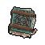

#  雄獅．阿歷克斯

|體質|力量|敏捷|智力|幫派|戰鬥等級|勒索難度|持有天賦|取得天賦|
|:--:|:--:|:--:|:--:|:--:|:--:|:--:|:--:|:--:|
|9|8|10|9|尖牙幫老大|強|難|[歹徒](技能.md#歹徒)、[感知](技能.md#感知)、[鎖匠](技能.md#鎖匠)|[剃刀](技能.md#剃刀)|

## 故事

金色鬃毛的雄獅，尖牙幫的老大，監獄的地下王者。勢力遍布監獄的各個角落，從忠心耿耿的幫派成員，到收錢辦事的卑劣獄警，無一不是他的爪牙。所以，如果你想保住秘密的話，最好更加謹慎一些。

阿歷克斯出生在一個富裕的家庭，從小受過良好的教育。父親“鐵腕·腓力”是國家東部經濟樞紐“聖尼爾市”的警察局副局長，該市在其父親的嚴格執法下犯罪率一直保持著全國最低水平。但是，父親對於工作的投入卻間接毀掉了自己的家庭…

在阿歷克斯十歲那年，父親率領警察部隊包圍了市內殘存黑幫的藏身地，只要他一聲令下，“聖尼爾市”最後的毒瘤就會被徹底鏟除。可是就在此時他卻收到了一個消息，他的妻子在接阿歷克斯放學的路上被歹徒劫持了，對方要求放走被包圍的黑幫老大們，否則就會撕票。 我們無法知道當時阿歷克斯的父親做了多少努力，或是經歷了多少的內心掙扎，但最終他還是下達了進攻的命令…“聖尼爾市”從此再沒出現過有組織的黑幫犯罪，而阿歷克斯也再沒見到過他的母親。

悲劇發生後，父子倆仿佛默契的演員一般，再也未曾在對方面前提起過此事。父親升任局長後，回家的時間比以往更少了，而阿歷克斯也學會了在孤獨中成長。從學校畢業後，阿歷克斯加入了軍隊，多年在海外執行軍事行動，退役之後回到“聖尼爾市”開了一家名叫“提希豐”的安保公司。

時間到了“鐵腕·腓力”退休前的最後一天。市長正在各大媒體的注視下，給這位為了城市奉獻一生的老警長頒發勛章。突然，一幫荷槍實彈的匪徒沖進了市政廳，將所有的政府官員和媒體記者扣押為人質，而匪徒的首領正是阿歷克斯。他恭喜父親獲得了這塊“大公無私”的勛章，並且提出讓父親再次演繹一遍當初的英雄壯舉。他交給父親一把手槍，並告訴他：“如果想要保全人質，那麼就請用這把自殺。當年你犧牲了母親，今天輪到犧牲你自己了，尊敬的警長閣下！”

老腓力看到這一幕，眼中飽含熱淚。他沒有為自己辯解，而是默默看著阿歷克斯。伴隨著一聲哽咽的“對不起，孩子…”之後，老腓力朝著自己滿是皺紋的額頭扣動了扳機。

槍沒有響，因為裡面根本就沒裝子彈。本想在媒體面前揭穿父親虛偽面具的阿歷克斯徹底的輸了，輸給了這個將城市看的比自己生命更重的老警察。“呵\~真是無聊。”在一聲牢騷之後，阿歷克斯繳槍投降。他被送往了遠離“聖尼爾市”的監獄關押，這是他對法官提出的唯一要求，因為他不想呆在那個曾被稱為“家”地方。

## 結識對話

- **喂\~菜鳥，我盯著你好久了。**
- :point_right:盯著我…？
- :point_right:我該感到榮幸嗎？
- **別在我面前裝傻，我`阿歷克斯`的爪牙遍布監獄。**
- **無論多小的風吹草動，我都能立刻知道…**
- **你這家伙好像藏著什麼秘密，說實話我很感興趣。**
- :point_right:**不知道你願不願意跟我分享？**
- :point_right:誰都有秘密… `好感+5`
- 你的情報可能出錯了。
- **喂\~給你一個忠告，菜鳥。**
- 我可以幫助你，也能毀了你，這全在我一念之間。
- 所以答覆我之前，你最好考慮清楚…
- *……*

## 深入了解對話

- **喂\~菜鳥，今天又是為了什麼無聊的事情找我？**
- 其實，我一直再猜，你被關在這裡的原因…
- **你是想知道我的過去嗎？**

#### 我是`尖牙幫`的一員。

> 他告訴了你尖牙幫的歷史，以及一段他自己的故事。

- 如果連老大的過去都不知道，那還算什麼“兄弟”呢？
- **呵呵\~你想用這種屁話來糊弄我嗎？**
- **很好\~！我開始欣賞你的勇氣了。**
- **那就讓我告訴你一些我的故事吧。**
- **看你聽了之後，還敢不敢在我面前耍小聰明了？**
- *又是一個仇恨的悲劇…*
- 你們之後有見過面嗎？我是指他有來看過你嗎？
- **不，沒有。不過…就算有我也不會見他。**
- **別搞錯了，我雖然放過了他，但不意味著我原諒他了。**
- **我永遠都不會原諒他…**

#### 取消

- **這是只有`尖牙幫`的成員才能知道的秘密。**
- **你如果不想惹禍上身的話，最好別亂打聽…**

## 特殊對話

### 打招呼（關係極好）

- **喂\~你可真愛閒逛吶。**

### 打招呼（關係好）

- **菜鳥，你想和我說什麼？**

### 打招呼（關係一般）

- **菜鳥，找我幹嘛？**

### 打招呼（關係差）

- **打擾我，可不是個好主意…**

### 打招呼（關係極差）

- **給你三秒，有話快說。**

### 進行毆打

- **自不量力的傻瓜！見識一下百獸之王的怒火吧！**
- **即使是你這種貨色，我也不會手下留情的！**
- **膽敢挑釁我的權威，你這是在自尋死路！**

### 回禮

- **菜鳥\~既然你選對了禮物，那我也該你點獎勵。**

### 勒索成功

- **這`{x1}`塊我可以給你，但記住，尖牙幫可是有仇必報的。**
- **{hate1}**

### 勒索失敗

- **我見過的蠢貨很多，而你怕是裡面最蠢的一個。**

### 一起吃飯被拒

- **如果你想挑釁的話，我勸你掂量掂量自己。**

### 分享食物

- **不，你錯了，其實是我給你留了一半。**

### 加藥被發現

- **小子，你手裡攥的是什麼？**

### 加藥辯解失敗

- **我警告你，想找死可以直說。**

## 聊天

- **怎麼\~菜鳥？想告訴我你的小秘密了嗎？**
- 你總愛這麼疑神疑鬼的嗎？
- **你知道嗎？陰謀可都是有味道的，而我就能聞出這種味道。**
- **不過\~我現在突然改主意了。**
- {question1}
- **比起你主動告訴我，我更想自己來發現這個秘密。**
- **這樣或許反而比較有趣…**

## 初始物品

||||||
|:--:|:--:|:--:|:--:|:--:|
||||||
|[皮鞋](15-皮鞋.md)|[牙齒項鏈](30-牙齒項鏈.md)|[剪刀](152-剪刀.md)|[水果刀](158-水果刀.md)|[薄荷葉卷](41-薄荷葉卷.md)*4|
||||||
|[精釀蘋果酒](56-精釀蘋果酒.md)|[開鎖器](87-開鎖器.md)*2|[《花花世界》（全新）](102-《花花世界》（全新）.md)|[火柴](120-火柴.md)*6||

## 送禮

|圖片|物品名稱|好感|回應|
|:--:|--|:--:|--|
||[DEMO限定紙鶴](209-DEMO限定紙鶴.md)|50|好感度我可以給你，但記住…這是我自願的，沒人能逼我。|
||[運動鞋](14-運動鞋.md)|24|呵\~這件禮物還像點樣子。|
||[手錶](27-手錶.md)|24|呵\~這件禮物還像點樣子。|
||[牙齒項鏈](30-牙齒項鏈.md)|24|呵\~這件禮物還像點樣子。|
||[皮鞋](15-皮鞋.md)|20|呵\~這件禮物還像點樣子。|
||[金龜子](202-金龜子.md)|20|哈\~金色傳說！|
||[隨身聽（開機）](34-隨身聽（開機）.md)|18|隨身聽嗎？這還有點意思，我收下了。|
||[隨身聽（關機）](35-隨身聽（關機）.md)|18|隨身聽嗎？這還有點意思，我收下了。|
||[隨身聽（沒電）](36-隨身聽（沒電）.md)|18|隨身聽嗎？這還有點意思，我收下了。|
||[貓女郎海報](106-貓女郎海報.md)|18|菜鳥\~以後給我東西，至少得是這種級別。|
||[狐女郎海報](107-狐女郎海報.md)|18|菜鳥\~以後給我東西，至少得是這種級別。|
||[掌上遊戲機](110-掌上遊戲機.md)|18|這東西應該能打發點無聊的時間。|
||[掌上遊戲機（沒電）](111-掌上遊戲機（沒電）.md)|18|這東西應該能打發點無聊的時間。|
||[扳手](142-扳手.md)|18|菜鳥\~以後給我東西，至少得是這種級別。|
||[釘錘](151-釘錘.md)|18|菜鳥\~以後給我東西，至少得是這種級別。|
||[精釀蘋果酒](56-精釀蘋果酒.md)|16|呵\~這件禮物還像點樣子。|
||[頭帶](20-頭帶.md)|15|菜鳥\~以後給我東西，至少得是這種級別。|
||[酒葫蘆](37-酒葫蘆.md)|15|菜鳥\~以後給我東西，至少得是這種級別。|
||[水果刀](158-水果刀.md)|15|菜鳥\~以後給我東西，至少得是這種級別。|
||[雙節棍(+)](161-雙節棍(+).md)|15|呵呵\~這東西好像還有點意思。|
||[棒球帽](21-棒球帽.md)|12|哼\~這就是你的禮物嗎\~菜鳥？|
||[《死靈之書》](31-《死靈之書》.md)|12|哼\~這就是你的禮物嗎\~菜鳥？|
||[《花花世界》（全新）](102-《花花世界》（全新）.md)|12|全新的一本嗎？哼\~這還算不錯。|
||[馬女郎海報](105-馬女郎海報.md)|12|哼\~這就是你的禮物嗎\~菜鳥？|
||[兔女郎海報](108-兔女郎海報.md)|12|哼\~這就是你的禮物嗎\~菜鳥？|
||[剪刀](152-剪刀.md)|12|菜鳥\~以後給我東西，至少得是這種級別。|
||[雙節棍](160-雙節棍.md)|12|呵呵\~這東西好像還有點意思。|
||[墨鏡](18-墨鏡.md)|10|哼\~這就是你的禮物嗎\~菜鳥？|
||[眼鏡](19-眼鏡.md)|10|哼\~這就是你的禮物嗎\~菜鳥？|
||[護身符](29-護身符.md)|10|哼\~這就是你的禮物嗎\~菜鳥？|
||[薄荷葉卷](41-薄荷葉卷.md)|9|菜鳥\~以後給我東西，至少得是這種級別。|
||[啤酒](54-啤酒.md)|9|菜鳥\~以後給我東西，至少得是這種級別。|
||[蘋果酒](55-蘋果酒.md)|9|菜鳥\~以後給我東西，至少得是這種級別。|
||[帆布鞋](16-帆布鞋.md)|8|哼\~這就是你的禮物嗎\~菜鳥？|
||[紅頭巾](23-紅頭巾.md)|8|哼\~這就是你的禮物嗎\~菜鳥？|
||[綠頭巾](24-綠頭巾.md)|8|哼\~這就是你的禮物嗎\~菜鳥？|
||[黑手](26-黑手.md)|8|哼\~這就是你的禮物嗎\~菜鳥？|
||[酒精燈](52-酒精燈.md)|8|哼\~這就是你的禮物嗎\~菜鳥？|
||[奶油華夫餅](68-奶油華夫餅.md)|8|哼\~這就是你的禮物嗎\~菜鳥？|
||[土豆披薩](75-土豆披薩.md)|8|哼\~這就是你的禮物嗎\~菜鳥？|
||[香皂](89-香皂.md)|8|哼\~這就是你的禮物嗎\~菜鳥？|
||[計算機](101-計算機.md)|8|哼\~這就是你的禮物嗎\~菜鳥？|
||[咖啡磨](109-咖啡磨.md)|8|哼\~這就是你的禮物嗎\~菜鳥？|
||[精美的畫作](130-精美的畫作.md)|8|哼\~這就是你的禮物嗎\~菜鳥？|
||[圓珠筆](133-圓珠筆.md)|8|哼\~這就是你的禮物嗎\~菜鳥？|
||[圓珠筆](134-圓珠筆.md)|8|哼\~這就是你的禮物嗎\~菜鳥？|
||[釘棒(+)](163-釘棒(+).md)|8|哼\~這就是你的禮物嗎\~菜鳥？|
||[皮帶](166-皮帶.md)|8|哼\~這就是你的禮物嗎\~菜鳥？|
||[皮帶](167-皮帶.md)|8|哼\~這就是你的禮物嗎\~菜鳥？|
||[《森之音》](203-《森之音》.md)|8|哼\~這就是你的禮物嗎\~菜鳥？|
||[橡膠手套](25-橡膠手套.md)|6|哼\~這就是你的禮物嗎\~菜鳥？|
||[興奮劑](50-興奮劑.md)|6|哼\~這就是你的禮物嗎\~菜鳥？|
||[鎮靜劑](53-鎮靜劑.md)|6|哼\~這就是你的禮物嗎\~菜鳥？|
||[華夫餅](67-華夫餅.md)|6|哼\~這就是你的禮物嗎\~菜鳥？|
||[超辣泡麵](78-超辣泡麵.md)|6|哼\~這就是你的禮物嗎\~菜鳥？|
||[蛋白粉](79-蛋白粉.md)|6|哼\~這就是你的禮物嗎\~菜鳥？|
||[《花花世界》（看過）](103-《花花世界》（看過）.md)|6|哼\~這就是你的禮物嗎\~菜鳥？|
||[紙鶴](126-紙鶴.md)|6|哼\~這就是你的禮物嗎\~菜鳥？|
||[長螺絲](136-長螺絲.md)|6|哼\~這就是你的禮物嗎\~菜鳥？|
||[玻璃匕首(+)](155-玻璃匕首(+).md)|6|哼\~這就是你的禮物嗎\~菜鳥？|
||[牙刷匕首(+)](157-牙刷匕首(+).md)|6|哼\~這就是你的禮物嗎\~菜鳥？|
||[釘棒](162-釘棒.md)|6|哼\~這就是你的禮物嗎\~菜鳥？|
||[鐵管](164-鐵管.md)|6|哼\~這就是你的禮物嗎\~菜鳥？|
||[薄荷葉](40-薄荷葉.md)|4|哼\~這就是你的禮物嗎\~菜鳥？|
||[一把咖啡豆](69-一把咖啡豆.md)|4|哼\~這就是你的禮物嗎\~菜鳥？|
||[焦糖棒](72-焦糖棒.md)|4|哼\~這就是你的禮物嗎\~菜鳥？|
||[汽水](73-汽水.md)|4|哼\~這就是你的禮物嗎\~菜鳥？|
||[酸奶](74-酸奶.md)|4|哼\~這就是你的禮物嗎\~菜鳥？|
||[咖啡粉](76-咖啡粉.md)|4|哼\~這就是你的禮物嗎\~菜鳥？|
||[茶包](77-茶包.md)|4|哼\~這就是你的禮物嗎\~菜鳥？|
||[開鎖器](87-開鎖器.md)|4|哼\~這就是你的禮物嗎\~菜鳥？|
||[開鎖器(P)](38-開鎖器(P).md)|4|哼\~這就是你的禮物嗎\~菜鳥？|
||[《花花世界》（翻爛）](104-《花花世界》（翻爛）.md)|4|哼\~這就是你的禮物嗎\~菜鳥？|
||[玻璃匕首](154-玻璃匕首.md)|4|哼\~這就是你的禮物嗎\~菜鳥？|
||[牙刷匕首](156-牙刷匕首.md)|4|哼\~這就是你的禮物嗎\~菜鳥？|
||[口香糖](70-口香糖.md)|2|哼\~這就是你的禮物嗎\~菜鳥？|
||[曲奇餅乾](71-曲奇餅乾.md)|2|哼\~這就是你的禮物嗎\~菜鳥？|
||[電池](114-電池.md)|2|哼\~這就是你的禮物嗎\~菜鳥？|
||[火柴](120-火柴.md)|2|哼\~這就是你的禮物嗎\~菜鳥？|
||[迴紋針](86-迴紋針.md)|-2|喂\~這種破爛以後別再拿來了！|
||[黑桃A](39-黑桃A.md)|-4|聽好了，我可不需要這種東西。|
||[蘑菇](42-蘑菇.md)|-4|聽好了，我可不需要這種東西。|
||[蘑菇粉](43-蘑菇粉.md)|-4|聽好了，我可不需要這種東西。|
||[花瓣粉](46-花瓣粉.md)|-4|聽好了，我可不需要這種東西。|
||[安眠藥](47-安眠藥.md)|-4|聽好了，我可不需要這種東西。|
||[止疼片](49-止疼片.md)|-4|聽好了，我可不需要這種東西。|
||[醫用酒精](51-醫用酒精.md)|-4|聽好了，我可不需要這種東西。|
||[蘋果](64-蘋果.md)|-4|你覺得會有喜歡吃蘋果的獅子嗎？！|
||[肥皂](88-肥皂.md)|-4|喂\~這種破爛以後別再拿來了！|
||[牙刷](115-牙刷.md)|-4|喂\~這種破爛以後別再拿來了！|
||[牙膏](116-牙膏.md)|-4|喂\~這種破爛以後別再拿來了！|
||[鉛筆](131-鉛筆.md)|-4|喂\~這種破爛以後別再拿來了！|
||[鉛筆](132-鉛筆.md)|-4|喂\~這種破爛以後別再拿來了！|
||[湯匙](143-湯匙.md)|-4|喂\~這種破爛以後別再拿來了！|
||[湯匙](144-湯匙.md)|-4|喂\~這種破爛以後別再拿來了！|
||[瀉藥](44-瀉藥.md)|-6|喂\~這種破爛以後別再拿來了！|
||[簡單的漫畫](129-簡單的漫畫.md)|-6|喂\~這種破爛以後別再拿來了！|
||[拖鞋](17-拖鞋.md)|-8|喂\~這種破爛以後別再拿來了！|
||[毛線帽](22-毛線帽.md)|-8|喂\~這種破爛以後別再拿來了！|
||[自製口罩](32-自製口罩.md)|-8|喂\~這種破爛以後別再拿來了！|
||[布條](84-布條.md)|-20|喂！你腦子裡到底在想什麼？|
||[空的牙膏管](117-空的牙膏管.md)|-20|喂！你腦子裡到底在想什麼？|
||[消毒液](118-消毒液.md)|-20|喂！你腦子裡到底在想什麼？|
||[除銹劑](119-除銹劑.md)|-20|喂！你腦子裡到底在想什麼？|
||[膠帶](121-膠帶.md)|-20|喂！你腦子裡到底在想什麼？|
||[顏料](122-顏料.md)|-20|喂！你腦子裡到底在想什麼？|
||[釘子](123-釘子.md)|-20|喂！你腦子裡到底在想什麼？|
||[鞋帶](124-鞋帶.md)|-20|喂！你腦子裡到底在想什麼？|
||[白紙](125-白紙.md)|-20|喂！你腦子裡到底在想什麼？|
||[碎玻璃](153-碎玻璃.md)|-20|喂！你腦子裡到底在想什麼？|
||[折斷的木條](159-折斷的木條.md)|-20|喂！你腦子裡到底在想什麼？|
||[紫鳶花](45-紫鳶花.md)|-40|喂！你腦子裡到底在想什麼？|
||[胡亂的塗鴉](128-胡亂的塗鴉.md)|-40|喂！你腦子裡到底在想什麼？|
||[硬幣](135-硬幣.md)|-40|喂！你腦子裡到底在想什麼？|
||[發霉的麵包](200-發霉的麵包.md)|-40|喂！你腦子裡到底在想什麼？|
||[花束](127-花束.md)|-80|喂！你腦子裡到底在想什麼？|

