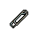

##  食蟻獸．費爾南多

|體質|力量|敏捷|智力|
|:--:|:--:|:--:|:--:|
|5|4|4|6|

### 簡介

長有鋒利爪子的食蟻獸，入獄之前曾做過外科醫生。因為擁有醫療經驗，所以破例可以在監獄醫院里工作。得天獨厚的地理優勢，讓他可以輕松弄到醫院里的“好東西”。如果你需要正規藥品，或是醫用酒精的話，或許可以來找他…

### 故事

費爾南多原本是城市中心醫院的主治外科醫生，行醫多年救治的病人不計其數。雖然幾年前因感情問題與前妻離婚，但每周還能和兩個孩子見上一面。失去了家庭之后，費爾南多將更多時間投入在工作上，很快他就成了科室主任的候選之一。可就在此時，他卻被查出偷竊了醫院的麻醉劑，隨后被醫院開除，并吊銷了行醫執照。

費爾南多之所以這么做都是因為他那個愛惹事的弟弟艾倫。艾倫和費爾南多不同，早早便輟了學，并在街頭結交了一些不三不四的家伙，隨后開始混跡黑幫。一天深夜，許久不聯系的艾倫突然來到費爾南多家門口，而且身上還挨了兩槍。很顯然他剛剛進行過一場黑幫火拼，因為無法去正規醫院，于是才想到了費爾南多這個哥哥。

雖然費爾南多不喜歡這個弟弟，但畢竟血濃于水。在一番猶豫之后，他還是決定在家中幫艾倫治療。于是才出現了上面偷竊醫院麻醉劑的戲碼…

被吊銷行醫執照后，費爾南多失去了經濟來源，高額的房貸和孩子的撫養費壓得他喘不過氣。或許是出于愧疚，又或是有著自己的小算盤，艾倫再次登門拜訪，并為費爾南多指了條賺錢的路子，那就是開一間專為黑幫服務的地下診所。“救誰不是救呢？罪犯的命也是命，不是嗎？”艾倫如此勸說到。別無他法的費爾南多最終同意了艾倫的提議，就此成為了一名黑幫醫師。

開頭的一兩年，地下診所的確為費爾南多賺了不少錢，他也漸漸的習慣了這樣的灰色生活。直到某一天，他從電視上看到一則新聞，某個悍匪持槍洗劫了一家小銀行，打死了兩名警衛，并搶走了百萬現金，現正負傷在逃。費爾南多從警方發布的嫌疑犯照片上吃驚的發現，自己曾經救治過這個家伙。想到或許是自己的醫術害死了兩個無辜的警衛，費爾南多頓感一陣眩暈與惡心。

可是命運的安排往往有著定數，正當費爾南多自責之時，診所的門鈴響了。前來的正是那個在逃的搶匪，他從包里拿出兩大捆鈔票，命令費爾南多再次幫他治療。猶豫片刻后，費爾南多照做了，只是這次的麻醉劑用量“意外”偏高了許多…搶匪再也沒從手術臺上醒來。

完成了自我“贖罪”的費爾南多找來了艾倫幫忙處理尸體。但在回到診所后，卻發現搶匪的錢被艾倫偷走了。而后面的故事就很簡單了，頭腦簡單的艾倫很快漏出了馬腳，警方根據贓款抓住了他，而這位“好弟弟”沒過多久就把費爾南多供了出來。

入獄后的費爾南多因為無法負擔兩個孩子的撫養費，暫時失去了見他們的權利。出于對孩子們的思念，費爾南多做起了偷竊醫院用品販賣的生意。想來，他的悲劇就是因此而起，仿佛一個逃不開的怪圈…

### 結識對話

- **嗨\~我記得你剛進來沒多久…**
- 沒錯，是算不上久。
- 在這待一天就夠受了…
- **我是==食蟻獸·費爾南多==，進來這里已經五年了。**
- **作為前輩，我要給你個忠告…**
- {question1}
- **在監獄里過日子，每天可都是危機四伏。**
- **特別是新人，身上最好備著點==藥品==，做到有備無患\~**
- 多謝提醒了…
- 你可真是個好心人。
- **我進來前是個==外科醫生==，幫助別人本就是我的天職。**
- **{smile1}**
- **再多說一句\~因為我的職業，所以能在醫院里工作…**
- **醫院里的好東西，像是酒精、止疼片，我都能弄到一些。**
- **如果你需要的話，可以找我，價錢好商量…**
- {sweat1}
- *我就知道…這里才不會有什么“好心人”。*

### 深入了解對話

- 嗨\~費爾南多，你上次說你以前是個外科醫生？
- **沒錯，如假包換。**
- 那你能教我兩招包扎傷口的方法嗎…？
- 就像你說的，這里危機四伏，說不定哪天就被人“咔”…
- **{think1}**
- **教你倒是可以，但我先聲明，笨手笨腳的家伙可學不會。**

#### 放心，我是==手工高手==。

> 他口述了包扎傷口的方法，隨后還說了自己是如何從醫生變為囚犯的。

- 你只要告訴我方法，我三兩下就能學會。
- **你可別小看了外科手術，最簡單的包扎也有很多門道…**
- *真是一步錯，步步錯…*
- 看來你是被你的弟弟給“坑”慘了…
- 你會恨他嗎？
- 一生都被他毀了…
- **或許這就是命運的怪圈吧…**
- **小時候家里沒錢同時供我倆上學，所以父母就讓他退學了。**
- **我能做醫生也算欠了他一筆，所以那次幫他就算是還債了…**
- **只是我沒想到，這筆債居然這么重…得用十年的牢獄來還。**

#### 取消

- 呃\~那我怎么判斷自己是不是“笨手笨腳”呢？
- **很簡單，傷口包扎和做手工的原理差不了多少。**
- **等你成了==手工高手==，我想就能輕松應付了…**
### 初始物品

|物品名稱|物品名稱|物品名稱|物品名稱|物品名稱|
|:--:|:--:|:--:|:--:|:--:|
|  |  |  |  |  |
| 黑手 | 玻璃匕首 | 剪刀*2 | 瀉藥*3 | 安眠藥*2 |
|  |  |  |  |  |
| 止疼片*3 | 醫用酒精*3 | 布條*3 | 膠帶*3 |  |
### 送禮

|圖片|物品名稱|好感|回應|
|:--:|--|:--:|--|
||運動鞋|0|咱們囚犯之間就該互相幫助\~不是嗎？|
||皮鞋|2|做手術的時候…腳下不穩，手就會抖。|
||帆布鞋|0|咱們囚犯之間就該互相幫助\~不是嗎？|
||拖鞋|0|咱們囚犯之間就該互相幫助\~不是嗎？|
||墨鏡|0|咱們囚犯之間就該互相幫助\~不是嗎？|
||眼鏡|2|謝謝，朋友\~這副眼鏡的度數剛好合適。|
||頭帶|0|咱們囚犯之間就該互相幫助\~不是嗎？|
||棒球帽|0|咱們囚犯之間就該互相幫助\~不是嗎？|
||毛線帽|0|咱們囚犯之間就該互相幫助\~不是嗎？|
||紅頭巾|0|咱們囚犯之間就該互相幫助\~不是嗎？|
||綠頭巾|0|咱們囚犯之間就該互相幫助\~不是嗎？|
||橡膠手套|2|防滑\~防水…這正是我需要的東西。|
||黑手|0|咱們囚犯之間就該互相幫助\~不是嗎？|
||手表|2|實話實說，這可是個意想不到的驚喜…謝了。|
||護身符|0|咱們囚犯之間就該互相幫助\~不是嗎？|
||牙齒項鏈|0|咱們囚犯之間就該互相幫助\~不是嗎？|
||《死靈之書》|0|咱們囚犯之間就該互相幫助\~不是嗎？|
||自制口罩|1|雖然有些簡陋，但是足夠有用。|
||隨身聽（開機）|0|咱們囚犯之間就該互相幫助\~不是嗎？|
||隨身聽（關機）|0|咱們囚犯之間就該互相幫助\~不是嗎？|
||隨身聽（沒電）|0|咱們囚犯之間就該互相幫助\~不是嗎？|
||酒葫蘆|1|（嗅\~嗅）酒味里好像還混雜了些…草藥的味道。|
||黑桃A|0|咱們囚犯之間就該互相幫助\~不是嗎？|
||薄荷葉|-1|你看不出來嗎？我的嘴巴可沒法吃這個。|
||薄荷葉卷|0|咱們囚犯之間就該互相幫助\~不是嗎？|
||蘑菇|-1|你看不出來嗎？我的嘴巴可沒法吃這個。|
||蘑菇粉|0|咱們囚犯之間就該互相幫助\~不是嗎？|
||瀉藥|0|咱們囚犯之間就該互相幫助\~不是嗎？|
||紫鳶花|-1|花…？我想你選錯了送禮的對象。|
||花瓣粉|0|咱們囚犯之間就該互相幫助\~不是嗎？|
||安眠藥|0|咱們囚犯之間就該互相幫助\~不是嗎？|
||止疼片|0|咱們囚犯之間就該互相幫助\~不是嗎？|
||興奮劑|0|咱們囚犯之間就該互相幫助\~不是嗎？|
||醫用酒精|0|咱們囚犯之間就該互相幫助\~不是嗎？|
||酒精燈|0|咱們囚犯之間就該互相幫助\~不是嗎？|
||鎮靜劑|0|咱們囚犯之間就該互相幫助\~不是嗎？|
||啤酒|1|傷口無論在身上還是心里…都能用酒精來消毒。|
||蘋果酒|1|傷口無論在身上還是心里…都能用酒精來消毒。|
||精釀蘋果酒|1|傷口無論在身上還是心里…都能用酒精來消毒。|
||蘋果|-1|你看不出來嗎？我的嘴巴可沒法吃這個。|
||華夫餅|-1|你看不出來嗎？我的嘴巴可沒法吃這個。|
||奶油華夫餅|-1|你看不出來嗎？我的嘴巴可沒法吃這個。|
||一把咖啡豆|-1|你看不出來嗎？我的嘴巴可沒法吃這個。|
||口香糖|-1|你看不出來嗎？我的嘴巴可沒法吃這個。|
||曲奇餅干|-1|你看不出來嗎？我的嘴巴可沒法吃這個。|
||焦糖棒|-1|你看不出來嗎？我的嘴巴可沒法吃這個。|
||汽水|1|碳酸會損傷牙齒…不過還好我沒有牙齒。|
||酸奶|2|這里的食物太糟了…還好它能幫助我消化。|
||土豆披薩|-1|你看不出來嗎？我的嘴巴可沒法吃這個。|
||咖啡粉|1|嗯\~我的確需要提提神了。|
||茶包|1|嗯\~我的確需要提提神了。|
||泡面|2|你送禮的眼光就像手術刀般精準！|
||蛋白粉|1|在監獄里保持營養需要均衡可不容易。|
||布條|0|咱們囚犯之間就該互相幫助\~不是嗎？|
||回形針|0|咱們囚犯之間就該互相幫助\~不是嗎？|
||開鎖器|0|咱們囚犯之間就該互相幫助\~不是嗎？|
||開鎖器(P)|0|咱們囚犯之間就該互相幫助\~不是嗎？|
||肥皂|0|咱們囚犯之間就該互相幫助\~不是嗎？|
||香皂|0|咱們囚犯之間就該互相幫助\~不是嗎？|
||計算器|0|咱們囚犯之間就該互相幫助\~不是嗎？|
||《花花世界》（全新）|1|呃…這或許能幫我舒緩一下緊繃的情緒。|
||《花花世界》（看過）|0|咱們囚犯之間就該互相幫助\~不是嗎？|
||《花花世界》（翻爛）|0|咱們囚犯之間就該互相幫助\~不是嗎？|
||馬女郎海報|0|咱們囚犯之間就該互相幫助\~不是嗎？|
||貓女郎海報|0|咱們囚犯之間就該互相幫助\~不是嗎？|
||狐女郎海報|0|咱們囚犯之間就該互相幫助\~不是嗎？|
||兔女郎海報|0|咱們囚犯之間就該互相幫助\~不是嗎？|
||咖啡磨|1|手感還算順滑…這應該能幫上我不少忙。|
||掌上游戲機|-1|抱歉\~我對它沒什么興趣…你該給別人的。|
||掌上游戲機（沒電）|-1|抱歉\~我對它沒什么興趣…你該給別人的。|
||電池|0|咱們囚犯之間就該互相幫助\~不是嗎？|
||牙刷|-1|你該知道…我們食蟻獸是沒有牙齒的。|
||牙膏|-1|你該知道…我們食蟻獸是沒有牙齒的。|
||空的牙膏管|-2|這是什么？無聊的惡作劇嗎？|
||消毒液|-1|喂\~我可不想在身上放這些沒用的東西…|
||除銹劑|-1|喂\~我可不想在身上放這些沒用的東西…|
||火柴|0|咱們囚犯之間就該互相幫助\~不是嗎？|
||膠帶|0|咱們囚犯之間就該互相幫助\~不是嗎？|
||顏料|0|咱們囚犯之間就該互相幫助\~不是嗎？|
||釘子|-1|喂\~我可不想在身上放這些沒用的東西…|
||鞋帶|-1|喂\~我可不想在身上放這些沒用的東西…|
||白紙|-1|喂\~我可不想在身上放這些沒用的東西…|
||紙鶴|1|還算精巧的手工…我的孩子或許會喜歡。|
||花束|-1|花…？我想你選錯了送禮的對象。|
||胡亂的涂鴉|-1|我想畫出這畫的家伙…不是傻子就是瘋子。|
||簡單的漫畫|0|咱們囚犯之間就該互相幫助\~不是嗎？|
||精美的畫作|1|這畫看上去就有一種“值錢”的感覺。|
||鉛筆|0|咱們囚犯之間就該互相幫助\~不是嗎？|
||鉛筆|0|咱們囚犯之間就該互相幫助\~不是嗎？|
||圓珠筆|0|咱們囚犯之間就該互相幫助\~不是嗎？|
||圓珠筆|0|咱們囚犯之間就該互相幫助\~不是嗎？|
||硬幣|1|謝了…每一塊錢對現在的我來說都很重要。|
||長螺絲|0|咱們囚犯之間就該互相幫助\~不是嗎？|
||扳手|0|咱們囚犯之間就該互相幫助\~不是嗎？|
||湯匙|0|咱們囚犯之間就該互相幫助\~不是嗎？|
||湯匙|0|咱們囚犯之間就該互相幫助\~不是嗎？|
||釘錘|0|咱們囚犯之間就該互相幫助\~不是嗎？|
||剪刀|1|刀口看起來還算鋒利，留著它應該會有用。|
||碎玻璃|-1|喂\~我可不想在身上放這些沒用的東西…|
||玻璃匕首|0|咱們囚犯之間就該互相幫助\~不是嗎？|
||玻璃匕首(+)|0|咱們囚犯之間就該互相幫助\~不是嗎？|
||牙刷匕首|0|咱們囚犯之間就該互相幫助\~不是嗎？|
||牙刷匕首(+)|0|咱們囚犯之間就該互相幫助\~不是嗎？|
||水果刀|1|刀口看起來還算鋒利，留著它應該會有用。|
||折斷的木條|-1|喂\~我可不想在身上放這些沒用的東西…|
||雙節棍|0|咱們囚犯之間就該互相幫助\~不是嗎？|
||雙節棍(+)|0|咱們囚犯之間就該互相幫助\~不是嗎？|
||釘棒|0|咱們囚犯之間就該互相幫助\~不是嗎？|
||釘棒(+)|0|咱們囚犯之間就該互相幫助\~不是嗎？|
||鐵管|0|咱們囚犯之間就該互相幫助\~不是嗎？|
||皮帶|0|咱們囚犯之間就該互相幫助\~不是嗎？|
||皮帶|0|咱們囚犯之間就該互相幫助\~不是嗎？|
||發霉的面包|-2|這是什么？無聊的惡作劇嗎？|
||金龜子|2|哈\~金色傳說！|
||《森之音》|0|咱們囚犯之間就該互相幫助\~不是嗎？|
||DEMO限定紙鶴|2|我很樂意成為你的朋友…即使你不送這個。|

