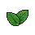
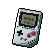
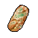

#  駱駝．托尼

|體質|力量|敏捷|智力|幫派|戰鬥等級|勒索難度|持有天賦|取得天賦|
|:--:|:--:|:--:|:--:|:--:|:--:|:--:|:--:|:--:|
|10|8|6|8|大腳幫成員|中|難|[交涉](技能.md#交涉)|[熟客](技能.md#熟客)|

## 故事

四下兜售物品的駱駝，看起來是個經驗老道的監獄商販。擁有一條秘密的進貨渠道，即便是啤酒和《花花世界》這樣的好東西，也能輕易弄到手。對於自己的推銷說辭頗有自信，但卻意外的在你面前栽了跟頭…

托尼的青年時期毫無波瀾，成長在普通的家庭，念了所普通的學校，找了個普通的女孩，然後被用普通的理由分了手。他的一生或許本該如此無聊的度過，直到他接到了那個電話。

那是他幼年鄰居打來的，那小子在高中的時候舉家搬去了國外，這麼多年也沒什麼聯系。他這次找托尼是因為找到了一個發財的機會。他搬去的那個國家剛剛修改了政策，大幅降低了煙酒的稅率，這導致當地煙酒的價格暴跌。於是他就掃了一大批貨，並在托尼的國家聯絡到了一個不錯的買家。現在只要有家伙能把這批貨順利運過來就行，當然\~需要繞過海關。幸運的是，在兩國的邊境線上有著一段幾乎無看守的缺口，因為那是一片沙漠。於是他就想到了托尼，雖然托尼沒什麼特長，但起碼是一只駱駝，穿越沙漠這種事對駱駝來說應該算不上困難。

可能是因為剛剛失戀，也可能是生活缺乏刺激。考慮了兩天之後，托尼答應這筆買賣。於是他花了幾天時間，帶著貨物橫穿沙漠，果然沒遇到什麼麻煩，第一筆錢就這麼輕輕鬆松落進了口袋。接下來，嘗到甜頭的托尼就開始了自己的走私之旅。小到香煙，大到彩電，他獨自開辟了一道黃金之路。

不過隨著托尼的走私金額越來越大，終於引起了海關的重視。他們派了一隊邊防警察蹲守在必經之路上，將剛剛走出沙漠的托尼抓了個正著。或許是命運的捉弄，又或許是貪婪的懲罰，這一單托尼的貨物居然是武器。這讓原本不算重的走私罪，變為了足以讓他吃一輩子牢飯的重罰。

## 結識對話

- **伙計\~走過路過，不要錯過\~**
- **我這裡的東西，可都是好貨。**
- {think1}
- **你可別猶豫，好東西不等人，轉眼的功夫可就沒了。**
- **有一次我弄進來一批焦糖棒，都是沒過期的那種…**
- **你猜怎麼著？我漲價到三倍，可還是一溜煙就賣光了。**
- **所以我好心提醒你，趁著現在還是原價，可別漏了便宜。**
- {think1}
- **…好吧\~我看你也挺識貨。**
- **不如這樣，我給你個友情價，就當交個朋友？**
- **過了這村，可就沒這店了\~**
- {think1}
- **哦\~！行吧\~算我輸給你了。你也太會砍價了！**
- **要是這裡的家伙都像你這樣，我遲早得喝西北風！**
- {question1}
- 抱歉…我剛剛走神了，你是在和我說話嗎？
- **你……**

## 深入了解對話

- 托尼，你干這行多久了？
- **你指的是什麼\~伙計？**
- 在監獄裡倒騰東西啊\~你這些貨都是哪兒弄來的？
- **喂\~這個可是我的商業機密，可不能隨便告訴你\~**
- **除非…你是我的VIP客戶，沒準我能透露點消息。**

#### 我在你這兒花掉`300塊`了。

> 他一邊整理著口袋裡的東西，一邊和你聊了聊自己的事情。

- 這難道還不夠嗎？
- **嘿嘿\~夠啦\~夠啦\~我正式宣布你成VIP了！**
- **現在說吧\~你想打聽些什麼？**
- *這家伙原來是因為這個進來的…*
- 可是你還是沒說，你現在是怎麼把東西弄進監獄的。
- **哦\~這可是機密中的機密…**
- **你想要知道這些，那得是“超級VIP”才行。**
- **起碼得再消費個100000塊吧\~嘿嘿！**
- 嘖\~被這家伙給耍了…

#### 取消

- **門檻嘛\~也不高，只要在我這消費`300塊`就行！**
- **加加油\~我的伙計\~**

## 特殊對話

### 打招呼（關係極好）

- **托尼商店為您服務。**

### 打招呼（關係好）

- **你好，有什麼能效勞的嗎？**

### 打招呼（關係一般）

- **嗨\~你有話想說嗎？**

### 打招呼（關係差）

- **抱歉，托尼商店今天歇業。**

### 打招呼（關係極差）

- **別耽誤我做生意…**

### 進行毆打

- **哦…你現在道歉的話還來得及。**
- **想打架嗎？我可不是個軟柿子！**
- **我會給你的腿“打折”的！**

### 回禮

- **那麼托尼商店也該回饋一下顧客了…不是嗎？**

### 勒索成功

- **這裡有`{x1}`塊，你拿去好了，但這筆帳我記下了。**
- **{upset1}**

### 勒索失敗

- **說實話，你剛剛的那些狠話真的是…弱爆了。**
- **{upset1}**

### 一起吃飯被拒

- **別坐在這兒，我可不想和你一起吃飯。**

### 分享食物

- **{smile1}**
- **我說朋友，你可太客氣了。**

### 加藥被發現

- **呃…你想往我的盤子裡丟什麼？**

### 加藥辯解失敗

- **調料？你當我是傻瓜嗎？**

## 聊天

- **比利那個混蛋總是在和我搶生意，我賣什麼，他就賣什麼…**
- **搞的我只能和他打價格戰。**
- **哎\~再這麼下去，過不了多久我就要關門大吉了…**
- 我很同情你，但或許這就是自由市場的冷酷無情吧！
- **看來我只能去黑爪幫的銀行貸款了…哦\~真是該死！**

## 初始物品

||||||
|:--:|:--:|:--:|:--:|:--:|
||||||
|[帆布鞋](16-帆布鞋.md)|[棒球帽](21-棒球帽.md)|[折斷的木條](159-折斷的木條.md)|[黑桃A](39-黑桃A.md)|[薄荷葉](40-薄荷葉.md)*4|
||||||
|[啤酒](54-啤酒.md)|[焦糖棒](72-焦糖棒.md)*2|[計算機](101-計算機.md)|[《花花世界》（全新）](102-《花花世界》（全新）.md)*2||

## 送禮

|圖片|物品名稱|好感|回應|
|:--:|--|:--:|--|
||[DEMO限定紙鶴](209-DEMO限定紙鶴.md)|50|伙計\~這將成為我商店裡的限定商品！|
||[棒球帽](21-棒球帽.md)|24|哦！你真是太大方了\~我的朋友！|
||[手錶](27-手錶.md)|24|哦！你真是太大方了\~我的朋友！|
||[隨身聽（開機）](34-隨身聽（開機）.md)|24|哦！你真是太大方了\~我的朋友！|
||[隨身聽（關機）](35-隨身聽（關機）.md)|24|哦！你真是太大方了\~我的朋友！|
||[隨身聽（沒電）](36-隨身聽（沒電）.md)|24|哦！你真是太大方了\~我的朋友！|
||[掌上遊戲機](110-掌上遊戲機.md)|24|哦！你真是太大方了\~我的朋友！|
||[掌上遊戲機（沒電）](111-掌上遊戲機（沒電）.md)|24|哦！你真是太大方了\~我的朋友！|
||[金龜子](202-金龜子.md)|20|哈\~金色傳說！|
||[馬女郎海報](105-馬女郎海報.md)|18|嘿\~這看上去應該能賣個好價錢。|
||[貓女郎海報](106-貓女郎海報.md)|18|嘿\~這看上去應該能賣個好價錢。|
||[狐女郎海報](107-狐女郎海報.md)|18|嘿\~這看上去應該能賣個好價錢。|
||[兔女郎海報](108-兔女郎海報.md)|18|嘿\~這看上去應該能賣個好價錢。|
||[計算機](101-計算機.md)|16|俗話說得好：親兄弟，明算帳。|
||[皮鞋](15-皮鞋.md)|15|嘿\~這看上去應該能賣個好價錢。|
||[墨鏡](18-墨鏡.md)|15|嘿\~這看上去應該能賣個好價錢。|
||[酒葫蘆](37-酒葫蘆.md)|15|嘿\~這看上去應該能賣個好價錢。|
||[運動鞋](14-運動鞋.md)|12|謝謝你的禮物，我的朋友\~|
||[牙齒項鏈](30-牙齒項鏈.md)|12|謝謝你的禮物，我的朋友\~|
||[《死靈之書》](31-《死靈之書》.md)|12|謝謝你的禮物，我的朋友\~|
||[精釀蘋果酒](56-精釀蘋果酒.md)|12|嘿\~這可是緊俏商品\~|
||[奶油華夫餅](68-奶油華夫餅.md)|12|我會自己吃了它，避免通貨膨脹！|
||[土豆披薩](75-土豆披薩.md)|12|我會自己吃了它，避免通貨膨脹！|
||[《花花世界》（全新）](102-《花花世界》（全新）.md)|12|嘿\~這可是緊俏商品\~|
||[精美的畫作](130-精美的畫作.md)|12|嘿\~這看上去應該能賣個好價錢。|
||[圓珠筆](133-圓珠筆.md)|12|嘿\~這看上去應該能賣個好價錢。|
||[圓珠筆](134-圓珠筆.md)|12|嘿\~這看上去應該能賣個好價錢。|
||[眼鏡](19-眼鏡.md)|10|謝謝你的禮物，我的朋友\~|
||[頭帶](20-頭帶.md)|10|謝謝你的禮物，我的朋友\~|
||[護身符](29-護身符.md)|10|謝謝你的禮物，我的朋友\~|
||[薄荷葉卷](41-薄荷葉卷.md)|9|嘿\~這可是緊俏商品\~|
||[興奮劑](50-興奮劑.md)|9|嘿\~這可是緊俏商品\~|
||[鎮靜劑](53-鎮靜劑.md)|9|嘿\~這可是緊俏商品\~|
||[啤酒](54-啤酒.md)|9|嘿\~這可是緊俏商品\~|
||[蘋果酒](55-蘋果酒.md)|9|嘿\~這可是緊俏商品\~|
||[超辣泡麵](78-超辣泡麵.md)|9|我會自己吃了它，避免通貨膨脹！|
||[《花花世界》（看過）](103-《花花世界》（看過）.md)|9|嘿\~這可是緊俏商品\~|
||[帆布鞋](16-帆布鞋.md)|8|謝謝你的禮物，我的朋友\~|
||[拖鞋](17-拖鞋.md)|8|謝謝你的禮物，我的朋友\~|
||[毛線帽](22-毛線帽.md)|8|謝謝你的禮物，我的朋友\~|
||[紅頭巾](23-紅頭巾.md)|8|謝謝你的禮物，我的朋友\~|
||[綠頭巾](24-綠頭巾.md)|8|謝謝你的禮物，我的朋友\~|
||[黑手](26-黑手.md)|8|謝謝你的禮物，我的朋友\~|
||[自製口罩](32-自製口罩.md)|8|謝謝你的禮物，我的朋友\~|
||[薄荷葉](40-薄荷葉.md)|8|謝了朋友\~這下托尼商店又有新貨了！|
||[香皂](89-香皂.md)|8|謝謝你的禮物，我的朋友\~|
||[咖啡磨](109-咖啡磨.md)|8|謝謝你的禮物，我的朋友\~|
||[硬幣](135-硬幣.md)|8|要是一人給我一塊錢的話…嘿嘿！|
||[皮帶](166-皮帶.md)|8|謝謝你的禮物，我的朋友\~|
||[皮帶](167-皮帶.md)|8|謝謝你的禮物，我的朋友\~|
||[《森之音》](203-《森之音》.md)|8|謝謝你的禮物，我的朋友\~|
||[橡膠手套](25-橡膠手套.md)|6|謝謝你的禮物，我的朋友\~|
||[瀉藥](44-瀉藥.md)|6|謝謝你的禮物，我的朋友\~|
||[蘋果](64-蘋果.md)|6|我會自己吃了它，避免通貨膨脹！|
||[華夫餅](67-華夫餅.md)|6|謝謝你的禮物，我的朋友\~|
||[焦糖棒](72-焦糖棒.md)|6|我會自己吃了它，避免通貨膨脹！|
||[汽水](73-汽水.md)|6|我會自己吃了它，避免通貨膨脹！|
||[酸奶](74-酸奶.md)|6|我會自己吃了它，避免通貨膨脹！|
||[蛋白粉](79-蛋白粉.md)|6|謝謝你的禮物，我的朋友\~|
||[紙鶴](126-紙鶴.md)|6|謝謝你的禮物，我的朋友\~|
||[簡單的漫畫](129-簡單的漫畫.md)|6|謝謝你的禮物，我的朋友\~|
||[黑桃A](39-黑桃A.md)|4|謝謝你的禮物，我的朋友\~|
||[蘑菇](42-蘑菇.md)|4|謝謝你的禮物，我的朋友\~|
||[蘑菇粉](43-蘑菇粉.md)|4|謝謝你的禮物，我的朋友\~|
||[紫鳶花](45-紫鳶花.md)|4|謝謝你的禮物，我的朋友\~|
||[花瓣粉](46-花瓣粉.md)|4|謝謝你的禮物，我的朋友\~|
||[安眠藥](47-安眠藥.md)|4|謝謝你的禮物，我的朋友\~|
||[止疼片](49-止疼片.md)|4|謝謝你的禮物，我的朋友\~|
||[醫用酒精](51-醫用酒精.md)|4|謝謝你的禮物，我的朋友\~|
||[一把咖啡豆](69-一把咖啡豆.md)|4|謝謝你的禮物，我的朋友\~|
||[咖啡粉](76-咖啡粉.md)|4|謝謝你的禮物，我的朋友\~|
||[茶包](77-茶包.md)|4|謝謝你的禮物，我的朋友\~|
||[《花花世界》（翻爛）](104-《花花世界》（翻爛）.md)|4|謝謝你的禮物，我的朋友\~|
||[鉛筆](131-鉛筆.md)|4|謝謝你的禮物，我的朋友\~|
||[鉛筆](132-鉛筆.md)|4|謝謝你的禮物，我的朋友\~|
||[口香糖](70-口香糖.md)|3|我會自己吃了它，避免通貨膨脹！|
||[曲奇餅乾](71-曲奇餅乾.md)|2|謝謝你的禮物，我的朋友\~|
||[電池](114-電池.md)|2|謝謝你的禮物，我的朋友\~|
||[火柴](120-火柴.md)|2|謝謝你的禮物，我的朋友\~|
||[布條](84-布條.md)|-2|呃\~這東西可不值錢…|
||[迴紋針](86-迴紋針.md)|-2|呃\~這東西可不值錢…|
||[消毒液](118-消毒液.md)|-2|呃\~這東西可不值錢…|
||[除銹劑](119-除銹劑.md)|-2|呃\~這東西可不值錢…|
||[膠帶](121-膠帶.md)|-2|呃\~這東西可不值錢…|
||[顏料](122-顏料.md)|-2|呃\~這東西可不值錢…|
||[釘子](123-釘子.md)|-2|呃\~這東西可不值錢…|
||[鞋帶](124-鞋帶.md)|-2|呃\~這東西可不值錢…|
||[白紙](125-白紙.md)|-2|呃\~這東西可不值錢…|
||[折斷的木條](159-折斷的木條.md)|-2|呃\~這東西可不值錢…|
||[開鎖器](87-開鎖器.md)|-4|呃\~這東西可不值錢…|
||[開鎖器(P)](38-開鎖器(P).md)|-4|呃\~這東西可不值錢…|
||[肥皂](88-肥皂.md)|-4|呃\~這東西可不值錢…|
||[牙刷](115-牙刷.md)|-4|呃\~這東西可不值錢…|
||[牙膏](116-牙膏.md)|-4|呃\~這東西可不值錢…|
||[胡亂的塗鴉](128-胡亂的塗鴉.md)|-4|呃\~這東西可不值錢…|
||[湯匙](143-湯匙.md)|-4|呃\~這東西可不值錢…|
||[湯匙](144-湯匙.md)|-4|呃\~這東西可不值錢…|
||[長螺絲](136-長螺絲.md)|-6|呃\~這東西可不值錢…|
||[酒精燈](52-酒精燈.md)|-8|呃\~我想我應該用不著它…|
||[花束](127-花束.md)|-8|我想咱們還是保持單純的生意關係就好…|
||[空的牙膏管](117-空的牙膏管.md)|-20|我身上可沒地方裝這種破爛…|
||[碎玻璃](153-碎玻璃.md)|-20|武器給我惹得麻煩已經夠多了…|
||[玻璃匕首](154-玻璃匕首.md)|-40|武器給我惹得麻煩已經夠多了…|
||[牙刷匕首](156-牙刷匕首.md)|-40|武器給我惹得麻煩已經夠多了…|
||[發霉的麵包](200-發霉的麵包.md)|-40|我身上可沒地方裝這種破爛…|
||[玻璃匕首(+)](155-玻璃匕首(+).md)|-60|武器給我惹得麻煩已經夠多了…|
||[牙刷匕首(+)](157-牙刷匕首(+).md)|-60|武器給我惹得麻煩已經夠多了…|
||[釘棒](162-釘棒.md)|-60|武器給我惹得麻煩已經夠多了…|
||[鐵管](164-鐵管.md)|-60|武器給我惹得麻煩已經夠多了…|
||[剪刀](152-剪刀.md)|-80|武器給我惹得麻煩已經夠多了…|
||[雙節棍](160-雙節棍.md)|-80|武器給我惹得麻煩已經夠多了…|
||[釘棒(+)](163-釘棒(+).md)|-80|武器給我惹得麻煩已經夠多了…|
||[水果刀](158-水果刀.md)|-100|武器給我惹得麻煩已經夠多了…|
||[雙節棍(+)](161-雙節棍(+).md)|-100|武器給我惹得麻煩已經夠多了…|
||[扳手](142-扳手.md)|-120|武器給我惹得麻煩已經夠多了…|
||[釘錘](151-釘錘.md)|-120|武器給我惹得麻煩已經夠多了…|

