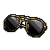
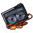

##  駱駝．托尼

|體質|力量|敏捷|智力|幫派|初始金錢|
|:--:|:--:|:--:|:--:|:--:|:--:|
|10|8|6|8|大腳幫成員|180|

### 故事

四下兜售物品的駱駝，看起來是個經驗老道的監獄商販。擁有一條秘密的進貨渠道，即便是啤酒和《花花世界》這樣的好東西，也能輕易弄到手。對於自己的推銷說辭頗有自信，但卻意外的在你面前栽了跟頭…

托尼的青年時期毫無波瀾，成長在普通的家庭，念了所普通的學校，找了個普通的女孩，然後被用普通的理由分了手。他的一生或許本該如此無聊的度過，直到他接到了那個電話。

那是他幼年鄰居打來的，那小子在高中的時候舉家搬去了國外，這麼多年也沒什麼聯系。他這次找托尼是因為找到了一個發財的機會。他搬去的那個國家剛剛修改了政策，大幅降低了煙酒的稅率，這導致當地煙酒的價格暴跌。於是他就掃了一大批貨，並在托尼的國家聯絡到了一個不錯的買家。現在只要有家伙能把這批貨順利運過來就行，當然\~需要繞過海關。幸運的是，在兩國的邊境線上有著一段幾乎無看守的缺口，因為那是一片沙漠。於是他就想到了托尼，雖然托尼沒什麼特長，但起碼是一只駱駝，穿越沙漠這種事對駱駝來說應該算不上困難。

可能是因為剛剛失戀，也可能是生活缺乏刺激。考慮了兩天之後，托尼答應這筆買賣。於是他花了幾天時間，帶著貨物橫穿沙漠，果然沒遇到什麼麻煩，第一筆錢就這麼輕輕松松落進了口袋。接下來，嘗到甜頭的托尼就開始了自己的走私之旅。小到香煙，大到彩電，他獨自開辟了一道黃金之路。

不過隨著托尼的走私金額越來越大，終於引起了海關的重視。他們派了一隊邊防警察蹲守在必經之路上，將剛剛走出沙漠的托尼抓了個正著。或許是命運的捉弄，又或許是貪婪的懲罰，這一單托尼的貨物居然是武器。這讓原本不算重的走私罪，變為了足以讓他吃一輩子牢飯的重罰。

### 結識對話

- **伙計\~走過路過，不要錯過\~**
- **我這裡的東西，可都是好貨。**
- {think1}
- **你可別猶豫，好東西不等人，轉眼的功夫可就沒了。**
- **有一次我弄進來一批焦糖棒，都是沒過期的那種…**
- **你猜怎麼著？我漲價到三倍，可還是一溜煙就賣光了。**
- **所以我好心提醒你，趁著現在還是原價，可別漏了便宜。**
- {think1}
- **…好吧\~我看你也挺識貨。**
- **不如這樣，我給你個友情價，就當交個朋友？**
- **過了這村，可就沒這店了\~**
- {think1}
- **哦\~！行吧\~算我輸給你了。你也太會砍價了！**
- **要是這裡的家伙都像你這樣，我遲早得喝西北風！**
- {question1}
- 抱歉…我剛剛走神了，你是在和我說話嗎？
- **你……**

### 深入了解對話

- 托尼，你干這行多久了？
- **你指的是什麼\~伙計？**
- 在監獄裡倒騰東西啊\~你這些貨都是哪兒弄來的？
- **喂\~這個可是我的商業機密，可不能隨便告訴你\~**
- **除非…你是我的VIP客戶，沒準我能透露點消息。**

#### 我在你這兒花掉`300塊`了。

> 他一邊整理著口袋裡的東西，一邊和你聊了聊自己的事情。

- 這難道還不夠嗎？
- **嘿嘿\~夠啦\~夠啦\~我正式宣布你成VIP了！**
- **現在說吧\~你想打聽些什麼？**
- *這家伙原來是因為這個進來的…*
- 可是你還是沒說，你現在是怎麼把東西弄進監獄的。
- **哦\~這可是機密中的機密…**
- **你想要知道這些，那得是“超級VIP”才行。**
- **起碼得再消費個100000塊吧\~嘿嘿！**
- 嘖\~被這家伙給耍了…

#### 取消

- **門檻嘛\~也不高，只要在我這消費`300塊`就行！**
- **加加油\~我的伙計\~**

### 打招呼

#### 關係極好

- **托尼商店為您服務。**

#### 關係好

- **你好，有什麼能效勞的嗎？**

#### 關係一般

- **嗨\~你有話想說嗎？**

#### 關係不好

- **抱歉，托尼商店今天歇業。**

#### 關係極差

- **別耽誤我做生意…**

## 聊天

- **比利那個混蛋總是在和我搶生意，我賣什麼，他就賣什麼…**
- **搞的我只能和他打價格戰。**
- **哎\~再這麼下去，過不了多久我就要關門大吉了…**
- 我很同情你，但或許這就是自由市場的冷酷無情吧！
- **看來我只能去黑爪幫的銀行貸款了…哦\~真是該死！**

### 初始物品

||||||
|:--:|:--:|:--:|:--:|:--:|
|  |  |  |  |  |
| [帆布鞋](道具.md#帆布鞋) | [棒球帽](道具.md#棒球帽) | [折斷的木條](道具.md#折斷的木條) | [黑桃A](道具.md#黑桃A) | [薄荷葉](道具.md#薄荷葉)*4 |
|  |  |  |  |  |
| [啤酒](道具.md#啤酒) | [焦糖棒](道具.md#焦糖棒)*2 | [計算機](道具.md#計算機) | [《花花世界》（全新）](道具.md#《花花世界》（全新）)*2 |  |

### 送禮

|圖片|物品名稱|好感|回應|
|:--:|--|:--:|--|
||[運動鞋](道具.md#運動鞋)|12|謝謝你的禮物，我的朋友\~|
||[皮鞋](道具.md#皮鞋)|15|嘿\~這看上去應該能賣個好價錢。|
||[帆布鞋](道具.md#帆布鞋)|8|謝謝你的禮物，我的朋友\~|
||[拖鞋](道具.md#拖鞋)|8|謝謝你的禮物，我的朋友\~|
||[墨鏡](道具.md#墨鏡)|15|嘿\~這看上去應該能賣個好價錢。|
||[眼鏡](道具.md#眼鏡)|10|謝謝你的禮物，我的朋友\~|
||[頭帶](道具.md#頭帶)|10|謝謝你的禮物，我的朋友\~|
||[棒球帽](道具.md#棒球帽)|24|哦！你真是太大方了\~我的朋友！|
||[毛線帽](道具.md#毛線帽)|8|謝謝你的禮物，我的朋友\~|
||[紅頭巾](道具.md#紅頭巾)|8|謝謝你的禮物，我的朋友\~|
||[綠頭巾](道具.md#綠頭巾)|8|謝謝你的禮物，我的朋友\~|
||[橡膠手套](道具.md#橡膠手套)|6|謝謝你的禮物，我的朋友\~|
||[黑手](道具.md#黑手)|8|謝謝你的禮物，我的朋友\~|
||[手錶](道具.md#手錶)|24|哦！你真是太大方了\~我的朋友！|
||[護身符](道具.md#護身符)|10|謝謝你的禮物，我的朋友\~|
||[牙齒項鏈](道具.md#牙齒項鏈)|12|謝謝你的禮物，我的朋友\~|
||[《死靈之書》](道具.md#《死靈之書》)|12|謝謝你的禮物，我的朋友\~|
||[自製口罩](道具.md#自製口罩)|8|謝謝你的禮物，我的朋友\~|
||[隨身聽（開機）](道具.md#隨身聽（開機）)|24|哦！你真是太大方了\~我的朋友！|
||[隨身聽（關機）](道具.md#隨身聽（關機）)|24|哦！你真是太大方了\~我的朋友！|
||[隨身聽（沒電）](道具.md#隨身聽（沒電）)|24|哦！你真是太大方了\~我的朋友！|
||[酒葫蘆](道具.md#酒葫蘆)|15|嘿\~這看上去應該能賣個好價錢。|
||[黑桃A](道具.md#黑桃A)|4|謝謝你的禮物，我的朋友\~|
||[薄荷葉](道具.md#薄荷葉)|8|謝了朋友\~這下托尼商店又有新貨了！|
||[薄荷葉卷](道具.md#薄荷葉卷)|9|嘿\~這可是緊俏商品\~|
||[蘑菇](道具.md#蘑菇)|4|謝謝你的禮物，我的朋友\~|
||[蘑菇粉](道具.md#蘑菇粉)|4|謝謝你的禮物，我的朋友\~|
||[瀉藥](道具.md#瀉藥)|6|謝謝你的禮物，我的朋友\~|
||[紫鳶花](道具.md#紫鳶花)|4|謝謝你的禮物，我的朋友\~|
||[花瓣粉](道具.md#花瓣粉)|4|謝謝你的禮物，我的朋友\~|
||[安眠藥](道具.md#安眠藥)|4|謝謝你的禮物，我的朋友\~|
||[止疼片](道具.md#止疼片)|4|謝謝你的禮物，我的朋友\~|
||[興奮劑](道具.md#興奮劑)|9|嘿\~這可是緊俏商品\~|
||[醫用酒精](道具.md#醫用酒精)|4|謝謝你的禮物，我的朋友\~|
||[酒精燈](道具.md#酒精燈)|-8|呃\~我想我應該用不著它…|
||[鎮靜劑](道具.md#鎮靜劑)|9|嘿\~這可是緊俏商品\~|
||[啤酒](道具.md#啤酒)|9|嘿\~這可是緊俏商品\~|
||[蘋果酒](道具.md#蘋果酒)|9|嘿\~這可是緊俏商品\~|
||[精釀蘋果酒](道具.md#精釀蘋果酒)|12|嘿\~這可是緊俏商品\~|
||[蘋果](道具.md#蘋果)|6|我會自己吃了它，避免通貨膨脹！|
||[華夫餅](道具.md#華夫餅)|6|謝謝你的禮物，我的朋友\~|
||[奶油華夫餅](道具.md#奶油華夫餅)|12|我會自己吃了它，避免通貨膨脹！|
||[一把咖啡豆](道具.md#一把咖啡豆)|4|謝謝你的禮物，我的朋友\~|
||[口香糖](道具.md#口香糖)|3|我會自己吃了它，避免通貨膨脹！|
||[曲奇餅乾](道具.md#曲奇餅乾)|2|謝謝你的禮物，我的朋友\~|
||[焦糖棒](道具.md#焦糖棒)|6|我會自己吃了它，避免通貨膨脹！|
||[汽水](道具.md#汽水)|6|我會自己吃了它，避免通貨膨脹！|
||[酸奶](道具.md#酸奶)|6|我會自己吃了它，避免通貨膨脹！|
||[土豆披薩](道具.md#土豆披薩)|12|我會自己吃了它，避免通貨膨脹！|
||[咖啡粉](道具.md#咖啡粉)|4|謝謝你的禮物，我的朋友\~|
||[茶包](道具.md#茶包)|4|謝謝你的禮物，我的朋友\~|
||[超辣泡麵](道具.md#超辣泡麵)|9|我會自己吃了它，避免通貨膨脹！|
||[蛋白粉](道具.md#蛋白粉)|6|謝謝你的禮物，我的朋友\~|
||[布條](道具.md#布條)|-2|呃\~這東西可不值錢…|
||[迴紋針](道具.md#迴紋針)|-2|呃\~這東西可不值錢…|
||[開鎖器](道具.md#開鎖器)|-4|呃\~這東西可不值錢…|
||[開鎖器(P)](道具.md#開鎖器(P))|-4|呃\~這東西可不值錢…|
||[肥皂](道具.md#肥皂)|-4|呃\~這東西可不值錢…|
||[香皂](道具.md#香皂)|8|謝謝你的禮物，我的朋友\~|
||[計算機](道具.md#計算機)|16|俗話說得好：親兄弟，明算帳。|
||[《花花世界》（全新）](道具.md#《花花世界》（全新）)|12|嘿\~這可是緊俏商品\~|
||[《花花世界》（看過）](道具.md#《花花世界》（看過）)|9|嘿\~這可是緊俏商品\~|
||[《花花世界》（翻爛）](道具.md#《花花世界》（翻爛）)|4|謝謝你的禮物，我的朋友\~|
||[馬女郎海報](道具.md#馬女郎海報)|18|嘿\~這看上去應該能賣個好價錢。|
||[貓女郎海報](道具.md#貓女郎海報)|18|嘿\~這看上去應該能賣個好價錢。|
||[狐女郎海報](道具.md#狐女郎海報)|18|嘿\~這看上去應該能賣個好價錢。|
||[兔女郎海報](道具.md#兔女郎海報)|18|嘿\~這看上去應該能賣個好價錢。|
||[咖啡磨](道具.md#咖啡磨)|8|謝謝你的禮物，我的朋友\~|
||[掌上遊戲機](道具.md#掌上遊戲機)|24|哦！你真是太大方了\~我的朋友！|
||[掌上遊戲機（沒電）](道具.md#掌上遊戲機（沒電）)|24|哦！你真是太大方了\~我的朋友！|
||[電池](道具.md#電池)|2|謝謝你的禮物，我的朋友\~|
||[牙刷](道具.md#牙刷)|-4|呃\~這東西可不值錢…|
||[牙膏](道具.md#牙膏)|-4|呃\~這東西可不值錢…|
||[空的牙膏管](道具.md#空的牙膏管)|-20|我身上可沒地方裝這種破爛…|
||[消毒液](道具.md#消毒液)|-2|呃\~這東西可不值錢…|
||[除銹劑](道具.md#除銹劑)|-2|呃\~這東西可不值錢…|
||[火柴](道具.md#火柴)|2|謝謝你的禮物，我的朋友\~|
||[膠帶](道具.md#膠帶)|-2|呃\~這東西可不值錢…|
||[顏料](道具.md#顏料)|-2|呃\~這東西可不值錢…|
||[釘子](道具.md#釘子)|-2|呃\~這東西可不值錢…|
||[鞋帶](道具.md#鞋帶)|-2|呃\~這東西可不值錢…|
||[白紙](道具.md#白紙)|-2|呃\~這東西可不值錢…|
||[紙鶴](道具.md#紙鶴)|6|謝謝你的禮物，我的朋友\~|
||[花束](道具.md#花束)|-8|我想咱們還是保持單純的生意關系就好…|
||[胡亂的塗鴉](道具.md#胡亂的塗鴉)|-4|呃\~這東西可不值錢…|
||[簡單的漫畫](道具.md#簡單的漫畫)|6|謝謝你的禮物，我的朋友\~|
||[精美的畫作](道具.md#精美的畫作)|12|嘿\~這看上去應該能賣個好價錢。|
||[鉛筆](道具.md#鉛筆)|4|謝謝你的禮物，我的朋友\~|
||[鉛筆](道具.md#鉛筆)|4|謝謝你的禮物，我的朋友\~|
||[圓珠筆](道具.md#圓珠筆)|12|嘿\~這看上去應該能賣個好價錢。|
||[圓珠筆](道具.md#圓珠筆)|12|嘿\~這看上去應該能賣個好價錢。|
||[硬幣](道具.md#硬幣)|8|要是一人給我一塊錢的話…嘿嘿！|
||[長螺絲](道具.md#長螺絲)|-6|呃\~這東西可不值錢…|
||[扳手](道具.md#扳手)|-120|武器給我惹得麻煩已經夠多了…|
||[湯匙](道具.md#湯匙)|-4|呃\~這東西可不值錢…|
||[湯匙](道具.md#湯匙)|-4|呃\~這東西可不值錢…|
||[釘錘](道具.md#釘錘)|-120|武器給我惹得麻煩已經夠多了…|
||[剪刀](道具.md#剪刀)|-80|武器給我惹得麻煩已經夠多了…|
||[碎玻璃](道具.md#碎玻璃)|-20|武器給我惹得麻煩已經夠多了…|
||[玻璃匕首](道具.md#玻璃匕首)|-40|武器給我惹得麻煩已經夠多了…|
||[玻璃匕首(+)](道具.md#玻璃匕首(+))|-60|武器給我惹得麻煩已經夠多了…|
||[牙刷匕首](道具.md#牙刷匕首)|-40|武器給我惹得麻煩已經夠多了…|
||[牙刷匕首(+)](道具.md#牙刷匕首(+))|-60|武器給我惹得麻煩已經夠多了…|
||[水果刀](道具.md#水果刀)|-100|武器給我惹得麻煩已經夠多了…|
||[折斷的木條](道具.md#折斷的木條)|-2|呃\~這東西可不值錢…|
||[雙節棍](道具.md#雙節棍)|-80|武器給我惹得麻煩已經夠多了…|
||[雙節棍(+)](道具.md#雙節棍(+))|-100|武器給我惹得麻煩已經夠多了…|
||[釘棒](道具.md#釘棒)|-60|武器給我惹得麻煩已經夠多了…|
||[釘棒(+)](道具.md#釘棒(+))|-80|武器給我惹得麻煩已經夠多了…|
||[鐵管](道具.md#鐵管)|-60|武器給我惹得麻煩已經夠多了…|
||[皮帶](道具.md#皮帶)|8|謝謝你的禮物，我的朋友\~|
||[皮帶](道具.md#皮帶)|8|謝謝你的禮物，我的朋友\~|
||[發霉的麵包](道具.md#發霉的麵包)|-40|我身上可沒地方裝這種破爛…|
||[金龜子](道具.md#金龜子)|20|哈\~金色傳說！|
||[《森之音》](道具.md#《森之音》)|8|謝謝你的禮物，我的朋友\~|
||[DEMO限定紙鶴](道具.md#DEMO限定紙鶴)|50|伙計\~這將成為我商店裡的限定商品！|

