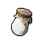
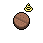
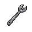

#  驢子．山姆

|體質|力量|敏捷|智力|幫派|戰鬥等級|勒索難度|持有天賦|取得天賦|
|:--:|:--:|:--:|:--:|:--:|:--:|:--:|:--:|:--:|
|8|6|7|4|無幫派|中|中|[工人](技能.md#工人)、[製作能手](技能.md#製作能手)|[苦力](技能.md#苦力)|

## 故事

外表看上去普普通通的驢子。計劃在接下來的兩個月裡保持低調，只為了提交的假釋申請能夠通過。據他所說，他那可愛迷人的未婚妻妮可，正在家裡等著他。婚禮也已經定下了日期，一切都在朝著他盼望的方向發展。在這種關鍵的時刻，他可不想出現什麼意外…

山姆出生在下城區的一個普通家庭，父母都是虔誠的“森林之父”信徒。中學畢業後，他在一家汽車修理鋪找了份工作，雖然工資不高，但山姆憑借自己吃苦耐勞的性格，沒過多久就升到了領班的位置。隨後，在機緣巧合下，他認識了前來替父親修車的綿羊·妮可。

山姆被妮可性感的外表和活潑的性格深深迷住了，在鼓足勇氣之後，他決定約她出來。山姆本以為，以自己平凡的條件肯定會被草率拒絕，但沒想到妮可居然答應了他的約會。或許是山姆的身上有著什麼連自己都沒發現的閃光點吧。

時間過得很快，轉眼他們已經相戀了三年，期間山姆多次向妮可求婚，但卻因對方父母的反對而擱置。妮可來自一個移民家庭，家中信仰當地傳統的“咩咩教”。不同的信仰本就讓兩家有著隔閡，再加上山姆微薄的收入，更是讓妮可的母親對他缺少好感。於是妮可的母親提出，山姆必須拿出十萬塊的彩禮費，否則別想娶走她的女兒。妮可雖然厭惡這種近似要挾的做法，但作為家中的小女兒，也沒有勇氣忤逆母親的意願…

苛刻的要求並沒有嚇退山姆，他願意為了心愛的姑娘付出一切，就算是做三份兼職，哪怕是夜裡不眠不休。可是命運從來就不會心慈手軟，越是掙扎，它就越令你窒息。妮可上班的首飾店新調來了一個中年經理騾子·迪亞茲，這家伙單方面的向妮可展開了追求，並且百般獻媚的討好著妮可的父母。也許是因為他的經理身份，以及每次拜訪時出手闊綽的禮物，妮可的母親居然不顧女兒的反對，執意要將女兒嫁給他。

聽到這個消息的山姆慌了神，他前去質問妮可的母親，卻得到了冷漠的回答：“給了你三年時間，你都沒湊齊那區區十萬彩禮，我怎麼放心把女兒的幸福交給你？你要是真心想娶我的女兒，我就再給你一周時間把錢拿出來。否則妮可就得嫁給迪亞茲。”

走投無路的山姆，最終選擇了鋌而走險。他買了一只仿真手槍和廉價的頭套，搶劫了一家首飾店。是的，就是妮可上班的那家，只不過他特意挑選了妮可不在的時候。他搶光了店裡最值錢的首飾，並且沖進經理室狠狠的教訓了迪亞茲那個混蛋一頓。但這次沖動的撒氣讓他錯過了逃跑的時間，聞訊趕到的警察把這個“業餘”的搶匪逮了個正著。

可能是被山姆揍怕了，迪亞茲再也沒敢騷擾妮可，傷好之後就主動申請調走了。而我們的妮可，我們的乖乖綿羊，也終於敢鼓起勇氣和她的母親說“不”。她決定等山姆回來，等那個可以為她付出一切的“蠢貨”。

## 結識對話

- 山姆，你好像和女朋友的感情很不錯…這可真讓我羨慕。
- **嘿\~那是當然，因為我的`妮可`可是獨一無二的。**
- **再透露個消息給你，再過兩個月我就能假釋了。**
- **哈\~我出去後馬上就會娶她，婚禮的日子都已經選好了\~**
- **雖然準確說…是她媽媽選的，不過誰的丈母娘不強勢呢？**
- **所以最近我一定得保持低調\~**
- **要是假釋出了問題，我肯定會失去她的…**
- {sweat1}
- *他完全沉浸在“愛”的自言自語裡了…*
- **我的妮可\~我的小羊羔\~光是想到她，我就要暈倒了…**
- **{smile1}**

## 深入了解對話

- **（自言自語）您，您好…感謝您專，專程…來看我。**
- {question1}
- 你結結巴巴的在嘀咕什麼呢？
- **你懂什麼，我可是在準備關乎我終身幸福的大事\~**
- **記得我和你說過妮可的事嗎？**
  - 記得，小羊羔是吧？
  - 抱歉，沒什麼印象了…
- **哎\~這不是重點，你聽我說…**
- **她在信裡告訴我，下次她來看我的時候，她媽媽也會跟來…**
- 就這事？讓你緊張成這樣？
- **呵\~你可不知道，她媽媽可不是什麼慈祥的老婆婆。**
- **她一直反對我和妮可的婚事，直到上個月才松口。**
- **這次突然跟過來會不會又要提什麼新要求？**
- **我`口才`那麼差，怕說的不好，又惹她不高興…**

#### 我可是個`口才高手`。

> 山姆把他和妮可的故事從頭到尾的說了一遍。

- 不如讓我教你幾招對付她吧。
- **真的嗎？那你這次可算是救了我了！**
- 不過，你得把詳細的情況告訴我，我好對症下藥…
- *他還真是個癡情的家伙吶…*
- 聽我說山姆，你要相信妮可。
- **但是，她的媽媽…？**
- 要結婚的是你們兩個，她媽媽沒權利過度干預。
- **可是妮可說“咩咩教”的信仰告訴她，婚姻必須聽父母的…**
- 這種過時又無理的教義，早就該丟掉了。
- 所以無論她這次提出什麼無理的要求，只要妮可站在你這邊…
- **那我就不用怕？是嗎？！**
- 沒錯！

#### 取消

- `口才`嗎？抱歉，這方面我也不是專家。
- 這次可能幫不上你的忙了…
- **{down1}**

## 特殊對話

### 打招呼（關係極好）

- **嗨\~今天過的怎麼樣？**

### 打招呼（關係好）

- **嗨\~伙計，找我幹嘛？**

### 打招呼（關係一般）

- **有事嗎，伙計？**

### 打招呼（關係差）

- **你想說什麼？我可忙得很。**

### 打招呼（關係極差）

- **有事說事，我不想閒聊。**

### 進行毆打

- **我這可是正當防衛！**
- **妮可會給我力量的！**
- **我可不是好欺負的，等著被我踹飛吧！**

### 回禮

- **嗯\~或許我也該送你一件禮物。**

### 勒索成功

- **切\~這`{x1}塊`你拿去好了，為了妮可…我忍了！**
- **{hate1}**

### 勒索失敗

- **我勸你別再找我麻煩了…我的忍耐也是有限度的。**
- **{upset1}**

### 一起吃飯被拒

- **咱們能井水不犯河水嗎？**

### 分享食物

- **{smile1}**
- **嘿\~這種好事我怎麼會拒絕呢？**

### 加藥被發現

- **呃…你想往我的盤子裡丟什麼？**

### 加藥辯解失敗

- **我看，咱們還是各吃各的比較好！**

## 聊天

- **你知道嗎？我準備結婚之後就和妮可搬去別的城市，鵜鶘鎮或者礦石城…**
- **我在兩邊都有朋友，不過主要還是能離她的媽媽遠一點。**
- **哎\~說實話，妮可的媽媽並不喜歡我…**
- :point_right:勸他不要逃避。
  - 我說伙計，你應該自信一點。俗話說：路遙知馬力。
  - 雖然你是只驢子，但是只要踏實過好日子，我想她的媽媽會對你改觀的。
  - **但願吧…希望這個年代“踏實”還能算個褒義詞。**
- :point_right:贊同他的選擇。 `好感+5`
  - 的確…成見就是一座山，或許繞開才是明智的選擇。
  - 沒準時間過久了，她的媽媽也會對你慢慢改觀…
  - **沒錯\~這就是我的打算。**

## 初始物品

||||||
|:--:|:--:|:--:|:--:|:--:|
||||||
|[帆布鞋](16-帆布鞋.md)|[綠頭巾](24-綠頭巾.md)|[鐵管](164-鐵管.md)|[華夫餅](67-華夫餅.md)|[汽水](73-汽水.md)|
||||||
|[超辣泡麵](78-超辣泡麵.md)|[布條](84-布條.md)|[硬幣](135-硬幣.md)*2|[湯匙](143-湯匙.md)||

## 送禮

|圖片|物品名稱|好感|回應|
|:--:|--|:--:|--|
||[DEMO限定紙鶴](209-DEMO限定紙鶴.md)|50|嘿\~這下我就能把妮可的事情完整告訴你了！|
||[隨身聽（開機）](34-隨身聽（開機）.md)|24|哈\~你真要把它送我嗎？…不開玩笑？|
||[隨身聽（關機）](35-隨身聽（關機）.md)|24|哈\~你真要把它送我嗎？…不開玩笑？|
||[隨身聽（沒電）](36-隨身聽（沒電）.md)|24|哈\~你真要把它送我嗎？…不開玩笑？|
||[護身符](29-護身符.md)|20|希望它能保佑我和妮可的婚禮順利進行…|
||[金龜子](202-金龜子.md)|20|哈\~金色傳說！|
||[手錶](27-手錶.md)|18|哈\~這下我再也不會搞錯探視的時間了。|
||[馬女郎海報](105-馬女郎海報.md)|18|雖然比不上我的妮可，但是這妞也算夠正點了！|
||[掌上遊戲機](110-掌上遊戲機.md)|18|嘿\~這和我當年在酒吧玩的彈球機差不多。|
||[掌上遊戲機（沒電）](111-掌上遊戲機（沒電）.md)|18|嘿\~這和我當年在酒吧玩的彈球機差不多。|
||[《森之音》](203-《森之音》.md)|16|希望它能保佑我和妮可的婚禮順利進行…|
||[皮鞋](15-皮鞋.md)|15|嘿\~我猜妮可會喜歡我穿這個的樣子。|
||[墨鏡](18-墨鏡.md)|15|嘿\~我猜妮可會喜歡我戴這個的樣子。|
||[運動鞋](14-運動鞋.md)|12|這是禮物嗎？…那就謝了\~伙計。|
||[棒球帽](21-棒球帽.md)|12|這是禮物嗎？…那就謝了\~伙計。|
||[奶油華夫餅](68-奶油華夫餅.md)|12|嘿\~真希望你每天都能送我這個。|
||[土豆披薩](75-土豆披薩.md)|12|嘿\~真希望你每天都能送我這個。|
||[香皂](89-香皂.md)|12|這下終於能洗掉我身上的汗臭味了\~|
||[《花花世界》（全新）](102-《花花世界》（全新）.md)|12|嘿\~我想妮可應該不會介意我“放鬆一下”的…|
||[貓女郎海報](106-貓女郎海報.md)|12|這是禮物嗎？…那就謝了\~伙計。|
||[狐女郎海報](107-狐女郎海報.md)|12|這是禮物嗎？…那就謝了\~伙計。|
||[兔女郎海報](108-兔女郎海報.md)|12|這是禮物嗎？…那就謝了\~伙計。|
||[花束](127-花束.md)|12|嘿\~你怎麼猜到我正想送花給妮可的？這下幫了我大忙了！|
||[眼鏡](19-眼鏡.md)|10|這是禮物嗎？…那就謝了\~伙計。|
||[頭帶](20-頭帶.md)|10|這是禮物嗎？…那就謝了\~伙計。|
||[酒葫蘆](37-酒葫蘆.md)|10|這是禮物嗎？…那就謝了\~伙計。|
||[啤酒](54-啤酒.md)|9|嘿\~真希望每天都能收到這種禮物。|
||[華夫餅](67-華夫餅.md)|9|嘿\~真希望你每天都能送我這個。|
||[超辣泡麵](78-超辣泡麵.md)|9|嘿\~真希望你每天都能送我這個。|
||[帆布鞋](16-帆布鞋.md)|8|這是禮物嗎？…那就謝了\~伙計。|
||[毛線帽](22-毛線帽.md)|8|這是禮物嗎？…那就謝了\~伙計。|
||[紅頭巾](23-紅頭巾.md)|8|這是禮物嗎？…那就謝了\~伙計。|
||[綠頭巾](24-綠頭巾.md)|8|這是禮物嗎？…那就謝了\~伙計。|
||[自製口罩](32-自製口罩.md)|8|這是禮物嗎？…那就謝了\~伙計。|
||[精釀蘋果酒](56-精釀蘋果酒.md)|8|這是禮物嗎？…那就謝了\~伙計。|
||[計算機](101-計算機.md)|8|這是禮物嗎？…那就謝了\~伙計。|
||[咖啡磨](109-咖啡磨.md)|8|這是禮物嗎？…那就謝了\~伙計。|
||[精美的畫作](130-精美的畫作.md)|8|這是禮物嗎？…那就謝了\~伙計。|
||[圓珠筆](133-圓珠筆.md)|8|這是禮物嗎？…那就謝了\~伙計。|
||[圓珠筆](134-圓珠筆.md)|8|這是禮物嗎？…那就謝了\~伙計。|
||[皮帶](166-皮帶.md)|8|這是禮物嗎？…那就謝了\~伙計。|
||[皮帶](167-皮帶.md)|8|這是禮物嗎？…那就謝了\~伙計。|
||[薄荷葉卷](41-薄荷葉卷.md)|6|這是禮物嗎？…那就謝了\~伙計。|
||[蘑菇](42-蘑菇.md)|6|聽有些家伙說，這玩意兒有重振雄風的效果…也不知道是真是假？|
||[紫鳶花](45-紫鳶花.md)|6|喂\~這花可真香，我可以夾在給妮可的信裡…|
||[興奮劑](50-興奮劑.md)|6|這是禮物嗎？…那就謝了\~伙計。|
||[蘋果酒](55-蘋果酒.md)|6|這是禮物嗎？…那就謝了\~伙計。|
||[蘋果](64-蘋果.md)|6|嘿\~真希望你每天都能送我這個。|
||[汽水](73-汽水.md)|6|嘿\~真希望你每天都能送我這個。|
||[蛋白粉](79-蛋白粉.md)|6|這是禮物嗎？…那就謝了\~伙計。|
||[《花花世界》（看過）](103-《花花世界》（看過）.md)|6|這是禮物嗎？…那就謝了\~伙計。|
||[紙鶴](126-紙鶴.md)|6|這是禮物嗎？…那就謝了\~伙計。|
||[簡單的漫畫](129-簡單的漫畫.md)|6|這是禮物嗎？…那就謝了\~伙計。|
||[硬幣](135-硬幣.md)|6|嘿\~我剛好缺錢！一塊兩塊我也不嫌少。|
||[鐵管](164-鐵管.md)|6|希望這東西別被獄警發現…|
||[薄荷葉](40-薄荷葉.md)|4|這是禮物嗎？…那就謝了\~伙計。|
||[止疼片](49-止疼片.md)|4|這是禮物嗎？…那就謝了\~伙計。|
||[醫用酒精](51-醫用酒精.md)|4|這是禮物嗎？…那就謝了\~伙計。|
||[一把咖啡豆](69-一把咖啡豆.md)|4|這是禮物嗎？…那就謝了\~伙計。|
||[焦糖棒](72-焦糖棒.md)|4|這是禮物嗎？…那就謝了\~伙計。|
||[酸奶](74-酸奶.md)|4|這是禮物嗎？…那就謝了\~伙計。|
||[咖啡粉](76-咖啡粉.md)|4|這是禮物嗎？…那就謝了\~伙計。|
||[茶包](77-茶包.md)|4|這是禮物嗎？…那就謝了\~伙計。|
||[肥皂](88-肥皂.md)|4|這是禮物嗎？…那就謝了\~伙計。|
||[《花花世界》（翻爛）](104-《花花世界》（翻爛）.md)|4|這是禮物嗎？…那就謝了\~伙計。|
||[牙刷](115-牙刷.md)|4|這是禮物嗎？…那就謝了\~伙計。|
||[牙膏](116-牙膏.md)|4|這是禮物嗎？…那就謝了\~伙計。|
||[胡亂的塗鴉](128-胡亂的塗鴉.md)|4|這是禮物嗎？…那就謝了\~伙計。|
||[鉛筆](131-鉛筆.md)|4|這是禮物嗎？…那就謝了\~伙計。|
||[鉛筆](132-鉛筆.md)|4|這是禮物嗎？…那就謝了\~伙計。|
||[湯匙](143-湯匙.md)|4|這是禮物嗎？…那就謝了\~伙計。|
||[湯匙](144-湯匙.md)|4|這是禮物嗎？…那就謝了\~伙計。|
||[口香糖](70-口香糖.md)|3|妮可總抱怨我口臭，希望這個能幫上忙。|
||[曲奇餅乾](71-曲奇餅乾.md)|2|這是禮物嗎？…那就謝了\~伙計。|
||[布條](84-布條.md)|2|這是禮物嗎？…那就謝了\~伙計。|
||[迴紋針](86-迴紋針.md)|2|這是禮物嗎？…那就謝了\~伙計。|
||[電池](114-電池.md)|2|這是禮物嗎？…那就謝了\~伙計。|
||[膠帶](121-膠帶.md)|2|這是禮物嗎？…那就謝了\~伙計。|
||[顏料](122-顏料.md)|2|這是禮物嗎？…那就謝了\~伙計。|
||[鞋帶](124-鞋帶.md)|2|這是禮物嗎？…那就謝了\~伙計。|
||[白紙](125-白紙.md)|2|這是禮物嗎？…那就謝了\~伙計。|
||[消毒液](118-消毒液.md)|-2|我可不需要這個…|
||[除銹劑](119-除銹劑.md)|-2|我可不需要這個…|
||[火柴](120-火柴.md)|-2|我可不需要這個…|
||[釘子](123-釘子.md)|-2|我可不需要這個…|
||[黑桃A](39-黑桃A.md)|-4|呵\~我要是會用這個，還用每天早上那麼拼命干活嗎？|
||[蘑菇粉](43-蘑菇粉.md)|-4|呃\~這是什麼…？|
||[花瓣粉](46-花瓣粉.md)|-4|呃\~這是什麼…？|
||[安眠藥](47-安眠藥.md)|-4|我可不需要這個…|
||[開鎖器](87-開鎖器.md)|-4|喂\~這玩意兒看起來可不像什麼“好東西”。|
||[開鎖器(P)](38-開鎖器(P).md)|-4|喂\~這玩意兒看起來可不像什麼“好東西”。|
||[橡膠手套](25-橡膠手套.md)|-6|我可不需要這個…|
||[瀉藥](44-瀉藥.md)|-6|上次有倒霉蛋把這個當成止疼片吃了，拉了整整一個星期！|
||[鎮靜劑](53-鎮靜劑.md)|-6|我可不需要這個…|
||[長螺絲](136-長螺絲.md)|-6|喂\~這玩意兒看起來可不像什麼“好東西”。|
||[拖鞋](17-拖鞋.md)|-8|我可不需要這個…|
||[酒精燈](52-酒精燈.md)|-8|喂\~這玩意兒看起來可不像什麼“好東西”。|
||[雙節棍](160-雙節棍.md)|-8|我用這個只會讓自己顯得更蠢…|
||[雙節棍(+)](161-雙節棍(+).md)|-10|我用這個只會讓自己顯得更蠢…|
||[空的牙膏管](117-空的牙膏管.md)|-20|我可不是你的垃圾桶…|
||[碎玻璃](153-碎玻璃.md)|-20|我可不是你的垃圾桶…|
||[折斷的木條](159-折斷的木條.md)|-20|我可不是你的垃圾桶…|
||[玻璃匕首](154-玻璃匕首.md)|-40|喂！你想害我關禁閉嗎？|
||[牙刷匕首](156-牙刷匕首.md)|-40|喂！你想害我關禁閉嗎？|
||[發霉的麵包](200-發霉的麵包.md)|-40|我可不是你的垃圾桶…|
||[玻璃匕首(+)](155-玻璃匕首(+).md)|-60|喂！你想害我關禁閉嗎？|
||[牙刷匕首(+)](157-牙刷匕首(+).md)|-60|喂！你想害我關禁閉嗎？|
||[釘棒](162-釘棒.md)|-60|喂！你想害我關禁閉嗎？|
||[黑手](26-黑手.md)|-80|喂！你想害我關禁閉嗎？|
||[剪刀](152-剪刀.md)|-80|喂！你想害我關禁閉嗎？|
||[釘棒(+)](163-釘棒(+).md)|-80|喂！你想害我關禁閉嗎？|
||[水果刀](158-水果刀.md)|-100|喂！你想害我關禁閉嗎？|
||[牙齒項鏈](30-牙齒項鏈.md)|-120|這東西會給我招來麻煩的！|
||[《死靈之書》](31-《死靈之書》.md)|-120|這書上的插圖可真夠噁心的…|
||[扳手](142-扳手.md)|-120|喂！你想害我關禁閉嗎？|
||[釘錘](151-釘錘.md)|-120|喂！你想害我關禁閉嗎？|

