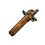

#  鬣蜥．皮克曼

|體質|力量|敏捷|智力|幫派|戰鬥等級|勒索難度|持有天賦|取得天賦|
|:--:|:--:|:--:|:--:|:--:|:--:|:--:|:--:|:--:|
|7|8|4|6|無幫派|中|中|[歹徒](技能.md#歹徒)、[理財](技能.md#理財)|[畫家](技能.md#畫家)|

## 故事

長相可怖的亞種鬣蜥。他在入獄之前曾是個小有名氣的畫家，見到你之後邀請你做他的繪畫模特。但當你了解到他構思的新畫作時，恐懼與厭惡重新涌上心頭，因為他想描繪的正是你死亡時的凄慘景象。

皮克曼的家族十分古老，據他所說曾經是某個古代小王國的貴族後裔。不過在他曾曾祖父那一代因為爆發了瘟疫，所以舉家移民到了這個國家。祖輩在城市的北角區建了一幢洋房，現在算來那房子也該有一百多年的歷史了。

青年時期的皮克曼就在繪畫方面展現出了卓越的天賦，他以家中存放的某些怪異飾品為藍本勾勒出了許多離奇、詭異、迷幻的畫作。雖然這些“風格獨特”的畫作在地下美術圈受到熱議，但卻沒有任何一家正規的畫廊與美術館願意展出它們。主流美術雜誌《瑰麗》對它們的評價則是“死板的臨摹，與拙劣的嘩眾取寵”。

主流美術圈的傲慢刺激到了皮克曼“嘶\~既然他們說我的畫是臨摹，且缺乏生命力，那我就畫點他們想看的。”

一年之後，皮克曼將老屋的地下室改造成了一間私人畫廊，並且開始對外開放。期初並沒有吸引到多少美術圈人士參觀，來的反而都是些追求刺激的小青年。因為在街頭巷尾的傳說中，這家畫廊可比嘉年華裡的鬼屋還要恐怖上不止十倍。其中的一幅名叫《饑餓的午餐》的代表作仿佛描繪了噩夢的景象，幾只扭曲且不定型的污穢怪物正在吸收一個可憐的家伙，殘破的衣物和碎裂的眼鏡混雜著血液散落在地上，如同瀆神的儀式一般混亂又有序。

隨著皮克曼畫廊的名氣與日俱增，一些主流美術圈人事不免也被吸引。某天，《瑰麗》雜誌社的兩名編輯終於無法忍受好奇，化名前來參觀皮克曼的那張《饑餓的午餐》。其中一名年輕的編輯在看了畫後說道：“若不是主編躲債失蹤，今日見到這幅畫作，一定會收回當年對皮克曼的尖酸評價。這畫雖然可怖，但不得不說，那栩栩如生的描繪，宛如不是幻想而是現實。”

正當年輕的編輯期待一旁的前輩也對此畫發表評論時，卻聽見前輩的嘴角擠出一句顫抖的話語：“艾略特，我…認得畫上的那副…眼鏡，是主編常戴的…那一副。你看鏡框上還刻著…他的名字！”

## 結識對話

- *他看起來有點…瘆人，我還是別和他搭話了。*
- **{question1}**
- *糟糕，他的眼神好像往這邊看了…*
- **嘶\~過來，靠近一點…**
- 呃…你說的是我嗎？
- **嘶\~完美！快…`把衣服脫了`！**
- {exclamation1}
- 喂！你這家伙想幹嘛？！
- **嘶\~抱歉，我沒惡意，我看到好的模特就會激動到失態…**
- **嘶\~我叫`皮克曼`，是個畫家，在舊城區還有間小畫廊。**
- **嘶\~如果你了解藝術品的話，可能會知道《饑餓的午餐》，那是我的作品…**
- :point_right:抱歉，我孤陋寡聞了…
- :point_right:我好像在哪聽說過。 `好感+10`
- **嘶\~不過那都是過去的事了，我現在正在尋找新的模特。**
- **嘶\~在見到你之後，我的靈感瞬間又涌出來了\~**
- **嘶\~我已經想象出你`四分五裂躺在血泊中`的美麗構圖了！**
- 四分五裂…？！！
- **嘶\~我繪畫的主題就是展現死亡過程中的…美感！**
- *…這家伙果然不正常！*
- {sweat1}

## 深入了解對話

- **嘶\~還記得做我模特的事嗎？**
  - 別再提那茬了！
  - 我勸你打消這個念頭。
- **嘶\~冷靜，先聽我把話說完…**
- **嘶\~我想到了新的題材，沒之前那麼“激烈”的題材。**
- **我把它稱作《殘缺的盛宴》！**
  - 聽上去還是夠變態…
  - 你又要對我做什麼？
- **嘶\~我想描繪細致入微的`痛苦`投射在臉上的表情…**

#### 我現在就很`痛苦`…

> 這家伙拿出素描本畫了起來，邊畫還邊說起他古怪的靈感來源。

- 你難道看不出來嗎…？
- **嘶\~好\~很好\~就是這個表情！我得把它記錄下來…**
- *我真想馬上逃開…*
- 你究竟把那個主編怎麼了？！
- 那副《饑餓的午餐》裡的怪物究竟是幻想還是…？
- **那個主編能和名垂青史的藝術品融為一體，那是他的榮幸。**
- **嘶\~至於怪物嘛…等你正式成為`我的模特`後，就能知道了。**
- {pain1}
- *我寧願永遠都別知道…*

#### 取消

- …痛苦的表情？
- **嘶\~沒錯，那種`缺失健康`而導致的痛苦！**
- **嘶\~若能在你臉上浮現的話，那就太美了！**
- **嘶\~快，快去找到“它”吧…我的模特！**
- {sweat1}

## 特殊對話

### 打招呼（關係極好）

- **嘶\~想做我的模特了嗎？**

### 打招呼（關係好）

- **嘶\~真是一件藝術品…**

### 打招呼（關係一般）

- **嘶\~嘶\~嘶\~**

### 打招呼（關係差）

- **嘶\~咱們可以和平共處。**

### 打招呼（關係極差）

- **嘶\~我聞到了血的味道…**

### 進行毆打

- **嘶\~我會溫柔的把你撕碎的…**
- **嘶\~嘶\~又能聞到血腥味了\~**
- **嘶\~我即將創作一幅新的藝術品，就用你的臉\~嘶\~**

### 回禮

- **嘶\~嘶\~我也該給你一份回禮…對嗎？**

### 勒索成功

- **嘶\~你想要錢？我可以給你…但我會用別的方式討回來的，就在某一天。**

### 勒索失敗

- **嘶\~你輸了\~你徹底輸了\~嘶\~**

### 一起吃飯被拒

- **嘶\~嘶\~嘶\~別坐下，這是我的警告。**

### 分享食物

- **嘶\~那我就不拒絕了\~嘶\~**

### 加藥被發現

- **嘶\~你的東西我可看見了\~**

### 加藥辯解失敗

- **嘶\~我可明白你說的“調料”是什麼…**

## 聊天

- **嘶\~你來了\~我的模特。**
- 忘了那件事吧！我來就是警告你的。
- **嘶\~真正的藝術都需要伴隨一點犧牲，你能參與其中應該感到榮幸。**
- 那你自己怎麼不去試試看呢？瘋子！
- **嘶\~我的第一幅自畫像就叫做《扯斷的尾巴》…**
- ……

## 初始物品

||||||
|:--:|:--:|:--:|:--:|:--:|
||||||
|[紅頭巾](23-紅頭巾.md)|[橡膠手套](25-橡膠手套.md)|[釘棒](162-釘棒.md)|[釘錘](151-釘錘.md)|[蘑菇](42-蘑菇.md)*4|
||||||
|[顏料](122-顏料.md)*3|[胡亂的塗鴉](128-胡亂的塗鴉.md)|[精美的畫作](130-精美的畫作.md)*2|[發霉的麵包](200-發霉的麵包.md)*2||

## 送禮

|圖片|物品名稱|好感|回應|
|:--:|--|:--:|--|
||[DEMO限定紙鶴](209-DEMO限定紙鶴.md)|50|嘶\~很好，我的故事會給你“驚喜”的…|
||[牙齒項鏈](30-牙齒項鏈.md)|24|嘶\~破碎與殘暴之美…|
||[《死靈之書》](31-《死靈之書》.md)|24|Yacaqu! Shub'th!|
||[釘錘](151-釘錘.md)|24|嘶\~內在之美往往需要外力去揭示。|
||[水果刀](158-水果刀.md)|20|嘶\~鮮血才是最美的顏料…|
||[金龜子](202-金龜子.md)|20|嘶\~美妙的金色！|
||[扳手](142-扳手.md)|18|嘶\~破壞總能給我啟發\~|
||[運動鞋](14-運動鞋.md)|12|嘶\~有趣的禮物\~|
||[棒球帽](21-棒球帽.md)|12|嘶\~有趣的禮物\~|
||[紅頭巾](23-紅頭巾.md)|12|嘶\~充滿哲學美感的顏色\~|
||[黑手](26-黑手.md)|12|嘶\~畫家需要愛惜自己的雙手\~或是雙爪。|
||[手錶](27-手錶.md)|12|嘶\~有趣的禮物\~|
||[隨身聽（開機）](34-隨身聽（開機）.md)|12|嘶\~有趣的禮物\~|
||[隨身聽（關機）](35-隨身聽（關機）.md)|12|嘶\~有趣的禮物\~|
||[隨身聽（沒電）](36-隨身聽（沒電）.md)|12|嘶\~有趣的禮物\~|
||[興奮劑](50-興奮劑.md)|12|嘶\~這能給我帶來無窮的靈感\~|
||[酒精燈](52-酒精燈.md)|12|嘶\~這東西是我需要的。|
||[剪刀](152-剪刀.md)|12|嘶\~為了藝術總得有人做出犧牲\~|
||[釘棒(+)](163-釘棒(+).md)|12|嘶\~破壞總能給我啟發\~|
||[皮鞋](15-皮鞋.md)|10|嘶\~有趣的禮物\~|
||[墨鏡](18-墨鏡.md)|10|嘶\~有趣的禮物\~|
||[眼鏡](19-眼鏡.md)|10|嘶\~有趣的禮物\~|
||[頭帶](20-頭帶.md)|10|嘶\~有趣的禮物\~|
||[酒葫蘆](37-酒葫蘆.md)|10|嘶\~有趣的禮物\~|
||[雙節棍(+)](161-雙節棍(+).md)|10|嘶\~有趣的禮物\~|
||[橡膠手套](25-橡膠手套.md)|9|嘶\~畫家需要愛惜自己的雙手\~或是雙爪。|
||[瀉藥](44-瀉藥.md)|9|嘶\~這東西是我需要的。|
||[玻璃匕首(+)](155-玻璃匕首(+).md)|9|嘶\~為了藝術總得有人做出犧牲\~|
||[牙刷匕首(+)](157-牙刷匕首(+).md)|9|嘶\~為了藝術總得有人做出犧牲\~|
||[釘棒](162-釘棒.md)|9|嘶\~破壞總能給我啟發\~|
||[鐵管](164-鐵管.md)|9|嘶\~破壞總能給我啟發\~|
||[帆布鞋](16-帆布鞋.md)|8|嘶\~有趣的禮物\~|
||[拖鞋](17-拖鞋.md)|8|嘶\~有趣的禮物\~|
||[毛線帽](22-毛線帽.md)|8|嘶\~有趣的禮物\~|
||[綠頭巾](24-綠頭巾.md)|8|嘶\~有趣的禮物\~|
||[自製口罩](32-自製口罩.md)|8|嘶\~有趣的禮物\~|
||[蘑菇](42-蘑菇.md)|8|嘶\~這能給我帶來無窮的靈感\~|
||[精釀蘋果酒](56-精釀蘋果酒.md)|8|嘶\~有趣的禮物\~|
||[咖啡磨](109-咖啡磨.md)|8|嘶\~有趣的禮物\~|
||[胡亂的塗鴉](128-胡亂的塗鴉.md)|8|嘶\~混沌！無序！真正的藝術品\~|
||[精美的畫作](130-精美的畫作.md)|8|嘶\~有趣的禮物\~|
||[圓珠筆](133-圓珠筆.md)|8|嘶\~有趣的禮物\~|
||[圓珠筆](134-圓珠筆.md)|8|嘶\~有趣的禮物\~|
||[雙節棍](160-雙節棍.md)|8|嘶\~有趣的禮物\~|
||[皮帶](166-皮帶.md)|8|嘶\~有趣的禮物\~|
||[皮帶](167-皮帶.md)|8|嘶\~有趣的禮物\~|
||[發霉的麵包](200-發霉的麵包.md)|8|嘶\~一頓歡愉的盛宴\~|
||[薄荷葉卷](41-薄荷葉卷.md)|6|嘶\~有趣的禮物\~|
||[蘑菇粉](43-蘑菇粉.md)|6|嘶\~這東西是我需要的。|
||[醫用酒精](51-醫用酒精.md)|6|嘶\~這東西是我需要的。|
||[啤酒](54-啤酒.md)|6|嘶\~有趣的禮物\~|
||[蘋果酒](55-蘋果酒.md)|6|嘶\~有趣的禮物\~|
||[酸奶](74-酸奶.md)|6|嘶\~我聞到了可口的酸味…|
||[蛋白粉](79-蛋白粉.md)|6|嘶\~有趣的禮物\~|
||[紙鶴](126-紙鶴.md)|6|嘶\~有趣的禮物\~|
||[簡單的漫畫](129-簡單的漫畫.md)|6|嘶\~有趣的禮物\~|
||[長螺絲](136-長螺絲.md)|6|嘶\~有趣的禮物\~|
||[玻璃匕首](154-玻璃匕首.md)|6|嘶\~為了藝術總得有人做出犧牲\~|
||[牙刷匕首](156-牙刷匕首.md)|6|嘶\~為了藝術總得有人做出犧牲\~|
||[黑桃A](39-黑桃A.md)|4|嘶\~有趣的禮物\~|
||[薄荷葉](40-薄荷葉.md)|4|嘶\~有趣的禮物\~|
||[安眠藥](47-安眠藥.md)|4|嘶\~有趣的禮物\~|
||[一把咖啡豆](69-一把咖啡豆.md)|4|嘶\~有趣的禮物\~|
||[焦糖棒](72-焦糖棒.md)|4|嘶\~有趣的禮物\~|
||[汽水](73-汽水.md)|4|嘶\~有趣的禮物\~|
||[咖啡粉](76-咖啡粉.md)|4|嘶\~有趣的禮物\~|
||[茶包](77-茶包.md)|4|嘶\~有趣的禮物\~|
||[鉛筆](131-鉛筆.md)|4|嘶\~有趣的禮物\~|
||[鉛筆](132-鉛筆.md)|4|嘶\~有趣的禮物\~|
||[硬幣](135-硬幣.md)|4|嘶\~有趣的禮物\~|
||[湯匙](143-湯匙.md)|4|嘶\~有趣的禮物\~|
||[湯匙](144-湯匙.md)|4|嘶\~有趣的禮物\~|
||[顏料](122-顏料.md)|3|嘶\~這東西是我需要的。|
||[火柴](120-火柴.md)|2|嘶\~有趣的禮物\~|
||[釘子](123-釘子.md)|2|嘶\~有趣的禮物\~|
||[白紙](125-白紙.md)|2|嘶\~有趣的禮物\~|
||[碎玻璃](153-碎玻璃.md)|2|嘶\~有趣的禮物\~|
||[折斷的木條](159-折斷的木條.md)|2|嘶\~有趣的禮物\~|
||[曲奇餅乾](71-曲奇餅乾.md)|-2|嘶\~新鮮的食物可不合我的胃口。|
||[布條](84-布條.md)|-2|嘶\~我對這個不感興趣。|
||[迴紋針](86-迴紋針.md)|-2|嘶\~我對這個不感興趣。|
||[電池](114-電池.md)|-2|嘶\~我對這個不感興趣。|
||[空的牙膏管](117-空的牙膏管.md)|-2|嘶\~我對這個不感興趣。|
||[消毒液](118-消毒液.md)|-2|嘶\~我對這個不感興趣。|
||[除銹劑](119-除銹劑.md)|-2|嘶\~我對這個不感興趣。|
||[膠帶](121-膠帶.md)|-2|嘶\~我對這個不感興趣。|
||[鞋帶](124-鞋帶.md)|-2|嘶\~我對這個不感興趣。|
||[紫鳶花](45-紫鳶花.md)|-4|嘶\~花？多麼庸俗又無趣的主題。|
||[花瓣粉](46-花瓣粉.md)|-4|嘶\~我對這個不感興趣。|
||[止疼片](49-止疼片.md)|-4|嘶\~痛苦可是天賜的禮物，我可不想失去它。|
||[蘋果](64-蘋果.md)|-4|嘶\~如果這是一顆爛蘋果就好了\~|
||[開鎖器](87-開鎖器.md)|-4|嘶\~我對這個不感興趣。|
||[開鎖器(P)](38-開鎖器(P).md)|-4|嘶\~我對這個不感興趣。|
||[肥皂](88-肥皂.md)|-4|嘶\~我對這個不感興趣。|
||[《花花世界》（翻爛）](104-《花花世界》（翻爛）.md)|-4|嘶\~我對這個不感興趣。|
||[鎮靜劑](53-鎮靜劑.md)|-6|嘶\~它會扼殺掉我美妙的\~靈感。|
||[華夫餅](67-華夫餅.md)|-6|嘶\~新鮮的食物可不合我的胃口。|
||[超辣泡麵](78-超辣泡麵.md)|-6|嘶\~新鮮的食物可不合我的胃口。|
||[《花花世界》（看過）](103-《花花世界》（看過）.md)|-6|嘶\~我對這個不感興趣。|
||[奶油華夫餅](68-奶油華夫餅.md)|-8|嘶\~新鮮的食物可不合我的胃口。|
||[土豆披薩](75-土豆披薩.md)|-8|嘶\~新鮮的食物可不合我的胃口。|
||[香皂](89-香皂.md)|-8|嘶\~我對這個不感興趣。|
||[計算機](101-計算機.md)|-8|嘶\~我對這個不感興趣。|
||[《花花世界》（全新）](102-《花花世界》（全新）.md)|-8|嘶\~我對這個不感興趣。|
||[花束](127-花束.md)|-8|嘶\~花？多麼庸俗又無趣的主題。|
||[馬女郎海報](105-馬女郎海報.md)|-12|嘶\~我對這個不感興趣。|
||[貓女郎海報](106-貓女郎海報.md)|-12|嘶\~我對這個不感興趣。|
||[狐女郎海報](107-狐女郎海報.md)|-12|嘶\~我對這個不感興趣。|
||[兔女郎海報](108-兔女郎海報.md)|-12|嘶\~我對這個不感興趣。|
||[掌上遊戲機](110-掌上遊戲機.md)|-12|嘶\~我對這個不感興趣。|
||[掌上遊戲機（沒電）](111-掌上遊戲機（沒電）.md)|-12|嘶\~我對這個不感興趣。|
||[口香糖](70-口香糖.md)|-20|嘶\~嘴裡的細菌可是我的珍寶，這東西會毀了它們。|
||[牙刷](115-牙刷.md)|-40|嘶\~嘴裡的細菌可是我的珍寶，這東西會毀了它們。|
||[牙膏](116-牙膏.md)|-40|嘶\~嘴裡的細菌可是我的珍寶，這東西會毀了它們。|
||[《森之音》](203-《森之音》.md)|-80|嘶\~監獄只能囚禁我的身體，而它卻會鎖住我的靈魂！|
||[護身符](29-護身符.md)|-100|嘶\~監獄只能囚禁我的身體，而它卻會鎖住我的靈魂！|

