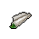

##  鬣蜥．皮克曼

|體質|力量|敏捷|智力|幫派|
|:--:|:--:|:--:|:--:|:--:|
|7|8|4|6|無幫派|

### 故事

長相可怖的亞種鬣蜥。他在入獄之前曾是個小有名氣的畫家，見到你之後邀請你做他的繪畫模特。但當你了解到他構思的新畫作時，恐懼與厭惡重新涌上心頭，因為他想描繪的正是你死亡時的凄慘景象。

皮克曼的家族十分古老，據他所說曾經是某個古代小王國的貴族後裔。不過在他曾曾祖父那一代因為爆發了瘟疫，所以舉家移民到了這個國家。祖輩在城市的北角區建了一幢洋房，現在算來那房子也該有一百多年的歷史了。

青年時期的皮克曼就在繪畫方面展現出了卓越的天賦，他以家中存放的某些怪異飾品為藍本勾勒出了許多離奇、詭異、迷幻的畫作。雖然這些“風格獨特”的畫作在地下美術圈受到熱議，但卻沒有任何一家正規的畫廊與美術館愿意展出它們。主流美術雜志《瑰麗》對它們的評價則是“死板的臨摹，與拙劣的嘩眾取寵”。

主流美術圈的傲慢刺激到了皮克曼“嘶\~既然他們說我的畫是臨摹，且缺乏生命力，那我就畫點他們想看的。”

一年之後，皮克曼將老屋的地下室改造成了一間私人畫廊，并且開始對外開放。期初并沒有吸引到多少美術圈人士參觀，來的反而都是些追求刺激的小青年。因為在街頭巷尾的傳說中，這家畫廊可比嘉年華里的鬼屋還要恐怖上不止十倍。其中的一幅名叫《饑餓的午餐》的代表作仿佛描繪了噩夢的景象，幾只扭曲且不定型的污穢怪物正在吸收一個可憐的家伙，殘破的衣物和碎裂的眼鏡混雜著血液散落在地上，如同瀆神的儀式一般混亂又有序。

隨著皮克曼畫廊的名氣與日俱增，一些主流美術圈人事不免也被吸引。某天，《瑰麗》雜志社的兩名編輯終於無法忍受好奇，化名前來參觀皮克曼的那張《饑餓的午餐》。其中一名年輕的編輯在看了畫後說道：“若不是主編躲債失蹤，今日見到這幅畫作，一定會收回當年對皮克曼的尖酸評價。這畫雖然可怖，但不得不說，那栩栩如生的描繪，宛如不是幻想而是現實。”

正當年輕的編輯期待一旁的前輩也對此畫發表評論時，卻聽見前輩的嘴角擠出一句顫抖的話語：“艾略特，我…認得畫上的那副…眼鏡，是主編常戴的…那一副。你看鏡框上還刻著…他的名字！”

### 結識對話

- *他看起來有點…瘆人，我還是別和他搭話了。*
- **{question1}**
- *糟糕，他的眼神好像往這邊看了…*
- **嘶\~過來，靠近一點…**
- 呃…你說的是我嗎？
- **嘶\~完美！快…`把衣服脫了`！**
- {exclamation1}
- 喂！你這家伙想干嘛？！
- **嘶\~抱歉，我沒惡意，我看到好的模特就會激動到失態…**
- **嘶\~我叫`皮克曼`，是個畫家，在舊城區還有間小畫廊。**
- **嘶\~如果你了解藝術品的話，可能會知道《饑餓的午餐》，那是我的作品…**
  - 抱歉，我孤陋寡聞了…
  - 我好像在哪聽說過。 `好感+10`
- **嘶\~不過那都是過去的事了，我現在正在尋找新的模特。**
- **嘶\~在見到你之後，我的靈感瞬間又涌出來了\~**
- **嘶\~我已經想象出你`四分五裂躺在血泊中`的美麗構圖了！**
- 四分五裂…？！！
- **嘶\~我繪畫的主題就是展現死亡過程中的…美感！**
- *…這家伙果然不正常！*
- {sweat1}

### 深入了解對話

- **嘶\~還記得做我模特的事嗎？**
  - 別再提那茬了！
  - 我勸你打消這個念頭。
- **嘶\~冷靜，先聽我把話說完…**
- **嘶\~我想到了新的題材，沒之前那麼“激烈”的題材。**
- **我把它稱作《殘缺的盛宴》！**
  - 聽上去還是夠變態…
  - 你又要對我做什麼？
- **嘶\~我想描繪細致入微的`痛苦`投射在臉上的表情…**

#### 我現在就很`痛苦`…

> 這家伙拿出素描本畫了起來，邊畫還邊說起他古怪的靈感來源。

- 你難道看不出來嗎…？
- **嘶\~好\~很好\~就是這個表情！我得把它記錄下來…**
- *我真想馬上逃開…*
- 你究竟把那個主編怎麼了？！
- 那副《饑餓的午餐》里的怪物究竟是幻想還是…？
- **那個主編能和名垂青史的藝術品融為一體，那是他的榮幸。**
- **嘶\~至於怪物嘛…等你正式成為`我的模特`後，就能知道了。**
- {pain1}
- *我寧愿永遠都別知道…*

#### 取消

- …痛苦的表情？
- **嘶\~沒錯，那種`缺失健康`而導致的痛苦！**
- **嘶\~若能在你臉上浮現的話，那就太美了！**
- **嘶\~快，快去找到“它”吧…我的模特！**
- {sweat1}
### 初始物品

|物品名稱|物品名稱|物品名稱|物品名稱|物品名稱|
|:--:|:--:|:--:|:--:|:--:|
|  |  |  |  |  |
| [紅頭巾](道具.md#紅頭巾) | [橡膠手套](道具.md#橡膠手套) | [釘棒](道具.md#釘棒) | [釘錘](道具.md#釘錘) | [蘑菇](道具.md#蘑菇)*4 |
|  |  |  |  |  |
| [顏料](道具.md#顏料)*3 | [胡亂的涂鴉](道具.md#胡亂的涂鴉) | [精美的畫作](道具.md#精美的畫作)*2 | [發霉的麵包](道具.md#發霉的麵包)*2 |  |
### 送禮

|圖片|物品名稱|好感|回應|
|:--:|--|:--:|--|
||[運動鞋](道具.md#運動鞋)|0|嘶\~有趣的禮物\~|
||[皮鞋](道具.md#皮鞋)|0|嘶\~有趣的禮物\~|
||[帆布鞋](道具.md#帆布鞋)|0|嘶\~有趣的禮物\~|
||[拖鞋](道具.md#拖鞋)|0|嘶\~有趣的禮物\~|
||[墨鏡](道具.md#墨鏡)|0|嘶\~有趣的禮物\~|
||[眼鏡](道具.md#眼鏡)|0|嘶\~有趣的禮物\~|
||[頭帶](道具.md#頭帶)|0|嘶\~有趣的禮物\~|
||[棒球帽](道具.md#棒球帽)|0|嘶\~有趣的禮物\~|
||[毛線帽](道具.md#毛線帽)|0|嘶\~有趣的禮物\~|
||[紅頭巾](道具.md#紅頭巾)|8|嘶\~充滿哲學美感的顏色\~|
||[綠頭巾](道具.md#綠頭巾)|0|嘶\~有趣的禮物\~|
||[橡膠手套](道具.md#橡膠手套)|6|嘶\~畫家需要愛惜自己的雙手\~或是雙爪。|
||[黑手](道具.md#黑手)|8|嘶\~畫家需要愛惜自己的雙手\~或是雙爪。|
||[手錶](道具.md#手錶)|0|嘶\~有趣的禮物\~|
||[護身符](道具.md#護身符)|-20|嘶\~監獄只能囚禁我的身體，而它卻會鎖住我的靈魂！|
||[牙齒項鏈](道具.md#牙齒項鏈)|24|嘶\~破碎與殘暴之美…|
||[《死靈之書》](道具.md#《死靈之書》)|24|Yacaqu! Shub'th!|
||[自制口罩](道具.md#自制口罩)|0|嘶\~有趣的禮物\~|
||[隨身聽（開機）](道具.md#隨身聽（開機）)|0|嘶\~有趣的禮物\~|
||[隨身聽（關機）](道具.md#隨身聽（關機）)|0|嘶\~有趣的禮物\~|
||[隨身聽（沒電）](道具.md#隨身聽（沒電）)|0|嘶\~有趣的禮物\~|
||[酒葫蘆](道具.md#酒葫蘆)|0|嘶\~有趣的禮物\~|
||[黑桃A](道具.md#黑桃A)|0|嘶\~有趣的禮物\~|
||[薄荷葉](道具.md#薄荷葉)|0|嘶\~有趣的禮物\~|
||[薄荷葉卷](道具.md#薄荷葉卷)|0|嘶\~有趣的禮物\~|
||[蘑菇](道具.md#蘑菇)|8|嘶\~這能給我帶來無窮的靈感\~|
||[蘑菇粉](道具.md#蘑菇粉)|4|嘶\~這東西是我需要的。|
||[瀉藥](道具.md#瀉藥)|6|嘶\~這東西是我需要的。|
||[紫鳶花](道具.md#紫鳶花)|-4|嘶\~花？多麼庸俗又無趣的主題。|
||[花瓣粉](道具.md#花瓣粉)|-4|嘶\~我對這個不感興趣。|
||[安眠藥](道具.md#安眠藥)|0|嘶\~有趣的禮物\~|
||[止疼片](道具.md#止疼片)|-4|嘶\~痛苦可是天賜的禮物，我可不想失去它。|
||[興奮劑](道具.md#興奮劑)|12|嘶\~這能給我帶來無窮的靈感\~|
||[醫用酒精](道具.md#醫用酒精)|4|嘶\~這東西是我需要的。|
||[酒精燈](道具.md#酒精燈)|8|嘶\~這東西是我需要的。|
||[鎮靜劑](道具.md#鎮靜劑)|-6|嘶\~它會扼殺掉我美妙的\~靈感。|
||[啤酒](道具.md#啤酒)|0|嘶\~有趣的禮物\~|
||[蘋果酒](道具.md#蘋果酒)|0|嘶\~有趣的禮物\~|
||[精釀蘋果酒](道具.md#精釀蘋果酒)|0|嘶\~有趣的禮物\~|
||[蘋果](道具.md#蘋果)|-4|嘶\~如果這是一顆爛蘋果就好了\~|
||[華夫餅](道具.md#華夫餅)|-6|嘶\~新鮮的食物可不合我的胃口。|
||[奶油華夫餅](道具.md#奶油華夫餅)|-8|嘶\~新鮮的食物可不合我的胃口。|
||[一把咖啡豆](道具.md#一把咖啡豆)|0|嘶\~有趣的禮物\~|
||[口香糖](道具.md#口香糖)|-4|嘶\~嘴里的細菌可是我的珍寶，這東西會毀了它們。|
||[曲奇餅乾](道具.md#曲奇餅乾)|-2|嘶\~新鮮的食物可不合我的胃口。|
||[焦糖棒](道具.md#焦糖棒)|0|嘶\~有趣的禮物\~|
||[汽水](道具.md#汽水)|0|嘶\~有趣的禮物\~|
||[酸奶](道具.md#酸奶)|4|嘶\~我聞到了可口的酸味…|
||[土豆披薩](道具.md#土豆披薩)|-8|嘶\~新鮮的食物可不合我的胃口。|
||[咖啡粉](道具.md#咖啡粉)|0|嘶\~有趣的禮物\~|
||[茶包](道具.md#茶包)|0|嘶\~有趣的禮物\~|
||[超辣泡麵](道具.md#超辣泡麵)|-6|嘶\~新鮮的食物可不合我的胃口。|
||[蛋白粉](道具.md#蛋白粉)|0|嘶\~有趣的禮物\~|
||[布條](道具.md#布條)|-2|嘶\~我對這個不感興趣。|
||[迴紋針](道具.md#迴紋針)|-2|嘶\~我對這個不感興趣。|
||[開鎖器](道具.md#開鎖器)|-4|嘶\~我對這個不感興趣。|
||[開鎖器(P)](道具.md#開鎖器(P))|-4|嘶\~我對這個不感興趣。|
||[肥皂](道具.md#肥皂)|-4|嘶\~我對這個不感興趣。|
||[香皂](道具.md#香皂)|-8|嘶\~我對這個不感興趣。|
||[計算機](道具.md#計算機)|-8|嘶\~我對這個不感興趣。|
||[《花花世界》（全新）](道具.md#《花花世界》（全新）)|-8|嘶\~我對這個不感興趣。|
||[《花花世界》（看過）](道具.md#《花花世界》（看過）)|-6|嘶\~我對這個不感興趣。|
||[《花花世界》（翻爛）](道具.md#《花花世界》（翻爛）)|-4|嘶\~我對這個不感興趣。|
||[馬女郎海報](道具.md#馬女郎海報)|-12|嘶\~我對這個不感興趣。|
||[貓女郎海報](道具.md#貓女郎海報)|-12|嘶\~我對這個不感興趣。|
||[狐女郎海報](道具.md#狐女郎海報)|-12|嘶\~我對這個不感興趣。|
||[兔女郎海報](道具.md#兔女郎海報)|-12|嘶\~我對這個不感興趣。|
||[咖啡磨](道具.md#咖啡磨)|0|嘶\~有趣的禮物\~|
||[掌上遊戲機](道具.md#掌上遊戲機)|-12|嘶\~我對這個不感興趣。|
||[掌上遊戲機（沒電）](道具.md#掌上遊戲機（沒電）)|-12|嘶\~我對這個不感興趣。|
||[電池](道具.md#電池)|-2|嘶\~我對這個不感興趣。|
||[牙刷](道具.md#牙刷)|-8|嘶\~嘴里的細菌可是我的珍寶，這東西會毀了它們。|
||[牙膏](道具.md#牙膏)|-8|嘶\~嘴里的細菌可是我的珍寶，這東西會毀了它們。|
||[空的牙膏管](道具.md#空的牙膏管)|-2|嘶\~我對這個不感興趣。|
||[消毒液](道具.md#消毒液)|-2|嘶\~我對這個不感興趣。|
||[除銹劑](道具.md#除銹劑)|-2|嘶\~我對這個不感興趣。|
||[火柴](道具.md#火柴)|0|嘶\~有趣的禮物\~|
||[膠帶](道具.md#膠帶)|-2|嘶\~我對這個不感興趣。|
||[顏料](道具.md#顏料)|2|嘶\~這東西是我需要的。|
||[釘子](道具.md#釘子)|0|嘶\~有趣的禮物\~|
||[鞋帶](道具.md#鞋帶)|-2|嘶\~我對這個不感興趣。|
||[白紙](道具.md#白紙)|0|嘶\~有趣的禮物\~|
||[紙鶴](道具.md#紙鶴)|0|嘶\~有趣的禮物\~|
||[花束](道具.md#花束)|-8|嘶\~花？多麼庸俗又無趣的主題。|
||[胡亂的涂鴉](道具.md#胡亂的涂鴉)|8|嘶\~混沌！無序！真正的藝術品\~|
||[簡單的漫畫](道具.md#簡單的漫畫)|0|嘶\~有趣的禮物\~|
||[精美的畫作](道具.md#精美的畫作)|0|嘶\~有趣的禮物\~|
||[鉛筆](道具.md#鉛筆)|0|嘶\~有趣的禮物\~|
||[鉛筆](道具.md#鉛筆)|0|嘶\~有趣的禮物\~|
||[圓珠筆](道具.md#圓珠筆)|0|嘶\~有趣的禮物\~|
||[圓珠筆](道具.md#圓珠筆)|0|嘶\~有趣的禮物\~|
||[硬幣](道具.md#硬幣)|0|嘶\~有趣的禮物\~|
||[長螺絲](道具.md#長螺絲)|0|嘶\~有趣的禮物\~|
||[扳手](道具.md#扳手)|12|嘶\~破壞總能給我啟發\~|
||[湯匙](道具.md#湯匙)|0|嘶\~有趣的禮物\~|
||[湯匙](道具.md#湯匙)|0|嘶\~有趣的禮物\~|
||[釘錘](道具.md#釘錘)|24|嘶\~內在之美往往需要外力去揭示。|
||[剪刀](道具.md#剪刀)|8|嘶\~為了藝術總得有人做出犧牲\~|
||[碎玻璃](道具.md#碎玻璃)|0|嘶\~有趣的禮物\~|
||[玻璃匕首](道具.md#玻璃匕首)|4|嘶\~為了藝術總得有人做出犧牲\~|
||[玻璃匕首(+)](道具.md#玻璃匕首(+))|6|嘶\~為了藝術總得有人做出犧牲\~|
||[牙刷匕首](道具.md#牙刷匕首)|4|嘶\~為了藝術總得有人做出犧牲\~|
||[牙刷匕首(+)](道具.md#牙刷匕首(+))|6|嘶\~為了藝術總得有人做出犧牲\~|
||[水果刀](道具.md#水果刀)|20|嘶\~鮮血才是最美的顏料…|
||[折斷的木條](道具.md#折斷的木條)|0|嘶\~有趣的禮物\~|
||[雙節棍](道具.md#雙節棍)|0|嘶\~有趣的禮物\~|
||[雙節棍(+)](道具.md#雙節棍(+))|0|嘶\~有趣的禮物\~|
||[釘棒](道具.md#釘棒)|6|嘶\~破壞總能給我啟發\~|
||[釘棒(+)](道具.md#釘棒(+))|8|嘶\~破壞總能給我啟發\~|
||[鐵管](道具.md#鐵管)|6|嘶\~破壞總能給我啟發\~|
||[皮帶](道具.md#皮帶)|0|嘶\~有趣的禮物\~|
||[皮帶](道具.md#皮帶)|0|嘶\~有趣的禮物\~|
||[發霉的麵包](道具.md#發霉的麵包)|8|嘶\~一頓歡愉的盛宴\~|
||[金龜子](道具.md#金龜子)|20|嘶\~美妙的金色！|
||[《森之音》](道具.md#《森之音》)|-16|嘶\~監獄只能囚禁我的身體，而它卻會鎖住我的靈魂！|
||[DEMO限定紙鶴](道具.md#DEMO限定紙鶴)|50|嘶\~很好，我的故事會給你“驚喜”的…|

