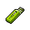
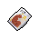
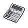

#  鱷魚．克蘭奇

|體質|力量|敏捷|智力|幫派|戰鬥等級|勒索難度|持有天賦|取得天賦|
|:--:|:--:|:--:|:--:|:--:|:--:|:--:|:--:|:--:|
|10|9|6|6|尖牙幫幹部|強|難|[歹徒](技能.md#歹徒)、[強健](技能.md#強健)|[煞星](技能.md#煞星)|

## 故事

一只外表兇惡，性格乖張的鱷魚。他蔑視的將你稱為弱者，並囂張的發起了挑釁。或許在這監獄的高牆內，只有打斗才能排解他的無聊。那麼，究竟是忍氣吞聲，還是找機會還以顏色？你的心裡需要準備一個答案。

克蘭奇著實有著一個悲慘的童年。他的母親是個妓女，所以他根本就不知道自己的父親是誰。繼父利用母親辛苦賺來的錢為自己還賭債，並且喝了酒後就會把小克蘭奇拖進小黑屋毒打。這樣的生活克蘭奇忍受了十年。在他十二歲的時候，他一口咬斷了繼父的脖子，結束了他的童年故事。

在少管所待了幾年的克蘭奇終於被放了出來，他回家找他的母親，但是她已經了無音訊。感覺被命運所拋棄的克蘭奇失去了生活的目標，他流落街頭，靠著社區的救助艱難度日。直到有一天，他遇見了邦妮…

她也是一只鱷魚，但和克蘭奇不同，她不是那種體型巨大的灣鱷，而體型嬌小的短吻鱷。邦妮的童年不比克蘭奇輕鬆許多，但她總能保持微笑和樂觀。她告訴克蘭奇，既然命運拋棄了他們，那就該好好的教訓命運一頓。

第一次搶劫發生在一家小餐廳，克蘭奇緊張的說不出話來，還好有邦妮在。她跳上桌子，大聲喊道“親愛的觀眾們，現在是搶劫時間！誰要是不乖，我的大朋友就會咬掉誰的腦袋喲。”克蘭奇看著桌上的邦妮，嘴角露出了久違多年的笑容。哦\~她是那麼暴力，而又那麼美麗。很快“雌雄雙鱷”席卷了西部的各大城市，酒店、超市、加油站，無一例外都成了他們搶劫的目標。在媒體看來，搶匪有時並不是為了錢，而僅僅是為了尋開心。

胃口越來越大的邦妮已經無法從小打小鬧的搶劫中找到快感了，她向克蘭奇提議去搶銀行：“親愛的，這一定很好玩！”深愛邦妮的克蘭奇當然不會拒絕她的要求。於是在一個燥熱的午後，他們荷槍實彈的闖進了一家城郊的小銀行。但令克蘭奇詫異的是銀行裡並沒有顧客，甚至連銀行職員也不見蹤影。原來他們的行蹤早已被聯邦探員所掌握，隨著警笛聲的響起，遊戲已經宣告結束。

邦妮看到這一幕後放聲大笑，仿佛她才是最後的贏家。她伴隨著笑聲沖出了銀行，克蘭奇也跟著追了出去。“砰\~砰\~！”兩聲聲槍響，克蘭奇倒下了…

雖然頭部中了一槍，但克蘭奇卻奇跡般的活了下來。當他醒來後焦急的詢問邦妮的生死，但警察們全都和他裝聾作啞。他們聲稱從來沒見過什麼姑娘，“鱷魚大盜”向來都只有他一個！這真是個可笑的謊言，克蘭奇才不會相信這幫條子的鬼話，他們一定是抓住了邦妮，秘密把她關了起來。“一定是這樣，一定是…”他默默告訴自己。

## 結識對話

- **（嗅\~嗅）你聞到沒有？周圍有股氣味…**
- 氣味…什麼氣味？
- **當然是從你身上散發出來的，“弱者”的氣味了\~哈哈哈！**
- *……*
- *真是個囂張的家伙…*
- **小子\~是不是有點不服氣？**
- **嘿\~要想證明我的話是錯的，很簡單…只要打贏我就行。**
- **我在這裡閒的發慌，隨時都有空接受你的“挑戰”。**
- **不過，如果你沒這個膽量，那就老實待著好了。**
- **畢竟被我`鱷魚·克蘭奇`嚇跑，也不丟人\~哈哈哈！**
- **{happy1}**
- :point_right:我可不會被你嚇到。 `好感+5`
- :point_right:激將法對我可沒用…

## 深入了解對話

- 喂\~我又來了。

#### 你上次`被我揍得可不輕`。

> 他告訴了你誰是邦妮，以及他和邦妮之間的故事。

- 這下咱們兩誰才是弱者呢？
- **哦？哈哈哈\~只是僥幸贏了一次就這麼囂張了嗎？**
- **你這家伙的性格，說不定邦妮會喜歡哦\~**
- 邦妮…？
- *聽了這些，我都不知該說什麼好了…*
- 喂\~你有沒有想過…？
- **沒有！絕不可能！**
- **那幫條子都是在騙我，我可不會上當。**
- **邦妮一定正在世界的某個角落開懷大笑！**
- **我仿佛在這裡都能聽到她的笑聲…**

#### 取消

- **哦？怪不得那股弱者的味道又飄來了…**
- **怎麼樣？要不要向我挑戰？**
- **我可是早就等的不耐煩了\~**

## 特殊對話

### 打招呼（關係極好）

- **哈\~來的正好，我正閒的蛋疼呢。**

### 打招呼（關係好）

- **你是來幫我解悶的嗎？**

### 打招呼（關係一般）

- **弱者的氣味…**

### 打招呼（關係差）

- **（嗅\~嗅）挑釁的氣味。**

### 打招呼（關係極差）

- **你正在危險的邊緣試探…**

### 進行毆打

- **來吧！讓我看看你有多少能耐？**
- **啊哈！總算是有點“樂子”了！**
- **歡樂時間到了！你可不要逃走哦\~我的小玩具！**

### 回禮

- **既然你幫我化解了無聊，那我也表示一下好了…**

### 勒索成功

- **小子，這`{x1}`你拿好，但我提醒你，你絕對干了件蠢事…**
- **{upset1}**

### 勒索失敗

- **呵呵\~你明白“自尋死路”這幾個字的意思嗎？**

### 一起吃飯被拒

- **嘿\~我勸你別坐在這兒，這可是為你了好…**

### 分享食物

- **你想靠這個來討好我嗎？**

### 工作被要求離開

- **好吧，小子\~我正好也覺得無聊了…**

### 加藥被發現

- **小子，你手裡攥的是什麼？**

### 加藥辯解失敗

- **我警告你，想找死可以直說。**

## 聊天

- 嗨\~弗蘭克\~
- **你居然有膽量來找我閒聊，是想套出我的弱點嗎？**
- **還是想趁我放下戒備的時候搞背後偷襲？**
- **哈哈哈\~我很期待你這種弱雞能想出什麼鬼點子來。**
- **無聊的生活總算有點樂子了！你可別讓我失望\~**
- {sweat1}

## 初始物品

||||||
|:--:|:--:|:--:|:--:|:--:|
|  |  |  |  |  |
| [拖鞋](道具.md#拖鞋) | [牙齒項鏈](道具.md#牙齒項鏈) | [牙刷匕首](道具.md#牙刷匕首) | [玻璃匕首](道具.md#玻璃匕首) | [扳手](道具.md#扳手) |
|  |  |  |  |  |
| [口香糖](道具.md#口香糖)*3 | [焦糖棒](道具.md#焦糖棒)*2 | [布條](道具.md#布條)*2 | [鞋帶](道具.md#鞋帶)*3 |  |

## 送禮

|圖片|物品名稱|好感|回應|
|:--:|--|:--:|--|
||[運動鞋](道具.md#運動鞋)|12|你想用這個來討好我嗎？|
||[皮鞋](道具.md#皮鞋)|10|你想用這個來討好我嗎？|
||[帆布鞋](道具.md#帆布鞋)|8|你想用這個來討好我嗎？|
||[拖鞋](道具.md#拖鞋)|12|夸獎你一下\~這東西還算不錯。|
||[墨鏡](道具.md#墨鏡)|10|你想用這個來討好我嗎？|
||[眼鏡](道具.md#眼鏡)|10|你想用這個來討好我嗎？|
||[頭帶](道具.md#頭帶)|10|你想用這個來討好我嗎？|
||[棒球帽](道具.md#棒球帽)|12|你想用這個來討好我嗎？|
||[毛線帽](道具.md#毛線帽)|8|你想用這個來討好我嗎？|
||[紅頭巾](道具.md#紅頭巾)|12|夸獎你一下\~這東西還算不錯。|
||[綠頭巾](道具.md#綠頭巾)|12|夸獎你一下\~這東西還算不錯。|
||[橡膠手套](道具.md#橡膠手套)|6|你想用這個來討好我嗎？|
||[黑手](道具.md#黑手)|12|夸獎你一下\~這東西還算不錯。|
||[手錶](道具.md#手錶)|12|你想用這個來討好我嗎？|
||[護身符](道具.md#護身符)|-100|怎麼？你想讓我信什麼“狗屁之父”嗎？|
||[牙齒項鏈](道具.md#牙齒項鏈)|24|哈\~我喜歡這玩意兒的樣子，就像我一樣！|
||[《死靈之書》](道具.md#《死靈之書》)|12|你想用這個來討好我嗎？|
||[自製口罩](道具.md#自製口罩)|8|你想用這個來討好我嗎？|
||[隨身聽（開機）](道具.md#隨身聽（開機）)|12|你想用這個來討好我嗎？|
||[隨身聽（關機）](道具.md#隨身聽（關機）)|12|你想用這個來討好我嗎？|
||[隨身聽（沒電）](道具.md#隨身聽（沒電）)|12|你想用這個來討好我嗎？|
||[酒葫蘆](道具.md#酒葫蘆)|10|你想用這個來討好我嗎？|
||[黑桃A](道具.md#黑桃A)|4|你想用這個來討好我嗎？|
||[薄荷葉](道具.md#薄荷葉)|4|你想用這個來討好我嗎？|
||[薄荷葉卷](道具.md#薄荷葉卷)|9|夸獎你一下\~這東西還算不錯。|
||[蘑菇](道具.md#蘑菇)|6|夸獎你一下\~這東西還算不錯。|
||[蘑菇粉](道具.md#蘑菇粉)|4|你想用這個來討好我嗎？|
||[瀉藥](道具.md#瀉藥)|6|你想用這個來討好我嗎？|
||[紫鳶花](道具.md#紫鳶花)|-40|你是在挑釁我嗎？！|
||[花瓣粉](道具.md#花瓣粉)|-4|喂\~誰說我需要冷靜了？！|
||[安眠藥](道具.md#安眠藥)|-4|喂\~誰說我需要冷靜了？！|
||[止疼片](道具.md#止疼片)|4|你想用這個來討好我嗎？|
||[興奮劑](道具.md#興奮劑)|12|沒錯！我們得想法兒找點樂子！|
||[醫用酒精](道具.md#醫用酒精)|4|你想用這個來討好我嗎？|
||[酒精燈](道具.md#酒精燈)|12|嘿\~我等不及要把它點著了！|
||[鎮靜劑](道具.md#鎮靜劑)|-6|喂\~誰說我需要冷靜了？！|
||[啤酒](道具.md#啤酒)|9|夸獎你一下\~這東西還算不錯。|
||[蘋果酒](道具.md#蘋果酒)|6|你想用這個來討好我嗎？|
||[精釀蘋果酒](道具.md#精釀蘋果酒)|8|你想用這個來討好我嗎？|
||[蘋果](道具.md#蘋果)|-4|你覺得我會喜歡這個嗎？…答案是\~不！|
||[華夫餅](道具.md#華夫餅)|6|你想用這個來討好我嗎？|
||[奶油華夫餅](道具.md#奶油華夫餅)|8|你想用這個來討好我嗎？|
||[一把咖啡豆](道具.md#一把咖啡豆)|4|你想用這個來討好我嗎？|
||[口香糖](道具.md#口香糖)|3|夸獎你一下\~這東西還算不錯。|
||[曲奇餅乾](道具.md#曲奇餅乾)|2|你想用這個來討好我嗎？|
||[焦糖棒](道具.md#焦糖棒)|6|夸獎你一下\~這東西還算不錯。|
||[汽水](道具.md#汽水)|6|夸獎你一下\~這東西還算不錯。|
||[酸奶](道具.md#酸奶)|-4|呸\~我不喜歡這東西的味道。|
||[土豆披薩](道具.md#土豆披薩)|8|你想用這個來討好我嗎？|
||[咖啡粉](道具.md#咖啡粉)|4|你想用這個來討好我嗎？|
||[茶包](道具.md#茶包)|-4|呸\~我不喜歡這東西的味道。|
||[超辣泡麵](道具.md#超辣泡麵)|6|你想用這個來討好我嗎？|
||[蛋白粉](道具.md#蛋白粉)|6|你想用這個來討好我嗎？|
||[布條](道具.md#布條)|2|你想用這個來討好我嗎？|
||[迴紋針](道具.md#迴紋針)|-20|給我這個幹嘛？你是在耍我嗎？！|
||[開鎖器](道具.md#開鎖器)|4|你想用這個來討好我嗎？|
||[開鎖器(P)](道具.md#開鎖器(P))|4|你想用這個來討好我嗎？|
||[肥皂](道具.md#肥皂)|6|夸獎你一下\~這東西還算不錯。|
||[香皂](道具.md#香皂)|12|夸獎你一下\~這東西還算不錯。|
||[計算機](道具.md#計算機)|-80|只有可悲的弱者才需要斤斤計較。|
||[《花花世界》（全新）](道具.md#《花花世界》（全新）)|8|你想用這個來討好我嗎？|
||[《花花世界》（看過）](道具.md#《花花世界》（看過）)|6|你想用這個來討好我嗎？|
||[《花花世界》（翻爛）](道具.md#《花花世界》（翻爛）)|4|你想用這個來討好我嗎？|
||[馬女郎海報](道具.md#馬女郎海報)|12|你想用這個來討好我嗎？|
||[貓女郎海報](道具.md#貓女郎海報)|12|你想用這個來討好我嗎？|
||[狐女郎海報](道具.md#狐女郎海報)|12|你想用這個來討好我嗎？|
||[兔女郎海報](道具.md#兔女郎海報)|12|你想用這個來討好我嗎？|
||[咖啡磨](道具.md#咖啡磨)|-8|哼\~無聊的小玩具…|
||[掌上遊戲機](道具.md#掌上遊戲機)|-12|哼\~無聊的小玩具…|
||[掌上遊戲機（沒電）](道具.md#掌上遊戲機（沒電）)|-12|哼\~無聊的小玩具…|
||[電池](道具.md#電池)|-20|給我這個幹嘛？你是在耍我嗎？！|
||[牙刷](道具.md#牙刷)|4|你想用這個來討好我嗎？|
||[牙膏](道具.md#牙膏)|4|你想用這個來討好我嗎？|
||[空的牙膏管](道具.md#空的牙膏管)|-20|給我這個幹嘛？你是在耍我嗎？！|
||[消毒液](道具.md#消毒液)|-20|給我這個幹嘛？你是在耍我嗎？！|
||[除銹劑](道具.md#除銹劑)|-20|給我這個幹嘛？你是在耍我嗎？！|
||[火柴](道具.md#火柴)|2|你想用這個來討好我嗎？|
||[膠帶](道具.md#膠帶)|-20|給我這個幹嘛？你是在耍我嗎？！|
||[顏料](道具.md#顏料)|-20|給我這個幹嘛？你是在耍我嗎？！|
||[釘子](道具.md#釘子)|2|你想用這個來討好我嗎？|
||[鞋帶](道具.md#鞋帶)|2|你想用這個來討好我嗎？|
||[白紙](道具.md#白紙)|-20|給我這個幹嘛？你是在耍我嗎？！|
||[紙鶴](道具.md#紙鶴)|-60|給我這個幹嘛？你是在耍我嗎？！|
||[花束](道具.md#花束)|-80|你是在挑釁我嗎？！|
||[胡亂的塗鴉](道具.md#胡亂的塗鴉)|-40|給我這個幹嘛？你是在耍我嗎？！|
||[簡單的漫畫](道具.md#簡單的漫畫)|-6|你覺得我會喜歡這個嗎？…答案是\~不！|
||[精美的畫作](道具.md#精美的畫作)|-8|你覺得我會喜歡這個嗎？…答案是\~不！|
||[鉛筆](道具.md#鉛筆)|4|這東西說不定能有\~別的用處。|
||[鉛筆](道具.md#鉛筆)|4|這東西說不定能有\~別的用處。|
||[圓珠筆](道具.md#圓珠筆)|8|這東西說不定能有\~別的用處。|
||[圓珠筆](道具.md#圓珠筆)|8|這東西說不定能有\~別的用處。|
||[硬幣](道具.md#硬幣)|-40|你是在挑釁我嗎？！|
||[長螺絲](道具.md#長螺絲)|6|你想用這個來討好我嗎？|
||[扳手](道具.md#扳手)|24|哈！我已經等不及要敲碎些什麼了！|
||[湯匙](道具.md#湯匙)|4|這東西說不定能有\~別的用處。|
||[湯匙](道具.md#湯匙)|4|這東西說不定能有\~別的用處。|
||[釘錘](道具.md#釘錘)|24|哈！我已經等不及要敲碎些什麼了！|
||[剪刀](道具.md#剪刀)|12|夸獎你一下\~這東西還算不錯。|
||[碎玻璃](道具.md#碎玻璃)|-20|我可不需要這種破爛。|
||[玻璃匕首](道具.md#玻璃匕首)|6|夸獎你一下\~這東西還算不錯。|
||[玻璃匕首(+)](道具.md#玻璃匕首(+))|9|夸獎你一下\~這東西還算不錯。|
||[牙刷匕首](道具.md#牙刷匕首)|6|夸獎你一下\~這東西還算不錯。|
||[牙刷匕首(+)](道具.md#牙刷匕首(+))|9|夸獎你一下\~這東西還算不錯。|
||[水果刀](道具.md#水果刀)|20|哈！我已經等不及要割破些什麼了！|
||[折斷的木條](道具.md#折斷的木條)|-20|我可不需要這種破爛。|
||[雙節棍](道具.md#雙節棍)|12|夸獎你一下\~這東西還算不錯。|
||[雙節棍(+)](道具.md#雙節棍(+))|15|夸獎你一下\~這東西還算不錯。|
||[釘棒](道具.md#釘棒)|9|夸獎你一下\~這東西還算不錯。|
||[釘棒(+)](道具.md#釘棒(+))|12|夸獎你一下\~這東西還算不錯。|
||[鐵管](道具.md#鐵管)|9|夸獎你一下\~這東西還算不錯。|
||[皮帶](道具.md#皮帶)|8|這東西說不定能有\~別的用處。|
||[皮帶](道具.md#皮帶)|8|這東西說不定能有\~別的用處。|
||[發霉的麵包](道具.md#發霉的麵包)|-40|你是在挑釁我嗎？！|
||[金龜子](道具.md#金龜子)|20|哈\~金色傳說！|
||[《森之音》](道具.md#《森之音》)|-80|怎麼？你想讓我信什麼“狗屁之父”嗎？|
||[DEMO限定紙鶴](道具.md#DEMO限定紙鶴)|50|有趣！有趣！沒想到你竟然會選我！|

