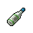

#  鴨嘴獸．泰瑞

|體質|力量|敏捷|智力|幫派|戰鬥等級|勒索難度|持有天賦|取得天賦|
|:--:|:--:|:--:|:--:|:--:|:--:|:--:|:--:|:--:|
|3|4|4|7|無幫派|弱|易|[黑客](技能.md#黑客)|[人工智能](技能.md#人工智能)|

## 故事

一只看上去十分友善的鴨嘴獸。向你講述了投資項目“金銀島”幫他發家致富的故事，並且熱心的邀請你參加他的集資計劃。在他的描繪下，這簡直就是前所未有的財富密碼。

據泰勒所說，因為鴨嘴獸與生俱來的電磁感應，他從小便對電子產品十分了解，而其中最讓他感興趣的則是新興科技電腦。中學即將畢業時，他與幾個朋友一同參加了某個電腦相關的科技競賽，並成功贏得了獎項，因此成功獲得了某名牌大學的錄取名額。

獲得名額的泰勒在高興之餘也犯了難，因為這所大學的學費十分昂貴，作為他這種普通家庭的孩子來說負擔實在太重了。父母為他賣掉了家裡的裁縫鋪，才勉強湊夠了兩年的學費，不過這對於泰勒漫長的大學生活來說還遠遠不夠。

泰勒在課餘時間打了四份零工，一天只吃一頓飯，不去參加任何花銷昂貴學生聚會。在同學眼裡他慢慢成了一個不合群的怪人，但即使如此，他賺到的錢對於學費來說依然是杯水車薪。大二暑假時，泰勒差點萌生了退學的打算，不過還好一個以前一同參加科技競賽的朋友聯系到了他，並給他介紹了一個薪資豐厚的兼職。

那是一項外包工作，內容是為某家金融機構搭建網站，其中涉及到了複雜的網絡買賣功能。但這並難不倒電腦專家泰勒，他只花了半個暑假就搞定了所有需求，並拿到了足以付清整年學費的傭金。

但就如同童年的枕邊故事一樣，天上掉下的“餡餅”往往是個“陷阱”。半年之後，警察找上了門，原來雇傭泰勒製作網站的那家所謂的“金融機構”其實是一家詐騙公司，他們通過龐氏騙局，讓無數的受騙者傾家蕩產，而泰勒所製作的網站正是他們行騙的核心工具。雖然泰勒聲稱自己對於該公司的做法一無所知，但依然被法官判處了從犯罪。

不過泰勒畢竟是名校的高材生，並且受過了生活的歷練，所以這次的不白之冤並沒有將他打垮，反而讓他從中獲得了靈感。他嘲笑那些騙子都是些愚蠢的短視者，他認為如果可以善用網絡與金融的力量，那麼未來的世界就將是屬於他的。

這次的“金銀島”就是最好的證明，他通過自己開發的“人工智能”系統，從世界范圍的金融產品中篩選出了這個盈利概率最大的產品，並且狠賺了一筆！現在他只想努力賺到更多的錢，等出獄之後利用這些錢成立一家網絡金融公司，不出兩年準能成功上市。他承諾如果你參與了這次的集資，那麼他將給予新公司的干股作為回報。

## 結識對話

- **嗨\~伙計！要聽個好消息嗎？**
- :point_right:好消息…？
- :point_right:你好像挺興奮… `好感+5`
- **你知道“金銀島”嗎？**
- {think1}
- :point_right:我讀過這本小說。
- :point_right:這是個…酒的牌子嗎？
- **不\~不是，我說的“金銀島”是現在最火的一項投資！**
- {question1}
- **聽我說\~去年有個航運公司在外海發現了一座無主之島。**
- **經過探測發現，島上居然有個超大的金礦！**
- **可是這家公司缺少開采設備，只能靠賣債券來籌集資金。**
- **現在只要投資一小筆錢，等到金子挖出來的時候，就能分到豐厚的利潤！**
- **我上個月買的債券，短短的時間裡就足足翻了三倍！**
- :point_right:居然會有這種好事？ `好感+10`
- :point_right:真是天上掉餡餅了… `好感+5`
- **現在和你說說剛才的好消息\~**
- **近期那家公司為了擴大開采，準備增發一批新債券。**
- **不過，只有買過第一批債券的投資者才能申購！**
- **而我正好有購買的資格…本著利益最大化，我正在集資。**
- **所以我提議，咱們各出一半的本錢，到時候平分利潤如何？**
- {think1}
- **別猶猶豫豫的了！你不參加，我可就去找別人了…**

## 深入了解對話

- **我說伙計\~集資入伙的事情你考慮的怎麼樣了？**
  - 你還沒找到“搭檔”嗎？
  - 我暫時沒什麼興趣…
- **喂\~我是覺得你看著“投緣”才拉你入伙的。**
- **可別覺得我是在求著你。**
- {think1}
- 那你說說看，要掏多少錢才能“入伙”？
- **我自己會投2500塊，給你打個八折，拿出2000塊咱們就平分收益，如何？**
  - 誰會交給你這麼多錢！
  - 2000塊？你瘋了嗎？
- **哎\~你別只盯著自己的口袋，你還得看得見未來的收益！**
- **按照“金銀島”現在的走勢，不出一個月你的錢就能翻翻。**
- **我要是你，就算借錢也得投！**

#### 拿出`200塊`錢。

> 你正式成了他的“合伙人”，隨後他也重新做了一次自我介紹。

- 我最多只能拿出這麼多，我可沒你那麼有信心。
- **可…這也…太少…**
- **也…行吧！到時候賺了錢，你可別後悔現在投少了。**
- **那讓我們簽個簡單的合同吧…**
- *網絡加金融，聽起來挺靠譜的…*
- 那…我最快多久能拿到收益？
- **你別太心急，咱們現在是一條船上的了，我還能坑你不成？**
- **你作為乘客就安心等著好了\~**
- **我這個船長會載著你駛向真正的“金銀島”！**
- **{smile1}**

#### 取消

- 可別說2000塊，就算是`200塊`我現在也拿不出。
- 這便宜還是讓給別人去占吧…

## 打招呼

### 關係極好

- **錢的事，你得有點耐心，伙計\~**

### 關係好

- **伙計\~你不理財，財不理你。**

### 關係一般

- **伙計\~你不理財，財不理你。**

### 關係不好

- **有事說事，我可忙了。**

### 關係極差

- **怎麼？我可沒興趣和你閒扯。**

## 聊天

- **聽我一句勸，投資要趁早。**
- **你要是不信我說的，可以去圖書室的電腦裡查“金銀島”的官網。**
- **我保證看了收益率，一定會驚掉你的下巴！**
- {think1}

## 初始物品

||||||
|:--:|:--:|:--:|:--:|:--:|
|  |  |  |  |  |
| [拖鞋](道具.md#拖鞋) | [眼鏡](道具.md#眼鏡) | [瀉藥](道具.md#瀉藥)*3 | [酸奶](道具.md#酸奶)*2 | [肥皂](道具.md#肥皂)*2 |
|  |  |  |  |  |
| [除銹劑](道具.md#除銹劑)*3 | [膠帶](道具.md#膠帶)*3 | [白紙](道具.md#白紙)*3 | [鉛筆](道具.md#鉛筆) |  |

## 送禮

|圖片|物品名稱|好感|回應|
|:--:|--|:--:|--|
||[運動鞋](道具.md#運動鞋)|12|這筆投資包你穩賺不賠。|
||[皮鞋](道具.md#皮鞋)|20|咱們搞金融的就該穿的像模像樣，主要是為了讓客戶安心。|
||[帆布鞋](道具.md#帆布鞋)|8|這筆投資包你穩賺不賠。|
||[拖鞋](道具.md#拖鞋)|12|拖鞋可是浴室裡的“正裝”。|
||[墨鏡](道具.md#墨鏡)|10|這筆投資包你穩賺不賠。|
||[眼鏡](道具.md#眼鏡)|20|咱們搞金融的就該穿的像模像樣，主要是為了讓客戶安心。|
||[頭帶](道具.md#頭帶)|-10|伙計…你會願意把錢交給一個這樣打扮的家伙嗎？|
||[棒球帽](道具.md#棒球帽)|12|這筆投資包你穩賺不賠。|
||[毛線帽](道具.md#毛線帽)|8|這筆投資包你穩賺不賠。|
||[紅頭巾](道具.md#紅頭巾)|-8|伙計…你會願意把錢交給一個這樣打扮的家伙嗎？|
||[綠頭巾](道具.md#綠頭巾)|-8|伙計…你會願意把錢交給一個這樣打扮的家伙嗎？|
||[橡膠手套](道具.md#橡膠手套)|-6|伙計…你會願意把錢交給一個這樣打扮的家伙嗎？|
||[黑手](道具.md#黑手)|8|這筆投資包你穩賺不賠。|
||[手錶](道具.md#手錶)|24|咱們搞金融的就該穿的像模像樣，主要是為了讓客戶安心。|
||[護身符](道具.md#護身符)|10|這筆投資包你穩賺不賠。|
||[牙齒項鏈](道具.md#牙齒項鏈)|-12|伙計…你會願意把錢交給一個這樣打扮的家伙嗎？|
||[《死靈之書》](道具.md#《死靈之書》)|12|這筆投資包你穩賺不賠。|
||[自製口罩](道具.md#自製口罩)|8|這筆投資包你穩賺不賠。|
||[隨身聽（開機）](道具.md#隨身聽（開機）)|18|物以稀為貴，在監獄裡這個道理還得加上個平方。|
||[隨身聽（關機）](道具.md#隨身聽（關機）)|18|物以稀為貴，在監獄裡這個道理還得加上個平方。|
||[隨身聽（沒電）](道具.md#隨身聽（沒電）)|18|物以稀為貴，在監獄裡這個道理還得加上個平方。|
||[酒葫蘆](道具.md#酒葫蘆)|10|這筆投資包你穩賺不賠。|
||[黑桃A](道具.md#黑桃A)|6|同樣一張牌，有時最小，有時又最大…重要的是放對位置。|
||[薄荷葉](道具.md#薄荷葉)|4|這筆投資包你穩賺不賠。|
||[薄荷葉卷](道具.md#薄荷葉卷)|6|這筆投資包你穩賺不賠。|
||[蘑菇](道具.md#蘑菇)|4|這筆投資包你穩賺不賠。|
||[蘑菇粉](道具.md#蘑菇粉)|4|這筆投資包你穩賺不賠。|
||[瀉藥](道具.md#瀉藥)|6|這筆投資包你穩賺不賠。|
||[紫鳶花](道具.md#紫鳶花)|4|這筆投資包你穩賺不賠。|
||[花瓣粉](道具.md#花瓣粉)|4|這筆投資包你穩賺不賠。|
||[安眠藥](道具.md#安眠藥)|6|睡覺也要追求效率，使單位時間利益最大化。|
||[止疼片](道具.md#止疼片)|4|這筆投資包你穩賺不賠。|
||[興奮劑](道具.md#興奮劑)|6|這筆投資包你穩賺不賠。|
||[醫用酒精](道具.md#醫用酒精)|4|這筆投資包你穩賺不賠。|
||[酒精燈](道具.md#酒精燈)|8|這筆投資包你穩賺不賠。|
||[鎮靜劑](道具.md#鎮靜劑)|6|這筆投資包你穩賺不賠。|
||[啤酒](道具.md#啤酒)|6|這筆投資包你穩賺不賠。|
||[蘋果酒](道具.md#蘋果酒)|6|這筆投資包你穩賺不賠。|
||[精釀蘋果酒](道具.md#精釀蘋果酒)|8|這筆投資包你穩賺不賠。|
||[蘋果](道具.md#蘋果)|-4|蘋果對我來說實在是一道“硬菜”。|
||[華夫餅](道具.md#華夫餅)|6|這筆投資包你穩賺不賠。|
||[奶油華夫餅](道具.md#奶油華夫餅)|8|這筆投資包你穩賺不賠。|
||[一把咖啡豆](道具.md#一把咖啡豆)|4|這筆投資包你穩賺不賠。|
||[口香糖](道具.md#口香糖)|2|這筆投資包你穩賺不賠。|
||[曲奇餅乾](道具.md#曲奇餅乾)|2|這筆投資包你穩賺不賠。|
||[焦糖棒](道具.md#焦糖棒)|4|這筆投資包你穩賺不賠。|
||[汽水](道具.md#汽水)|4|這筆投資包你穩賺不賠。|
||[酸奶](道具.md#酸奶)|8|謝謝\~伙計，我正需要這個來幫助消化呢。|
||[土豆披薩](道具.md#土豆披薩)|8|這筆投資包你穩賺不賠。|
||[咖啡粉](道具.md#咖啡粉)|4|這筆投資包你穩賺不賠。|
||[茶包](道具.md#茶包)|6|沒什麼能比一杯茶更能讓我心情放鬆了。|
||[超辣泡麵](道具.md#超辣泡麵)|6|這筆投資包你穩賺不賠。|
||[蛋白粉](道具.md#蛋白粉)|6|這筆投資包你穩賺不賠。|
||[布條](道具.md#布條)|-2|實話實說…這個實在缺乏流通價值。|
||[迴紋針](道具.md#迴紋針)|2|這筆投資包你穩賺不賠。|
||[開鎖器](道具.md#開鎖器)|4|這筆投資包你穩賺不賠。|
||[開鎖器(P)](道具.md#開鎖器(P))|4|這筆投資包你穩賺不賠。|
||[肥皂](道具.md#肥皂)|8|股市不要泡沫，但是洗澡需要。|
||[香皂](道具.md#香皂)|16|股市不要泡沫，但是洗澡需要。|
||[計算機](道具.md#計算機)|16|我喜歡按按鈕的感覺，它能緩解我的緊張。|
||[《花花世界》（全新）](道具.md#《花花世界》（全新）)|12|偶爾看看這個也是個不錯的選擇。|
||[《花花世界》（看過）](道具.md#《花花世界》（看過）)|6|這筆投資包你穩賺不賠。|
||[《花花世界》（翻爛）](道具.md#《花花世界》（翻爛）)|4|這筆投資包你穩賺不賠。|
||[馬女郎海報](道具.md#馬女郎海報)|12|這筆投資包你穩賺不賠。|
||[貓女郎海報](道具.md#貓女郎海報)|12|這筆投資包你穩賺不賠。|
||[狐女郎海報](道具.md#狐女郎海報)|12|這筆投資包你穩賺不賠。|
||[兔女郎海報](道具.md#兔女郎海報)|18|知性姑娘的美麗總是那麼的…高級。|
||[咖啡磨](道具.md#咖啡磨)|8|這筆投資包你穩賺不賠。|
||[掌上遊戲機](道具.md#掌上遊戲機)|18|物以稀為貴，在監獄裡這個道理還得加上個平方。|
||[掌上遊戲機（沒電）](道具.md#掌上遊戲機（沒電）)|18|物以稀為貴，在監獄裡這個道理還得加上個平方。|
||[電池](道具.md#電池)|2|這筆投資包你穩賺不賠。|
||[牙刷](道具.md#牙刷)|-4|你能數出我有幾顆牙嗎？答案是零。|
||[牙膏](道具.md#牙膏)|-4|你能數出我有幾顆牙嗎？答案是零。|
||[空的牙膏管](道具.md#空的牙膏管)|-20|垃圾的價值減去倉儲成本，最後的收益將是…負值！|
||[消毒液](道具.md#消毒液)|-2|實話實說…這個實在缺乏流通價值。|
||[除銹劑](道具.md#除銹劑)|-2|實話實說…這個實在缺乏流通價值。|
||[火柴](道具.md#火柴)|-2|實話實說…這個實在缺乏流通價值。|
||[膠帶](道具.md#膠帶)|2|這筆投資包你穩賺不賠。|
||[顏料](道具.md#顏料)|2|這筆投資包你穩賺不賠。|
||[釘子](道具.md#釘子)|-2|實話實說…這個實在缺乏流通價值。|
||[鞋帶](道具.md#鞋帶)|-2|實話實說…這個實在缺乏流通價值。|
||[白紙](道具.md#白紙)|2|這筆投資包你穩賺不賠。|
||[紙鶴](道具.md#紙鶴)|9|有趣的小玩具，沒準能帶來好運。|
||[花束](道具.md#花束)|-8|我可不想捧著一束花在監獄裡走來走去…|
||[胡亂的塗鴉](道具.md#胡亂的塗鴉)|-4|我可不喜歡無序的圖案，這會讓我焦慮…|
||[簡單的漫畫](道具.md#簡單的漫畫)|6|這筆投資包你穩賺不賠。|
||[精美的畫作](道具.md#精美的畫作)|12|嘿\~我想幾年之後，這或許會很值錢。|
||[鉛筆](道具.md#鉛筆)|6|記憶會欺騙你，但寫下的數據不會。|
||[鉛筆](道具.md#鉛筆)|6|記憶會欺騙你，但寫下的數據不會。|
||[圓珠筆](道具.md#圓珠筆)|12|記憶會欺騙你，但寫下的數據不會。|
||[圓珠筆](道具.md#圓珠筆)|12|記憶會欺騙你，但寫下的數據不會。|
||[硬幣](道具.md#硬幣)|6|在我手裡每一塊錢都有無窮潛力。|
||[長螺絲](道具.md#長螺絲)|-6|這個如果被獄警發現，那可就要爆倉了…|
||[扳手](道具.md#扳手)|-12|這個如果被獄警發現，那可就要爆倉了…|
||[湯匙](道具.md#湯匙)|4|這筆投資包你穩賺不賠。|
||[湯匙](道具.md#湯匙)|4|這筆投資包你穩賺不賠。|
||[釘錘](道具.md#釘錘)|-12|這個如果被獄警發現，那可就要爆倉了…|
||[剪刀](道具.md#剪刀)|-8|這個如果被獄警發現，那可就要爆倉了…|
||[碎玻璃](道具.md#碎玻璃)|-20|垃圾的價值減去倉儲成本，最後的收益將是…負值！|
||[玻璃匕首](道具.md#玻璃匕首)|-4|這個如果被獄警發現，那可就要爆倉了…|
||[玻璃匕首(+)](道具.md#玻璃匕首(+))|-6|這個如果被獄警發現，那可就要爆倉了…|
||[牙刷匕首](道具.md#牙刷匕首)|-4|這個如果被獄警發現，那可就要爆倉了…|
||[牙刷匕首(+)](道具.md#牙刷匕首(+))|-6|這個如果被獄警發現，那可就要爆倉了…|
||[水果刀](道具.md#水果刀)|-10|這個如果被獄警發現，那可就要爆倉了…|
||[折斷的木條](道具.md#折斷的木條)|-20|垃圾的價值減去倉儲成本，最後的收益將是…負值！|
||[雙節棍](道具.md#雙節棍)|-8|這個如果被獄警發現，那可就要爆倉了…|
||[雙節棍(+)](道具.md#雙節棍(+))|-10|這個如果被獄警發現，那可就要爆倉了…|
||[釘棒](道具.md#釘棒)|-6|這個如果被獄警發現，那可就要爆倉了…|
||[釘棒(+)](道具.md#釘棒(+))|-8|這個如果被獄警發現，那可就要爆倉了…|
||[鐵管](道具.md#鐵管)|-6|這個如果被獄警發現，那可就要爆倉了…|
||[皮帶](道具.md#皮帶)|8|這筆投資包你穩賺不賠。|
||[皮帶](道具.md#皮帶)|8|這筆投資包你穩賺不賠。|
||[發霉的麵包](道具.md#發霉的麵包)|-40|垃圾的價值減去倉儲成本，最後的收益將是…負值！|
||[金龜子](道具.md#金龜子)|20|哈\~我喜歡這奪目的金色！|
||[《森之音》](道具.md#《森之音》)|8|這筆投資包你穩賺不賠。|
||[DEMO限定紙鶴](道具.md#DEMO限定紙鶴)|50|我不得不夸一夸你的投資眼光…|

