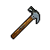

##  黑熊．亨利

|體質|力量|敏捷|智力|幫派|
|:--:|:--:|:--:|:--:|:--:|
|10|9|6|6|尖牙幫成員|

### 故事

一頭外表憨厚的黑熊，總因為吃不飽肚子而發愁。隨著冬天的臨近，他已經開始了冬眠的準備。在你懷疑他是否能在監獄里睡個好覺時，他卻給出了一個意外的答案，那就是“禁閉室”。而贏得這場“夢鄉之旅”的方法，只需要痛扁一頓獄警即可。不知誰會成為這個“幸運兒”呢？

亨利的年紀不算很大，但若論在監獄里待的時間，這家伙一定能排的上號，因為他被抓的時候才剛剛成年。中學時的他有三大愛好，除了吃和睡之外，還有一個就是籃球。就像每個熊小子一樣，他有著自己喜歡的球隊，熱愛的明星，也會為了一張球星卡和朋友大打出手。

一天午餐之後，他的損友棕熊·丹尼告訴了亨利一個秘密。他聽說班里的“富豪”袋獾·杰夫搞到了一張SSR的“自由城利劍隊”冠軍簽名卡。據說憑著那張卡可以獲得一次參觀隊員訓練的機會。

哇\~“自由城利劍隊”！這可是亨利從小喜歡到大的隊伍，他們歷代球員的數據亨利都能倒背如流，能去現場看一次他們的比賽更是他長久以來的夢想。但因為家庭的拮據，他一直沒有這個機會。所以，當他聽到這個消息之後，整個下午都沒能平靜。放學後他找到丹尼說了一個大膽的計劃，他想趁著杰夫一家外出的時候，把那張球星卡給偷出來。

他們倆在杰夫家對面的街口蹲守了兩晚，終於等來了機會。他們看見杰夫一家開車出門，估計是看電影去了。於是亨利用他事先準備好的撬棍弄開了房門，隨後自己待在樓下望風，讓丹尼去二樓杰夫的房間翻找那張球星卡。五分鐘後，一聲突如其來的“別動！混蛋！”打破了夜晚的寂靜。當然，這個聲音不是丹尼的。

亨利躡手躡腳的上到了二樓，發現丹尼正被一個老頭拿槍指著，他應該是杰夫的爺爺？計劃外的出場人物打亂了亨利的計劃，而一旁的丹尼早已被嚇得尿了褲子。情急之下，亨利拿起手中的撬棍，從暗處偷襲了那個老頭，想要把他打暈後逃走。但或許是條件反射，又或許是命中注定，在撬棍擊中老頭的一瞬間，槍響了……

杰夫的爺爺被撬棍擊中了後腦，雖然亨利沒有使出全力，但也足以讓老頭的餘生躺在床上度過了。而丹尼，可憐的丹尼，他就沒這麼幸運了，那顆子彈筆直的打穿了他的心臟。他的鮮血浸透了那張藏進懷里的球星卡，一條年輕的生命就因為這出鬧劇而草草收場了。

### 結識對話

- ***打嗝***
- **肚子好像又有點餓了…**
- 哪有一邊打嗝，一邊喊餓的？
- **這是我的肚子，餓不餓我說了才算！**
- **我一頓要吃掉的東西，比你一天的都多！**
- **而且快到冬天了，不吃多點，冬眠的時候餓醒了怎麼辦？**
- {question1}
- 這里是監獄，每天都要點名，你哪裡有機會冬眠…？
- **呵\~就讓我`黑熊·亨利`來給你上一課吧。**
- **當我想冬眠的時候，只要找個獄警，對他的屁股踹上一腳！**
- **哈\~他就會幫我在`禁閉室`安排一個VIP房間。**
- **到了那時候，我想睡上多久，就能睡多久！**
- {think1}
- …這的確是個“好辦法”。

### 深入了解對話

- **（自言自語）不行\~不行\~這樣根本行不通。**
- **{down1}**
- 喂\~你怎麼愁眉苦臉的？
- **…我的冬眠計劃遇到麻煩了。**
- 嗯？你之前說的“禁閉室”方案行不通了嗎？
- **不\~問題不在睡覺上，而是在食物上。**
- **我目前弄到的冬眠儲備糧還是不夠…**
- **哎\~真想吃一塊`[奶油華夫餅]`補補身子啊。**

#### 給他`[奶油華夫餅]`。

> 他大口吃著華夫餅，奶油沾了一嘴，吞吞吐吐的講了他的故事。

- **哈\~這可幫了我大忙了！我該怎麼謝謝你呢？**
- 干脆…說說你的故事好了。
- *他的故事真是一出自導自演的悲劇…*
- 那你現在還會想起那天晚上發生的事嗎？
- **當然\~有時連著幾晚，丹尼都會出現在我夢里。**
- 既然如此，那你為什麼還想要冬眠？你就不怕…
- **無所謂了，這都是我欠他的。**
- **而且\~這也是我唯一能當面向他道歉的方法。**

#### 取消

- **…你會不會剛好帶著一塊呢？**
- {sweat1}
- 別想好事了\~我身上可沒有。
### 初始物品

|物品名稱|物品名稱|物品名稱|物品名稱|物品名稱|
|:--:|:--:|:--:|:--:|:--:|
|  |  |  |  |  |
| [帆布鞋](道具.md#帆布鞋) | [紅頭巾](道具.md#紅頭巾) | [折斷的木條](道具.md#折斷的木條) | [釘棒](道具.md#釘棒) | [華夫餅](道具.md#華夫餅)*2 |
|  |  |  |  |  |
| [奶油華夫餅](道具.md#奶油華夫餅) | [口香糖](道具.md#口香糖)*3 | [曲奇餅乾](道具.md#曲奇餅乾)*5 | [湯匙](道具.md#湯匙) |  |
### 送禮

|圖片|物品名稱|好感|回應|
|:--:|--|:--:|--|
||[運動鞋](道具.md#運動鞋)|12|你的鞋多大，我的腳就多大。|
||[皮鞋](道具.md#皮鞋)|-10|哦\~這可不是我的風格。|
||[帆布鞋](道具.md#帆布鞋)|0|給我的嗎？這要是吃的就好了…|
||[拖鞋](道具.md#拖鞋)|-8|哦\~這可不是我的風格。|
||[墨鏡](道具.md#墨鏡)|-10|哦\~這可不是我的風格。|
||[眼鏡](道具.md#眼鏡)|-10|哦\~這可不是我的風格。|
||[頭帶](道具.md#頭帶)|10|嘿\~我喜歡這種街頭風格。|
||[棒球帽](道具.md#棒球帽)|12|嘿\~我喜歡這種街頭風格。|
||[毛線帽](道具.md#毛線帽)|0|給我的嗎？這要是吃的就好了…|
||[紅頭巾](道具.md#紅頭巾)|8|嘿\~我喜歡這種街頭風格。|
||[綠頭巾](道具.md#綠頭巾)|0|給我的嗎？這要是吃的就好了…|
||[橡膠手套](道具.md#橡膠手套)|-6|給我這個干嘛？這又不能吃。|
||[黑手](道具.md#黑手)|0|給我的嗎？這要是吃的就好了…|
||[手錶](道具.md#手錶)|0|給我的嗎？這要是吃的就好了…|
||[護身符](道具.md#護身符)|-10|給我這個干嘛？這又不能吃。|
||[牙齒項鏈](道具.md#牙齒項鏈)|12|有的家伙叫我狗熊，那是因為我看起來夠兇。|
||[《死靈之書》](道具.md#《死靈之書》)|-12|給我這個干嘛？這又不能吃。|
||[自制口罩](道具.md#自制口罩)|-8|哦，不\~這可不是我的風格。|
||[隨身聽（開機）](道具.md#隨身聽（開機）)|12|有時候後來點音樂也不錯。|
||[隨身聽（關機）](道具.md#隨身聽（關機）)|12|有時候後來點音樂也不錯。|
||[隨身聽（沒電）](道具.md#隨身聽（沒電）)|12|有時候後來點音樂也不錯。|
||[酒葫蘆](道具.md#酒葫蘆)|0|給我的嗎？…那我就不客氣了。|
||[黑桃A](道具.md#黑桃A)|-8|我討厭卡片，這會讓我想起不好的回憶…|
||[薄荷葉](道具.md#薄荷葉)|-4|我可不能拿這個當飯吃…|
||[薄荷葉卷](道具.md#薄荷葉卷)|-6|我可不能拿這個當飯吃…|
||[蘑菇](道具.md#蘑菇)|4|我喜歡這種蘑菇，味道還不錯\~|
||[蘑菇粉](道具.md#蘑菇粉)|-4|我可不能拿這個當飯吃…|
||[瀉藥](道具.md#瀉藥)|-12|喂\~我這輩子都用不著這玩意兒！|
||[紫鳶花](道具.md#紫鳶花)|-4|……你在想什麼？|
||[花瓣粉](道具.md#花瓣粉)|-4|我可不能拿這個當飯吃…|
||[安眠藥](道具.md#安眠藥)|4|我正需要這個\~我可不想在該冬眠的時候失眠…|
||[止疼片](道具.md#止疼片)|-4|我可不能拿這個當飯吃…|
||[興奮劑](道具.md#興奮劑)|-6|我可不能拿這個當飯吃…|
||[醫用酒精](道具.md#醫用酒精)|-4|我以前喝過這個…真是糟糕的回憶。|
||[酒精燈](道具.md#酒精燈)|-8|給我這個干嘛？這又不能吃。|
||[鎮靜劑](道具.md#鎮靜劑)|-6|我可不能拿這個當飯吃…|
||[啤酒](道具.md#啤酒)|0|這能讓我的心情好起來…|
||[蘋果酒](道具.md#蘋果酒)|0|這能讓我的心情好起來…|
||[精釀蘋果酒](道具.md#精釀蘋果酒)|0|這能讓我的心情好起來…|
||[蘋果](道具.md#蘋果)|4|嘿\~我替我的肚子謝謝你！|
||[華夫餅](道具.md#華夫餅)|12|嘿\~伙計，以後能多送我點這個嗎？|
||[奶油華夫餅](道具.md#奶油華夫餅)|16|嘿\~伙計，以後能多送我點這個嗎？|
||[一把咖啡豆](道具.md#一把咖啡豆)|0|給我的嗎？…那我就不客氣了。|
||[口香糖](道具.md#口香糖)|0|給我的嗎？…那我就不客氣了。|
||[曲奇餅乾](道具.md#曲奇餅乾)|2|嘿\~我替我的肚子謝謝你！|
||[焦糖棒](道具.md#焦糖棒)|8|嘿\~伙計，以後能多送我點這個嗎？|
||[汽水](道具.md#汽水)|4|嘿\~我替我的肚子謝謝你！|
||[酸奶](道具.md#酸奶)|4|嘿\~我替我的肚子謝謝你！|
||[土豆披薩](道具.md#土豆披薩)|16|嘿\~伙計，以後能多送我點這個嗎？|
||[咖啡粉](道具.md#咖啡粉)|0|給我的嗎？…那我就不客氣了。|
||[茶包](道具.md#茶包)|0|給我的嗎？…那我就不客氣了。|
||[超辣泡麵](道具.md#超辣泡麵)|12|嘿\~伙計，以後能多送我點這個嗎？|
||[蛋白粉](道具.md#蛋白粉)|0|給我的嗎？…那我就不客氣了。|
||[布條](道具.md#布條)|-2|給我這個干嘛？這又不能吃。|
||[迴紋針](道具.md#迴紋針)|-2|給我這個干嘛？這又不能吃。|
||[開鎖器](道具.md#開鎖器)|-4|給我這個干嘛？這又不能吃。|
||[開鎖器(P)](道具.md#開鎖器(P))|-4|給我這個干嘛？這又不能吃。|
||[肥皂](道具.md#肥皂)|0|給我的嗎？這要是吃的就好了…|
||[香皂](道具.md#香皂)|0|給我的嗎？這要是吃的就好了…|
||[計算機](道具.md#計算機)|-16|我討厭算數，算數會讓我頭疼！|
||[《花花世界》（全新）](道具.md#《花花世界》（全新）)|0|給我的嗎？這要是吃的就好了…|
||[《花花世界》（看過）](道具.md#《花花世界》（看過）)|0|給我的嗎？這要是吃的就好了…|
||[《花花世界》（翻爛）](道具.md#《花花世界》（翻爛）)|0|給我的嗎？這要是吃的就好了…|
||[馬女郎海報](道具.md#馬女郎海報)|0|給我的嗎？這要是吃的就好了…|
||[貓女郎海報](道具.md#貓女郎海報)|0|給我的嗎？這要是吃的就好了…|
||[狐女郎海報](道具.md#狐女郎海報)|0|給我的嗎？這要是吃的就好了…|
||[兔女郎海報](道具.md#兔女郎海報)|0|給我的嗎？這要是吃的就好了…|
||[咖啡磨](道具.md#咖啡磨)|0|給我的嗎？這要是吃的就好了…|
||[掌上遊戲機](道具.md#掌上遊戲機)|12|嘿\~我一直想要有臺這個。|
||[掌上遊戲機（沒電）](道具.md#掌上遊戲機（沒電）)|12|嘿\~我一直想要有臺這個。|
||[電池](道具.md#電池)|0|給我的嗎？這要是吃的就好了…|
||[牙刷](道具.md#牙刷)|0|給我的嗎？這要是吃的就好了…|
||[牙膏](道具.md#牙膏)|0|給我的嗎？這要是吃的就好了…|
||[空的牙膏管](道具.md#空的牙膏管)|-4|喂！我可不想要你的垃圾！|
||[消毒液](道具.md#消毒液)|-2|給我這個干嘛？這又不能吃。|
||[除銹劑](道具.md#除銹劑)|-2|給我這個干嘛？這又不能吃。|
||[火柴](道具.md#火柴)|-2|給我這個干嘛？這又不能吃。|
||[膠帶](道具.md#膠帶)|-2|給我這個干嘛？這又不能吃。|
||[顏料](道具.md#顏料)|-2|給我這個干嘛？這又不能吃。|
||[釘子](道具.md#釘子)|-2|給我這個干嘛？這又不能吃。|
||[鞋帶](道具.md#鞋帶)|-2|給我這個干嘛？這又不能吃。|
||[白紙](道具.md#白紙)|-2|給我這個干嘛？這又不能吃。|
||[紙鶴](道具.md#紙鶴)|-6|給我這個干嘛？這又不能吃。|
||[花束](道具.md#花束)|-8|……你在想什麼？|
||[胡亂的涂鴉](道具.md#胡亂的涂鴉)|0|給我的嗎？這要是吃的就好了…|
||[簡單的漫畫](道具.md#簡單的漫畫)|0|給我的嗎？這要是吃的就好了…|
||[精美的畫作](道具.md#精美的畫作)|0|給我的嗎？這要是吃的就好了…|
||[鉛筆](道具.md#鉛筆)|-8|我討厭寫字，寫字會讓我頭疼！|
||[鉛筆](道具.md#鉛筆)|-8|我討厭寫字，寫字會讓我頭疼！|
||[圓珠筆](道具.md#圓珠筆)|-16|我討厭寫字，寫字會讓我頭疼！|
||[圓珠筆](道具.md#圓珠筆)|-16|我討厭寫字，寫字會讓我頭疼！|
||[硬幣](道具.md#硬幣)|0|給我的嗎？這要是吃的就好了…|
||[長螺絲](道具.md#長螺絲)|0|給我的嗎？這要是吃的就好了…|
||[扳手](道具.md#扳手)|0|給我的嗎？這要是吃的就好了…|
||[湯匙](道具.md#湯匙)|4|你聽過“常換勺子，吃飯更香”這句話嗎？|
||[湯匙](道具.md#湯匙)|4|你聽過“常換勺子，吃飯更香”這句話嗎？|
||[釘錘](道具.md#釘錘)|0|給我的嗎？這要是吃的就好了…|
||[剪刀](道具.md#剪刀)|0|給我的嗎？這要是吃的就好了…|
||[碎玻璃](道具.md#碎玻璃)|0|給我的嗎？這要是吃的就好了…|
||[玻璃匕首](道具.md#玻璃匕首)|0|給我的嗎？這要是吃的就好了…|
||[玻璃匕首(+)](道具.md#玻璃匕首(+))|0|給我的嗎？這要是吃的就好了…|
||[牙刷匕首](道具.md#牙刷匕首)|0|給我的嗎？這要是吃的就好了…|
||[牙刷匕首(+)](道具.md#牙刷匕首(+))|0|給我的嗎？這要是吃的就好了…|
||[水果刀](道具.md#水果刀)|0|給我的嗎？這要是吃的就好了…|
||[折斷的木條](道具.md#折斷的木條)|0|給我的嗎？這要是吃的就好了…|
||[雙節棍](道具.md#雙節棍)|0|給我的嗎？這要是吃的就好了…|
||[雙節棍(+)](道具.md#雙節棍(+))|0|給我的嗎？這要是吃的就好了…|
||[釘棒](道具.md#釘棒)|0|給我的嗎？這要是吃的就好了…|
||[釘棒(+)](道具.md#釘棒(+))|0|給我的嗎？這要是吃的就好了…|
||[鐵管](道具.md#鐵管)|0|給我的嗎？這要是吃的就好了…|
||[皮帶](道具.md#皮帶)|-8|哦，不\~這可不是我的風格。|
||[皮帶](道具.md#皮帶)|-8|哦，不\~這可不是我的風格。|
||[發霉的麵包](道具.md#發霉的麵包)|-8|你想讓我拉肚子嗎？！|
||[金龜子](道具.md#金龜子)|20|哈\~金色傳說！|
||[《森之音》](道具.md#《森之音》)|-8|給我這個干嘛？這又不能吃。|
||[DEMO限定紙鶴](道具.md#DEMO限定紙鶴)|50|我知道這個，這是朋友之間的證明。|

